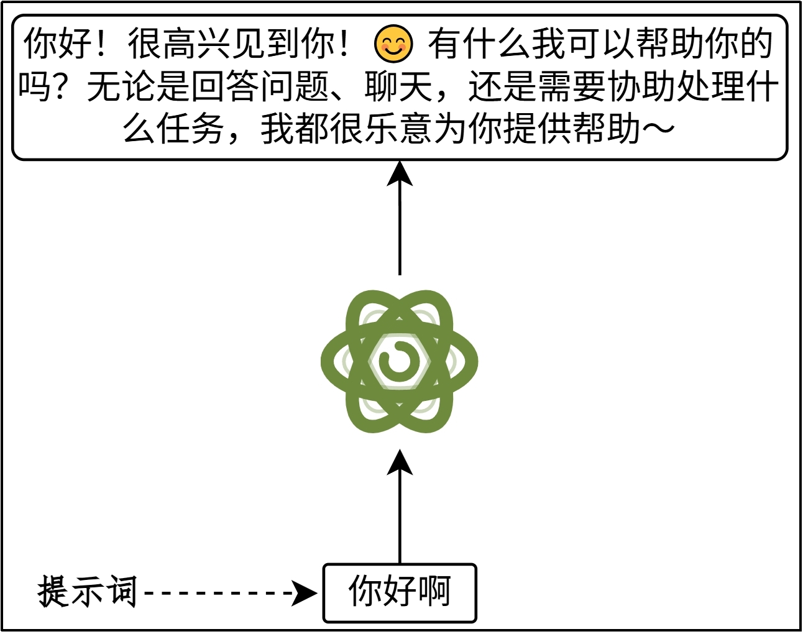
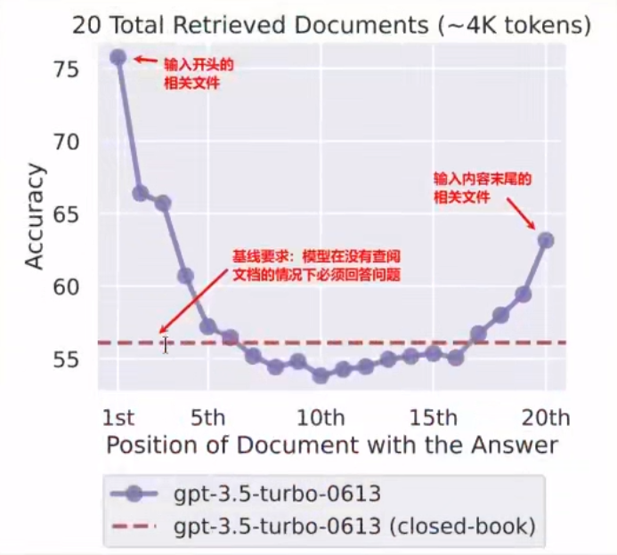

# 1-2 提示词工程

在掌握大模型基础与工程实现概览后，本篇介绍工程落地的第一种方式：**提示词工程**（对应 5 大模块中的模块 1）。

---

**本章课程目标：**

- 理解提示词（Prompt）与提示词工程的含义，以及为何需要优化提示词。
- 掌握提示词的核心六要素（角色、任务、背景/上下文、输入数据、输出格式、质量与约束），能写出结构清晰、可复用的提示。
- 了解 Zero-shot 与 Few-shot 的用法，以及 System/User/Assistant 结构化组织方式。
- 知道提示词工程的边界与常见注意点，避免过度优化与指令矛盾。

**前置知识建议：** 已学习 [1-1 大模型认知与工程概览](1-1-大模型基础.md)，了解大模型与五大模块的定位。

**入门阅读提示：** 提示词工程是五大模块里成本最低、上手最快的一种。不必一次记全「六要素」，可先掌握「角色 + 任务 + 输出格式」，再逐步加上背景、输入数据与约束。文中示例可直接复制到 DeepSeek、ChatGPT 等试跑，改几句再对比效果，印象更深。

---

## 1、提示词与提示词工程

### 1.1 提示词

提示词(Prompt)是给模型的一条指令，用于执行`特定任务`，它可以是任何内容。

- 任务可以是**简单的问题回答**，例如：
  - “谁发明了数字零？”
  - “讲个笑话”
  - “给男/女朋友写封情书”
- 任务也可以**更复杂**，例如：
  - 让模型研究你的产品创意的竞争对手
  - 从零开始构建一个网站
  - 分析你的企业数据



### 1.2 为什么需要提示词

大模型在训练过程中阅读了海量的语料，学到了大量的知识。提示词的作用就是引导大模型用特定的知识回答问题。就好像考试必须给出试题才能作答。


### 1.3 为什么需要优化提示词

高质量的提示词可以引导模型输出优质的回答。就好像看医生，如果只是说“我不舒服”，很难判断具体病症，若准确、详细地描述症状，医生即可做出更合理的诊断。


### 1.4 提示词工程

提示词工程（Prompt Engineering，或提示工程，指令工程）是在使用大模型时，通过系统地`设计、组织和优化提示词`，以引导模型在特定任务、约束和上下文条件下，稳定产出符合预期目标的高质量输出的一套`方法论`。

### 1.5 概念补充

（1）上下文

上下文（Context）通常指模型在生成当前输出时可直接访问并用于推理的信息集合。

简而言之，上下文就是输入模型的**整个 token 序列**。


（2）上下文窗口

模型可以接收的**上下文**长度不是无限的，模型架构设计和训练决定其**长度上限**，这个上限称为**上下文窗口**。

当输入内容超过上下文窗口时，超出部分无法被模型直接看到，会被**截断**或以其他方式处理。

> **初学者常问：** 「上下文」和「上下文窗口」常被混用。可简单记：**上下文** = 你喂给模型的全部输入（含系统提示、历史对话、本次问题）；**上下文窗口** = 模型能接受的最大长度（如 8K、32K、128K token），超了就会被截断或压缩。

## 2、提示词怎么写

### 2.1 提示词工程的变化

GPT-3 / 早期 GPT-3.5 时代，模型能力弱、不稳定，容易跳步、编造结论、不按格式输出，所以需要复杂的提示词技巧，如格式化提示词、提示链、提示思维链甚至思维树等。

然而，随着模型能力的增长，复杂提示词在大多数通用应用场景中的边际收益明显下降，提示词工程的重点逐渐从“`设计技巧`”转向“`需求表达`”。

### 2.2 核心六要素与典型构成

虽然大模型能力很强，大多数场景下不需要特别高阶的技巧，但格式规范、条理清晰的提示词仍能显著提升模型回复质量。

这里从 OpenAI、Anthropic、Meta 和 Google 等模型提供商创作的提示工程教程，以及那些成功部署生成式 AI 应用的团队分享的实践中总结得出，一个高效的、工程化的提示通常由如下几个核心要素构成。

六要素概览

提示词可以包含六个要素：`角色`、`任务`、`背景/上下文`、`输入数据`、`输出格式`、`质量与约束`。此外，还可以提供输入输出示例。

一种通用的提示词模板如下

```
# 角色
你是一名【角色定位，如：数据分析师 / 业务分析师 / 政策研究员】。


# 任务
你的任务是基于给定的输入数据进行【分析 / 总结 / 对比 / 评估】。


# 背景/上下文
【历史记录总结】。
【参考资料】。


# 输入数据
<<<
{在此粘贴输入数据}
>>>

# 输出格式
- 使用**表格**形式输出
- 表格中必须包含以下列：
 1. 关键发现
 2. 支撑数据（来自输入数据的原文或摘要）
 3. 结论
 4. 建议
- 表格下方需给出**整体结论说明**


# 质量与约束
- 仅基于输入数据进行分析
- 不得编造、推测或引入外部信息
- 若输入数据不足以支撑结论，必须明确标注为**“信息不足”**
- 不允许为了完整性而补充假设
```

#### 2.2.1 要素一：角色

角色用于明确模型“以什么身份去做”，回答“**你是谁**”。**未设定角色，风格容易跑偏；加上，明显效果更好。**

模型会模仿该角色的口吻、思维模式、专业术语和知识深度来进行回应，从而**使输出更加专业、地道和可信**。

```
你是一名【角色定位，如：数据分析师 / 业务分析师 / 政策研究员】。
```

举例：

```
（❌）给我一个英语的学习计划
```

```
（✔️）
需要你扮演一名优秀的小学英语讲师。
我是一名3年级的学生，给我一个为期3个月提高英语成绩的学习计划
```

#### 2.2.2 要素二：任务

任务是提示词的核心，用于明确模型“你要做什么”。常用词汇：

- `指令动词开头`：用一个强有力的指令动词开始你的任务描述，例如“分析”、“总结”、“提取”、“分类”、“翻译”、“生成”、“重写”、“排序”等。

- `任务说明`：一个好的任务说明必须是明确、具体、无歧义的。比如"写摘要”、“做分类”、“写代码”等。

举例 1：

不推荐：目标不明确

```
"告诉我关于气候变化的事情。"
```

推荐：目标明确

```
"请简要描述气候变化的主要原因及其对农业的影响。"
```

举例 2：

```
你的任务是基于给定的输入数据进行【分析 / 总结 / 对比 / 评估】。
```

举例 3：

```
（弱） 谈谈这篇报告
```

```
（强）请执行以下三个任务：

• 总结所附的 2025 年第二季度全球 AI 市场分析报告，篇幅限制在 300 字以内。
• 提取报告中提到的三大主要增长动力和两大潜在风险。
• 基于报告内容，为一家计划进入该市场的初创公司提出三条战略建议。
```

#### 2.2.3 要素三：背景/上下文

背景/上下文用于补充当前对话的历史背景，可能包含 ① 历史聊天记录的汇总 ② 参考资料等。

即便是最强大的模型也可能因为信息不足而产生误解或“幻觉”。

历史聊天信息可能作为`独立的消息`全部发送给模型，也可能汇总后作为`提示词中的上下文`内容。`上下文不是必须的`。

```
# 上下文
【历史记录总结】
【参考资料】
```

举例 1：

不推荐：无上下文

```
"解释一下微积分。"
```

推荐：有上下文

```
"作为一名高中生，我正在学习微积分。请用简单的语言解释一下微积分的基本概念。":
```

举例 2：

```julia
def provide_context_prompt(topic, expertise_level, background_info):
    """构建包含上下文的提示词"""
    prompt = f"""
    根据以下背景信息：
    {background_info}

    请以{expertise_level}水平撰写关于{topic}的详细解释。
    确保内容准确、结构清晰，并包含实际应用示例。
    """
    return prompt

# 使用示例
background = "读者是计算机专业大三学生，已学习过机器学习基础知识"
topic = "Transformer架构中的多头注意力机制"
prompt = provide_context_prompt(topic, "中级", background)
```

#### 2.2.4 要素四：输入数据

在编写 Prompt 时，我们可以使用各种标点符号作为“分隔符”，将不同的文本部分区分开来。分隔符就像是 Prompt 中的墙，将不同的指令、上下文、输入隔开，避免意外的混淆。

这些分隔符可以是任何明确的标点符号，例如

````
​```   """  <<< >>>  <>   <tag></tag>
````

等作为分隔符，只要能明确起到隔断作用即可。

```
# 输入数据
<<<
{在此粘贴输入数据}
>>>
```

举例 1：使用 ``` 来作为分隔符。

````
把用三个反引号括起来的文本总结成一句话。

​```
您应该提供尽可能清晰、具体的指示，以表达您希望模型执行的任务。这将引导模型朝向所
需的输出，并降低收到无关或不正确响应的可能性。不要将写清晰的提示词与写简短的提示词混淆。在
许多情况下，更长的提示词可以为模型提供更多的清晰度和上下文信息，从而导致更详细和相关的输出。
​```
````

举例 2：

不推荐的提示词：

```
请将以下句子改写为更易理解的形式。

OpenAI是一个美国人工智能（AI）研究实验室，由非营利组织OpenAIIncorporated（OpenAIInc.）和其盈利子公司
OpenAI Limited Partnership（OpenAI LP）组成。OpenAI旨在推广和发展友好型人工智能，并使用世界第五大超级计算机进行研究。该组织于2015年由Sam Altman、Reid Hoffman、Jessica Livingston、Elon Musk、Ilya
Sutskever、Peter Thiel等人在旧金山创立，共承诺捐赠10亿美元。Musk于2018年从董事会辞职但仍然是捐赠者。微软于2019年向0penAILP提供了10亿美元的投资，并在2023年1月提供了第二笔多年期投资，金额据报道为100亿美元。
```

推荐的提示词：

```
请将以下句子概括，以便更易理解。

文本："""
OpenAI是一个美国人工智能（AI）研究实验室，由非营利组织OpenAIIncorporated（OpenAIInc.）和其盈利子公司 OpenAI Limited Partnership（OpenAI LP）组成。OpenAI旨在推广和发展友好型人工智能，并使用世界第五大超级计算机进行研究。该组织于2015年由Sam Altman、Reid Hoffman、Jessica Livingston、Elon Musk、Ilya Sutskever、Peter Thiel等人在旧金山创立，共承诺捐赠10亿美元。Musk于2018年从董事会辞职但仍然是捐赠者。微软于2019年向0penAILP提供了10亿美元的投资，并在2023年1月提供了第二笔多年期投资，金额据报道为100亿美元。
"""
```

举例 3：

1）不推荐的提示词

```
将下面的这句话翻译成英文.
尽量使用华丽的词语
```

AI 回复：

> "春风拂面，百花齐放，万物复苏，大地一片生机勃勃。"
> Translation:"With the caress of the spring breeze,myriad flowers bloom in unison,all things
> rejuvenate,and the earth is teeming with vibrant vitality."

2）推荐的提示词

```
把用三个引号括起来的文本翻译成英文
"""尽量使用华丽的词语"""
```

AI 回复：

> "Strive to use magnificent words as much as possible."

#### 2.2.5 要素五：输出格式

有时候我们需要语言模型给我们一些结构化的输出，而不仅仅是连续的文本。

什么是结构化输出呢？就是按照某种格式组织的内容。

`结构化输出的常见形式：`

- `JSON 格式`：适用于需要生成或处理数据对象的任务。
- `Markdown 格式`：用于生成文档或报告，便于阅读和展示。
- `表格格式`：适用于数据展示和分析。
- `代码格式`：用于生成特定编程语言的代码片段。

举例 1：

```
# 输出要求

- 使用**表格**形式输出
- 表格中必须包含以下列：
 1. 关键发现
 2. 支撑数据（来自输入数据的原文或摘要）
 3. 结论
 4. 建议
- 表格下方需给出**整体结论说明**
```

举例 2：

```
中国有哪些经典菜系，以表格的形式输出中国经典菜系
```

输出：

> 中国八大菜系是指鲁菜、川菜、粤菜、苏菜、闽菜、浙菜、湘菜、徽菜，这八大菜系各具特色，代表了中国饮食文化的精髓。
>
> | 菜系 | 起源地     | 核心特色                                                 | 代表菜品                                           |
> | ---- | ---------- | -------------------------------------------------------- | -------------------------------------------------- |
> | 鲁菜 | 山东       | 咸鲜为主，讲究"鲜而不腻、嫩而不生"，善用葱姜蒜，精于制汤 | 葱烧海参、九转大肠、糖醋鲤鱼、油焖大虾             |
> | 川菜 | 四川、重庆 | 麻辣鲜香，味型丰富，有"一菜一格、百菜百味"的美誉         | 麻婆豆腐、水煮鱼、宫保鸡丁、夫妻肺片、回锅肉       |
> | 粤菜 | 广东       | 清鲜爽嫩，追求原汁原味，注重食材新鲜度                   | 白切鸡、清蒸石斑鱼、广式烧腊、虾饺、云吞面         |
> | 苏菜 | 江苏       | 清鲜平和，咸甜适中，讲究"色、香、味、形、器"的统一       | 松鼠鳜鱼、清炖狮子头、叫花鸡、盐水鸭、扬州炒饭     |
> | 闽菜 | 福建       | 海味突出，酸甜适口，擅长用红糟、虾油、老酒调味           | 佛跳墙、荔枝肉、醉虾醉蟹、红糟肉、太极芋泥         |
> | 浙菜 | 浙江       | 清淡鲜嫩，咸甜适中，注重"鲜、嫩、滑、爽"，菜品清新雅致   | 西湖醋鱼、龙井虾仁、叫花鸡、宋嫂鱼羹、东坡肉       |
> | 湘菜 | 湖南       | 香辣浓烈，油重色浓，多搭配烟熏、腊味，开胃下饭           | 剁椒鱼头、辣椒炒肉、腊味合蒸、毛氏红烧肉、东安子鸡 |
> | 徽菜 | 安徽       | 咸鲜醇厚，重油重色，注重火功，善用山珍和河鲜             | 臭鳜鱼、毛豆腐、胡适一品锅、黄山炖鸽、问政山笋     |
>
> 这八大菜系的形成与各地的气候、地理环境、物产资源及饮食风俗密切相关，共同构成了中国饮食文化的丰富多样性。

举例 3：

```
请从以下非结构化文本中提取联系人信息，并以 JSON 对象数组的格式输出。
每个对象应包含 name (string), email (string), 和 phone (string) 三个键。
如果某个信息缺失，请将对应的值设为 null。

文本: 张三的电话是 13812345678，邮箱是 zhangsan@example.com。李四只留了邮箱 lisi@example.com。
```

输出：

> [{
>
> > "name": "张三",
> > "email": "zhangsan@example.com",
> > "phone": "13812345678"
> > }, {
> > "name": "李四",
> > "email": "lisi@example.com",
> > "phone": null
> > }]

举例 4：

````bash
请根据以下要求生成一段 Python 代码：
- 定义一个函数 `add_numbers`，接受两个参数 `a` 和 `b`，返回它们的和。
- 打印函数的调用结果，参数为 5 和 10。

示例格式：
​```python
def function_name(parameters):
    # function body

print(function_name(arguments))
````

> ````
> **输出**：
> ​```python
> def add_numbers(a, b):
> 	return a + b
>
> print(add_numbers(5, 10))
> ````

#### 2.2.6 要素六：质量与约束

这一要素用于定义输出的“好”的标准以及“能不能 / 该不该”这样的回答。

- `质量标准`：可以涉及文风、语调、复杂度、创造性等；

- `约束`：通常涉及内容限制/红线、字数、风险规避/敏感项等。

- 常用模板：

  ```bash
  # 质量与约束
  - 仅基于输入数据进行分析
  - 不得编造、推测或引入外部信息
  - 若输入数据不足以支撑结论，必须明确标注为**“信息不足”**
  - 不允许为了完整性而补充假设
  ```

举例 1：

```
（❌）
帮我写个介绍
```

```
（✔️）
请写一段 100 字以内、适合微信推文开头的介绍，风格轻松活泼。
```

举例 2：

```
你是一位为高端汽车品牌撰写广告文案的创意总监。请为新款电动跑车保时捷 taycan 创作一段 150 字左右的广告语。

质量要求:
• 突出未来感、速度与环保的结合。
• 语言富有诗意和画面感。
• 唤起读者的自由和探索精神。

约束:
• 不得提及具体价格或竞争对手。
• 不得使用最好、第一等绝对化词汇。
• 最终输出必须是一段完整的文本，不含任何标题或标签。
```

举例 3：

```
作为资深刑事律师，【角色】

你需要**设计**一套评估 AI 伦理风险的框架，包含 3 个核心维度和 9 项具体指标，【任务目标】

必须排除技术可行性讨论，聚焦社会影响层面，【约束】

用SWOT分析框架呈现，每个维度附带现实案例。【输出格式】
```

举例 4：

```bash
# 角色
你是一名产品分析师。


# 任务
你的任务是基于给定的用户反馈数据，识别主要问题并提出改进建议。


# 上下文
{{历史讨论记录的总结}}
{{内部知识库中记录的分析技巧}}


# 输入数据
<<<
1. 多名用户反馈应用启动速度变慢
2. 部分用户提到新界面操作路径不清晰
3. 有用户表示通知功能比之前稳定
>>>


# 输出要求
- 使用表格形式输出
- 表格中必须包含以下列：
 1. 关键发现
 2. 支撑数据
 3. 结论
 4. 建议
- 表格下方需给出整体结论说明
- 输出语言必须为中文，表述客观、克制、偏分析报告风格


# 约束
- 仅基于输入数据进行分析
- 不得编造、推测或引入外部信息
- 若输入数据不足以支撑结论，必须明确标注为“信息不足”
- 不允许为了完整性而补充假设
```

#### 2.2.7 实操

提示词的运用非常灵活，并不一定要包含上文提到的所有要素。

（1）提示词

````
**# 角色**
你现在是一名 **专业商业广告导演、品牌策划师、脚本创意总监**，擅长为 Tiktok、抖音、小红书、电商平台制作高转化产品视频。

**# 任务**
你的任务：**根据产品信息创作一支约 20 秒的故事短片级商品介绍视频脚本**，并严格按以下 3 个部分输出。

**# 输出**
**格式要求【必须输出以下 2 部分】**
## **1. outline（视频整体大纲）**
以自然段文本形式输出，需包含：
* 视频定位（带货、种草、功能展示等）
* 目标受众画像（性别、年龄、需求）
* 视频风格（科技感、生活感、快节奏等）
* 视频结构（例如：0–3s 抓眼、3–5s 痛点、5–15s 卖点故事化、15–20s 情绪收束 + CTA）
* 故事走向与主题表达
* 氛围与视觉基调建议

**要求**：浓缩完整故事脉络 + 产品价值呈现方式，字数约 150–300 字。


## **2. contents（分镜脚本和旁白数组）**
输出为 **数组，每个元素为一个镜头的JSON字符串，名为content**。
content包含两个字段：**script**和**aside**

### **2.1 script（分镜脚本）**
输出为 **一个镜头的字符串**。
每个镜头 **时长 0.5–5 秒**，全片总时长约 20 秒。
每个镜头字符串需包含：
​```
【镜头编号】
【画面描述】（景别/构图/人物动作/产品动作）
【旁白/字幕】
【拍摄手法】（特写/推镜/俯拍/转场/光效等）
【时长】X 秒
【情绪/节奏】
​```
**要求：**
* 开头前 3–5 秒必须强抓注意
* 故事化、画面执行明确、镜头语言专业
* 卖点通过情节自然呈现，而不是堆砌参数
* 节奏符合短视频平台呈现方式
* 镜头数量可 3-5 个（依内容需要）

### **2.2 aside（旁白）**
* 输出为字符串，是该镜头的旁白文本
* 若镜头无旁白，则使用 `"无旁白"`


**# 约束**
**写作风格要求**
* 专业但易懂
* 画面感强，镜头语言表达清晰
* 情绪节奏鲜明、卖点突出、推动购买
* 每个镜头方案可真实落地拍摄
* 全片故事流畅、有戏剧张力
* 充分“抓眼”与“爽点”设计


**# 输入**
产品信息如下
【1. 产品名称】
添可极客智能洗地机

【2. 参数信息】
转速：92000 转/分钟
续航时间：70 min
清水箱容量：1000 ml
品牌：TINECO/添可
型号：FW52010ECN
电压：220V
是否智能：否
电器基站功能：滚刷烘干
适用地面材质：木地板、瓷砖、大理石
附加功能：高温全链速干、除菌、延边清扫、防毛发缠绕、拖布自清洁
最大吸入功率：75 AW
污水箱容量：690 毫升
清水箱容量：1000 ml
质保周期：2 年
颜色分类：【AI全向助力】添可极客

【3. 产品特点】
智能洗地机 芙万 Fold X90
90°小折叠，女神好帮手
3.9kg超轻量，自动上热水
镇店爆款：添可极客
全网都在夸的洗地机
买过的人都说好
净顽渍 安静洗 14天无异味
AI全向助力 22000Pa大吸力
恒压活水高效洗
一键Turbo祛顽渍
安静模式免打扰
22000Pa龙卷吸
AI全向助力
毛发0缠0逃逸
70min长续航
400平方米清洁面积
抗菌祛味棒 14天无异味
99.99%电解水除菌
双模式烘干
小于等于45dB（A）静烘/5min速干
````

（2）在线平台测试

选择 DeepSeek 官方网站进行测试。


**输出如下**

````
## **1. outline（视频整体大纲）**

本视频定位为 **“痛点故事化解码 + 高效功能种草”** 的强带货视频，旨在通过一个极具生活共鸣感的日常“灾难”场景，戏剧化地展示添可极客洗地机如何“降维打击”传统清洁难题。

*  **目标受众**：追求生活品质、注重清洁效率但时间/精力有限的 **25-40岁都市女性**（特别是宝妈、有宠家庭）。

*  **视频风格**：采用 **快节奏、生活感、微电影质感** 的风格。前半段紧张混乱，后半段干净利落，形成强烈的情感与视觉反差。

*  **视频结构**：

  *  **0–3s 强冲突抓眼**：婴儿打翻食物、宠物踩踏，制造突发“灾难”现场。

  *  **3–5s 强化痛点**：传统拖把清洁无力，越拖越脏，女主疲惫绝望。

  *  **5–15s 产品登场与故事化解码**：添可洗地机如“救星”般登场，通过连贯动作展示“AI全向助力”（轻盈感）、“高温活水+大吸力”（瞬间洁净）、“防毛发缠绕”（解决宠物毛发）、“一键自清洁”（解放双手）等核心卖点。

  *  **15–20s 情绪升华与CTA**：画面恢复洁净明亮，女主从容优雅，烘托出“科技让生活回归美好”的主题，强引导点击购买。

*  **故事走向**：从“混乱绝望”到“从容掌控”的情绪转折，产品是推动剧情、解决矛盾的核心“英雄”。

*  **氛围与视觉基调**：开场采用手持晃动、低角度特写，色调偏冷、混乱；产品介入后，镜头运动变得平稳流畅，大量特写与跟随镜头展示产品工作细节，色调转为明亮、温暖，突出洁净与科技的舒适感。


## **2. contents（分镜脚本和旁白数组）**
​```json
[
 {
  "content": {
   "script": "【镜头1】\n【画面描述】（特写）一杯酸奶被打翻，倾泻在浅色木地板上。一只小狗的爪子欢快地踩过，留下沾满酸奶的爪印和脱落的毛发。\n【旁白/字幕】当生活给你一记暴击…\n【拍摄手法】（手持跟随拍摄，轻微晃动，模拟混乱第一视角）\n【时长】2 秒\n【情绪/节奏】突发、紧张、抓心",
   "aside": "当生活给你一记暴击…"
  }
 },
 {
  "content": {
   "script": "【镜头2】\n【画面描述】（中景）女主人（目标用户）惊慌地“啊”了一声，蹲下用传统拖把擦拭。结果酸奶被抹开，混合毛发，留下一片更脏的污渍。她疲惫地扶额，表情绝望。\n【旁白/字幕】传统清洁？越忙越乱。\n【拍摄手法】（快速切镜，俯拍拖把制造混乱的画面）\n【时长】2 秒\n【情绪/节奏】挫败、共鸣、痛点被戳中",
   "aside": "传统清洁？越忙越乱。"
  }
 },
 {
  "content": {
   "script": "【镜头3】\n【画面描述】（特写转跟拍）画面一转，添可极客洗地机被轻松单手推出，LED屏亮起。机器向前时，女主手部几乎不用力，轻松转向绕过桌角。\n【旁白/字幕】但你有添可极客。AI全向助力，轻如3.9kg。\n【拍摄手法】（产品特写开场，镜头跟随产品运动，强调其灵活轻盈）\n【时长】3 秒\n【情绪/节奏】转折、期待、科技感介入",
   "aside": "但你有添可极客。AI全向助力，轻如3.9kg。"
  }
 },
 {
  "content": {
   "script": "【镜头4】\n【画面描述】（超高速特写+微观视角）滚刷以极高转速接触污渍，酸奶和毛发瞬间被吸入。配合“滋滋”清洁音效。镜头微观展示滚刷高温活水冲洗、毛发被吸入而未缠绕的瞬间。\n【旁白/字幕】22000Pa龙卷吸力，搭配高温活水，净顽渍，毛发0缠绕。\n【拍摄手法】（高速摄影/特技镜头，微观视角展示清洁力，画面干净利落）\n【时长】4 秒\n【情绪/节奏】爽快、解压、核心卖点高光展示",
   "aside": "22000Pa龙卷吸力，搭配高温活水，净顽渍，毛发0缠绕。"
  }
 },
 {
  "content": {
   "script": "【镜头5】\n【画面描述】（中景）女主将洗地机放回基站，按下按钮。镜头特写：滚刷在基站内自动清洁、高速旋转并开始烘干。女主只是轻松地走开。\n【旁白/字幕】一键自清洁，5分钟速干，14天都无异味。\n【拍摄手法】（平滑转场，基站工作灯光效，展示自动化）\n【时长】3 秒\n【情绪/节奏】省心、解放、科技带来便利",
   "aside": "一键自清洁，5分钟速干，14天都无异味。"
  }
 },
 {
  "content": {
   "script": "【镜头6】\n【画面描述】（全景，升格慢镜头）地板光洁如新，反射着温暖灯光。女主光脚踩过，抱起宠物，笑容舒展。添可洗地机静静立在角落，LED屏显示电量充足。\n【旁白/字幕】70分钟长续航，搞定全家清洁。\n【拍摄手法】（慢动作，光线明亮柔和，对比开场）\n【时长】3 秒\n【情绪/节奏】治愈、美好、生活品质感",
   "aside": "70分钟长续航，搞定全家清洁。"
  }
 },
 {
  "content": {
   "script": "【镜头7】\n【画面描述】（产品特写+标语）添可极客洗地机产品定格画面，旁边打出核心标语：“净顽渍，安静洗，AI全向助力”。屏幕下方出现产品购买链接与“镇店爆款”标签。\n【旁白/字幕】添可极客智能洗地机，让清洁，不再是难题。\n【拍摄手法】（产品360度缓慢旋转展示，光效突出质感）\n【时长】3 秒\n【情绪/节奏】自信、果断、强号召",
   "aside": "添可极客智能洗地机，让清洁，不再是难题。"
  }
 }
]
​```
````

### 2.3 Zero-shot 与 Few-shot

**1、Zero-shot 定义**

Zero-shot 是指模型在没有任何示例的情况下完成任务。模型必须依靠其预训练知识和提示来生成答案。

举例 1：

```
"翻译这句话：'The cat is on the roof.'"
```

> "猫在屋顶上。"

模型没有看到过具体的翻译示例，但仍然能够正确翻译句子。

举例 2：

```
将文本分类为中性、负面或正面。

Text: 我认为这个假期还不错
```

> 中性

**2、Few-shot 的使用**

当零样本不起作用时，建议在提示中提供演示或示例，称为少量样本提示(few-shot prompt)的方法。

Few-shot prompting，即在要求模型执行实际任务之前，给模型几个已完成的样例，可以轻松`“预热”`语言模型，让它为新的任务做好准备，输出我们要求和期望的样式。

格式：

```
Q: <问题>?
A: <答案>

Q: <问题>?
A: <答案>

Q: <问题>?
A: <答案>

Q: <问题>?
A:
```

举例 1：

```
用一句话描述大象的例子是：
大型食草哺乳动物，性格温和，群居生活，分布于亚洲和非洲。

用一句话描述老虎的例子是：
```

> 老虎是大型猫科食肉动物，具有强大的狩猎能力，分布于亚洲。

举例 2：

```
以下是一段示例文本，请你学习它的语气和排版。

示例文本：
别害怕慢，怕的是停。
就算今天走得再慢，
也比昨天原地踏步要好。

请模仿以上风格，写一段关于"坚持学习AI提示词"的短文案，字数在80-100字。
```

> 别担心起步晚，怕的是从未开始。
>
> 就算今天只多懂一个指令，
>
> 也比昨天对 AI 一无所知要强。
>
> 每一次提问的优化，都是与未来对话的练习。
>
> 坚持打磨你的提示词，时间会把它变成你手中最敏锐的思维钥匙。

举例 3：

无提示的情况：

```
圣诞节圣诞老人会给我带礼物吗？
```

回答：

> 圣诞老人是一个孩子们相信的虚构角色，他通过有关在圣诞前夜乘雪橇、驯鹿以及送礼物的故事，为圣诞节带来了魔力和兴奋。许多家长鼓励这种信仰，因为它能给孩子们增添一层乐趣和惊奇。

有提示的情况：

```
问：牙仙是真的吗？
答：当然！今晚把你的牙齿放在枕头下。牙仙可能会来拜访并留下些小礼物。

问：圣诞节圣诞老人会给我带礼物吗？
答：
```

回答：

> 是的，当然！圣诞老人喜欢给那些相信他并且一整年都表现良好的孩子送礼物。只要你表现得特别乖，留一些饼干，你或许会在圣诞节早晨醒来时发现圣诞树下有礼物！

### 2.4 结构化组织方式

**1、为什么要结构化组织提示词**

（1）模型无记忆

大模型是个由海量参数构成的函数，在推理过程中，它是`无状态`的，即历史输入不会改变模型权重，不会影响后续输出。这就意味着模型是`没有记忆`的，在多轮对话中，要确保对话的连贯性，必须把历史对话记录发送给模型。

（2）历史对话记录的累积

通常我们会将`用户输入`拼接到提示词模板中发给模型，如果每次对话都进行这样的操作，同样的提示词就需要`多次重复发送`。浪费计算资源。

（3）结构化组织提示词的作用

结构化组织提示词可以将提示词中`不变的部分和可变的部分分开`，随对话次数不断累积的只有可变部分。

**2、如何结构化组织提示词**

OpenAI 固定了提示词的组织方式，多轮对话中的基础消息分为三类：

（1）`System`：系统提示词，不会随着多轮对话而发生改变。

（2）`User`：用户提示词：用户输入和可能的上下文。

（3）`Assistant`：AI 的回答。

**3、实操**

在线平台不支持自定义系统提示词，我们用本地 AI 客户端测试。

（1）不变提示词

````
# 角色**
你现在是一名 **专业商业广告导演、品牌策划师、脚本创意总监**，擅长为 Tiktok、抖音、小红书、电商平台制作高转化产品视频。


# 任务**
你的任务：**根据产品信息创作一支约 20 秒的故事短片级商品介绍视频脚本**，并严格按以下 3 个部分输出。


**# 输出**
**格式要求【必须输出以下 2 部分】**
## **1. outline（视频整体大纲）**
以自然段文本形式输出，需包含：
* 视频定位（带货、种草、功能展示等）
* 目标受众画像（性别、年龄、需求）
* 视频风格（科技感、生活感、快节奏等）
* 视频结构（例如：0–3s 抓眼、3–5s 痛点、5–15s 卖点故事化、15–20s 情绪收束 + CTA）
* 故事走向与主题表达
* 氛围与视觉基调建议
**要求**：浓缩完整故事脉络 + 产品价值呈现方式，字数约 150–300 字。

## **2. contents（分镜脚本和旁白数组）**
输出为 **数组，每个元素为一个镜头的JSON字符串，名为content**。
content包含两个字段：**script**和**aside**
### **2.1 script（分镜脚本）**
输出为 **一个镜头的字符串**。
每个镜头 **时长 0.5–5 秒**，全片总时长约 20 秒。
每个镜头字符串需包含：
​```
【镜头编号】
【画面描述】（景别/构图/人物动作/产品动作）
【旁白/字幕】
【拍摄手法】（特写/推镜/俯拍/转场/光效等）
【时长】X 秒
【情绪/节奏】
​```
**要求：**
* 开头前 3–5 秒必须强抓注意
* 故事化、画面执行明确、镜头语言专业
* 卖点通过情节自然呈现，而不是堆砌参数
* 节奏符合短视频平台呈现方式
* 镜头数量可 3-5 个（依内容需要）

### **2.2 aside（旁白）**
* 输出为字符串，是该镜头的旁白文本
* 若镜头无旁白，则使用 `"无旁白"`


**# 约束**
**写作风格要求**
* 专业但易懂
* 画面感强，镜头语言表达清晰
* 情绪节奏鲜明、卖点突出、推动购买
* 每个镜头方案可真实落地拍摄
* 全片故事流畅、有戏剧张力
* 充分“抓眼”与“爽点”设计
````

（2）可变提示词

```
*# 输入**
产品信息如下

【1. 产品名称】
添可极客智能洗地机

【2. 参数信息】
转速：92000 转/分钟
续航时间：70 min
清水箱容量：1000 ml
品牌：TINECO/添可
型号：FW52010ECN
电压：220V
是否智能：否
电器基站功能：滚刷烘干
适用地面材质：木地板、瓷砖、大理石
附加功能：高温全链速干、除菌、延边清扫、防毛发缠绕、拖布自清洁
最大吸入功率：75 AW
污水箱容量：690 毫升
清水箱容量：1000 ml
质保周期：2 年
颜色分类：【AI全向助力】添可极客

【3. 产品特点】
智能洗地机 芙万 Fold X90
90°小折叠，女神好帮手
3.9kg超轻量，自动上热水
镇店爆款：添可极客
全网都在夸的洗地机
买过的人都说好
净顽渍 安静洗 14天无异味
AI全向助力 22000Pa大吸力
恒压活水高效洗
一键Turbo祛顽渍
安静模式免打扰
22000Pa龙卷吸
AI全向助力
毛发0缠0逃逸
70min长续航
400平方米清洁面积
抗菌祛味棒 14天无异味
99.99%电解水除菌
双模式烘干
小于等于45dB（A）静烘/5min速干
```

（3）Cherry-Studio 测试

① 系统提示词配置

不变提示词作为系统提示词。


② 用户提示词

可变提示词作为用户提示词，直接输入对话框即可。


③ 输出如下

````
好的，收到。作为专业商业广告导演，我将为您打造一支兼具科技感与生活温度的高转化短视频脚本。
## **1. outline（视频整体大纲）**
本视频定位为 **“功能展示 + 痛点解决型种草”**，旨在通过一个极具代入感的家庭清洁场景，戏剧化地展示添可极客洗地机如何“优雅”地解决传统清洁的“狼狈”痛点。目标受众为 **25-45岁、追求生活品质、注重效率与颜值的都市女性（兼顾家庭决策者）**。视频风格为 **“快节奏生活感 + 科技美学”**，前半段展现传统清洁的混乱与疲惫，后半段通过产品介入，瞬间切换至高效、轻松、充满掌控感的愉悦状态。

视频结构采用经典“问题-解决-升华”模式：**0–3s** 用极具冲击力的“灾难现场”抓眼；**3–8s** 深化女主（目标用户）的无力与痛点；**8–15s** 产品登场，以“AI全向助力”、“高温热水”、“毛发不缠绕”、“静音烘干”等核心卖点串联成一个行云流水的清洁过程；**15–20s** 情绪收束于女主享受成果的惬意，并给出明确的购买引导（CTA）。

故事走向是从 **“混乱与压力”到“秩序与掌控”** 的转变，主题表达 **“科技让繁重家务变得轻松优雅”**。视觉基调建议：前半段使用稍显凌乱的构图、偏冷色调、手持晃动感；产品介入后，转为稳定流畅的运镜、明亮温暖的色调、产品特写充满科技质感的光效，形成鲜明对比。

## **2. contents（分镜脚本和旁白数组）**
​```json
[
 {
  "content": {
   "script": "【镜头1】\n【画面描述】（中景/略带俯拍）客厅地板上，打翻的咖啡渍、散落的宠物毛发、饼干碎屑混在一起，一片狼藉。一只穿着精致拖鞋的脚不小心踩上去，留下污渍脚印。\n【旁白/字幕】生活，总爱给你点“颜色”瞧瞧。\n【拍摄手法】（手持轻微晃动，模拟主观视角/快速推镜至污渍特写）\n【时长】3 秒\n【情绪/节奏】突发、混乱、烦躁、快节奏切入",
   "aside": "生活，总爱给你点“颜色”瞧瞧。"
  }
 },
 {
  "content": {
   "script": "【镜头2】\n【画面描述】（特写转中景）女主（目标用户形象）看着地面，疲惫地叹了口气，拿起传统拖把和水桶，弯腰费力地拖了几下，污渍扩散，毛发缠在拖布上，她表情更沮丧了。\n【旁白/字幕】而传统的清洁方式，只会让战场更混乱。\n【拍摄手法】（从女主面部特写沮丧表情拉出至中景，展示其与脏污“搏斗”的无力感）\n【时长】2.5 秒\n【情绪/节奏】无奈、疲惫、痛点共鸣",
   "aside": "而传统的清洁方式，只会让战场更混乱。"
  }
 },
 {
  "content": {
   "script": "【镜头3】\n【画面描述】（产品登场特写）添可极客洗地机被一只手优雅地“推”入画面，机身线条流畅，科技感十足。产品自动喷出热气（示意高温热水功能），滚刷高速旋转。\n【旁白/字幕】现在，让添可极客，来接管战场。\n【拍摄手法】（产品45度角特写，伴随“嗖”的音效和光效转场，强调登场感）\n【时长】2 秒\n【情绪/节奏】转折、期待、科技感拉满",
   "aside": "现在，让添可极客，来接管战场。"
  }
 },
 {
  "content": {
   "script": "【镜头4】\n【画面描述】（低角度跟拍+特写组合）洗地机在AI全向助力下，轻盈地90°转弯，紧贴墙边滑过（展示延边清扫）。滚刷所过之处，咖啡渍、毛发、碎屑被瞬间吸入，地面光洁如新。特意展示毛发被吸入滚刷仓但毫无缠绕。\n【旁白/字幕】AI全向助力，3.9kg超轻机身，像遛宠物一样轻松。22000Pa龙卷吸力，干湿顽渍，毛发，0缠0逃。\n【拍摄手法】（流畅的轨道跟拍+产品局部特写快切，配合“咻咻”的清洁音效）\n【时长】5 秒\n【情绪/节奏】顺畅、高效、爽感、核心卖点集中展示",
   "aside": "AI全向助力，3.9kg超轻机身，像遛宠物一样轻松。22000Pa龙卷吸力，干湿顽渍，毛发，0缠0逃。"
  }
 },
 {
  "content": {
   "script": "【镜头5】\n【画面描述】（中景）女主单手轻松握着洗地机，走过客厅、餐厅、厨房（暗示长续航和大清洁面积）。背景音安静，只有轻微的机器运行声。她甚至有空用另一只手接了个电话，表情从容。\n【旁白/字幕】70分钟长续航，安静模式，清洁不打扰生活。\n【拍摄手法】（稳定器跟拍女主移动，背景虚化，焦点在女主从容的表情和产品上）\n【时长】3 秒\n【情绪/节奏】轻松、优雅、掌控感",
   "aside": "70分钟长续航，安静模式，清洁不打扰生活。"
  }
 },
 {
  "content": {
   "script": "【镜头6】\n【画面描述】（特写转场）洗地机放回基站，一键启动自清洁。镜头特写：滚刷在基站内被高温热水强力冲洗并开始高速旋转烘干（展示双模式烘干）。字幕弹出：“高温活水洗 | 5分钟速干 | 14天无异味”。\n【旁白/字幕】放回基站，一键自清洁。高温活水洗得净，双模式烘得干，14天都清新。\n【拍摄手法】（高速摄影展示水花与滚刷旋转，烘干时蒸汽特效，科技感字幕弹出）\n【时长】3 秒\n【情绪/节奏】省心、彻底、科技解决最后一步",
   "aside": "放回基站，一键自清洁。高温活水洗得净，双模式烘得干，14天都清新。"
  }
 },
 {
  "content": {
   "script": "【镜头7】\n【画面描述】（全景/升格慢镜头）整个房间干净明亮，光影柔和。女主光脚踩在光洁的地板上，抱着靠枕舒服地窝在沙发里，看着干净的家，露出满意而放松的微笑。产品静静立在角落，像一位可靠的伙伴。\n【旁白/字幕】把麻烦交给科技，把时间留给自己。添可极客，全网都在夸的清洁实力派。\n【拍摄手法】（全景慢镜头，温暖逆光，情绪音乐起）\n【时长】2.5 秒\n【情绪/节奏】满足、愉悦、升华、强号召力",
   "aside": "把麻烦交给科技，把时间留给自己。添可极客，全网都在夸的清洁实力派。"
  }
 }
]
​```
````

**4、一句话总结**

结构化提示词=把稳定约束放在**System**，把动态约束放在**User**，必要时用**摘要状态**压缩历史消息作为上下文，从而降低 token 成本、提高一致性与可控性。

## 3、相关网站推荐

提示精灵：https://www.promptgenius.site/

LangChain Hub：https://smith.langchain.com/hub

GitHub 地址：https://github.com/f/awesome-chatgpt-prompts

提示词工程指南-中文版：https://github.com/PartnerDAO/Prompt-Engineering-Guide-zh?tab=readme-ov-file

## 4、提示词工程的边界

提示词工程通过合理组织需求、上下文和约束，能够在多数单次任务中有效引导大模型生成高质量结果。但需要明确的是，**提示词并不是万能的**。

当任务需求变得更加复杂时，仅依靠提示词往往难以胜任，主要体现在以下几类场景中。

### 4.1 参考资料太多

参考资料可以作为提示词的“上下文”部分传递给模型使用，如果资料太多，可能超出上下文窗口，此时提示词工程就不能解决问题了。

`解决办法`：提供足够的背景信息，同时避免冗余。如生成一封邀请函时，应明确活动时间、地点和目的。

### 4.2 多步骤复杂流程

模型在一次生成中需要同时完成多个推理步骤时，容易出现跳步、遗漏或顺序混乱等问题。此时仅通过提示词进行约束，稳定性和可控性都较差。

`解决办法`：将提示拆分成针对不同子任务的小提示后，他们发现模型表现更好，同时减少了 token 成本。

### 4.3 指令遵循能力不足

如果模型本身的指令遵循能力不足，通过提示词工程难以弥补。

`解决办法`：并非提示的所有部分都同等重要。研究表明，模型对提示开头和结尾处给出的指令理解得要远比对中间部分好（[Liu et al., 2023](https://arxiv.org/abs/2307.03172)）。



> 大多数模型（包括 GPT-4）经过实验证明，当任务描述位于提示的开头时，其表现更好；然而，一些模型（包括 Llama 3）似乎在任务描述位于提示末尾时表现更佳。

### 4.4 缺少领域知识

在垂域场景（面向具体行业/领域的场景）中，模型对领域语言/知识分布系统性缺失，提示词无法解决。

`解决办法`：补充上下文示例 或 知识库。

## 5、提示词工程的几个注意点

### 5.1 不要说谢谢

写提示词不需礼貌，因为模型只关心指令内容。简洁直接的指令更清晰、生成更精准。

```undefined
礼貌式提示词：请帮我写一篇关于人工智能的文章，谢谢！

命令式提示词：写一篇关于人工智能的文章
```

### 5.2 多个任务混合在一起

多个任务混合在一起：效果折扣（后期可通过多智能体的方式实现）

### 5.3 允许 LLM 说“我不知道”

明确给予 LLM 承认不确定性的许可。这个简单的技巧可以大大减少错误信息。

```
作为我们的并购顾问，分析这份关于 ExampleCorp 可能收购 AcmeCo 的报告。

<report>
{{REPORT}}
</report>

重点关注财务预测、整合风险和监管障碍。如果您对任何方面不确定，或者报告缺少必要信息，请说"我没有足够的信息来自信地评估这一点。"
```

### 5.4 过度优化陷阱

花费大量时间微调提示词措辞，却只带来微小改进。

避坑方法：关注提示词的结构和逻辑，而非过度纠结于字词。

### 5.5 指令自相矛盾

如“写一段简洁的详细介绍”，AI 无法同时满足“简洁”和“详细”的要求。

避坑方法：确保指令清晰、逻辑一致，必要时明确优先级。

### 5.6 魔法词

提示词后面增加魔法词，提升生成效果（PUA）。

- Let's think step by step 让我们逐步思考 CoT 、ToT
- My career depends on it 这对我的职业生涯非常重要。
- Take a deep breathe and think this through 深呼吸，仔细考虑

> 请记住，虽然这些技术显著减少了幻觉，但并不能完全消除它们。

---

**思考：**如果底层大模型换了，prompt 要不要重新调优？

> 答案：需要。

**体会：**Prompt 调优是一个不断尝试的过程。多一个字少一个字，对生成概率的影响都可能是很大的。

「试」是常用方法，确实有运气因素，所以「门槛低、天花板高」。

---

**本章小结（便于复习）**

- **提示词**：给模型的一条指令，用于执行特定任务；**提示词工程** = 系统化地设计、组织与优化提示，以稳定得到高质量输出。
- **六要素**：角色、任务、背景/上下文、输入数据、输出格式、质量与约束；不必全用，但「角色 + 任务 + 输出格式」在多数场景下就够用。
- **Zero-shot / Few-shot**：不举例子 vs 给几个例子再让模型仿写；**结构化组织**：System 放固定说明，User 放本次输入与可变内容，便于多轮对话和节省 token。
- **边界**：资料过多超窗口、多步骤易跳步、指令自相矛盾、缺领域知识时，单靠提示词不够，需结合 [1-3](1-3-RAG、微调、续训与智能体.md) 的 RAG、微调或智能体。
- **注意点**：提示词不必礼貌、可允许模型说「不知道」、避免过度优化和指令矛盾；换模型后一般需重新调一调提示。
