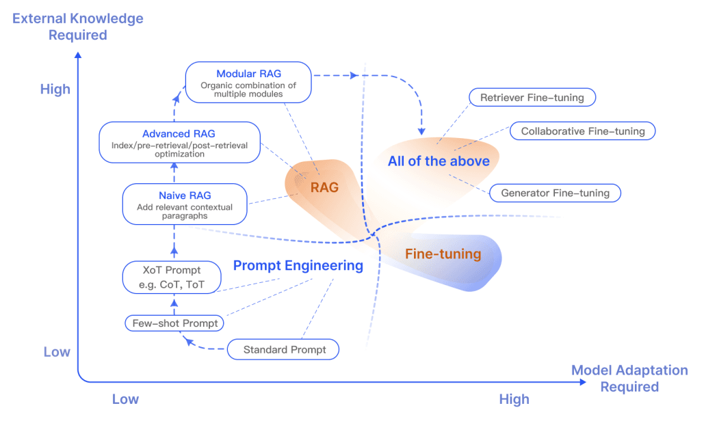
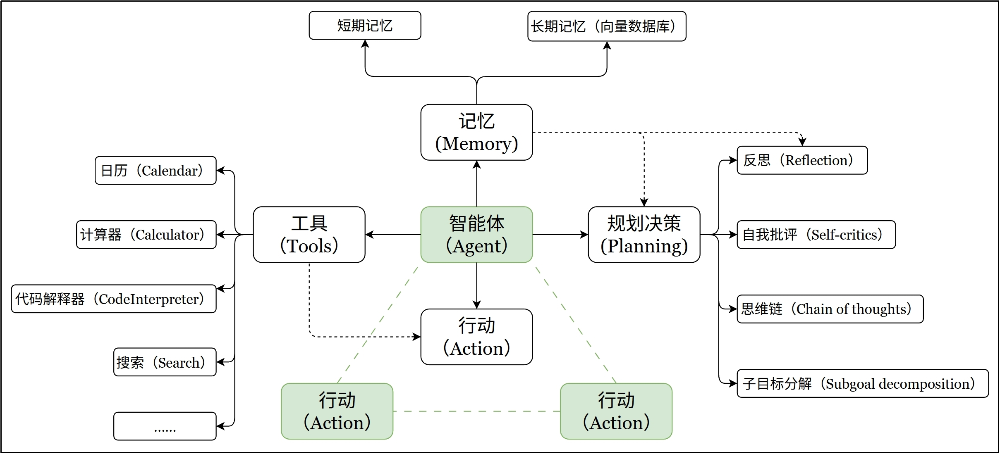
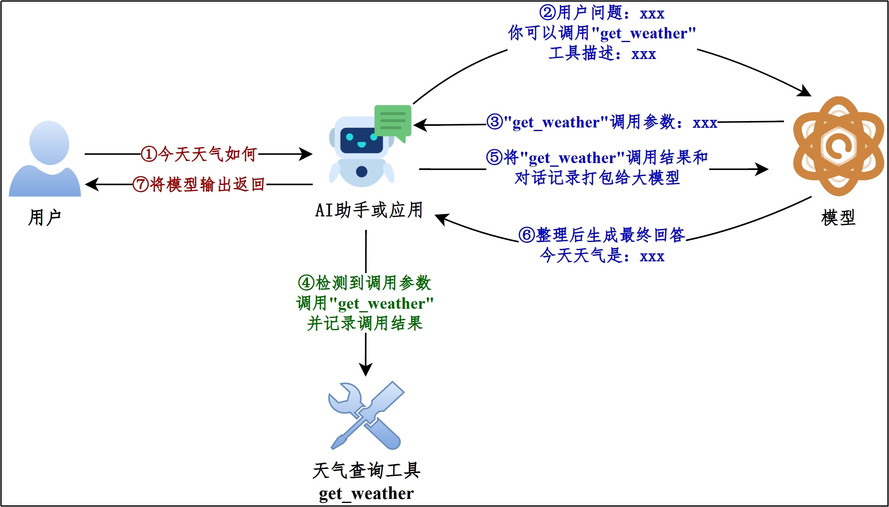
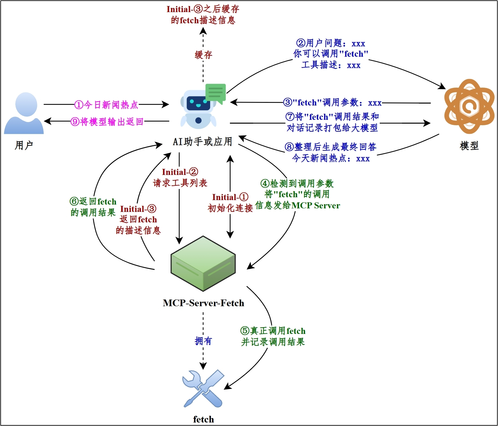
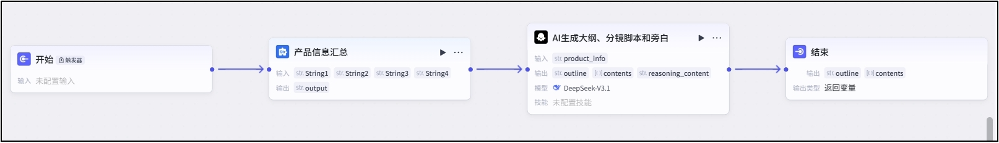

# 1-3 RAG、微调、续训与智能体

当提示词工程无法满足需求时，可借助 RAG、微调、续训与智能体开发等手段。本篇介绍这四类工程实现方式（对应 5 大模块中的模块 2 ～ 5）。

---

**本章课程目标：**

- 理解 RAG 是什么、何时需要、如何实现，以及 RAG 与微调的差异。
- 掌握微调与续训的区别（行为对齐 vs 知识扩充）、适用场景与工程顺序（先续训再微调）。
- 理解智能体的定义、何时需要、工具调用的两种实现方式（Function Call、MCP）及工作流概念。
- 能根据场景在「提示词 / RAG / 微调 / 续训 / 智能体」之间做大致选型。

**前置知识建议：** 已学习 [1-1 大模型认知与工程概览](1-1-大模型基础.md) 与 [1-2 提示词工程](1-2-提示词工程.md)，了解五大模块的定位与提示词基础。

**入门阅读提示：** 选型时可先问三句话：**缺的是「知识」还是「行为」？** 缺知识（模型不知道的内容、私有文档、最新信息）→ 优先 RAG；缺行为（不会按格式输出、话术不统一、指令遵循差）→ 考虑微调。**要不要自动查资料、调 API、执行多步？** 要 → 用智能体。本篇把 RAG、微调、续训、智能体串起来，便于你在实际场景里做大致选型。

---

# 1、RAG

## 1.1 什么是 RAG

**1）定义**

RAG（Retrieval-Augmented Generation，检索增强生成）是一种结合信息检索（Retrieval）与文本生成（Generation）的技术，AI 应用接收到用户请求后，先从外部**知识库检索**相关资料，并将这些资料与用户请求一并提供给大模型。模型在此基础上生成更准确、更有依据的回答。

**2）工作流程**


> **可这样记：** RAG = **先检索（查知识库/文档），再生成（把查到的内容塞进提示里让模型回答）**。适合「模型训练时没见过或容易过时」的内容，如企业制度、产品手册、当月新闻。和 [1-2 提示词工程](1-2-提示词工程.md) 的区别：提示词主要靠「你写进 prompt 的那段话」；RAG 靠「从外部库实时查出来的段落」补充进 prompt。

## 1.2 何时需要 RAG

当模型缺乏必要的参考信息时，RAG 可以用来补充外部知识与上下文。例如：需要获取最新信息（如当月新闻）、需要查阅或引用公司内部资料等场景。

## 1.3 实现方式

（1）在线平台

（2）离线客户端

（3）借助 LangChain 等框架或纯 Python 代码实现

# 2、微调（Fine-tuning）

## 2.1 什么是微调

在已经训练好的模型上，按照 SFT 或 RLHF/RLAIF 的范式训练模型。通常采用 SFT 的训练范式。

`训练目标`：适应特定任务或领域，提升在具体场景下的性能。

`数据特点`：小规模、高质量、任务相关的**标注数据**

`参数更新`：调整部分或全部参数（0.1%-100%）

**技术本质：与预训练阶段使用的技术相同，但属于不同环节（预训练 →SFT→RLHF→ 微调）**

> **初学者常问：** 微调改的是模型的「**行为**」（怎么说话、按什么格式、听不听话），不是往模型里「灌一本新书」。要灌新知识、新领域语言，通常用 RAG 或续训；微调更适合「模型已经懂，但表达方式不对」的场景。

## 2.2 何时需要微调

**（1）模型能力不足**

模型的指令遵循能力不足、风格/话术不能满足要求，反复调整提示词效果欠佳。

**（2）希望固化知识**

如果提示词很长，每次调用消耗大量 token，长期服务成本高昂。并且不好维护，甚至有可能超出上下文窗口。此时可以通过微调将知识固化在模型权重中。

## 2.3 何时可以微调

**（1）数据充足**

微调需要的数据规模通常比提示词示例和 RAG 知识库更大，收集到足够的数据微调才有效果，否则容易`过拟合`。

**（2）硬件资源充足**

> 整体来说，微调成本较低（仅需少量标注数据）

## 2.4 微调的技术方法

随着模型规模越来越大，如何低成本地微调模型成为核心问题。

**（1）全参数微调（Full Fine-tuning）**

更新模型所有参数，理论上限最高但资源消耗巨大。7B 模型全参微调需要约`80GB+显存`，适合资源充足、追求极致性能的场景。

**（2）参数高效微调（PEFT, Parameter-Efficient Fine-Tuning）**

`LoRA（低秩适配）`：冻结原模型权重，在 attention 层插入低秩矩阵，仅训练新增的低秩参数。7B 模型仅需训练`0.1%-1%参数（约4-20MB）`，显存占用减少 90%以上。

`QLoRA`：在 LoRA 基础上引入 4 位量化，进一步降低显存占用。7B 模型可在单卡 24G 显存上微调，成本降至全参微调的 1/10。

**（3）其他高效方法**

- `Adapter Tuning`：在模型层间插入小型适配器模块
- `Prefix Tuning`：在输入前添加可学习的虚拟前缀
- `P-Tuning v2`：在模型每一层添加可训练的提示向量

## 2.5 主要风险

灾难性遗忘（学习新任务忘记旧任务）或过拟合

## 2.6 RAG vs 微调

RAG 和微调之间的差异，一直是热门话题。

RAG 特别适合于融合新知识，而微调则能够通过优化模型内部知识、输出格式以及提升复杂指令的执行能力，来增强模型的性能和效率。

下面这张图表展示了 RAG 在与其他模型优化方法相比时的独特特性：



# 3、续训（Continued Training）

## 3.1 什么是续训

在模型已经完成预训练和可能的微调之后，在大量语料上采用和预训练相同的范式继续训练，提升模型基础能力。

本质上，续训仍然属于 **Pre-Training 阶段的延续**。

## 3.2 何时需要续训

如果微调效果不理想，且问题来自模型对领域语言/知识分布的`系统性缺失`，可以考虑续训。

## 3.3 何时可以续训

（1）数据充足

大量的原始文本（无标注），数据规模大（GB - TB）。比如法律文档、医疗论文、企业日志、代码仓库。

（2）硬件资源充足

续训要求的`数据量`和`硬件资源`远高于微调，`成本`相应更高。

## 3.4 工程实践中的常见误区

**误区 1：用 SFT 数据去做“续训”**

→ 会破坏语言建模能力

**误区 2：想靠微调解决“领域知识缺失”**

→ 应该先续训，再微调

**误区 3：企业场景盲目续训**

→ 多数场景 `RAG + 微调` 已足够

## 3.5 微调 vs 续训

很多团队之所以“效果不如预期”，本质就是把该续训的事拿去微调，或者反过来。

**1、一句话区分**

微调：让模型“按你想要的方式做事”。具体的：行为对齐／风格对齐／任务对齐。

续训：让模型“知道它原来不知道的世界”。具体的：知识扩充／语言分布补全／能力下沉。

**2、核心对比总览（工程视角）**

| 维度           | 微调 (Fine-tuning) | 续训 (Continued Pre-training) |
| :------------- | :----------------- | :---------------------------- |
| 训练目标       | 改「行为方式」     | 改「知识分布」                |
| 是否改基础能力 | × 极少             | √ 明显                        |
| 训练范式       | 有监督/偏指令      | 无监督 (CLM)                  |
| 数据形式       | 指令-回答、对话    | 大规模原始文本                |
| 数据规模       | 千~万级            | 十万~百万+                    |
| 是否依赖标签   | 强依赖             | 不需要                        |
| 过拟合风险     | 高                 | 低                            |
| 灾难性遗忘     | 常见               | 需要控制                      |
| 训练成本       | 低~中              | 高                            |
| 常用技术       | LoRA / QLoRA       | 全参 / 大 batch               |

**3、典型应用场景对照**

| 场景                         | 正确选择   |
| :--------------------------- | :--------- |
| 客服机器人更像「某公司风格」 | 微调       |
| 模型学会某行业黑话           | 续训       |
| 提高 SQL 生成稳定性          | 微调       |
| 让模型理解行业文档           | 续训 + RAG |
| 新语言/新编程语言            | 续训       |
| 工具调用更稳定               | 微调       |

**4、工程上的“组合拳”（真实项目最常见）**

实际项目中，很少“二选一”，而是：

标准工业流程：通用基座模型 → 领域续训（补知识分布）→ 指令微调（对齐行为）→RLHF / RLAIF（优化偏好）

顺序不能反：先微调再续训 = 微调成果被冲掉

> **可这样记：** **续训** = 让模型「知道原来不知道的世界」（补知识、补领域语言）；**微调** = 让模型「按你想要的方式做事」（对齐行为、格式、风格）。工程上多数场景用「RAG + 提示词」或「RAG + 微调」即可，续训成本高、效果不可控，除非确有领域知识系统性缺失再考虑。

# 4、智能体开发

## 4.1 什么是智能体？

在**经典智能体框架**中，智能体（Agent）一般指能够在环境中感知信息、基于策略做出决策并采取行动，以最大化回报或满足目标约束的系统。

在**大模型应用开发**中，智能体通常指一种以大语言模型为推理与决策核心，结合记忆、工具调用与环境交互能力，能够进行规划决策并执行动作以达成目标的软件系统。

五大核心要素：

- 大语言模型（LLM）
- 记忆系统（Memory）
- 工具调用（Tools）
- 规划决策（Planning）
- 行动执行（Action）

OpenAI 前安全系统团队负责人`翁丽莲`于 2023 年 6 月在个人博客系统化总结了当时流行的 LLM Agent 典型架构。



**与大模型的本质区别：**

- 工具调用能力：智能体能实际执行工具调用（如查询天气函数），而大模型仅能建议调用方式
- 记忆机制：两者均无真正记忆能力，都是通过上下文填充实现"伪记忆"
- 规划层次：智能体支持多步骤任务分解和子目标管理

## 4.2 何时需要智能体

当提示词优化、RAG 难以满足要求时，可以考虑引入智能体，尤其适用于多步骤、依赖外部工具或需要持续状态管理的任务。

此外，微调或续训效果不理想时，也可以结合 Agent（如引入规则校验、结构化约束、事实核对等机制）提升生成质量。

**智能体通常是大模型工程实现中复杂度最高的方案**，涉及工具调用、记忆、规划、反思与多组件协作。

> **可这样记：** 大模型只会「说」怎么调接口；智能体 = 大模型 + 真正去**执行**工具（查天气、查数据库、发邮件等）并把结果塞回对话。所以「问北京天气」时，若只是对话模型，它可能瞎编；若是接好了天气 API 的智能体，会先调接口拿到真实数据再组织成回答。

## 4.3 工具调用的实现方式

#### 4.3.1 Function Call

**1、定义**

Function Call（函数调用，Tools call，工具调用），为模型提供了一种强大而灵活的方式，使其能够与外部系统交互并访问其训练数据之外的数据。拓展了模型的能力边界。

**2、流程**




**3、演示【重要】**

模型为了支持 Function Call，在特定数据集上进行了后训练，以支持 API 调用的工具相关字段。目前顶尖大模型基本都支持 Function Call。

以 DeepSeek 官方 API 为例演示 Function Call。整体流程共五步：

① 告诉模型「有哪些工具、用户说了什么」；

② 模型决定「要调哪个工具、传什么参数」并返回；

③ 我们的代码真正执行工具拿到结果；

④ 把工具结果塞回对话发给模型；

⑤ 模型根据结果生成最终回复。

（1）步骤一：**定义工具 + 发用户消息**

**作用：**把「用户问了什么」和「你现在允许模型用哪些工具」一次性交给模型。模型没有内置天气接口，只有你通过 `tools` 传了 `get_weather` 的 name/description/parameters，它才知道可以「调一个叫 get_weather 的函数，要传 city」。用 curl 时就是：在请求体里写清 `messages`（含 system 和 user）和 `tools`（工具列表）。

```
curl https://api.deepseek.com/chat/completions \
 -H "Content-Type: application/json" \
 -H "Authorization: Bearer ${API_KEY}" \
 -d '{
 "model": "deepseek-chat",
 "messages": [
    {
     "role": "system",
     "content": "你是个智能天气查询助手，根据用户的提问自主调用工具"
    },
    {
     "role": "user",
     "content": "北京市天气如何？"
    }
  ],
   "tools": [
    {
     "type": "function",
     "function": {
      "name": "get_weather",
      "description": "根据用户输入的城市信息，获取该城市的天气",
      "parameters": {
       "type": "object",
       "properties": {
        "city": {
         "type": "string",
         "description": "城市名称，只保留最细粒度的地区名称"
        }
       },
       "required": ["city"]
      }
     }
    }
   ]
  }'
```

（2）步骤二：**模型返回「要调哪个工具、参数是什么」**

**作用：**模型根据步骤一的上下文，决定「需要查天气」并选 `get_weather`，且从「北京市天气如何？」里解析出 `city: "北京"`。它不会真的去调 API，只会在响应里给你 `tool_calls`，其中包含 `name` 和 `arguments`。你的程序要读这个响应，才知道下一步该执行哪个函数、传什么参数；`finish_reason: "tool_calls"` 表示本轮还没结束，在等工具结果。

```
{
    "id": "7cccd00d-f0a5-4b2e-872c-a54bdb767796",
    "object": "chat.completion",
    "created": 1767176438,
    "model": "deepseek-chat",
    "choices": [
        {
            "index": 0,
            "message": {
                "role": "assistant",
                "content": "我来帮您查询北京市的天气情况。",
                "tool_calls": [
                    {
                        "index": 0,
                        "id": "call_00_Kpq3g6mPl9BYlZIe1NSNm3Cs",
                        "type": "function",
                        "function": {
                            "name": "get_weather",
                            "arguments": "{\"city\": \"北京\"}"
                        }
                    }
                ]
            },
            "logprobs": null,
            "finish_reason": "tool_calls"
        }
    ],
    "usage": {
        "prompt_tokens": 336,
        "completion_tokens": 52,
        "total_tokens": 388,
        "prompt_tokens_details": {
            "cached_tokens": 0
        },
        "prompt_cache_hit_tokens": 0,
        "prompt_cache_miss_tokens": 336
    },
    "system_fingerprint": "fp_eaab8d114b_prod0820_fp8_kvcache"
}

```

（3）步骤三：**在本地/服务端真正执行工具**

**用来干嘛**：你的代码根据步骤二里的 `name`（如 `get_weather`）和 `arguments`（如 `{"city":"北京"}`）去真正调自己的函数或第三方 API，拿到真实数据（如温度、天气描述）。模型只负责「说要查北京天气」，真正发请求、解析天气 API 的是你的程序。curl 没法模拟「执行一段代码再拿结果」，所以这步在笔记里省略，只给出假设的返回值，用于下一步。

```
{
    "temp": "2℃",
    "text": "晴",
    "wind": "西北风3级"
}
```

（4）步骤四：**把工具执行结果塞回对话，再请求模型**

**用来干嘛**：模型需要「看到」工具的执行结果才能生成最终回答。所以要把至今的完整对话（含步骤一、二的 user/assistant/tool_calls）再加上一条 `role: "tool"` 的消息，内容就是步骤三的返回（如 `{"temp":"2℃","text":"晴",...}`），并且用 `tool_call_id` 和步骤二里的 `id` 对应起来。这样模型就知道「之前我让你调 get_weather(北京)，这是结果」，从而在下一步里组织成自然语言回复。

```
curl https://api.deepseek.com/chat/completions \
  -H "Content-Type: application/json" \
  -H "Authorization: Bearer ${API_KEY}" \
  -d '{
  "model": "deepseek-chat",
  "messages": [
      	{
          "role": "system",
          "content": "你是个智能天气查询助手，根据用户的提问自主调用工具"
        },
        {
          "role": "user",
          "content": "北京市天气如何？"
        },
        {
            "role": "assistant",
            "content": "我来帮您查询北京市的天气情况。",
            "tool_calls": [
                {
                    "index": 0,
                    "id": "call_00_Kpq3g6mPl9BYlZIe1NSNm3Cs",
                    "type": "function",
                    "function": {
                        "name": "get_weather",
                        "arguments": "{\"city\": \"北京\"}"
                    }
                }
            ]
        },
        {
          "role": "tool",
          "tool_call_id": "call_00_Kpq3g6mPl9BYlZIe1NSNm3Cs",
          "content": "{\"temp\":\"2℃\",\"text\":\"晴\",\"wind\":\"西北风3级\"}"
        }
      ],
      "tools": [
        {
          "type": "function",
          "function": {
            "name": "get_weather",
            "description": "根据用户输入的城市信息，获取该城市的天气",
            "parameters": {
              "type": "object",
              "properties": {
                "city": {
                  "type": "string",
                  "description": "城市名称，只保留最细粒度的地区名称"
                }
              },
              "required": ["city"]
            }
          }
        }
      ]
    }'

```

（5）步骤五：**模型根据工具结果生成最终回复**

**用来干嘛**：此时模型已经具备完整信息：用户问北京天气、自己曾发起 get_weather、以及工具返回的温度/天气/风力。所以不再返回 `tool_calls`，而是直接生成面向用户的自然语言总结；`finish_reason: "stop"` 表示本轮对话结束。至此一次完整的 Function Call 流程结束：用户得到的是「北京市当前天气……」这段文字，而不是原始 JSON。

```
{
    "id": "4f5f2133-6519-497e-aecc-2bd25a37c747",
    "object": "chat.completion",
    "created": 1767177264,
    "model": "deepseek-chat",
    "choices": [
        {
            "index": 0,
            "message": {
                "role": "assistant",
                "content": "根据查询结果，北京市当前的天气情况如下：\n\n- **温度**：2℃\n- **天气状况**：晴\n- **风力**：西北风3级\n\n今天北京天气晴朗，温度在2℃左右，风力不大，是个不错的天气。建议您外出时适当保暖，虽然天气晴朗但温度还是偏低的。"
            },
            "logprobs": null,
            "finish_reason": "stop"
        }
    ],
    "usage": {
        "prompt_tokens": 422,
        "completion_tokens": 70,
        "total_tokens": 492,
        "prompt_tokens_details": {
            "cached_tokens": 384
        },
        "prompt_cache_hit_tokens": 384,
        "prompt_cache_miss_tokens": 38
    },
    "system_fingerprint": "fp_eaab8d114b_prod0820_fp8_kvcache"
}
```

**3）Function Call 的不足**

**（1）工具实现与复用成本高，协作困难**

开发者需要`自己实现`工具，并编写可被调用的描述信息，通常与业务、环境绑定，`复用难`、`共享难`、`生态扩展慢`。

**（2）规范碎片化，跨模型适配负担重**

不同厂商定义的 Function Call`规范不同`，开发者需要为同一个工具编写多份描述信息，`维护成本`和`一致性风险高`。

**（3）可靠性不足**

工具可能没有经过足够的调试，如果描述信息不完善，模型可能在某些场景下`不能正确调用`工具。

#### 4.3.2 MCP

**1、定义**

MCP（Model Context Protocol，模型上下文协议）是一套标准化的通讯协议，旨在规范 AI 模型和外部工具、数据源的连接方式，由 Anthropic（Claude 母公司）于 2024 年 11 月提出。

MCP 就像是 AI 时代的 USB-C 通用接口，开发者只需按标准开发一次 MCP Server，**任何支持该协议的 AI 应用都能即插即用**。


通过 MCP 协议，AI 应用和 MCP Server 可以建立多对多的双向数据流。

**Function Call 与 MCP 的关系与区别**

Function Call 和 MCP **不是同一个东西**，但有关联：

|            | **Function Call**                  | **MCP**                                          |
| ---------- | ---------------------------------- | ------------------------------------------------ |
| **是什么** | 大模型的「函数/工具调用」能力      | 一套**标准化通讯协议**（Model Context Protocol） |
| **提出方** | 各厂商在各自 API 里实现            | Anthropic 于 2024 年 11 月提出                   |
| **作用**   | 让模型能调用外部工具、访问外部数据 | 统一「模型 ↔ 工具/数据源」的连接方式             |

笔记中的关系可以概括为：**MCP 可以理解为对 Function Call 的进一步封装和拓展**。

- **Function Call**：底层能力——模型「会调用工具」的机制；各厂商格式不统一，需要为不同模型维护多份工具描述。
- **MCP**：在这之上的一层「协议/标准」——按 MCP 规范把工具做成 MCP Server，任何支持 MCP 的 AI 应用都能用，相当于给 Function Call 定了统一的「接口形状」和「连接方式」。

**结论**：Function Call ≠ MCP。Function Call 是模型侧「怎么调工具」的能力；MCP 是工具侧「怎么被暴露、被谁调」的通用协议，建立在「模型会做 Function Call」的前提下，并对这一过程做了标准化和复用（一次开发 MCP Server，多端复用）。

**2、流程**



MCP 可以理解为对 Function Call 的进一步封装和拓展，**工具的定义和调用者由 AI 应用变为 MCP 服务器**。

除了工具调用，MCP 还支持管理资源（Resources）和提示词（Prompts）。最常用的是**工具**（Tools）模块。

**MCP 使用理解（以 Cherry Studio + 天气为例）**

可以这样理解：**MCP 是协议/标准**，不是某一条 HTTP 接口；**天气 MCP Server** 是按 MCP 规范实现的、提供天气工具的服务器。在 Cherry Studio 里配置好「天气 MCP Server」后，当你在 Cherry Studio 中用 DeepSeek 问「北京天气怎么样」时，Cherry Studio 会把 DeepSeek 的 Function Call 和 MCP 工具做映射，去调用天气 MCP Server 提供的工具（如 `get_weather(city="北京")`），拿到天气数据后再塞回给 DeepSeek，由模型组织成自然语言回复。所以：**你有天气的 MCP 服务器并配置到 Cherry Studio 后，问 DeepSeek 天气时，就会通过天气 MCP 获取信息再返回**。严格说「MCP」指协议，真正被调的是「MCP Server 暴露出来的工具」。

**大模型如何知道「什么时候调」「调哪一个」？**

- **什么时候调？** 应用（如 Cherry Studio）每次请求时都会把**当前已配置的所有工具**（来自已连接的 MCP Server 等）转成模型能识别的格式，和用户消息一起发给模型。每个工具都带有 **name**、**description**、**parameters**。模型根据用户问题和这些描述，判断「要回答这个问题是否需要先调工具」；需要则输出 tool_call。所以「什么时候调」= 模型根据用户意图 + 工具描述推断出来的。
- **调哪一个？** 一个 MCP Server 里可以有多个工具（如 `get_weather`、`get_forecast`）。模型收到的是一份「当前可调用的工具列表」，每个工具都有描述（如「根据用户输入的城市信息，获取该城市的天气」）。模型把用户问题（如「北京天气怎么样」）和每个工具的 description 做匹配，选最相关的那个，并从用户话里推断参数（如 `city: "北京"`）填进 arguments。所以「调哪一个」也是模型根据用户问题 + 各工具的 description 选出来的。

**小结**：大模型并不「认识」MCP 或「知道有天气接口」，它只知道「这次请求里，应用告诉我可以调这些函数，以及每个函数是干什么的」。MCP 只规定「工具怎么暴露、怎么被调用」；**何时调、调哪个、传什么参数**，都是模型根据**应用发给它的工具列表（含描述）+ 用户输入**推断出来的。

**3、常用的 MCP 网站推荐：**

https://mcp.so/ （热度最高）

国内开发者倾力打造的资源航母平台，目前已收录超 8,000 个 MCP 服务器，支持 STDIO（本地通信）与 SSE（云端托管）两种模式，并提供 API Key 与命令行参数配置方式。平台特色功能包括实时接口调试、企业级数据安全接入，以及 Firecrawl 爬虫服务的无缝集成。

https://smithery.ai/servers

新手友好型工具库，已收录 4500+优质资源，支持一键生成并复制 Cursor 配置命令。集成 GitHub 快捷跳转功能，便于快速获取代码示例，同时支持按 Star 数量和更新频率筛选高质量服务。

https://bailian.console.aliyun.com/?tab=mcp#/mcp-market

连接智能，即点即用，探索阿里云百炼全周期 MCP 服务

**4、相较于 Function Call 的优势**

MCP 一定程度上弥补了 Function Call 的不足

（1）协作困难

MCP 协议允许开发者把工具暴露为 MCP Server，可以`被多个AI应用复用`。

（2）适配负担重

AI 应用只要把模型的 Function Call 格式映射为 MCP 的工具调用格式，即可调用 MCP 服务器提供的工具。当模型切换时只需要切换映射规则，不必为每个模型维护一份描述信息，`一致性和维护成本大大降低`。

（3）可靠性不足

公开的 MCP Server 经过社区的检验，经过很多开发者的共同检验，其工具定义和元数据信息要更加规范，通常`可靠性更高`。

## 4.4 智能体开发方式

（1）在线平台开发智能体：Dify、Coze

（2）基于 LangChain/LangGraph 等框架开发智能体

## 4.5 工作流 Workflow

**1、什么是工作流**

工作流（Workflow）可以看作是一种**智能体的设计模式**，用于将复杂任务拆解为一系列有序、可控的步骤，并按照预先定义的流程逐步执行。



在实际应用中，不同任务对确定性的要求不同，当任务流程相对固定、规则明确时，可以将流程清晰地建模为工作流，由系统或模型按照既定步骤执行。这种方式可提升稳定性、可复用性和可解释性。

比如：讯飞星辰 Agent 平台：https://agent.xfyun.cn/home


相较于 Agent，工作流的执行流程固定，结果可控，所以很多开发平台将工作流作为独立于 Agent 的另一种应用。

**2、工作流开发方式**

（1）Dify、Coze 等在线平台开发工作流

（2）基于 LangChain 等框架开发工作流

---

**本章小结（便于复习）**

- **RAG**：先检索知识库再生成回答，适合模型不知道或易过时的内容；与微调的区别是「补外部知识」vs「改模型行为」。
- **微调**：在已训练模型上用标注数据做 SFT 等，改行为/格式/风格；需要一定数据和算力，常用 LoRA、QLoRA 等省显存；注意灾难性遗忘与过拟合。
- **续训**：用大量无标注语料继续预训练，补知识/领域语言；成本高、顺序要在微调之前；多数场景 RAG + 微调即可。
- **智能体**：以 LLM 为决策核心，具备记忆、工具调用、规划与执行；工具调用可通过 Function Call（各厂商 API）或 MCP（统一协议）实现；工作流是流程固定的智能体设计模式。

---

**入门一章整体小结（1-1 + 1-2 + 1-3）**

学完三篇后，你已经建立「大模型是什么、怎么训练与落地、工程上怎么用」的完整入门框架：

1. **认知**：大模型的定义、分类、训练与对齐、算力与落地方式；AIGC/AGI、幻觉与五大模块的定位。
2. **提示词**：六要素、Zero-shot/Few-shot、System/User/Assistant 结构化、边界与注意点；多数场景优先用提示词优化。
3. **进阶手段**：缺知识用 RAG，缺行为用微调，领域知识系统性缺失才考虑续训，多步骤与工具调用用智能体；能根据场景做大致选型。
