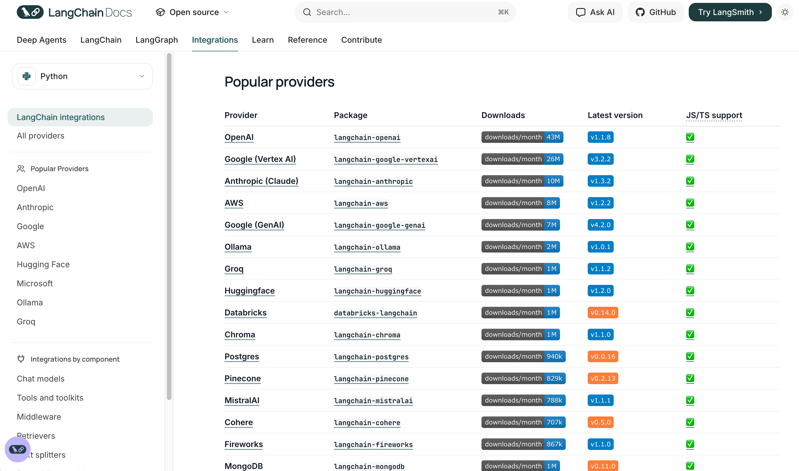
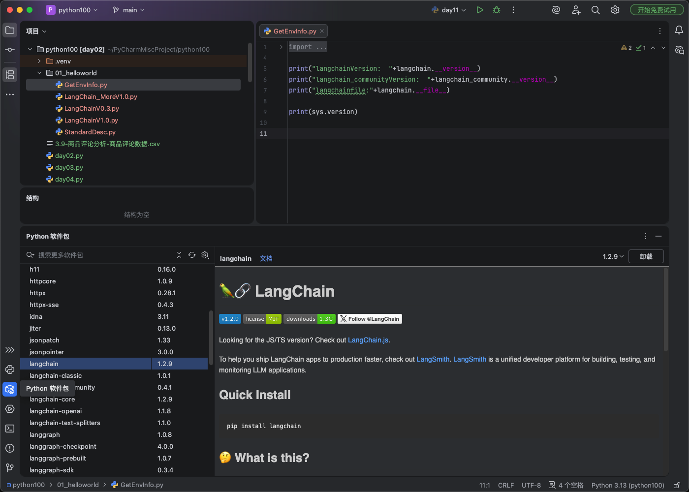

# 10 - LangChain 快速上手与 HelloWorld

---

**本章课程目标：**

- 完成从零到一的 HelloWorld：环境与约定、安装依赖、基于阿里百炼/通义接入与调用。
- 掌握**调用三件套**（API Key、模型名、Base URL）及 0.x 与 1.0 两种写法（`ChatOpenAI` / `init_chat_model`）。
- 会实现**多模型共存**（通义 + DeepSeek）、**企业级封装与流式输出**，为后续学习 Model I/O、Ollama、提示词与输出解析（第 11～14 章）打好基础。

**前置知识建议：** 已学习 [第 9 章 - LangChain 概述与架构](9-LangChain概述与架构.md)，了解 LangChain 的定位与六大核心模块；具备 Python 环境与包管理基础。

**学习建议：** 按「环境与约定 → 安装依赖 → 百炼三件套 → HelloWorld → 多模型共存 → 企业级封装与流式」顺序动手。调用任何模型都离不开 **API Key、模型名、Base URL** 三件套，建议先在一个平台（如阿里百炼）跑通再扩展。

---

## 1、环境与约定

### 1.1 支持的模型与课程选用

LangChain 通过各厂商的集成包支持多种大模型，官方文档有完整列表：

- https://docs.langchain.com/oss/python/integrations/providers/overview#popular-providers



本课程以 **阿里云百炼（通义千问）** 为主，辅以 **DeepSeek** 与 **OpenRouter**；通过统一配置规则，也适用于其他兼容 OpenAI 协议的模型，便于举一反三。

**通义千问** 等国内模型，LangChain 未提供直接的调用方式，不过可以通过**OpenAI 协议**进行连接。


### 1.2 环境与版本约定

实操前建议先确认：<strong>Python 3.8+（推荐 Python 3.10 版本）</strong>、已创建虚拟环境（如 `venv` 或 `conda`）。不要安装 Python 3.12 以上版本，目前（截止 2026 年 1 月 21 日）不支持 PyWin32。

### 1.3 配置原则

所有调用均基于 **OpenAI 协议** 或各模型官方推荐的兼容方式，保证接口统一，便于在多模型之间切换与扩展。

### 1.4 0.x 与 1.0 版本对比


- **0.x 写法**：从各厂商包**直接导入具体类**并实例化，例如 `from langchain_openai import ChatOpenAI`，再 `llm = ChatOpenAI(model=..., api_key=..., base_url=...)`。换一家厂商就要换一个包和类名（如 DeepSeek 需对应厂商包与 `ChatDeepSeek`），代码与具体厂商强绑定。
- **1.0 重要变化**：推荐使用 **`init_chat_model`** 作为统一的聊天模型入口，通过 `model_provider` 等参数指定厂商，减少对不同厂商包的强依赖；详见 4.3 示例代码。

---

## 2、大模型服务平台

LangChain 不提供大模型本身，需要配合 **第三方大模型服务平台**：注册、充值、创建 API Key 后，用 **API Key + Base URL** 调用对应模型。

| 平台           | 入口                                                   | API-Key 管理                                                        | API 文档                                                                          | 模型                                                                         | 说明                                                      |
| -------------- | ------------------------------------------------------ | ------------------------------------------------------------------- | --------------------------------------------------------------------------------- | ---------------------------------------------------------------------------- | --------------------------------------------------------- |
| **CloseAI**    | [平台](https://platform.closeai-asia.com/)             | [API-Key](https://platform.closeai-asia.com/developer/api)          | [文档](https://doc.closeai-asia.com/tutorial/api/openai.html)                     | [模型](https://platform.closeai-asia.com/pricing)                            | 企业级 OpenAI/国际大模型 API 代理（中转）                 |
| **OpenRouter** | [平台](https://openrouter.ai/)                         | [Keys](https://openrouter.ai/settings/keys)                         | [文档](https://openrouter.ai/docs/community/frameworks-and-integrations-overview) | [模型](https://openrouter.ai/models)                                         | 多模型统一 API 聚合（一个接口调 400+ 模型）               |
| **阿里云百炼** | [平台](https://bailian.console.aliyun.com/)            | [API-Key](https://bailian.console.aliyun.com/?tab=model#/api-key)   | [文档](https://bailian.console.aliyun.com/?tab=doc#/doc/?type=model)              | [模型](https://bailian.console.aliyun.com/?tab=model#/model-market/all)      | 阿里系；本课程主要使用                                    |
| **百度千帆**   | [平台](https://console.bce.baidu.com/qianfan/overview) | [API-Key](https://console.bce.baidu.com/qianfan/ais/console/apiKey) | [文档](https://cloud.baidu.com/doc/qianfan-docs/s/Mm8r1mejk)                      | [模型](https://console.bce.baidu.com/qianfan/modelcenter/model/buildIn/list) | 百度系                                                    |
| **硅基流动**   | [平台](https://www.siliconflow.cn/)                    | [API-Key](https://cloud.siliconflow.cn/me/account/ak)               | [文档](https://docs.siliconflow.cn/cn/userguide/capabilities/text-generation)     | [模型](https://cloud.siliconflow.cn/me/models)                               | 国内 AI 能力平台（多模型 API + 推理加速 + 微调 + 私有化） |

---

## 3、安装依赖

**建议**：若希望 pip 默认使用国内源，可先执行：

```bash
pip config set global.index-url https://pypi.tuna.tsinghua.edu.cn/simple
```

**安装命令**：

> **提示**：若已按上文将 pip 全局切换为清华源，则下面命令可省略 `-i https://pypi.tuna.tsinghua.edu.cn/simple`，直接写 `pip install 包名` 即可。

```bash
# 核心框架（Chain、Agent、Memory、Retriever 等）
pip install langchain -i https://pypi.tuna.tsinghua.edu.cn/simple

# OpenAI 兼容组件（LLM、Chat、Embeddings 等），依赖 openai SDK
pip install langchain-openai -i https://pypi.tuna.tsinghua.edu.cn/simple
pip install openai -i https://pypi.tuna.tsinghua.edu.cn/simple

# 从 .env 加载环境变量
pip install python-dotenv -i https://pypi.tuna.tsinghua.edu.cn/simple

# 核心抽象与类型
pip install langchain-core
```

> **安全提示**：请将 API Key 写在项目根目录的 **`.env`** 文件中（例如：`QWEN_API_KEY=sk-xxx`），不要写进代码或提交到版本库。使用 `python-dotenv` 的 `load_dotenv()` 可在代码中自动加载这些环境变量。

安装完成后，可用以下两种方式确认环境是否正常。

**方法一：运行环境检查脚本（终端）**

在项目目录下执行脚本，可一次性查看 LangChain、langchain_community 的版本与安装路径，以及当前 Python 版本。

【案例源码】环境检查脚本：`案例与源码-4-LangGraph框架/01-helloworld/GetEnvInfo.py`

```python
import langchain
import langchain_community
import sys

print("langchainVersion:  "+langchain.__version__)
print("langchain_communityVersion:  "+langchain_community.__version__)
print("langchainfile:"+langchain.__file__)

print(sys.version)
```

【输出示例】


**方法二：在 PyCharm 中查看已安装包（图形界面）**

使用 PyCharm 时，可打开底部 **「Python 软件包」** 面板，在列表中找到 `langchain`、`langchain-core`、`langchain-openai` 等包，点击即可在右侧查看版本号、许可证等详情，无需运行代码。



---

## 4、实战：基于阿里百炼的 HelloWorld

### 4.1 百炼平台入口与准备

- **官网**：https://bailian.console.aliyun.com/
- **步骤概览**：① 注册/登录阿里云 → ② 在百炼控制台创建 API Key → ③ 在模型广场确认模型名（如 `qwen-plus`）→ ④ 获取 OpenAI 兼容的 Base URL → ⑤ 在本地用 LangChain 写代码调用。

### 4.2 调用三件套：API Key、模型名、Base URL

**① 获得 API Key**

在百炼控制台「API-KEY 管理」中创建并复制 Key（形如 `sk-xxx`）。


**② 获得模型名**

在模型广场或文档中确认要调用的模型标识，例如 `qwen-plus`、`qwen3-max` 等。


**③ 获得 Base URL（开发地址）**

使用 SDK 调用时需配置兼容 OpenAI 的接口地址，例如：


**本节小结**

| 项目         | 示例/说明                                           |
| ------------ | --------------------------------------------------- |
| **API Key**  | `sk-xxx`（在控制台创建）                            |
| **模型名**   | 如 `qwen-plus`、`qwen3-max`                         |
| **Base URL** | `https://dashscope.aliyuncs.com/compatible-mode/v1` |

### 4.3 示例代码（0.3 与 1.0 两种写法）

> **说明**：本地安装的是 LangChain 1.0 及以上版本时，**也可以直接运行下面 0.3 的代码**，接口保持兼容；两种写法按需选用即可。

**方式一：LangChain 0.3（了解即可，目前仍在使用）**

```python
# LangChain 0.3 使用方式
from langchain_openai import ChatOpenAI
import os
from dotenv import load_dotenv

# 推荐：用 .env 管理密钥，避免硬编码
load_dotenv(encoding='utf-8')

llm = ChatOpenAI(
    model="deepseek-v3.2",
    api_key=os.getenv("QWEN_API_KEY"),
    base_url="https://dashscope.aliyuncs.com/compatible-mode/v1"
)

response = llm.invoke("你是谁")
print(response)
print(response.content)
```

**方式二：LangChain 1.0+（推荐）**

```python
# LangChain 1.0+ 使用方式
import os
from dotenv import load_dotenv
from langchain.chat_models import init_chat_model

load_dotenv(encoding='utf-8')

model = init_chat_model(
    model="qwen-plus",
    model_provider="openai",
    api_key=os.getenv("aliQwen-api"),
    base_url="https://dashscope.aliyuncs.com/compatible-mode/v1"
)

print(model.invoke("你是谁").content)

# 若报错 Unable to infer model provider，需显式指定 model_provider="openai"
```

**两版对比小结**：1.0 通过 `init_chat_model` 统一入口，便于切换不同厂商与模型。


---

## 5、进阶：多模型共存需求

实际项目中常需要 **同一系统内接入多种大模型**（如通义 + DeepSeek），下一节的 HelloWorld V2 将演示在同一脚本中初始化并调用多个模型。

---

## 6、实战：多模型共存（通义 + DeepSeek）

### 6.1 DeepSeek 平台与三件套

- 使用说明：https://platform.deepseek.com/usage
- API 文档：https://api-docs.deepseek.com/zh-cn/

**三件套**：API Key、模型名、Base URL。

- **① 获得 API Key**：在 DeepSeek 平台创建并复制。


- **② 获得模型名**：如 `deepseek-chat`（非思考模式）、`deepseek-reasoner`（思考模式）。


- **③ Base URL**：一般为 `https://api.deepseek.com`（以官方文档为准）。

**备注**：`deepseek-chat` 对应 DeepSeek-V3.2 的普通模式；`deepseek-reasoner` 对应思考/推理模式。


### 6.2 多模型共存示例代码

下面示例使用 **不同变量名**（`model_qwen`、`model_deepseek`）保存两个模型实例，避免后者覆盖前者，便于后续扩展与维护。

【案例源码】`4-LangGraph框架案例与源码/01-helloworld/LangChain_MoreV1.0.py`

```python
# LangChain 1.0+ 多模型共存（推荐用不同变量名区分）
from dotenv import load_dotenv
from langchain.chat_models import init_chat_model
import os

load_dotenv()

# 通义
model_qwen = init_chat_model(
    model="qwen-plus",
    model_provider="openai",
    api_key=os.getenv("QWEN_API_KEY"),
    base_url="https://dashscope.aliyuncs.com/compatible-mode/v1"
)
print(model_qwen.invoke("你是谁").content)

print("*" * 70)

# DeepSeek
model_deepseek = init_chat_model(
    model="deepseek-chat",
    api_key=os.getenv("deepseek-api"),
    base_url="https://api.deepseek.com"
)
print(model_deepseek.invoke("你是谁").content)
```

---

## 7、实战：企业级封装与流式输出

### 7.1 流式输出说明

通过 `stream()` 可逐 token 返回结果，适合长文本或实时展示。


### 7.2 企业级示例代码（封装、异常、流式）

下面示例将 LLM 初始化封装成函数、做环境变量校验、使用日志与异常处理，并演示流式调用。

【案例源码】`4-LangGraph框架案例与源码/01-helloworld/StandardDesc.py`

```python
# 企业级示例：封装、异常处理、流式输出
from langchain_openai import ChatOpenAI
import os
from dotenv import load_dotenv
from langchain_core.exceptions import LangChainException
import logging

load_dotenv(encoding='utf-8')
logging.basicConfig(level=logging.INFO, format='%(asctime)s - %(levelname)s - %(message)s')
logger = logging.getLogger(__name__)


def init_llm_client() -> ChatOpenAI:
    """初始化 LLM 客户端，环境变量未配置时抛出 ValueError。"""
    api_key = os.getenv("QWEN_API_KEY")
    if not api_key:
        raise ValueError("环境变量 QWEN_API_KEY 未配置，请检查 .env 文件")

    return ChatOpenAI(
        model="deepseek-v3.2",
        api_key=api_key,
        base_url="https://dashscope.aliyuncs.com/compatible-mode/v1",
        temperature=0.7,
        max_tokens=2048,
    )


def main():
    try:
        llm = init_llm_client()
        logger.info("LLM 客户端初始化成功")

        question = "你是谁"
        response = llm.invoke(question)
        logger.info(f"问题：{question}")
        logger.info(f"回答：{response.content}")

        print("==================== 以下是流式输出 ====================")
        for chunk in llm.stream("介绍下 LangChain，300 字以内"):
            print(chunk.content, end="")

    except ValueError as e:
        logger.error(f"配置错误：{e}")
    except LangChainException as e:
        logger.error(f"模型调用失败：{e}")
    except Exception as e:
        logger.error(f"未知错误：{e}")


if __name__ == "__main__":
    main()
```

---

## 8、延伸：从 Chain 到 LangGraph

后续课程会深入 **LangGraph**：核心理念是从「链式」到「图状」——支持分支、循环、多 Agent 协作，更适合复杂对话与工作流。


> **说明**：上图示意从单链顺序执行，演进到带状态、可分支、可循环的图结构，为后续学习 LangGraph 做铺垫。

---

**本章小结：**

- **上手路径**：安装 `langchain`、`langchain-openai`、`langchain-core`、`python-dotenv` 等；调用任意模型需准备**三件套**：**API Key**、**模型名**、**Base URL**（阿里百炼、DeepSeek 等均提供 OpenAI 兼容接口）。密钥放在 `.env`，用 `load_dotenv()` 加载，不要写进代码。
- **HelloWorld**：用 `init_chat_model` 或 `ChatOpenAI` 初始化模型，`model.invoke("问题")` 得到回复，`.content` 取文本；**多模型共存**用不同变量名保存多个模型实例；**流式输出**用 `model.stream(...)` 逐 token 返回；企业级写法可封装初始化函数、做环境校验与异常处理、打日志。
- **注意**：文档与版本迭代快，以官方文档和当前版本为准；遇到 API 更名或报错可查文档或锁定课程所用版本。

**建议下一步：** 在本地用阿里百炼或 DeepSeek 的 API Key、模型名、Base URL 跑通一次 `init_chat_model` + `invoke`，再试 `stream()` 流式输出；若需多模型，在同一脚本里初始化通义与 DeepSeek 各一个实例并分别调用。接着可学习 [第 11 章 - Model I/O 与模型接入](11-Model-I-O与模型接入.md)、[第 12 章 - Ollama 本地部署与调用](12-Ollama本地部署与调用.md)、[第 13 章 - 提示词与消息模板](13-提示词与消息模板.md)、[第 14 章 - 输出解析器](14-输出解析器.md)，深入 Model I/O 三件套与提示模板、结构化输出。
