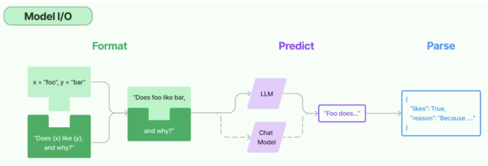

# 10 - Model I/O 与 Ollama 本地部署

---

**本章课程目标：**

- 理解 LangChain 的 **Model I/O** 模块：输入提示（Prompt）、调用模型（Model）、输出解析（Parser）三件套。
- 掌握在 LangChain 中接入 **OpenAI 兼容接口**、**DeepSeek**、**通义千问** 等大模型的方式与选型。
- 学会使用 **Ollama** 在本地部署与运行大模型，并用 **LangChain** 调用本地模型。

**前置知识建议：** 已学习第 9 章「LangChain 概述与快速上手」，了解 LangChain 的定位与基本用法；具备 Python 环境与 API 调用基础。

---

## 1、Model I/O 大模型接口

### 1.1 官方文档与概述

Model I/O 是 LangChain 中与大模型交互的**核心模块**，对应第九章中的六大核心组件之一的 **Models（模型）**。官方文档可从这里入手：

- **Model I/O 总览**：https://docs.langchain.com/oss/python/langchain/models
- **Chat 集成**：https://docs.langchain.com/oss/python/integrations/chat

后续接入具体厂商时，可再查阅对应集成文档（如 OpenAI、DeepSeek、Ollama 等）。

### 1.2 Model I/O 是什么：定义与三件套

**Model I/O** 的含义是：**标准化各类大模型的输入与输出**。可以理解为三个固定环节，对应 LangChain 里的三类组件：

- **输入模板（Format）**：把原始数据格式化成模型可接受的输入（如提示词模板）。
- **模型本身（Predict）**：通过统一接口调用不同的大语言模型。
- **格式化输出（Parse）**：从模型返回中提取信息，并按预定格式（如 JSON、结构化文本）输出。



> **说明**：上图为 Model I/O 的整体结构——左侧为**输入**（如 Prompt Template），中间为**模型调用**（LLM/Chat Model），右侧为**输出解析**（Output Parser）。三者组合即可完成「问 → 模型推理 → 结构化结果」的完整流程。

#### 1.2.1 输入提示（Format）

对应 **Prompts Template（提示词模板）**。作用包括：

- 将原始数据格式化成模型可处理的形式。
- 通过模板（如带占位符的字符串）插入变量，拼成完整问题再送入模型。

即：**管理大模型的输入**，避免在代码里手写拼接字符串。

#### 1.2.2 调用模型（Predict）

对应 **Models**。作用包括：

- 使用**统一接口**调用不同的大语言模型（OpenAI、DeepSeek、通义、Ollama 等）。
- 接收已格式化的问题，进行**预测或生成**，返回模型输出。

即：**屏蔽各厂商 API 差异**，用同一套写法切换模型。

#### 1.2.3 输出解析（Parse）

对应 **Output Parser**。作用包括：

- 从模型的**原始输出**中提取信息。
- 按**预先约定**的格式规范化结果，例如解析成 JSON、列表或自定义结构。

即：**把「模型说的话」变成「程序好用的数据结构」**。

**一句话小结**：**Model I/O = 输入（Format）→ 处理（Predict）→ 输出（Parse）**，对应提示模板、模型调用、输出解析三步。

---

### 1.3 调用模型与模型分类

#### 1.3.1 模型在应用中的位置

一个 AI 应用的核心往往就是它所依赖的大语言模型。LangChain **不提供**任何 LLM，而是通过**第三方集成**把各平台模型接入到你的应用中，例如：OpenAI、Anthropic、Hugging Face、LlaMA、阿里通义、ChatGLM 等。

- **模型接口参考**：https://reference.langchain.com/python/langchain_core/language_models/

#### 1.3.2 LangChain 中的模型分类

LangChain 将大语言模型按用途分为多种类型，**实际开发中最常用的是「聊天对话模型」**（Chat Model），用于多轮对话、系统角色与用户消息等场景。

**LangChain 中模型分类：LLM、Chat、Embedding 等**

| 模型类型                                | 输入形式                                                                            | 输出形式                           | 主要特点                                                         | 典型适用场景                                                 |
| --------------------------------------- | ----------------------------------------------------------------------------------- | ---------------------------------- | ---------------------------------------------------------------- | ------------------------------------------------------------ |
| **LLM**（大语言模型）                   | 纯文本字符串                                                                        | 文本字符串                         | ① 最基础的文本生成模型<br>② 无上下文记忆<br>③ 高速、轻量         | 单轮问答；摘要生成；文本改写/扩写；指令执行（Instruct 模型） |
| **ChatModel**（聊天模型）               | 消息列表（`List[BaseMessage]`），如 `HumanMessage`、`SystemMessage`、`AIMessage` 等 | 聊天消息对象（`AIMessage`）        | ① 面向对话场景<br>② 支持多轮上下文<br>③ 更贴近人类对话逻辑       | 智能助手；客服机器人；多轮推理任务；LangChain Agent 工具调用 |
| **Embeddings**（文本向量模型/嵌入模型） | 文本字符串或列表（`str` 或 `List[str]`）                                            | 向量（`List[float]` 或 `ndarray`） | ① 将文本转化为语义向量<br>② 可用于相似度搜索<br>③ 通常不生成文本 | 文本检索增强（RAG）；知识库问答；聚类/分类/推荐系统          |

> **说明**：图中一般会区分 **LLM**（纯文本补全）、**Chat Model**（多轮对话）、**Embedding**（向量化）等。本课程重点使用 **Chat Model**，与第 9 章的 `init_chat_model`、`ChatOpenAI` 等对应。

> **与第 1 章对应**：LangChain 里的 **Embeddings** 就是 [1-1 大模型认知与工程概览](1-1-大模型认知与工程概览.md) 中按「模型功能/输出形态」分类的**嵌入模型（Embedding）**——同一类模型，只是框架里叫 Embeddings，概念上可统一称为**嵌入模型**。

> **为何第 1 章没有单独提 ChatModel？** 第 1 章按**模型功能**（输出形态）分为四类：生成式大模型（LLM）、嵌入模型、重排序模型、分类模型。LangChain 里的 **LLM** 和 **ChatModel** 在功能上**都属于「生成式大模型（LLM）」**——都是「输入内容 → 生成自然语言」；
> 区别只是**调用方式**（纯文本 vs 消息列表、单轮 vs 多轮）。所以第 1 章只列「生成式大模型」这一大类，不再按接口细分为 LLM/ChatModel；在 LangChain 里则按接口区分，便于选 API。

---

### 1.4 模型参数与返回

#### 1.4.1 标准化参数

在构建聊天模型（如 `init_chat_model`）时，LangChain 定义了一批**标准化参数**，便于在不同模型间保持相近的配置方式。

- **官方说明**：https://docs.langchain.com/oss/python/langchain/models#parameters

常见参数包括：`model`、`temperature`、`max_tokens`、`api_key`、`base_url` 等。

**聊天模型常用标准化参数一览**

| 参数名        | 参数含义                                                           |
| ------------- | ------------------------------------------------------------------ |
| `model`       | 指定使用的大语言模型名称（如 "gpt-4"、"gpt-3.5-turbo" 等）         |
| `temperature` | 温度；温度越高，输出内容越随机；温度越低，输出内容越确定           |
| `timeout`     | 请求超时时间                                                       |
| `max_tokens`  | 生成内容的最大 token 数                                            |
| `stop`        | 模型在生成时遇到这些「停止词」将立刻停止生成，常用于控制输出的边界 |
| `max_retries` | 最大重试请求次数                                                   |
| `api_key`     | 大模型供应商提供的 API 秘钥                                        |
| `base_url`    | 大模型供应商 API 请求地址                                          |

**标准化参数的适用范围与示例**

通过**动态传入模型名称**（以及 `temperature`、`api_key`、`base_url` 等），可以轻松切换使用不同模型。下面为 0.x 写法示例（直接使用 `ChatOpenAI`），参数名在 1.0 的 `init_chat_model` 中同样适用。

**0.x 写法示例：**

```python
from langchain_openai import ChatOpenAI

def chat_with_model(model_name, prompt):
    llm = ChatOpenAI(
        model=model_name,
        temperature=0.7,
    )
    return llm.invoke(prompt).content
```

**1.0 写法示例（推荐）：**

```python
from langchain.chat_models import init_chat_model

def chat_with_model(model_name, prompt):
    model = init_chat_model(
        model=model_name,
        model_provider="openai",
        temperature=0.7,
    )
    return model.invoke(prompt).content
```

两版对比：0.x 需从 `langchain_openai` 导入 `ChatOpenAI` 并直接实例化；1.0 用统一入口 `init_chat_model`，通过 `model_provider` 指定厂商，换模型/换厂商时改参数即可。更多说明见 [第 9 章 2.1.4 0.x 与 1.0 版本对比](9-LangChain概述与快速上手.md#214-0x-与-10-版本对比)。

> **说明**：上述标准化参数**并非对所有模型都生效**。通常仅对 LangChain 官方集成包（如 `langchain-openai`、`langchain-anthropic`）中的模型有完整支持；`langchain-community` 中的第三方模型可能不遵守这些规则，需以具体文档为准。

#### 1.4.2 示例：参数在代码中的用法

下面是一个在代码中设置模型参数的简单示例，便于理解「参数 → 模型行为」的对应关系。

【案例源码】`案例与源码-4-LangGraph框架/02-models_io/ModelIO_Params.py`


#### 1.4.3 模型返回：Message 组件

调用聊天模型后，返回的是**消息对象**，而不是裸字符串。在 LangChain 中，最常见的是 **AIMessage**，表示模型生成的一条回复。


所有消息类型（如 `AIMessage`、`HumanMessage`、`SystemMessage`）一般都具有以下属性：

- **type**：消息类型（如 `ai`、`human`、`system`）。
- **content**：消息正文（通常是我们需要的文本内容）。
- **response_metadata**：模型返回的元数据（如 token 使用量、模型名等）。

**Message 的通用属性：type、content、response_metadata**

| 属性名              | 属性作用                                                                                                                                                                                                                         |
| ------------------- | -------------------------------------------------------------------------------------------------------------------------------------------------------------------------------------------------------------------------------- |
| `type`              | 描述是哪种类型的消息，包含类型有 "user"、"ai"、"system" 和 "tool"                                                                                                                                                                |
| `content`           | 通常是字符串，有些情况下可能是字典列表，该字典列表用于大模型的多模态输出                                                                                                                                                         |
| `name`              | 当消息类型相同时用来区分不同消息，但不是所有模型都支持此属性                                                                                                                                                                     |
| `response_metadata` | 仅 AI 消息包含；大语言模型响应中的附加元数据，因模型而异，如可能包含本次 token 使用量等信息                                                                                                                                      |
| `tool_calls`        | 仅 AI 消息包含；当大模型决定调用工具时，`AIMessage` 中会包含此属性，可通过 `.tool_calls` 获取，返回 `ToolCall` 列表。每个 `ToolCall` 为字典，含字段：`name`（应调用的工具名）、`args`（调用参数）、`id`（工具调用的唯一标识 ID） |

在代码中通常通过 `response.content` 获取模型生成的文本，通过 `response.response_metadata` 获取额外信息。

---

### 1.5 接入大模型

LangChain 支持通过不同集成包接入多种大模型，以下按「OpenAI 兼容」「DeepSeek」「通义千问」「智谱」分别说明，并给出选型与示例。

**集成总览（支持的模型提供商/厂商列表）**：https://docs.langchain.com/oss/python/integrations/providers/overview

#### 1.5.1 接入 OpenAI（及兼容接口）

- **文档**：
  - https://docs.langchain.com/oss/python/integrations/providers/openai
  - https://reference.langchain.com/python/integrations/langchain_openai/ChatOpenAI/

**openai.OpenAI 与 langchain_openai.ChatOpenAI 的区别与选型：**

| 对比项       | openai.OpenAI                       | langchain_openai.ChatOpenAI                      |
| ------------ | ----------------------------------- | ------------------------------------------------ |
| **所属生态** | OpenAI 官方 Python SDK（`openai`）  | LangChain 生态（`langchain-openai`）             |
| **定位**     | 底层、纯粹的 API 调用               | LangChain 的「模型适配器」                       |
| **特点**     | 轻量、直接、贴近原生 API            | 可与 Prompt、Chain、Agent、Memory 等组件无缝配合 |
| **选型建议** | 仅需简单调用、不打算用 LangChain 时 | 需要链式编排、多组件协作时                       |

**类比**：可类比 Java 里的 **`Collection`** 与 **`List<String>`**——前者是通用、底层的集合接口，后者是在同一套类型体系下更具体、可组合、与业务（如遍历、流式处理）更贴合的一种形态；同理，`openai.OpenAI` 是通用 API 能力，`ChatOpenAI` 是 LangChain 生态里「带类型、可编排」的那一层。

**结论**：两者无绝对优劣，按需求选择——**简单调用用官方 SDK**，**复杂工作流用 LangChain 的 ChatOpenAI**。

**示例一：使用 OpenAI 官方 SDK（如对接 DeepSeek 兼容接口）**

【案例源码】`案例与源码-4-LangGraph框架/02-models_io/ModelIO_OpenAI.py`

```python
# 需先安装：pip install openai
import os
from openai import OpenAI

client = OpenAI(
    api_key=os.getenv("deepseek-api"),
    base_url="https://api.deepseek.com"
)

response = client.chat.completions.create(
    model="deepseek-chat",
    messages=[
        {"role": "system", "content": "You are a helpful assistant"},
        {"role": "user", "content": "Hello，你是谁？"},
    ],
    stream=False
)

print(response.choices[0].message.content)
```

**示例二：使用 LangChain ChatOpenAI（0.x 写法，如对接通义千问兼容接口）**

【案例源码】`案例与源码-4-LangGraph框架/02-models_io/ModelIO_ChatOpenAI.py`

```python
# 需先安装：pip install langchain_openai
from langchain_openai import ChatOpenAI
import os

chatLLM = ChatOpenAI(
    api_key=os.getenv("aliQwen-api"),
    base_url="https://dashscope.aliyuncs.com/compatible-mode/v1",
    model="qwen-plus",  # 可按需更换，模型列表见阿里云文档
)

messages = [
    {"role": "system", "content": "You are a helpful assistant."},
    {"role": "user", "content": "你是谁？"}
]

response = chatLLM.invoke(messages)
print(response.content)
```

**示例三：使用 init_chat_model 统一入口（1.0 写法，推荐）**

【案例源码】`案例与源码-4-LangGraph框架/02-models_io/ModelIO_Init_chat_model.py`

```python
import os
from langchain.chat_models import init_chat_model

model = init_chat_model(
    model="deepseek-chat",
    api_key=os.getenv("deepseek-api"),
    base_url="https://api.deepseek.com"
)

print(model.invoke("你是谁").content)
```

#### 1.5.2 接入 DeepSeek

- **文档**：
  - https://docs.langchain.com/oss/python/integrations/providers/deepseek
  - https://docs.langchain.com/oss/python/integrations/chat/deepseek

> **为何官方文档里仍是 0.x 写法？** 集成页主要介绍的是**厂商包本身的用法**（如 `langchain-deepseek` 的 `ChatDeepSeek`），所以示例多为「直接导入厂商类并实例化」。1.0 的 `init_chat_model` 是 LangChain 提供的**统一入口**，内部会按 `model_provider` 路由到对应厂商实现；文档更新有先后，很多集成页尚未把 1.0 写法作为主推示例。两种写法目前都受支持，课程推荐以 `init_chat_model` 为主便于统一风格。

DeepSeek 提供官方 LangChain 集成包 `langchain-deepseek`，无需手动填写 `base_url`（已在 SDK 内封装）。下面示例为 **0.x 写法**（直接使用厂商类 `ChatDeepSeek`）；若希望统一用 1.0 入口，也可使用 `init_chat_model(model_provider="deepseek", ...)`（需以官方文档为准）。

【案例源码】`案例与源码-4-LangGraph框架/02-models_io/ModelIO_DeepSeek.py`

**0.x 写法：**

```python
import os
from langchain_deepseek import ChatDeepSeek

model = ChatDeepSeek(
    model="deepseek-chat",
    temperature=0,
    max_tokens=None,
    timeout=None,
    max_retries=2,
    api_key=os.getenv("deepseek-api"),
)

print(model.invoke("你是谁？"))
```

**1.0 写法一：OpenAI 兼容接口（通用、不依赖 langchain-deepseek）**

DeepSeek 提供 OpenAI 兼容的 API，因此可以用 `model_provider="openai"` + `base_url` 通过统一入口调用，**无需安装** `langchain-deepseek`，适合希望少装包、多模型统一用 `init_chat_model` 的场景。

```python
# .env 中配置 deepseek-api
import os
from langchain.chat_models import init_chat_model

model = init_chat_model(
    model="deepseek-chat",
    model_provider="openai",
    api_key=os.getenv("deepseek-api"),
    base_url="https://api.deepseek.com",
)

print(model.invoke("你是谁？").content)
```

**1.0 写法二：原生 DeepSeek 支持（若当前 LangChain 已注册 deepseek 厂商）**

DeepSeek **本身**有官方集成包 `langchain-deepseek`，若你使用的 LangChain 版本在 `init_chat_model` 中已注册 `model_provider="deepseek"`，则可用**原生**写法：不写 `base_url`，由 SDK 内部指定地址。需先安装 `pip install langchain-deepseek`，且是否支持以[官方文档](https://docs.langchain.com/oss/python/integrations/chat/deepseek)为准。

```python
# 需安装：pip install langchain-deepseek；.env 中配置 deepseek-api
import os
from langchain.chat_models import init_chat_model

model = init_chat_model(
    model="deepseek-chat",
    model_provider="deepseek",
    api_key=os.getenv("deepseek-api"),
)

print(model.invoke("你是谁？").content)
```

若运行时报错无法识别 `model_provider="deepseek"`，说明当前版本统一入口尚未接入该厂商，用上面的「写法一」即可。

#### 1.5.3 接入通义千问（阿里云百炼）

- **控制台与 API 文档**：https://bailian.console.aliyun.com/cn-beijing/?tab=api#/api/?type=model&url=2587654

通义千问（阿里云百炼）**既提供自家 DashScope 原生 API，也提供 OpenAI 兼容接口**。本节**不采用原生 API**，而是用 **OpenAI 兼容模式** 接入（上面 1.5.1 的 `ChatOpenAI` / `init_chat_model` + `base_url` + 阿里云 API Key），便于与其它模型统一写法；若需原生方式，可使用 `langchain_community` 的 `ChatTongyi` 等。

> **为何 [All providers](https://docs.langchain.com/oss/python/integrations/providers/all_providers) 里没有 ChatTongyi？** 该页按**厂商/提供商**（公司或平台）列出的，不是按「类名」或「产品名」。通义千问是**阿里云**的产品，因此会归在 **Alibaba Cloud** 下（点进 [Alibaba Cloud](https://docs.langchain.com/oss/python/integrations/providers/alibaba_cloud) 可看到其下的集成），而不会出现单独的 “Tongyi” 或 “ChatTongyi” 卡片；`ChatTongyi` 是代码里的类名，文档里对应的提供商是 **Alibaba Cloud**。

【案例源码】`案例与源码-4-LangGraph框架/02-models_io/ModelIO_Qwen.py`

**0.x 写法：**

```python
# 需先安装：pip install langchain_openai；.env 中配置 aliQwen-api
import os
from langchain_openai import ChatOpenAI

model = ChatOpenAI(
    api_key=os.getenv("aliQwen-api"),
    base_url="https://dashscope.aliyuncs.com/compatible-mode/v1",
    model="qwen-plus",  # 可按需换为 qwen-turbo、qwen-max 等，见阿里云百炼文档
)

print(model.invoke("你是谁？").content)
```

**1.0 写法（推荐）：**

```python
# .env 中配置 aliQwen-api
import os
from langchain.chat_models import init_chat_model

model = init_chat_model(
    model="qwen-plus",
    model_provider="openai",
    api_key=os.getenv("aliQwen-api"),
    base_url="https://dashscope.aliyuncs.com/compatible-mode/v1",
)

print(model.invoke("你是谁？").content)
```

**原生 API 写法（ChatTongyi，直接调百炼/DashScope 接口）：**

不经过 OpenAI 兼容模式，使用 `langchain_community` 的 `ChatTongyi` 直接对接阿里云百炼原生 API，无需写 `base_url`（由 SDK 内部封装）。

```python
# 需先安装：pip install langchain-community dashscope；.env 中配置 aliQwen-api
import os
from langchain_community.chat_models.tongyi import ChatTongyi

model = ChatTongyi(
    model="qwen-plus",
    api_key=os.getenv("aliQwen-api"),
)

print(model.invoke("你是谁？").content)
```

三种写法对比：**0.x / 1.0** 用兼容接口，与其它模型统一风格；**原生**用 `ChatTongyi`，依赖百炼 SDK，适合只用通义、希望走官方原生接口的场景。

#### 1.5.4 接入智谱科技（课后拓展）

- **文档**：https://docs.langchain.com/oss/python/integrations/chat/zhipuai
- **API Key**：在 [智谱开放平台](https://open.bigmodel.cn) 申请，配置到 `.env` 如 `ZHIPUAI_API_KEY=xxx`。

> **为何 [providers 总览页](https://docs.langchain.com/oss/python/integrations/providers/overview) 没有智谱？** 该页展示的是「Popular providers」等精选厂商，并非全部集成。智谱的文档在 **Chat 模型** 分类下（`/integrations/chat/zhipuai`），或通过 **langchain-community** 提供；完整列表可看 All providers 或侧栏的 Chat models。**智谱用的是自家开放平台 API，不是 OpenAI 兼容接口**——`ChatZhipuAI` 直接调智谱的接口，属于**原生集成**，所以能「直接支持」调用，而无需像通义那样走 `model_provider="openai"` + `base_url`。

智谱 GLM 系列模型可通过 `langchain-zhipuai` 或 `langchain_community` 中的 `ChatZhipuAI` 接入。下面为 0.x 写法基本示例，1.0 的 `init_chat_model` 是否支持 `model_provider="zhipuai"` 以官方文档为准，可作为课后练习自行尝试。

**0.x 写法示例：**

```python
# 需先安装：pip install langchain-zhipuai（或 pip install langchain-community）；.env 中配置 ZHIPUAI_API_KEY
import os
from langchain_zhipuai import ChatZhipuAI

model = ChatZhipuAI(
    model="glm-4",  # 可选 glm-3-turbo、glm-4 等，见智谱文档
    temperature=0.7,
    api_key=os.getenv("ZHIPUAI_API_KEY"),
)

print(model.invoke("你是谁？").content)
```

若使用 `langchain_community`，则改为 `from langchain_community.chat_models import ChatZhipuAI`，参数一致。

---

## 2、Ollama 本地大模型部署

本章介绍如何使用 **Ollama** 在本地运行大模型，并配合 **LangChain** 进行调用。与云端 API 相比，Ollama 适合本地开发、离线体验和隐私场景。

**LangChain 与 Ollama 集成文档**：https://docs.langchain.com/oss/python/integrations/chat/ollama

### 2.1 Ollama 介绍与资源

#### 2.1.1 什么是 Ollama

Ollama 就是让你**在自己电脑上跑大模型**的一个免费、开源小工具。装好之后，输入一条命令就能下载并运行各种开源模型（比如 LLaMA、Qwen、DeepSeek），不用自己折腾显卡、环境，它会把模型和配置都打包好。适合自己学着玩、做小项目，或者没网的时候在本地用，对新手也比较友好。


#### 2.1.2 能做什么、怎么用

**能做什么**：在本地运行开源大模型；用命令行或网页与模型对话；把 Ollama 当作**本地 API 服务**，给 LangChain、Coze 等应用当「后端」，让它们调你电脑上的模型。

**怎么用**：安装完成后，用命令行**拉取模型**（如 `ollama pull qwen:4b`）、**启动对话**（如 `ollama run qwen:4b`），或**开启本地 API** 供其他程序调用。具体命令见本小节 2.1.4 及 2.2。


#### 2.1.3 从哪里下载（程序 + 模型）

- **下载 Ollama 程序**
  - 官网 / 下载页：https://ollama.com （入口）、https://ollama.com/download （直接下安装包），支持 Windows、macOS、Linux。
  - Docker：用容器部署时到 **Docker Hub** 拉 Ollama 镜像即可。
- **下载模型**
  - **Ollama Hub / 模型库**：在官网或命令行里选模型、下模型（如 `llama3`、`qwen:4b`、`deepseek-r1:14b`），执行 `ollama run 模型名` 时会自动从这里拉取。


#### 2.1.4 安装后基本使用（命令行）

安装完成后，在终端执行：`ollama pull <模型名>` 拉取模型，`ollama run <模型名>` 进入对话；需要给 LangChain 等调用时，保持 Ollama 运行即可，默认会提供本地 API。详细步骤见 **2.2 安装与配置** 及后续小节。

---

### 2.2 安装与配置

#### 2.2.1 自定义 Ollama 安装路径与模型存储目录

若希望将 Ollama 或模型文件安装到非默认目录（例如 D 盘或大容量磁盘），可先自定义安装路径，再设置**模型存储目录**。**Windows 下建议不要装到 C 盘**，以免程序与模型占满系统盘；安装时或安装前将安装路径与模型目录设到 D 盘等其它盘符即可。


#### 2.2.2 设置模型存储目录（环境变量）

手动创建用于存放模型的目录（如 `D:\devSoft\Ollama\models`），然后新建系统环境变量：

- **变量名**：`OLLAMA_MODELS`
- **变量值**：`D:\devSoft\Ollama\models`（按你的实际路径填写）

这样 Ollama 拉取的模型会保存到该目录，便于管理和迁移。


#### 2.2.3 复制或迁移已有模型目录

若之前已在其他位置下载过模型，可将整个模型目录复制到上述 `OLLAMA_MODELS` 路径下，避免重复下载。


---

### 2.3 常用命令

安装完成后，在终端中可使用以下命令（Windows 需在安装后打开新的终端以使环境变量生效）：

| 命令                                  | 说明                                        |
| ------------------------------------- | ------------------------------------------- |
| `ollama pull llama3`                  | 下载指定模型（如 llama3）。                 |
| `ollama run llama3`                   | 启动并进入该模型的交互对话。                |
| `ollama list`                         | 列出本机已下载的所有模型。                  |
| `ollama rm llama3`                    | 删除指定模型以释放磁盘空间。                |
| `ollama cp llama3 my-llama3`          | 本地复制或重命名模型。                      |
| `ollama show llama3`                  | 查看模型详细信息（参数、大小等）。          |
| `ollama create my-model -f Modelfile` | 使用 Modelfile 构建自定义模型。             |
| `ollama serve`                        | 启动后台服务，供 API 调用（通常自动启动）。 |
| `ollama ps`                           | 查看当前正在运行的模型进程。                |
| `ollama stop llama3`                  | 停止正在运行的指定模型。                    |

---

### 2.4 安装与验证模型（以千问、DeepSeek 为例）

#### 2.4.1 验证 Ollama 是否安装成功

- 查看版本：在终端执行 `ollama --version`。
- 检查服务端口：Ollama 默认使用端口 **11434**。
  - Windows：`netstat -ano | findstr 11434`
  - macOS：`lsof -i :11434` 或 `netstat -an | grep 11434`
  - Linux：`lsof -i :11434` 或 `netstat -tlnp | grep 11434`

> **lsof 和 netstat 的区别**：**lsof**（list open files）列出打开的文件，在 Unix/macOS 里网络连接也算一种文件，所以 `lsof -i :11434` 能直接看到**哪个进程**（PID、进程名）占用了该端口，适合回答「谁在用这个端口」。**netstat**（network statistics）显示网络连接、监听端口等**连接状态**（如 LISTEN、ESTABLISHED），偏重「端口是否在监听、有哪些连接」；要看进程通常需加参数（如 Linux 的 `-p`）。查 Ollama 是否在跑时，用 **lsof -i :11434** 最直接；两者二选一即可。


#### 2.4.2 以通义千问、DeepSeek 为例运行模型

执行 `ollama run <模型名>` 时，**若本地还没有该模型，Ollama 会先自动拉取（pull）再启动对话**，无需先单独执行 `ollama pull`；若已拉取过则直接进入对话。

- **千问**（示例 4B 尺寸）：
  ```bash
  ollama run qwen:4b
  ```
- **DeepSeek R1**（示例 14B）：
  ```bash
  ollama run deepseek-r1:14b
  ```

进入对话后，可直接输入问题与模型交互。


#### 2.4.3 退出交互对话

在对话界面输入 `/bye` 或使用快捷键（如 Ctrl+D）即可退出当前模型对话。


---

### 2.5 LangChain 整合 Ollama 调用本地大模型

在本地用 Ollama 跑通模型后，即可在 Python 中用 LangChain 通过 HTTP 调用本地 Ollama 服务，无需 API Key，适合本地开发与调试。

#### 2.5.1 环境要求与依赖

- 确保已安装**最新版 Ollama**，并已通过 `ollama run <模型名>` 或后台服务拉取过至少一个模型。
- 安装 LangChain 的 Ollama 集成包与（可选）官方 Ollama Python 包：

```bash
pip install -qU langchain-ollama
pip install -U ollama
```

#### 2.5.2 示例代码：使用 ChatOllama

以下示例使用 `langchain_ollama` 的 `ChatOllama`，连接本机默认的 Ollama 服务（`http://localhost:11434`），并调用已拉取的模型（如 `qwen:4b` 或 `llama3`）。

【案例源码】`案例与源码-4-LangGraph框架/03-ollama/LangChain_Ollama.py`

```python
from langchain_ollama import ChatOllama

# 使用本机 Ollama 服务，模型名需与 ollama list 中的名称一致
llm = ChatOllama(
    model="qwen:4b",       # 或 "llama3"、"deepseek-r1:14b" 等
    base_url="http://localhost:11434",  # 默认即本机
    temperature=0.7,
)

response = llm.invoke("你好，请用一句话介绍你自己。")
print(response.content)
```

若需与 **Prompt 模板、Chain、Agent** 等结合，只需将上面的 `llm` 传入对应组件即可，与使用 `ChatOpenAI` 的方式一致。

---

**本章小结：**

- **Model I/O** 负责输入（Prompt 模板）、模型调用、输出解析三部分，是 LangChain 与各类大模型打交道的标准方式。
- 接入云端模型时，可根据需求选择 **OpenAI SDK** 或 **LangChain ChatOpenAI / init_chat_model**；DeepSeek、通义千问等均有对应文档与示例。
- **Ollama** 用于在本地一键运行开源大模型；通过 **langchain-ollama** 的 `ChatOllama` 即可在 LangChain 中调用本地模型，便于学习与离线使用。

下一章将深入 **提示词（Prompt）与输出解析（Output Parser）** 的用法，与本章的 Model I/O 三件套形成完整闭环。
