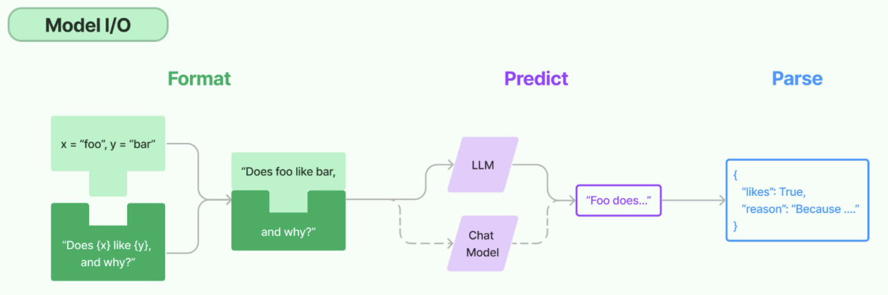
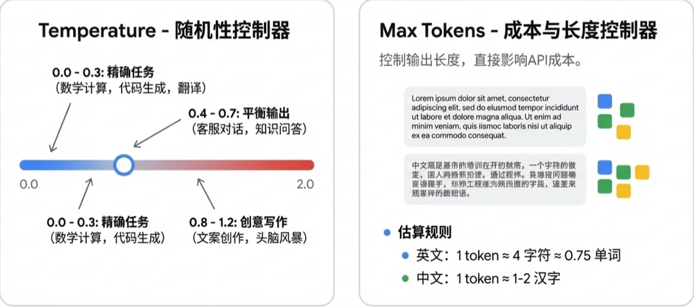

# 11 - Model I/O 与模型接入

---

**本章课程目标：**

- 从初学者视角真正理解 **Model I/O** 是什么，它为什么是 LangChain 中最基础、最核心的一层。
- 理解 LangChain 的 **Model I/O** 模块：输入提示（Prompt）、调用模型（Model）、输出解析（Parser）三件套。
- 掌握 LangChain 里最常见的**模型分类**、**标准化参数**、**返回值结构**，尤其是 Chat Model 与 `AIMessage`。

**前置知识建议：** 已学习 [第 9 章 LangChain 概述与架构](9-LangChain概述与架构.md)、[第 10 章 LangChain 快速上手与 HelloWorld](10-LangChain快速上手与HelloWorld.md)，至少已经跑通过一次 `invoke()` 调用，并对 `.env`、API Key、模型名、Base URL 这几项基础概念不陌生。

**学习建议：** 如果说 [第 10 章](10-LangChain快速上手与HelloWorld.md) 解决的是“先把模型调通”，那么本章开始解决的是“**把模型调用这件事系统化**”。建议按 **Model I/O 定义 → 模型分类 → 参数与返回值 → 模型接入方式** 的顺序学习，并和 [第 13 章 提示词与消息模板](13-提示词与消息模板.md)、[第 14 章 输出解析器](14-输出解析器.md) 连起来看。

---

## 1、Model I/O 简介

### 1.1 定义

**Model I/O** 是 LangChain 中专门负责“**如何和模型打交道**”的模块。你可以把它理解成：**模型输入怎么组织、模型怎么调用、模型输出怎么处理**，这三件事加在一起，就是 Model I/O。

如果用一句话定义：

> **Model I/O = Format（输入格式化）→ Predict（模型调用）→ Parse（输出解析）**

这三个词，是后续 LangChain 学习里最值得反复记住的一条主线。

- **Format（输入格式化）**：把原始业务输入整理成模型更容易理解的形式，例如 Prompt 模板、多角色消息、变量填充等。
- **Predict（模型调用）**：通过 LangChain 的统一接口调用不同模型提供商，例如 OpenAI、DeepSeek、阿里百炼、Ollama 等。
- **Parse（输出解析）**：把模型返回的自然语言结果转成更稳定、程序更好处理的形式，例如字符串、JSON、结构化对象等。



你可以把这张图看成后续几章的总地图：

- **Format** 主要会在 [第 13 章 提示词与消息模板](13-提示词与消息模板.md) 详细展开
- **Predict** 是本章的重点
- **Parse** 主要会在 [第 14 章 输出解析器](14-输出解析器.md) 详细展开

**官方文档与资源：**

- **Model I/O 总览**：https://docs.langchain.com/oss/python/langchain/models （英文）；https://docs.langchain.org.cn/oss/python/langchain/models （中文）
- **聊天模型集成**：https://docs.langchain.com/oss/python/integrations/chat （英文）；https://docs.langchain.org.cn/oss/python/integrations/chat （中文）

### 1.2 为什么需要 Model I/O

很多初学者在学完 HelloWorld 后，会觉得：“我已经会 `invoke()` 了，为什么还要单独学这一章？”

原因很简单：**会调一次模型，不等于真的理解了模型接入。**在真实项目里，你迟早会遇到这些问题：

- 同一个项目要接多个模型，怎么统一写法？
- 为什么有的地方用 `ChatOpenAI`，有的地方用 `init_chat_model`？
- 为什么有的返回是字符串，有的返回是 `AIMessage`？
- `temperature`、`max_tokens`、`timeout` 这些参数到底控制什么？
- OpenAI 官方 SDK、LangChain provider 包、OpenAI 兼容接口，它们到底是什么关系？

这些问题，单靠 HelloWorld 是讲不透的，而它们恰好就是 Model I/O 要解决的事。

### 1.3 用一个生活化比喻理解这三步

你也可以把 Model I/O 想成“点外卖”流程：

- **Format**：像下单前把需求写清楚，例如要不要辣、几人份、送到哪里。你写得越清楚，模型越不容易答偏。
- **Predict**：像把订单交给餐厅处理。你可以换不同餐厅（不同模型），但你希望下单方式尽量统一。
- **Parse**：像外卖到了之后先分装、贴标签。原始回答可能很长，但系统往往需要结构化的数据才能继续处理。

这个比喻虽然简单，但非常适合初学阶段建立直觉。因为 LangChain 做的，本质上就是让“下单方式尽量统一”“换餐厅尽量少改代码”“拿到结果后更方便继续处理”。

---

## 2、LangChain 模型分类、参数与返回

这一节围绕 Model I/O 中最核心的 **Predict（模型调用）** 展开。你需要先弄明白三件事：

1. LangChain 里到底有哪些模型类型
2. 调模型时常见参数是什么意思
3. 调完模型后，返回的到底是什么

### 2.1 先分清：模型本身、模型提供商、LangChain 模型对象

这是初学者最容易混淆的地方。在工程里，这三者不是一回事：

| 概念                   | 它是什么                 | 例子                                                                      |
| ---------------------- | ------------------------ | ------------------------------------------------------------------------- |
| **模型本身**           | 真正提供能力的模型       | `qwen-plus`、`deepseek-chat`、`glm-4`                                     |
| **模型提供商 / 平台**  | 提供 API 的厂商或平台    | 阿里百炼、DeepSeek、OpenAI、智谱                                          |
| **LangChain 模型对象** | 你在代码里操作的封装对象 | `ChatOpenAI`、`ChatDeepSeek`、`ChatTongyi`、`init_chat_model(...)` 返回值 |

举个最直观的例子：

- `deepseek-chat` 是**模型名**
- DeepSeek 是**提供商**
- `ChatDeepSeek(...)` 或 `init_chat_model(...)` 返回的对象，是**你在代码里实际调用的模型对象**

只有把这三层分清楚，后面你才不会把“换模型”“换平台”“换 LangChain 写法”混成一件事。

### 2.2 LangChain 常见模型分类

LangChain 不提供模型权重本身，它提供的是“**如何接这些模型**”的统一抽象。LangChain 将大语言模型按用途分为多种类型，**实际开发中最常用的是「聊天对话模型」**（ChatModel），用于多轮对话、系统角色与用户消息等场景。

从课程和实际项目的角度看，你最常碰到的是下面三类：

| 模型类型       | 输入形式         | 输出形式    | 主要特点                                 | 典型场景                        |
| -------------- | ---------------- | ----------- | ---------------------------------------- | ------------------------------- |
| **LLM**        | 纯文本字符串     | 文本字符串  | 更偏传统“文本补全”接口，无天然多角色结构 | 单轮生成、摘要、改写、补全      |
| **Chat Model** | 字符串或消息列表 | `AIMessage` | 更贴近对话，支持多角色消息与更丰富元数据 | 智能助手、客服、多轮对话、Agent |
| **Embeddings** | 文本或文本列表   | 向量        | 把文本转成语义向量，不负责生成文本       | RAG、检索、相似度计算、聚类     |

从“本课程重点”出发，可以直接记住一句话：

> **实际开发中最常用、也是本课程主线重点，是 Chat Model。**

因为后面的 Prompt、Message、Tools、Agent、Memory，本质上大多都建立在 Chat Model 的消息式交互之上。

### 2.3 LLM 和 Chat Model 到底有什么区别

很多同学第一次看到这里会疑惑：“不是都叫大模型吗，为什么 LangChain 里还要分 LLM 和 Chat Model？”

它们都属于“生成式模型”这一大类，但接口思维不同：

- **LLM**：更像“给一段文本，让模型补全或生成下一段”
- **Chat Model**：更像“给一段对话上下文，让模型按角色回复”

举个例子：

**LLM 风格：**

```python
prompt = "请用一句话解释什么是 LangChain"
```

**Chat Model 风格：**

```python
messages = [
    {"role": "system", "content": "你是一个技术助教"},
    {"role": "user", "content": "请用一句话解释什么是 LangChain"},
]
```

从真实项目角度看，Chat Model 通常更适合现代 AI 应用，因为它：

- 更自然地支持 system / user / assistant 角色
- 更适合多轮对话
- 返回结果通常带有更多元数据
- 更容易和 Tools、Agent、Structured Output 结合

### 2.4 为什么 Embedding 也放在这里

Embedding 不是“会说话”的模型，但它依然属于 Model I/O 体系的一部分，因为它同样是“模型能力的接入”。

区别在于：

- Chat Model 负责“生成回答”
- Embedding Model 负责“把文本转成向量”

后面你在 [第 18 章 向量数据库与 Embedding 实战](18-向量数据库与Embedding实战.md) 和 [第 19 章 RAG 检索增强生成](19-RAG检索增强生成.md) 会深入学习它。这里先建立一个概念即可：**Embedding 也是模型，只是它的输出不是自然语言，而是向量。**

### 2.5 常用模型参数

在构建聊天模型时，常用 **`init_chat_model`（LangChain 1.0+）** 或各集成包中的模型类。LangChain 对聊天模型定义了一批**标准化参数**，名称在不同写法下基本一致，便于换厂商时少改代码。

- **官方说明**：https://docs.langchain.com/oss/python/langchain/models#parameters （英文）；https://docs.langchain.org.cn/oss/python/langchain/models#parameters （中文）

下面是最常见、也最值得先掌握的一组参数：

| 参数名           | 作用                | 初学者怎么理解                                                      |
| ---------------- | ------------------- | ------------------------------------------------------------------- |
| `model`          | 模型名称或标识符    | 你要调哪个模型，例如 `qwen-plus`、`deepseek-chat`                   |
| `model_provider` | 提供商 / 协议来源   | 按哪种 provider 或协议创建底层客户端，例如 `"openai"`、`"deepseek"` |
| `api_key`        | 接口鉴权凭证        | 没它通常就无法调用                                                  |
| `base_url`       | 接口根地址          | 请求发到哪里，兼容接口时尤其常见                                    |
| `temperature`    | 随机性 / 创造性控制 | 越低越稳定，越高越发散                                              |
| `max_tokens`     | 最大生成长度        | 回答最多生成多少 token，也影响费用                                  |
| `timeout`        | 超时时间            | 请求最长等多久                                                      |
| `max_retries`    | 失败重试次数        | 临时异常时自动重试几次                                              |
| `stop`           | 停止词              | 生成到某些位置时强制停止                                            |

下面这张图很适合初学者建立直觉：



你可以先这样记：

- **`temperature`** 管“风格和发散度”
- **`max_tokens`** 管“长度和成本”

在真实项目里，这两个参数经常是最先调的。

### 2.6 Token、max_tokens 与计费的关系

大模型在内部把文本切成 **token** 再计算与生成，可以理解为比「字」更细或更粗的片段（取决于分词器）：输出往往是**逐个 token 依次生成**。厂商计费、上下文长度上限、接口返回的用量统计，通常也都以 **token 数**为单位。

经验性换算（仅供直觉参考，**以各平台分词器实测为准**）：

- 中文：约 **1 个 token ≈ 1～1.8 个汉字**（因模型与分词器而异）。
- 英文：约 **1 个 token ≈ 3～4 个字母** 或更短/common 的词会合并为更少的 token。

因此设置 `max_tokens` 时，既是在限制**回答长度**，也直接影响**单次调用的费用上限**（在按输出 token 计费时）。

**Token / 字符 ↔ token 可视化工具（在线估算）**

- OpenAI：[Tokenizer](https://platform.openai.com/tokenizer)（主要适用于 OpenAI 系列分词规则）。
- 百度智能云：[Tokenizer](https://console.bce.baidu.com/support/#/tokenizer)。

### 2.7 参数怎么选更贴近实际项目

参数不是越多越好，也不是每次都要调满。更实用的做法是根据业务场景选：

- **客服问答 / 规则回答 / 翻译**：`temperature` 往往设低一些，例如 `0`～`0.3`
- **知识问答 / 通用助手**：可设在 `0.2`～`0.7`
- **文案、创意写作、头脑风暴**：可适当更高，例如 `0.8`～`1.2`

`max_tokens` 的使用也一样：

- 如果只是简短问答，可以限制小一点，避免无意义长回答
- 如果是总结、分析、长文输出，可以适当放大

但有一点要始终记住：

> **参数只是调味料，底层模型能力、Prompt 设计、上下文质量，通常比单纯调 `temperature` 更重要。**

### 2.8 基本案例

【案例源码】`案例与源码-2-LangChain框架/02-models_io/ModelIO_Params.py`

[ModelIO_Params.py](案例与源码-2-LangChain框架/02-models_io/ModelIO_Params.py ":include :type=code")

这个案例非常适合做三件事：

1. 看 `temperature` 改变后，多次输出的差异
2. 看 `model.invoke(...)` 返回对象的真实结构
3. 看 `type(model)`、`type(response)`、`type(response.content)` 分别是什么

它不是一个“功能型案例”，而是一个“认识模型参数和返回值”的教学案例。

### 2.9 调用后的返回信息

在 LangChain 的 Chat Model 语境里，最常见的返回对象是 `AIMessage`。

例如：

```python
response = model.invoke("写一句关于春天的诗，14 字以内")

print(type(model))             # 模型客户端对象
print(type(response))          # AIMessage
print(type(response.content))  # str
```

这里最关键的理解是：

- `model` 不是字符串，它是一个模型客户端对象
- `response` 也不只是字符串，它通常是一个 **消息对象**
- 真正的正文文本，一般在 `response.content`

### 2.10 AIMessage 上常见字段

对初学者来说，下面几个字段最值得先掌握：

| 字段 / 属性         | 作用                           | 你通常怎么用                            |
| ------------------- | ------------------------------ | --------------------------------------- |
| `content`           | 模型回复正文                   | 最常用，绝大多数业务先读它              |
| `response_metadata` | 厂商返回的原始元数据           | 看模型名、finish_reason、token_usage 等 |
| `usage_metadata`    | LangChain 统一整理后的用量信息 | 看 input/output/total tokens            |
| `tool_calls`        | 工具调用信息                   | 做 Tools / Agent 时很关键               |
| `additional_kwargs` | 厂商扩展字段                   | 按需使用                                |

一个典型的 `AIMessage`，可以粗略理解成：

```text
AIMessage(
  content='《鹧鸪天·春》\n一篙绿涨江南岸，…',   # 用户可见回复
  response_metadata={
    'token_usage': {
      'prompt_tokens': 14,
      'completion_tokens': 109,
      'total_tokens': 123,
      ...
    },
    'model_name': 'deepseek-chat',
    'finish_reason': 'stop',
    ...
  },
  usage_metadata={
    'input_tokens': 14,
    'output_tokens': 109,
    'total_tokens': 123,
    ...
  },
  tool_calls=[],
  ...
)
```

所以平时最常见的操作有两个：

- 要看正文：`response.content`
- 要看 token、模型名、结束原因：`response.response_metadata` 或 `response.usage_metadata`

> **提示**：不同 LangChain 版本与厂商集成下，字段是否齐全会有差异；若 `usage_metadata` 为空，可优先查看 `response_metadata` 中的 `token_usage` 等原始结构。

### 2.11 Messages 为什么重要

本章先点到为止，后面会在 [第 13 章 提示词与消息模板](13-提示词与消息模板.md) 专门展开。你现在只需要先建立一个概念：

> **Chat Model 的输入输出，本质上都是“消息（Message）”。**

最常见的消息类型包括：

- `SystemMessage`
- `HumanMessage`
- `AIMessage`
- `ToolMessage`

所以，从 Model I/O 角度看，**Prompt 只是输入的一种组织方式，Message 才是 Chat Model 更底层的统一表达。**

---

## 3、接入大模型

前面讲的是“调用这一层的通用规律”，这一节开始进入最实际的部分：**怎么把不同模型接进来。**

### 3.1 三种常见接入思路

在真实项目里，最常见的模型接入方式其实可以归纳为三类：

| 接法                            | 典型代表                                   | 适合什么                                              |
| ------------------------------- | ------------------------------------------ | ----------------------------------------------------- |
| **官方 SDK 直连**               | `openai.OpenAI`                            | 只做底层 API 调用，不打算用 LangChain 编排            |
| **LangChain provider / 模型类** | `ChatOpenAI`、`ChatDeepSeek`、`ChatTongyi` | 已经决定使用某个 provider 包，希望结合 LangChain 生态 |
| **LangChain 统一入口**          | `init_chat_model(...)`                     | 新项目推荐，适合统一风格、减少对具体类名的依赖        |

你可以把它们理解成三种不同层次：

- **OpenAI SDK**：更底层，最贴近原生 API
- **具体模型类**：LangChain 生态中的 provider 封装
- **统一入口**：LangChain 1.x 更推荐的高层入口

### 3.2 接入 OpenAI 及兼容接口

这是最值得先讲清楚的一类，因为很多国内平台、网关平台、本地服务，最终都会走“**OpenAI 兼容接口**”这条路。

#### 3.2.1 定义

意思很简单：某个平台虽然不是 OpenAI，但它把自己的 API 设计成和 OpenAI 接口很像，因此你可以复用很多 OpenAI 风格的客户端和调用方式。

典型例子包括：

- 阿里百炼兼容接口
- DeepSeek 兼容接口
- OpenRouter
- 某些本地代理 / 网关服务

这也是为什么你会在很多代码里看到：

- `base_url=...`
- `api_key=...`
- `model="xxx"`

这些参数组合在一起，本质上就是在用某个“兼容 OpenAI 协议”的入口调模型。

#### 3.2.2 openai.OpenAI 与 ChatOpenAI 的区别

这是非常常见的面试点，也是很多新手最容易混的点。

| 对比项       | `openai.OpenAI`            | `langchain_openai.ChatOpenAI`        |
| ------------ | -------------------------- | ------------------------------------ |
| **所属生态** | OpenAI 官方 Python SDK     | LangChain 生态                       |
| **定位**     | 更底层、直接发请求         | LangChain 中的聊天模型封装           |
| **返回结果** | 更贴近 OpenAI 原生响应结构 | 更贴近 `AIMessage` 等 LangChain 结构 |
| **适合场景** | 只想简单调 API             | 想继续接 Prompt、Parser、LCEL、Agent |

可以这样理解：

- **`openai.OpenAI`** 更像“直接打 HTTP 的官方 SDK 版”
- **`ChatOpenAI`** 更像“已经接进 LangChain 体系后的模型对象”

所以：

- 如果你只是想调一次接口，`openai.OpenAI` 完全可以
- 如果你后面还要接 Prompt、输出解析、LCEL、Agent，通常优先考虑 LangChain 模型对象

#### 3.2.3 案例一：OpenAI 官方 SDK

【案例源码】`案例与源码-2-LangChain框架/02-models_io/ModelIO_OpenAI.py`

[ModelIO_OpenAI.py](案例与源码-2-LangChain框架/02-models_io/ModelIO_OpenAI.py ":include :type=code")

这个案例的教学重点是：

- 让你看到“不经过 LangChain，也可以直接调模型”
- 帮你分清楚“原生 SDK 调用”和“LangChain 调用”的边界

#### 3.2.4 案例二：使用 ChatOpenAI

【案例源码】`案例与源码-2-LangChain框架/02-models_io/ModelIO_ChatOpenAI.py`

[ModelIO_ChatOpenAI.py](案例与源码-2-LangChain框架/02-models_io/ModelIO_ChatOpenAI.py ":include :type=code")

这个案例的重点是：

- 用 `ChatOpenAI + base_url` 调 OpenAI 兼容端点
- 输入可以直接是消息列表
- 返回是 LangChain 语义下的消息对象

这类写法在旧教程和大量现有项目里非常常见，所以你一定要能读懂。

#### 3.2.5 案例三：使用 init_chat_model

【案例源码】`案例与源码-2-LangChain框架/02-models_io/ModelIO_Init_chat_model.py`

[ModelIO_Init_chat_model.py](案例与源码-2-LangChain框架/02-models_io/ModelIO_Init_chat_model.py ":include :type=code")

这就是当前更推荐你掌握的 1.x 统一入口写法。

它的价值在于：

- 同一套骨架更容易切换 provider
- 更利于项目统一风格
- 不用为每一家 provider 死记不同类名

但也要注意一个现实问题：

> **`init_chat_model` 不是“完全不用关心 provider”，而是把 provider 的细节收敛到参数上。**

也就是说，你还是要知道：

- 调的是哪个模型
- 用的是哪种 provider / 协议
- 是否需要额外安装对应 provider 包

#### 3.2.6 真实项目建议

如果按真实项目开发给建议，可以这样选：

- **只想调一次接口、写最小 demo**：`openai.OpenAI`
- **已经在 LangChain 体系里、维护旧项目较多**：`ChatOpenAI`
- **新项目、想统一模型接入风格**：`init_chat_model`

本课程主线会更偏向 **`init_chat_model`**，但不会忽略 `ChatOpenAI`，因为后者在真实项目和旧资料里仍然非常常见。

### 3.3 接入 DeepSeek

#### 3.3.1 常见接法

在 LangChain 里，DeepSeek 常见有两种接法：

1. **通过 OpenAI 兼容接口接入**
2. **通过 `langchain-deepseek` 原生 provider 包接入**

这两种方式都能用，差别主要在于：

- **兼容接口接法**：更统一，适合多模型共用一种风格
- **原生 provider 接法**：更贴近 DeepSeek 自身集成，某些特性表达更自然

#### 3.3.2 ChatDeepSeek 原生集成

【案例源码】`案例与源码-2-LangChain框架/02-models_io/ModelIO_DeepSeek.py`

[ModelIO_DeepSeek.py](案例与源码-2-LangChain框架/02-models_io/ModelIO_DeepSeek.py ":include :type=code")

这个案例演示的是：

- 安装 `langchain-deepseek`
- 使用 `ChatDeepSeek`
- 不手动写 `base_url`
- **文档**：
  - https://docs.langchain.com/oss/python/integrations/providers/deepseek （英文）
  - https://docs.langchain.org.cn/oss/python/integrations/providers/deepseek （中文）

#### 3.3.3 用 init_chat_model 接 DeepSeek

如果你更想保持统一写法，也可以继续用 `init_chat_model`。

常见有两种思路：

**方式一：按 OpenAI 兼容接口接**

```python
import os
from langchain.chat_models import init_chat_model

model = init_chat_model(
    model="deepseek-chat",
    model_provider="openai",
    api_key=os.getenv("deepseek-api"),
    base_url="https://api.deepseek.com",
)

print(model.invoke("你是谁？").content)
```

**方式二：如果当前环境已安装并注册 DeepSeek provider 包，也可按 provider 方式接**

```python
import os
from langchain.chat_models import init_chat_model

model = init_chat_model(
    model="deepseek-chat",
    model_provider="deepseek",
    api_key=os.getenv("deepseek-api"),
)
```

### 3.4 接入通义千问

#### 3.4.1 常见接法

和 DeepSeek 类似，通义常见也有两条路线：

1. **OpenAI 兼容接口路线**
2. **阿里云原生集成路线**

如果从“统一风格、少记类名”出发，本课程更推荐优先理解第一种；如果从“只用通义、希望原生接入”出发，也要认识第二种。

官方参考：

- **Alibaba Cloud provider 页**：https://docs.langchain.com/oss/python/integrations/providers/alibaba_cloud

#### 3.4.2 兼容接口路线：ChatOpenAI / init_chat_model

这条路线本质上就是：

- `api_key` 用阿里百炼 Key
- `base_url` 用百炼兼容接口地址
- `model` 写 `qwen-plus` 等模型名

这也是你在 [第 10 章 HelloWorld](10-LangChain快速上手与HelloWorld.md) 里已经接触过的主线写法。

对应本章的案例是：

【案例源码】`案例与源码-2-LangChain框架/02-models_io/ModelIO_ChatOpenAI.py`
【案例源码】`案例与源码-2-LangChain框架/02-models_io/ModelIO_Init_chat_model.py`

#### 3.4.3 原生路线：ChatTongyi

【案例源码】`案例与源码-2-LangChain框架/02-models_io/ModelIO_Qwen.py`

[ModelIO_Qwen.py](案例与源码-2-LangChain框架/02-models_io/ModelIO_Qwen.py ":include :type=code")

这个案例演示的是阿里云原生集成：

- 使用 `langchain_community` 中的 `ChatTongyi`
- 不通过 OpenAI 兼容接口
- 更贴近阿里云自身原生接法

### 3.5 接入智谱科技

#### 3.5.1 定位

智谱是一个独立 provider。你在 LangChain 中接它时，通常不是走阿里百炼那种 OpenAI 兼容路线，而是走它自己的集成方式。

官方参考：

- **ZhipuAI Chat 集成文档**：https://docs.langchain.com/oss/python/integrations/chat/zhipuai

#### 3.5.2 文档示例

```python
# 需先安装对应包；.env 中配置 ZHIPUAI_API_KEY
import os
from langchain_zhipuai import ChatZhipuAI

model = ChatZhipuAI(
    model="glm-4",
    temperature=0.7,
    api_key=os.getenv("ZHIPUAI_API_KEY"),
)

print(model.invoke("你是谁？").content)
```

这一节的意义主要是让你知道：

- LangChain 支持的不只是 OpenAI 兼容接口
- 也有不少 provider 是走**原生集成**路线
- 后面你换厂商时，核心思维还是一样：**安装对应 provider 包 → 配 Key → 初始化模型对象 → `invoke()`**

### 3.6 真实项目的选型建议

如果从企业项目或个人长期项目的角度出发，这里给一个比较稳的建议：

**第一层选择：先决定是不是要进入 LangChain 体系。**

- 只是简单调用：原生 SDK 就够
- 要继续做 Prompt、Parser、LCEL、Agent：尽早进入 LangChain 模型对象

**第二层选择：在 LangChain 里决定用 provider 类还是统一入口。**

- 新项目优先考虑 `init_chat_model`
- 维护旧项目或已有 provider 类代码时，直接用 `ChatOpenAI` / `ChatDeepSeek` / `ChatTongyi` 也完全合理

**第三层选择：决定走兼容接口还是原生 provider。**

- 想统一风格、少记类名：兼容接口路线更简单
- 想贴近厂商原生能力：原生 provider 路线通常表达更完整

---

**本章小结：**

- **Model I/O** 是 LangChain 中最基础、最核心的一层，负责 **Format → Predict → Parse** 三步。其中本章重点讲的是 **Predict（模型调用）**：模型如何分类、如何配置参数、如何返回结果，以及如何把不同 provider 接进来。
- 从课程和真实项目角度看，最值得重点掌握的是 **Chat Model**。它比传统 LLM 更适合多轮对话、消息结构、工具调用和 Agent 场景，返回结果通常是 **`AIMessage`**，最常用字段是 `content`、`response_metadata` 和 `usage_metadata`。

**建议下一步：** 先把本章的 `02-models_io` 目录按顺序跑一遍，推荐顺序是：`ModelIO_OpenAI.py` → `ModelIO_ChatOpenAI.py` → `ModelIO_Init_chat_model.py` → `ModelIO_Params.py` → `ModelIO_DeepSeek.py` → `ModelIO_Qwen.py`。跑完之后，再进入 [第 12 章 Ollama 本地部署与调用](12-Ollama本地部署与调用.md)、[第 13 章 提示词与消息模板](13-提示词与消息模板.md)、[第 14 章 输出解析器](14-输出解析器.md)，把本章中的 “模型接入” 和后续的 “输入组织”“输出解析” 串成完整闭环。
