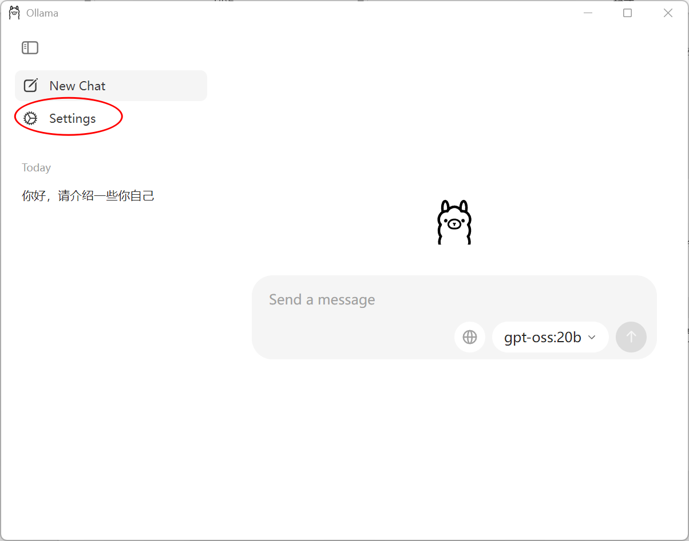
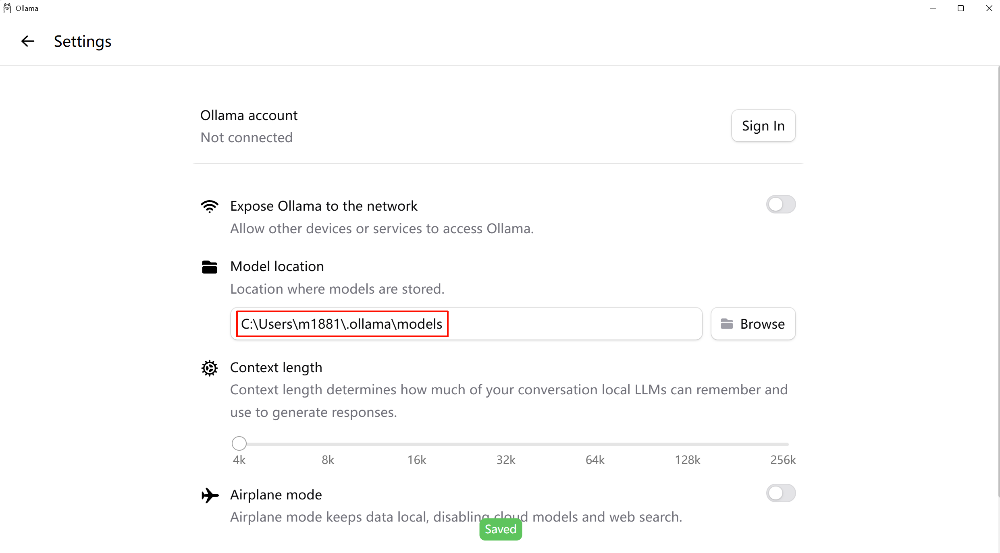

# 12 - Ollama 本地部署与调用

---

**本章课程目标：**

- 理解 **Ollama** 是什么、能做什么，以及如何获取程序与模型。
- 掌握 Ollama 的**安装与配置**（含自定义路径、模型存储目录）、**常用命令**及**安装与验证模型**的步骤。
- 学会使用 **LangChain**（`langchain-ollama` 的 `ChatOllama`）调用本地 Ollama 服务，无需 API Key，适合本地开发与离线使用。本章是 [第 11 章 Model I/O](11-Model-I-O与模型接入.md) 中「模型」一环的**本地接入方式**，与云端 API 互为补充。

**前置知识建议：** 已学习 [第 9 章 LangChain 概述与架构](9-LangChain概述与架构.md)、[第 10 章 快速上手与 HelloWorld](10-LangChain快速上手与HelloWorld.md)、[第 11 章 Model I/O 与模型接入](11-Model-I-O与模型接入.md)，了解 LangChain 的定位与模型调用方式。

---

## 1、Ollama 简介

### 1.1 定义

**Ollama** 是一个**开源**的本地大模型运行环境：让你**在自己电脑上跑大模型**的一个免费、开源小工具。装好之后，输入一条命令就能下载并运行各种开源模型（比如 LLaMA、Qwen、DeepSeek），不用自己折腾显卡、环境，它会把模型和配置都打包好。


**它解决什么问题**

- 用少量命令（如 `ollama run 模型名`）即可**下载并运行**多种开源权重（常见为 **LLaMA 系**及兼容生态下的 **Qwen、DeepSeek** 等），自动处理本地服务与默认配置。
- 对学习者、原型验证、**离线或隐私敏感**场景很友好：数据不出本机，也无需云端 API Key。
- 与 **LangChain**（`langchain-ollama`）、TaskWeaver 等框架**集成成熟**，可像调用普通聊天模型一样对接本地 Ollama。

**需要有的预期**

- **定位**：更偏**本地开发、教学与快速试验**，不是大规模生产推理的唯一选型。
- **生产环境**：高并发、极致吞吐或企业级部署时，往往会采用 **vLLM**、TGI 等专用推理框架；本章聚焦 Ollama 的「本机跑通 + 与 LangChain 对接」。

**一句话**：在自己电脑上装一个 Ollama，就能用简单命令把开源大模型跑起来，适合入门和本地项目；和 [第 11 章](11-Model-I-O与模型接入.md) 里的云端 API 调用是同一类「模型接入」，只是端点换成本地。

**官方文档与资源：**

- **Ollama 官网**：https://ollama.com（入口与文档导航）
- **安装包下载**：https://ollama.com/download
- **模型搜索 / 模型库**：https://ollama.com/search
- **源码仓库（GitHub）**：https://github.com/ollama/ollama
- **Ollama 官方文档**：
  - https://ollama.com/docs （英文）
  - https://ollama.com/zh-CN/docs （中文）
- **LangChain 与 Ollama 集成文档**：
  - https://docs.langchain.com/oss/python/integrations/chat/ollama （英文）
  - https://docs.langchain.org.cn/oss/python/integrations/chat/ollama （中文）

### 1.2 下载方式

- **下载 Ollama 程序**
  - 官网 / 下载页：https://ollama.com 、https://ollama.com/download ，支持 Windows、macOS、Linux；也可从 **GitHub** 了解版本与源码：https://github.com/ollama/ollama 。
  - Docker：用容器部署时到 **Docker Hub** 拉 Ollama 镜像即可。

- **下载模型**
  - **Ollama Hub / 模型库**：在官网或命令行里选模型、下模型（如 `llama3`、`qwen:4b`、`deepseek-r1:14b`），执行 `ollama run 模型名` 时会自动从这里拉取。

### 1.3 运行环境与硬件建议

**说明**：Ollama 能不能流畅跑起来，主要取决于你选的**模型有多大**（参数量、量化方式等）。下面是一般性的经验参考，**以本机实际可用内存、官方文档与模型页说明为准**。

**1）内存（RAM）**

参数越多，通常越吃内存。常见量级可粗记为：

- **约 7B（70 亿参数）**：建议至少 **8GB 可用内存**再跑 7B 级别模型（系统与其它软件还会占一部分，留余量更稳）。
- **约 13B**：建议约 **16GB** 内存级别。
- **约 33B**：建议约 **32GB** 内存级别。

若内存不够，容易出现加载失败、极慢或频繁换页卡顿。

**2）磁盘空间**

模型文件体积往往不小，除程序本体外，建议整体为 Ollama 与模型**至少预留约 50GB** 可用空间（多装几个模型时还要再加）。

**3）CPU**

性能较好、**多核**的 CPU 更有利于推理与并行，在纯 CPU 跑模型时体验差异会更明显。

**4）显卡（GPU）**

Ollama **可以只用 CPU 跑**。在 **NVIDIA GPU** 且驱动/CUDA 环境正常时，通常会走 GPU 加速，速度一般明显好于纯 CPU；在 **Apple Silicon（M 系列）** 上，Ollama 通常会利用 **Metal** 做加速，同样不必手动配置训练框架。具体是否走加速、占用哪块设备，以本机运行日志与活动监视器为准。

---

## 2、安装与配置

### 2.1 自定义 Ollama 安装路径与模型存储目录

若希望将 Ollama 或模型文件安装到非默认目录（例如 D 盘或大容量磁盘），可先自定义安装路径，再设置**模型存储目录**。**Windows 下建议不要装到 C 盘**，以免程序与模型占满系统盘；安装时或安装前将安装路径与模型目录设到 D 盘等其他盘符即可。


### 2.2 设置模型存储目录（环境变量）

手动创建用于存放模型的目录（如 `D:\devSoft\Ollama\models`），然后新建系统环境变量：

- **变量名**：`OLLAMA_MODELS`
- **变量值**：`D:\devSoft\Ollama\models`（按你的实际路径填写）

这样 Ollama 拉取的模型会保存到该目录，便于管理和迁移。


> **图示说明**：在「系统属性 → 环境变量」中为 `OLLAMA_MODELS` 赋值后，新开的终端里 Ollama 会把下载的模型存到该路径。

### 2.3 复制或迁移已有模型目录

若之前已在其他位置下载过模型，可将整个模型目录复制到上述 `OLLAMA_MODELS` 路径下，避免重复下载。


### 2.4 图形界面修改模型目录

部分 **Ollama 桌面客户端**提供 **Settings（设置）**，可在界面里把 **Models / Model location（模型存放位置）** 指到自定义文件夹（与 §2.2 的 `OLLAMA_MODELS` 目的一样：把大文件放到空间更大的盘）。菜单名称可能随版本微调，以你本机为准。





改完后建议**重启 Ollama**或新开终端，用 `ollama list` 确认模型是否在预期目录下被识别。

---

## 3、常用命令

安装完成后，在终端中可使用以下命令（Windows 需在安装后打开新的终端以使环境变量生效）：

| 命令                                  | 说明                                        |
| ------------------------------------- | ------------------------------------------- |
| `ollama pull llama3`                  | 下载指定模型（如 llama3）。                 |
| `ollama run llama3`                   | 启动并进入该模型的交互对话。                |
| `ollama list`                         | 列出本机已下载的所有模型。                  |
| `ollama rm llama3`                    | 删除指定模型以释放磁盘空间。                |
| `ollama cp llama3 my-llama3`          | 本地复制或重命名模型。                      |
| `ollama show llama3`                  | 查看模型详细信息（参数、大小等）。          |
| `ollama create my-model -f Modelfile` | 使用 Modelfile 构建自定义模型。             |
| `ollama serve`                        | 启动后台服务，供 API 调用（通常自动启动）。 |
| `ollama ps`                           | 查看当前正在运行的模型进程。                |
| `ollama stop llama3`                  | 停止正在运行的指定模型。                    |

**退出 `ollama run` 交互对话**

用 `ollama run <模型名>` 进入聊天后，若要回到普通终端提示符：

- 在对话里输入 `/bye`（Ollama 提供的退出指令）；
- 或使用快捷键 **Ctrl+D**（向终端发送「结束输入」，在 macOS / Linux 上很常见；Windows 新终端多也支持，若无效可再试 **Ctrl+Z** 后回车，或直接关闭该终端标签页）。

---

## 4、安装与验证模型

### 4.1 验证 Ollama 是否安装成功

建议做两件事：**能打出版本号**（说明命令已装进 PATH），**默认端口 11434 在监听**（说明后台服务起来了）。下面以 **Windows 命令提示符 / PowerShell** 为例（与常见安装截图一致）；macOS / Linux 用文中对应命令即可。

**1）看版本号**

在终端执行：

```bash
ollama --version
```

若安装成功且环境变量生效，会看到类似输出（具体版本号随你安装的版本变化）：

```text
ollama version is 0.5.11
```

能出现 `ollama version is …` 就表示本机已经能调用 `ollama` 命令。

**2）看服务是否在监听 11434**

Ollama 默认在本机 **11434** 端口提供 HTTP 服务。Windows 下可执行：

```bash
netstat -ano | findstr 11434
```

若服务正常，输出里通常会出现一行类似（最后一列为进程 PID，与你机器上实际值可能不同）：

```text
TCP    127.0.0.1:11434        0.0.0.0:0              LISTENING       13728
```

含义简述：**127.0.0.1:11434** 表示在本机回环地址上监听；**LISTENING** 表示端口已打开、正在等待连接，说明 Ollama 服务已在跑。

**其它系统（命令速查）**

- macOS / Linux：优先用 `lsof -i :11434`；或 `netstat -an | grep 11434`（macOS）、`netstat -tlnp | grep 11434`（Linux，部分系统需 root 才显示进程）。

> **lsof 和 netstat 的区别**：**lsof**（list open files）在 Unix/macOS 里可列出占用端口的**进程**（PID、进程名），适合回答「谁在用 11434」。**netstat** 偏重**连接状态**（如 LISTEN、ESTABLISHED）；在 Windows 上配合 `findstr` 筛端口很常见。查 Ollama 是否在跑时，任选一方式，能确认 **11434** 处于监听即可。

### 4.2 以通义千问、DeepSeek 为例运行模型

执行 `ollama run <模型名>` 时，**若本地还没有该模型，Ollama 会先自动拉取（pull）再启动对话**，无需先单独执行 `ollama pull`；若已拉取过则直接进入对话。

- **浏览可用模型**：在浏览器打开 https://ollama.com/search ，可查模型名、标签与体积说明；命令行里的名字须与列表中一致。
- **千问**（示例 4B 尺寸）：
  ```bash
  ollama run qwen:4b
  ```
- **千问**（示例 8B 量级，标签以官网为准，如提供 `qwen3:8b`）：
  ```bash
  ollama run qwen3:8b
  ```
- **DeepSeek R1**（示例 14B）：
  ```bash
  ollama run deepseek-r1:14b
  ```

**使用课程资料中的离线模型**：若资料里已提供整包 **models** 目录或模型文件，可先在 §2.2 设置 `OLLAMA_MODELS` 或在 §2.5 桌面端把 **Model location** 指到该文件夹，再执行 `ollama list` / `ollama run <名称>`，可减少在线下载或避免重复拉取。

进入对话后，可直接输入问题与模型交互；**退出交互界面**见上文 **§3、常用命令**（`/bye`、Ctrl+D 等）。

---

## 5、LangChain 整合 Ollama 调用本地大模型

在本地用 Ollama 跑通模型后，即可在 Python 中用 LangChain 通过 HTTP 调用本地 Ollama 服务，无需 API Key，适合本地开发与调试。

### 5.1 环境要求与依赖

- 确保已安装**最新版 Ollama**，并已通过 `ollama run <模型名>` 或后台服务拉取过至少一个模型。
- 安装 LangChain 的 Ollama 集成包与（可选）官方 Ollama Python 包：

```bash
pip install -qU langchain-ollama
pip install -U ollama
```

### 5.2 示例代码

以下使用 `langchain_ollama` 的 `ChatOllama` 连接本机 Ollama（默认 `http://localhost:11434`）。**`model=` 必须与 `ollama list` 中已存在的名称一致**（如 `qwen:4b`、`qwen3:8b` 等，以你本机为准）。

**写法一：消息列表（与 OpenAI 风格一致，便于后续接链）**

多角色、多轮写法见 [第 13 章 提示词与消息模板](13-提示词与消息模板.md)；此处仅演示单条用户消息。

```python
# pip install langchain-ollama
from langchain_core.messages import HumanMessage
from langchain_ollama import ChatOllama

ollama_llm = ChatOllama(model="qwen3:8b")  # 若本机无该标签，可改为 qwen:4b 等

messages = [HumanMessage(content="你好，请介绍一下你自己")]
resp = ollama_llm.invoke(messages)
print(resp.content)
```

**写法二：显式指定 `base_url`（非默认地址、远程 Ollama 或自定义端口时）**

```python
# pip install langchain-ollama
from langchain_core.messages import HumanMessage
from langchain_ollama import ChatOllama

ollama_llm = ChatOllama(
    model="qwen3:8b",
    base_url="http://localhost:11434",
)

messages = [HumanMessage(content="你好，请介绍一下你自己")]
resp = ollama_llm.invoke(messages)
print(resp.content)
```

**写法三：直接传入字符串（最简）**

与 [第 11 章](11-Model-I-O与模型接入.md) 一致，`invoke("一句话")` 等价于单条用户消息，适合快速试验：

```python
from langchain_ollama import ChatOllama

model = ChatOllama(model="qwen:4b", base_url="http://localhost:11434")
print(model.invoke("什么是 LangChain，100 字以内").content)
```

【案例源码】`案例与源码-2-LangChain框架/03-ollama/LangChain_Ollama.py`（字符串 `invoke` 示例）

[LangChain_Ollama.py](案例与源码-2-LangChain框架/03-ollama/LangChain_Ollama.py ":include :type=code")

---

**本章小结：**

- **Ollama** 用于在本地一键运行开源大模型；安装后通过 `ollama pull`、`ollama run` 等命令拉取与运行模型，默认提供本地 API（端口 11434）。
- **安装与配置**：§2.4 各系统安装（含官网安装包与 Linux `install.sh`）；§2.1～§2.3 自定义路径与 `OLLAMA_MODELS`；§2.5 可选图形界面改 **Model location**；模型列表见 https://ollama.com/search 。
- **LangChain 整合**：通过 **langchain-ollama** 的 `ChatOllama` 在 LangChain 中调用本地模型，无需 API Key，与 [第 11 章](11-Model-I-O与模型接入.md) 的 `ChatOpenAI` 用法一致，可接入 [提示词](13-提示词与消息模板.md)、[链](15-LCEL与链式调用.md)、[Agent](21-Agent智能体.md) 等组件。

**建议下一步：** 学习 [第 13 章 提示词与消息模板](13-提示词与消息模板.md)、[第 14 章 输出解析器](14-输出解析器.md)，与 [第 11 章 Model I/O](11-Model-I-O与模型接入.md) 形成完整的「输入 → 模型 → 输出解析」闭环；再用 [第 15 章 LCEL 与链式调用](15-LCEL与链式调用.md) 将三件套串成链。
