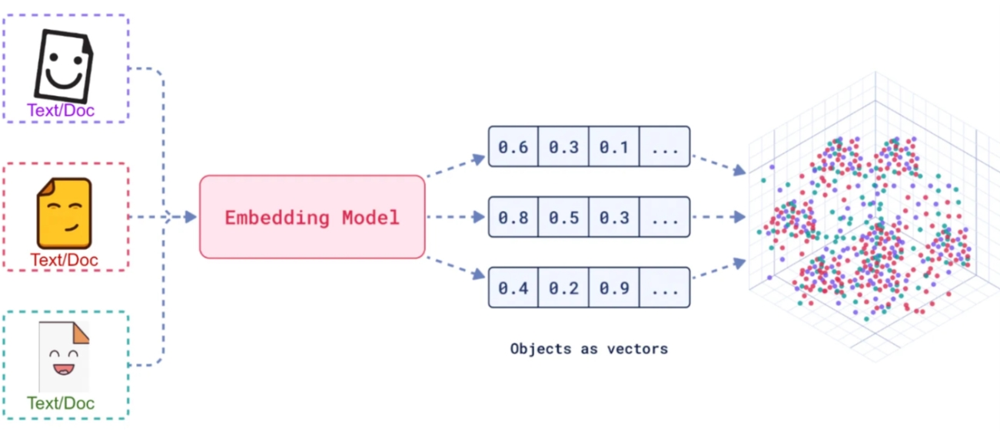
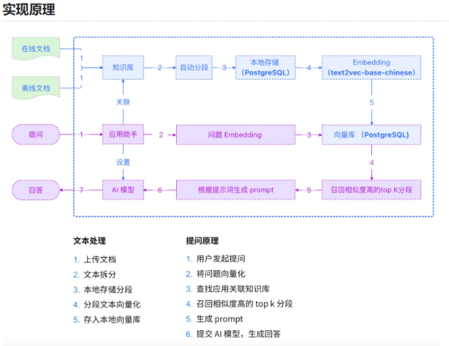
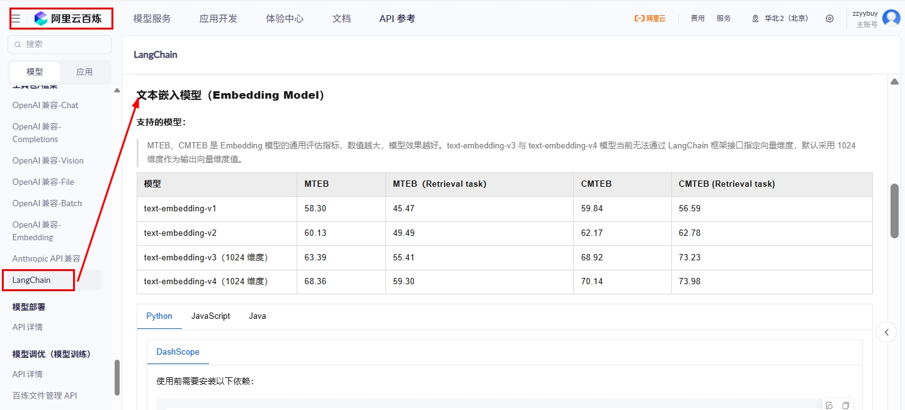

# 18 - 向量数据库与 Embedding 实战

---

**本章课程目标：**

- 理解**向量（Vector）**与**向量化**的概念，以及文本/图像等如何通过嵌入模型转为高维向量。
- 掌握**向量数据库（Vector Store）**是什么、能干什么，以及与传统关系数据库「精确匹配」的区别（相似性搜索）。
- 会使用 **Embedding 模型**做文本向量化，并会用**余弦相似度**比较文本语义相似性；能将向量存入 **RedisStack** 等向量库并做检索。

**前置知识建议：** 已学习 [第 9 章 - LangChain 概述与架构](9-LangChain概述与架构.md)、[第 10 章 - LangChain 快速上手与 HelloWorld](10-LangChain快速上手与HelloWorld.md)。具备 Python 基础与基本环境配置能力。

**学习建议：** 先建立「向量 → 向量化 → 向量数据库 → 相似性检索」的直觉，再动手跑通 Embedding 与 Redis 存取的案例；学完本章后可继续 [第 19 章 - RAG 检索增强生成](19-RAG检索增强生成.md)，把向量与向量库用到「先检索再生成」的完整流程中。

---

## 1、向量与向量化

### 1.1 向量是什么

**向量（Vector）** 是数学里的概念（物理中常称**矢量**），二者描述的是同一件事：**用于表示具有大小和方向的量**。向量可以在不同维度空间中定义，最常见的是二维 `(x, y)` 和三维 `(x, y, z)`，在 AI 与检索场景中则常用**高维向量**（如 1536 维、2048 维）表示文本或图像的特征。

下面用更直白的方式把「向量」说清楚，方便零基础同学建立第一印象：

- **名称从哪来**：英文 Vector 在中文里有两个叫法——**向量**（数学里常用）和**矢量**（物理里常用），说的是同一个东西，不用纠结用哪个词。
- **一句话定义**：**向量就是「既有大小、又有方向」的一种量**。比如力有大小（多少牛顿）和方向（往哪推），用向量就能一起表示；速度和位移也一样。
- **怎么用数字表示**：向量可以用一串数字（坐标）来表示，数字的个数叫**维度**。
  - **二维**：在平面里用一个向量，写成 (x, y)，x 和 y 分别是沿横轴、纵轴方向的「分量」。
  - **三维**：在空间里多一个竖轴，就多一个数，写成 (x, y, z)。
  - **高维**：做 AI、做检索时，经常用几百维甚至上千维的向量（例如 1536 维），每一维是一个数，合起来表示一段文本或一张图的「特征」；我们不需要手写这些数，由模型算出来即可。

### 1.2 文本、视频、图片的向量化

将文本、图像、视频等非结构化数据通过**嵌入模型（Embedding Model）**转换成高维数值向量，这一过程称为**向量化**。向量化之后，就可以用数学方式（如余弦相似度、欧氏距离）衡量两段文本、两张图片之间的「语义相似程度」，从而支撑检索、推荐、聚类等应用。

下图概括了上述流程：左侧是若干**文本/文档**（或图片等）作为输入，经中间的**嵌入模型**处理后，得到右侧的一串串数字——即**向量**（图中标为「Objects as vectors」）。这些向量可以视作高维空间里的点：**语义相近的内容，对应的向量在空间里会靠得比较近**，因此可以用「找最近的点」的方式做相似检索、推荐或聚类；后文要学的向量数据库，存的就是这些向量，查的也是「和查询向量最接近」的那几条。

**官方文档参考：**

- LangChain 文本嵌入模型集成：https://docs.langchain.com/oss/python/integrations/text_embedding
- Top integrations（常用集成列表）：https://docs.langchain.com/oss/python/integrations/text_embedding#top-integrations

上图文档里对「嵌入」和「嵌入模型」做了规范说明，用文字概括如下，便于和本教程表述对照：

- **嵌入（Embedding）**：把文本、图像、视频等不同形态的数据，变成一串数字（向量）。这串数字用来**表达原文的语义或上下文**；数字的个数就叫向量的**维度**（如 1536 维、2048 维）。
- **嵌入模型（Embedding Model）**：具体干「把数据变成向量」这件事的模型或算法。在 LangChain 里，嵌入模型通常通过统一接口暴露，主要面向**文本 → 向量**的转换。
- **接口设计上的两个目标**：
  - **可移植性**：换一个嵌入模型（如从 A 厂商换成 B 厂商）时，只需改配置或少量代码，业务逻辑不用大改，类似「换数据库驱动」的感觉。
  - **简单性**：对外只暴露简单方法，例如「传入一段文本，返回一个向量」或「传入一篇文档，返回向量」，把底层实现细节封装掉，上手更容易。

**如何衡量「相似」：** 常用**余弦相似度**：两个向量夹角的余弦值，范围 [-1, 1]，越接近 1 表示方向越一致、语义越相似。也可用欧氏距离等，距离越小越相似。

下面用更直白的方式说明「向量的维度」和「怎样才算相似」，方便建立直觉：

- **维度是什么**：向量是一串数字，每个数字对应一个「轴」（可以想象成坐标轴），这些轴就叫做**维度**。要把现实里的东西（比如一段文字、一辆车）变成向量，就要先定好「用哪些特征当维度」，再给每个特征填一个数。例如用 4 个维度表示交通工具：轮子数、是否有发动机、是否在陆上跑、最多载几人——汽车可以是 (4, 1, 1, 5)，自行车是 (2, 0, 1, 1)（有/无发动机用 1/0 表示）。**维度越多，对事物的描述越细**；嵌入模型产出的向量通常有几百到上千维，每一维由模型自动学出来，不用我们手写。
- **相似看方向还是长度**：每个向量既有**方向**（朝哪）又有**长度**（多长）。「谁和谁最像」取决于你怎么定义「像」：若只看**方向**，和 p 同向的 a 最像 p，反向的 b 最不像；若只看**长度**，和 p 等长的 b 最像 p。在做语义检索时，向量主要用来表示「含义」，**光比长度往往不够**，所以常用**只看方向**的余弦相似度，或**同时考虑方向和长度**的度量；本教程里的相似度计算以余弦相似度为主。

**多模态对比（如图片相似度）**：嵌入模型也可对图像进行向量化，通过比较图像向量的相似度实现以图搜图或图文匹配。

**小结：** 向量化把「文本/图像」映射到高维空间中的点，语义相近的内容在空间中距离较近（例如「肯德基」与「麦当劳」的向量会比「肯德基」与「新疆大盘鸡」更接近）。嵌入模型用连续的一串数字表达语义或上下文，便于比较、聚类、分类；维度和数值由模型自动学习，无需手写特征。

---

## 2、向量数据库

### 2.1 是什么

**向量数据库（Vector Store）** 是一种专门用于**存储、管理和检索向量数据**（高维数值数组）的数据库系统。

其核心能力是：通过高效的索引与相似性计算，支持**相似性搜索**而非传统关系型数据库的**精确匹配**。当给定一个查询向量时，向量库返回与它「最相似」的一组向量及其关联的原始数据（如文本、ID）。向量维度越高，在合理索引与模型下，查询的精准度与效果通常越好。

- **官网 - 向量存储（Vector Store）**：https://docs.langchain.com/oss/python/integrations/vectorstores
- **说人话**：和传统数据库「查 exact 匹配」不同，向量库做的是「按相似度排序的检索」。

**与 RAG 的衔接**：向量库把「你的数据」和「大模型」接在一起——先把文档转成向量写入；用户提问时用问题向量在库中**检索相似文档**，再把这些文档作为上下文与问题一并交给大模型生成回答，即**检索增强生成（RAG）**，第 19 章将展开完整流程。VectorStore 提供写入与按相似度查询的 API，LangChain 对各向量库做了统一封装。

**各生态支持的向量库列表（供扩展学习）：**

- LangChain（Python）：https://docs.langchain.com/oss/python/integrations/vectorstores
- LangChain4J（Java）：https://docs.langchain4j.dev/integrations/embedding-stores/
- Spring AI：https://docs.spring.io/spring-ai/reference/api/vectordbs.html

### 2.2 能干什么

- 将文本、图像、视频等经嵌入模型得到的**向量**存入 Vector Store；查询时把问题向量化，在库中做**相似性搜索**，返回最相关的文档或片段。
- **特点**：能捕捉语义相似性、同义词、多义词等复杂关系，是 **RAG（检索增强生成）** 的底层支撑。

**知识结构示意：**

**常用向量数据库一览：** 入门阶段知道「有哪几类可选」即可，不必全学；本教程实战以 **Redis** 为主，其他可按需查阅文档。

| 名称              | 简要说明                                                                                           |
| ----------------- | -------------------------------------------------------------------------------------------------- |
| **FAISS**         | 面向稠密向量的高效相似性搜索与聚类库，适合在内存里做大规模最近邻检索。                             |
| **Chroma**        | 开源、轻量级向量库，API 极简，适合本地或小规模快速搭建。                                           |
| **Milvus**        | 开源、云原生的向量数据库，专为向量检索设计，性能和功能都较强，可从轻量原型扩展到数十亿向量级生产。 |
| **Pgvector**      | PostgreSQL 的扩展，在关系库里增加向量类型和相似性搜索能力，适合已有 PG 的项目。                    |
| **Redis**         | 开源内存存储，在 RedisStack 等版本中已原生支持向量相似性搜索；本教程案例即用 Redis 做向量存查。    |
| **Elasticsearch** | 开源分布式搜索与分析引擎，支持结构化、非结构化与向量数据的统一存储与检索。                         |

---

## 3、用 RedisStack 作为向量存储

本教程的向量存取案例使用 **Redis**（推荐 **RedisStack**，因其内置向量检索能力）。RedisStack 是什么、与原生 Redis 的区别、Docker 安装与端口说明等，已在 [第 16 章 - 记忆与对话历史（含 Redis 基础）](16-记忆与对话历史（含Redis基础）.md) 的 **「6.2.2 Redis Stack 简介」** 中介绍，此处不再重复。

**本章仅需知道：** 做向量存储与相似性检索时，用到的是 RedisStack 里的 **RediSearch** 模块（负责向量数据的存储与检索）；若你尚未安装，请先参考第 16 章中的 Docker 命令（如 `redis/redis-stack-server` 或 `redis/redis-stack`）启动 RedisStack。本目录下案例默认通过 `redis_url` 连接 Redis，若你的服务端口为 **26379**（与第 16 章常用配置一致）或其他端口，请在代码或环境中将 `redis_url` 改为对应地址（如 `redis://localhost:26379`）。

- **Spring AI 文档（Redis 向量库）**：https://docs.spring.io/spring-ai/reference/api/vectordbs/redis.html

---

## 4、Embedding 文本向量化

### 4.1 是什么

**Embedding（嵌入）** 是将文本字符串表示为**向量（浮点数列表）**的过程。通过计算向量之间的距离或相似度，可以衡量文本之间的相关性：**距离越小（或相似度越高），相关性越高**；距离越大，相关性越低。

**常见应用包括：**

- **搜索**：按与查询的相关性对结果排序
- **聚类**：按文本相似性分组
- **推荐**：根据相关文本推荐内容
- **异常检测**：找出与多数内容相关性较低的异常点
- **多样性测量**：分析相似性分布
- **分类**：按与标签的相似性对文本分类

### 4.2 阿里云百炼：文本嵌入模型

- **控制台与 API**：https://bailian.console.aliyun.com/cn-beijing/?tab=api#/api/?type=model&url=2587654

### 4.2.1 知识点：同一文本、不同模型下的向量内容与维度是否一致

**结论：不一致。** 同一段文本，用**不同的嵌入模型**（例如 text-embedding-v3 与 text-embedding-v4，或不同厂商的模型）得到的向量：

- **向量维度（length）**：一般**不一致**。不同模型有各自固定的输出维度（如 1536、1024、2048），所以 `len(向量)` 会随模型变化；你在代码里看到的「文本向量长度」取决于当前用的模型。
- **向量内容（各维的数值）**：**不一致**。即使两个模型输出维度相同，同一段文本得到的数字序列也不同，因为训练数据与网络结构不同，向量空间不可直接比较。

**实践建议：** 做检索或相似度比较时，**写入向量库（建索引）与查询必须使用同一嵌入模型**；否则维度可能不匹配会报错，且不同模型的向量空间不可比，相似度结果没有意义。生产环境中建议将嵌入模型与参数固化为配置项，避免索引与查询误用不同模型。

### 4.3 案例代码：文本向量化

下面按「Hello 级 → LangChain 封装 → 多文档」顺序给出案例路径与用法说明。

**（1）DashScope 原生调用 — 单句文本向量化**

【案例源码】`案例与源码-4-LangGraph框架/09-embedding/Text2Embedding_DashScopeHello.py`

[Text2Embedding_DashScopeHello.py](案例与源码-4-LangGraph框架/09-embedding/Text2Embedding_DashScopeHello.py ":include :type=code")

**（2）OpenAI 兼容接口调用（如百炼兼容模式）**

【案例源码】`案例与源码-4-LangGraph框架/09-embedding/Text2Embedding_OpenAiHello.py`

[Text2Embedding_OpenAiHello.py](案例与源码-4-LangGraph框架/09-embedding/Text2Embedding_OpenAiHello.py ":include :type=code")

**（3）LangChain DashScope 封装 — 单条与批量**

【案例源码】`案例与源码-4-LangGraph框架/09-embedding/Text2Embedding_DashScope.py`

[Text2Embedding_DashScope.py](案例与源码-4-LangGraph框架/09-embedding/Text2Embedding_DashScope.py ":include :type=code")

**（4）DashScope 进阶用法（如多模态或更多参数）**

【案例源码】`案例与源码-4-LangGraph框架/09-embedding/Text2Embedding_DashScopePro.py`

[Text2Embedding_DashScopePro.py](案例与源码-4-LangGraph框架/09-embedding/Text2Embedding_DashScopePro.py ":include :type=code")

---

## 5、通过向量计算语义相似度

文本转为向量后，可用**余弦相似度**等度量比较两段文本的语义是否接近。下面案例使用多句文本，先得到各自向量，再两两计算余弦相似度。

【案例源码】`案例与源码-4-LangGraph框架/09-embedding/Text2Embedding_CosSimilarity.py`

[Text2Embedding_CosSimilarity.py](案例与源码-4-LangGraph框架/09-embedding/Text2Embedding_CosSimilarity.py ":include :type=code")

---

## 6、向量库的写入与检索（RAG 的底层能力）

本节只演示两件事：**把文本向量化后写入向量库**、**按相似度检索**。这两步是 RAG 会用到的底层能力，但**还不是完整 RAG**：此处用**现成的 Document 列表或短文本**做示例，**不涉及**从 PDF/Word 等加载文档，也不涉及把长文档切块（文档加载器、文本分割器将在 [第 19 章 - RAG 检索增强生成](19-RAG检索增强生成.md) 与「检索结果 → 大模型生成」一起讲）。先在本章练熟「存向量、查向量」，再到第 19 章接上文档加载、分割与 LLM，组成完整 RAG 流程。

下面示例使用 **langchain_community** 的 Redis 向量存储：用一段**手写的 Document 列表**做「写入 → 检索」，便于专注理解向量库的 API。

**案例：Document 列表一次性写入 + 相似度检索**

- **写入（建索引）**：`Redis.from_documents(documents, embeddings, ...)` 会把每个 Document 的 `page_content` 用嵌入模型向量化，并与原文、元数据一并写入 Redis。
- **检索（查索引）**：`vectorstore.as_retriever()` 得到检索器，`retriever.invoke(查询文本)` 会把查询文本向量化，在库中做相似度比较，返回最相关的 Document 列表。

【案例源码】`案例与源码-4-LangGraph框架/09-embedding/EmbeddingStoreRedis.py`

[EmbeddingStoreRedis.py](案例与源码-4-LangGraph框架/09-embedding/EmbeddingStoreRedis.py ":include :type=code")

**图说明**：运行上述案例后，在 RedisInsight（或 redis-cli）中可看到 Redis 的存储结构。形如 `doc:my_index11:<uuid>` 的 HASH 键对应每个被写入的 Document；其字段 **content** 为原文（`page_content`），**content_vector** 为该段文本经嵌入模型得到的向量，**source** 等为元数据。检索时用查询文本的向量与各 `content_vector` 做相似度比较，返回最接近的几条。

**其他写法**：若使用 **langchain_redis** 的 `RedisVectorStore`，可用 `add_texts()` 写入、`similarity_search_with_score()` 做带分数的检索。第 19 章会在完整 RAG 流程中再次使用向量库的写入与检索，并给出 10-rag 目录下的相关示例，可与本章本案例对照。

---

**本章小结：**

- **向量与向量化**：向量是既有大小又有方向的量；文本/图像等通过**嵌入模型**转为高维向量，便于用**余弦相似度**等度量语义相似性。
- **向量数据库**：专门做**相似性搜索**的存储，与关系库的「精确匹配」不同；是 RAG 的底层支撑。**RedisStack** 可在 Redis 基础上提供向量检索能力，安装见第 16 章。
- **Embedding 与向量库**：用 `DashScopeEmbeddings` 等做文本向量化；单条用 `embed_query`，多条用 `embed_documents`。本节用现成 Document 列表练习「写入 Redis → as_retriever 检索」，不涉及文档加载与分割；完整 RAG（含加载、分割与 LLM 生成）见第 19 章。

**建议下一步：** 在本地配置好 Redis 与阿里百炼 API Key，跑通 09-embedding 下的向量化与 `EmbeddingStoreRedis.py`；接着学习 [第 19 章 - RAG 检索增强生成](19-RAG检索增强生成.md)，把文档加载、分割与本节「向量库写入与检索」串联成完整 RAG 流程。
