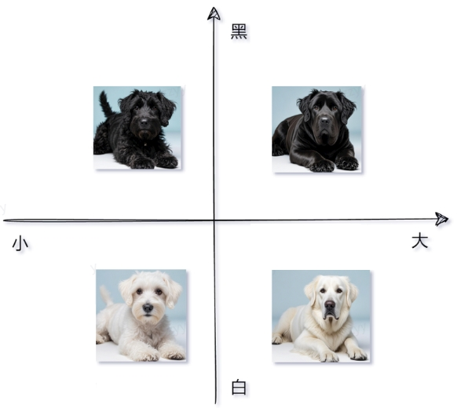

# 18 - 向量数据库与 Embedding 实战

---

**本章课程目标：**

- 理解 **向量（Vector）**、**向量化（Embedding）**、**向量数据库（Vector Store / Vector Database）** 这三件事分别是什么，以及它们之间的关系。
- 建立一条清晰主线：**文本先向量化，再写入向量库，再做相似性检索**；学完本章后，可以自然衔接到 [第 19 章 RAG 检索增强生成](19-RAG检索增强生成.md)。

**前置知识建议：** 已学习 [第 9 章 LangChain 概述与架构](9-LangChain概述与架构.md)、[第 10 章 LangChain 快速上手与 HelloWorld](10-LangChain快速上手与HelloWorld.md)、[第 11 章 Model I/O 与模型接入](11-Model-I-O与模型接入.md)。其中 [第 11 章](11-Model-I-O与模型接入.md) 里提到的 **Embeddings**，就是本章要展开讲清楚的内容。若你准备跑 Redis 相关案例，建议先看过 [第 16 章 记忆与对话历史（含 Redis 基础）](16-记忆与对话历史（含Redis基础）.md)。

**学习建议：** 本章建议按 **“为什么需要向量 → Embedding 到底做了什么 → 向量数据库解决什么问题 → 如何算相似度 → 如何把向量写入 Redis 并检索”** 的顺序学习。不要一上来就死记 API；先把概念链路想清楚，后面的案例就会顺很多。

---

## 1、向量与向量化

### 1.1 向量的定义

**向量（Vector）** 本来是数学概念，可以理解为：**用一组有顺序的数字来表示某个对象在空间中的位置或特征。**

比如：

- 二维向量可以写成 `(x, y)`
- 三维向量可以写成 `(x, y, z)`
- 在 AI 场景里，常见的是几百维、上千维的高维向量，例如 `1024` 维、`1536` 维

对初学者来说，可以先不用纠结高维空间的数学细节，只要先建立这个直觉：

**向量就是一串数字，而这串数字可以拿来表示一段文本、一张图片，或者其他对象的“特征”。**

### 1.2 向量化的定义

把文本、图片、音频等原始内容，转换成向量的过程，通常就叫 **向量化**；在大模型与检索领域里，更常见的名字是 **Embedding（嵌入）**。

LangChain 官方文档把文本 Embedding 说得很清楚：**Embedding 模型会把句子、段落等原始文本转换成固定长度的数字向量，并尽量让语义相近的文本在向量空间里靠得更近。**

**官方文档与资源：**

- LangChain Text Embedding 文档：https://docs.langchain.com/oss/python/integrations/text_embedding
- OpenAI Embeddings 指南：https://developers.openai.com/api/docs/guides/embeddings

下图可以先帮助你建立整体印象：左边是原始内容，中间是嵌入模型，右边是一串串向量。


用更直白的话说，Embedding 解决的是：

- 文本本身不能直接做“语义上的数学比较”
- 向量可以做距离和相似度计算
- 所以只要把文本变成向量，就能做“按意思查找相近内容”

这也是为什么 Embedding 常被用在：语义搜索、推荐系统、文本聚类、去重与相似内容识别、RAG 检索增强生成。

### 1.3 为什么相似语义可以映射为相近向量

Embedding 的核心价值，不是“把文本编码成数字”这么简单，而是：**它希望把“语义关系”映射成“空间关系”。**

也就是说：语义接近的文本，向量更接近；语义差异大的文本，向量更远。比如：“我喜欢吃苹果”、“苹果是我最喜欢吃的水果”。

这两句话虽然字面不完全一样，但语义接近，所以向量通常也会更接近。  
而“我喜欢用苹果手机”虽然也有“苹果”两个字，但语义已经部分转向“手机品牌”，和前两句的关系就没那么近。

这正是向量检索比关键词检索更强的地方：**它找的是“意思接近”，不只是“词面一致”。**

### 1.4 向量维度的定义

Embedding 输出的向量，一般是固定长度的浮点数列表。这个长度就叫 **维度（dimension）**。

例如：

- 某个模型输出 1024 维向量
- 就意味着每段文本最终会变成一个长度为 1024 的数组

这里有两个结论必须记住：

1. **不同 Embedding 模型输出维度可能不同。**
2. **即便维度相同，不同模型的向量空间通常也不能直接混用。**

所以真实项目里，一定要保证：**建库时用的 Embedding 模型，和查询时用的 Embedding 模型保持一致。**

否则要么维度不匹配直接报错，要么即使能算，相似度结果也没有意义。

### 1.5 进一步建立直觉

下面两张图分别帮助你理解“图像也可以向量化”和“向量空间会影响检索效果”。


> **图意说明：** 同品种毛色不同、同毛色体型不同——类比向量检索中「按特征维度」区分样本；用于建立「**向量 = 特征坐标**」的直觉（本章主线仍以文本 Embedding 为主）。



> **图意说明：** 高维 Embedding 可理解为「更多维度的特征轴」；维度与模型设计相关，**检索效果依赖模型与索引质量**，而非单看维数高低。

**这一节先记住一句话：**Embedding 不是为了“把文本变难懂”，而是为了让计算机能在数学空间里比较语义。

---

## 2、向量数据库

当文本已经变成向量后，下一个问题就来了：**这些向量存到哪里？又怎么高效地查“谁和我最像”？**这就是向量数据库存在的原因。

### 2.1 定义

LangChain 官方概括非常直接：**向量存储（Vector Store）就是存储嵌入后的数据，并支持相似性搜索。**Redis 官方文档则强调了另一个重点：**向量检索不是只存向量，而是围绕向量建立索引，并结合元数据做搜索与过滤。**

所以，初学者可以把“向量数据库”理解成：**一种专门面向“相似度检索”的存储系统。**

**官方文档与资源：**

- LangChain：https://docs.langchain.com/oss/python/integrations/vectorstores
- LangChain4J：https://docs.langchain4j.dev/integrations/embedding-stores
- Spring AI：https://docs.spring.io/spring-ai/reference/api/vectordbs.html
- Redis：https://redis.io/docs/latest/develop/ai/search-and-query/vectors

### 2.2 与传统数据库的区别

最核心的区别不在“能不能存数据”，而在“怎么查数据”。

| 对比维度     | 传统关系型数据库 / 普通 KV 存储 | 向量数据库                           |
| ------------ | ------------------------------- | ------------------------------------ |
| 核心查询方式 | 精确匹配、范围查询、条件过滤    | 相似性搜索、最近邻检索               |
| 典型问题     | “id=1001 的记录是什么？”        | “和这段文本语义最接近的内容是什么？” |
| 主要依据     | 字段值相等、大小、排序          | 向量距离 / 相似度                    |
| 常见用途     | 订单、用户、交易、配置          | RAG、搜索、推荐、去重、聚类          |

这并不代表传统数据库没用，而是说：**当你的问题从“查字段”变成“查意思”时，就要引入向量数据库。**

### 2.3 向量数据库里存什么

这是很多初学者第一次学时最容易混淆的地方。向量数据库里通常不只是“一个向量数组”，而是至少会包含下面几类信息：

- **原始内容**：例如文本正文 `page_content`
- **向量值**：Embedding 模型算出来的高维数组
- **元数据**：例如 `source`、`page`、`segment_id`、业务标签等
- **索引结构**：用于加速相似度检索

也就是说，向量数据库真正做的是：**把“内容 + 向量 + 元数据”组织起来，并支持按相似度查最相关内容。**

这件事对 RAG 非常关键，因为检索阶段不仅要拿到“最像的向量”，还要拿回对应的文本片段和元数据，最后才能交给大模型生成答案。

### 2.4 稠密向量、稀疏向量、标量字段定义

学到这里，很多人会先入为主地以为：向量数据库里只存“一个文本向量字段”。真实项目里当然可以这么做，但更完整的理解是：**一个可检索的数据对象，往往同时包含稠密向量、标量字段，某些系统里还会额外使用稀疏向量。**

- **稠密向量（Dense Vector）**：最常见，就是 Embedding 模型输出的一长串浮点数。它擅长表达整体语义，所以“意思相近”的文本通常会更接近。
- **稀疏向量（Sparse Vector）**：不是每一维都有值，而是只有少数维度非零。它更像“关键词及权重”的表达方式，常和词项匹配、倒排索引、BM25 一类思路联系在一起。
- **标量字段（Scalar Fields）**：例如 `source`、`author`、`category`、`created_at`、`doc_id` 这类普通字段。它们不参与语义向量计算，但非常适合做过滤、排序、权限控制和结果展示。

你可以先把它们理解成三类互补能力：

- 稠密向量负责“按语义找相近内容”
- 稀疏向量更偏“按关键词和词权重找相关内容”
- 标量字段负责“按业务条件过滤结果”

本章的 Redis 案例主线，主要聚焦在**文本 Embedding 生成的稠密向量 + 元数据字段**。这样已经足够搭建一条清晰的入门链路。但你后面如果看到“混合检索”“稠密+稀疏召回”“metadata filter”这些词，就不会觉得陌生了。

### 2.5 常见的向量数据库分类

入门阶段不需要全学，但至少要知道生态里有哪些常见方案：

| 名称                           | 简要说明                                 |
| ------------------------------ | ---------------------------------------- |
| **FAISS**                      | 偏本地、偏算法库，适合快速做向量检索实验 |
| **Chroma**                     | 轻量、好上手，适合本地原型验证           |
| **Milvus**                     | 开源专业向量数据库，适合大规模生产环境   |
| **Pgvector**                   | PostgreSQL 扩展，适合已有 PG 体系的项目  |
| **Redis / Redis Stack**        | 既能做缓存，也能做向量检索，适合工程整合 |
| **Elasticsearch / OpenSearch** | 搜索体系成熟，也支持向量搜索             |

### 2.6 为什么 RAG 和向量数据库常放在一起讲

因为大多数人第一次接触向量数据库，往往就是在做 RAG。

RAG 的底层链路通常是：

1. 把文档切成片段
2. 用 Embedding 模型把片段转成向量
3. 把“片段 + 向量 + 元数据”写入向量数据库
4. 用户提问时，把问题也转成向量
5. 在向量数据库里查最相关片段
6. 把片段和问题一起交给大模型生成答案

也就是说，**向量数据库是 RAG 的底层基础设施之一，但它本身不等于完整 RAG。**


> **图意说明：** 上半为**索引/入库**链路，下半为**查询**链路；向量库处于「分段文本向量化之后、检索 top-K 片段之后交给模型」的关键位置。完整加载器、切分器与生成环节见 [第 19 章 RAG](19-RAG检索增强生成.md)。

---

## 3、用 Redis Stack 作为向量存储

本教程选择 **Redis / Redis Stack** 来做向量存储，不是因为它是唯一方案，而是因为它非常适合教学和工程入门：

- 项目前面已经在 [第 16 章](16-记忆与对话历史（含Redis基础）.md) 引入了 Redis
- Redis Stack 在 Redis 基础上集成了搜索与向量检索能力
- 对初学者来说，一套环境就能同时学习缓存、消息、历史记录、向量检索，工程感会更强

### 3.1 Redis、Redis Stack、RediSearch 三者关系

- **Redis**：基础内存数据库 / 键值存储
- **Redis Stack**：在 Redis 基础上打包了搜索、JSON、时间序列、布隆过滤器等扩展能力
- **RediSearch**：Redis Stack 中和搜索、全文检索、向量检索强相关的模块

从本章角度看，你只需要记住一句话：**我们之所以能用 Redis 做向量检索，关键是 Redis Stack / RediSearch 提供了向量字段、索引和 KNN 搜索能力。**

Redis 官方文档里也明确提到，Redis 可以：

- 创建向量索引
- 存储向量和元数据
- 做 KNN（最近邻）向量搜索
- 结合元数据过滤做混合检索

### 3.2 为什么本教程选 Redis

从真实项目角度看，Redis 作为向量存储有几个很实用的优点：

- **上手成本低**：很多团队本来就已经有 Redis
- **工程整合方便**：缓存、会话、历史记录、向量检索可以放在同一套基础设施里
- **适合中小型知识库**：做课程演示、内部工具、轻量 RAG 很顺手

当然，工程里也要知道它的边界：

- 如果向量规模非常大、检索需求非常复杂，团队也可能选择 Milvus、Weaviate、Pinecone 等更专门的方案
- 这不是“谁绝对更好”的问题，而是“你的场景更适合哪种方案”

如果你还没有装好 Redis Stack，请先回看 [第 16 章](16-记忆与对话历史（含Redis基础）.md) 里关于 Docker、Redis Stack、RedisInsight 的部分；本章不重复安装过程，只聚焦“Embedding + 向量检索”这条主线。

> 一个很重要工程提醒
>
> - 做向量检索时，真正写入 Redis 的不是“裸向量”而已，通常是：文本内容、文本对应的向量、元数据、与索引相关的结构信息。
> - 所以你在 RedisInsight 里看到的记录，往往不是一个简单数字数组，而是多个字段组成的结构化数据。这一点到了本章第 6 节看案例时会更直观。

---

## 4、Embedding 文本向量化

这一节是本章的核心。因为后面不管是算相似度，还是写入 Redis，本质上都依赖同一步：**先把文本变成向量。**

### 4.1 定义

**Embedding（嵌入）** 是将文本字符串表示为**向量（浮点数列表）**的过程。通过计算向量之间的距离或相似度，可以衡量文本之间的相关性：**距离越小（或相似度越高），相关性越高**；距离越大，相关性越低。

**一句话概括：**Embeddings 用来衡量文本之间的相关性。

**常见应用包括：**

- **搜索**：按与查询的相关性对结果排序
- **聚类**：按文本相似性分组
- **推荐**：根据相关文本推荐内容
- **异常检测**：找出与多数内容相关性较低的异常点
- **多样性测量**：分析相似性分布
- **分类**：按与标签的相似性对文本分类

LangChain 官方则进一步强调了两个 API：

- `embed_query(text)`：把单条查询文本转成向量
- `embed_documents(texts)`：把多条文档文本批量转成向量

这一组区分非常重要，因为它正好对应真实项目里的两个阶段：

- **索引阶段**：把文档片段批量向量化，通常用 `embed_documents`
- **查询阶段**：把用户问题向量化，通常用 `embed_query`

### 4.2 重要实践规则

这几条经验非常关键，建议你在跑案例前先记住：

1. Embedding 模型输出的是向量，不是自然语言。
2. 不同 Embedding 模型的维度可能不同。
3. 建索引和查询必须使用同一套 Embedding 模型。
4. Embedding 适合做语义相似度计算，但它本身不负责“回答问题”。
5. 本章主线是文本 Embedding；多模态 Embedding 属于进阶扩展。

第 5 条专门解释一下。LangChain 当前官方 Embeddings 总览页主要聚焦 **文本 Embedding**；本章保留的多模态案例是通过 **DashScope 原生 SDK** 来展示扩展能力，目的是帮助你建立“Embedding 不只可用于文本”的认知，但本章的主学习主线仍然是 **文本向量化**。

### 4.3 案例：DashScope 原生调用，先看到“向量长什么样”

这是最简单的 Hello 级示例，目标不是马上做检索，而是先看到：

- 文本是怎么传给 Embedding 模型的
- 返回结果结构大概长什么样
- 向量通常是怎样的一串浮点数

【案例源码】`案例与源码-2-LangChain框架/09-embedding/Text2Embedding_DashScopeHello.py`

[Text2Embedding_DashScopeHello.py](案例与源码-2-LangChain框架/09-embedding/Text2Embedding_DashScopeHello.py ":include :type=code")

学习这个案例时，建议你重点观察：

- `model` 指定的是哪个 Embedding 模型
- 返回对象里 `embedding` 在哪一层
- 这一条文本最终输出的是多长的向量

### 4.4 案例：OpenAI 兼容写法，理解“同一能力，不同接法”

很多平台虽然不是 OpenAI，但会提供 **OpenAI 兼容接口**。这意味着你可以继续用 OpenAI SDK 的调用方式，只是把：`base_url`、`api_key`、`model`改成对应平台的配置即可。

这个案例的价值在真实项目里非常大，因为它会让你意识到：**很多时候你真正学的不是“某一家厂商的私有 SDK”，而是一种通用接入模式。**

【案例源码】`案例与源码-2-LangChain框架/09-embedding/Text2Embedding_OpenAiHello.py`

[Text2Embedding_OpenAiHello.py](案例与源码-2-LangChain框架/09-embedding/Text2Embedding_OpenAiHello.py ":include :type=code")

### 4.5 案例：用 LangChain 的统一接口做单条与批量向量化

当你开始做 LangChain 项目时，更推荐理解这一层封装。因为后面不管是检索器、向量库、RAG，很多组件都是围绕 LangChain 的 Embeddings 接口来协作的。

这个案例非常关键，因为它直接演示了：

- `embed_query(text)`：单条查询文本向量化
- `embed_documents(texts)`：多条文档文本批量向量化

这两个方法，基本就是后面做检索的“索引阶段”和“查询阶段”的缩影。

【案例源码】`案例与源码-2-LangChain框架/09-embedding/Text2Embedding_DashScope.py`

[Text2Embedding_DashScope.py](案例与源码-2-LangChain框架/09-embedding/Text2Embedding_DashScope.py ":include :type=code")

运行时你可以特别留意：单条返回的是一个向量；批量返回的是“向量列表”；len(向量)对应维度。

### 4.6 案例：进阶扩展，多模态 Embedding

这一节是扩展视野，不是本章主线难点。这个案例展示的是：Embedding 不只可以处理文本，也可以扩展到图文等多模态输入。不过要注意，本案例使用的是 **DashScope 原生多模态 Embedding 接口**，并不是 LangChain 统一文本 Embeddings 接口本身。

初学者先知道两件事就够了：

1. **Embedding 的思想不只适用于文本。**
2. **本章先把文本 Embedding 学稳，多模态后面按需拓展。**

【案例源码】`案例与源码-2-LangChain框架/09-embedding/Text2Embedding_DashScopePro.py`

[Text2Embedding_DashScopePro.py](案例与源码-2-LangChain框架/09-embedding/Text2Embedding_DashScopePro.py ":include :type=code")

---

## 5、通过向量计算语义相似度

当我们已经能把文本变成向量之后，就可以开始做一件很重要的事：**比较两段文本在语义上有多接近。**

### 5.1 为什么常用余弦相似度

在向量相似度计算里，常见指标有：

- **余弦相似度（Cosine Similarity）**
- **欧氏距离（Euclidean Distance）**
- **点积（Dot Product）**

其中最适合初学者先建立直觉的，通常是 **余弦相似度**。它关注的重点不是“两个向量长度有多像”，而是“两个向量方向有多接近”。对语义检索来说，这通常很有价值，因为我们更关心“意思是否接近”。

余弦相似度公式：

```text
cos(theta) = (A · B) / (|A| |B|)
```

它的结果通常在 `[-1, 1]` 范围内：

- 越接近 `1`，通常表示越相似
- 越接近 `0`，表示相关性较弱
- 越接近 `-1`，表示方向相反

OpenAI 官方文档里也明确提到：在很多 Embedding 场景里，**余弦相似度是非常常见、非常实用的选择**。

### 5.2 检索里常见的距离度量怎么选

前面我们用余弦相似度建立了直觉，但真实项目里，你在向量库、索引或 SDK 参数中还会经常看到这几个名字：

- **COSINE**：更关注向量方向是否接近，是文本语义检索里最常见、也最容易理解的一类度量。
- **L2**：欧氏距离，关注两个点在空间里的直线距离。距离越小，通常表示越接近。
- **IP（Inner Product）**：内积。某些模型或系统会直接用它做相似度计算；在向量已归一化时，它和余弦相似度往往会非常接近。

真正要记住的不是“谁永远最好”，而是这条工程规则：

**Embedding 模型的特性、索引建立时选择的度量方式、查询时传入的 metric，三者必须保持一致。**

否则常见问题有两个：

- 轻则结果变差，明明是相关内容却排不上来
- 重则索引配置和查询配置不匹配，直接报错

所以当你看到某个向量库示例里写的是 `COSINE`、`L2` 或 `IP`，不要把它当成无关紧要的参数；它本质上决定了系统如何理解“相似”。

### 5.3 精确检索、近似检索与索引

另一个很值得尽早建立的工程概念是：**不是所有相似度检索，都会老老实实把查询向量和库里每一个向量逐个比较。**

从思路上看，大致可以分成两类：

- **精确检索（Exact KNN / FLAT）**：把查询向量和库里的所有向量都算一遍，结果最直接，也最容易理解。
- **近似检索（ANN, Approximate Nearest Neighbor）**：通过索引结构加速搜索，只近似地找到“最可能接近”的一批结果。

为什么需要近似检索？因为数据一旦上规模，逐个比较会越来越慢。于是很多向量数据库会建立索引，用空间换时间。你在不同系统里经常会见到：

- **FLAT**：更偏暴力搜索，准确但慢
- **HNSW**：工程里很常见的 ANN 索引，通常能在召回率和延迟之间取得较好平衡

入门阶段可以先记住一句话：**索引的作用不是改变“语义相似”的定义，而是让“找最相似内容”这件事在大规模数据下也能跑得动。**

这也是为什么本章前面一直强调：检索效果不只取决于 Embedding 模型，还和索引质量、参数配置、数据切分方式一起决定最终结果。

### 5.4 案例：把多句话转成向量，再两两比较

这个案例会：

1. 准备多句文本
2. 调用 Embedding 接口拿到每句文本的向量
3. 用 `numpy` 手动计算余弦相似度
4. 打印两两比较结果

【案例源码】`案例与源码-2-LangChain框架/09-embedding/Text2Embedding_CosSimilarity.py`

[Text2Embedding_CosSimilarity.py](案例与源码-2-LangChain框架/09-embedding/Text2Embedding_CosSimilarity.py ":include :type=code")

学习这个案例时，建议重点抓住两件事：

- 重点不是“必须用哪一个模型”，而是**拿到向量后怎么做相似度计算**
- 当两句话主题更接近时，余弦相似度通常会更高

这个案例里使用的是多模态 Embedding 接口来处理文本输入，课程想演示的是“**向量一旦拿到手，就可以做数学比较**”这件事。真实项目里，你也完全可以用常规文本 Embedding 模型来完成同样的相似度计算。

### 5.5 相似度结果在项目里怎么用

这类分数在真实项目里最常见的用途有：

- **语义检索排序**：把最相关的文本排在前面
- **文本去重**：判断两段内容是否高度重复
- **推荐**：找相似商品、相似文章、相似问题
- **聚类分析**：把语义相近的内容分成一组

所以，不要把“余弦相似度”只理解成一道数学题。在工程里，它通常直接决定了：**检索结果排前面的内容是不是你真正想要的内容。**

---

## 6、向量库的写入与检索（RAG 的底层能力）

前面我们完成了两件事：1. 把文本转成向量；2. 学会了计算向量之间的相似度。

这一节把这两件事往前再推一步，进入真正的工程链路：**把文本和向量写入 Redis，然后按相似度做检索。**

先强调一个边界：**这一节还不是完整 RAG。**这里演示的是 RAG 的底层能力，也就是：建索引，做相似度检索。但还没有加入：文档加载器，文本切分器，检索结果交给大模型生成最终答案。

这些会在 [第 19 章 RAG 检索增强生成](19-RAG检索增强生成.md) 继续展开。

### 6.1 案例：把 Document 列表写入 Redis，再用检索器取回结果

这是本章最适合作为“第一眼向量库实战”的案例。

它做的事情可以概括成：

1. 先准备若干 `Document`（`page_content` + `metadata`，在完整 RAG 中常由加载器与切分器产生，见 [第 19 章](19-RAG检索增强生成.md)）
2. 用 `DashScopeEmbeddings` 把 `page_content` 向量化
3. 用 `Redis.from_documents(...)` 一次性写入 Redis
4. 再通过 `as_retriever()` 生成检索器
5. 对查询文本做相似度检索

这个案例最值得初学者理解的地方是：

- 向量库里存的不是孤零零的数字，而是和 `Document` 结构结合起来的内容
- 检索出来的结果不是“向量本身”，而是对应的 `Document`
- 这正是 RAG 后面能把检索结果塞回 Prompt 的基础

【案例源码】`案例与源码-2-LangChain框架/09-embedding/EmbeddingStoreRedis.py`

[EmbeddingStoreRedis.py](案例与源码-2-LangChain框架/09-embedding/EmbeddingStoreRedis.py ":include :type=code")

运行后，你可以在 RedisInsight 里看到类似下图的结构：


看到这张图时，建议你重点理解：

- `content` 一类字段是原始文本
- `content_vector` 一类字段是 Embedding 后的向量
- `source` 等字段是元数据

也就是说，Redis 在这里保存的是一份“可检索的语义索引”，而不是只存了一组浮点数。

### 6.2 案例：使用 langchain_redis 的 RedisVectorStore 写入文本

除了 `langchain_community.vectorstores.Redis`，项目里还保留了另一套更贴近专门 Redis 集成包的写法：

- `RedisConfig`
- `RedisVectorStore`
- `add_texts(...)`

这个案例适合帮助你理解另一种常见思路：**先创建一个向量库实例，再持续往里面追加文本。**

【案例源码】`案例与源码-2-LangChain框架/10-rag/RedisVectorStore.py`

[RedisVectorStore.py](案例与源码-2-LangChain框架/10-rag/RedisVectorStore.py ":include :type=code")

这个案例有几个学习重点：

- `add_texts()` 适合写字符串列表
- 每条文本可以带自己的 `metadata`
- 返回的 `ids` 可用于后续删除、更新或追踪

这类写法在真实项目里很常见，因为很多时候数据并不是一次性导入，而是：

- 批量导入
- 增量追加
- 定时重建索引

### 6.3 案例：连接已有索引，做相似性检索

这个案例和上一节是一组配套案例。它假设你已经写入过数据，然后再去做查询。

核心动作是：

- 连接已有的 `index_name`
- 把查询文本向量化
- 在 Redis 中找最相近的若干条文本
- 返回 `(Document, score)` 结果

【案例源码】`案例与源码-2-LangChain框架/10-rag/RedisVectorStore_SimilaritySearch.py`

[RedisVectorStore_SimilaritySearch.py](案例与源码-2-LangChain框架/10-rag/RedisVectorStore_SimilaritySearch.py ":include :type=code")

这里有一个很重要的工程提醒，初学者一定要注意：

**`similarity_search_with_score()` 返回的 `score`，很多实现里本质上是“距离”而不是“越大越好”的概率分数。**

所以：

- 有些场景下，`score` 越小反而表示越相似
- 代码里把它换算成 `1 - score`，更多是为了课程演示时方便直觉理解
- 真正项目里，必须看具体向量库、距离度量方式和返回定义，不能机械地把所有 `score` 都按“相似度百分比”解释

这个提醒非常重要，因为它会直接影响你后面对检索结果阈值的判断。

### 6.4 元数据过滤、混合检索与重排序

很多初学者在跑完第一个向量检索案例后，会误以为“检索 = 把问题转成向量，然后直接搜 top-k”。这条主线当然没错，但真实项目里，通常还会再叠加三类能力：

- **元数据过滤（metadata filter）**：先用 `source`、`category`、时间范围、权限字段等条件缩小候选范围，再做向量检索。
- **混合检索（hybrid retrieval）**：同时结合语义向量检索和关键词检索，或者结合不同类型的召回路径。
- **重排序（rerank）**：先召回一批候选结果，再用更精细的模型或策略重新排序。

这三者可以这样理解：

- 过滤，解决“只在某个业务范围内找”
- 混合，解决“既想看语义，也不想丢掉关键词命中”
- 重排序，解决“已经找回来了，但顺序还不够好”

其中“重排序”特别值得单独记一下。它并不是重新去全库里搜索，而是对**已经召回的一小批候选结果**做二次排序优化。很多系统里，向量检索负责第一阶段召回，reranker 负责第二阶段排序，这样往往能兼顾速度和效果。

本章的 Redis 实战主要演示的是**稠密向量检索的第一阶段能力**。你后面在更完整的 RAG 系统里，如果发现“能搜到，但排序不够稳”或者“关键词信息丢了”，就可以优先从这三类增强手段入手。

### 6.5 from_documents 和 add_texts 怎么理解

这两个方法都能“把内容写入向量库”，但适合的场景不完全一样：

| 方法                  | 更适合什么场景                                 | 直观理解                     |
| --------------------- | ---------------------------------------------- | ---------------------------- |
| `from_documents(...)` | 你手里已经有一批 `Document` 对象，想一次性建库 | 更像“一步到位建索引”         |
| `add_texts(...)`      | 你有字符串列表，或想持续追加数据               | 更像“在已有向量库上增量写入” |

初学阶段你不用纠结谁绝对更高级，只要知道：

- 它们都在做“文本向量化 + 写入向量库”
- 区别主要是入参结构和工程组织方式

### 6.6 本章与第19章的关系

这一节结束后，你已经掌握了 RAG 中非常关键的底层能力：

- 文本向量化
- 向量写入 Redis
- 相似性检索

而 [第 19 章](19-RAG检索增强生成.md) 会在此基础上补齐剩余三步：

1. 用加载器把 PDF / Word / Markdown 等文档读成 `Document`
2. 用文本分割器把长文档切成片段
3. 把检索结果和用户问题一起交给大模型生成答案

所以，本章和第 19 章的关系可以理解为：

- **第 18 章**：先把“向量化 + 存储 + 检索”练熟
- **第 19 章**：再把它们和文档处理、Prompt、LLM 串成完整 RAG

---

**本章小结：**

- **向量与 Embedding**：Embedding 模型会把文本转换成固定长度向量，让“语义相近”可以转化成“向量接近”。
- **向量数据库**：它解决的不是普通字段查询，而是“按语义找最接近内容”的问题；这也是 RAG 能成立的基础。
- **Redis Stack**：本教程用 Redis 做向量存储，是为了让你在已有项目基础设施上快速理解向量索引与检索。
- **案例主线**：本章已经完整走通了“文本向量化 → 余弦相似度 → 写入 Redis → 相似性检索”这条链路。

**建议下一步：**

1. 先把 `09-embedding` 目录下的案例按顺序跑一遍，尤其是 `Text2Embedding_DashScope.py`、`Text2Embedding_CosSimilarity.py`、`EmbeddingStoreRedis.py`。
2. 再运行 `10-rag` 目录下的 `RedisVectorStore.py` 和 `RedisVectorStore_SimilaritySearch.py`，对比两种 Redis 向量库写法。
3. 学完本章后继续阅读 [第 19 章 RAG 检索增强生成](19-RAG检索增强生成.md)，把本章的向量能力接到完整 RAG 流程里。
