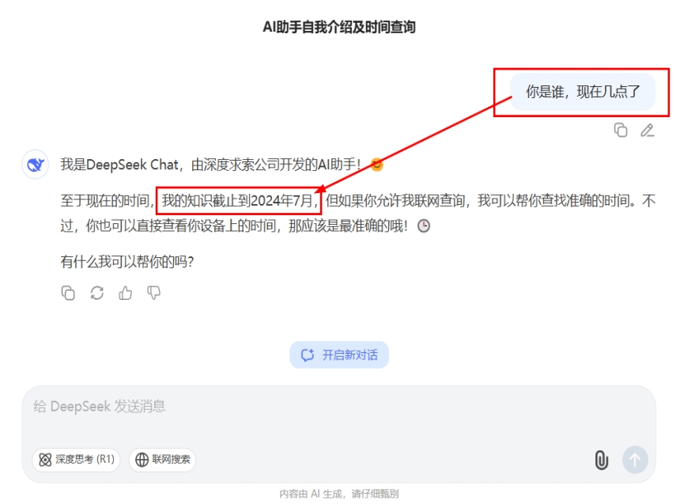
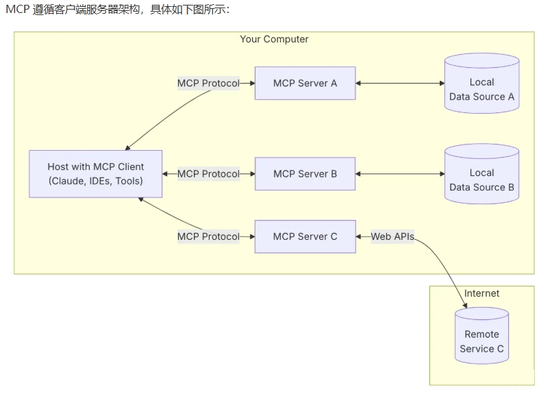
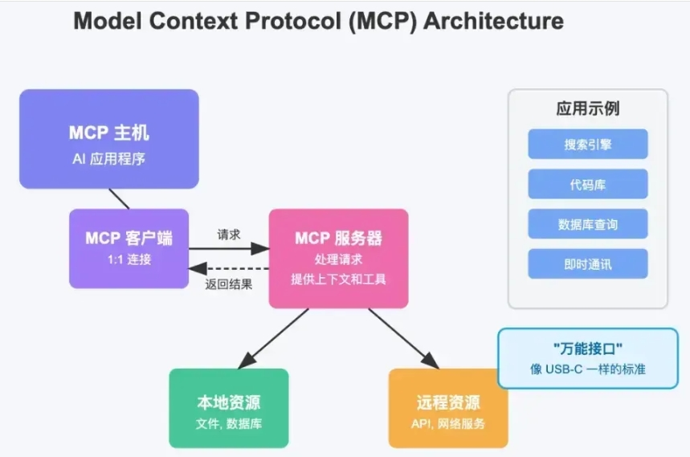

# 20 - MCP 模型上下文协议

---

**本章课程目标：**

- 理解 **MCP（Model Context Protocol，模型上下文协议）** 是什么、解决什么痛点，以及它与 [Tool](17-Tools工具调用.md)、[RAG](19-RAG检索增强生成.md)、[Agent](21-Agent智能体.md) 的定位区别。
- 掌握 MCP 的**主机 / 客户端 / 服务器**架构、核心能力、常见传输方式，以及 `mcp.json`、FastMCP、LangChain MCP 适配器在项目中的作用。
- 跑通并理解本章全部案例：**极简教学版服务端、FastMCP 服务端、天气 MCP 服务、同进程客户端、基于 `mcp.json` + LangChain Agent 的 MCP 客户端**，为后续学习 [第 21 章 Agent 智能体](21-Agent智能体.md) 打基础。

**前置知识建议：** 建议先学习 [第 17 章 Tools 工具调用](17-Tools工具调用.md)，因为 MCP 和 Tool 最容易混淆；同时建议学完 [第 19 章 RAG 检索增强生成](19-RAG检索增强生成.md)，这样更容易区分“检索上下文”和“协议接入外部能力”是两回事。

**学习建议：** 本章建议按 **“为什么需要 MCP → MCP 是什么 → 它能暴露什么能力 → 它怎么接入项目 → 架构与传输 → 本地案例”** 的顺序学习。不要一开始就背协议术语，先把“**MCP 解决的是接入标准化问题**”这件事想清楚，后面的 Host、Client、Server、Tools、Resources、Prompts 才不会乱。

---

## 1、为什么需要 MCP

### 1.1 真实项目里的接入痛点

很多同学第一次接触 MCP 时，会把它理解成“让大模型联网”或“让大模型能调用工具”。这只说对了一部分。  
更准确地说，**MCP 解决的核心问题不是“模型能不能用工具”，而是“不同 AI 应用怎样用统一方式接入外部工具和上下文”**。

在没有 MCP 时，真实项目里常见的痛点主要有三类：

- **每个 AI 应用都要重复接一遍外部系统**  
  例如同样是接 GitHub、Slack、数据库、文件系统，Cursor 要写一套，Claude Desktop 要写一套，自研 Agent 平台又要写一套。

- **每个框架和宿主各有自己的接法**  
  即使大家都支持 Tool / Function Calling，真正落地时仍然要处理：服务如何发现、参数 schema 怎么描述、鉴权怎么传、进程怎么启动、结果怎么返回。

- **工具很难复用成“生态能力”**  
  没有统一协议时，一个工具即使写得很好，也往往只能服务于某个特定应用，迁移和复用成本很高。



所以，MCP 出现的背景，不是“以前没人会写工具”，而是：

**大家都在写工具，但缺少一套跨应用、跨框架、跨宿主都能复用的统一连接标准。**

### 1.2 MCP 到底在解决什么问题

可以把 MCP 解决的问题压缩成一句话：**让“外部工具、资源、提示词模板”等能力，能够按统一协议被不同 AI 应用发现和使用。**

举个更贴近项目的例子。假设你在 IDE 里有一个 AI 编程助手，希望它能：

- 读取本地代码仓库
- 查 GitHub Issue
- 调内部文档系统
- 查询云服务配置
- 调用数据库辅助排查问题

如果没有 MCP，你往往要为这个 AI 助手单独实现很多连接器。如果这些能力都已经按 MCP 标准暴露，那么这个 AI 助手只需要支持 MCP，就可以统一接入这些服务。

这时，MCP 的价值就很明显了：

- **一次暴露，多处复用**
- **统一 schema，降低适配成本**
- **更容易形成工具生态**

### 1.3 直观类比：AI 世界的统一插口

很多同学都记得钢铁侠的助手「贾维斯」：它不是只会聊天，而是能连接战甲、实验室、摄像头、数据库、控制系统等各种外部能力。

现实中的 AI 应用也是一样。一个真正有用的 AI 助手，往往不仅要“说”，还要能：查本地文件、查数据库、搜 GitHub Issue、调天气接口、发消息到 Slack / 微信 / 邮件、调用内部业务系统。


如果每接一个系统都单独写一套连接逻辑，成本会非常高。MCP 的思路，就是给 AI 应用提供一个更像“**统一插口**”的东西。

你可以把它类比成：

- **AI 世界的 USB-C**
- **大模型版的 OpenFeign / gRPC 协议层**
- **AI 应用和外部能力之间的万能适配器**

把这层直觉和上一节连起来理解会更顺：**MCP 统一的不是模型本身，而是 AI 应用发现、理解、调用和复用外部能力的方式。**

---

## 2、MCP 简介

### 2.1 定义

MCP（Model Context Protocol，模型上下文协议）是一套**开放的标准协议**，用于规范 **AI 应用 / Agent / IDE / 聊天客户端** 如何与 **外部工具、资源和上下文提供方** 交互。

官方的核心表述可以概括成：

- MCP 标准化了应用程序向 LLM 提供上下文的方式
- 它让 AI 应用可以用统一方式连接不同的数据源和工具

对初学者来说，可以先记住这句：

**MCP 的关键词是“标准协议、统一接入、跨宿主复用”。**

**官方文档与资源：**

- MCP 官方介绍：https://modelcontextprotocol.io/introduction
- MCP FAQ：https://modelcontextprotocol.io/faqs
- MCP 架构文档：https://modelcontextprotocol.io/docs/learn/architecture
- LangChain 对 MCP 的支持：https://docs.langchain.com/oss/python/langchain/mcp

### 2.2 和 Tool、RAG、Agent 有什么区别

| 概念                        | 解决什么问题                   | 典型关注点                               |
| --------------------------- | ------------------------------ | ---------------------------------------- |
| **Tool / Function Calling** | 模型如何调用一个具体工具       | 工具 schema、参数、调用结果              |
| **RAG**                     | 模型如何拿到外部知识上下文     | 文档加载、切块、检索、上下文拼接         |
| **MCP**                     | 外部能力如何被标准化暴露与接入 | Host / Client / Server、协议、传输、发现 |
| **Agent**                   | 谁来规划、决策、调用这些能力   | 推理、编排、记忆、执行闭环               |

一句话速记：

- **Tool** 解决“能不能调用”
- **RAG** 解决“能不能拿到知识”
- **MCP** 解决“怎么统一接入”
- **Agent** 解决“谁来决定何时调用”

---

## 3、MCP 能做什么

### 3.1 统一接入与抽象

MCP 最直观的价值，就是把原本分散的外部能力，用统一方式暴露给 AI 应用。


> **说明**：「分」——各应用、各数据源各自对接，重复开发、难以复用。


> **说明**：「合」——通过 MCP 等统一协议，一次开发、多端复用。

所以，MCP 不是在替代 Tool，而是在 Tool 之上再向上抽象了一层“协议层”。

### 3.2 MCP 服务器通常能暴露什么

根据官方文档，MCP 服务器最核心的三类能力是：

| 类型          | 作用                                                | 控制方式                    | 你仓库里的对应案例                             |
| ------------- | --------------------------------------------------- | --------------------------- | ---------------------------------------------- |
| **Tools**     | 可执行动作，例如查天气、查数据库、发请求            | **模型可触发**              | `McpServer.py`、`McpServerWeatherByFastMCP.py` |
| **Resources** | 可读取内容，例如文件、配置、数据库 schema、API 响应 | **应用 / 宿主决定如何使用** | `McpServerByFastMCP.py` 的 `@mcp.resource()`   |
| **Prompts**   | 可复用的提示词模板 / 工作流模板                     | **用户显式选择更常见**      | `McpServerByFastMCP.py` 的 `@mcp.prompt()`     |

这里有一个非常值得记住的官方区分：

- **Tools 是 model-controlled**
- **Resources 是 application-driven**
- **Prompts 更偏 user-controlled**

也就是说：

- Tool 更适合让模型自动决定何时调用
- Resource 更适合由宿主决定如何纳入上下文
- Prompt 更适合由用户显式触发某种模板化工作流

这也是为什么初学者不能把 MCP 简单理解成“就是工具协议”。**工具只是 MCP 很重要的一部分，但不是全部。**

### 3.3 初学者容易忽略的另外几类能力

除了 Tools / Resources / Prompts，官方协议里还有一些更进阶的客户端 / 会话能力，例如：

- **Sampling**：服务器通过客户端向**宿主侧的 LLM** 请求一次生成（把“算力在哪一侧”也纳入协议协作）
- **Elicitation**：服务器通过客户端向用户请求补充信息
- **Logging**：服务器向客户端发送结构化日志
- **Progress / Notifications**：长任务过程中的进度和通知

这些内容在你当前仓库案例里没有作为主线展开，但对理解 MCP 很重要，因为它说明：

**MCP 不只是“列出工具然后调用工具”，它还定义了更完整的人机协作和上下文交换机制。**

不过对本章来说，先重点掌握：

- Tool 如何暴露
- 服务器和客户端怎么连
- LangChain / Agent 如何拿到 MCP 工具

就已经足够了。

### 3.4 在实际项目的常见用途

在真实项目里，MCP 最常见的落地方向通常有三种：

1. **给现成 AI 应用接能力**  
   例如让 Cursor、Claude Desktop、VS Code、ChatGPT 类客户端接入文件系统、代码库、浏览器、内部系统。

2. **给自研 Agent 平台做统一工具接入层**  
   这样 Agent 平台就不用为 GitHub、数据库、知识库、Slack、云平台各写一套不同协议。

3. **让企业内部能力变成可复用的 AI 接口层**  
   例如把“查工单”“查订单”“查配置”“发通知”这些能力封装成 MCP 服务，供多个 AI 应用共享。

**安全与信任边界（落地必知）：** MCP Server 往往能以较高权限访问本机文件、内网 API 或密钥；生产环境应控制**来源可信**（仅安装审计过的服务）、**最小权限**与**网络隔离**，并记录调用审计。这与“能接什么”同样重要。

---

## 4、怎么用 MCP

### 4.1 直接使用现成的 MCP 服务

如果你的目标不是“学习怎么实现协议”，而是“先把能力接进来”，最直接的方式通常是：

- 找到现成的 MCP Server
- 在宿主应用里配置连接方式
- 让客户端自动发现其 Tools / Resources / Prompts

当前官方已经有 Registry 方向的能力和生态，公共 MCP 服务器的发现也越来越规范化。对初学者来说，这意味着：

**很多能力不一定要自己写服务端，先学会怎么接、怎么配、怎么调试也很重要。**

官方 Registry 入口：

- https://registry.modelcontextprotocol.io/
- Registry 说明页：https://modelcontextprotocol.io/registry/about


### 4.2 本地自建 MCP 服务端

如果你要接的是：本地文件系统、内部数据库、企业私有 API、自己的业务系统。

那通常就要自己写 MCP Server。这也是本章案例的重点：我们会通过本地天气服务、FastMCP 示例和 `mcp.json` 客户端配置，理解一个 MCP 服务是如何被暴露、被发现、再被 Agent 使用的。

#### 4.2.1 什么是 FastMCP

这里很适合顺手把 **FastMCP** 这个词讲清楚，因为后面的案例文件名里会频繁出现它。

**FastMCP 可以理解为：MCP 官方 Python 生态里用来快速编写 MCP Server 的高层封装。**它帮你把很多底层样板工作收起来，让你可以更接近“写 Python 函数”的方式去暴露 MCP 能力。

你可以先把它和 MCP 的关系记成下面这组对应：

- **MCP** 是协议标准，解决“AI 应用怎么统一接入外部能力”
- **FastMCP** 是 Python 里的服务端开发工具，解决“我怎么更方便地把能力按 MCP 标准暴露出去”

也就是说：**MCP 是规则**，**FastMCP 是实现这些规则的一种工具**。这就像：HTTP 是协议，FastAPI / Flask 是帮助你实现 HTTP 服务的框架。

放到这一章里也是一样：MCP 决定 Host、Client、Server 之间怎么协作，FastMCP 帮你更轻松地写出一个 MCP Server。

#### 4.2.2 为什么本章要讲 FastMCP

在真实项目里，如果你准备自己写一个 MCP 服务端，通常有两条常见路线：

1. **自己直接按 SDK / 协议细节去实现**
2. **借助 FastMCP 这种更高层的封装来实现**

对初学者来说，第二条路线通常更友好，因为它能把注意力放回到“我要暴露什么能力”上，而不是一开始就陷进大量底层细节。

这也是为什么你仓库里的案例会分成两类：

- `McpServer.py`  
  这是教学版极简实现，帮助你理解“服务端注册工具”这个最小概念。

- `McpServerByFastMCP.py`、`McpServerWeatherByFastMCP.py`  
  这是更贴近真实 Python MCP 开发体验的写法，帮助你理解 Tool / Resource / Prompt 怎么按官方 SDK 风格暴露出去。

所以这一章里，**FastMCP 不是主角，MCP 协议本身才是主角；但 FastMCP 是你把这套协议真正写成 Python 服务时最重要的入门工具之一。**

### 4.3 在 LangChain / Agent 里使用 MCP

这一点很贴近你当前项目主线。

LangChain 官方已经提供了对 MCP 的适配支持。常见路线是：

1. 用 `MultiServerMCPClient` 连接一台或多台 MCP 服务器
2. 通过 `get_tools()` 取回 MCP 工具
3. 把这些工具交给 `create_tool_calling_agent` 或 `create_agent`
4. 让 Agent 在对话中实际调用它们（Agent 的创建与执行细节见 [第 21 章 Agent 智能体](21-Agent智能体.md)）

这也说明了 MCP 和 LangChain 的关系：

- **MCP** 负责“标准化接入”
- **LangChain / Agent** 负责“把接进来的能力真正用起来”

---

## 5、MCP 架构知识

### 5.1 主机、客户端、服务器分别是什么

MCP 采用典型的 **Host - Client - Server** 架构。



| 角色                | 含义                                                             |
| ------------------- | ---------------------------------------------------------------- |
| **MCP Host**        | 用户真正交互的应用，例如 IDE、桌面客户端、聊天应用、自研 AI 平台 |
| **MCP Client**      | Host 内部负责和某个 MCP Server 建立协议连接的组件                |
| **MCP Server**      | 对外暴露 Tools / Resources / Prompts 等能力的服务                |
| **本地 / 远程资源** | 服务器可访问的文件、数据库、API、内部系统等                      |

官方文档里有个非常重要的点：

- **Host 是你在用的应用**
- **Client 是 Host 内部的协议连接组件**

这也是为什么“一个 Host 可以连多台 Server”，但“一个具体 Client 通常对应一条到某台 Server 的直接连接”。



### 5.2 MCP 协议层面大致怎么工作

MCP 不只是“发 HTTP 请求”这么简单，它在协议层有自己的一套约定。  
对初学者来说，先理解下面这条主线就够了：

1. **Host / Client 发起连接**
2. **Client 和 Server 做初始化**
3. **双方声明各自支持的 capabilities**
4. **客户端发现服务器提供的 tools / resources / prompts**
5. **按需调用或读取**
6. **结果返回给 Host，再由模型 / UI 使用**

MCP 的底层消息格式基于 **JSON-RPC 2.0**（请求 / 响应 / 通知）。这也是为什么你会在很多资料里看到：

- request / response / notification
- capabilities negotiation
- initialize

MCP 更像是：**“AI 应用与外部能力之间的协议层 + 能力发现层 + 调用层”**而不只是某个单纯的 SDK。

#### 5.2.1 用 5 个动作理解一次完整 MCP 调用

如果把 MCP 放回一轮真实问答里，可以把它拆成下面 5 个动作：

1. **握手与能力发现（Handshake & Discovery）**  
   Host 启动后，会根据配置连接 MCP Server，并完成初始化。此时客户端会知道：这台服务器提供了哪些 Tools、Resources、Prompts，以及它支持哪些 capabilities。

2. **用户提问与上下文注入（Context Injection）**  
   用户提出问题后，Host 会把“用户问题 + 已发现的工具说明 / 资源信息 / 提示词信息”一并提供给模型或应用逻辑。

3. **模型或应用做决策（Reasoning / Decision）**  
   模型决定是否需要调用某个 Tool，或者应用决定是否读取某个 Resource、选用某个 Prompt。

4. **路由与执行（Routing & Execution）**  
   Host / Client 按协议把请求发给 MCP Server。Server 在自己的进程或远端服务中执行真正的逻辑，例如查天气、读文件、查数据库。

5. **结果回传与继续生成（Result Feedback）**  
   Server 把结果返回给 Client，Client 再把结果交回 Host，由 Host 继续让模型生成最终回答，或者直接展示给用户。

你可以把这个过程和第 17 章 Tool 调用对比着理解：

- **Tool 调用** 更像“模型知道怎么调一个函数”
- **MCP** 更像“这个函数来自哪里、怎么发现、怎么连接、怎么按协议调”

这也是为什么在 Agent 场景里，MCP 常常出现在 Tool 之前一层。

### 5.3 两类常见传输：STDIO 与 HTTP 系列

这一节很重要，因为这里最容易被旧资料带偏。

根据 **MCP 官方传输规范**（文档以 [Transports](https://modelcontextprotocol.io/specification/2025-11-25/basic/transports) 等页面为准，版本会迭代），当前主线标准传输是：

1. **stdio**
2. **Streamable HTTP**

官方还明确说明：

- **Streamable HTTP** 取代了 **2024-11-05 版本中的 HTTP+SSE transport**
- 新的 HTTP 传输里，服务器**仍然可以使用 SSE 作为流式返回机制**

也就是说，今天更准确的理解应该是：

- **STDIO**：本地子进程通信
- **Streamable HTTP**：独立服务进程，通过 HTTP 通信，必要时可配合 SSE 流式返回

而你在很多旧资料、旧案例、适配器配置里看到的 `sse`，通常属于：

- 旧的 HTTP+SSE transport 叫法
- 或兼容写法
- 或具体库层面对历史接口的保留


为了和你仓库案例对齐，可以这样记：

| 传输方式                    | 更适合什么场景                     | 你仓库里的对应案例                         |
| --------------------------- | ---------------------------------- | ------------------------------------------ |
| **STDIO**                   | 本地、轻量、由客户端拉起服务端进程 | `McpServerByFastMCP.py`                    |
| **SSE / HTTP 兼容教学写法** | 理解历史资料、理解远程服务形态     | `McpServerWeatherByFastMCP.py`、`mcp.json` |
| **当前官方主线**            | 优先理解为 `Streamable HTTP`       | 文档主线应以官方规范为准                   |

一句话速记：

- **本章案例保留 `sse` 写法，是为了兼容仓库现有代码**
- **当前官方主线应理解为 `stdio + Streamable HTTP`**

### 5.4 FastMCP 的基本写法与常用 API

你仓库里的 MCP 服务端案例，主要围绕 FastMCP / 官方 Python SDK 这条路线展开。看案例前，先把这几个 API 的职责记住：

#### 5.4.1 创建服务实例

```python
from mcp.server.fastmcp import FastMCP

mcp = FastMCP("Demo")
```

这一步是在创建一个 MCP Server 实例。

#### 5.4.2 注册 Tool

```python
@mcp.tool()
def add(a: int, b: int) -> int:
    return a + b
```

这表示把一个普通 Python 函数暴露成 MCP Tool。

#### 5.4.3 注册 Resource

```python
@mcp.resource("greeting://default")
def get_greeting() -> str:
    return "Hello from static resource!"
```

这表示服务器对外暴露一个可读资源，客户端可以按 URI 读取。

#### 5.4.4 注册 Prompt

```python
@mcp.prompt()
def greet_user(name: str, style: str = "friendly") -> str:
    return f"为{name}生成问候语"
```

这表示服务器对外暴露一个可复用提示词模板。

#### 5.4.5 启动服务

```python
mcp.run(transport="stdio")
```

或者：

```python
mcp.run(transport="streamable-http")
```

在你仓库的案例里，还保留了：

```python
mcp.run(transport="sse", host="127.0.0.1", port=8000)
```

这类写法。它对理解现有教学案例有帮助，但从当前规范主线看，应该把它放在“**历史兼容 / 案例保留写法**”的语境里理解。

#### 5.4.6 从底层 SDK 视角看客户端

你仓库里的 `McpClientAgent.py` 用的是更高层的 `MultiServerMCPClient`，它把很多底层细节都封装掉了。  
但从学习角度，知道底层客户端大概在做什么，会更有助于你理解 MCP。

以官方 SDK 思路来看，一个 MCP 客户端的典型动作通常是：

1. 建立传输连接
2. 创建 `ClientSession`
3. 调用 `initialize()`
4. `list_tools()` / `list_resources()` / `list_prompts()`
5. `call_tool()` / `read_resource()` / `get_prompt()`

如果是 **STDIO**，大致会是这样的顺序：

```python
import asyncio
from mcp import ClientSession, StdioServerParameters
from mcp.client.stdio import stdio_client

async def main():
    server_params = StdioServerParameters(
        command="python",
        args=["mcp_server_stdio.py"],
    )
    async with stdio_client(server_params) as (read, write):
        async with ClientSession(read, write) as session:
            await session.initialize()
            tools = await session.list_tools()
            result = await session.call_tool("add", {"a": 1, "b": 2})
            print(tools)
            print(result)

asyncio.run(main())
```

如果是 **Streamable HTTP**，核心差异主要在“连接方式”变成了远程 URL：

```python
import asyncio
from mcp import ClientSession
from mcp.client.streamable_http import streamable_http_client

async def main():
    async with streamable_http_client("http://127.0.0.1:8000/mcp") as (read, write, _):
        async with ClientSession(read, write) as session:
            await session.initialize()
            tools = await session.list_tools()
            print(tools)

asyncio.run(main())
```

你不需要一上来就背这些底层 API，但知道这层动作很有价值，因为它能帮助你理解：

- 为什么要先 `initialize()`
- 为什么客户端能“列出”工具、资源和提示词
- 为什么 `MultiServerMCPClient` 本质上是在帮你封装这些底层过程

### 5.5 完整调用过程理解

把协议层想象成一条完整链路，会更容易理解：

1. 用户在 Host 中发起请求
2. Host 内部某个 MCP Client 与对应 Server 建立会话
3. Client 发现 Server 暴露的能力
4. 模型或应用决定是否调用某个 Tool / 读取某个 Resource / 获取某个 Prompt
5. Server 执行或返回结果
6. Host 把结果展示给用户，或继续交给模型推理

如果这个流程再落到 LangChain Agent 里，就会变成：

1. `MultiServerMCPClient` 连接 MCP 服务
2. `get_tools()` 获取工具
3. Agent 拿到工具列表
4. 用户提问
5. Agent 选择工具
6. 工具返回结果
7. 模型基于结果继续生成最终回答

---

## 6、案例实战：本地 MCP 天气服务与客户端

### 6.1 本章案例在项目中的位置

核心文件如下：

| 文件                           | 作用                   | 你应该怎样理解它                                        |
| ------------------------------ | ---------------------- | ------------------------------------------------------- |
| `McpServer.py`                 | 极简教学版服务端       | **概念演示版**，帮助理解“工具如何注册和暴露”            |
| `McpServerByFastMCP.py`        | FastMCP 正式写法示例   | 展示 `tool / resource / prompt + stdio`                 |
| `McpServerWeatherByFastMCP.py` | 天气服务端             | 展示天气 Tool 和 HTTP/SSE 兼容写法                      |
| `McpClient.py`                 | 简化版客户端           | **同进程教学版**，不是严格意义上的协议网络客户端        |
| `mcp.json`                     | 客户端连接配置         | 声明要连接哪些 MCP 服务、怎么连接                       |
| `McpClientAgent.py`            | LangChain + MCP 客户端 | 更贴近真实项目，读取 `mcp.json` 后把 MCP 工具交给 Agent |

### 6.2 服务端案例区分理解

#### 6.2.1 极简教学版：McpServer.py

【案例源码】`案例与源码-2-LangChain框架/11-mcp/McpServer.py`

[McpServer.py](案例与源码-2-LangChain框架/11-mcp/McpServer.py ":include :type=code")

这个文件最重要的价值，不是“严格协议完整实现”，而是**帮助初学者先看懂 MCP 服务端到底在干什么**。

它做的核心事情只有两件：

1. 维护一个 `_tools` 容器
2. 用 `@mcp.tool()` 把 `get_weather` 注册进去

所以它更像一个“**MCP 思想演示版**”。

你应该把它理解成：

- 帮你先理解“服务器暴露工具”这件事
- 帮你理解客户端为什么能发现工具
- 帮你理解 MCP 和普通 `@tool` 的关系

但也要明确：**它不是一个严格意义上完整、标准、可独立对外服务的 MCP 服务器实现。**

#### 6.2.2 标准写法入门版：McpServerByFastMCP.py

【案例源码】`案例与源码-2-LangChain框架/11-mcp/McpServerByFastMCP.py`

[McpServerByFastMCP.py](案例与源码-2-LangChain框架/11-mcp/McpServerByFastMCP.py ":include :type=code")

这个文件更接近“官方 Python SDK / FastMCP 的正常使用方式”，它同时演示了：

- `@mcp.tool()`
- `@mcp.resource()`
- `@mcp.prompt()`
- `mcp.run(transport="stdio")`

它很适合用来回答一个关键问题：**MCP 服务器不只是暴露工具，它还可以暴露资源和提示词模板。**

这也是本章里最适合拿来建立“Tools / Resources / Prompts 三分法”直觉的案例。

#### 6.2.3 天气服务端：McpServerWeatherByFastMCP.py

【案例源码】`案例与源码-2-LangChain框架/11-mcp/McpServerWeatherByFastMCP.py`

[McpServerWeatherByFastMCP.py](案例与源码-2-LangChain框架/11-mcp/McpServerWeatherByFastMCP.py ":include :type=code")

这个文件主要展示两件事：

1. 如何把天气查询封装成 MCP Tool
2. 如何把服务端作为“独立服务”运行起来

不过要注意，这个文件用的是仓库中的 `transport="sse"` 写法。结合前面 5.3 节，你应该这样理解它：

- **从课程案例角度**：它在演示“独立进程 + HTTP/SSE 风格服务”的形态
- **从当前官方规范角度**：应把它归入对旧式 HTTP+SSE transport 的理解与兼容

所以这份案例保留是有价值的，但阅读时要知道它处在**案例语境**，不是当前规范主线的唯一写法。

### 6.3 mcp.json 简介

【配置文件】`案例与源码-2-LangChain框架/11-mcp/mcp.json`

[mcp.json](案例与源码-2-LangChain框架/11-mcp/mcp.json ":include :type=code")

这一节我特别想帮你纠正一个常见误区：

**`mcp.json` 不是 MCP 协议本身，也不是“唯一契约”。**

它更准确的定位是：**某些 MCP Host / Client / 适配器常用的客户端连接配置文件。**

也就是说，它解决的是：

- 要连接哪几台服务器
- 每台服务器用什么 transport
- URL / command / args 是什么

而不是：

- MCP 协议本体如何定义
- Tool schema 如何成为官方唯一规范文件

对你仓库里的这个 `mcp.json`，可以这样理解：

- `weather`
  - 走 `sse`
  - 指向本地天气服务
- `fetch`
  - 走 `stdio`
  - 通过命令启动一个本地 MCP Server

这也很好地体现了 MCP 的一个现实特点：**同一个客户端完全可以同时连接多台 MCP Server，而且每台服务器可以用不同传输方式。**

### 6.4 客户端案例怎么区分理解

#### 6.4.1 同进程教学版客户端：McpClient.py

【案例源码】`案例与源码-2-LangChain框架/11-mcp/McpClient.py`

[McpClient.py](案例与源码-2-LangChain框架/11-mcp/McpClient.py ":include :type=code")

这个文件非常容易让初学者误会，所以一定要讲清楚：

它的重点是演示：

- 服务端如何暴露工具
- 客户端如何发现工具
- 工具如何被调用

但它的实现方式是：

- `from McpServer import mcp`
- 直接读 `mcp._tools`
- 同进程内直接调用函数

所以它更像：**MCP 思路演示版客户端**，而不是：**真正按协议通过网络或子进程传输连接到独立服务端的客户端**。

也正因为如此，它很适合入门，但不适合被误当成“正式 MCP 网络调用案例”。

#### 6.4.2 更贴近真实项目的客户端：McpClientAgent.py

【案例源码】`案例与源码-2-LangChain框架/11-mcp/McpClientAgent.py`

[McpClientAgent.py](案例与源码-2-LangChain框架/11-mcp/McpClientAgent.py ":include :type=code")

这个案例更贴近真实项目，因为它做了下面这条完整链路：

1. 读取 `mcp.json`
2. 用 `MultiServerMCPClient` 连接服务
3. 通过 `get_tools()` 拿到 MCP 工具
4. 把工具交给 LangChain Agent
5. 让 Agent 在对话中实际使用这些工具

这个文件最值得学习的地方有两个：

**第一，它说明 MCP 和 Agent 是怎么接起来的。**  
MCP 不负责帮你规划，也不负责帮你推理；它负责把工具接进来。真正决定“什么时候调用天气工具”的，是 Agent。

**第二，它说明 LangChain 对 MCP 的支持已经不只停留在工具发现。**  
根据 LangChain 官方文档，除了 `get_tools()`，现在还可以：

- `get_resources()`
- `get_prompt()`
- 使用 stateful session
- 处理 logging / elicitation / structured content

不过你当前仓库主线，还是以 **MCP 工具接入 Agent** 为重点，这也是最适合初学者先掌握的第一步。

这里再补一个非常有价值的官方细节：

**`MultiServerMCPClient` 默认偏“无状态”工具调用路径：** 不少实现会在每次工具调用时新建 MCP `ClientSession`、执行后释放。若要与**带会话状态**的 Server 长期交互，需按文档使用 **`async with client.session():`** 等写法维持会话（与本仓库 `McpClientAgent.py` 一致）。

### 6.5 测试建议与学习顺序

建议按下面顺序跑这一章案例：

1. **先看 `McpServer.py` + `McpClient.py`**  
   先建立“服务端暴露工具、客户端发现并调用”的直觉。

2. **再看 `McpServerByFastMCP.py`**  
   建立对 `tool / resource / prompt` 三类能力的整体认识。

3. **再看 `McpServerWeatherByFastMCP.py` + `mcp.json`**  
   理解独立服务和客户端配置。

4. **最后跑 `McpClientAgent.py`**  
   看 LangChain Agent 怎么把 MCP 工具真正用起来。

如果你想更贴近官方生态调试方式，还可以了解 **MCP Inspector**：

- 官方工具文档：https://modelcontextprotocol.io/docs/tools/inspector

它非常适合做这些事情：

- 查看服务器有哪些 Tools / Resources / Prompts
- 手工测试工具参数
- 看服务端日志和通知

这对排查“到底是服务端没暴露出来，还是客户端没连上”非常有帮助。

---

**本章小结：**

- **MCP 的本质**：不是模型、不是工具本身，而是 AI 应用与外部能力之间的标准化连接协议。
- **MCP 的核心价值**：统一发现、统一描述、统一接入，让工具、资源、提示词模板更容易跨应用复用。
- **和其他概念的区别**：Tool 解决“调用能力”，RAG 解决“检索知识”，Agent 解决“规划和决策”，MCP 解决“标准化接入”。
- **当前规范主线要点**：从官方规范看，标准传输应优先理解为 `stdio` 与 `Streamable HTTP`；仓库中的 `sse` 写法保留为案例兼容与教学理解用途。
- **本章案例主线**：从极简版教学服务端，到 FastMCP 服务端，再到 `mcp.json` + LangChain Agent 的 MCP 客户端，已经构成了完整的入门路线。
