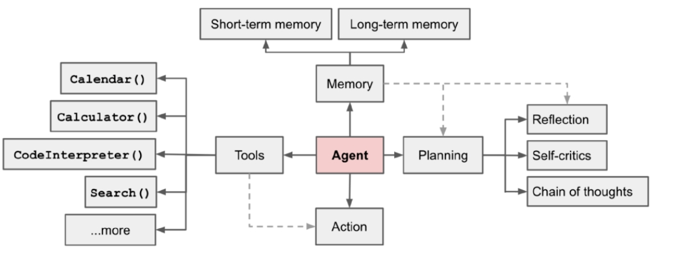
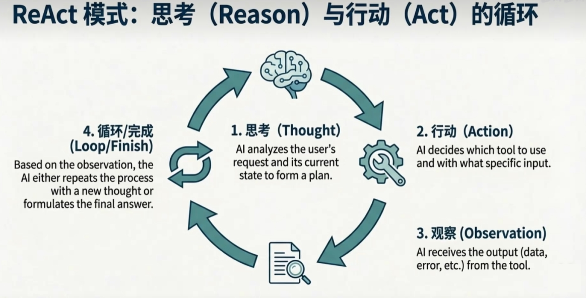
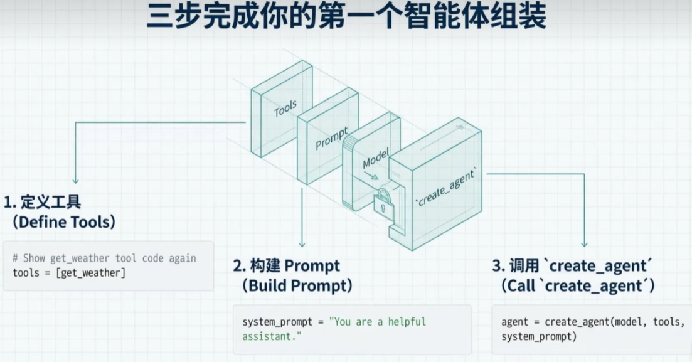
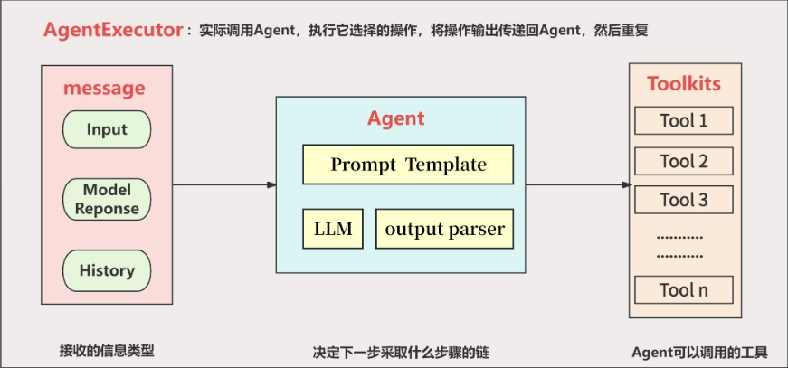

# 21 - Agent 智能体

---

**本章课程目标：**

- 理解 **Agent（智能体）** 与 **Tool（工具）** 的关系，掌握「推理 + 行动」的 ReAct 模式及 AgentExecutor 的工作流程。
- 了解 LangChain 中 Agent 从 V0.3 到 V1.0 的简化演进（多步组装 → `create_agent` 一步创建）。
- 会运行「工具 + 判断」、ReAct、A2A（Agent 与 Agent 协作）等实操案例，并理解其与 Tool、MCP 的衔接。

**前置知识建议：** 已学习 [第 17 章 Tools 工具调用](17-Tools工具调用.md)，了解 [Tool](17-Tools工具调用.md) / Function Calling 与 `@tool`、`bind_tools` 的用法；建议已学 [第 20 章 MCP 模型上下文协议](20-MCP模型上下文协议.md) 与 [第 1-3 章 RAG、微调、续训与智能体](1-3-RAG、微调、续训与智能体.md) 中关于智能体的概述。

**学习建议：** 先建立「Agent 是决策者、Tool 是能力组件」的直观印象，再按「Agent 是什么 → 与 Tool 的对比 → 演变与原理 → 实操与案例」顺序学习；案例需特定 Python 版本时文中会标明。

---

## 1、Agent 是什么？与 Tool 的关系

### 1.1 Agent 是什么

在 LangChain 中，**Agent（智能体）** 是**决策者**：它决定**什么时候**调用哪个工具、根据上下文**下一步做什么**、如何处理工具返回并决定是否继续调用。Agent 的核心是 **推理 + 行动（Reason + Act）**，即 **ReAct 模式**（下一小节展开）。

从组成上看，一个完整的智能体可以概括为：

**Agent = LLM + Memory + Tools + Planning + Action**

- **LLM（大语言模型）**：智能体的「大脑」，负责理解问题、推理和生成回答。
- **Memory（记忆）**：能记住当前对话和过往信息，包括短期对话上下文和长期知识，便于连贯决策。
- **Tools（工具）**：Agent 可调用的外部能力，如搜索、计算、查 API 等，用来做模型本身做不到的事（Tool 的具体定义见 1.3 节）。
- **Planning（规划）**：把复杂任务拆成步骤、选最优顺序，而不是乱试。
- **Action（行动）**：按规划真正去执行，通常通过调用工具或输出指令完成。

下图示意 Agent 如何做决策与调用工具；图中「规划 → 选工具 → 执行」即对应下文 ReAct 的 Thought → Action → Observation。



### 1.2 ReAct：Agent 如何工作

Agent 通过 **ReAct 循环**完成「推理 → 行动 → 观察」的迭代，直到任务满足结束条件。循环过程可分段理解如下：

- **思考（Thought）**：分析用户请求和当前状态，形成下一步计划。
- **行动（Action）**：根据计划决定用哪个工具、传入什么参数。
- **观察（Observation）**：接收工具返回的数据或错误信息。
- **循环或结束**：根据观察结果，要么带着新信息进入下一轮「思考 → 行动 → 观察」，要么认为已足够、给出最终答案。

四步首尾相接。下图中 Agent 的「规划 → 选工具 → 执行」即对应上述 Thought → Action → Observation。



### 1.3 Tool 的定位及与 Agent 的对比

**Tool（工具）** 是**能力的封装**：一个可调用的函数，封装了具体能力（如调用搜索引擎、查数据库、调 API）。Tool 本身**没有决策能力**，只是被动等待被调用，类似 Java 里的 Util 工具类。也就是说：**Tool = 能力**，**Agent = 决策 + 使用这些能力**。

**为什么有了 Tool 还需要 Agent？（面试题）**  
因为 Tool 只提供「能做什么」，不负责「何时做、按什么顺序做、做到什么程度为止」。Agent 负责根据用户意图和中间结果做规划和决策，从而完成多步、有条件分支的任务。

常见追问：单 Tool、单步任务要不要上 Agent？下面用几个典型场景对照「单靠 Tool 够不够」与「Agent 能做什么」：

| 场景                                                         | 单靠 Tool 能解决吗？                                                                | Agent 能做什么？                                                                |
| ------------------------------------------------------------ | ----------------------------------------------------------------------------------- | ------------------------------------------------------------------------------- |
| 用户问：「北京现在天气怎么样？」                             | **可以**。直接调天气 Tool 即可。                                                    | **用不上**。一步就能完成，不需要决策与编排。                                    |
| 用户问：「帮我订明天北京到上海的机票，并查一下上海天气。」   | **不行**。Tool 不会自己决定「先订票还是先查天气」、也不会把两步结果组合起来。       | **可以**。Agent 会推理：先订票 → 再查天气 → 把结果组合成一句回复。              |
| 用户问：「我有一份 PDF，帮我总结一下，再把总结发到我邮箱。」 | **不行**。需要多个 Tool（读 PDF、总结、发邮件），但谁先谁后、怎么串起来要有人决定。 | **可以**。Agent 会按顺序调用多个 Tool（读 PDF → 总结 → 发邮件），完成整条链路。 |

**关系类比**：Tool 像「工具箱里的螺丝刀、锤子」；Agent 像「有判断力的工匠」——知道什么时候用螺丝刀、什么时候用锤子，甚至先用螺丝刀再用锤子。

**本节小结**：

| 对象      | 角色        | 举例说明                                      |
| --------- | ----------- | --------------------------------------------- |
| **Tool**  | 能力组件    | 做具体事：查数据、跑 Python、调 API 等。      |
| **Agent** | 大脑/决策者 | 做判断：用哪个 Tool、按什么顺序、怎么组合用。 |

在 LangChain 里，这套「决策 + 工具」的 Agent 是如何从多步组装演变成一步创建的？下面看版本演变。

---

## 2、演变过程：从多步组装到一步创建

LangChain 中 Agent 的创建方式从 V0.x 的多步配置演进到 V1.0 的 **`create_agent` 一步到位**，底层由 **LangGraph** 图状态机驱动（详见后续 LangGraph 相关章节），调用接口也简化为 `agent.invoke`。

**流程对比**：

- **V0.x（旧方式）**：需要按顺序准备好「模型 → 工具 → 提示模板 → 组装成 Agent → 再交给 Executor」，一共 3 ～ 4 步。
- **V1.0（新方式）**：直接调用 `create_agent(...)` 就能得到一个可用的 Agent，一步完成，背后的编排由 LangGraph 负责。

**差异小结**：

| 维度         | V0.x（旧方式）             | V1.0（新方式）     |
| ------------ | -------------------------- | ------------------ |
| **创建步骤** | 3 ～ 4 步                  | 1 步               |
| **提示词**   | 使用 `PromptTemplate` 对象 | 可直接传简单字符串 |
| **调用方式** | `executor.invoke`          | `agent.invoke`     |

下图是「第一个智能体组装」的直观示意：**三步**即可完成——**① 定义工具**（如 `tools = [get_weather]`），**② 构建 Prompt**（如 `system_prompt = "You are a helpful assistant."`），**③ 调用 create_agent**（传入 model、tools、system_prompt 得到 `agent`）。图中从左到右的 Tools、Prompt、Model 三个块即这三类输入，最终汇入 `create_agent` 得到可用的智能体；对应上文 V1.0「一步创建」的简化写法。



---

## 3、Agent 工作原理（V0.3）

在 LangChain 的 Agent 架构中，**Agent** 负责「接收输入并决定采取什么操作」，**不直接执行**这些操作；**AgentExecutor** 负责真正调用 Agent、执行其选定的工具，并把工具输出传回 Agent，形成循环，二者结合才构成完整的智能体。



> **说明**：**AgentExecutor** 实际调用 Agent、执行 Agent 选择的操作，并将操作输出传回 Agent 再重复。左侧为 Agent 接收的信息类型（Input、Model Response、History）；中间为 Agent 链（Prompt Template + LLM + output parser）决定下一步；右侧为 Agent 可调用的工具集（Tool 1…Tool n）。

**工作流程可概括为：**

1. **输入解析**：语言模型分析用户输入，理解任务目标。
2. **推理规划**：使用 ReAct 等框架决定是否调用工具、调用哪些、顺序如何；ReAct 即在每次迭代中先「推理」再「行动」。
3. **工具调用**：按规划调用工具，传入参数并获取结果，将结果反馈给语言模型。
4. **迭代推理**：模型根据工具结果更新推理，可能再次调用工具，直到满足终止条件。
5. **生成最终答案**：模型综合所有信息，生成面向用户的最终回复。

**对应案例**：下面用「多城市天气比较」的完整代码对照上述流程——模型 + 工具 + 提示模板 → `create_tool_calling_agent` 得到 Agent → 用 `AgentExecutor` 执行并循环。

【案例源码】`案例与源码-2-LangChain框架/12-agent/AgentSmartSelectV0.3.py`

[AgentSmartSelectV0.3.py](案例与源码-2-LangChain框架/12-agent/AgentSmartSelectV0.3.py ":include :type=code")

---

## 4、Agent 工作原理（V1.0）

V1.0 通过 `create_agent` 将模型、工具、系统提示等封装在一起，使用方式更简洁，底层仍遵循「推理 → 行动 → 反馈」的循环。

**统一创建方式**：从 `langchain.agents` 引入 `create_agent`，一次调用即可完成配置。

**基础用法**——只需指定模型、工具和系统提示：

```python
from langchain.agents import create_agent

agent = create_agent(
    model="gpt-40",                              # 用哪个大模型
    tools=[search_tool, calculator_tool],        # 给 Agent 哪些工具
    system_prompt="You are a helpful assistant"  # 系统提示，定义角色
)
```

**完整配置**——需要更细控制时，还可以传入输出格式、中间件和上下文结构：

```python
agent = create_agent(
    model="gpt-40",                    # 统一的模型配置
    tools=[search_tool, calculator],  # 统一的工具配置
    system_prompt="Assistant",         # 统一的提示词配置
    response_format=structured_output, # 统一的输出配置（如结构化输出）
    middleware=[custom_middleware],    # 统一的扩展配置（中间件）
    context_schema=UserContext         # 统一的上下文信息（如用户信息结构）
)
```

也就是说：V1.0 把「模型、工具、提示、输出、扩展、上下文」都收口到 `create_agent` 一个接口里，按需传参即可。

**对应案例**：同一业务「多城市天气比较」用 V1.0 实现——直接 `create_agent(model, tools, system_prompt, response_format=...)` 得到 agent，再 `agent.invoke({"input": "..."})` 即可；无需手写 Prompt 模板和 AgentExecutor。

【案例源码】`案例与源码-2-LangChain框架/12-agent/AgentSmartSelectV1.0.py`

[AgentSmartSelectV1.0.py](案例与源码-2-LangChain框架/12-agent/AgentSmartSelectV1.0.py ":include :type=code")

**V0.3 与 V1.0 对比小结**（结合上面两段源码）：

| 维度           | V0.3（AgentSmartSelectV0.3.py）                                                                                                                             | V1.0（AgentSmartSelectV1.0.py）                                                                      |
| -------------- | ----------------------------------------------------------------------------------------------------------------------------------------------------------- | ---------------------------------------------------------------------------------------------------- |
| **创建方式**   | 先 `ChatPromptTemplate.from_messages` 建提示，再 `create_tool_calling_agent(llm, tools, prompt)` 得到 agent，最后 `AgentExecutor(agent=agent, tools=tools)` | 直接 `create_agent(model=model, tools=[...], system_prompt=..., response_format=...)` 一步得到 agent |
| **提示词**     | 必须用 `PromptTemplate` 对象，且需包含 `("placeholder", "{agent_scratchpad}")`                                                                              | 传字符串即可（如 `system_prompt="你是天气助手..."`）                                                 |
| **执行与调用** | 用 `agent_executor.invoke({"input": "..."})`，Executor 内部循环调 Agent + 执行工具                                                                          | 用 `agent.invoke({"input": "..."})`，底层由 LangGraph 等负责循环                                     |
| **输出形态**   | 返回字典中含 `output` 等，无内置结构化 schema                                                                                                               | 可传 `response_format=TypedDict`，返回中含 `structured_response`，便于程序化处理                     |
| **代码量**     | 需显式写 prompt、agent、executor 三块，步骤多                                                                                                               | 一段 `create_agent` 即可，步骤少                                                                     |

二者业务一致（多工具天气比较），可对比运行体会「多步组装」与「一步创建」的差异。

---

## 5、实操与案例

在理解 **3、4 节** 的 V0.3 / V1.0 原理后，本节通过三个**实操案例**巩固不同形态的 Agent：**单 Agent 多步调工具（ReAct）**、**多 Agent 协作（A2A）**、**工具来自 MCP 的 Agent**。每个案例的源码中都蕴含重要知识点，建议先看本节知识点说明再对照代码运行，最后用文末对比表串联理解。

**三个案例的定位对比**（便于先建立整体印象）：

| 案例               | 核心知识点                                                   | 工具从哪来                          | Agent 形态                       |
| ------------------ | ------------------------------------------------------------ | ----------------------------------- | -------------------------------- |
| **AgentReact**     | ReAct 循环、多步决策、messages 中的 tool_calls / ToolMessage | 本地 `@tool` 定义                   | 单个 Agent，自主选工具、多轮调用 |
| **Agent2Agent**    | 子 Agent 链、总协调、`bind_tools`、Runnable 组合             | 本地 `@tool`，每个子 Agent 只绑一个 | 多个子 Agent + 一个总协调 Agent  |
| **McpClientAgent** | mcp.json、MultiServerMCPClient、get_tools、异步 session      | MCP 服务（mcp.json 配置）           | 单个 Agent，工具列表来自 MCP     |

---

### 5.1 ReAct 实操：单 Agent 多步选工具

**知识点**：

- **ReAct 含义**：Reason + Act，即「先推理再行动」。Agent 根据用户问题**自主决定**调用哪个工具、调用几次、顺序如何；每轮先产生「思考」，再输出 `tool_calls`，执行后得到 **Observation**，再决定继续调工具或给出最终答案。
- **消息结构**：源码中通过 **`result['messages']`** 可看到完整对话：AIMessage（含 `tool_calls`）、ToolMessage（工具返回）、以及最终的 AIMessage（文本回答），对应教程 1 节中的 ReAct 四步循环。
- **与 3、4 节对比**：3、4 节的「工具+判断」多为「一次问题 → 一次或少数几次固定工具调用」；ReAct 强调**多步、有条件分支**的决策（如先搜索再查库存，再根据结果决定是否继续）。

【案例源码】`案例与源码-2-LangChain框架/12-agent/AgentReact.py`

[AgentReact.py](案例与源码-2-LangChain框架/12-agent/AgentReact.py ":include :type=code")

---

### 5.2 A2A 实操：多智能体协作与总协调

本小节对应**美团酒旅事业部**的真实业务场景：多智能体协作与总协调。

**知识点**：

- **A2A 含义**：Agent-to-Agent，即**多个 Agent 各司其职、由一个总协调 Agent 调度**。本案例中：携程只订机票、美团只订酒店、滴滴只打车，总协调按业务顺序调用并汇总。
- **子 Agent 实现**：每个子 Agent 只绑定**一个** `@tool`，子链为 **Prompt | llm.bind_tools([单个工具]) | output_parser** 的 **Runnable 链**；总协调用 **RunnableLambda** 封装「按序 invoke 子链、空结果时用工具 `.func` 兜底」的逻辑。
- **规范要点**：子 Agent **单一职责**、对外统一 `invoke({"input": "..."})`；工具用 **`@tool(名称, description=...)`** 并写清参数，便于模型正确传参。
- **与 ReAct 对比**：ReAct 是**一个** Agent 面对**多个**工具自行选择；A2A 是**多个** Agent 各管一个工具，由**总协调**决定调用顺序与汇总方式。

【案例源码】`案例与源码-2-LangChain框架/12-agent/Agent2Agent.py`

[Agent2Agent.py](案例与源码-2-LangChain框架/12-agent/Agent2Agent.py ":include :type=code")

---

### 5.3 Agent + MCP 实操：工具来自 MCP 服务

**知识点**：

- **工具来源**：前面案例的工具都是本进程内 **`@tool`** 定义；本案例演示**工具从 MCP 服务来**——从同目录 **mcp.json** 读取服务配置，用 **MultiServerMCPClient** 连接多台 MCP 服务器，通过 **`get_tools()`** 拿到 LangChain 可用的工具列表，再交给 **create_tool_calling_agent + AgentExecutor**，形成「LLM + MCP 工具」的对话 Agent。
- **流程要点**：<strong>load_servers(mcp.json) → MultiServerMCPClient(connections) → async with client.session(): tools = client.get_tools()</strong>，之后与 3 节的 V0.3 用法一致（Prompt + agent + executor + 聊天循环）。
- **与本地 @tool 对比**：工具**定义与运行**在 MCP 服务端，客户端只负责「按协议发现并调用」，便于多应用复用、跨进程部署。mcp.json 写法见 [第 20 章](20-MCP模型上下文协议.md)。

【案例源码】`案例与源码-2-LangChain框架/11-mcp/McpClientAgent.py`

[McpClientAgent.py](案例与源码-2-LangChain框架/11-mcp/McpClientAgent.py ":include :type=code")

---

**三案例对照小结**（便于串联理解）：

| 维度           | AgentReact                                     | Agent2Agent                               | McpClientAgent                                                        |
| -------------- | ---------------------------------------------- | ----------------------------------------- | --------------------------------------------------------------------- |
| **Agent 数量** | 1 个                                           | 多个子 Agent + 1 个总协调                 | 1 个                                                                  |
| **工具来源**   | 本地 `@tool`                                   | 本地 `@tool`，每子 Agent 一个             | MCP 服务（mcp.json + get_tools）                                      |
| **决策方式**   | 单 Agent 自主多步选工具                        | 总协调按序调子链，子 Agent 只执行绑定工具 | 单 Agent 自主选工具（工具来自 MCP）                                   |
| **调用入口**   | create_agent / agent.invoke 或 executor.invoke | 总协调 chain.invoke                       | create_tool_calling_agent + AgentExecutor，async session 内 get_tools |
| **典型场景**   | 问答 + 多步检索/查库                           | 多环节流水线（订票 → 酒店 → 用车）        | 多服务工具统一接入、对话式使用                                        |

---

## 6、小结：Agent、Tool、Function Calling、RAG、MCP 的区别与联系

学完 Agent 与 MCP 后，容易混淆的几个概念可以这样区分和串联。

**速览表**

| 概念                 | 主要作用     | 一句话                                                                       |
| -------------------- | ------------ | ---------------------------------------------------------------------------- |
| **Tool**             | 能力的封装   | 一个可调用的函数（如查天气、搜库），大模型能「用」的原子能力                 |
| **Function Calling** | 调用的机制   | 大模型「决定调哪个函数、传什么参数」并解析返回的底层能力                     |
| **RAG**              | 上下文的增强 | 通过检索把相关文档/知识注入 prompt，让大模型「看到」更多信息，不涉及调用函数 |
| **MCP**              | 连接的协议   | 规定工具/数据源如何暴露、如何被发现的标准化协议，解决「从哪连、怎么连」      |
| **Agent**            | 决策与编排   | 负责何时用哪个 Tool、按什么顺序、何时结束，是「用」Tool/RAG 的决策层         |

**区别与联系**

- **Tool 与 Function Calling**：**Tool** 是「被调用的东西」（能力单元），**Function Calling** 是「怎么调用」——模型根据输入输出 `tool_calls`，运行时执行对应 Tool 并把结果塞回对话。没有 Tool 就没有可调对象；没有 Function Calling，模型就无法按规范发起调用。二者通常一起出现：用 `@tool` 定义 Tool，用 `bind_tools` 等把 Tool 列表交给模型，模型通过 Function Calling 决定调谁、传什么参数。

- **RAG 与 Tool**：**RAG** 解决「知识不足」——给模型更多**上下文**（检索到的文档），模型在生成时参考这些内容。**Tool** 解决「能力不足」——让模型能执行**动作**（查 API、写库、发邮件等）。一个补「输入」，一个补「能力」；Agent 可以先用 RAG 拿到相关知识，再决定是否调 Tool、调哪个。

- **MCP 与 Tool**：**Tool** 是能力的抽象（本地一个 `@tool` 函数即一个 Tool）。**MCP** 是「工具从哪里来、如何对接」的**协议层**——工具可以来自本进程手写的 `@tool`，也可以来自远程/另一进程的 MCP 服务（通过 mcp.json 配置、MultiServerMCPClient 获取）。MCP 不替代 Tool，而是让「工具集」可以按标准从多处接入、被多应用复用。

- **Agent 与其余四者**：**Agent** 是**决策与编排**角色：根据用户意图和当前状态，决定是否调 Tool、调哪个、按什么顺序，必要时结合 RAG 检索结果再决策。Tool / Function Calling / RAG / MCP 都是 Agent 可用的**基础设施**——Agent 通过 Function Calling 去调 Tool（Tool 可能来自本地或 MCP），并可能先通过 RAG 扩充上下文再行动。关系可简写为：**Agent = 决策层；Tool = 能力层；Function Calling = 调用机制；RAG = 上下文增强；MCP = 工具/服务的连接协议。**

**在应用中的配合**

- 典型链路：用户提问 → **Agent** 规划 → 若需外部知识则用 **RAG** 检索 → 若需执行动作则通过 **Function Calling** 调 **Tool**（Tool 可能由 **MCP** 服务提供）→ 拿到结果后 Agent 继续推理或给出最终回答。第 20 章讲 MCP 的配置与客户端，本章讲 Agent 如何与 Tool/ReAct/MCP 结合，二者配合即可搭出「LLM + 检索 + 多源工具」的完整智能体。

---

**本章小结：**

- **Agent** 是**决策层**，负责何时调哪个 [Tool](17-Tools工具调用.md)、如何组合多步；**Tool** 是**能力层**，只提供可调用函数。二者结合形成「推理 + 行动」的 ReAct 循环，由 **AgentExecutor**（或 V1.0 的 `create_agent`）驱动执行。
- LangChain 中 Agent 从 V0.x 的多步组装演进到 V1.0 的 `create_agent` 一步创建，底层由 **LangGraph** 支撑；结合本节「Agent、Tool、Function Calling、RAG、MCP 的区别与联系」可更好把握智能体与工具链的定位。

**建议下一步：** 在本地依次运行 `AgentSmartSelectV0.3.py`、`AgentSmartSelectV1.0.py`、`AgentReact.py` 和 `Agent2Agent.py`，对照文档理解 [Tool](17-Tools工具调用.md)、Agent、AgentExecutor 的配合；若需更复杂的图编排与多步工作流，可继续学习 **LangGraph** 相关章节。
