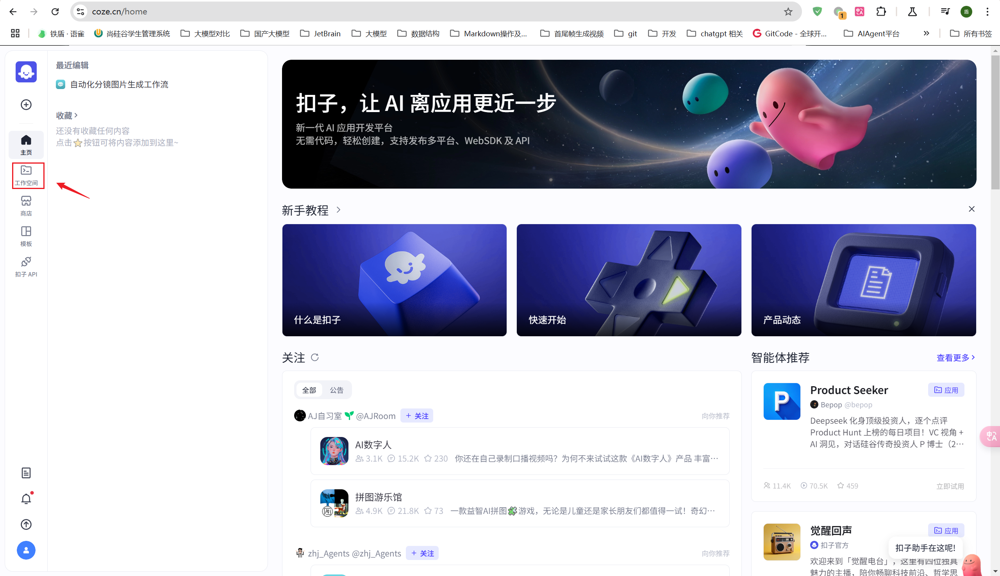

# 3.1-Coze 案例：一键生成行业调研 PPT

## 0、效果测试


## 1、环境准备

### 1.1 进入工作空间



### 1.2 创建应用


### 1.3 新建工作流


## 2、搭建工作流

coze 工作流提供了许多节点，要了解用法可以参考官方文档

> https://www.coze.cn/open/docs/guides

### 2.1 开始节点

> 开始节点是工作流的起始节点，用于设定启动工作流需要的输入信息。
>
> 开始节点只有输入参数，没有输出等其他参数。


### 2.2 文本处理节点

在开始节点后，添加节点：


字符串拼接：

```
{{String1}}行业发展现状
```

接着，可以测试节点，即试运行。

### 2.3 获取头条新闻节点

插件节点用于在工作流中调用插件运行指定工具。


这里，插件选择 getToutiaoNews 即可


测试：


输入：

```
{
  "q": "中国新能源汽车行业发展现状"
}
```

输出：

```
{
  "news": [
    {
      "title": "跃升：我国新能源汽车产业加速提质向新",
      "url": "https://auto.cfbond.com/2025/08/13/991096615.html?sitemap",
      "categories": [
        "news_car/new_energy_car/other",
        "news_finance/industrial_economy/energy",
        "news_tech/other",
        "news_finance/other",
        "news_car/car_advertorial",
        "news_car/new_energy_car",
        "news_car/car_news",
        "news_car/car_ruanwen",
        "news_car/car_industry",
        "news_car",
        "news_finance",
        "news_tech"
      ],
      "cover": "https://p6-img.searchpstatp.com/tos-cn-i-vvloioitz3/b68065a674a27628212a18018cea9add~tplv-vvloioitz3-6:190:124.jpeg",
      "media_name": "中国财富网",
      "summary": "新华社北京8月12日电 题：跃升：我国新能源汽车产业加速提质向新新华社记者唐诗凝、田金文发展新能源汽车是我国从汽车大国迈向汽车强国的必由之路。",
      "time": "2025-08-13 09:05"
    },
    {
      "title": "告别价格战！新能源汽车产业链集体回暖，&#34;金九银十&#34;蓄势待发",
      "url": "https://toutiao.com/group/7537934593316438528/",
      "categories": [
        "news_finance/investment/stock/motor_dom",
        "news_finance/investment/stock/public_utility",
        "news_finance/investment/other",
        "news_car/new_energy_car/other",
        "news_finance/industrial_economy/energy",
        "news_tech/other",
        "news_car/new_energy_car",
        "news_car/car_news",
        "news_finance/investment",
        "news_car/car_industry",
        "news_finance",
        "news_car",
        "news_tech"
      ],
      "cover": "https://p6-img.searchpstatp.com/tos-cn-i-vvloioitz3/e4ef4e165a3e2debf26b1314e3fbf109~tplv-vvloioitz3-6:190:124.jpeg",
      "media_name": "华夏基金",
      "summary": "在经历了前所未有的高速增长与随之而来的激烈内卷后，中国新能源汽车产业链正站在一个新的历史拐点。近期，中国新能源汽车产业链新闻频出，“反内卷”政策暖风叠加即将到来的“金九银十”，共同指向板块回温在即。",
      "time": "2025-08-13 13:17"
    },
    {
      "title": "中汽协：7月新能源汽车产销延续快速增长态势",
      "url": "http://ku.m.chinanews.com/wapapp/cns/cj/2025/08-11/10462993.shtml",
      "categories": [
        "news_car/new_energy_car/other",
        "news_finance/industrial_economy/energy",
        "news_tech/other",
        "news_car/car_advertorial",
        "news_car/new_energy_car",
        "news_car/car_news",
        "news_finance/finance_sensitive",
        "news_car/car_industry",
        "news_finance",
        "news_car",
        "news_tech"
      ],
      "cover": "",
      "media_name": "中国新闻网",
      "summary": "中新社北京8月11日电 (记者 刘文文)中国汽车工业协会(简称“中汽协”)11日举行月度信息发布会。记者从发布会上获悉，7月，中国新能源汽车产销量同比分别增长26.3%和27.4%，延续快速增长态势。",
      "time": "2025-08-11 17:36"
    },
    {
      "title": "中汽协：7月份我国新能源汽车延续快速增长态势",
      "url": "https://tidenews.com.cn/news.html?id=3211710&cnl=TOUTIAOHAO&source=000040",
      "categories": [
        "news_car/new_energy_car/other",
        "news_finance/industrial_economy/energy",
        "news_tech/other",
        "news_car/car_advertorial",
        "news_car/new_energy_car",
        "news_car/car_news",
        "news_finance/finance_sensitive",
        "news_car/car_industry",
        "news_car",
        "news_finance",
        "news_tech"
      ],
      "cover": "https://p3-img.searchpstatp.com/tos-cn-i-vvloioitz3/91b14876c6d90f3f822564ea68445513~tplv-vvloioitz3-6:190:124.jpeg",
      "media_name": "浙江日报",
      "summary": "潮新闻 记者 沈爱群8月11日下午，中国汽车工业协会召开月度信息发布会。会上，中汽协相关负责人表示：7月份，我国新能源汽车延续快速增长态势。7月，我国汽车产销分别完成259.1万辆和259.3万辆，同比分别增长13.3%和14.7%。其中，7月份我国新能源汽车产销分别完成124.",
      "time": "2025-08-12 20:22"
    },
    {
      "title": "2025 年中国新能源汽车发展现状与未来展望",
      "url": "https://toutiao.com/group/7516755652187734566/",
      "categories": [
        "news_car/new_energy_car/other",
        "news_finance/industrial_economy/energy",
        "news_tech/other",
        "news_car/car_advertorial",
        "news_car/new_energy_car",
        "news_car/unmanned",
        "news_car/car_ruanwen",
        "news_finance/finance_sensitive",
        "news_car/car_industry",
        "news_car/domestic_car",
        "news_finance",
        "news_car",
        "news_tech"
      ],
      "cover": "https://p6-img.searchpstatp.com/tos-cn-i-vvloioitz3/39a79f5909f5b2aaae844d37380c1ff1~tplv-vvloioitz3-6:190:124.jpeg",
      "media_name": "生活的思考者",
      "summary": "在全球倡导绿色出行与可持续发展的大背景下，2025 年的中国新能源汽车行业正处于蓬勃发展的关键时期，展现出诸多令人瞩目的现状，同时也蕴含着无限的未来潜力。",
      "time": "2025-06-17 11:31"
    }
  ]
}
```

### 2.4 代码节点

> 目标：提取头条新闻中的 URL


代码如下

```python
# 在这里，您可以通过 ‘args’  获取节点中的输入变量，并通过 'ret' 输出结果
# 'args' 和 'ret' 已经被正确地注入到环境中
# 下面是一个示例，首先获取节点的全部输入参数params，其次获取其中参数名为‘input’的值：
# params = args.params;
# input = params.input;
# 下面是一个示例，输出一个包含多种数据类型的 'ret' 对象：
# ret: Output =  { "name": ‘小明’, "hobbies": [“看书”, “旅游”] };

async def main(args: Args) -> Output:
    params = args.params

    url_list = [i['url'] for i in params["input"]]
    # 构建输出对象
    ret: Output = {
        "url_list": url_list
    }
    return ret
```

测试情况：

输入：

```
{
  "input": [
    {
      "categories": [
        "news_car/new_energy_car/other",
        "news_finance/industrial_economy/energy",
        "news_tech/other",
        "news_finance/other",
        "news_car/car_advertorial",
        "news_car/new_energy_car",
        "news_car/car_news",
        "news_car/car_ruanwen",
        "news_car/car_industry",
        "news_car",
        "news_finance",
        "news_tech"
      ],
      "cover": "https://p6-img.searchpstatp.com/tos-cn-i-vvloioitz3/b68065a674a27628212a18018cea9add~tplv-vvloioitz3-6:190:124.jpeg",
      "media_name": "中国财富网",
      "summary": "新华社北京8月12日电 题：跃升：我国新能源汽车产业加速提质向新新华社记者唐诗凝、田金文发展新能源汽车是我国从汽车大国迈向汽车强国的必由之路。",
      "time": "2025-08-13 09:05",
      "title": "跃升：我国新能源汽车产业加速提质向新",
      "url": "https://auto.cfbond.com/2025/08/13/991096615.html?sitemap"
    },
    {
      "categories": [
        "news_finance/investment/stock/motor_dom",
        "news_finance/investment/stock/public_utility",
        "news_finance/investment/other",
        "news_car/new_energy_car/other",
        "news_finance/industrial_economy/energy",
        "news_tech/other",
        "news_car/new_energy_car",
        "news_car/car_news",
        "news_finance/investment",
        "news_car/car_industry",
        "news_finance",
        "news_car",
        "news_tech"
      ],
      "cover": "https://p6-img.searchpstatp.com/tos-cn-i-vvloioitz3/e4ef4e165a3e2debf26b1314e3fbf109~tplv-vvloioitz3-6:190:124.jpeg",
      "media_name": "华夏基金",
      "summary": "在经历了前所未有的高速增长与随之而来的激烈内卷后，中国新能源汽车产业链正站在一个新的历史拐点。近期，中国新能源汽车产业链新闻频出，“反内卷”政策暖风叠加即将到来的“金九银十”，共同指向板块回温在即。",
      "time": "2025-08-13 13:17",
      "title": "告别价格战！新能源汽车产业链集体回暖，&#34;金九银十&#34;蓄势待发",
      "url": "https://toutiao.com/group/7537934593316438528/"
    },
    {
      "categories": [
        "news_car/new_energy_car/other",
        "news_finance/industrial_economy/energy",
        "news_tech/other",
        "news_car/car_advertorial",
        "news_car/new_energy_car",
        "news_car/car_news",
        "news_finance/finance_sensitive",
        "news_car/car_industry",
        "news_finance",
        "news_car",
        "news_tech"
      ],
      "cover": "",
      "media_name": "中国新闻网",
      "summary": "中新社北京8月11日电 (记者 刘文文)中国汽车工业协会(简称“中汽协”)11日举行月度信息发布会。记者从发布会上获悉，7月，中国新能源汽车产销量同比分别增长26.3%和27.4%，延续快速增长态势。",
      "time": "2025-08-11 17:36",
      "title": "中汽协：7月新能源汽车产销延续快速增长态势",
      "url": "http://ku.m.chinanews.com/wapapp/cns/cj/2025/08-11/10462993.shtml"
    },
    {
      "categories": [
        "news_car/new_energy_car/other",
        "news_finance/industrial_economy/energy",
        "news_tech/other",
        "news_car/car_advertorial",
        "news_car/new_energy_car",
        "news_car/car_news",
        "news_finance/finance_sensitive",
        "news_car/car_industry",
        "news_car",
        "news_finance",
        "news_tech"
      ],
      "cover": "https://p3-img.searchpstatp.com/tos-cn-i-vvloioitz3/91b14876c6d90f3f822564ea68445513~tplv-vvloioitz3-6:190:124.jpeg",
      "media_name": "浙江日报",
      "summary": "潮新闻 记者 沈爱群8月11日下午，中国汽车工业协会召开月度信息发布会。会上，中汽协相关负责人表示：7月份，我国新能源汽车延续快速增长态势。7月，我国汽车产销分别完成259.1万辆和259.3万辆，同比分别增长13.3%和14.7%。其中，7月份我国新能源汽车产销分别完成124.",
      "time": "2025-08-12 20:22",
      "title": "中汽协：7月份我国新能源汽车延续快速增长态势",
      "url": "https://tidenews.com.cn/news.html?id=3211710&cnl=TOUTIAOHAO&source=000040"
    },
    {
      "categories": [
        "news_car/new_energy_car/other",
        "news_finance/industrial_economy/energy",
        "news_tech/other",
        "news_car/car_advertorial",
        "news_car/new_energy_car",
        "news_car/unmanned",
        "news_car/car_ruanwen",
        "news_finance/finance_sensitive",
        "news_car/car_industry",
        "news_car/domestic_car",
        "news_finance",
        "news_car",
        "news_tech"
      ],
      "cover": "https://p6-img.searchpstatp.com/tos-cn-i-vvloioitz3/39a79f5909f5b2aaae844d37380c1ff1~tplv-vvloioitz3-6:190:124.jpeg",
      "media_name": "生活的思考者",
      "summary": "在全球倡导绿色出行与可持续发展的大背景下，2025 年的中国新能源汽车行业正处于蓬勃发展的关键时期，展现出诸多令人瞩目的现状，同时也蕴含着无限的未来潜力。",
      "time": "2025-06-17 11:31",
      "title": "2025 年中国新能源汽车发展现状与未来展望",
      "url": "https://toutiao.com/group/7516755652187734566/"
    }
  ]
}
```

输出：

```
{
  "url_list": [
    "https://auto.cfbond.com/2025/08/13/991096615.html?sitemap",
    "https://toutiao.com/group/7537934593316438528/",
    "http://ku.m.chinanews.com/wapapp/cns/cj/2025/08-11/10462993.shtml",
    "https://tidenews.com.cn/news.html?id=3211710&cnl=TOUTIAOHAO&source=000040",
    "https://toutiao.com/group/7516755652187734566/"
  ]
}
```

### 2.5 批处理节点

针对上一步的每一个新闻链接 url，获取链接中的文本信息


#### 2.5.1 配置


#### 2.5.2 批处理体配置

批处理体内添加节点：链接读取


**1、批处理体测试情况：**

输入：

```
https://auto.cfbond.com/2025/08/13/991096615.html?sitemap
```

输出：

```
{
  "code": null,
  "data": {
    "content": "2025-08-13 00:00:00跃升：我国新能源汽车产业加速提质向新\n新华社北京8月12日电 题：跃升：我国新能源汽车产业加速提质向新\n新华社记者唐诗凝、田金文\n发展新能源汽车是我国从汽车大国迈向汽车强国的必由之路。\n年产销规模均超过1200万辆，关键核心技术持续突破，全产业链自主可控能力和绿色发展水平不断提升，自主品牌出海步伐加快……“十四五”以来，我国新能源汽车产业不断提升核心竞争力，为经济高质量发展注入澎湃动能。\n跃升：我国新能源汽车产业加速提质向新\n汽车产业转型升级成效显著\n2024年，全国新能源汽车保有量达到3140万辆，比“十三五”末的492万辆增长5倍多。\n“新能源汽车已经成为我国汽车市场的主导力量，标志着我国电动化转型升级进入稳步发展阶段。”中国汽车工业协会常务副会长兼秘书长付炳锋说，技术快速迭代和成本优化，促进了新能源汽车规模化发展和市场化普及。\n中汽协会最新发布的数据显示，2025年1至7月，新能源汽车产销量双超820万辆，市场渗透率进一步提升至45%。《新能源汽车产业发展规划（2021—2035年）》提出的到2025年新能源汽车新车销售量达到汽车新车销售总量的20%左右，这一目标已提前超额完成。\n跃升背后，是“十四五”以来新能源汽车产业全链条的系统性突破——\n以纯电动汽车、插电式混合动力（含增程式）汽车、燃料电池汽车为“三纵”，布局整车技术创新链，以动力电池与管理系统、驱动电机与电力电子、网联化与智能化技术为“三横”，构建关键零部件技术供给体系。\n政策赋能产业高质量发展；跨界融合重构产业生态，产业链现代化水平持续提升；充换电网络建设、智能路网设施建设等协调推进；深化开放合作，加快融入全球价值链……助力新能源汽车产业发展不断打开新空间。\n创新赋能产业活力涌现\n轻量化复合上盖提升电池系统能量密度；大面水冷扩充换热面积保障4C超充稳定运行；双重底部防护可抵抗高强度冲击……宁德时代推出的麒麟电池采用第三代CTP技术，进一步缓解“里程焦虑”，让行驶更安全。\n清晨通勤时，一键开启“战斗模式”，座椅自动调直、导航同步公司地址；周末露营时，切换“慵懒假日”，天幕透光率调至50%、音响播放白噪音……借助可编程座舱技术，用户可自由组合几十项功能，打造千人千面的专属“移动生活空间”。\n“十四五”规划纲要提出，突破新能源汽车高安全动力电池、高效驱动电机、高性能动力系统等关键技术，加快研发智能（网联）汽车基础技术平台及软硬件系统、线控底盘和智能终端等关键部件。\n技术创新的“引擎”轰鸣不息，驱动智能座舱和车载软件越来越“聪明”，电池系统、芯片持续迭代升级，更带来生产线变革，汽车制造的逻辑正从“物理叠加”向“智能共生”升维。\n走进赛力斯超级工厂，1600多台智能终端与3000多台机器人协同运作，焊接、喷涂等生产环节自动化率实现100%。“采用AI视觉检测技术，十几秒钟就能对单一零部件的几十处卡口完成全部检测，有效保障产品一致性和出厂品质。”赛力斯超级工厂总经理曹楠说。\n“十四五”以来，智能化技术在新能源汽车研发设计、生产制造、仓储物流等各环节深度应用，成为新能源汽车产业逐“新”提“智”的缩影。\n坚定走“品牌向上”之路\n7月29日，重庆，中国长安汽车集团有限公司成立大会举行。这家新央企拥有117家分公司和子公司，主要经营汽车整车及零部件、汽车销售等业务。\n“这是汽车产业供给侧结构性改革的关键举措，也为中国汽车产业在全球产业格局变革中增加了确定性。”中汽中心中国汽车战略与政策研究中心主任王铁说，汽车新央企的诞生有利于带动汽车产业资源整合，优化组织结构，放大规模效益。\n面对技术迭代日新月异、国际竞争加剧、产业格局重塑等挑战，“十四五”以来，从政府部门到行业企业，一系列有力举措和创新实践接连落地，持续巩固和扩大新能源汽车产业发展优势。\n“加快培育具有国际竞争力的新兴支柱产业”“依法依规治理企业无序竞争”“推进重点行业产能治理”“规范地方招商引资行为”……7月30日召开的中央政治局会议作出一系列重要部署。7月16日召开的国务院常务会议明确提出，切实规范新能源汽车产业竞争秩序。\n践行“供应商支付账期不超过60天”承诺，重点车企在行动——中国一汽组建跨部门专项工作组，形成闭环管理，并针对中小企业推出专项支持；广汽集团构建覆盖“订单下发—验收入库—对账结算—货款支付”的全流程管控体系……\n推动构建“整车—零部件”协作共赢发展生态、促进产业健康可持续发展，坚定走“品牌向上”之路成为全行业共识。\n中国汽车工程学会副秘书长赵立金表示，我国汽车产业正从“规模发展”迈向“价值创造”，从“跟随发展”转向“引领创新”，面对市场竞争，要进一步提升高质量科技供给、加强基础原创技术研究。\n“产业链上下游需进一步强化芯片、人工智能等前沿领域创新，持续推进动力电池、燃料电池等技术迭代升级，赋能智能底盘、智能驾驶、智能座舱跨系统融合，着力从源头上突破制约产业高质量发展的瓶颈。”赵立金说。\n责任编辑：陈琼枝",
    "images": null,
    "title": "跃升:我国新能源汽车产业加速提质向新"
  },
  "err_msg": null,
  "error_code": "",
  "error_msg": "",
  "message": null,
  "pdf_content": null
}
```

**2、批处理测试情况**

输入：

```
[
    "https://auto.cfbond.com/2025/08/13/991096615.html?sitemap",
    "https://toutiao.com/group/7537934593316438528/",
    "http://ku.m.chinanews.com/wapapp/cns/cj/2025/08-11/10462993.shtml",
    "https://tidenews.com.cn/news.html?id=3211710&cnl=TOUTIAOHAO&source=000040",
    "https://toutiao.com/group/7516755652187734566/"
]
```

输出：

```
{
  "output": [
    "2025-08-13 00:00:00跃升：我国新能源汽车产业加速提质向新\n新华社北京8月12日电 题：跃升：我国新能源汽车产业加速提质向新\n新华社记者唐诗凝、田金文\n发展新能源汽车是我国从汽车大国迈向汽车强国的必由之路。\n年产销规模均超过1200万辆，关键核心技术持续突破，全产业链自主可控能力和绿色发展水平不断提升，自主品牌出海步伐加快……“十四五”以来，我国新能源汽车产业不断提升核心竞争力，为经济高质量发展注入澎湃动能。\n跃升：我国新能源汽车产业加速提质向新\n汽车产业转型升级成效显著\n2024年，全国新能源汽车保有量达到3140万辆，比“十三五”末的492万辆增长5倍多。\n“新能源汽车已经成为我国汽车市场的主导力量，标志着我国电动化转型升级进入稳步发展阶段。”中国汽车工业协会常务副会长兼秘书长付炳锋说，技术快速迭代和成本优化，促进了新能源汽车规模化发展和市场化普及。\n中汽协会最新发布的数据显示，2025年1至7月，新能源汽车产销量双超820万辆，市场渗透率进一步提升至45%。《新能源汽车产业发展规划（2021—2035年）》提出的到2025年新能源汽车新车销售量达到汽车新车销售总量的20%左右，这一目标已提前超额完成。\n跃升背后，是“十四五”以来新能源汽车产业全链条的系统性突破——\n以纯电动汽车、插电式混合动力（含增程式）汽车、燃料电池汽车为“三纵”，布局整车技术创新链，以动力电池与管理系统、驱动电机与电力电子、网联化与智能化技术为“三横”，构建关键零部件技术供给体系。\n政策赋能产业高质量发展；跨界融合重构产业生态，产业链现代化水平持续提升；充换电网络建设、智能路网设施建设等协调推进；深化开放合作，加快融入全球价值链……助力新能源汽车产业发展不断打开新空间。\n创新赋能产业活力涌现\n轻量化复合上盖提升电池系统能量密度；大面水冷扩充换热面积保障4C超充稳定运行；双重底部防护可抵抗高强度冲击……宁德时代推出的麒麟电池采用第三代CTP技术，进一步缓解“里程焦虑”，让行驶更安全。\n清晨通勤时，一键开启“战斗模式”，座椅自动调直、导航同步公司地址；周末露营时，切换“慵懒假日”，天幕透光率调至50%、音响播放白噪音……借助可编程座舱技术，用户可自由组合几十项功能，打造千人千面的专属“移动生活空间”。\n“十四五”规划纲要提出，突破新能源汽车高安全动力电池、高效驱动电机、高性能动力系统等关键技术，加快研发智能（网联）汽车基础技术平台及软硬件系统、线控底盘和智能终端等关键部件。\n技术创新的“引擎”轰鸣不息，驱动智能座舱和车载软件越来越“聪明”，电池系统、芯片持续迭代升级，更带来生产线变革，汽车制造的逻辑正从“物理叠加”向“智能共生”升维。\n走进赛力斯超级工厂，1600多台智能终端与3000多台机器人协同运作，焊接、喷涂等生产环节自动化率实现100%。“采用AI视觉检测技术，十几秒钟就能对单一零部件的几十处卡口完成全部检测，有效保障产品一致性和出厂品质。”赛力斯超级工厂总经理曹楠说。\n“十四五”以来，智能化技术在新能源汽车研发设计、生产制造、仓储物流等各环节深度应用，成为新能源汽车产业逐“新”提“智”的缩影。\n坚定走“品牌向上”之路\n7月29日，重庆，中国长安汽车集团有限公司成立大会举行。这家新央企拥有117家分公司和子公司，主要经营汽车整车及零部件、汽车销售等业务。\n“这是汽车产业供给侧结构性改革的关键举措，也为中国汽车产业在全球产业格局变革中增加了确定性。”中汽中心中国汽车战略与政策研究中心主任王铁说，汽车新央企的诞生有利于带动汽车产业资源整合，优化组织结构，放大规模效益。\n面对技术迭代日新月异、国际竞争加剧、产业格局重塑等挑战，“十四五”以来，从政府部门到行业企业，一系列有力举措和创新实践接连落地，持续巩固和扩大新能源汽车产业发展优势。\n“加快培育具有国际竞争力的新兴支柱产业”“依法依规治理企业无序竞争”“推进重点行业产能治理”“规范地方招商引资行为”……7月30日召开的中央政治局会议作出一系列重要部署。7月16日召开的国务院常务会议明确提出，切实规范新能源汽车产业竞争秩序。\n践行“供应商支付账期不超过60天”承诺，重点车企在行动——中国一汽组建跨部门专项工作组，形成闭环管理，并针对中小企业推出专项支持；广汽集团构建覆盖“订单下发—验收入库—对账结算—货款支付”的全流程管控体系……\n推动构建“整车—零部件”协作共赢发展生态、促进产业健康可持续发展，坚定走“品牌向上”之路成为全行业共识。\n中国汽车工程学会副秘书长赵立金表示，我国汽车产业正从“规模发展”迈向“价值创造”，从“跟随发展”转向“引领创新”，面对市场竞争，要进一步提升高质量科技供给、加强基础原创技术研究。\n“产业链上下游需进一步强化芯片、人工智能等前沿领域创新，持续推进动力电池、燃料电池等技术迭代升级，赋能智能底盘、智能驾驶、智能座舱跨系统融合，着力从源头上突破制约产业高质量发展的瓶颈。”赵立金说。\n责任编辑：陈琼枝",
    "发布时间为2025-08-13 13:17:57在经历了前所未有的高速增长与随之而来的激烈内卷后，中国新能源汽车产业链正站在一个新的历史拐点。近期，中国新能源汽车产业链新闻频出，“反内卷”政策暖风叠加即将到来的“金九银十”，共同指向板块回温在即。一、上游惊雷：从宁德时代停产事件到锂价触底回升过去一月，围绕着江西宜春8家涉锂矿山企业需在9月底前完成储量核实报告编制的消息，频繁扰动碳酸锂价格走向。8月11日，宁德时代在互动平台表示，公司在宜春项目采矿许可证8月9日到期后已暂停开采作业，正按相关规定尽快办理采矿证延续申请。这一消息迅速在市场层面引发反应。公告当日，国内碳酸锂期货主力合约及其他月份合约均触及涨停，主力合约价格重返8万元/吨以上；二级市场上，A股和港股的锂矿板块相关上市公司股价集体走强，天齐锂业、赣锋锂业等龙头股纷纷大涨。尽管消息面上，宁德时代的公告是导致短期价格急剧拉升的直接因素，但市场更深层次的趋势在此前已开始显现。近期锂价出现回暖，主要受供需两端因素的共同驱动。供给方面，部分锂盐企业进入月度检修期，对短期产量形成一定扰动。需求方面，碳酸锂作为新能源车动力电池的主要原材料之一，其价格涨跌与新能源车的景气度密切相关。下游新能源车市在传统淡季表现出较一定韧性，同时，面向“金九银十”销售旺季的备货需求也已开始逐步释放，共同为价格提供了向上支撑。图：电池级碳酸锂价格近期触底回升（数据来源：Wind，截至2025-08-08）从数据上看，锂电池方面，7 月公布的 6 月国内动力电池装车量 58.20GWh，环比+1.9%，同比+35.9%，维持高增。整车方面，乘联分会数据显示，7月新能源乘用车生产达到114.7万辆，同比+22.3%；新能源乘用车市场零售98.7万辆，同比+12.0%；1-7月累计零售645.5万辆，同比+29.5%。7月新能源乘用车厂商出口21.3万辆，同比+120.4%，环比+7.6%；1-7月累计出口119.9万辆，同比+57.1%。展望未来，新一轮的备货周期已在逐步启动，更有望利好上游锂矿。图：2025年6月动力电池装车量维持较优增长可以认为，需求端的复苏是支撑锂价回升的一大重要因素。 而宁德时代的停产公告，在此基础上扮演了催化剂的角色，从供给侧一定程度强化了市场的看涨预期，叠加已经开始恢复的需求基本面，共同推动本轮锂电板块上涨行情。要理解此次上游材料市场变化的根本动力，以及下游企业开启备货周期的信心来源，则需要将分析视角转向整车终端市场的实际表现和未来预期。二、整车市场转“旺”在即：销量预期上调与重磅新车竞发近期，来自整车市场的宏观数据和企业动态均释放了积极信号，有效支撑了全产业链的信心。今年上半年在国家和地方政府鼓励汽车消费、提振经济的多重利好政策加持下，车市整体呈现复苏增长态势。根据乘联分会的最新预测，2025年全年乘用车零售总量预计将达到2435万辆，同比+6%，该预测值较6月的预测上调了30万辆；全年乘用车出口量预期上调至546万辆，同比+14%，较年初的预测值提升了16万辆。在新能源汽车领域，乘联会预计2025年批发销量可达1548万辆，同比+27%，全年市场渗透率有望达到56%。上调的预期数据反映出，尽管市场竞争激烈，但新能源汽车的整体增长动能依然强劲，并且持续超出此前预期。图：2020年以来的中国新能源汽车零售渗透率：此外，车企方面新产品催化密集。民生证券指出，8月上旬，理想i8上市后应市场需求调整配置及售价；全新小鹏P7、智界新款S7/R7开始预售；极氪公布2025年下半年产品更新计划（涉及极氪 X、极氪007、极氪 001、极氪 7X多款车型）；吉利银河A7正式上市，新车共推出7款车型，限时先享价8.18-11.78万元。后续伴随新车密集上市、交付上量，车市基本面将陆续向好。宏观层面的销量预期提升，与微观层面的企业产品周期强势相结合，共同构成了下游市场向好的基本面，为上游环节提供了更具确定性的需求保障。三、 “反内卷”提振全产业链信心自2025年中期以来，工信部、国家发改委等主管部门多次组织行业会议，明确提出要规范市场竞争秩序，引导产业从价格竞争转向技术、质量和品牌价值的综合竞争，旨在推动产业实现高质量发展。“反内卷”共识的形成，对于全产业链形成系统性利好。对于上游锂矿和中游电池企业而言，下游整车厂的经营压力有望得到缓解，从而带来更稳定、可预期的订单需求，有助于避免因车价剧烈波动而向上游传导过高的成本压力，更利于形成稳定的供应链合作关系。对于下游整车企业，摆脱无序的价格战，可以将更多资源投入到核心技术研发、产品质量提升和用户服务优化上。这不仅有助于企业自身盈利能力的修复，也是推动整个行业技术进步和品牌向上的根本途径。随着“反内卷”成为行业共识，市场竞争逐步回归理性，企业盈利能力有望得到修复。从价格战转向价值创造的趋势，显著改善了产业链的健康度和长期发展预期。多家券商普遍认为行业基本面正在筑底向好，对新能源汽车产业链的未来表现给予积极展望。招商证券国际：根据乘联会数据观察，7月淡季特征明显，受6月车企冲刺半年销量后有透支，叠加部分地区有补贴暂时中断影响。但上周五中央再次下放国补第三批资金680亿，预计8月下旬市场有望回暖，逐步向旺季过渡。看好下半年有爆款，销量增长强劲公司，尤其是中报预期较好公司。推荐顺序：a）吉利汽车（首推）：下半年销量及业绩强劲，预计中报业绩正面，当前估值低；b）小鹏汽车：即将推出重磅新车全新一代小鹏P7，产品线向上；c）理想汽车：市场悲观预期已充分，关注i8销售策略调整后或加快订单转化以及 9月走量车 i6上市；d）小米汽车、零跑：下半年新车带动效应突出，产品终端需求强劲；e）比亚迪：反内卷令定价灵活性受压，维持短期审慎但中长期看好观点。交银国际：3-4 季度多款新车待上市，包括理想 i6、全新小鹏 P7、智界 R7 和智界 S7 的改款，将进一步丰富市场供给，成为拉动车市零售逐步回暖的有力因素。考虑到去年8月在以旧换新助力下车市逐步恢复，高基数下预计今年8月车市增长仍平稳；但随着金九银十到来，预计环比有改善趋势。中银国际：7月召开的国务院常务会议明确提出，要切实规范新能源汽车产业竞争秩序，将利好新能源汽车行业发展；下半年随着新能源新车型不断推出，新能源汽车产品力不断增强，2025年国内新能源汽车销量有望保持高增，带动电池和材料需求增长。华鑫证券：新能源汽车行业获政策呵护，供需结构持续优化。供给端，电池及主机厂新品不断推出，需求端反馈积极，政策也不断发力。价格层面，产业链历经价格大幅下行，资本开支不断收缩，供需格局不断优化，行业协会、产业链公司均在积极优化产能与供给，力争价格保障企业盈利。整体而言，产业链价格处于底部，价格易涨难跌，需求端韧性强劲，调整带来布局良机，产业链核心公司估值处于历史低水平，看好产业链优质公司。四、港股通汽车：端侧AI（智驾+机器人）核心玩家港股通汽车ETF（159323）跟踪中证港股通汽车产业主题指数（以下简称“港股通汽车”，代码：931239.CSI）。该指数权重高度集中，“智驾”属性较高，多个成分股已投过自研、投资等方式切入人型机器人产业链。人形机器人高速发展有望打开汽车板块成长新空间。截至2025-08-08，港股通汽车前十大权重股为小鹏汽车-W、比亚迪股份、理想汽车-W、吉利汽车、零跑汽车、舜宇光学科技、洛阳钼业、潍柴动力、长城汽车、地平线机器人-W港股通汽车前十大成分股证券名称权重相关领域小鹏汽车-W14.82%国内智驾先驱比亚迪股份12.48%全球新能源车龙头理想汽车-W11.80%造车新势力龙头吉利汽车11.03%传统车企龙头零跑汽车4.23%造车新势力龙头舜宇光学科技3.42%车载镜头龙头洛阳钼业3.38%铜钴龙头潍柴动力3.24%重卡发动机龙头长城汽车3.21%传统车企龙头地平线机器人-W3.08%国产智驾芯片龙头合计权重70.69%（数据来源：中证指数官网，截至2025-08-08；以上展示个股仅供参考，不构成个股建议）港股通汽车指数具备以下几大特点：① 从高端制造走向AI科技：港股通汽车囊括理想、小鹏等相较于A股来说更为稀缺的造车新势力，以及知行科技、地平线机器人、舜宇光学科技、浙江世宝等智驾产业链标的，它们的科技属性更强，智驾水平更高，更能跟得上汽车产业转型升级的步伐。② 聚焦产业链核心：港股通汽车一键打包港股优秀且纯正的龙头车企，前五大成分股均为优质汽车标的，合计占比54.36%，比普通汽车主题指数更聚焦产业链核心。③ 更强的进攻性：港股通汽车近3年年化波动率高达38.18%，一旦汽车板块迎来风口，弹性更大的指数有望率先“起飞”。（数据来源：Wind，2022-08-09至2025-08-08）（数据来源：Wind，截至2025-08-08）④ 更高的估值性价比：港股通汽车市盈率（TTM）仅为20.31倍，显著低于中证新能源汽车指数、中证汽车指数、中证全指汽车指数等同类可比指数，具备一定估值性价比。相关ETF：l 港股通汽车ETF(159323)：支持T+0交易；跟踪中证港股通汽车产业主题指数。该指数权重高度集中，“智驾”属性较高，多个成分股已投过自研、投资等方式切入人型机器人产业链。l 汽车零部件ETF（562700）：优质零部件企业一键打包，在国内汽车电动化、智能化大趋势下，国内零部件行业发展空间广阔，增长性更加确定，同时与机器人概念高度协调，成为产业“第二增长曲线”。l 新能源车ETF（515030）：同类规模最大；紧密跟踪CS新能车，聚焦新能源车全产业链，囊括比亚迪、汇川技术、宁德时代、三花智控、亿纬锂能等产业链龙头。（数据来源：Wind；注：截至2025.8.11，新能源车ETF规模为44.87亿元，为跟踪同一指数的ETF中规模最大的产品；基金规模并不代表业绩水平:规模数据为时点数据，不具备长期参考价值。）（参考券商研报:20250809-国金证券-《7月行业信息思考：“反内卷”对消费量、价、利润基本面的影响》；20250810-民生证券-《汽车和汽车零部件行业周报20250810：世界机器人大会召开，机器人生态加速成型》；20250807-招商国际证券-《新能源点评：汽车八月有望回暖，机器人关注事件催化》；20250811-交银国际-《7月新能源车渗透率升至54%，创年内新高，预计8月车市增速仍平稳》；20250804-中银国际-《电力设备与新能源行业8月第1周周报：7月新能源汽车销量亮眼，固态电池催化不断》；20250720-华鑫证券-《新能源汽车行业周报：政策呵护，供需结构持续优化》）其联接基金存在联接基金风险、跟踪偏离风险、与目标ETF业绩差异的风险等特有风险。A类基金申购时一次性收取申购费，无销售服务费；C类无申购费，但收取销售服务费。二者因费用收取、成立时间可能不同等，长期业绩表现可能存在较大差异，具体请详阅产品定期报告。风险提示：1.上述基金为股票基金，主要投资于标的指数成分股及备选成分股，其预期风险和预期收益高于混合基金、债券基金与货币市场基金，上述基金属于中高风险(R4)品种，具体风险评级结果以基金管理人和销售机构提供的评级结果为准。2.上述基金存在标的指数回报与股票市场平均回报偏离、标的指数波动、基金投资组合回报与标的指数回报偏离等主要风险。3.投资者在投资上述基金之前，请仔细阅读上述基金的《基金合同》、《招募说明书》和《产品资料概要》等基金法律文件，充分认识上述基金的风险收益特征和产品特性，并根据自身的投资目的、投资期限、投资经验、资产状况等因素充分考虑自身的风险承受能力，在了解产品情况及销售适当性意见的基础上，理性判断并谨慎做出投资决策，独立承担投资风险。4.基金管理人不保证上述基金一定盈利，也不保证最低收益。上述基金的过往业绩及其净值高低并不预示其未来业绩表现，基金管理人管理的其他基金的业绩并不构成对上述基金业绩表现的保证。5.基金管理人提醒投资者基金投资的“买者自负”原则，在投资者做出投资决策后，基金运营状况、基金份额上市交易价格波动与基金净值变化引致的投资风险，由投资者自行负责。6.中国证监会对上述基金的注册，并不表明其对上述基金的投资价值、市场前景和收益作出实质性判断或保证，也不表明投资于上述基金没有风险。7.本产品由华夏基金发行与管理，代销机构不承担产品的投资、兑付和风险管理责任。8.恒生科技指数ETF为境外证券投资的基金,主要投资于香港证券市场中具有良好流动性的金融工具。除了需要承担与境内证券投资基金类似的市场波动风险等一般投资风险之外,恒生科技指数ETF还面临香港市场风险等境外证券市场投资所面临的特别投资风险,包括港股市场股价波动较大的风险、汇率风险、港股通机制下交易日不连贯可能带来的风险等。9.市场有风险，投资需谨慎，本内容提及的个股不构成个股推荐。",
    "2025-08-11 17:32:19中汽协：7月新能源汽车产销延续快速增长态势\n中新社北京8月11日电 (记者 刘文文)中国汽车工业协会(简称“中汽协”)11日举行月度信息发布会。记者从发布会上获悉，7月，中国新能源汽车产销量同比分别增长26.3%和27.4%，延续快速增长态势。\n中汽协相关负责人分析指出，7月，中国车市进入传统淡季，产销节奏有所放缓，环比呈现季节性回落。从行业市场环境看，“以旧换新”政策效果继续显现，行业综合整治“内卷”工作取得积极进展，企业新车型持续投放，助力车市平稳运行。其中，新能源汽车延续快速增长态势，汽车出口保持平稳。\n当天公布的数据显示，7月，中国汽车产销分别完成259.1万辆和259.3万辆，环比分别下降7.3%和10.7%，同比分别增长13.3%和14.7%。1至7月，中国汽车产销分别完成1823.5万辆和1826.9万辆，同比分别增长12.7%和12%，产销增速较1至6月分别扩大0.2个和0.6个百分点。\n新能源汽车方面，7月，中国新能源汽车产销分别完成124.3万辆和126.2万辆，同比分别增长26.3%和27.4%，新能源汽车新车销量达到汽车新车总销量的48.7%。1至7月，中国新能源汽车产销分别完成823.2万辆和822万辆，同比分别增长39.2%和38.5%，新能源汽车新车销量达到汽车新车总销量的45%。\n出口方面，7月，中国汽车出口57.5万辆，环比下降2.8%，同比增长22.6%，其中，新能源汽车出口22.5万辆，环比增长10%，同比增长1.2倍。1至7月，汽车出口368万辆，同比增长12.8%，其中，新能源汽车出口130.8万辆，同比增长84.6%，新能源汽车成为拉动汽车出口增长的主要动力。(完)",
    "2025-08-12 19:42:00中汽协：7月份我国新能源汽车延续快速增长态势\n01 8月11日下午，中国汽车工业协会召开月度信息发布会，中汽协相关负责人称7月我国汽车产销分别完成259.1万辆和259.3万辆，同比分别增长13.3%和14.7%，新能源汽车延续快速增长态势。\n02 7月我国新能源汽车产销分别完成124.3万辆和126.2万辆，同比分别增长26.3%和27.4%，新能源汽车新车销量达汽车新车总销量的48.7%。\n03 7月新能源汽车主要品种中，与上月相比，燃料电池汽车产销呈不同程度增长，其他两大类新能源汽车品种产销小幅下降。\n04 1-7月我国新能源汽车产销累计完成823.2万辆和822万辆，同比分别增长39.2%和38.5%，新能源汽车新车销量达汽车新车总销量的45%。\n05 1-7月新能源汽车主要品种中，与上年同期相比，燃料电池汽车产销明显下降，其他两大类新能源汽车品种产销呈不同程度增长。\n8月11日下午，中国汽车工业协会召开月度信息发布会。会上，中汽协相关负责人表示：7月份，我国新能源汽车延续快速增长态势。\n7月，我国汽车产销分别完成259.1万辆和259.3万辆，同比分别增长13.3%和14.7%。\n其中，7月份我国新能源汽车产销分别完成124.3万辆和126.2万辆，同比分别增长26.3%和27.4%。至此，新能源汽车新车销量达到汽车新车总销量的48.7%。\n在新能源汽车主要品种中，与上月相比，燃料电池汽车产销呈不同程度增长，其他两大类新能源汽车品种产销小幅下降。与上年同期相比，燃料电池汽车产销明显下降，其他两大类新能源汽车品种产销呈不同程度增长。\n{61DE3D7D-208E-4d2c-978D-739E9202C1E9}.png\n1-7月新能源分车型国内销量及占比（图源：中汽协）\n同时，从今年前七个月的数据来看，1-7月，我国新能源汽车产销累计完成823.2万辆和822万辆，同比分别增长39.2%和38.5%；新能源汽车新车销量达到汽车新车总销量的45%。在新能源汽车主要品种中，与上年同期相比，燃料电池汽车产销明显下降，其他两大类新能源汽车品种产销呈不同程度增长。",
    "发布时间为2025-06-17 11:31:23在全球倡导绿色出行与可持续发展的大背景下，2025 年的中国新能源汽车行业正处于蓬勃发展的关键时期，展现出诸多令人瞩目的现状，同时也蕴含着无限的未来潜力。一、蓬勃发展的现状（一）销量与市场渗透率持续攀升2025 年 1 - 5 月，国内新能源汽车产销规模强势突破 300 万辆大关，同比增长幅度超过 40%，市场渗透率更是攀升至 35%。乘联分会数据显示，5 月国内狭义乘用车零售销量达 193.8 万辆，其中新能源汽车销量为 102.7 万辆，渗透率突破 53%，这标志着中国车市正式步入 “电比油多” 的崭新时代。众多本土车企在市场中表现卓越，比亚迪以 29.3 万辆的月销量持续领先，吉利汽车则以 132.1% 的同比增幅成为增速冠军。（二）技术创新多点突破动力电池技术革新：当下，动力电池能量密度突破 300Wh/kg 已成为行业基本要求，固态电池量产进程加快。比亚迪的 “刀片电池” 升级版成功实现续航里程超 800 公里，宁德时代的凝聚态电池技术也已进入路测阶段。同时，电池成本持续下降，较 2010 年降低近 90%，显著提升了电动车的经济性。智能驾驶技术升级：在智能驾驶领域，华为 ADS 3.0 系统实现城区 NCA 功能落地，小鹏 XNGP 系统覆盖全国 90% 地级市道路。激光雷达、高算力芯片等逐渐成为 20 万级车型的标准配置，推动智能驾驶从高端车型向中低端车型普及。充电技术优化：800V 高压快充技术得到广泛应用，将充电时间压缩至 10 分钟以内，极大缓解了用户的补能焦虑。部分车企还在探索无线充电等新型充电技术，为未来充电提供更多便利可能。（三）市场格局多元化市场集中度进一步提升，比亚迪、特斯拉、吉利等构成第一阵营。新势力品牌通过差异化路线实现突破，理想汽车的增程式车型持续热销，问界 M9 凭借搭载鸿蒙座舱系统成功跻身高端市场，小米 SU7 首月订单破 5 万彰显了跨界玩家的实力。传统车企也加速转型，广汽埃安发布全新电子电气架构，长安汽车与华为共建智能汽车解决方案 BU。（四）政策支持持续发力新版《新能源汽车产业发展规划》开始实施，明确到 2026 年要实现 L3 级自动驾驶规模化应用。双积分政策进行调整优化，新增动力电池回收利用率考核指标，推动企业加强全生命周期管理。地方层面，上海、深圳等城市积极试点 “车路云一体化” 基建，北京开放全无人自动驾驶商业运营，为新能源汽车发展营造了良好的政策环境。（五）出口成绩斐然中国新能源汽车出口结构不断优化，欧洲市场占比突破 40%，比亚迪元 PLUS 登顶挪威销量榜。零跑国际与 Stellantis 集团的合作模式创新，开启了技术反向输出的新路径，中国新能源汽车在国际市场上的竞争力日益增强。二、充满希望的未来展望（一）技术创新引领发展电池技术持续突破：未来，固态电池有望实现大规模商业化应用，进一步提升能量密度与安全性，降低成本。同时，氢燃料电池技术也将取得更大进展，在商用车领域得到更广泛应用，为长途运输等场景提供高效、清洁的动力解决方案。智能网联深度融合：汽车将成为高度智能化的移动终端，智能驾驶水平不断提升，实现更高级别的自动驾驶功能。车联网技术将使车辆与车辆、车辆与基础设施、车辆与人之间实现更高效的信息交互，提升交通效率，改善出行体验。轻量化技术广泛应用：通过采用新型材料和优化车身结构，实现汽车的轻量化，降低能耗，提高续航里程，同时提升车辆的操控性能。（二）市场需求更加多元个性化需求凸显：消费者对新能源汽车的需求将更加个性化，车企将推出更多定制化服务，满足不同消费者在外观、内饰、配置等方面的独特需求。二手新能源汽车市场兴起：随着新能源汽车保有量的增加，二手新能源汽车市场将逐渐成熟，完善的评估体系和交易规范将建立起来，为消费者提供更多选择，同时也促进新能源汽车市场的良性循环。共享出行与新能源汽车结合：共享出行领域将更多地采用新能源汽车，降低运营成本，减少环境污染。同时，新能源汽车企业也可能与共享出行平台合作，拓展业务模式，提高车辆利用率。（三）产业生态更加完善充电基础设施全面覆盖：充电桩数量将大幅增加，实现城市、乡村、高速公路等区域的全面覆盖。同时，充电设施的智能化水平将提高，实现智能找桩、智能充电、智能结算等功能，提升用户体验。动力电池回收利用体系健全：建立起完善的动力电池回收利用网络，提高电池回收率和资源利用率，降低环境污染，实现资源的循环利用。跨界融合持续深化：新能源汽车行业将与能源、互联网、通信等行业进一步融合，形成更加多元化的产业生态。例如，与能源行业合作实现车电分离、电池储能等创新模式，与互联网行业合作提供更多智能服务。（四）国际市场拓展加速中国新能源汽车企业将继续加大海外市场拓展力度，在全球范围内提升品牌影响力。通过在海外建立生产基地、研发中心等方式，实现本地化生产和服务，更好地满足当地市场需求。同时，技术出口和合作将不断增加，推动全球新能源汽车产业的发展。2025 年的中国新能源汽车行业正站在新的历史起点上，发展现状令人振奋，未来展望充满希望。在技术创新、市场需求、政策支持等多方面因素的推动下，中国新能源汽车行业必将迎来更加辉煌的明天，为全球绿色出行和可持续发展做出更大贡献。"
  ]
}
```

### 2.6 大模型节点

批处理节点的下游是大模型节点。

这里将头条搜索的 xx 行业信息，汇总作为上下文，提供给大模型。让大模型按照指定的格式给我们生成大纲


系统提示词如下

```
基于用户提供的资料，自主调用工具，生成相关行业发展现状的PPT文本大纲
按照指定的JSON格式输出，如下

{
    "sections": [
      {
        "contents": [
          {
            "items": [
              {
                "items": [
                  "结合时代背景，考虑参与者的兴趣和需求"
                ],
                "title": "1.1.1 主题创意来源"
              }
            ],
            "subtitle": "突出特色，引起共鸣",
            "title": "1.1 活动主题设定"
          }
        ],
        "subtitle": "展示才艺，增进交流，创建和谐氛围",
        "title": "1. 联欢会目标"
      }
    ],
    "subtitle": "精心组织，确保活动顺利进行，达到预期的效果和目标",
    "title": "联欢会策划与管理"
  }
```

用户提示词如下

```
需求：{{theme}}
资料：
{{toutiao_content}}
```

测试情况：

输入：

theme：

```
中国新能源汽车
```

content：

```
[
    "2025-08-13 00:00:00跃升：我国新能源汽车产业加速提质向新\n新华社北京8月12日电 题：跃升：我国新能源汽车产业加速提质向新\n新华社记者唐诗凝、田金文\n发展新能源汽车是我国从汽车大国迈向汽车强国的必由之路。\n年产销规模均超过1200万辆，关键核心技术持续突破，全产业链自主可控能力和绿色发展水平不断提升，自主品牌出海步伐加快……“十四五”以来，我国新能源汽车产业不断提升核心竞争力，为经济高质量发展注入澎湃动能。\n跃升：我国新能源汽车产业加速提质向新\n汽车产业转型升级成效显著\n2024年，全国新能源汽车保有量达到3140万辆，比“十三五”末的492万辆增长5倍多。\n“新能源汽车已经成为我国汽车市场的主导力量，标志着我国电动化转型升级进入稳步发展阶段。”中国汽车工业协会常务副会长兼秘书长付炳锋说，技术快速迭代和成本优化，促进了新能源汽车规模化发展和市场化普及。\n中汽协会最新发布的数据显示，2025年1至7月，新能源汽车产销量双超820万辆，市场渗透率进一步提升至45%。《新能源汽车产业发展规划（2021—2035年）》提出的到2025年新能源汽车新车销售量达到汽车新车销售总量的20%左右，这一目标已提前超额完成。\n跃升背后，是“十四五”以来新能源汽车产业全链条的系统性突破——\n以纯电动汽车、插电式混合动力（含增程式）汽车、燃料电池汽车为“三纵”，布局整车技术创新链，以动力电池与管理系统、驱动电机与电力电子、网联化与智能化技术为“三横”，构建关键零部件技术供给体系。\n政策赋能产业高质量发展；跨界融合重构产业生态，产业链现代化水平持续提升；充换电网络建设、智能路网设施建设等协调推进；深化开放合作，加快融入全球价值链……助力新能源汽车产业发展不断打开新空间。\n创新赋能产业活力涌现\n轻量化复合上盖提升电池系统能量密度；大面水冷扩充换热面积保障4C超充稳定运行；双重底部防护可抵抗高强度冲击……宁德时代推出的麒麟电池采用第三代CTP技术，进一步缓解“里程焦虑”，让行驶更安全。\n清晨通勤时，一键开启“战斗模式”，座椅自动调直、导航同步公司地址；周末露营时，切换“慵懒假日”，天幕透光率调至50%、音响播放白噪音……借助可编程座舱技术，用户可自由组合几十项功能，打造千人千面的专属“移动生活空间”。\n“十四五”规划纲要提出，突破新能源汽车高安全动力电池、高效驱动电机、高性能动力系统等关键技术，加快研发智能（网联）汽车基础技术平台及软硬件系统、线控底盘和智能终端等关键部件。\n技术创新的“引擎”轰鸣不息，驱动智能座舱和车载软件越来越“聪明”，电池系统、芯片持续迭代升级，更带来生产线变革，汽车制造的逻辑正从“物理叠加”向“智能共生”升维。\n走进赛力斯超级工厂，1600多台智能终端与3000多台机器人协同运作，焊接、喷涂等生产环节自动化率实现100%。“采用AI视觉检测技术，十几秒钟就能对单一零部件的几十处卡口完成全部检测，有效保障产品一致性和出厂品质。”赛力斯超级工厂总经理曹楠说。\n“十四五”以来，智能化技术在新能源汽车研发设计、生产制造、仓储物流等各环节深度应用，成为新能源汽车产业逐“新”提“智”的缩影。\n坚定走“品牌向上”之路\n7月29日，重庆，中国长安汽车集团有限公司成立大会举行。这家新央企拥有117家分公司和子公司，主要经营汽车整车及零部件、汽车销售等业务。\n“这是汽车产业供给侧结构性改革的关键举措，也为中国汽车产业在全球产业格局变革中增加了确定性。”中汽中心中国汽车战略与政策研究中心主任王铁说，汽车新央企的诞生有利于带动汽车产业资源整合，优化组织结构，放大规模效益。\n面对技术迭代日新月异、国际竞争加剧、产业格局重塑等挑战，“十四五”以来，从政府部门到行业企业，一系列有力举措和创新实践接连落地，持续巩固和扩大新能源汽车产业发展优势。\n“加快培育具有国际竞争力的新兴支柱产业”“依法依规治理企业无序竞争”“推进重点行业产能治理”“规范地方招商引资行为”……7月30日召开的中央政治局会议作出一系列重要部署。7月16日召开的国务院常务会议明确提出，切实规范新能源汽车产业竞争秩序。\n践行“供应商支付账期不超过60天”承诺，重点车企在行动——中国一汽组建跨部门专项工作组，形成闭环管理，并针对中小企业推出专项支持；广汽集团构建覆盖“订单下发—验收入库—对账结算—货款支付”的全流程管控体系……\n推动构建“整车—零部件”协作共赢发展生态、促进产业健康可持续发展，坚定走“品牌向上”之路成为全行业共识。\n中国汽车工程学会副秘书长赵立金表示，我国汽车产业正从“规模发展”迈向“价值创造”，从“跟随发展”转向“引领创新”，面对市场竞争，要进一步提升高质量科技供给、加强基础原创技术研究。\n“产业链上下游需进一步强化芯片、人工智能等前沿领域创新，持续推进动力电池、燃料电池等技术迭代升级，赋能智能底盘、智能驾驶、智能座舱跨系统融合，着力从源头上突破制约产业高质量发展的瓶颈。”赵立金说。\n责任编辑：陈琼枝",
    "发布时间为2025-08-13 13:17:57在经历了前所未有的高速增长与随之而来的激烈内卷后，中国新能源汽车产业链正站在一个新的历史拐点。近期，中国新能源汽车产业链新闻频出，“反内卷”政策暖风叠加即将到来的“金九银十”，共同指向板块回温在即。一、上游惊雷：从宁德时代停产事件到锂价触底回升过去一月，围绕着江西宜春8家涉锂矿山企业需在9月底前完成储量核实报告编制的消息，频繁扰动碳酸锂价格走向。8月11日，宁德时代在互动平台表示，公司在宜春项目采矿许可证8月9日到期后已暂停开采作业，正按相关规定尽快办理采矿证延续申请。这一消息迅速在市场层面引发反应。公告当日，国内碳酸锂期货主力合约及其他月份合约均触及涨停，主力合约价格重返8万元/吨以上；二级市场上，A股和港股的锂矿板块相关上市公司股价集体走强，天齐锂业、赣锋锂业等龙头股纷纷大涨。尽管消息面上，宁德时代的公告是导致短期价格急剧拉升的直接因素，但市场更深层次的趋势在此前已开始显现。近期锂价出现回暖，主要受供需两端因素的共同驱动。供给方面，部分锂盐企业进入月度检修期，对短期产量形成一定扰动。需求方面，碳酸锂作为新能源车动力电池的主要原材料之一，其价格涨跌与新能源车的景气度密切相关。下游新能源车市在传统淡季表现出较一定韧性，同时，面向“金九银十”销售旺季的备货需求也已开始逐步释放，共同为价格提供了向上支撑。图：电池级碳酸锂价格近期触底回升（数据来源：Wind，截至2025-08-08）从数据上看，锂电池方面，7 月公布的 6 月国内动力电池装车量 58.20GWh，环比+1.9%，同比+35.9%，维持高增。整车方面，乘联分会数据显示，7月新能源乘用车生产达到114.7万辆，同比+22.3%；新能源乘用车市场零售98.7万辆，同比+12.0%；1-7月累计零售645.5万辆，同比+29.5%。7月新能源乘用车厂商出口21.3万辆，同比+120.4%，环比+7.6%；1-7月累计出口119.9万辆，同比+57.1%。展望未来，新一轮的备货周期已在逐步启动，更有望利好上游锂矿。图：2025年6月动力电池装车量维持较优增长可以认为，需求端的复苏是支撑锂价回升的一大重要因素。 而宁德时代的停产公告，在此基础上扮演了催化剂的角色，从供给侧一定程度强化了市场的看涨预期，叠加已经开始恢复的需求基本面，共同推动本轮锂电板块上涨行情。要理解此次上游材料市场变化的根本动力，以及下游企业开启备货周期的信心来源，则需要将分析视角转向整车终端市场的实际表现和未来预期。二、整车市场转“旺”在即：销量预期上调与重磅新车竞发近期，来自整车市场的宏观数据和企业动态均释放了积极信号，有效支撑了全产业链的信心。今年上半年在国家和地方政府鼓励汽车消费、提振经济的多重利好政策加持下，车市整体呈现复苏增长态势。根据乘联分会的最新预测，2025年全年乘用车零售总量预计将达到2435万辆，同比+6%，该预测值较6月的预测上调了30万辆；全年乘用车出口量预期上调至546万辆，同比+14%，较年初的预测值提升了16万辆。在新能源汽车领域，乘联会预计2025年批发销量可达1548万辆，同比+27%，全年市场渗透率有望达到56%。上调的预期数据反映出，尽管市场竞争激烈，但新能源汽车的整体增长动能依然强劲，并且持续超出此前预期。图：2020年以来的中国新能源汽车零售渗透率：此外，车企方面新产品催化密集。民生证券指出，8月上旬，理想i8上市后应市场需求调整配置及售价；全新小鹏P7、智界新款S7/R7开始预售；极氪公布2025年下半年产品更新计划（涉及极氪 X、极氪007、极氪 001、极氪 7X多款车型）；吉利银河A7正式上市，新车共推出7款车型，限时先享价8.18-11.78万元。后续伴随新车密集上市、交付上量，车市基本面将陆续向好。宏观层面的销量预期提升，与微观层面的企业产品周期强势相结合，共同构成了下游市场向好的基本面，为上游环节提供了更具确定性的需求保障。三、 “反内卷”提振全产业链信心自2025年中期以来，工信部、国家发改委等主管部门多次组织行业会议，明确提出要规范市场竞争秩序，引导产业从价格竞争转向技术、质量和品牌价值的综合竞争，旨在推动产业实现高质量发展。“反内卷”共识的形成，对于全产业链形成系统性利好。对于上游锂矿和中游电池企业而言，下游整车厂的经营压力有望得到缓解，从而带来更稳定、可预期的订单需求，有助于避免因车价剧烈波动而向上游传导过高的成本压力，更利于形成稳定的供应链合作关系。对于下游整车企业，摆脱无序的价格战，可以将更多资源投入到核心技术研发、产品质量提升和用户服务优化上。这不仅有助于企业自身盈利能力的修复，也是推动整个行业技术进步和品牌向上的根本途径。随着“反内卷”成为行业共识，市场竞争逐步回归理性，企业盈利能力有望得到修复。从价格战转向价值创造的趋势，显著改善了产业链的健康度和长期发展预期。多家券商普遍认为行业基本面正在筑底向好，对新能源汽车产业链的未来表现给予积极展望。招商证券国际：根据乘联会数据观察，7月淡季特征明显，受6月车企冲刺半年销量后有透支，叠加部分地区有补贴暂时中断影响。但上周五中央再次下放国补第三批资金680亿，预计8月下旬市场有望回暖，逐步向旺季过渡。看好下半年有爆款，销量增长强劲公司，尤其是中报预期较好公司。推荐顺序：a）吉利汽车（首推）：下半年销量及业绩强劲，预计中报业绩正面，当前估值低；b）小鹏汽车：即将推出重磅新车全新一代小鹏P7，产品线向上；c）理想汽车：市场悲观预期已充分，关注i8销售策略调整后或加快订单转化以及 9月走量车 i6上市；d）小米汽车、零跑：下半年新车带动效应突出，产品终端需求强劲；e）比亚迪：反内卷令定价灵活性受压，维持短期审慎但中长期看好观点。交银国际：3-4 季度多款新车待上市，包括理想 i6、全新小鹏 P7、智界 R7 和智界 S7 的改款，将进一步丰富市场供给，成为拉动车市零售逐步回暖的有力因素。考虑到去年8月在以旧换新助力下车市逐步恢复，高基数下预计今年8月车市增长仍平稳；但随着金九银十到来，预计环比有改善趋势。中银国际：7月召开的国务院常务会议明确提出，要切实规范新能源汽车产业竞争秩序，将利好新能源汽车行业发展；下半年随着新能源新车型不断推出，新能源汽车产品力不断增强，2025年国内新能源汽车销量有望保持高增，带动电池和材料需求增长。华鑫证券：新能源汽车行业获政策呵护，供需结构持续优化。供给端，电池及主机厂新品不断推出，需求端反馈积极，政策也不断发力。价格层面，产业链历经价格大幅下行，资本开支不断收缩，供需格局不断优化，行业协会、产业链公司均在积极优化产能与供给，力争价格保障企业盈利。整体而言，产业链价格处于底部，价格易涨难跌，需求端韧性强劲，调整带来布局良机，产业链核心公司估值处于历史低水平，看好产业链优质公司。四、港股通汽车：端侧AI（智驾+机器人）核心玩家港股通汽车ETF（159323）跟踪中证港股通汽车产业主题指数（以下简称“港股通汽车”，代码：931239.CSI）。该指数权重高度集中，“智驾”属性较高，多个成分股已投过自研、投资等方式切入人型机器人产业链。人形机器人高速发展有望打开汽车板块成长新空间。截至2025-08-08，港股通汽车前十大权重股为小鹏汽车-W、比亚迪股份、理想汽车-W、吉利汽车、零跑汽车、舜宇光学科技、洛阳钼业、潍柴动力、长城汽车、地平线机器人-W港股通汽车前十大成分股证券名称权重相关领域小鹏汽车-W14.82%国内智驾先驱比亚迪股份12.48%全球新能源车龙头理想汽车-W11.80%造车新势力龙头吉利汽车11.03%传统车企龙头零跑汽车4.23%造车新势力龙头舜宇光学科技3.42%车载镜头龙头洛阳钼业3.38%铜钴龙头潍柴动力3.24%重卡发动机龙头长城汽车3.21%传统车企龙头地平线机器人-W3.08%国产智驾芯片龙头合计权重70.69%（数据来源：中证指数官网，截至2025-08-08；以上展示个股仅供参考，不构成个股建议）港股通汽车指数具备以下几大特点：① 从高端制造走向AI科技：港股通汽车囊括理想、小鹏等相较于A股来说更为稀缺的造车新势力，以及知行科技、地平线机器人、舜宇光学科技、浙江世宝等智驾产业链标的，它们的科技属性更强，智驾水平更高，更能跟得上汽车产业转型升级的步伐。② 聚焦产业链核心：港股通汽车一键打包港股优秀且纯正的龙头车企，前五大成分股均为优质汽车标的，合计占比54.36%，比普通汽车主题指数更聚焦产业链核心。③ 更强的进攻性：港股通汽车近3年年化波动率高达38.18%，一旦汽车板块迎来风口，弹性更大的指数有望率先“起飞”。（数据来源：Wind，2022-08-09至2025-08-08）（数据来源：Wind，截至2025-08-08）④ 更高的估值性价比：港股通汽车市盈率（TTM）仅为20.31倍，显著低于中证新能源汽车指数、中证汽车指数、中证全指汽车指数等同类可比指数，具备一定估值性价比。相关ETF：l 港股通汽车ETF(159323)：支持T+0交易；跟踪中证港股通汽车产业主题指数。该指数权重高度集中，“智驾”属性较高，多个成分股已投过自研、投资等方式切入人型机器人产业链。l 汽车零部件ETF（562700）：优质零部件企业一键打包，在国内汽车电动化、智能化大趋势下，国内零部件行业发展空间广阔，增长性更加确定，同时与机器人概念高度协调，成为产业“第二增长曲线”。l 新能源车ETF（515030）：同类规模最大；紧密跟踪CS新能车，聚焦新能源车全产业链，囊括比亚迪、汇川技术、宁德时代、三花智控、亿纬锂能等产业链龙头。（数据来源：Wind；注：截至2025.8.11，新能源车ETF规模为44.87亿元，为跟踪同一指数的ETF中规模最大的产品；基金规模并不代表业绩水平:规模数据为时点数据，不具备长期参考价值。）（参考券商研报:20250809-国金证券-《7月行业信息思考：“反内卷”对消费量、价、利润基本面的影响》；20250810-民生证券-《汽车和汽车零部件行业周报20250810：世界机器人大会召开，机器人生态加速成型》；20250807-招商国际证券-《新能源点评：汽车八月有望回暖，机器人关注事件催化》；20250811-交银国际-《7月新能源车渗透率升至54%，创年内新高，预计8月车市增速仍平稳》；20250804-中银国际-《电力设备与新能源行业8月第1周周报：7月新能源汽车销量亮眼，固态电池催化不断》；20250720-华鑫证券-《新能源汽车行业周报：政策呵护，供需结构持续优化》）其联接基金存在联接基金风险、跟踪偏离风险、与目标ETF业绩差异的风险等特有风险。A类基金申购时一次性收取申购费，无销售服务费；C类无申购费，但收取销售服务费。二者因费用收取、成立时间可能不同等，长期业绩表现可能存在较大差异，具体请详阅产品定期报告。风险提示：1.上述基金为股票基金，主要投资于标的指数成分股及备选成分股，其预期风险和预期收益高于混合基金、债券基金与货币市场基金，上述基金属于中高风险(R4)品种，具体风险评级结果以基金管理人和销售机构提供的评级结果为准。2.上述基金存在标的指数回报与股票市场平均回报偏离、标的指数波动、基金投资组合回报与标的指数回报偏离等主要风险。3.投资者在投资上述基金之前，请仔细阅读上述基金的《基金合同》、《招募说明书》和《产品资料概要》等基金法律文件，充分认识上述基金的风险收益特征和产品特性，并根据自身的投资目的、投资期限、投资经验、资产状况等因素充分考虑自身的风险承受能力，在了解产品情况及销售适当性意见的基础上，理性判断并谨慎做出投资决策，独立承担投资风险。4.基金管理人不保证上述基金一定盈利，也不保证最低收益。上述基金的过往业绩及其净值高低并不预示其未来业绩表现，基金管理人管理的其他基金的业绩并不构成对上述基金业绩表现的保证。5.基金管理人提醒投资者基金投资的“买者自负”原则，在投资者做出投资决策后，基金运营状况、基金份额上市交易价格波动与基金净值变化引致的投资风险，由投资者自行负责。6.中国证监会对上述基金的注册，并不表明其对上述基金的投资价值、市场前景和收益作出实质性判断或保证，也不表明投资于上述基金没有风险。7.本产品由华夏基金发行与管理，代销机构不承担产品的投资、兑付和风险管理责任。8.恒生科技指数ETF为境外证券投资的基金,主要投资于香港证券市场中具有良好流动性的金融工具。除了需要承担与境内证券投资基金类似的市场波动风险等一般投资风险之外,恒生科技指数ETF还面临香港市场风险等境外证券市场投资所面临的特别投资风险,包括港股市场股价波动较大的风险、汇率风险、港股通机制下交易日不连贯可能带来的风险等。9.市场有风险，投资需谨慎，本内容提及的个股不构成个股推荐。",
    "2025-08-11 17:32:19中汽协：7月新能源汽车产销延续快速增长态势\n中新社北京8月11日电 (记者 刘文文)中国汽车工业协会(简称“中汽协”)11日举行月度信息发布会。记者从发布会上获悉，7月，中国新能源汽车产销量同比分别增长26.3%和27.4%，延续快速增长态势。\n中汽协相关负责人分析指出，7月，中国车市进入传统淡季，产销节奏有所放缓，环比呈现季节性回落。从行业市场环境看，“以旧换新”政策效果继续显现，行业综合整治“内卷”工作取得积极进展，企业新车型持续投放，助力车市平稳运行。其中，新能源汽车延续快速增长态势，汽车出口保持平稳。\n当天公布的数据显示，7月，中国汽车产销分别完成259.1万辆和259.3万辆，环比分别下降7.3%和10.7%，同比分别增长13.3%和14.7%。1至7月，中国汽车产销分别完成1823.5万辆和1826.9万辆，同比分别增长12.7%和12%，产销增速较1至6月分别扩大0.2个和0.6个百分点。\n新能源汽车方面，7月，中国新能源汽车产销分别完成124.3万辆和126.2万辆，同比分别增长26.3%和27.4%，新能源汽车新车销量达到汽车新车总销量的48.7%。1至7月，中国新能源汽车产销分别完成823.2万辆和822万辆，同比分别增长39.2%和38.5%，新能源汽车新车销量达到汽车新车总销量的45%。\n出口方面，7月，中国汽车出口57.5万辆，环比下降2.8%，同比增长22.6%，其中，新能源汽车出口22.5万辆，环比增长10%，同比增长1.2倍。1至7月，汽车出口368万辆，同比增长12.8%，其中，新能源汽车出口130.8万辆，同比增长84.6%，新能源汽车成为拉动汽车出口增长的主要动力。(完)",
    "2025-08-12 19:42:00中汽协：7月份我国新能源汽车延续快速增长态势\n01 8月11日下午，中国汽车工业协会召开月度信息发布会，中汽协相关负责人称7月我国汽车产销分别完成259.1万辆和259.3万辆，同比分别增长13.3%和14.7%，新能源汽车延续快速增长态势。\n02 7月我国新能源汽车产销分别完成124.3万辆和126.2万辆，同比分别增长26.3%和27.4%，新能源汽车新车销量达汽车新车总销量的48.7%。\n03 7月新能源汽车主要品种中，与上月相比，燃料电池汽车产销呈不同程度增长，其他两大类新能源汽车品种产销小幅下降。\n04 1-7月我国新能源汽车产销累计完成823.2万辆和822万辆，同比分别增长39.2%和38.5%，新能源汽车新车销量达汽车新车总销量的45%。\n05 1-7月新能源汽车主要品种中，与上年同期相比，燃料电池汽车产销明显下降，其他两大类新能源汽车品种产销呈不同程度增长。\n8月11日下午，中国汽车工业协会召开月度信息发布会。会上，中汽协相关负责人表示：7月份，我国新能源汽车延续快速增长态势。\n7月，我国汽车产销分别完成259.1万辆和259.3万辆，同比分别增长13.3%和14.7%。\n其中，7月份我国新能源汽车产销分别完成124.3万辆和126.2万辆，同比分别增长26.3%和27.4%。至此，新能源汽车新车销量达到汽车新车总销量的48.7%。\n在新能源汽车主要品种中，与上月相比，燃料电池汽车产销呈不同程度增长，其他两大类新能源汽车品种产销小幅下降。与上年同期相比，燃料电池汽车产销明显下降，其他两大类新能源汽车品种产销呈不同程度增长。\n{61DE3D7D-208E-4d2c-978D-739E9202C1E9}.png\n1-7月新能源分车型国内销量及占比（图源：中汽协）\n同时，从今年前七个月的数据来看，1-7月，我国新能源汽车产销累计完成823.2万辆和822万辆，同比分别增长39.2%和38.5%；新能源汽车新车销量达到汽车新车总销量的45%。在新能源汽车主要品种中，与上年同期相比，燃料电池汽车产销明显下降，其他两大类新能源汽车品种产销呈不同程度增长。",
    "发布时间为2025-06-17 11:31:23在全球倡导绿色出行与可持续发展的大背景下，2025 年的中国新能源汽车行业正处于蓬勃发展的关键时期，展现出诸多令人瞩目的现状，同时也蕴含着无限的未来潜力。一、蓬勃发展的现状（一）销量与市场渗透率持续攀升2025 年 1 - 5 月，国内新能源汽车产销规模强势突破 300 万辆大关，同比增长幅度超过 40%，市场渗透率更是攀升至 35%。乘联分会数据显示，5 月国内狭义乘用车零售销量达 193.8 万辆，其中新能源汽车销量为 102.7 万辆，渗透率突破 53%，这标志着中国车市正式步入 “电比油多” 的崭新时代。众多本土车企在市场中表现卓越，比亚迪以 29.3 万辆的月销量持续领先，吉利汽车则以 132.1% 的同比增幅成为增速冠军。（二）技术创新多点突破动力电池技术革新：当下，动力电池能量密度突破 300Wh/kg 已成为行业基本要求，固态电池量产进程加快。比亚迪的 “刀片电池” 升级版成功实现续航里程超 800 公里，宁德时代的凝聚态电池技术也已进入路测阶段。同时，电池成本持续下降，较 2010 年降低近 90%，显著提升了电动车的经济性。智能驾驶技术升级：在智能驾驶领域，华为 ADS 3.0 系统实现城区 NCA 功能落地，小鹏 XNGP 系统覆盖全国 90% 地级市道路。激光雷达、高算力芯片等逐渐成为 20 万级车型的标准配置，推动智能驾驶从高端车型向中低端车型普及。充电技术优化：800V 高压快充技术得到广泛应用，将充电时间压缩至 10 分钟以内，极大缓解了用户的补能焦虑。部分车企还在探索无线充电等新型充电技术，为未来充电提供更多便利可能。（三）市场格局多元化市场集中度进一步提升，比亚迪、特斯拉、吉利等构成第一阵营。新势力品牌通过差异化路线实现突破，理想汽车的增程式车型持续热销，问界 M9 凭借搭载鸿蒙座舱系统成功跻身高端市场，小米 SU7 首月订单破 5 万彰显了跨界玩家的实力。传统车企也加速转型，广汽埃安发布全新电子电气架构，长安汽车与华为共建智能汽车解决方案 BU。（四）政策支持持续发力新版《新能源汽车产业发展规划》开始实施，明确到 2026 年要实现 L3 级自动驾驶规模化应用。双积分政策进行调整优化，新增动力电池回收利用率考核指标，推动企业加强全生命周期管理。地方层面，上海、深圳等城市积极试点 “车路云一体化” 基建，北京开放全无人自动驾驶商业运营，为新能源汽车发展营造了良好的政策环境。（五）出口成绩斐然中国新能源汽车出口结构不断优化，欧洲市场占比突破 40%，比亚迪元 PLUS 登顶挪威销量榜。零跑国际与 Stellantis 集团的合作模式创新，开启了技术反向输出的新路径，中国新能源汽车在国际市场上的竞争力日益增强。二、充满希望的未来展望（一）技术创新引领发展电池技术持续突破：未来，固态电池有望实现大规模商业化应用，进一步提升能量密度与安全性，降低成本。同时，氢燃料电池技术也将取得更大进展，在商用车领域得到更广泛应用，为长途运输等场景提供高效、清洁的动力解决方案。智能网联深度融合：汽车将成为高度智能化的移动终端，智能驾驶水平不断提升，实现更高级别的自动驾驶功能。车联网技术将使车辆与车辆、车辆与基础设施、车辆与人之间实现更高效的信息交互，提升交通效率，改善出行体验。轻量化技术广泛应用：通过采用新型材料和优化车身结构，实现汽车的轻量化，降低能耗，提高续航里程，同时提升车辆的操控性能。（二）市场需求更加多元个性化需求凸显：消费者对新能源汽车的需求将更加个性化，车企将推出更多定制化服务，满足不同消费者在外观、内饰、配置等方面的独特需求。二手新能源汽车市场兴起：随着新能源汽车保有量的增加，二手新能源汽车市场将逐渐成熟，完善的评估体系和交易规范将建立起来，为消费者提供更多选择，同时也促进新能源汽车市场的良性循环。共享出行与新能源汽车结合：共享出行领域将更多地采用新能源汽车，降低运营成本，减少环境污染。同时，新能源汽车企业也可能与共享出行平台合作，拓展业务模式，提高车辆利用率。（三）产业生态更加完善充电基础设施全面覆盖：充电桩数量将大幅增加，实现城市、乡村、高速公路等区域的全面覆盖。同时，充电设施的智能化水平将提高，实现智能找桩、智能充电、智能结算等功能，提升用户体验。动力电池回收利用体系健全：建立起完善的动力电池回收利用网络，提高电池回收率和资源利用率，降低环境污染，实现资源的循环利用。跨界融合持续深化：新能源汽车行业将与能源、互联网、通信等行业进一步融合，形成更加多元化的产业生态。例如，与能源行业合作实现车电分离、电池储能等创新模式，与互联网行业合作提供更多智能服务。（四）国际市场拓展加速中国新能源汽车企业将继续加大海外市场拓展力度，在全球范围内提升品牌影响力。通过在海外建立生产基地、研发中心等方式，实现本地化生产和服务，更好地满足当地市场需求。同时，技术出口和合作将不断增加，推动全球新能源汽车产业的发展。2025 年的中国新能源汽车行业正站在新的历史起点上，发展现状令人振奋，未来展望充满希望。在技术创新、市场需求、政策支持等多方面因素的推动下，中国新能源汽车行业必将迎来更加辉煌的明天，为全球绿色出行和可持续发展做出更大贡献。"
  ]
```

输出：

```
{
  "outline": {
    "sections": [
      {
        "contents": [
          {
            "items": [
              {
                "items": [
                  "2025年1-7月产销量双超820万辆，渗透率达45%",
                  "保有量突破3140万辆，五年增长超5倍",
                  "出口同比增长84.6%，欧洲市场占比超40%"
                ],
                "title": "1.1.1 产销规模与市场渗透"
              },
              {
                "items": [
                  "比亚迪、特斯拉、吉利形成第一梯队",
                  "新势力品牌差异化突破（理想增程式/问界鸿蒙系统）"
                ],
                "title": "1.1.2 市场格局演变"
              }
            ],
            "subtitle": "规模扩张与结构优化并行",
            "title": "1.1 市场表现"
          }
        ],
        "subtitle": "从高速增长向高质量发展转型",
        "title": "1. 行业全景扫描"
      },
      {
        "contents": [
          {
            "items": [
              {
                "items": [
                  "麒麟电池突破300Wh/kg能量密度",
                  "800V高压快充实现10分钟补能"
                ],
                "title": "2.1.1 三纵技术突破"
              },
              {
                "items": [
                  "华为ADS 3.0城区NCA落地",
                  "激光雷达成20万级标配"
                ],
                "title": "2.1.2 三横体系升级"
              }
            ],
            "subtitle": "全产业链自主可控能力提升",
            "title": "2.1 核心技术创新"
          }
        ],
        "subtitle": "技术迭代驱动产业升级",
        "title": "2. 创新驱动发展"
      },
      {
        "contents": [
          {
            "items": [
              {
                "items": [
                  "国务院规范产业竞争秩序",
                  "双积分新增电池回收考核"
                ],
                "title": "3.1.1 国家级政策引导"
              },
              {
                "items": [
                  "北京开放全无人自动驾驶运营",
                  "上海试点车路云一体化"
                ],
                "title": "3.1.2 地方创新实践"
              }
            ],
            "subtitle": "构建可持续发展生态",
            "title": "3.1 政策支持体系"
          }
        ],
        "subtitle": "制度优势保障产业升级",
        "title": "3. 政策赋能生态"
      },
      {
        "contents": [
          {
            "items": [
              {
                "items": [
                  "碳酸锂期货价格波动分析",
                  "宁德时代采矿证事件影响评估"
                ],
                "title": "4.1.1 锂资源供应波动"
              },
              {
                "items": [
                  "主机厂T+60账期承诺",
                  "智能工厂自动化率达100%"
                ],
                "title": "4.1.2 供应链协同升级"
              }
            ],
            "subtitle": "从价格竞争转向价值创造",
            "title": "4.1 产业链重构"
          }
        ],
        "subtitle": "全链条韧性增强",
        "title": "4. 产业链变革"
      },
      {
        "contents": [
          {
            "items": [
              {
                "items": [
                  "固态电池商业化进程预测",
                  "氢燃料商用车应用场景拓展"
                ],
                "title": "5.1.1 技术路线演进"
              },
              {
                "items": [
                  "L3自动驾驶规模化落地时间表",
                  "车路云协同基建规划"
                ],
                "title": "5.1.2 智能化新阶段"
              }
            ],
            "subtitle": "创新永不止步",
            "title": "5.1 未来技术图谱"
          }
        ],
        "subtitle": "从规模扩张到价值创造",
        "title": "5. 未来展望"
      }
    ],
    "subtitle": "在转型升级中巩固全球竞争力",
    "title": "中国新能源汽车行业发展现状与趋势"
  },
  "reasoning_content": "好的，现在需要根据用户提供的关于中国新能源汽车行业的多篇资料，生成一个符合要求的PPT大纲，并严格按照指定的JSON格式返回。首先，我需要仔细理解用户的需求和提供的资料内容。\n\n用户的需求是生成一个关于中国新能源汽车行业发展现状的PPT文本大纲。提供的资料包括多篇新闻稿件和行业分析，内容涵盖产销量增长、技术创新、政策支持、出口情况、市场竞争格局变化、上游原材料动态等。同时，用户特别强调了要自主调用工具生成大纲，并且严格按照给定的JSON schema来输出，确保结构正确无误。\n\n首先，我需要解析用户提供的资料，提取关键信息。例如，资料中提到2025年1-7月新能源汽车产销量双超820万辆，市场渗透率提升至45%；技术创新方面有动力电池技术突破，如宁德时代的麒麟电池；政策方面有“反内卷”政策和国务院的规范措施；出口方面，新能源汽车出口增长显著，尤其是欧洲市场；上游原材料如碳酸锂价格波动，受供需影响等。\n\n接下来，需要将这些信息组织成一个逻辑清晰的PPT大纲结构。通常行业现状分析会包括市场概况、技术发展、政策环境、产业链分析、竞争格局、未来趋势等部分。但根据用户提供的样例，结构分为几个主要部分（sections），每个部分下分内容和子内容，可能包括章节、子章节和具体条目。\n\n考虑用户提供的示例结构，大纲应该有一个总标题和副标题，然后分几个主要部分，每个部分有子标题和具体内容点。例如：\n\n标题：中国新能源汽车行业发展现状\n副标题：技术创新驱动，市场持续扩张\n\n然后分几个大节，如：\n1. 市场表现与产销数据\n2. 技术创新与产业升级\n3. 政策支持与行业规范\n4. 产业链动态与上游原材料\n5. 国际竞争与出口拓展\n6. 未来发展趋势与挑战\n\n每个大节下再细分具体内容点。例如，市场表现部分可以包括产销量数据、渗透率、企业销量排名等；技术创新部分包括电池技术、智能驾驶、充电技术等。\n\n需要确保每个层级都符合JSON结构，即sections数组包含多个section对象，每个section有title、subtitle和contents数组，contents里包含items，每个item有title和items。此外，要严格按照用户提供的schema来组织，避免结构错误。\n\n还需要注意数据的准确性和相关性，避免冗余。比如，用户资料中多次提到产销量数据，需要整合到市场概况部分；政策部分包括国家层面的规范措施和地方政府支持；产业链部分包括上游锂价波动和中游电池制造，下游整车市场等。\n\n另外，需要注意时间的动态，比如资料中提到2025年的数据，所以大纲要反映最新的行业动态。例如，最新的7月产销数据、政策出台时间等。\n\n最后，生成JSON时要确保语法正确，比如引号、逗号的使用，避免缺失或多余的符号。可以先用文本编辑器检查，或者使用JSON验证工具确保格式正确。\n\n总结步骤：\n1. 解析资料，提取关键信息点。\n2. 按逻辑组织成PPT大纲结构，符合用户示例格式。\n3. 将各部分内容填充到JSON结构中，确保层级正确。\n4. 检查JSON格式，保证无语法错误。\n5. 返回结果。\n"
}
```

### 2.7 iSilde 主题获取节点

创建插件节点，选择以下插件即可


keyword 是 PPT 主题风格关键词，由用户在调用工作流时传入


测试情况：

输入：

```
商务风格
```

输出：

```
{
  "msg": null,
  "code": 200,
  "data": {
    "items": [
      {
        "id": 769766,
        "keywords": "耕种,劳动,播种,农民,绿色,黄色",
        "thumbnail": "https://static.islide.cc/site/content/thumbnail/2024-01-16/175452/bd752065-e893-4721-8e27-265d3e092695.thumbnail.zh-Hans.png",
        "title": "绿色简约风格现代农业耕作通用PPT模板风格",
        "type": "theme",
        "gallery": [
          "https://static.islide.cc/site/content/gallery/2024-01-16/175452/bd752065-e893-4721-8e27-265d3e092695.gallery.1.zh-Hans.png",
          "https://static.islide.cc/site/content/gallery/2024-01-16/175452/bd752065-e893-4721-8e27-265d3e092695.gallery.2.zh-Hans.png",
          "https://static.islide.cc/site/content/gallery/2024-01-16/175452/bd752065-e893-4721-8e27-265d3e092695.gallery.3.zh-Hans.png",
          "https://static.islide.cc/site/content/gallery/2024-01-16/175452/bd752065-e893-4721-8e27-265d3e092695.gallery.4.zh-Hans.png",
          "https://static.islide.cc/site/content/gallery/2024-01-16/175452/bd752065-e893-4721-8e27-265d3e092695.gallery.5.zh-Hans.png"
        ]
      },
      {
        "id": 5259107,
        "keywords": "地产金融,蓝色,商务培训,现代/商务,地产金融, 商务培训, 蓝色背景, 现代商务风格",
        "thumbnail": "https://static.islide.cc/site/content/thumbnail/2025-08-08/135857/dc24f9ae-aa9a-4ca8-8544-88f4d2944b7d.thumbnail.zh-Hans.png",
        "title": "蓝色商务风商务培训PPT主题",
        "type": "theme",
        "gallery": [
          "https://static.islide.cc/site/content/gallery/2025-08-08/135858/dc24f9ae-aa9a-4ca8-8544-88f4d2944b7d.gallery.1.zh-Hans.jpg",
          "https://static.islide.cc/site/content/gallery/2025-08-08/135858/dc24f9ae-aa9a-4ca8-8544-88f4d2944b7d.gallery.2.zh-Hans.jpg",
          "https://static.islide.cc/site/content/gallery/2025-08-08/135858/dc24f9ae-aa9a-4ca8-8544-88f4d2944b7d.gallery.3.zh-Hans.jpg",
          "https://static.islide.cc/site/content/gallery/2025-08-08/135858/dc24f9ae-aa9a-4ca8-8544-88f4d2944b7d.gallery.4.zh-Hans.jpg",
          "https://static.islide.cc/site/content/gallery/2025-08-08/135858/dc24f9ae-aa9a-4ca8-8544-88f4d2944b7d.gallery.5.zh-Hans.jpg"
        ]
      },
      {
        "id": 5257117,
        "keywords": "地产金融,蓝色,商务培训,现代/商务,地产金融, 商务培训, 蓝色背景, 现代商务风格",
        "thumbnail": "https://static.islide.cc/site/content/thumbnail/2025-08-08/143607/0b7b253c-620d-485e-9023-7b1d19cd68a6.thumbnail.zh-Hans.png",
        "title": "蓝色商务风商务培训PPT主题",
        "type": "theme",
        "gallery": [
          "https://static.islide.cc/site/content/gallery/2025-08-08/143608/0b7b253c-620d-485e-9023-7b1d19cd68a6.gallery.1.zh-Hans.jpg",
          "https://static.islide.cc/site/content/gallery/2025-08-08/143608/0b7b253c-620d-485e-9023-7b1d19cd68a6.gallery.2.zh-Hans.jpg",
          "https://static.islide.cc/site/content/gallery/2025-08-08/143608/0b7b253c-620d-485e-9023-7b1d19cd68a6.gallery.3.zh-Hans.jpg",
          "https://static.islide.cc/site/content/gallery/2025-08-08/143608/0b7b253c-620d-485e-9023-7b1d19cd68a6.gallery.4.zh-Hans.jpg",
          "https://static.islide.cc/site/content/gallery/2025-08-08/143608/0b7b253c-620d-485e-9023-7b1d19cd68a6.gallery.5.zh-Hans.jpg"
        ]
      },
      {
        "id": 5257120,
        "keywords": "地产金融,蓝色,商务培训,现代/商务,地产金融, 商务培训, 蓝色主题, 现代风格",
        "thumbnail": "https://static.islide.cc/site/content/thumbnail/2025-08-08/144125/24369474-5a39-49c9-a355-1d0d4d72f1ef.thumbnail.zh-Hans.png",
        "title": "蓝色商务风商务培训PPT",
        "type": "theme",
        "gallery": [
          "https://static.islide.cc/site/content/gallery/2025-08-08/144126/24369474-5a39-49c9-a355-1d0d4d72f1ef.gallery.1.zh-Hans.jpg",
          "https://static.islide.cc/site/content/gallery/2025-08-08/144126/24369474-5a39-49c9-a355-1d0d4d72f1ef.gallery.2.zh-Hans.jpg",
          "https://static.islide.cc/site/content/gallery/2025-08-08/144126/24369474-5a39-49c9-a355-1d0d4d72f1ef.gallery.3.zh-Hans.jpg",
          "https://static.islide.cc/site/content/gallery/2025-08-08/144126/24369474-5a39-49c9-a355-1d0d4d72f1ef.gallery.4.zh-Hans.jpg",
          "https://static.islide.cc/site/content/gallery/2025-08-08/144126/24369474-5a39-49c9-a355-1d0d4d72f1ef.gallery.5.zh-Hans.jpg"
        ]
      },
      {
        "id": 307579,
        "keywords": "年终总结,年终汇报,工作总结,工作汇报,述职报告",
        "thumbnail": "https://static.islide.cc/site/content/thumbnail/2023-06-21/142303/f47c6852-5c7d-4360-b4ef-ed7e78e48c4b.thumbnail.zh-Hans.png",
        "title": "红色商务风格工作总结商务汇报PPT素材下载",
        "type": "theme",
        "gallery": [
          "https://static.islide.cc/site/content/gallery/2023-06-21/142303/f47c6852-5c7d-4360-b4ef-ed7e78e48c4b.gallery.1.zh-Hans.png",
          "https://static.islide.cc/site/content/gallery/2023-06-21/142303/f47c6852-5c7d-4360-b4ef-ed7e78e48c4b.gallery.2.zh-Hans.png",
          "https://static.islide.cc/site/content/gallery/2023-06-21/142303/f47c6852-5c7d-4360-b4ef-ed7e78e48c4b.gallery.3.zh-Hans.png",
          "https://static.islide.cc/site/content/gallery/2023-06-21/142303/f47c6852-5c7d-4360-b4ef-ed7e78e48c4b.gallery.4.zh-Hans.png",
          "https://static.islide.cc/site/content/gallery/2023-06-21/142303/f47c6852-5c7d-4360-b4ef-ed7e78e48c4b.gallery.5.zh-Hans.png"
        ]
      },
      {
        "id": 5257125,
        "keywords": "地产金融,蓝色,商务培训,现代/商务,地产金融, 商务培训, 蓝色背景, 现代商务风格",
        "thumbnail": "https://static.islide.cc/site/content/thumbnail/2025-08-08/143748/4165f7c9-f87c-4824-b77a-f5e41cc82ab0.thumbnail.zh-Hans.png",
        "title": "蓝色商务风工作报告PPT",
        "type": "theme",
        "gallery": [
          "https://static.islide.cc/site/content/gallery/2025-08-08/143748/4165f7c9-f87c-4824-b77a-f5e41cc82ab0.gallery.1.zh-Hans.jpg",
          "https://static.islide.cc/site/content/gallery/2025-08-08/143748/4165f7c9-f87c-4824-b77a-f5e41cc82ab0.gallery.2.zh-Hans.jpg",
          "https://static.islide.cc/site/content/gallery/2025-08-08/143748/4165f7c9-f87c-4824-b77a-f5e41cc82ab0.gallery.3.zh-Hans.jpg",
          "https://static.islide.cc/site/content/gallery/2025-08-08/143748/4165f7c9-f87c-4824-b77a-f5e41cc82ab0.gallery.4.zh-Hans.jpg",
          "https://static.islide.cc/site/content/gallery/2025-08-08/143748/4165f7c9-f87c-4824-b77a-f5e41cc82ab0.gallery.5.zh-Hans.jpg"
        ]
      },
      {
        "id": 813244,
        "keywords": "商务,地产,金融,房产商,家居,风格,现代,简约,别墅,大平层,风格化,北欧风",
        "thumbnail": "https://static.islide.cc/site/content/thumbnail/2023-12-05/170403/0d0e00ed-aa65-4604-af10-31f9a717cc2d.thumbnail.zh-Hans.png",
        "title": "灰色商务地产金融行业PPT模板",
        "type": "theme",
        "gallery": [
          "https://static.islide.cc/site/content/gallery/2023-12-05/170403/0d0e00ed-aa65-4604-af10-31f9a717cc2d.gallery.1.zh-Hans.png",
          "https://static.islide.cc/site/content/gallery/2023-12-05/170403/0d0e00ed-aa65-4604-af10-31f9a717cc2d.gallery.2.zh-Hans.png",
          "https://static.islide.cc/site/content/gallery/2023-12-05/170403/0d0e00ed-aa65-4604-af10-31f9a717cc2d.gallery.3.zh-Hans.png",
          "https://static.islide.cc/site/content/gallery/2023-12-05/170403/0d0e00ed-aa65-4604-af10-31f9a717cc2d.gallery.4.zh-Hans.png",
          "https://static.islide.cc/site/content/gallery/2023-12-05/170403/0d0e00ed-aa65-4604-af10-31f9a717cc2d.gallery.5.zh-Hans.png"
        ]
      },
      {
        "id": 5235214,
        "keywords": "商务地产, 金融领域, 盈利模式, 发展策略, 投资参考, 商业计划书, 地产金融, 商务风格, 项目概述, 投资分析",
        "thumbnail": "https://static.islide.cc/site/content/thumbnail/2025-06-06/155254/bbd87e0a-d68d-4f29-8715-27b3aa39d218-theme.thumbnail.zh-Hans.jpg",
        "title": "地产项目商业计划书PPT主题",
        "type": "theme",
        "gallery": [
          "https://static.islide.cc/site/content/gallery/2025-06-06/155254/bbd87e0a-d68d-4f29-8715-27b3aa39d218-theme.gallery.1.zh-Hans.jpg",
          "https://static.islide.cc/site/content/gallery/2025-06-06/155254/bbd87e0a-d68d-4f29-8715-27b3aa39d218-theme.gallery.2.zh-Hans.jpg",
          "https://static.islide.cc/site/content/gallery/2025-06-06/155254/bbd87e0a-d68d-4f29-8715-27b3aa39d218-theme.gallery.3.zh-Hans.jpg",
          "https://static.islide.cc/site/content/gallery/2025-06-06/155254/bbd87e0a-d68d-4f29-8715-27b3aa39d218-theme.gallery.4.zh-Hans.jpg",
          "https://static.islide.cc/site/content/gallery/2025-06-06/155254/bbd87e0a-d68d-4f29-8715-27b3aa39d218-theme.gallery.5.zh-Hans.jpg"
        ]
      },
      {
        "id": 5257138,
        "keywords": "地产金融,蓝色,商务培训,现代/商务,地产金融, 商务培训, 蓝色主题, 现代风格",
        "thumbnail": "https://static.islide.cc/site/content/thumbnail/2025-08-08/144326/d9924208-a2a5-46e5-843f-c128b7ce0287.thumbnail.zh-Hans.png",
        "title": "蓝色简约商务风PPT主题",
        "type": "theme",
        "gallery": [
          "https://static.islide.cc/site/content/gallery/2025-08-08/144326/d9924208-a2a5-46e5-843f-c128b7ce0287.gallery.1.zh-Hans.jpg",
          "https://static.islide.cc/site/content/gallery/2025-08-08/144326/d9924208-a2a5-46e5-843f-c128b7ce0287.gallery.2.zh-Hans.jpg",
          "https://static.islide.cc/site/content/gallery/2025-08-08/144326/d9924208-a2a5-46e5-843f-c128b7ce0287.gallery.3.zh-Hans.jpg",
          "https://static.islide.cc/site/content/gallery/2025-08-08/144326/d9924208-a2a5-46e5-843f-c128b7ce0287.gallery.4.zh-Hans.jpg",
          "https://static.islide.cc/site/content/gallery/2025-08-08/144326/d9924208-a2a5-46e5-843f-c128b7ce0287.gallery.5.zh-Hans.jpg"
        ]
      },
      {
        "id": 219170,
        "keywords": "绿色,几何,形状,立方体,三角形,小清新",
        "thumbnail": "https://static.islide.cc/site/content/thumbnail/2023-06-21/141620/bce882bc-78da-4efc-b512-1960a6ea8655.thumbnail.zh-Hans.png",
        "title": "绿色商务风格公司年终汇报总结PPT下载",
        "type": "theme",
        "gallery": [
          "https://static.islide.cc/site/content/gallery/2023-06-21/141620/bce882bc-78da-4efc-b512-1960a6ea8655.gallery.1.zh-Hans.png",
          "https://static.islide.cc/site/content/gallery/2023-06-21/141620/bce882bc-78da-4efc-b512-1960a6ea8655.gallery.2.zh-Hans.png",
          "https://static.islide.cc/site/content/gallery/2023-06-21/141620/bce882bc-78da-4efc-b512-1960a6ea8655.gallery.3.zh-Hans.png",
          "https://static.islide.cc/site/content/gallery/2023-06-21/141620/bce882bc-78da-4efc-b512-1960a6ea8655.gallery.4.zh-Hans.png",
          "https://static.islide.cc/site/content/gallery/2023-06-21/141620/bce882bc-78da-4efc-b512-1960a6ea8655.gallery.5.zh-Hans.png"
        ]
      }
    ],
    "size": 10,
    "start": 0,
    "total": 5293
  }
}
```

### 2.8 代码 1 节点

因为上一个环节会检索到多个满足的 ppt 模板，这里我们通过代码之选择其中一个。

所以，在主题节点之后，添加新的代码节点。


代码如下

```python
# 在这里，您可以通过 ‘args’  获取节点中的输入变量，并通过 'ret' 输出结果
# 'args' 和 'ret' 已经被正确地注入到环境中
# 下面是一个示例，首先获取节点的全部输入参数params，其次获取其中参数名为‘input’的值：
# params = args.params;
# input = params.input;
# 下面是一个示例，输出一个包含多种数据类型的 'ret' 对象：
# ret: Output =  { "name": ‘小明’, "hobbies": [“看书”, “旅游”] };

async def main(args: Args) -> Output:
    params = args.params
    # 构建输出对象
    ret: Output = {
        "mode_id": params['input'][0]['id']
    }
    return ret
```

测试如下：

输入：

```
[
      {
        "id": 769766,
        "keywords": "耕种,劳动,播种,农民,绿色,黄色",
        "thumbnail": "https://static.islide.cc/site/content/thumbnail/2024-01-16/175452/bd752065-e893-4721-8e27-265d3e092695.thumbnail.zh-Hans.png",
        "title": "绿色简约风格现代农业耕作通用PPT模板风格",
        "type": "theme",
        "gallery": [
          "https://static.islide.cc/site/content/gallery/2024-01-16/175452/bd752065-e893-4721-8e27-265d3e092695.gallery.1.zh-Hans.png",
          "https://static.islide.cc/site/content/gallery/2024-01-16/175452/bd752065-e893-4721-8e27-265d3e092695.gallery.2.zh-Hans.png",
          "https://static.islide.cc/site/content/gallery/2024-01-16/175452/bd752065-e893-4721-8e27-265d3e092695.gallery.3.zh-Hans.png",
          "https://static.islide.cc/site/content/gallery/2024-01-16/175452/bd752065-e893-4721-8e27-265d3e092695.gallery.4.zh-Hans.png",
          "https://static.islide.cc/site/content/gallery/2024-01-16/175452/bd752065-e893-4721-8e27-265d3e092695.gallery.5.zh-Hans.png"
        ]
      },
      {
        "id": 5259107,
        "keywords": "地产金融,蓝色,商务培训,现代/商务,地产金融, 商务培训, 蓝色背景, 现代商务风格",
        "thumbnail": "https://static.islide.cc/site/content/thumbnail/2025-08-08/135857/dc24f9ae-aa9a-4ca8-8544-88f4d2944b7d.thumbnail.zh-Hans.png",
        "title": "蓝色商务风商务培训PPT主题",
        "type": "theme",
        "gallery": [
          "https://static.islide.cc/site/content/gallery/2025-08-08/135858/dc24f9ae-aa9a-4ca8-8544-88f4d2944b7d.gallery.1.zh-Hans.jpg",
          "https://static.islide.cc/site/content/gallery/2025-08-08/135858/dc24f9ae-aa9a-4ca8-8544-88f4d2944b7d.gallery.2.zh-Hans.jpg",
          "https://static.islide.cc/site/content/gallery/2025-08-08/135858/dc24f9ae-aa9a-4ca8-8544-88f4d2944b7d.gallery.3.zh-Hans.jpg",
          "https://static.islide.cc/site/content/gallery/2025-08-08/135858/dc24f9ae-aa9a-4ca8-8544-88f4d2944b7d.gallery.4.zh-Hans.jpg",
          "https://static.islide.cc/site/content/gallery/2025-08-08/135858/dc24f9ae-aa9a-4ca8-8544-88f4d2944b7d.gallery.5.zh-Hans.jpg"
        ]
      },
      {
        "id": 5257117,
        "keywords": "地产金融,蓝色,商务培训,现代/商务,地产金融, 商务培训, 蓝色背景, 现代商务风格",
        "thumbnail": "https://static.islide.cc/site/content/thumbnail/2025-08-08/143607/0b7b253c-620d-485e-9023-7b1d19cd68a6.thumbnail.zh-Hans.png",
        "title": "蓝色商务风商务培训PPT主题",
        "type": "theme",
        "gallery": [
          "https://static.islide.cc/site/content/gallery/2025-08-08/143608/0b7b253c-620d-485e-9023-7b1d19cd68a6.gallery.1.zh-Hans.jpg",
          "https://static.islide.cc/site/content/gallery/2025-08-08/143608/0b7b253c-620d-485e-9023-7b1d19cd68a6.gallery.2.zh-Hans.jpg",
          "https://static.islide.cc/site/content/gallery/2025-08-08/143608/0b7b253c-620d-485e-9023-7b1d19cd68a6.gallery.3.zh-Hans.jpg",
          "https://static.islide.cc/site/content/gallery/2025-08-08/143608/0b7b253c-620d-485e-9023-7b1d19cd68a6.gallery.4.zh-Hans.jpg",
          "https://static.islide.cc/site/content/gallery/2025-08-08/143608/0b7b253c-620d-485e-9023-7b1d19cd68a6.gallery.5.zh-Hans.jpg"
        ]
      },
      {
        "id": 5257120,
        "keywords": "地产金融,蓝色,商务培训,现代/商务,地产金融, 商务培训, 蓝色主题, 现代风格",
        "thumbnail": "https://static.islide.cc/site/content/thumbnail/2025-08-08/144125/24369474-5a39-49c9-a355-1d0d4d72f1ef.thumbnail.zh-Hans.png",
        "title": "蓝色商务风商务培训PPT",
        "type": "theme",
        "gallery": [
          "https://static.islide.cc/site/content/gallery/2025-08-08/144126/24369474-5a39-49c9-a355-1d0d4d72f1ef.gallery.1.zh-Hans.jpg",
          "https://static.islide.cc/site/content/gallery/2025-08-08/144126/24369474-5a39-49c9-a355-1d0d4d72f1ef.gallery.2.zh-Hans.jpg",
          "https://static.islide.cc/site/content/gallery/2025-08-08/144126/24369474-5a39-49c9-a355-1d0d4d72f1ef.gallery.3.zh-Hans.jpg",
          "https://static.islide.cc/site/content/gallery/2025-08-08/144126/24369474-5a39-49c9-a355-1d0d4d72f1ef.gallery.4.zh-Hans.jpg",
          "https://static.islide.cc/site/content/gallery/2025-08-08/144126/24369474-5a39-49c9-a355-1d0d4d72f1ef.gallery.5.zh-Hans.jpg"
        ]
      },
      {
        "id": 307579,
        "keywords": "年终总结,年终汇报,工作总结,工作汇报,述职报告",
        "thumbnail": "https://static.islide.cc/site/content/thumbnail/2023-06-21/142303/f47c6852-5c7d-4360-b4ef-ed7e78e48c4b.thumbnail.zh-Hans.png",
        "title": "红色商务风格工作总结商务汇报PPT素材下载",
        "type": "theme",
        "gallery": [
          "https://static.islide.cc/site/content/gallery/2023-06-21/142303/f47c6852-5c7d-4360-b4ef-ed7e78e48c4b.gallery.1.zh-Hans.png",
          "https://static.islide.cc/site/content/gallery/2023-06-21/142303/f47c6852-5c7d-4360-b4ef-ed7e78e48c4b.gallery.2.zh-Hans.png",
          "https://static.islide.cc/site/content/gallery/2023-06-21/142303/f47c6852-5c7d-4360-b4ef-ed7e78e48c4b.gallery.3.zh-Hans.png",
          "https://static.islide.cc/site/content/gallery/2023-06-21/142303/f47c6852-5c7d-4360-b4ef-ed7e78e48c4b.gallery.4.zh-Hans.png",
          "https://static.islide.cc/site/content/gallery/2023-06-21/142303/f47c6852-5c7d-4360-b4ef-ed7e78e48c4b.gallery.5.zh-Hans.png"
        ]
      },
      {
        "id": 5257125,
        "keywords": "地产金融,蓝色,商务培训,现代/商务,地产金融, 商务培训, 蓝色背景, 现代商务风格",
        "thumbnail": "https://static.islide.cc/site/content/thumbnail/2025-08-08/143748/4165f7c9-f87c-4824-b77a-f5e41cc82ab0.thumbnail.zh-Hans.png",
        "title": "蓝色商务风工作报告PPT",
        "type": "theme",
        "gallery": [
          "https://static.islide.cc/site/content/gallery/2025-08-08/143748/4165f7c9-f87c-4824-b77a-f5e41cc82ab0.gallery.1.zh-Hans.jpg",
          "https://static.islide.cc/site/content/gallery/2025-08-08/143748/4165f7c9-f87c-4824-b77a-f5e41cc82ab0.gallery.2.zh-Hans.jpg",
          "https://static.islide.cc/site/content/gallery/2025-08-08/143748/4165f7c9-f87c-4824-b77a-f5e41cc82ab0.gallery.3.zh-Hans.jpg",
          "https://static.islide.cc/site/content/gallery/2025-08-08/143748/4165f7c9-f87c-4824-b77a-f5e41cc82ab0.gallery.4.zh-Hans.jpg",
          "https://static.islide.cc/site/content/gallery/2025-08-08/143748/4165f7c9-f87c-4824-b77a-f5e41cc82ab0.gallery.5.zh-Hans.jpg"
        ]
      },
      {
        "id": 813244,
        "keywords": "商务,地产,金融,房产商,家居,风格,现代,简约,别墅,大平层,风格化,北欧风",
        "thumbnail": "https://static.islide.cc/site/content/thumbnail/2023-12-05/170403/0d0e00ed-aa65-4604-af10-31f9a717cc2d.thumbnail.zh-Hans.png",
        "title": "灰色商务地产金融行业PPT模板",
        "type": "theme",
        "gallery": [
          "https://static.islide.cc/site/content/gallery/2023-12-05/170403/0d0e00ed-aa65-4604-af10-31f9a717cc2d.gallery.1.zh-Hans.png",
          "https://static.islide.cc/site/content/gallery/2023-12-05/170403/0d0e00ed-aa65-4604-af10-31f9a717cc2d.gallery.2.zh-Hans.png",
          "https://static.islide.cc/site/content/gallery/2023-12-05/170403/0d0e00ed-aa65-4604-af10-31f9a717cc2d.gallery.3.zh-Hans.png",
          "https://static.islide.cc/site/content/gallery/2023-12-05/170403/0d0e00ed-aa65-4604-af10-31f9a717cc2d.gallery.4.zh-Hans.png",
          "https://static.islide.cc/site/content/gallery/2023-12-05/170403/0d0e00ed-aa65-4604-af10-31f9a717cc2d.gallery.5.zh-Hans.png"
        ]
      },
      {
        "id": 5235214,
        "keywords": "商务地产, 金融领域, 盈利模式, 发展策略, 投资参考, 商业计划书, 地产金融, 商务风格, 项目概述, 投资分析",
        "thumbnail": "https://static.islide.cc/site/content/thumbnail/2025-06-06/155254/bbd87e0a-d68d-4f29-8715-27b3aa39d218-theme.thumbnail.zh-Hans.jpg",
        "title": "地产项目商业计划书PPT主题",
        "type": "theme",
        "gallery": [
          "https://static.islide.cc/site/content/gallery/2025-06-06/155254/bbd87e0a-d68d-4f29-8715-27b3aa39d218-theme.gallery.1.zh-Hans.jpg",
          "https://static.islide.cc/site/content/gallery/2025-06-06/155254/bbd87e0a-d68d-4f29-8715-27b3aa39d218-theme.gallery.2.zh-Hans.jpg",
          "https://static.islide.cc/site/content/gallery/2025-06-06/155254/bbd87e0a-d68d-4f29-8715-27b3aa39d218-theme.gallery.3.zh-Hans.jpg",
          "https://static.islide.cc/site/content/gallery/2025-06-06/155254/bbd87e0a-d68d-4f29-8715-27b3aa39d218-theme.gallery.4.zh-Hans.jpg",
          "https://static.islide.cc/site/content/gallery/2025-06-06/155254/bbd87e0a-d68d-4f29-8715-27b3aa39d218-theme.gallery.5.zh-Hans.jpg"
        ]
      },
      {
        "id": 5257138,
        "keywords": "地产金融,蓝色,商务培训,现代/商务,地产金融, 商务培训, 蓝色主题, 现代风格",
        "thumbnail": "https://static.islide.cc/site/content/thumbnail/2025-08-08/144326/d9924208-a2a5-46e5-843f-c128b7ce0287.thumbnail.zh-Hans.png",
        "title": "蓝色简约商务风PPT主题",
        "type": "theme",
        "gallery": [
          "https://static.islide.cc/site/content/gallery/2025-08-08/144326/d9924208-a2a5-46e5-843f-c128b7ce0287.gallery.1.zh-Hans.jpg",
          "https://static.islide.cc/site/content/gallery/2025-08-08/144326/d9924208-a2a5-46e5-843f-c128b7ce0287.gallery.2.zh-Hans.jpg",
          "https://static.islide.cc/site/content/gallery/2025-08-08/144326/d9924208-a2a5-46e5-843f-c128b7ce0287.gallery.3.zh-Hans.jpg",
          "https://static.islide.cc/site/content/gallery/2025-08-08/144326/d9924208-a2a5-46e5-843f-c128b7ce0287.gallery.4.zh-Hans.jpg",
          "https://static.islide.cc/site/content/gallery/2025-08-08/144326/d9924208-a2a5-46e5-843f-c128b7ce0287.gallery.5.zh-Hans.jpg"
        ]
      },
      {
        "id": 219170,
        "keywords": "绿色,几何,形状,立方体,三角形,小清新",
        "thumbnail": "https://static.islide.cc/site/content/thumbnail/2023-06-21/141620/bce882bc-78da-4efc-b512-1960a6ea8655.thumbnail.zh-Hans.png",
        "title": "绿色商务风格公司年终汇报总结PPT下载",
        "type": "theme",
        "gallery": [
          "https://static.islide.cc/site/content/gallery/2023-06-21/141620/bce882bc-78da-4efc-b512-1960a6ea8655.gallery.1.zh-Hans.png",
          "https://static.islide.cc/site/content/gallery/2023-06-21/141620/bce882bc-78da-4efc-b512-1960a6ea8655.gallery.2.zh-Hans.png",
          "https://static.islide.cc/site/content/gallery/2023-06-21/141620/bce882bc-78da-4efc-b512-1960a6ea8655.gallery.3.zh-Hans.png",
          "https://static.islide.cc/site/content/gallery/2023-06-21/141620/bce882bc-78da-4efc-b512-1960a6ea8655.gallery.4.zh-Hans.png",
          "https://static.islide.cc/site/content/gallery/2023-06-21/141620/bce882bc-78da-4efc-b512-1960a6ea8655.gallery.5.zh-Hans.png"
        ]
      }
    ]
```

输出：

```
{
  "mode_id": 769766
}
```

### 2.9 generate_presentation 节点

创建插件节点，选择以下插件


测试如下：

输入：

themeId:

```
769766
```

outline：

```
{
    "sections": [
      {
        "contents": [
          {
            "items": [
              {
                "items": [
                  "2025年1-7月产销量双超820万辆，渗透率达45%",
                  "保有量突破3140万辆，五年增长超5倍",
                  "出口同比增长84.6%，欧洲市场占比超40%"
                ],
                "title": "1.1.1 产销规模与市场渗透"
              },
              {
                "items": [
                  "比亚迪、特斯拉、吉利形成第一梯队",
                  "新势力品牌差异化突破（理想增程式/问界鸿蒙系统）"
                ],
                "title": "1.1.2 市场格局演变"
              }
            ],
            "subtitle": "规模扩张与结构优化并行",
            "title": "1.1 市场表现"
          }
        ],
        "subtitle": "从高速增长向高质量发展转型",
        "title": "1. 行业全景扫描"
      },
      {
        "contents": [
          {
            "items": [
              {
                "items": [
                  "麒麟电池突破300Wh/kg能量密度",
                  "800V高压快充实现10分钟补能"
                ],
                "title": "2.1.1 三纵技术突破"
              },
              {
                "items": [
                  "华为ADS 3.0城区NCA落地",
                  "激光雷达成20万级标配"
                ],
                "title": "2.1.2 三横体系升级"
              }
            ],
            "subtitle": "全产业链自主可控能力提升",
            "title": "2.1 核心技术创新"
          }
        ],
        "subtitle": "技术迭代驱动产业升级",
        "title": "2. 创新驱动发展"
      },
      {
        "contents": [
          {
            "items": [
              {
                "items": [
                  "国务院规范产业竞争秩序",
                  "双积分新增电池回收考核"
                ],
                "title": "3.1.1 国家级政策引导"
              },
              {
                "items": [
                  "北京开放全无人自动驾驶运营",
                  "上海试点车路云一体化"
                ],
                "title": "3.1.2 地方创新实践"
              }
            ],
            "subtitle": "构建可持续发展生态",
            "title": "3.1 政策支持体系"
          }
        ],
        "subtitle": "制度优势保障产业升级",
        "title": "3. 政策赋能生态"
      },
      {
        "contents": [
          {
            "items": [
              {
                "items": [
                  "碳酸锂期货价格波动分析",
                  "宁德时代采矿证事件影响评估"
                ],
                "title": "4.1.1 锂资源供应波动"
              },
              {
                "items": [
                  "主机厂T+60账期承诺",
                  "智能工厂自动化率达100%"
                ],
                "title": "4.1.2 供应链协同升级"
              }
            ],
            "subtitle": "从价格竞争转向价值创造",
            "title": "4.1 产业链重构"
          }
        ],
        "subtitle": "全链条韧性增强",
        "title": "4. 产业链变革"
      },
      {
        "contents": [
          {
            "items": [
              {
                "items": [
                  "固态电池商业化进程预测",
                  "氢燃料商用车应用场景拓展"
                ],
                "title": "5.1.1 技术路线演进"
              },
              {
                "items": [
                  "L3自动驾驶规模化落地时间表",
                  "车路云协同基建规划"
                ],
                "title": "5.1.2 智能化新阶段"
              }
            ],
            "subtitle": "创新永不止步",
            "title": "5.1 未来技术图谱"
          }
        ],
        "subtitle": "从规模扩张到价值创造",
        "title": "5. 未来展望"
      }
    ],
    "subtitle": "在转型升级中巩固全球竞争力",
    "title": "中国新能源汽车行业发展现状与趋势"
  }
```

输出：

```
{
  "msg": null,
  "code": 200,
  "data": {
    "historyId": "e40194cc-4e69-4dcf-ae7d-fcfb62ba060e",
    "pages": [
      {
        "index": 0,
        "slideLayout": "title",
        "thumbnail": "https://static.islide.cc/site/content/thumbnail/2025-08-13/171526/NxLLEn2iPGxkBrw2.thumbnail-0.jpg"
      },
      {
        "index": 1,
        "slideLayout": "object",
        "thumbnail": "https://static.islide.cc/site/content/thumbnail/2025-08-13/171526/NxLLEn2iPGxkBrw2.thumbnail-1.jpg"
      },
      {
        "index": 2,
        "slideLayout": "sectionHeader",
        "thumbnail": "https://static.islide.cc/site/content/thumbnail/2025-08-13/171526/NxLLEn2iPGxkBrw2.thumbnail-2.jpg"
      },
      {
        "index": 3,
        "slideLayout": "object",
        "thumbnail": "https://static.islide.cc/site/content/thumbnail/2025-08-13/171526/NxLLEn2iPGxkBrw2.thumbnail-3.jpg"
      },
      {
        "index": 4,
        "slideLayout": "sectionHeader",
        "thumbnail": "https://static.islide.cc/site/content/thumbnail/2025-08-13/171526/NxLLEn2iPGxkBrw2.thumbnail-4.jpg"
      },
      {
        "index": 5,
        "slideLayout": "object",
        "thumbnail": "https://static.islide.cc/site/content/thumbnail/2025-08-13/171526/NxLLEn2iPGxkBrw2.thumbnail-5.jpg"
      },
      {
        "index": 6,
        "slideLayout": "sectionHeader",
        "thumbnail": "https://static.islide.cc/site/content/thumbnail/2025-08-13/171526/NxLLEn2iPGxkBrw2.thumbnail-6.jpg"
      },
      {
        "index": 7,
        "slideLayout": "object",
        "thumbnail": "https://static.islide.cc/site/content/thumbnail/2025-08-13/171526/NxLLEn2iPGxkBrw2.thumbnail-7.jpg"
      },
      {
        "index": 8,
        "slideLayout": "sectionHeader",
        "thumbnail": "https://static.islide.cc/site/content/thumbnail/2025-08-13/171526/NxLLEn2iPGxkBrw2.thumbnail-8.jpg"
      },
      {
        "index": 9,
        "slideLayout": "object",
        "thumbnail": "https://static.islide.cc/site/content/thumbnail/2025-08-13/171526/NxLLEn2iPGxkBrw2.thumbnail-9.jpg"
      },
      {
        "index": 10,
        "slideLayout": "sectionHeader",
        "thumbnail": "https://static.islide.cc/site/content/thumbnail/2025-08-13/171526/NxLLEn2iPGxkBrw2.thumbnail-10.jpg"
      },
      {
        "index": 11,
        "slideLayout": "object",
        "thumbnail": "https://static.islide.cc/site/content/thumbnail/2025-08-13/171526/NxLLEn2iPGxkBrw2.thumbnail-11.jpg"
      },
      {
        "index": 12,
        "slideLayout": "closing",
        "thumbnail": "https://static.islide.cc/site/content/thumbnail/2025-08-13/171526/NxLLEn2iPGxkBrw2.thumbnail-12.jpg"
      }
    ],
    "status": "completed",
    "thumbnail": "https://static.islide.cc/site/content/thumbnail/2025-08-13/171526/NxLLEn2iPGxkBrw2.thumbnail-0.jpg",
    "title": "中国新能源汽车行业发展现状与趋势",
    "totalPage": 13
  }
}
```

### 2.10 download_presentation 节点

创建插件节点，选择以下插件


当前插件可以基于历史任务 ID 获取 PPT 下载链接。

historyId 就是我们需要的历史任务 ID，用它可以获取本次任务生成的 PPT 的下载链接。


输出内容的 file 字段就是 PPT 下载链接。

测试如下：

输入：

```
e40194cc-4e69-4dcf-ae7d-fcfb62ba060e
```

输出：

```
{
  "code": 200,
  "data": {
    "file": "https://files.islide.cc/site/content/file/2025-08-13/171526/NxLLEn2iPGxkBrw2.pptx?auth_key=1755076734-GRoTXVQtljGyfZQu-99555-9ae0e60073b736d48d7c06f74aef2b7d",
    "historyId": "e40194cc-4e69-4dcf-ae7d-fcfb62ba060e",
    "status": "completed"
  },
  "msg": null
}
```

### 2.11 结束节点


## 3、测试

### 3.1 输入


style 为 PPT 风格，输入内容为

```
商务风格
```

theme 为分析的行业主题，输入内容为

```
新能源汽车发展概况
```

### 3.2 开始节点


1. 输入

```json
{
  "style": "商务风格",
  "theme": "新能源汽车发展概况"
}
```

2. 输出

无。

### 3.3 文本处理节点


1. 输入

```json
{
  "String1": "新能源汽车发展概况"
}
```

2. 输出

```json
{
  "output": "新能源汽车发展概况行业发展现状"
}
```

### 3.4 getToutiaoNews 节点


输入

```
{
  "q": "新能源汽车发展概况行业发展现状"
}
```

输出

```
{
  "news": [
    {
      "title": "思瀚发布《新能源汽车行业市场趋势分析及战略发展研究报告》",
      "url": "https://toutiao.com/group/7533461660866970146/",
      "categories": [
        "news_car/new_energy_car/other",
        "news_finance/industrial_economy/energy",
        "news_finance/other",
        "news_car/new_energy_car",
        "news_car/car_advertorial",
        "news_car/unmanned",
        "news_car/car_news",
        "news_tech/artificial_intelligence",
        "news_car/car_industry",
        "news_tech",
        "news_car",
        "news_finance"
      ],
      "cover": "https://p3-img.searchpstatp.com/tos-cn-i-vvloioitz3/689e9645943c3ff821fc402c66b96c49~tplv-vvloioitz3-6:190:124.jpeg",
      "media_name": "思瀚产业规划研究院",
      "summary": "1、新能源汽车定义与分类根据《国民经济行业分类（GB/T 4754-2017）》，新能源汽车是指采用新型动力系统，完全或主要依靠新型能源驱动的汽车，包括插电式混合动力(含增程式)汽车、纯电动汽车和燃料电池电动汽车等。",
      "time": "2025-08-01 12:12"
    },
    {
      "title": "新能源汽车发展研究报告",
      "url": "https://toutiao.com/group/7534262182272320038/",
      "categories": [
        "news_car/new_energy_car/other",
        "news_finance/industrial_economy/energy",
        "news_tech/other",
        "news_finance/other",
        "news_car/new_energy_car",
        "news_car/car_advertorial",
        "news_car/car_news",
        "news_car/unmanned",
        "news_car/car_industry",
        "news_car",
        "news_tech",
        "news_finance"
      ],
      "cover": "https://p6-img.searchpstatp.com/tos-cn-i-vvloioitz3/1a3e1678a6a89d84261e58f13da0d79c~tplv-vvloioitz3-6:190:124.jpeg",
      "media_name": "苔上静观叶影",
      "summary": "一、行业概况定义与分类新能源汽车（NEV）：指采用非传统燃料（电能、氢能等）驱动的车辆，包括：纯电动汽车（BEV）插电式混合动力汽车（PHEV）燃料电池汽车（FCEV）与传统燃油车的核心差异：零排放、能源效率高、依赖新型基础设施。",
      "time": "2025-08-03 15:45"
    },
    {
      "title": "新能源汽车产业迈入发展新阶段",
      "url": "https://www.workercn.cn/c/2025-08-06/8575249.shtml",
      "categories": [
        "news_car/new_energy_car/other",
        "news_finance/industrial_economy/energy",
        "news_tech/other",
        "news_finance/other",
        "news_car/car_advertorial",
        "news_car/new_energy_car",
        "news_car/unmanned",
        "news_car/car_ruanwen",
        "news_car/car_industry",
        "news_car/domestic_car",
        "news_finance",
        "news_car",
        "news_tech"
      ],
      "cover": "",
      "media_name": "中工网",
      "summary": "经济参考报记者 袁小康载着乘客的Robotaxi（自动驾驶出租车）在城市中心自如穿梭，装满新能源汽车的汽车运输滚装船接连起航，更多自主品牌不断加强产业链协同……“十四五”期间，我国新能源汽车产业实现了快速发展，今年上半年产业规模延续增长态势。",
      "time": "2025-08-06 15:12"
    },
    {
      "title": "2025上半年新能源汽车市场渗透率达44.3% 创同期历史新高",
      "url": "https://toutiao.com/group/7534990187333485090/",
      "categories": [
        "news_car/new_energy_car/other",
        "news_finance/industrial_economy/energy",
        "news_tech/other",
        "news_finance/other",
        "news_car/new_energy_car",
        "news_car/car_advertorial",
        "news_car/car_news",
        "news_car/car_sales",
        "news_car/car_industry",
        "news_finance",
        "news_car",
        "news_tech"
      ],
      "cover": "https://p6-img.searchpstatp.com/tos-cn-i-vvloioitz3/db2bdb6b5f09466cf74ac3cb2400669f~tplv-vvloioitz3-6:190:124.jpeg",
      "media_name": "全民汽车网",
      "summary": "8月5日消息，中国机械工业联合会数据显示，2025年上半年，中国新能源汽车市场再传捷报，市场渗透率达到44.3%，创下同期历史新高。此前乘联分会数据显示，今年6月新能源车在国内总体乘用车的零售渗透率53.3%，较去年同期提升4.8个百分点。",
      "time": "2025-08-05 14:50"
    },
    {
      "title": "新能源汽车产业：蓬勃发展下的暗流与破局之道——质疑中探寻真相",
      "url": "https://toutiao.com/group/7533918967363895843/",
      "categories": [
        "news_car/new_energy_car/other",
        "news_finance/industrial_economy/energy",
        "news_tech/other",
        "news_finance/other",
        "news_car/car_advertorial",
        "news_car/new_energy_car",
        "news_car/car_ruanwen",
        "news_car/car_industry",
        "news_finance",
        "news_car",
        "news_tech"
      ],
      "cover": "https://p3-img.searchpstatp.com/tos-cn-i-vvloioitz3/a9bf6934e687e589ec6308d9e32e5e2c~tplv-vvloioitz3-6:190:124.jpeg",
      "media_name": "星火推说",
      "summary": "在当今全球科技飞速发展、环保意识日益增强的时代，汽车行业正经历着一场前所未有的变革，新能源汽车产业如同一颗冉冉升起的新星，吸引了无数人的目光。它不仅代表着未来交通的发展方向，更承载着人类对绿色出行的美好憧憬。",
      "time": "2025-08-02 17:40"
    }
  ]
}
```

### 3.5 代码节点


1. 输入

```json
{
  "input": [
    {
      "categories": [
        "news_car/new_energy_car/other",
        "news_finance/industrial_economy/energy",
        "news_finance/other",
        "news_car/new_energy_car",
        "news_car/car_advertorial",
        "news_car/unmanned",
        "news_car/car_news",
        "news_tech/artificial_intelligence",
        "news_car/car_industry",
        "news_tech",
        "news_car",
        "news_finance"
      ],
      "cover": "https://p3-img.searchpstatp.com/tos-cn-i-vvloioitz3/689e9645943c3ff821fc402c66b96c49~tplv-vvloioitz3-6:190:124.jpeg",
      "media_name": "思瀚产业规划研究院",
      "summary": "1、新能源汽车定义与分类根据《国民经济行业分类（GB/T 4754-2017）》，新能源汽车是指采用新型动力系统，完全或主要依靠新型能源驱动的汽车，包括插电式混合动力(含增程式)汽车、纯电动汽车和燃料电池电动汽车等。",
      "time": "2025-08-01 12:12",
      "title": "思瀚发布《新能源汽车行业市场趋势分析及战略发展研究报告》",
      "url": "https://toutiao.com/group/7533461660866970146/"
    },
    {
      "categories": [
        "news_car/new_energy_car/other",
        "news_finance/industrial_economy/energy",
        "news_tech/other",
        "news_finance/other",
        "news_car/new_energy_car",
        "news_car/car_advertorial",
        "news_car/car_news",
        "news_car/unmanned",
        "news_car/car_industry",
        "news_car",
        "news_tech",
        "news_finance"
      ],
      "cover": "https://p6-img.searchpstatp.com/tos-cn-i-vvloioitz3/1a3e1678a6a89d84261e58f13da0d79c~tplv-vvloioitz3-6:190:124.jpeg",
      "media_name": "苔上静观叶影",
      "summary": "一、行业概况定义与分类新能源汽车（NEV）：指采用非传统燃料（电能、氢能等）驱动的车辆，包括：纯电动汽车（BEV）插电式混合动力汽车（PHEV）燃料电池汽车（FCEV）与传统燃油车的核心差异：零排放、能源效率高、依赖新型基础设施。",
      "time": "2025-08-03 15:45",
      "title": "新能源汽车发展研究报告",
      "url": "https://toutiao.com/group/7534262182272320038/"
    },
    {
      "categories": [
        "news_car/new_energy_car/other",
        "news_finance/industrial_economy/energy",
        "news_tech/other",
        "news_finance/other",
        "news_car/car_advertorial",
        "news_car/new_energy_car",
        "news_car/unmanned",
        "news_car/car_ruanwen",
        "news_car/car_industry",
        "news_car/domestic_car",
        "news_finance",
        "news_car",
        "news_tech"
      ],
      "cover": "",
      "media_name": "中工网",
      "summary": "经济参考报记者 袁小康载着乘客的Robotaxi（自动驾驶出租车）在城市中心自如穿梭，装满新能源汽车的汽车运输滚装船接连起航，更多自主品牌不断加强产业链协同……“十四五”期间，我国新能源汽车产业实现了快速发展，今年上半年产业规模延续增长态势。",
      "time": "2025-08-06 15:12",
      "title": "新能源汽车产业迈入发展新阶段",
      "url": "https://www.workercn.cn/c/2025-08-06/8575249.shtml"
    },
    {
      "categories": [
        "news_car/new_energy_car/other",
        "news_finance/industrial_economy/energy",
        "news_tech/other",
        "news_finance/other",
        "news_car/new_energy_car",
        "news_car/car_advertorial",
        "news_car/car_news",
        "news_car/car_sales",
        "news_car/car_industry",
        "news_finance",
        "news_car",
        "news_tech"
      ],
      "cover": "https://p6-img.searchpstatp.com/tos-cn-i-vvloioitz3/db2bdb6b5f09466cf74ac3cb2400669f~tplv-vvloioitz3-6:190:124.jpeg",
      "media_name": "全民汽车网",
      "summary": "8月5日消息，中国机械工业联合会数据显示，2025年上半年，中国新能源汽车市场再传捷报，市场渗透率达到44.3%，创下同期历史新高。此前乘联分会数据显示，今年6月新能源车在国内总体乘用车的零售渗透率53.3%，较去年同期提升4.8个百分点。",
      "time": "2025-08-05 14:50",
      "title": "2025上半年新能源汽车市场渗透率达44.3% 创同期历史新高",
      "url": "https://toutiao.com/group/7534990187333485090/"
    },
    {
      "categories": [
        "news_car/new_energy_car/other",
        "news_finance/industrial_economy/energy",
        "news_tech/other",
        "news_finance/other",
        "news_car/car_advertorial",
        "news_car/new_energy_car",
        "news_car/car_ruanwen",
        "news_car/car_industry",
        "news_finance",
        "news_car",
        "news_tech"
      ],
      "cover": "https://p3-img.searchpstatp.com/tos-cn-i-vvloioitz3/a9bf6934e687e589ec6308d9e32e5e2c~tplv-vvloioitz3-6:190:124.jpeg",
      "media_name": "星火推说",
      "summary": "在当今全球科技飞速发展、环保意识日益增强的时代，汽车行业正经历着一场前所未有的变革，新能源汽车产业如同一颗冉冉升起的新星，吸引了无数人的目光。它不仅代表着未来交通的发展方向，更承载着人类对绿色出行的美好憧憬。",
      "time": "2025-08-02 17:40",
      "title": "新能源汽车产业：蓬勃发展下的暗流与破局之道——质疑中探寻真相",
      "url": "https://toutiao.com/group/7533918967363895843/"
    }
  ]
}
```

2. 输出

```json
{
  "url_list": [
    "https://toutiao.com/group/7533461660866970146/",
    "https://toutiao.com/group/7534262182272320038/",
    "https://www.workercn.cn/c/2025-08-06/8575249.shtml",
    "https://toutiao.com/group/7534990187333485090/",
    "https://toutiao.com/group/7533918967363895843/"
  ]
}
```

### 3.6 批处理节点


1. 输入

```json
{
  "input": [
    "https://toutiao.com/group/7533461660866970146/",
    "https://toutiao.com/group/7534262182272320038/",
    "https://www.workercn.cn/c/2025-08-06/8575249.shtml",
    "https://toutiao.com/group/7534990187333485090/",
    "https://toutiao.com/group/7533918967363895843/"
  ]
}
```

2. 输出

```json
{
  "output": [
    "发布时间为2025-08-01 12:12:361、新能源汽车定义与分类根据《国民经济行业分类（GB/T 4754-2017）》，新能源汽车是指采用新型动力系统，完全或主要依靠新型能源驱动的汽车，包括插电式混合动力(含增程式)汽车、纯电动汽车和燃料电池电动汽车等。根据《电动汽车术语（GB/T 19596-2017）》的分类，电动汽车（electric vehicle;简称 EV）包括：纯电动汽车（battery electric vehicle; 简称 BEV）：驱动能量完全由电能提供的、由电机驱动的汽车。电机的驱动电能来源于车载可充电储能系统或其他能量储存装置。混合动力电动汽车（hybrid electric vehicle; 简称 HEV）：能够至少从下述两类车载储存的能量中获得动力的汽车，包括可消耗的燃料、可再充电能/能量储存装置。其中可按照动力类型结构式、外接充电能力、行驶模式进行细分：（1）若按照外接充电动力来分，可分为：可外接充电式混合动力汽车，即正常使用情况下可从非车载装置中获取电能量的混合动力电动汽车，插电式混合动力电动汽车(plug-in hybridelectric vehicle；简称 PHEV)属于此类型；以及不可外接充电式混合动力汽车，即正常使用情况下从车载燃料中获取全部能量的混合动力电动汽车。（2）增程式电动汽车（range extended electric vehicle; 简称 REEV）：一种在纯电动模式下可以达到其所有的动力性能,而当车载可充电储能系统无法满足续航里程要求时,打开车载辅助供电装置为动力系统提供电能,以延长续航里程的电动汽车,且该车载辅助供电装置与驱动系统没有传动轴(带)等传动连接。燃料电池电动汽车（fuel cell electric vehicle; 简称 FCEV）：以燃料电池系统作为单一动力源或者是以燃料电池系统与可充电储能系统作为混合动力源的电动汽车。2、新能源汽车产业链构成新能源汽车行业是指进行新能源汽车生产与应用的行业，产业链覆盖广泛。新能源汽车产业链覆盖范围广泛，从上游环节来看，涵盖锂矿等资源的开采，以及电芯生产所需的正极材料、负极材料、电解液、隔膜等关键电池材料；中游聚焦于关键的电池、电机、电控系统，还有智能驾驶、网联化系统配套的各类零部件制造；下游则延伸至整车的生产制造，以及后续市场的服务环节，包括售后、充换电、金融等相关业务。新能源汽车产业链上游主要包括各类原材料。具体可分为电池核心材料、车身及结构件材料、电机相关材料等，分别对应产业链中游不同部件的生产需求：1）电池核心材料：锂矿、镍矿、钴矿、锰矿等矿产资源，是生产锂电池正极材料（如三元材料、磷酸铁锂等）的基础原料；石墨是生产锂电池负极材料的核心原料；聚乙烯、聚丙烯是制造电池隔膜的主要原料；六氟磷酸锂（及溶剂、添加剂等）是生产电解液的关键成分。2）车身及结构件材料：铁矿（用于生产钢材）、铝（用于生产铝材）是车身板材的主要原料；碳酸硅、硅粉等则用于车身部分结构件的生产。3）电机相关材料：稀土是生产电机磁材的基础原料，而稀土永磁材料（如钕铁硼）则是制造电机磁钢的核心材料。新能源汽车产业链中游包括核心零部件及系统制造。具体包括关键电池、电机、电控系统，智能驾驶、网联化系统所需零部件以及汽车车身及附件：1）电动化零部件以电池、电机、电控（“三电”系统）为核心，配套热管理系统（为电池、电机、电控等设备提供散热、保温及温度精准控制），是支撑车辆电动化的核心载体。2）智能化零部件围绕智能驾驶功能实现，分为感知、决策、执行三大环节。感知系统包括摄像头、毫米波雷达、激光雷达、超声波雷达等，负责环境与车辆状态的信息采集; 决策系统以自动驾驶芯片、智能驾驶域控制器为硬件核心，结合算法软件构成智能驾驶系统，负责环境判断与驾驶决策；执行系统以线控制动、线控转向、电控悬架等底盘部件为核心，负责执行决策系统的控制指令。3）网联化相关零部件包括车联网通信及智能座舱部件，网联化部件聚焦车与外界的信息交互，包括车联网通信模块（OBU 车载单元、TBOX 远程终端、5G/V2X 模组等），支撑车辆联网、远程控制及 V2X（车与万物互联）功能；智能座舱部件作为人机交互核心，包括座舱域控制器（硬件核心）、车载显示屏、人机交互系统（语音、手势、触摸交互等）、AR-HUD（增强现实抬头显示）、车载信息娱乐系统等，融合网联功能与用户体验。4）车身及内外饰零件，包括车身结构及内外饰（车身框架部件、座椅、车灯、内外饰板）；电子电气连接（车载连接器、线束等），负责整车电路信号传输；以及基础功能部件（轮胎、车灯、被动安全），保障车辆基础行驶与安全。新能源汽车产业链下游包括整车制造及综合服务。新能源汽车整车生产制造按照应用领域可分为乘用车、商用车以及专用车。综合服务涵盖能源补给服务以及后市场服务，形成车辆全生命周期的支撑体系，其中充换电服务包括充电桩、换电站、加氢站等能源补给设施的建设与运营，后市场服务包括汽车金融、汽车保险、汽车租赁、汽车维修养护、二手车交易、电池回收利用等。相较于传统汽车产业链，新能源汽车产业链的上下游边界显著拓展。上游延伸至锂、钴等矿产资源开发及智能芯片研发，中游延伸至动力电池、智能科技、新材料等关键领域，零部件总量虽因取消发动机、变速箱等传统机械部件而大幅减少，但核心的 “三电系统”（电池、电机、电控）、智能驾驶、车联网等系统的技术复杂度显著提升，下游延伸至充电/换电设施、车联网服务、动力电池回收与梯次利用等全新领域；整体而言，新能源汽车产业链上下游各环节需形成深度协同，最终形成强调 “电动化+智能化”的多维度融合的生态系统。3、新能源汽车产业发展概况在环境压力、能源转型以及科技进步的多重因素推动下，新能源汽车产业应运而生并得到迅猛发展。随着全球工业化进程持续推进，能源结构转型需求与气候危机加剧凸显，能源与环境问题受到世界各国政府广泛关注，节能减排和绿色发展成为全球共识。传统燃油汽车的普及不仅导致石油资源大量消耗，全球石油储量日益减少，加剧了能源危机，其尾气排放更成为大气污染的主要来源之一，危害人类健康与生态环境，与此同时，全球气候变暖趋势日益显著，减少温室气体排放已成为国际社会亟待解决的共同任务。在全球倡导可持续发展的大背景下，新能源汽车作为应对气候变化、减少交通领域碳排放的关键工具，受到了各国的广泛关注和支持，各国政府陆续出台一系列支持新能源汽车发展的政策，支持新能源汽车产业在全球范围内发展，而科技进步的加持更让新能源汽车在全球范围内快速崛起，成为兼顾环境治理与能源转型双重需求的重要抓手。全球各国出台多维度政策鼓励支持新能源汽车行业发展。面对日益严峻的空气污染问题和碳中和目标的提出，各国政府纷纷出台政策以促进新能源汽车的普及。中国自 2009 年起便开始系统性推动新能源汽车发展，构建了涵盖财政补贴政策、税收优惠政策、基础设施建设、路权优先、产业生态培育等多维度的支持体系，政府部门和行业协会均发布产业发展规划或指导文件，明确了具体的时间节点并设定新能源汽车在油耗标准和市场占比上的具体目标。全球范围内，美国、欧盟等经济体也相继推出禁售燃油车时间表、碳排放限制及购车激励措施，形成了政策导向下的全球新能源汽车发展共识。美国采用阶梯式税收抵免政策，提供了购车补贴，拨款用于充电设施建设，设定无排放汽车销量目标，将新能源车纳入政府交通工具采购范围等；欧盟为满足碳排放达标要求，制定了燃油车禁售时间表，设定了严格的汽车二氧化碳排放标准，推动汽车制造商生产更多低排放和零排放汽车，各成员国纷纷推出购车补贴和税收减免政策。日本则通过能源补贴、购车补贴、税收优惠、完善充电基础设施建设、设定新能源汽车销量占比来促进电动化；韩国政府实施绿色汽车推广计划，提供购车补贴和税收优惠，提供并投资新能源汽车技术研发，包括电池和电机技术。在新兴市场，泰国、印尼、马来西亚等国家也通过提供购车补贴，免征进口税等政策，推动新能源汽车普及。各国的政策都旨在通过财政激励、减排目标、基础设施建设和技术研发等多方面措施来推动新能源汽车产业的发展，加速交通领域低碳化，不同国家的政策力度和侧重点各有不同，但共同目标是减少温室气体排放，提高能源效率，全方位助力新能源汽车产业发展。全球新能源汽车销量快速增长，渗透率持续提升。根据国际能源署（IEA）数据显示，近年来全球新能源汽车（统计口径含纯电动汽车及插电式混合电动汽车）销量快速增长，从 2010年的 0.75 万辆快速增长至 2024 年的 1750 万辆，期间年复合增长率高达 74%；2024 年全球电动汽车销量突破 1700 万辆，同比增长 28%，市场份额首次突破 20%，2025 年一季度，全球电动汽车销量达 411 万辆，同比增长 28%，主要市场销量均刷新历史纪录，保持着较高的销量增速。全球纯电汽车销量占新能源汽车销量比重超 60%，插电混动汽车增势较强。2024 年全球电动汽车销量达 1750 万辆，同比增长 28%，其中：纯电动汽车（BEV）销量 1100 万辆，同比增长 16%，增速自 2022 年起呈下滑态势，占新能源汽车销量的 63%；插电混动汽车（PHEV）销量 650 万辆，同比增长 55%，增速较 2023 年提升且高于纯电汽车销量增速，占比 37%。预计 2025 年全球电动汽车销量将突破 2000 万辆，2030 年前全球电动汽车市占率有望突破 40%。根据国际能源署（IEA）近日发布的年度《全球电动汽车展望》报告显示，尽管当前关税壁垒、经济下行与油价下跌等因素都可能冲击全球汽车市场，但电动汽车的使用成本仍具有优势，随着电动汽车价格在全球更多市场更趋亲民，预计 2025 年电动汽车全球销量有望保持快速增长，全球电动汽车销量预计将突破 2000 万辆，电动汽车的全球汽车市场占有率有望在 2030 年前突破 40%，其中中国电动汽车市场占有率甚至可能达到 80%，欧洲接近 60%，美国约 20%，东南亚 25%的新车将是电动汽车，两轮/三轮电动车将达三分之一，届时，全球电动汽车每日可减少 500 万桶石油消耗，中国贡献其中 50%的节油量。从区域来看，中国市场保持领先地位，总量及增速优势明显。中国新能源汽车销量自 2015年起首次超越美国，成为全球第一大市场，并连续 10 年保持领先地位，根据国际能源署（IEA）数据显示，2024 年中国电动汽车（仅含纯电动汽车及插电式混合电动汽车）销售迈上千万量级台阶，销量达 1130 万辆，同比增长 40%，渗透率达 48%，占全球电动汽车销量比重的 65%，总量及增速优势明显；除中国外，其他主要地区市场表现不一，欧洲市场因德国、瑞典等多个国家取消电动汽车补贴政策而出现增长停滞，部分国家销量下滑，2024 年欧洲电动汽车销量318 万辆，同比下滑 0.63%，渗透率停滞在 22%水平；美国电动汽车销量保持小幅增长，2024年销量达 152 万辆，同比增长 9.35%。其他新兴经济体电动汽车销量增速较为明显，预计各主要市场电动汽车渗透率将持续提升。国际能源署（IEA）发布的年度《全球电动汽车展望》报告显示，除中国电动汽车快速增长以外，其他新兴经济体增速也较为明显，其中：亚非拉新兴市场成为增长新引擎，2024 年电动汽车销量接近 60 万辆，同比增长 60%；东南亚市场电动汽车销量增长近 50%，市场占有率达 9%；泰国和越南市场表现最为突出；拉美最大汽车市场巴西的电动汽车销量翻番，达到 12.5 万辆，市场占有率突破 6%；虽然整体市场占有率仍不足 1%，但非洲市场电动汽车销量也实现了倍增，增长主要来自埃及和摩洛哥。预计 2025 年各主要市场的电动汽车渗透率仍将继续提升：中国电动汽车市场占有率将达 60%；欧盟和英国将执行更加严苛的碳排放标准，将使电动汽车在欧洲市场占有率增至 25%；美国对电动汽车的政策虽然存在不确定性，但全年销量预计能够保持10%的增长，市场占有率达到 11%；其他新兴经济体销量预计将超过 100 万辆，增幅达到 50%。第一章 新能源汽车行业研究概述1.1 研究背景与意义1.1.1 研究背景1.1.2 研究意义1.2 研究方法与数据来源1.2.1 研究方法1.2.2 数据来源第二章 新能源汽车行业发展环境分析2.1 政策环境2.1.1 国内外新能源汽车政策梳理2.1.2 政策对行业发展的影响2.2 经济环境2.2.1 全球及主要国家经济形势2.2.2 经济环境对新能源汽车需求的影响2.3 社会环境2.3.1 环保意识与消费观念转变2.3.2 人口结构与城市化进程对行业的影响2.4 技术环境2.4.1 新能源汽车关键技术发展现状2.4.2 技术创新趋势及对行业的推动作用第三章 全球新能源汽车市场发展现状3.1 全球新能源汽车市场规模3.1.1 销量与销售额统计3.1.2 市场规模增长趋势分析3.2 全球新能源汽车市场结构3.2.1 按车型分类市场结构3.2.2 按动力类型分类市场结构3.3 全球主要国家新能源汽车市场发展情况3.3.1 中国新能源汽车市场3.3.2 美国新能源汽车市场3.3.3 欧洲新能源汽车市场第四章 中国新能源汽车市场发展现状4.1 中国新能源汽车市场规模4.1.1 销量与销售额统计4.1.2 市场规模增长趋势分析4.2 中国新能源汽车市场结构4.2.1 按车型分类市场结构4.2.2 按动力类型分类市场结构4.3 中国新能源汽车区域市场发展差异4.3.1 东部地区市场情况4.3.2 中部地区市场情况4.3.3 西部地区市场情况第五章 新能源汽车产业链分析5.1 上游产业分析5.1.1 锂、钴、镍等关键原材料供应情况5.1.2 电池制造企业竞争格局5.2 中游产业分析5.2.1 新能源汽车整车制造企业分析5.2.2 零部件供应商发展情况5.3 下游产业分析5.3.1 新能源汽车销售渠道分析5.3.2 售后服务市场发展现状第六章 新能源汽车技术发展趋势6.1 电池技术发展趋势6.1.1 锂离子电池技术改进方向6.1.2 固态电池等新型电池技术研发进展6.2 自动驾驶技术发展趋势6.2.1 自动驾驶等级划分与发展现状6.2.2 自动驾驶技术商业化应用前景6.3 智能网联技术发展趋势6.3.1 车联网技术应用现状与发展趋势6.3.2 智能座舱技术发展方向第七章 新能源汽车市场竞争格局7.1 全球新能源汽车企业竞争格局7.1.1 传统汽车企业转型新能源汽车情况7.1.2 新能源汽车新势力企业发展态势7.2 中国新能源汽车企业竞争格局7.2.1 国有车企新能源汽车业务发展情况7.2.2 民营车企新能源汽车市场表现第八章 新能源汽车消费市场分析8.1 消费者购买行为分析8.1.1 购买决策影响因素8.1.2 消费者品牌偏好分析8.2 消费者使用体验与满意度调查8.2.1 续航里程、充电便利性等方面满意度8.2.2 消费者对新能源汽车售后服务的评价第九章 新能源汽车出口市场分析9.1 中国新能源汽车出口规模与增长趋势9.2 主要出口国家和地区市场分析9.2.1 欧洲出口市场情况9.2.2 亚洲出口市场情况9.2.3 其他地区出口市场情况9.3 出口面临的挑战与机遇第十章 新能源汽车与基础设施协同发展10.1 充电桩建设现状与规划10.1.1 国内充电桩建设数量与布局10.1.2 充电桩建设标准与技术规范10.2 换电站发展情况10.2.1 换电站运营模式分析10.2.2 换电站建设规模与发展趋势10.3 新能源汽车与基础设施协同发展面临的问题与对策第十一章 新能源汽车行业成本分析11.1 生产成本分析11.1.1 原材料成本占比与变化趋势11.1.2 制造成本与规模效应11.2 销售成本分析11.2.1 营销费用与渠道成本11.2.2 售后服务成本11.3 成本控制策略与建议第十二章 新能源汽车行业盈利模式分析12.1 整车销售盈利模式12.1.1 传统销售模式下的盈利情况12.1.2 直销模式等新型销售模式的盈利特点12.2 电池租赁与服务盈利模式12.2.1 电池租赁业务运营模式与盈利情况12.2.2 电池回收与梯次利用盈利前景12.3 增值服务盈利模式12.3.1 智能网联服务收费模式12.3.2 出行服务平台盈利模式第十三章 新能源汽车行业投融资分析13.1 行业投融资现状13.1.1 投资规模与增长趋势13.1.2 融资渠道与方式13.2 主要投资机构与投资案例分析13.2.1 风险投资机构投资偏好13.2.2 产业资本投资布局13.3 投融资趋势与建议第十四章 新能源汽车行业供应链风险管理14.1 原材料供应风险14.1.1 关键原材料供应稳定性分析14.1.2 原材料价格波动风险与应对措施14.2 零部件供应风险14.2.1 芯片短缺等零部件供应瓶颈问题14.2.2 零部件供应商质量管控风险14.3 供应链协同与风险管理策略第十五章 新能源汽车行业碳减排与可持续发展15.1 新能源汽车碳减排效果评估15.1.1 全生命周期碳排放分析15.1.2 与传统燃油汽车碳减排对比15.2 行业可持续发展面临的挑战与机遇15.2.1 电池回收与环保问题15.2.2 绿色供应链建设机遇15.3 促进新能源汽车行业可持续发展的政策建议第十六章 新能源汽车行业标准与法规动态16.1 国内外新能源汽车标准体系建设16.1.1 安全标准16.1.2 性能标准16.1.3 充电标准16.2 行业法规政策更新与影响16.2.1 补贴政策调整16.2.2 双积分政策实施效果与发展趋势第十七章 新能源汽车行业热点事件与影响分析17.1 近期热点事件梳理17.1.1 技术突破与创新成果17.1.2 企业战略合作与并购事件17.2 热点事件对行业发展的影响17.2.1 对市场竞争格局的影响17.2.2 对技术发展趋势的影响第十八章 2025-2030年新能源汽车行业发展预测18.1 市场规模预测18.1.1 全球市场规模预测18.1.2 中国市场规模预测18.2 技术发展预测18.2.1 电池技术发展水平预测18.2.2 自动驾驶与智能网联技术应用程度预测18.3 竞争格局变化预测第十九章 新能源汽车行业发展策略与建议19.1 企业发展策略19.1.1 技术创新策略19.1.2 市场拓展策略19.1.3 供应链管理策略19.2 政府政策建议19.2.1 完善政策支持体系19.2.2 加强基础设施建设引导19.2.3 促进产业协同发展第二十章 研究结论与展望20.1 研究结论总结20.2 研究不足与展望图表目录图表：国内外新能源汽车政策时间轴图表：全球新能源汽车历年销量变化趋势图图表：中国新能源汽车区域市场销量占比图图表：主要电池制造企业产能对比表图表：电池技术发展路线图图表：全球新能源汽车企业市场份额排名表图表：消费者购买新能源汽车影响因素雷达图图表：中国新能源汽车出口地区分布饼状图图表：国内充电桩建设数量增长趋势图图表：新能源汽车生产成本构成表图表：不同盈利模式下企业利润结构对比图图表：主要投资机构投资新能源汽车企业案例表图表：原材料价格波动对企业成本影响曲线图",
    "发布时间为2025-08-03 15:45:21一、行业概况定义与分类新能源汽车（NEV）：指采用非传统燃料（电能、氢能等）驱动的车辆，包括：纯电动汽车（BEV）插电式混合动力汽车（PHEV）燃料电池汽车（FCEV）与传统燃油车的核心差异：零排放、能源效率高、依赖新型基础设施。全球市场规模2023年全球新能源汽车销量突破1500万辆，中国占比超60%（中汽协数据）。欧洲（挪威渗透率90%+）、美国（IRA法案推动）加速电动化转型。二、关键技术进展电池技术能量密度：磷酸铁锂（LFP）与三元锂电池并行发展，固态电池实验室能量密度达500Wh/kg。快充技术：800V高压平台实现10%-80%充电仅需15分钟（如小鹏G9）。智能化融合自动驾驶（L3+级）与车联网（V2X）成为标配，算力芯片需求激增（如英伟达Orin）。氢能源突破燃料电池成本下降至$50/kW（DOE目标），商用车领域率先应用（如丰田Mirai）。三、政策与市场驱动因素各国政策支持中国：&#34;双碳&#34;目标、购置补贴延续至2027年。欧盟：2035年禁售燃油车法案获批。消费者行为变化环保意识提升 + 全生命周期成本优势（电费vs油价）。四、行业挑战供应链风险锂、钴、镍等原材料价格波动，中国掌控全球60%锂加工产能（Benchmark Minerals）。基础设施短板充电桩车桩比2.5:1（中国），农村覆盖率不足。商业模式创新电池回收体系不完善，换电模式推广受限（仅蔚来等少数企业布局）。五、未来趋势预测（2025-2030）技术方向钠离子电池产业化（宁德时代已量产）、4680大圆柱电池普及（特斯拉主导）。市场格局传统车企（大众、丰田）与造车新势力（特斯拉、比亚迪）竞争加剧。跨界融合新能源车作为&#34;移动储能单元&#34;参与电网调峰（V2G技术）。六、建议与对策企业层面：加强固态电池研发，布局海外矿产。政府层面：加快充电基建标准化，推出二手车电池检测标准。消费者层面：引导理性消费，破除&#34;续航焦虑&#34;认知偏差。数据来源：中汽协、IEA、BloombergNEF、各企业年报报告周期：2023Q3如需深入某领域（如技术细节、区域市场分析），可进一步扩展内容。",
    "发布时间为2025-08-06 11:21:00新能源汽车产业迈入发展新阶段\n经济参考报记者 袁小康\n载着乘客的Robotaxi（自动驾驶出租车）在城市中心自如穿梭，装满新能源汽车的汽车运输滚装船接连起航，更多自主品牌不断加强产业链协同……“十四五”期间，我国新能源汽车产业实现了快速发展，今年上半年产业规模延续增长态势。业内专家指出，2025年作为“十四五”收官之年，上半年新能源汽车产业保持了良好发展势头。下半年，需要进一步规范市场竞争，推动新能源汽车产业在智能化、国际化的道路上持续发力。\n发展硕果累累\n“十四五”期间，我国新能源汽车产业实现了跨越式发展，在多个关键指标上均实现了超预期的突破。\n根据中国汽车工业协会（以下简称“中汽协”）数据，新能源汽车销量从2021年的352.1万辆到2024年的1286.6万辆，年均复合增长率达38.2%，远超国际水平。2025年上半年产销继续保持强劲增长，分别为696.8万辆和693.7万辆，同比分别增长41.4%和40.3%，新能源汽车新车销量占比升至44.3%。\n中汽协副总工程师王耀在接受记者采访时指出，新能源汽车已经成为我国汽车市场的主导力量，标志着我国电动化转型升级上升到稳态发展的高度。\n“出海”也是新能源汽车产业持续发力的一大方向。中汽协数据显示，今年上半年，新能源汽车出口106万辆，同比增长75.2%。\n“中国的新能源汽车正在加速走向世界。”中国汽车战略与政策研究中心新能源汽车研究部部长朱一方对记者表示，我国自主新能源汽车品牌出口规模持续领跑，并且正从产品出海升级为“技术+生态”协同输出。\n新能源汽车在技术创新方面也取得了丰硕成果。记者了解到，过去一年，汽车电动化基础进一步夯实，整车平均续驶里程接近500公里，15分钟充电80%的快充技术实现量产应用；智能化技术持续突破，多元感知融合、端到端大模型技术加速应用，具备L2级组合辅助驾驶功能的乘用车新车占比超过一半。\n“技术的持续突破为新能源汽车产业注入了蓬勃的发展动能。”朱一方指出，我国新能源汽车的技术创新还在不断加速，正在实现从追赶至同步，再到局部领跑的跨越。\n智能化成产业核心竞争力\n随着新能源汽车市场规模持续扩大，智能化也在持续加深与产业的融合，智能化技术正成为车企发力的重点。\n朱一方认为，未来，汽车产业电动化与智能化、网联化融合发展趋势将更加明显，与交通、通信、能源等多个万亿级产业之间的深度交叉融合，将全面重塑汽车技术、产品形态、产业生态以及全球产业格局。\n“中国不只在电动化领域引领了全球发展，在智能化方面也在持续探索并引领。”比亚迪相关负责人表示，“比亚迪将进一步积极拥抱智能化，加快技术研发脚步。未来，比亚迪将投入1000亿元，用于发展人工智能和汽车相结合的智能化技术，实现整车全面智能化进阶，并通过‘整车智能’战略引领行业变革。”\n零跑汽车副总裁周颖在接受记者采访时表示，汽车下半场的竞争是智能化的竞争，“车路云一体化”则被视为智能化破局的关键。“浙江省是‘车路云一体化’首批试点省份，我们也在深入参与。”\n除了专注自身技术研发，车企也在联合产业链上下游企业，进一步激发创新活力。\n广汽集团相关负责人表示，随着新能源汽车进入围绕智能化发展的新阶段，智能网联新能源汽车涉及多学科融合，需要进一步强化产业链的协同创新。“我们正在持续向行业赋能研发能力，与多家机构和企业建立深度合作关系，这不仅加快了智能网联新能源汽车核心零部件的产业化步伐，也在推动打造全新应用能源生态。未来，我们将持续发挥生态引领作用，助力智能网联新能源汽车在市场竞争中站稳脚跟并扩大优势。”该负责人说。\n多方发力规范市场竞争\n在新能源汽车行业高歌猛进的同时，市场竞争形势也在发生深刻变革。\n王耀指出，未来，新能源汽车企业之间的竞争将从单一产品竞争转向生态竞争。“在市场逐渐进入全面竞争力较量的当下，企业需要进一步完善自身的全方位竞争力。政府则需要加强对于产业的指引，持续巩固‘内卷式’竞争整治效果，通过多方面的举措引导企业转向技术、品质、服务竞争，鼓励差异化发展，避免同质化竞争。”\n为了更好地规范引导新能源汽车市场的良性竞争，促进产业长期发展，各部门正在积极采取行动。\n不久前召开的中央政治局会议提出，“纵深推进全国统一大市场建设，推动市场竞争秩序持续优化。依法依规治理企业无序竞争。推进重点行业产能治理。”\n工业和信息化部等部门也召开新能源汽车行业座谈会，要求认真落实好国务院常务会议精神，切实推动产业健康可持续发展。同时，深入推进产品价格监测、产品一致性监督检查、缩短供应商货款账期等工作；进一步完善政策举措，加强全国统一大市场建设，推动汽车产业提质升级。\n“基于上半年的良好表现和下半年的发展势头，我们对2025年全年新能源汽车产业的发展持乐观预期，新能源汽车销量有望达到1600万辆，新车销售占比有望超过50%，将为‘十四五’规划画上圆满句号。”王耀说。\n责任编辑：郑鑫",
    "发布时间为2025-08-05 14:50:588月5日消息，中国机械工业联合会数据显示，2025年上半年，中国新能源汽车市场再传捷报，市场渗透率达到44.3%，创下同期历史新高。此前乘联分会数据显示，今年6月新能源车在国内总体乘用车的零售渗透率53.3%，较去年同期提升4.8个百分点。此外，在6月国内零售中，自主品牌中的新能源车渗透率75.4%。企查查数据显示，截至8月初，国内现存新能源汽车相关企业135.64万家。注册量方面，2024年全年注册相关企业31.39万家，截至目前，今年已注册19.04万家。中国机械工业联合会表示，这一成绩的取得，离不开机械工业整体向新型工业化和产业转型升级的大背景。与此同时，绿色转型成为产业发展的重要主线。除新能源汽车外，清洁能源装备也呈现高速发展态势，助力新型能源体系建设。数据显示，上半年风电机组产量增速超过70%，占发电机组产量的比重已超一半。在新增发电装机中，风电、光伏发电装机占比更是高达89.9%，清洁能源的规模化应用与新能源汽车的普及形成了协同发展的良好格局。",
    "发布时间为2025-08-02 17:40:39在当今全球科技飞速发展、环保意识日益增强的时代，汽车行业正经历着一场前所未有的变革，新能源汽车产业如同一颗冉冉升起的新星，吸引了无数人的目光。它不仅代表着未来交通的发展方向，更承载着人类对绿色出行的美好憧憬。然而，在这片看似一片光明的产业蓝海中，实则暗流涌动，隐藏着诸多亟待解决的挑战。在一片赞誉声中，我们或许也该以怀疑的眼光审视，这看似繁荣的背后，是否存在着被忽视的问题？现状：如日中天，还是虚火过旺？近年来，新能源汽车产业呈现出爆发式增长的态势，其发展速度之快、规模之大，令人惊叹。从市场数据来看，全球新能源汽车的销量连续多年保持高速增长。以中国为例，作为全球最大的新能源汽车市场，每年的销量都以惊人的幅度攀升。大街小巷中，绿色的新能源牌照越来越多，成为了城市中一道独特的风景线。但在这繁荣景象背后，我们不禁要问：这真的是市场真实需求的体现吗？不可否认，各国政府出台的一系列强有力的政策支持是推动新能源汽车产业发展的重要因素。补贴政策让许多消费者在购车时享受到了实惠，税收优惠、免费停车、优先上牌等政策也进一步刺激了购买欲望。然而，这种政策驱动的增长是否具有可持续性？一旦政策退坡，市场需求是否会如潮水般退去？而且，部分车企为了获取补贴，是否存在盲目扩大生产、虚报销量等行为？市场上一些新能源汽车的质量参差不齐，是否存在为了追求产量而忽视质量管控的情况？这些问题都让我们对新能源汽车产业表面的繁荣产生了怀疑。挑战：暗礁险滩，还是被放大的困难？尽管新能源汽车产业发展势头迅猛，但也面临着诸多严峻的挑战。电池技术仍然是制约产业发展的瓶颈之一。虽然能量密度有所提高，但与传统燃油汽车相比，新能源汽车的续航里程仍然存在一定差距。尤其是在冬季低温环境下，电池性能会大幅下降，续航里程会进一步缩短，这给用户的出行带来了极大的不便。此外，电池的安全性问题也不容忽视，近年来发生的多起新能源汽车自燃事故，让消费者对电池的安全性产生了担忧。然而，我们也要思考，这些挑战是否被过度放大了？电池技术的进步是一个渐进的过程，不能因为目前存在一些问题就否定其未来的发展潜力。随着科技的不断进步，电池能量密度有望进一步提高，充电时间有望进一步缩短，安全性也会得到更好的保障。而且，自燃事故虽然引起了广泛关注，但从概率上来说，与传统燃油汽车相比，新能源汽车的自燃率是否真的更高？我们需要基于客观的数据来进行分析，而不是被个别案例所左右。充电基础设施建设不足是另一个亟待解决的问题。目前，充电桩的数量远远不能满足新能源汽车的增长需求，尤其是在一些偏远地区和老旧小区，充电桩的覆盖率更是低得可怜。而且，充电桩的分布不均衡，大部分集中在一线城市和发达地区，导致一些新能源汽车车主面临着“充电难”的困境。此外，充电桩的标准不统一也给用户带来了困扰，不同品牌的新能源汽车可能需要使用不同类型的充电桩，增加了使用的复杂性。但换个角度看，充电基础设施建设不足是否也反映了市场需求的不确定性？如果新能源汽车的市场需求真的如预期那样持续增长，那么充电桩的建设自然会跟上步伐。而且，随着技术的进步，无线充电、换电模式等新的充电方式也在不断涌现，或许能够解决目前充电桩建设中的一些问题。破局：多管齐下，还是理想化方案？面对这些挑战，新能源汽车产业需要各方共同努力，采取有效的措施加以解决。企业应加大研发投入，继续突破电池技术瓶颈，提高电池的能量密度、安全性和使用寿命。同时，加强与充电基础设施运营商的合作，共同推进充电桩的建设和布局，提高充电桩的覆盖率和通用性。此外，企业还应注重产品质量和售后服务，树立良好的品牌形象，提高市场竞争力。政府应进一步完善政策支持体系，加大对新能源汽车产业的扶持力度。除了继续给予补贴和税收优惠外，还应加强对充电基础设施建设的规划和引导，制定统一的标准和规范，促进充电基础设施的互联互通。同时，加强对市场的监管，规范市场秩序，打击不正当竞争行为，保障消费者的合法权益。然而，这些破局之道是否真的能够顺利实施？企业的研发投入需要大量的资金和时间，在追求短期利益的市场环境下，有多少企业愿意真正沉下心来搞研发？政府的政策制定和执行也存在一定的难度，如何平衡各方利益，确保政策的有效落地，是一个亟待解决的问题。而且，市场的变化是复杂多变的，即使制定了完善的政策和规划，也可能无法完全适应市场的需求。新能源汽车产业正处于发展的关键时期，既面临着前所未有的机遇，也面临着诸多挑战。在一片赞誉声中，我们以怀疑的眼光审视，并非是要否定其发展，而是为了更客观、更全面地认识这个产业。只有正视问题，不断探索和改进，才能推动新能源汽车产业持续健康发展，实现绿色出行的美好愿景。让我们在质疑中探寻真相，共同见证新能源汽车产业的未来走向。"
  ]
}
```

### 3.7 大模型节点


1. 输入

```json
{
  "theme": "新能源汽车发展概况",
  "toutiao_content": [
    "发布时间为2025-08-01 12:12:361、新能源汽车定义与分类根据《国民经济行业分类（GB/T 4754-2017）》，新能源汽车是指采用新型动力系统，完全或主要依靠新型能源驱动的汽车，包括插电式混合动力(含增程式)汽车、纯电动汽车和燃料电池电动汽车等。根据《电动汽车术语（GB/T 19596-2017）》的分类，电动汽车（electric vehicle;简称 EV）包括：纯电动汽车（battery electric vehicle; 简称 BEV）：驱动能量完全由电能提供的、由电机驱动的汽车。电机的驱动电能来源于车载可充电储能系统或其他能量储存装置。混合动力电动汽车（hybrid electric vehicle; 简称 HEV）：能够至少从下述两类车载储存的能量中获得动力的汽车，包括可消耗的燃料、可再充电能/能量储存装置。其中可按照动力类型结构式、外接充电能力、行驶模式进行细分：（1）若按照外接充电动力来分，可分为：可外接充电式混合动力汽车，即正常使用情况下可从非车载装置中获取电能量的混合动力电动汽车，插电式混合动力电动汽车(plug-in hybridelectric vehicle；简称 PHEV)属于此类型；以及不可外接充电式混合动力汽车，即正常使用情况下从车载燃料中获取全部能量的混合动力电动汽车。（2）增程式电动汽车（range extended electric vehicle; 简称 REEV）：一种在纯电动模式下可以达到其所有的动力性能,而当车载可充电储能系统无法满足续航里程要求时,打开车载辅助供电装置为动力系统提供电能,以延长续航里程的电动汽车,且该车载辅助供电装置与驱动系统没有传动轴(带)等传动连接。燃料电池电动汽车（fuel cell electric vehicle; 简称 FCEV）：以燃料电池系统作为单一动力源或者是以燃料电池系统与可充电储能系统作为混合动力源的电动汽车。2、新能源汽车产业链构成新能源汽车行业是指进行新能源汽车生产与应用的行业，产业链覆盖广泛。新能源汽车产业链覆盖范围广泛，从上游环节来看，涵盖锂矿等资源的开采，以及电芯生产所需的正极材料、负极材料、电解液、隔膜等关键电池材料；中游聚焦于关键的电池、电机、电控系统，还有智能驾驶、网联化系统配套的各类零部件制造；下游则延伸至整车的生产制造，以及后续市场的服务环节，包括售后、充换电、金融等相关业务。新能源汽车产业链上游主要包括各类原材料。具体可分为电池核心材料、车身及结构件材料、电机相关材料等，分别对应产业链中游不同部件的生产需求：1）电池核心材料：锂矿、镍矿、钴矿、锰矿等矿产资源，是生产锂电池正极材料（如三元材料、磷酸铁锂等）的基础原料；石墨是生产锂电池负极材料的核心原料；聚乙烯、聚丙烯是制造电池隔膜的主要原料；六氟磷酸锂（及溶剂、添加剂等）是生产电解液的关键成分。2）车身及结构件材料：铁矿（用于生产钢材）、铝（用于生产铝材）是车身板材的主要原料；碳酸硅、硅粉等则用于车身部分结构件的生产。3）电机相关材料：稀土是生产电机磁材的基础原料，而稀土永磁材料（如钕铁硼）则是制造电机磁钢的核心材料。新能源汽车产业链中游包括核心零部件及系统制造。具体包括关键电池、电机、电控系统，智能驾驶、网联化系统所需零部件以及汽车车身及附件：1）电动化零部件以电池、电机、电控（“三电”系统）为核心，配套热管理系统（为电池、电机、电控等设备提供散热、保温及温度精准控制），是支撑车辆电动化的核心载体。2）智能化零部件围绕智能驾驶功能实现，分为感知、决策、执行三大环节。感知系统包括摄像头、毫米波雷达、激光雷达、超声波雷达等，负责环境与车辆状态的信息采集; 决策系统以自动驾驶芯片、智能驾驶域控制器为硬件核心，结合算法软件构成智能驾驶系统，负责环境判断与驾驶决策；执行系统以线控制动、线控转向、电控悬架等底盘部件为核心，负责执行决策系统的控制指令。3）网联化相关零部件包括车联网通信及智能座舱部件，网联化部件聚焦车与外界的信息交互，包括车联网通信模块（OBU 车载单元、TBOX 远程终端、5G/V2X 模组等），支撑车辆联网、远程控制及 V2X（车与万物互联）功能；智能座舱部件作为人机交互核心，包括座舱域控制器（硬件核心）、车载显示屏、人机交互系统（语音、手势、触摸交互等）、AR-HUD（增强现实抬头显示）、车载信息娱乐系统等，融合网联功能与用户体验。4）车身及内外饰零件，包括车身结构及内外饰（车身框架部件、座椅、车灯、内外饰板）；电子电气连接（车载连接器、线束等），负责整车电路信号传输；以及基础功能部件（轮胎、车灯、被动安全），保障车辆基础行驶与安全。新能源汽车产业链下游包括整车制造及综合服务。新能源汽车整车生产制造按照应用领域可分为乘用车、商用车以及专用车。综合服务涵盖能源补给服务以及后市场服务，形成车辆全生命周期的支撑体系，其中充换电服务包括充电桩、换电站、加氢站等能源补给设施的建设与运营，后市场服务包括汽车金融、汽车保险、汽车租赁、汽车维修养护、二手车交易、电池回收利用等。相较于传统汽车产业链，新能源汽车产业链的上下游边界显著拓展。上游延伸至锂、钴等矿产资源开发及智能芯片研发，中游延伸至动力电池、智能科技、新材料等关键领域，零部件总量虽因取消发动机、变速箱等传统机械部件而大幅减少，但核心的 “三电系统”（电池、电机、电控）、智能驾驶、车联网等系统的技术复杂度显著提升，下游延伸至充电/换电设施、车联网服务、动力电池回收与梯次利用等全新领域；整体而言，新能源汽车产业链上下游各环节需形成深度协同，最终形成强调 “电动化+智能化”的多维度融合的生态系统。3、新能源汽车产业发展概况在环境压力、能源转型以及科技进步的多重因素推动下，新能源汽车产业应运而生并得到迅猛发展。随着全球工业化进程持续推进，能源结构转型需求与气候危机加剧凸显，能源与环境问题受到世界各国政府广泛关注，节能减排和绿色发展成为全球共识。传统燃油汽车的普及不仅导致石油资源大量消耗，全球石油储量日益减少，加剧了能源危机，其尾气排放更成为大气污染的主要来源之一，危害人类健康与生态环境，与此同时，全球气候变暖趋势日益显著，减少温室气体排放已成为国际社会亟待解决的共同任务。在全球倡导可持续发展的大背景下，新能源汽车作为应对气候变化、减少交通领域碳排放的关键工具，受到了各国的广泛关注和支持，各国政府陆续出台一系列支持新能源汽车发展的政策，支持新能源汽车产业在全球范围内发展，而科技进步的加持更让新能源汽车在全球范围内快速崛起，成为兼顾环境治理与能源转型双重需求的重要抓手。全球各国出台多维度政策鼓励支持新能源汽车行业发展。面对日益严峻的空气污染问题和碳中和目标的提出，各国政府纷纷出台政策以促进新能源汽车的普及。中国自 2009 年起便开始系统性推动新能源汽车发展，构建了涵盖财政补贴政策、税收优惠政策、基础设施建设、路权优先、产业生态培育等多维度的支持体系，政府部门和行业协会均发布产业发展规划或指导文件，明确了具体的时间节点并设定新能源汽车在油耗标准和市场占比上的具体目标。全球范围内，美国、欧盟等经济体也相继推出禁售燃油车时间表、碳排放限制及购车激励措施，形成了政策导向下的全球新能源汽车发展共识。美国采用阶梯式税收抵免政策，提供了购车补贴，拨款用于充电设施建设，设定无排放汽车销量目标，将新能源车纳入政府交通工具采购范围等；欧盟为满足碳排放达标要求，制定了燃油车禁售时间表，设定了严格的汽车二氧化碳排放标准，推动汽车制造商生产更多低排放和零排放汽车，各成员国纷纷推出购车补贴和税收减免政策。日本则通过能源补贴、购车补贴、税收优惠、完善充电基础设施建设、设定新能源汽车销量占比来促进电动化；韩国政府实施绿色汽车推广计划，提供购车补贴和税收优惠，提供并投资新能源汽车技术研发，包括电池和电机技术。在新兴市场，泰国、印尼、马来西亚等国家也通过提供购车补贴，免征进口税等政策，推动新能源汽车普及。各国的政策都旨在通过财政激励、减排目标、基础设施建设和技术研发等多方面措施来推动新能源汽车产业的发展，加速交通领域低碳化，不同国家的政策力度和侧重点各有不同，但共同目标是减少温室气体排放，提高能源效率，全方位助力新能源汽车产业发展。全球新能源汽车销量快速增长，渗透率持续提升。根据国际能源署（IEA）数据显示，近年来全球新能源汽车（统计口径含纯电动汽车及插电式混合电动汽车）销量快速增长，从 2010年的 0.75 万辆快速增长至 2024 年的 1750 万辆，期间年复合增长率高达 74%；2024 年全球电动汽车销量突破 1700 万辆，同比增长 28%，市场份额首次突破 20%，2025 年一季度，全球电动汽车销量达 411 万辆，同比增长 28%，主要市场销量均刷新历史纪录，保持着较高的销量增速。全球纯电汽车销量占新能源汽车销量比重超 60%，插电混动汽车增势较强。2024 年全球电动汽车销量达 1750 万辆，同比增长 28%，其中：纯电动汽车（BEV）销量 1100 万辆，同比增长 16%，增速自 2022 年起呈下滑态势，占新能源汽车销量的 63%；插电混动汽车（PHEV）销量 650 万辆，同比增长 55%，增速较 2023 年提升且高于纯电汽车销量增速，占比 37%。预计 2025 年全球电动汽车销量将突破 2000 万辆，2030 年前全球电动汽车市占率有望突破 40%。根据国际能源署（IEA）近日发布的年度《全球电动汽车展望》报告显示，尽管当前关税壁垒、经济下行与油价下跌等因素都可能冲击全球汽车市场，但电动汽车的使用成本仍具有优势，随着电动汽车价格在全球更多市场更趋亲民，预计 2025 年电动汽车全球销量有望保持快速增长，全球电动汽车销量预计将突破 2000 万辆，电动汽车的全球汽车市场占有率有望在 2030 年前突破 40%，其中中国电动汽车市场占有率甚至可能达到 80%，欧洲接近 60%，美国约 20%，东南亚 25%的新车将是电动汽车，两轮/三轮电动车将达三分之一，届时，全球电动汽车每日可减少 500 万桶石油消耗，中国贡献其中 50%的节油量。从区域来看，中国市场保持领先地位，总量及增速优势明显。中国新能源汽车销量自 2015年起首次超越美国，成为全球第一大市场，并连续 10 年保持领先地位，根据国际能源署（IEA）数据显示，2024 年中国电动汽车（仅含纯电动汽车及插电式混合电动汽车）销售迈上千万量级台阶，销量达 1130 万辆，同比增长 40%，渗透率达 48%，占全球电动汽车销量比重的 65%，总量及增速优势明显；除中国外，其他主要地区市场表现不一，欧洲市场因德国、瑞典等多个国家取消电动汽车补贴政策而出现增长停滞，部分国家销量下滑，2024 年欧洲电动汽车销量318 万辆，同比下滑 0.63%，渗透率停滞在 22%水平；美国电动汽车销量保持小幅增长，2024年销量达 152 万辆，同比增长 9.35%。其他新兴经济体电动汽车销量增速较为明显，预计各主要市场电动汽车渗透率将持续提升。国际能源署（IEA）发布的年度《全球电动汽车展望》报告显示，除中国电动汽车快速增长以外，其他新兴经济体增速也较为明显，其中：亚非拉新兴市场成为增长新引擎，2024 年电动汽车销量接近 60 万辆，同比增长 60%；东南亚市场电动汽车销量增长近 50%，市场占有率达 9%；泰国和越南市场表现最为突出；拉美最大汽车市场巴西的电动汽车销量翻番，达到 12.5 万辆，市场占有率突破 6%；虽然整体市场占有率仍不足 1%，但非洲市场电动汽车销量也实现了倍增，增长主要来自埃及和摩洛哥。预计 2025 年各主要市场的电动汽车渗透率仍将继续提升：中国电动汽车市场占有率将达 60%；欧盟和英国将执行更加严苛的碳排放标准，将使电动汽车在欧洲市场占有率增至 25%；美国对电动汽车的政策虽然存在不确定性，但全年销量预计能够保持10%的增长，市场占有率达到 11%；其他新兴经济体销量预计将超过 100 万辆，增幅达到 50%。第一章 新能源汽车行业研究概述1.1 研究背景与意义1.1.1 研究背景1.1.2 研究意义1.2 研究方法与数据来源1.2.1 研究方法1.2.2 数据来源第二章 新能源汽车行业发展环境分析2.1 政策环境2.1.1 国内外新能源汽车政策梳理2.1.2 政策对行业发展的影响2.2 经济环境2.2.1 全球及主要国家经济形势2.2.2 经济环境对新能源汽车需求的影响2.3 社会环境2.3.1 环保意识与消费观念转变2.3.2 人口结构与城市化进程对行业的影响2.4 技术环境2.4.1 新能源汽车关键技术发展现状2.4.2 技术创新趋势及对行业的推动作用第三章 全球新能源汽车市场发展现状3.1 全球新能源汽车市场规模3.1.1 销量与销售额统计3.1.2 市场规模增长趋势分析3.2 全球新能源汽车市场结构3.2.1 按车型分类市场结构3.2.2 按动力类型分类市场结构3.3 全球主要国家新能源汽车市场发展情况3.3.1 中国新能源汽车市场3.3.2 美国新能源汽车市场3.3.3 欧洲新能源汽车市场第四章 中国新能源汽车市场发展现状4.1 中国新能源汽车市场规模4.1.1 销量与销售额统计4.1.2 市场规模增长趋势分析4.2 中国新能源汽车市场结构4.2.1 按车型分类市场结构4.2.2 按动力类型分类市场结构4.3 中国新能源汽车区域市场发展差异4.3.1 东部地区市场情况4.3.2 中部地区市场情况4.3.3 西部地区市场情况第五章 新能源汽车产业链分析5.1 上游产业分析5.1.1 锂、钴、镍等关键原材料供应情况5.1.2 电池制造企业竞争格局5.2 中游产业分析5.2.1 新能源汽车整车制造企业分析5.2.2 零部件供应商发展情况5.3 下游产业分析5.3.1 新能源汽车销售渠道分析5.3.2 售后服务市场发展现状第六章 新能源汽车技术发展趋势6.1 电池技术发展趋势6.1.1 锂离子电池技术改进方向6.1.2 固态电池等新型电池技术研发进展6.2 自动驾驶技术发展趋势6.2.1 自动驾驶等级划分与发展现状6.2.2 自动驾驶技术商业化应用前景6.3 智能网联技术发展趋势6.3.1 车联网技术应用现状与发展趋势6.3.2 智能座舱技术发展方向第七章 新能源汽车市场竞争格局7.1 全球新能源汽车企业竞争格局7.1.1 传统汽车企业转型新能源汽车情况7.1.2 新能源汽车新势力企业发展态势7.2 中国新能源汽车企业竞争格局7.2.1 国有车企新能源汽车业务发展情况7.2.2 民营车企新能源汽车市场表现第八章 新能源汽车消费市场分析8.1 消费者购买行为分析8.1.1 购买决策影响因素8.1.2 消费者品牌偏好分析8.2 消费者使用体验与满意度调查8.2.1 续航里程、充电便利性等方面满意度8.2.2 消费者对新能源汽车售后服务的评价第九章 新能源汽车出口市场分析9.1 中国新能源汽车出口规模与增长趋势9.2 主要出口国家和地区市场分析9.2.1 欧洲出口市场情况9.2.2 亚洲出口市场情况9.2.3 其他地区出口市场情况9.3 出口面临的挑战与机遇第十章 新能源汽车与基础设施协同发展10.1 充电桩建设现状与规划10.1.1 国内充电桩建设数量与布局10.1.2 充电桩建设标准与技术规范10.2 换电站发展情况10.2.1 换电站运营模式分析10.2.2 换电站建设规模与发展趋势10.3 新能源汽车与基础设施协同发展面临的问题与对策第十一章 新能源汽车行业成本分析11.1 生产成本分析11.1.1 原材料成本占比与变化趋势11.1.2 制造成本与规模效应11.2 销售成本分析11.2.1 营销费用与渠道成本11.2.2 售后服务成本11.3 成本控制策略与建议第十二章 新能源汽车行业盈利模式分析12.1 整车销售盈利模式12.1.1 传统销售模式下的盈利情况12.1.2 直销模式等新型销售模式的盈利特点12.2 电池租赁与服务盈利模式12.2.1 电池租赁业务运营模式与盈利情况12.2.2 电池回收与梯次利用盈利前景12.3 增值服务盈利模式12.3.1 智能网联服务收费模式12.3.2 出行服务平台盈利模式第十三章 新能源汽车行业投融资分析13.1 行业投融资现状13.1.1 投资规模与增长趋势13.1.2 融资渠道与方式13.2 主要投资机构与投资案例分析13.2.1 风险投资机构投资偏好13.2.2 产业资本投资布局13.3 投融资趋势与建议第十四章 新能源汽车行业供应链风险管理14.1 原材料供应风险14.1.1 关键原材料供应稳定性分析14.1.2 原材料价格波动风险与应对措施14.2 零部件供应风险14.2.1 芯片短缺等零部件供应瓶颈问题14.2.2 零部件供应商质量管控风险14.3 供应链协同与风险管理策略第十五章 新能源汽车行业碳减排与可持续发展15.1 新能源汽车碳减排效果评估15.1.1 全生命周期碳排放分析15.1.2 与传统燃油汽车碳减排对比15.2 行业可持续发展面临的挑战与机遇15.2.1 电池回收与环保问题15.2.2 绿色供应链建设机遇15.3 促进新能源汽车行业可持续发展的政策建议第十六章 新能源汽车行业标准与法规动态16.1 国内外新能源汽车标准体系建设16.1.1 安全标准16.1.2 性能标准16.1.3 充电标准16.2 行业法规政策更新与影响16.2.1 补贴政策调整16.2.2 双积分政策实施效果与发展趋势第十七章 新能源汽车行业热点事件与影响分析17.1 近期热点事件梳理17.1.1 技术突破与创新成果17.1.2 企业战略合作与并购事件17.2 热点事件对行业发展的影响17.2.1 对市场竞争格局的影响17.2.2 对技术发展趋势的影响第十八章 2025-2030年新能源汽车行业发展预测18.1 市场规模预测18.1.1 全球市场规模预测18.1.2 中国市场规模预测18.2 技术发展预测18.2.1 电池技术发展水平预测18.2.2 自动驾驶与智能网联技术应用程度预测18.3 竞争格局变化预测第十九章 新能源汽车行业发展策略与建议19.1 企业发展策略19.1.1 技术创新策略19.1.2 市场拓展策略19.1.3 供应链管理策略19.2 政府政策建议19.2.1 完善政策支持体系19.2.2 加强基础设施建设引导19.2.3 促进产业协同发展第二十章 研究结论与展望20.1 研究结论总结20.2 研究不足与展望图表目录图表：国内外新能源汽车政策时间轴图表：全球新能源汽车历年销量变化趋势图图表：中国新能源汽车区域市场销量占比图图表：主要电池制造企业产能对比表图表：电池技术发展路线图图表：全球新能源汽车企业市场份额排名表图表：消费者购买新能源汽车影响因素雷达图图表：中国新能源汽车出口地区分布饼状图图表：国内充电桩建设数量增长趋势图图表：新能源汽车生产成本构成表图表：不同盈利模式下企业利润结构对比图图表：主要投资机构投资新能源汽车企业案例表图表：原材料价格波动对企业成本影响曲线图",
    "发布时间为2025-08-03 15:45:21一、行业概况定义与分类新能源汽车（NEV）：指采用非传统燃料（电能、氢能等）驱动的车辆，包括：纯电动汽车（BEV）插电式混合动力汽车（PHEV）燃料电池汽车（FCEV）与传统燃油车的核心差异：零排放、能源效率高、依赖新型基础设施。全球市场规模2023年全球新能源汽车销量突破1500万辆，中国占比超60%（中汽协数据）。欧洲（挪威渗透率90%+）、美国（IRA法案推动）加速电动化转型。二、关键技术进展电池技术能量密度：磷酸铁锂（LFP）与三元锂电池并行发展，固态电池实验室能量密度达500Wh/kg。快充技术：800V高压平台实现10%-80%充电仅需15分钟（如小鹏G9）。智能化融合自动驾驶（L3+级）与车联网（V2X）成为标配，算力芯片需求激增（如英伟达Orin）。氢能源突破燃料电池成本下降至$50/kW（DOE目标），商用车领域率先应用（如丰田Mirai）。三、政策与市场驱动因素各国政策支持中国：&#34;双碳&#34;目标、购置补贴延续至2027年。欧盟：2035年禁售燃油车法案获批。消费者行为变化环保意识提升 + 全生命周期成本优势（电费vs油价）。四、行业挑战供应链风险锂、钴、镍等原材料价格波动，中国掌控全球60%锂加工产能（Benchmark Minerals）。基础设施短板充电桩车桩比2.5:1（中国），农村覆盖率不足。商业模式创新电池回收体系不完善，换电模式推广受限（仅蔚来等少数企业布局）。五、未来趋势预测（2025-2030）技术方向钠离子电池产业化（宁德时代已量产）、4680大圆柱电池普及（特斯拉主导）。市场格局传统车企（大众、丰田）与造车新势力（特斯拉、比亚迪）竞争加剧。跨界融合新能源车作为&#34;移动储能单元&#34;参与电网调峰（V2G技术）。六、建议与对策企业层面：加强固态电池研发，布局海外矿产。政府层面：加快充电基建标准化，推出二手车电池检测标准。消费者层面：引导理性消费，破除&#34;续航焦虑&#34;认知偏差。数据来源：中汽协、IEA、BloombergNEF、各企业年报报告周期：2023Q3如需深入某领域（如技术细节、区域市场分析），可进一步扩展内容。",
    "发布时间为2025-08-06 11:21:00新能源汽车产业迈入发展新阶段\n经济参考报记者 袁小康\n载着乘客的Robotaxi（自动驾驶出租车）在城市中心自如穿梭，装满新能源汽车的汽车运输滚装船接连起航，更多自主品牌不断加强产业链协同……“十四五”期间，我国新能源汽车产业实现了快速发展，今年上半年产业规模延续增长态势。业内专家指出，2025年作为“十四五”收官之年，上半年新能源汽车产业保持了良好发展势头。下半年，需要进一步规范市场竞争，推动新能源汽车产业在智能化、国际化的道路上持续发力。\n发展硕果累累\n“十四五”期间，我国新能源汽车产业实现了跨越式发展，在多个关键指标上均实现了超预期的突破。\n根据中国汽车工业协会（以下简称“中汽协”）数据，新能源汽车销量从2021年的352.1万辆到2024年的1286.6万辆，年均复合增长率达38.2%，远超国际水平。2025年上半年产销继续保持强劲增长，分别为696.8万辆和693.7万辆，同比分别增长41.4%和40.3%，新能源汽车新车销量占比升至44.3%。\n中汽协副总工程师王耀在接受记者采访时指出，新能源汽车已经成为我国汽车市场的主导力量，标志着我国电动化转型升级上升到稳态发展的高度。\n“出海”也是新能源汽车产业持续发力的一大方向。中汽协数据显示，今年上半年，新能源汽车出口106万辆，同比增长75.2%。\n“中国的新能源汽车正在加速走向世界。”中国汽车战略与政策研究中心新能源汽车研究部部长朱一方对记者表示，我国自主新能源汽车品牌出口规模持续领跑，并且正从产品出海升级为“技术+生态”协同输出。\n新能源汽车在技术创新方面也取得了丰硕成果。记者了解到，过去一年，汽车电动化基础进一步夯实，整车平均续驶里程接近500公里，15分钟充电80%的快充技术实现量产应用；智能化技术持续突破，多元感知融合、端到端大模型技术加速应用，具备L2级组合辅助驾驶功能的乘用车新车占比超过一半。\n“技术的持续突破为新能源汽车产业注入了蓬勃的发展动能。”朱一方指出，我国新能源汽车的技术创新还在不断加速，正在实现从追赶至同步，再到局部领跑的跨越。\n智能化成产业核心竞争力\n随着新能源汽车市场规模持续扩大，智能化也在持续加深与产业的融合，智能化技术正成为车企发力的重点。\n朱一方认为，未来，汽车产业电动化与智能化、网联化融合发展趋势将更加明显，与交通、通信、能源等多个万亿级产业之间的深度交叉融合，将全面重塑汽车技术、产品形态、产业生态以及全球产业格局。\n“中国不只在电动化领域引领了全球发展，在智能化方面也在持续探索并引领。”比亚迪相关负责人表示，“比亚迪将进一步积极拥抱智能化，加快技术研发脚步。未来，比亚迪将投入1000亿元，用于发展人工智能和汽车相结合的智能化技术，实现整车全面智能化进阶，并通过‘整车智能’战略引领行业变革。”\n零跑汽车副总裁周颖在接受记者采访时表示，汽车下半场的竞争是智能化的竞争，“车路云一体化”则被视为智能化破局的关键。“浙江省是‘车路云一体化’首批试点省份，我们也在深入参与。”\n除了专注自身技术研发，车企也在联合产业链上下游企业，进一步激发创新活力。\n广汽集团相关负责人表示，随着新能源汽车进入围绕智能化发展的新阶段，智能网联新能源汽车涉及多学科融合，需要进一步强化产业链的协同创新。“我们正在持续向行业赋能研发能力，与多家机构和企业建立深度合作关系，这不仅加快了智能网联新能源汽车核心零部件的产业化步伐，也在推动打造全新应用能源生态。未来，我们将持续发挥生态引领作用，助力智能网联新能源汽车在市场竞争中站稳脚跟并扩大优势。”该负责人说。\n多方发力规范市场竞争\n在新能源汽车行业高歌猛进的同时，市场竞争形势也在发生深刻变革。\n王耀指出，未来，新能源汽车企业之间的竞争将从单一产品竞争转向生态竞争。“在市场逐渐进入全面竞争力较量的当下，企业需要进一步完善自身的全方位竞争力。政府则需要加强对于产业的指引，持续巩固‘内卷式’竞争整治效果，通过多方面的举措引导企业转向技术、品质、服务竞争，鼓励差异化发展，避免同质化竞争。”\n为了更好地规范引导新能源汽车市场的良性竞争，促进产业长期发展，各部门正在积极采取行动。\n不久前召开的中央政治局会议提出，“纵深推进全国统一大市场建设，推动市场竞争秩序持续优化。依法依规治理企业无序竞争。推进重点行业产能治理。”\n工业和信息化部等部门也召开新能源汽车行业座谈会，要求认真落实好国务院常务会议精神，切实推动产业健康可持续发展。同时，深入推进产品价格监测、产品一致性监督检查、缩短供应商货款账期等工作；进一步完善政策举措，加强全国统一大市场建设，推动汽车产业提质升级。\n“基于上半年的良好表现和下半年的发展势头，我们对2025年全年新能源汽车产业的发展持乐观预期，新能源汽车销量有望达到1600万辆，新车销售占比有望超过50%，将为‘十四五’规划画上圆满句号。”王耀说。\n责任编辑：郑鑫",
    "发布时间为2025-08-05 14:50:588月5日消息，中国机械工业联合会数据显示，2025年上半年，中国新能源汽车市场再传捷报，市场渗透率达到44.3%，创下同期历史新高。此前乘联分会数据显示，今年6月新能源车在国内总体乘用车的零售渗透率53.3%，较去年同期提升4.8个百分点。此外，在6月国内零售中，自主品牌中的新能源车渗透率75.4%。企查查数据显示，截至8月初，国内现存新能源汽车相关企业135.64万家。注册量方面，2024年全年注册相关企业31.39万家，截至目前，今年已注册19.04万家。中国机械工业联合会表示，这一成绩的取得，离不开机械工业整体向新型工业化和产业转型升级的大背景。与此同时，绿色转型成为产业发展的重要主线。除新能源汽车外，清洁能源装备也呈现高速发展态势，助力新型能源体系建设。数据显示，上半年风电机组产量增速超过70%，占发电机组产量的比重已超一半。在新增发电装机中，风电、光伏发电装机占比更是高达89.9%，清洁能源的规模化应用与新能源汽车的普及形成了协同发展的良好格局。",
    "发布时间为2025-08-02 17:40:39在当今全球科技飞速发展、环保意识日益增强的时代，汽车行业正经历着一场前所未有的变革，新能源汽车产业如同一颗冉冉升起的新星，吸引了无数人的目光。它不仅代表着未来交通的发展方向，更承载着人类对绿色出行的美好憧憬。然而，在这片看似一片光明的产业蓝海中，实则暗流涌动，隐藏着诸多亟待解决的挑战。在一片赞誉声中，我们或许也该以怀疑的眼光审视，这看似繁荣的背后，是否存在着被忽视的问题？现状：如日中天，还是虚火过旺？近年来，新能源汽车产业呈现出爆发式增长的态势，其发展速度之快、规模之大，令人惊叹。从市场数据来看，全球新能源汽车的销量连续多年保持高速增长。以中国为例，作为全球最大的新能源汽车市场，每年的销量都以惊人的幅度攀升。大街小巷中，绿色的新能源牌照越来越多，成为了城市中一道独特的风景线。但在这繁荣景象背后，我们不禁要问：这真的是市场真实需求的体现吗？不可否认，各国政府出台的一系列强有力的政策支持是推动新能源汽车产业发展的重要因素。补贴政策让许多消费者在购车时享受到了实惠，税收优惠、免费停车、优先上牌等政策也进一步刺激了购买欲望。然而，这种政策驱动的增长是否具有可持续性？一旦政策退坡，市场需求是否会如潮水般退去？而且，部分车企为了获取补贴，是否存在盲目扩大生产、虚报销量等行为？市场上一些新能源汽车的质量参差不齐，是否存在为了追求产量而忽视质量管控的情况？这些问题都让我们对新能源汽车产业表面的繁荣产生了怀疑。挑战：暗礁险滩，还是被放大的困难？尽管新能源汽车产业发展势头迅猛，但也面临着诸多严峻的挑战。电池技术仍然是制约产业发展的瓶颈之一。虽然能量密度有所提高，但与传统燃油汽车相比，新能源汽车的续航里程仍然存在一定差距。尤其是在冬季低温环境下，电池性能会大幅下降，续航里程会进一步缩短，这给用户的出行带来了极大的不便。此外，电池的安全性问题也不容忽视，近年来发生的多起新能源汽车自燃事故，让消费者对电池的安全性产生了担忧。然而，我们也要思考，这些挑战是否被过度放大了？电池技术的进步是一个渐进的过程，不能因为目前存在一些问题就否定其未来的发展潜力。随着科技的不断进步，电池能量密度有望进一步提高，充电时间有望进一步缩短，安全性也会得到更好的保障。而且，自燃事故虽然引起了广泛关注，但从概率上来说，与传统燃油汽车相比，新能源汽车的自燃率是否真的更高？我们需要基于客观的数据来进行分析，而不是被个别案例所左右。充电基础设施建设不足是另一个亟待解决的问题。目前，充电桩的数量远远不能满足新能源汽车的增长需求，尤其是在一些偏远地区和老旧小区，充电桩的覆盖率更是低得可怜。而且，充电桩的分布不均衡，大部分集中在一线城市和发达地区，导致一些新能源汽车车主面临着“充电难”的困境。此外，充电桩的标准不统一也给用户带来了困扰，不同品牌的新能源汽车可能需要使用不同类型的充电桩，增加了使用的复杂性。但换个角度看，充电基础设施建设不足是否也反映了市场需求的不确定性？如果新能源汽车的市场需求真的如预期那样持续增长，那么充电桩的建设自然会跟上步伐。而且，随着技术的进步，无线充电、换电模式等新的充电方式也在不断涌现，或许能够解决目前充电桩建设中的一些问题。破局：多管齐下，还是理想化方案？面对这些挑战，新能源汽车产业需要各方共同努力，采取有效的措施加以解决。企业应加大研发投入，继续突破电池技术瓶颈，提高电池的能量密度、安全性和使用寿命。同时，加强与充电基础设施运营商的合作，共同推进充电桩的建设和布局，提高充电桩的覆盖率和通用性。此外，企业还应注重产品质量和售后服务，树立良好的品牌形象，提高市场竞争力。政府应进一步完善政策支持体系，加大对新能源汽车产业的扶持力度。除了继续给予补贴和税收优惠外，还应加强对充电基础设施建设的规划和引导，制定统一的标准和规范，促进充电基础设施的互联互通。同时，加强对市场的监管，规范市场秩序，打击不正当竞争行为，保障消费者的合法权益。然而，这些破局之道是否真的能够顺利实施？企业的研发投入需要大量的资金和时间，在追求短期利益的市场环境下，有多少企业愿意真正沉下心来搞研发？政府的政策制定和执行也存在一定的难度，如何平衡各方利益，确保政策的有效落地，是一个亟待解决的问题。而且，市场的变化是复杂多变的，即使制定了完善的政策和规划，也可能无法完全适应市场的需求。新能源汽车产业正处于发展的关键时期，既面临着前所未有的机遇，也面临着诸多挑战。在一片赞誉声中，我们以怀疑的眼光审视，并非是要否定其发展，而是为了更客观、更全面地认识这个产业。只有正视问题，不断探索和改进，才能推动新能源汽车产业持续健康发展，实现绿色出行的美好愿景。让我们在质疑中探寻真相，共同见证新能源汽车产业的未来走向。"
  ]
}
```

2. 输出

```json
{
  "outline": {
    "sections": [
      {
        "contents": [
          {
            "items": [
              {
                "items": [
                  "全球能源转型与碳中和目标驱动",
                  "技术进步与产业链协同效应"
                ],
                "title": "1.1.1 行业核心驱动力"
              }
            ],
            "subtitle": "政策、技术、市场三轮驱动",
            "title": "1.1 产业发展背景"
          },
          {
            "items": [
              {
                "items": [
                  "动力电池占整车成本40%以上",
                  "锂/钴资源对外依存度超70%"
                ],
                "title": "1.2.1 关键原材料格局"
              }
            ],
            "subtitle": "上游资源卡脖子问题突出",
            "title": "1.2 产业链痛点分析"
          }
        ],
        "subtitle": "2025年全球渗透率突破20%",
        "title": "1. 行业全景透视"
      },
      {
        "contents": [
          {
            "items": [
              {
                "items": ["中国市占率65%领跑全球", "欧洲补贴退坡致增长停滞"],
                "title": "2.1.1 区域竞争格局"
              }
            ],
            "subtitle": "中美欧三足鼎立格局形成",
            "title": "2.1 全球市场表现"
          },
          {
            "items": [
              {
                "items": ["2025年H1渗透率44.3%", "出口量同比激增75.2%"],
                "title": "2.2.1 市场扩张速度"
              }
            ],
            "subtitle": "自主品牌出海加速",
            "title": "2.2 中国领跑优势"
          }
        ],
        "subtitle": "2025年销量预计突破1600万辆",
        "title": "2. 市场规模与竞争"
      },
      {
        "contents": [
          {
            "items": [
              {
                "items": [
                  "固态电池能量密度突破500Wh/kg",
                  "800V高压平台缩短充电时长"
                ],
                "title": "3.1.1 电池技术突破"
              }
            ],
            "subtitle": "充电效率提升3倍",
            "title": "3.1 电动化革新"
          },
          {
            "items": [
              {
                "items": ["L3级自动驾驶渗透率超50%", "算力芯片需求年增200%"],
                "title": "3.2.1 智能化突破"
              }
            ],
            "subtitle": "智能驾驶军备竞赛开启",
            "title": "3.2 智能化跃进"
          }
        ],
        "subtitle": "技术迭代周期缩短至12个月",
        "title": "3. 核心技术突破"
      },
      {
        "contents": [
          {
            "items": [
              {
                "items": [
                  "车桩比2.5:1制约用户体验",
                  "农村充电设施覆盖率不足30%"
                ],
                "title": "4.1.1 基建配套瓶颈"
              }
            ],
            "subtitle": "补能网络建设滞后",
            "title": "4.1 现实挑战"
          },
          {
            "items": [
              {
                "items": ["动力电池回收率不足20%", "跨国专利壁垒增加出海成本"],
                "title": "4.2.1 可持续发展困境"
              }
            ],
            "subtitle": "循环经济体系待完善",
            "title": "4.2 行业隐忧"
          }
        ],
        "subtitle": "九大核心难题亟待破解",
        "title": "4. 发展瓶颈分析"
      },
      {
        "contents": [
          {
            "items": [
              {
                "items": ["钠离子电池产业化提速", "V2G技术重构能源网络"],
                "title": "5.1.1 技术演进方向"
              }
            ],
            "subtitle": "全固态电池2028年量产",
            "title": "5.1 未来技术图谱"
          },
          {
            "items": [
              {
                "items": ["东南亚市场年复合增长50%", "商用车氢能转型窗口开启"],
                "title": "5.2.1 新兴增长极"
              }
            ],
            "subtitle": "全球化布局加速",
            "title": "5.2 市场前瞻"
          }
        ],
        "subtitle": "2030年全球市占率超40%",
        "title": "5. 趋势与展望"
      }
    ],
    "subtitle": "从政策驱动转向市场驱动的关键转折期",
    "title": "新能源汽车产业全景深度解析"
  },
  "reasoning_content": "好的，我现在需要帮用户生成一个关于新能源汽车发展概况的PPT大纲，基于他们提供的资料。首先，我需要仔细阅读用户提供的资料，理解里面的关键信息，然后组织成一个结构合理的大纲。\n\n用户给的资料包括多个发布时间的内容，涉及新能源汽车的定义、分类、产业链构成、全球和中国的市场发展情况、政策支持、技术进展、挑战以及未来趋势等。这些信息比较全面，涵盖行业的不同方面。我需要将这些内容整合到一个逻辑清晰的PPT结构中。\n\n首先，PPT的标题应该是“新能源汽车行业发展现状”，然后分几个主要部分。根据用户资料，可能分为以下几个大章节：\n\n1. 行业概述：包括定义与分类，产业链构成，发展驱动力（政策、经济、社会、技术环境）。\n2. 全球与中国市场分析：销量、渗透率、区域市场差异、竞争格局。\n3. 技术进展：电池技术、智能化、充电设施等。\n4. 挑战与瓶颈：供应链风险、基础设施不足、商业模式问题。\n5. 未来趋势与策略：技术发展方向、市场预测、政策建议。\n\n接下来，每个章节需要细分为子部分。例如，行业概述下可以包括定义分类、产业链结构，发展驱动力下的各环境分析。全球市场部分可以分全球概况、中国情况，区域差异等。技术部分可以包括电池、自动驾驶、充电技术等。\n\n要注意的是用户资料中提到的关键数据，比如销量增长、渗透率提升、政策影响、技术突破等，这些都需要在对应章节中体现。同时，用户提供的资料中有产业链的详细构成，如上游原材料、中游零部件、下游整车制造和服务，这部分需要单独作为一个章节详细展开。\n\n还要注意用户提到的挑战，如供应链风险（原材料价格波动）、基础设施不足（充电桩覆盖率低）、商业模式问题（电池回收体系不完善），这些需要在挑战部分详细说明，并提出相应的解决策略或建议。\n\n未来趋势部分需要结合技术发展方向和市场预测，比如固态电池、钠离子电池的产业化，自动驾驶技术的应用，以及政策建议和企业策略等。\n\n在整合这些内容时，要确保大纲的逻辑流畅，从概述到现状，到技术，再到挑战和未来趋势，符合一般的行业分析结构。同时，需要参考用户提供的资料中的章节结构，例如他们已有的章节如“新能源汽车产业链分析”、“技术发展趋势”、“市场竞争格局”等，可以适当调整纳入到PPT大纲中。\n\n最后，确保大纲的各部分标题和子标题简洁明了，内容点清晰，能够有效传达新能源汽车行业的发展现状和关键点。需要检查每个部分是否覆盖了用户资料中的重要信息，没有遗漏关键数据或趋势，同时结构合理，层次分明。\n"
}
```

### 3.9 iSlide 主题获取节点


1. 输入

```json
{
  "keywords": "商务风格"
}
```

2. 输出

```json
{
  "msg": null,
  "code": 200,
  "data": {
    "items": [
      {
        "id": 769766,
        "keywords": "耕种,劳动,播种,农民,绿色,黄色",
        "thumbnail": "https://static.islide.cc/site/content/thumbnail/2024-01-16/175452/bd752065-e893-4721-8e27-265d3e092695.thumbnail.zh-Hans.png",
        "title": "绿色简约风格现代农业耕作通用PPT模板风格",
        "type": "theme",
        "gallery": [
          "https://static.islide.cc/site/content/gallery/2024-01-16/175452/bd752065-e893-4721-8e27-265d3e092695.gallery.1.zh-Hans.png",
          "https://static.islide.cc/site/content/gallery/2024-01-16/175452/bd752065-e893-4721-8e27-265d3e092695.gallery.2.zh-Hans.png",
          "https://static.islide.cc/site/content/gallery/2024-01-16/175452/bd752065-e893-4721-8e27-265d3e092695.gallery.3.zh-Hans.png",
          "https://static.islide.cc/site/content/gallery/2024-01-16/175452/bd752065-e893-4721-8e27-265d3e092695.gallery.4.zh-Hans.png",
          "https://static.islide.cc/site/content/gallery/2024-01-16/175452/bd752065-e893-4721-8e27-265d3e092695.gallery.5.zh-Hans.png"
        ]
      },
      {
        "id": 5259107,
        "keywords": "地产金融,蓝色,商务培训,现代/商务,地产金融, 商务培训, 蓝色背景, 现代商务风格",
        "thumbnail": "https://static.islide.cc/site/content/thumbnail/2025-08-08/135857/dc24f9ae-aa9a-4ca8-8544-88f4d2944b7d.thumbnail.zh-Hans.png",
        "title": "蓝色商务风商务培训PPT主题",
        "type": "theme",
        "gallery": [
          "https://static.islide.cc/site/content/gallery/2025-08-08/135858/dc24f9ae-aa9a-4ca8-8544-88f4d2944b7d.gallery.1.zh-Hans.jpg",
          "https://static.islide.cc/site/content/gallery/2025-08-08/135858/dc24f9ae-aa9a-4ca8-8544-88f4d2944b7d.gallery.2.zh-Hans.jpg",
          "https://static.islide.cc/site/content/gallery/2025-08-08/135858/dc24f9ae-aa9a-4ca8-8544-88f4d2944b7d.gallery.3.zh-Hans.jpg",
          "https://static.islide.cc/site/content/gallery/2025-08-08/135858/dc24f9ae-aa9a-4ca8-8544-88f4d2944b7d.gallery.4.zh-Hans.jpg",
          "https://static.islide.cc/site/content/gallery/2025-08-08/135858/dc24f9ae-aa9a-4ca8-8544-88f4d2944b7d.gallery.5.zh-Hans.jpg"
        ]
      },
      {
        "id": 5257117,
        "keywords": "地产金融,蓝色,商务培训,现代/商务,地产金融, 商务培训, 蓝色背景, 现代商务风格",
        "thumbnail": "https://static.islide.cc/site/content/thumbnail/2025-08-08/143607/0b7b253c-620d-485e-9023-7b1d19cd68a6.thumbnail.zh-Hans.png",
        "title": "蓝色商务风商务培训PPT主题",
        "type": "theme",
        "gallery": [
          "https://static.islide.cc/site/content/gallery/2025-08-08/143608/0b7b253c-620d-485e-9023-7b1d19cd68a6.gallery.1.zh-Hans.jpg",
          "https://static.islide.cc/site/content/gallery/2025-08-08/143608/0b7b253c-620d-485e-9023-7b1d19cd68a6.gallery.2.zh-Hans.jpg",
          "https://static.islide.cc/site/content/gallery/2025-08-08/143608/0b7b253c-620d-485e-9023-7b1d19cd68a6.gallery.3.zh-Hans.jpg",
          "https://static.islide.cc/site/content/gallery/2025-08-08/143608/0b7b253c-620d-485e-9023-7b1d19cd68a6.gallery.4.zh-Hans.jpg",
          "https://static.islide.cc/site/content/gallery/2025-08-08/143608/0b7b253c-620d-485e-9023-7b1d19cd68a6.gallery.5.zh-Hans.jpg"
        ]
      },
      {
        "id": 5257120,
        "keywords": "地产金融,蓝色,商务培训,现代/商务,地产金融, 商务培训, 蓝色主题, 现代风格",
        "thumbnail": "https://static.islide.cc/site/content/thumbnail/2025-08-08/144125/24369474-5a39-49c9-a355-1d0d4d72f1ef.thumbnail.zh-Hans.png",
        "title": "蓝色商务风商务培训PPT",
        "type": "theme",
        "gallery": [
          "https://static.islide.cc/site/content/gallery/2025-08-08/144126/24369474-5a39-49c9-a355-1d0d4d72f1ef.gallery.1.zh-Hans.jpg",
          "https://static.islide.cc/site/content/gallery/2025-08-08/144126/24369474-5a39-49c9-a355-1d0d4d72f1ef.gallery.2.zh-Hans.jpg",
          "https://static.islide.cc/site/content/gallery/2025-08-08/144126/24369474-5a39-49c9-a355-1d0d4d72f1ef.gallery.3.zh-Hans.jpg",
          "https://static.islide.cc/site/content/gallery/2025-08-08/144126/24369474-5a39-49c9-a355-1d0d4d72f1ef.gallery.4.zh-Hans.jpg",
          "https://static.islide.cc/site/content/gallery/2025-08-08/144126/24369474-5a39-49c9-a355-1d0d4d72f1ef.gallery.5.zh-Hans.jpg"
        ]
      },
      {
        "id": 307579,
        "keywords": "年终总结,年终汇报,工作总结,工作汇报,述职报告",
        "thumbnail": "https://static.islide.cc/site/content/thumbnail/2023-06-21/142303/f47c6852-5c7d-4360-b4ef-ed7e78e48c4b.thumbnail.zh-Hans.png",
        "title": "红色商务风格工作总结商务汇报PPT素材下载",
        "type": "theme",
        "gallery": [
          "https://static.islide.cc/site/content/gallery/2023-06-21/142303/f47c6852-5c7d-4360-b4ef-ed7e78e48c4b.gallery.1.zh-Hans.png",
          "https://static.islide.cc/site/content/gallery/2023-06-21/142303/f47c6852-5c7d-4360-b4ef-ed7e78e48c4b.gallery.2.zh-Hans.png",
          "https://static.islide.cc/site/content/gallery/2023-06-21/142303/f47c6852-5c7d-4360-b4ef-ed7e78e48c4b.gallery.3.zh-Hans.png",
          "https://static.islide.cc/site/content/gallery/2023-06-21/142303/f47c6852-5c7d-4360-b4ef-ed7e78e48c4b.gallery.4.zh-Hans.png",
          "https://static.islide.cc/site/content/gallery/2023-06-21/142303/f47c6852-5c7d-4360-b4ef-ed7e78e48c4b.gallery.5.zh-Hans.png"
        ]
      },
      {
        "id": 5257125,
        "keywords": "地产金融,蓝色,商务培训,现代/商务,地产金融, 商务培训, 蓝色背景, 现代商务风格",
        "thumbnail": "https://static.islide.cc/site/content/thumbnail/2025-08-08/143748/4165f7c9-f87c-4824-b77a-f5e41cc82ab0.thumbnail.zh-Hans.png",
        "title": "蓝色商务风工作报告PPT",
        "type": "theme",
        "gallery": [
          "https://static.islide.cc/site/content/gallery/2025-08-08/143748/4165f7c9-f87c-4824-b77a-f5e41cc82ab0.gallery.1.zh-Hans.jpg",
          "https://static.islide.cc/site/content/gallery/2025-08-08/143748/4165f7c9-f87c-4824-b77a-f5e41cc82ab0.gallery.2.zh-Hans.jpg",
          "https://static.islide.cc/site/content/gallery/2025-08-08/143748/4165f7c9-f87c-4824-b77a-f5e41cc82ab0.gallery.3.zh-Hans.jpg",
          "https://static.islide.cc/site/content/gallery/2025-08-08/143748/4165f7c9-f87c-4824-b77a-f5e41cc82ab0.gallery.4.zh-Hans.jpg",
          "https://static.islide.cc/site/content/gallery/2025-08-08/143748/4165f7c9-f87c-4824-b77a-f5e41cc82ab0.gallery.5.zh-Hans.jpg"
        ]
      },
      {
        "id": 813244,
        "keywords": "商务,地产,金融,房产商,家居,风格,现代,简约,别墅,大平层,风格化,北欧风",
        "thumbnail": "https://static.islide.cc/site/content/thumbnail/2023-12-05/170403/0d0e00ed-aa65-4604-af10-31f9a717cc2d.thumbnail.zh-Hans.png",
        "title": "灰色商务地产金融行业PPT模板",
        "type": "theme",
        "gallery": [
          "https://static.islide.cc/site/content/gallery/2023-12-05/170403/0d0e00ed-aa65-4604-af10-31f9a717cc2d.gallery.1.zh-Hans.png",
          "https://static.islide.cc/site/content/gallery/2023-12-05/170403/0d0e00ed-aa65-4604-af10-31f9a717cc2d.gallery.2.zh-Hans.png",
          "https://static.islide.cc/site/content/gallery/2023-12-05/170403/0d0e00ed-aa65-4604-af10-31f9a717cc2d.gallery.3.zh-Hans.png",
          "https://static.islide.cc/site/content/gallery/2023-12-05/170403/0d0e00ed-aa65-4604-af10-31f9a717cc2d.gallery.4.zh-Hans.png",
          "https://static.islide.cc/site/content/gallery/2023-12-05/170403/0d0e00ed-aa65-4604-af10-31f9a717cc2d.gallery.5.zh-Hans.png"
        ]
      },
      {
        "id": 5235214,
        "keywords": "商务地产, 金融领域, 盈利模式, 发展策略, 投资参考, 商业计划书, 地产金融, 商务风格, 项目概述, 投资分析",
        "thumbnail": "https://static.islide.cc/site/content/thumbnail/2025-06-06/155254/bbd87e0a-d68d-4f29-8715-27b3aa39d218-theme.thumbnail.zh-Hans.jpg",
        "title": "地产项目商业计划书PPT主题",
        "type": "theme",
        "gallery": [
          "https://static.islide.cc/site/content/gallery/2025-06-06/155254/bbd87e0a-d68d-4f29-8715-27b3aa39d218-theme.gallery.1.zh-Hans.jpg",
          "https://static.islide.cc/site/content/gallery/2025-06-06/155254/bbd87e0a-d68d-4f29-8715-27b3aa39d218-theme.gallery.2.zh-Hans.jpg",
          "https://static.islide.cc/site/content/gallery/2025-06-06/155254/bbd87e0a-d68d-4f29-8715-27b3aa39d218-theme.gallery.3.zh-Hans.jpg",
          "https://static.islide.cc/site/content/gallery/2025-06-06/155254/bbd87e0a-d68d-4f29-8715-27b3aa39d218-theme.gallery.4.zh-Hans.jpg",
          "https://static.islide.cc/site/content/gallery/2025-06-06/155254/bbd87e0a-d68d-4f29-8715-27b3aa39d218-theme.gallery.5.zh-Hans.jpg"
        ]
      },
      {
        "id": 5257138,
        "keywords": "地产金融,蓝色,商务培训,现代/商务,地产金融, 商务培训, 蓝色主题, 现代风格",
        "thumbnail": "https://static.islide.cc/site/content/thumbnail/2025-08-08/144326/d9924208-a2a5-46e5-843f-c128b7ce0287.thumbnail.zh-Hans.png",
        "title": "蓝色简约商务风PPT主题",
        "type": "theme",
        "gallery": [
          "https://static.islide.cc/site/content/gallery/2025-08-08/144326/d9924208-a2a5-46e5-843f-c128b7ce0287.gallery.1.zh-Hans.jpg",
          "https://static.islide.cc/site/content/gallery/2025-08-08/144326/d9924208-a2a5-46e5-843f-c128b7ce0287.gallery.2.zh-Hans.jpg",
          "https://static.islide.cc/site/content/gallery/2025-08-08/144326/d9924208-a2a5-46e5-843f-c128b7ce0287.gallery.3.zh-Hans.jpg",
          "https://static.islide.cc/site/content/gallery/2025-08-08/144326/d9924208-a2a5-46e5-843f-c128b7ce0287.gallery.4.zh-Hans.jpg",
          "https://static.islide.cc/site/content/gallery/2025-08-08/144326/d9924208-a2a5-46e5-843f-c128b7ce0287.gallery.5.zh-Hans.jpg"
        ]
      },
      {
        "id": 219170,
        "keywords": "绿色,几何,形状,立方体,三角形,小清新",
        "thumbnail": "https://static.islide.cc/site/content/thumbnail/2023-06-21/141620/bce882bc-78da-4efc-b512-1960a6ea8655.thumbnail.zh-Hans.png",
        "title": "绿色商务风格公司年终汇报总结PPT下载",
        "type": "theme",
        "gallery": [
          "https://static.islide.cc/site/content/gallery/2023-06-21/141620/bce882bc-78da-4efc-b512-1960a6ea8655.gallery.1.zh-Hans.png",
          "https://static.islide.cc/site/content/gallery/2023-06-21/141620/bce882bc-78da-4efc-b512-1960a6ea8655.gallery.2.zh-Hans.png",
          "https://static.islide.cc/site/content/gallery/2023-06-21/141620/bce882bc-78da-4efc-b512-1960a6ea8655.gallery.3.zh-Hans.png",
          "https://static.islide.cc/site/content/gallery/2023-06-21/141620/bce882bc-78da-4efc-b512-1960a6ea8655.gallery.4.zh-Hans.png",
          "https://static.islide.cc/site/content/gallery/2023-06-21/141620/bce882bc-78da-4efc-b512-1960a6ea8655.gallery.5.zh-Hans.png"
        ]
      }
    ],
    "size": 10,
    "start": 0,
    "total": 5308
  }
}
```

### 3.10 代码 1 节点


此处我们从输出的模板列表中抽取了第一个模板的 ID，可以根据实际情况自由选择

1. 输入

```json
{
  "input": [
    {
      "gallery": [
        "https://static.islide.cc/site/content/gallery/2024-01-16/175452/bd752065-e893-4721-8e27-265d3e092695.gallery.1.zh-Hans.png",
        "https://static.islide.cc/site/content/gallery/2024-01-16/175452/bd752065-e893-4721-8e27-265d3e092695.gallery.2.zh-Hans.png",
        "https://static.islide.cc/site/content/gallery/2024-01-16/175452/bd752065-e893-4721-8e27-265d3e092695.gallery.3.zh-Hans.png",
        "https://static.islide.cc/site/content/gallery/2024-01-16/175452/bd752065-e893-4721-8e27-265d3e092695.gallery.4.zh-Hans.png",
        "https://static.islide.cc/site/content/gallery/2024-01-16/175452/bd752065-e893-4721-8e27-265d3e092695.gallery.5.zh-Hans.png"
      ],
      "id": 769766,
      "keywords": "耕种,劳动,播种,农民,绿色,黄色",
      "thumbnail": "https://static.islide.cc/site/content/thumbnail/2024-01-16/175452/bd752065-e893-4721-8e27-265d3e092695.thumbnail.zh-Hans.png",
      "title": "绿色简约风格现代农业耕作通用PPT模板风格",
      "type": "theme"
    },
    {
      "gallery": [
        "https://static.islide.cc/site/content/gallery/2025-08-08/135858/dc24f9ae-aa9a-4ca8-8544-88f4d2944b7d.gallery.1.zh-Hans.jpg",
        "https://static.islide.cc/site/content/gallery/2025-08-08/135858/dc24f9ae-aa9a-4ca8-8544-88f4d2944b7d.gallery.2.zh-Hans.jpg",
        "https://static.islide.cc/site/content/gallery/2025-08-08/135858/dc24f9ae-aa9a-4ca8-8544-88f4d2944b7d.gallery.3.zh-Hans.jpg",
        "https://static.islide.cc/site/content/gallery/2025-08-08/135858/dc24f9ae-aa9a-4ca8-8544-88f4d2944b7d.gallery.4.zh-Hans.jpg",
        "https://static.islide.cc/site/content/gallery/2025-08-08/135858/dc24f9ae-aa9a-4ca8-8544-88f4d2944b7d.gallery.5.zh-Hans.jpg"
      ],
      "id": 5259107,
      "keywords": "地产金融,蓝色,商务培训,现代/商务,地产金融, 商务培训, 蓝色背景, 现代商务风格",
      "thumbnail": "https://static.islide.cc/site/content/thumbnail/2025-08-08/135857/dc24f9ae-aa9a-4ca8-8544-88f4d2944b7d.thumbnail.zh-Hans.png",
      "title": "蓝色商务风商务培训PPT主题",
      "type": "theme"
    },
    {
      "gallery": [
        "https://static.islide.cc/site/content/gallery/2025-08-08/143608/0b7b253c-620d-485e-9023-7b1d19cd68a6.gallery.1.zh-Hans.jpg",
        "https://static.islide.cc/site/content/gallery/2025-08-08/143608/0b7b253c-620d-485e-9023-7b1d19cd68a6.gallery.2.zh-Hans.jpg",
        "https://static.islide.cc/site/content/gallery/2025-08-08/143608/0b7b253c-620d-485e-9023-7b1d19cd68a6.gallery.3.zh-Hans.jpg",
        "https://static.islide.cc/site/content/gallery/2025-08-08/143608/0b7b253c-620d-485e-9023-7b1d19cd68a6.gallery.4.zh-Hans.jpg",
        "https://static.islide.cc/site/content/gallery/2025-08-08/143608/0b7b253c-620d-485e-9023-7b1d19cd68a6.gallery.5.zh-Hans.jpg"
      ],
      "id": 5257117,
      "keywords": "地产金融,蓝色,商务培训,现代/商务,地产金融, 商务培训, 蓝色背景, 现代商务风格",
      "thumbnail": "https://static.islide.cc/site/content/thumbnail/2025-08-08/143607/0b7b253c-620d-485e-9023-7b1d19cd68a6.thumbnail.zh-Hans.png",
      "title": "蓝色商务风商务培训PPT主题",
      "type": "theme"
    },
    {
      "gallery": [
        "https://static.islide.cc/site/content/gallery/2025-08-08/144126/24369474-5a39-49c9-a355-1d0d4d72f1ef.gallery.1.zh-Hans.jpg",
        "https://static.islide.cc/site/content/gallery/2025-08-08/144126/24369474-5a39-49c9-a355-1d0d4d72f1ef.gallery.2.zh-Hans.jpg",
        "https://static.islide.cc/site/content/gallery/2025-08-08/144126/24369474-5a39-49c9-a355-1d0d4d72f1ef.gallery.3.zh-Hans.jpg",
        "https://static.islide.cc/site/content/gallery/2025-08-08/144126/24369474-5a39-49c9-a355-1d0d4d72f1ef.gallery.4.zh-Hans.jpg",
        "https://static.islide.cc/site/content/gallery/2025-08-08/144126/24369474-5a39-49c9-a355-1d0d4d72f1ef.gallery.5.zh-Hans.jpg"
      ],
      "id": 5257120,
      "keywords": "地产金融,蓝色,商务培训,现代/商务,地产金融, 商务培训, 蓝色主题, 现代风格",
      "thumbnail": "https://static.islide.cc/site/content/thumbnail/2025-08-08/144125/24369474-5a39-49c9-a355-1d0d4d72f1ef.thumbnail.zh-Hans.png",
      "title": "蓝色商务风商务培训PPT",
      "type": "theme"
    },
    {
      "gallery": [
        "https://static.islide.cc/site/content/gallery/2023-06-21/142303/f47c6852-5c7d-4360-b4ef-ed7e78e48c4b.gallery.1.zh-Hans.png",
        "https://static.islide.cc/site/content/gallery/2023-06-21/142303/f47c6852-5c7d-4360-b4ef-ed7e78e48c4b.gallery.2.zh-Hans.png",
        "https://static.islide.cc/site/content/gallery/2023-06-21/142303/f47c6852-5c7d-4360-b4ef-ed7e78e48c4b.gallery.3.zh-Hans.png",
        "https://static.islide.cc/site/content/gallery/2023-06-21/142303/f47c6852-5c7d-4360-b4ef-ed7e78e48c4b.gallery.4.zh-Hans.png",
        "https://static.islide.cc/site/content/gallery/2023-06-21/142303/f47c6852-5c7d-4360-b4ef-ed7e78e48c4b.gallery.5.zh-Hans.png"
      ],
      "id": 307579,
      "keywords": "年终总结,年终汇报,工作总结,工作汇报,述职报告",
      "thumbnail": "https://static.islide.cc/site/content/thumbnail/2023-06-21/142303/f47c6852-5c7d-4360-b4ef-ed7e78e48c4b.thumbnail.zh-Hans.png",
      "title": "红色商务风格工作总结商务汇报PPT素材下载",
      "type": "theme"
    },
    {
      "gallery": [
        "https://static.islide.cc/site/content/gallery/2025-08-08/143748/4165f7c9-f87c-4824-b77a-f5e41cc82ab0.gallery.1.zh-Hans.jpg",
        "https://static.islide.cc/site/content/gallery/2025-08-08/143748/4165f7c9-f87c-4824-b77a-f5e41cc82ab0.gallery.2.zh-Hans.jpg",
        "https://static.islide.cc/site/content/gallery/2025-08-08/143748/4165f7c9-f87c-4824-b77a-f5e41cc82ab0.gallery.3.zh-Hans.jpg",
        "https://static.islide.cc/site/content/gallery/2025-08-08/143748/4165f7c9-f87c-4824-b77a-f5e41cc82ab0.gallery.4.zh-Hans.jpg",
        "https://static.islide.cc/site/content/gallery/2025-08-08/143748/4165f7c9-f87c-4824-b77a-f5e41cc82ab0.gallery.5.zh-Hans.jpg"
      ],
      "id": 5257125,
      "keywords": "地产金融,蓝色,商务培训,现代/商务,地产金融, 商务培训, 蓝色背景, 现代商务风格",
      "thumbnail": "https://static.islide.cc/site/content/thumbnail/2025-08-08/143748/4165f7c9-f87c-4824-b77a-f5e41cc82ab0.thumbnail.zh-Hans.png",
      "title": "蓝色商务风工作报告PPT",
      "type": "theme"
    },
    {
      "gallery": [
        "https://static.islide.cc/site/content/gallery/2023-12-05/170403/0d0e00ed-aa65-4604-af10-31f9a717cc2d.gallery.1.zh-Hans.png",
        "https://static.islide.cc/site/content/gallery/2023-12-05/170403/0d0e00ed-aa65-4604-af10-31f9a717cc2d.gallery.2.zh-Hans.png",
        "https://static.islide.cc/site/content/gallery/2023-12-05/170403/0d0e00ed-aa65-4604-af10-31f9a717cc2d.gallery.3.zh-Hans.png",
        "https://static.islide.cc/site/content/gallery/2023-12-05/170403/0d0e00ed-aa65-4604-af10-31f9a717cc2d.gallery.4.zh-Hans.png",
        "https://static.islide.cc/site/content/gallery/2023-12-05/170403/0d0e00ed-aa65-4604-af10-31f9a717cc2d.gallery.5.zh-Hans.png"
      ],
      "id": 813244,
      "keywords": "商务,地产,金融,房产商,家居,风格,现代,简约,别墅,大平层,风格化,北欧风",
      "thumbnail": "https://static.islide.cc/site/content/thumbnail/2023-12-05/170403/0d0e00ed-aa65-4604-af10-31f9a717cc2d.thumbnail.zh-Hans.png",
      "title": "灰色商务地产金融行业PPT模板",
      "type": "theme"
    },
    {
      "gallery": [
        "https://static.islide.cc/site/content/gallery/2025-06-06/155254/bbd87e0a-d68d-4f29-8715-27b3aa39d218-theme.gallery.1.zh-Hans.jpg",
        "https://static.islide.cc/site/content/gallery/2025-06-06/155254/bbd87e0a-d68d-4f29-8715-27b3aa39d218-theme.gallery.2.zh-Hans.jpg",
        "https://static.islide.cc/site/content/gallery/2025-06-06/155254/bbd87e0a-d68d-4f29-8715-27b3aa39d218-theme.gallery.3.zh-Hans.jpg",
        "https://static.islide.cc/site/content/gallery/2025-06-06/155254/bbd87e0a-d68d-4f29-8715-27b3aa39d218-theme.gallery.4.zh-Hans.jpg",
        "https://static.islide.cc/site/content/gallery/2025-06-06/155254/bbd87e0a-d68d-4f29-8715-27b3aa39d218-theme.gallery.5.zh-Hans.jpg"
      ],
      "id": 5235214,
      "keywords": "商务地产, 金融领域, 盈利模式, 发展策略, 投资参考, 商业计划书, 地产金融, 商务风格, 项目概述, 投资分析",
      "thumbnail": "https://static.islide.cc/site/content/thumbnail/2025-06-06/155254/bbd87e0a-d68d-4f29-8715-27b3aa39d218-theme.thumbnail.zh-Hans.jpg",
      "title": "地产项目商业计划书PPT主题",
      "type": "theme"
    },
    {
      "gallery": [
        "https://static.islide.cc/site/content/gallery/2025-08-08/144326/d9924208-a2a5-46e5-843f-c128b7ce0287.gallery.1.zh-Hans.jpg",
        "https://static.islide.cc/site/content/gallery/2025-08-08/144326/d9924208-a2a5-46e5-843f-c128b7ce0287.gallery.2.zh-Hans.jpg",
        "https://static.islide.cc/site/content/gallery/2025-08-08/144326/d9924208-a2a5-46e5-843f-c128b7ce0287.gallery.3.zh-Hans.jpg",
        "https://static.islide.cc/site/content/gallery/2025-08-08/144326/d9924208-a2a5-46e5-843f-c128b7ce0287.gallery.4.zh-Hans.jpg",
        "https://static.islide.cc/site/content/gallery/2025-08-08/144326/d9924208-a2a5-46e5-843f-c128b7ce0287.gallery.5.zh-Hans.jpg"
      ],
      "id": 5257138,
      "keywords": "地产金融,蓝色,商务培训,现代/商务,地产金融, 商务培训, 蓝色主题, 现代风格",
      "thumbnail": "https://static.islide.cc/site/content/thumbnail/2025-08-08/144326/d9924208-a2a5-46e5-843f-c128b7ce0287.thumbnail.zh-Hans.png",
      "title": "蓝色简约商务风PPT主题",
      "type": "theme"
    },
    {
      "gallery": [
        "https://static.islide.cc/site/content/gallery/2023-06-21/141620/bce882bc-78da-4efc-b512-1960a6ea8655.gallery.1.zh-Hans.png",
        "https://static.islide.cc/site/content/gallery/2023-06-21/141620/bce882bc-78da-4efc-b512-1960a6ea8655.gallery.2.zh-Hans.png",
        "https://static.islide.cc/site/content/gallery/2023-06-21/141620/bce882bc-78da-4efc-b512-1960a6ea8655.gallery.3.zh-Hans.png",
        "https://static.islide.cc/site/content/gallery/2023-06-21/141620/bce882bc-78da-4efc-b512-1960a6ea8655.gallery.4.zh-Hans.png",
        "https://static.islide.cc/site/content/gallery/2023-06-21/141620/bce882bc-78da-4efc-b512-1960a6ea8655.gallery.5.zh-Hans.png"
      ],
      "id": 219170,
      "keywords": "绿色,几何,形状,立方体,三角形,小清新",
      "thumbnail": "https://static.islide.cc/site/content/thumbnail/2023-06-21/141620/bce882bc-78da-4efc-b512-1960a6ea8655.thumbnail.zh-Hans.png",
      "title": "绿色商务风格公司年终汇报总结PPT下载",
      "type": "theme"
    }
  ]
}
```

2. 输出

```json
{
  "mode_id": 769766
}
```

### 3.11 generate_presentation 节点


1. 输入

```json
{
  "outline": {
    "sections": [
      {
        "contents": [
          {
            "items": [
              {
                "items": [
                  "全球能源转型与碳中和目标驱动",
                  "技术进步与产业链协同效应"
                ],
                "title": "1.1.1 行业核心驱动力"
              }
            ],
            "subtitle": "政策、技术、市场三轮驱动",
            "title": "1.1 产业发展背景"
          },
          {
            "items": [
              {
                "items": [
                  "动力电池占整车成本40%以上",
                  "锂/钴资源对外依存度超70%"
                ],
                "title": "1.2.1 关键原材料格局"
              }
            ],
            "subtitle": "上游资源卡脖子问题突出",
            "title": "1.2 产业链痛点分析"
          }
        ],
        "subtitle": "2025年全球渗透率突破20%",
        "title": "1. 行业全景透视"
      },
      {
        "contents": [
          {
            "items": [
              {
                "items": ["中国市占率65%领跑全球", "欧洲补贴退坡致增长停滞"],
                "title": "2.1.1 区域竞争格局"
              }
            ],
            "subtitle": "中美欧三足鼎立格局形成",
            "title": "2.1 全球市场表现"
          },
          {
            "items": [
              {
                "items": ["2025年H1渗透率44.3%", "出口量同比激增75.2%"],
                "title": "2.2.1 市场扩张速度"
              }
            ],
            "subtitle": "自主品牌出海加速",
            "title": "2.2 中国领跑优势"
          }
        ],
        "subtitle": "2025年销量预计突破1600万辆",
        "title": "2. 市场规模与竞争"
      },
      {
        "contents": [
          {
            "items": [
              {
                "items": [
                  "固态电池能量密度突破500Wh/kg",
                  "800V高压平台缩短充电时长"
                ],
                "title": "3.1.1 电池技术突破"
              }
            ],
            "subtitle": "充电效率提升3倍",
            "title": "3.1 电动化革新"
          },
          {
            "items": [
              {
                "items": ["L3级自动驾驶渗透率超50%", "算力芯片需求年增200%"],
                "title": "3.2.1 智能化突破"
              }
            ],
            "subtitle": "智能驾驶军备竞赛开启",
            "title": "3.2 智能化跃进"
          }
        ],
        "subtitle": "技术迭代周期缩短至12个月",
        "title": "3. 核心技术突破"
      },
      {
        "contents": [
          {
            "items": [
              {
                "items": [
                  "车桩比2.5:1制约用户体验",
                  "农村充电设施覆盖率不足30%"
                ],
                "title": "4.1.1 基建配套瓶颈"
              }
            ],
            "subtitle": "补能网络建设滞后",
            "title": "4.1 现实挑战"
          },
          {
            "items": [
              {
                "items": ["动力电池回收率不足20%", "跨国专利壁垒增加出海成本"],
                "title": "4.2.1 可持续发展困境"
              }
            ],
            "subtitle": "循环经济体系待完善",
            "title": "4.2 行业隐忧"
          }
        ],
        "subtitle": "九大核心难题亟待破解",
        "title": "4. 发展瓶颈分析"
      },
      {
        "contents": [
          {
            "items": [
              {
                "items": ["钠离子电池产业化提速", "V2G技术重构能源网络"],
                "title": "5.1.1 技术演进方向"
              }
            ],
            "subtitle": "全固态电池2028年量产",
            "title": "5.1 未来技术图谱"
          },
          {
            "items": [
              {
                "items": ["东南亚市场年复合增长50%", "商用车氢能转型窗口开启"],
                "title": "5.2.1 新兴增长极"
              }
            ],
            "subtitle": "全球化布局加速",
            "title": "5.2 市场前瞻"
          }
        ],
        "subtitle": "2030年全球市占率超40%",
        "title": "5. 趋势与展望"
      }
    ],
    "subtitle": "从政策驱动转向市场驱动的关键转折期",
    "title": "新能源汽车产业全景深度解析"
  },
  "themeId": 769766
}
```

2. 输出

historyId 就是我们需要的历史任务 ID，用它可以获取本次任务生成的 PPT 的下载链接。

```json
{
  "msg": null,
  "code": 200,
  "data": {
    "historyId": "beab978d-1694-4c7f-ae19-0d3464cdef58",
    "pages": [
      {
        "index": 0,
        "slideLayout": "title",
        "thumbnail": "https://static.islide.cc/site/content/thumbnail/2025-08-11/191251/IwMXOF6fTmWhNbll.thumbnail-0.jpg"
      },
      {
        "index": 1,
        "slideLayout": "object",
        "thumbnail": "https://static.islide.cc/site/content/thumbnail/2025-08-11/191251/IwMXOF6fTmWhNbll.thumbnail-1.jpg"
      },
      {
        "index": 2,
        "slideLayout": "sectionHeader",
        "thumbnail": "https://static.islide.cc/site/content/thumbnail/2025-08-11/191251/IwMXOF6fTmWhNbll.thumbnail-2.jpg"
      },
      {
        "index": 3,
        "slideLayout": "object",
        "thumbnail": "https://static.islide.cc/site/content/thumbnail/2025-08-11/191251/IwMXOF6fTmWhNbll.thumbnail-3.jpg"
      },
      {
        "index": 4,
        "slideLayout": "object",
        "thumbnail": "https://static.islide.cc/site/content/thumbnail/2025-08-11/191251/IwMXOF6fTmWhNbll.thumbnail-4.jpg"
      },
      {
        "index": 5,
        "slideLayout": "sectionHeader",
        "thumbnail": "https://static.islide.cc/site/content/thumbnail/2025-08-11/191251/IwMXOF6fTmWhNbll.thumbnail-5.jpg"
      },
      {
        "index": 6,
        "slideLayout": "object",
        "thumbnail": "https://static.islide.cc/site/content/thumbnail/2025-08-11/191251/IwMXOF6fTmWhNbll.thumbnail-6.jpg"
      },
      {
        "index": 7,
        "slideLayout": "object",
        "thumbnail": "https://static.islide.cc/site/content/thumbnail/2025-08-11/191251/IwMXOF6fTmWhNbll.thumbnail-7.jpg"
      },
      {
        "index": 8,
        "slideLayout": "sectionHeader",
        "thumbnail": "https://static.islide.cc/site/content/thumbnail/2025-08-11/191251/IwMXOF6fTmWhNbll.thumbnail-8.jpg"
      },
      {
        "index": 9,
        "slideLayout": "object",
        "thumbnail": "https://static.islide.cc/site/content/thumbnail/2025-08-11/191251/IwMXOF6fTmWhNbll.thumbnail-9.jpg"
      },
      {
        "index": 10,
        "slideLayout": "object",
        "thumbnail": "https://static.islide.cc/site/content/thumbnail/2025-08-11/191251/IwMXOF6fTmWhNbll.thumbnail-10.jpg"
      },
      {
        "index": 11,
        "slideLayout": "sectionHeader",
        "thumbnail": "https://static.islide.cc/site/content/thumbnail/2025-08-11/191251/IwMXOF6fTmWhNbll.thumbnail-11.jpg"
      },
      {
        "index": 12,
        "slideLayout": "object",
        "thumbnail": "https://static.islide.cc/site/content/thumbnail/2025-08-11/191251/IwMXOF6fTmWhNbll.thumbnail-12.jpg"
      },
      {
        "index": 13,
        "slideLayout": "object",
        "thumbnail": "https://static.islide.cc/site/content/thumbnail/2025-08-11/191251/IwMXOF6fTmWhNbll.thumbnail-13.jpg"
      },
      {
        "index": 14,
        "slideLayout": "sectionHeader",
        "thumbnail": "https://static.islide.cc/site/content/thumbnail/2025-08-11/191251/IwMXOF6fTmWhNbll.thumbnail-14.jpg"
      },
      {
        "index": 15,
        "slideLayout": "object",
        "thumbnail": "https://static.islide.cc/site/content/thumbnail/2025-08-11/191251/IwMXOF6fTmWhNbll.thumbnail-15.jpg"
      },
      {
        "index": 16,
        "slideLayout": "object",
        "thumbnail": "https://static.islide.cc/site/content/thumbnail/2025-08-11/191251/IwMXOF6fTmWhNbll.thumbnail-16.jpg"
      },
      {
        "index": 17,
        "slideLayout": "closing",
        "thumbnail": "https://static.islide.cc/site/content/thumbnail/2025-08-11/191251/IwMXOF6fTmWhNbll.thumbnail-17.jpg"
      }
    ],
    "status": "completed",
    "thumbnail": "https://static.islide.cc/site/content/thumbnail/2025-08-11/191251/IwMXOF6fTmWhNbll.thumbnail-0.jpg",
    "title": "新能源汽车产业全景深度解析",
    "totalPage": 18
  }
}
```

### 3.12 download_presentation 节点


1. 输入

```json
{
  "historyId": "beab978d-1694-4c7f-ae19-0d3464cdef58"
}
```

2. 输出

file 字段就是 PPT 下载链接。

```json
{
  "code": 200,
  "data": {
    "file": "https://files.islide.cc/site/content/file/2025-08-11/191251/IwMXOF6fTmWhNbll.pptx?auth_key=1754910772-8jP0GeLZmsLvHom3-18780-3be0eca48f5a19313cba6818194f62a2",
    "historyId": "beab978d-1694-4c7f-ae19-0d3464cdef58",
    "status": "completed"
  },
  "msg": null
}
```

### 3.13 结束节点


1. 输入

无。

2. 输出

```json
{
  "ppt_link": "https://files.islide.cc/site/content/file/2025-08-11/191251/IwMXOF6fTmWhNbll.pptx?auth_key=1754910772-8jP0GeLZmsLvHom3-18780-3be0eca48f5a19313cba6818194f62a2"
}
```

## 4、生成界面


## 5、发布

### 5.1 点击发布


### 5.2 填写版本信息


### 5.3 选择扣子商店作为发布渠道


### 5.4 发布


### 5.5 完成


等待审核即可。
