# 3.9-Dify 案例：商品评论分析

## 1.配置和单点测试

### 0. 对比工作流与对话流

在 Dify 平台 Chatflow (对话流) 和 Workflow (工作流) 的区别如下：

| 特性维度   | Chatflow (对话流)                                                | Workflow (工作流)                                                |
| :--------- | :--------------------------------------------------------------- | :--------------------------------------------------------------- |
| 核心目标   | `实时交互`，专注于自然语言对话和上下文理解                       | `批量处理与自动化`，专注于高效、稳定地执行复杂逻辑               |
| 交互模式   | `多轮对话`，支持用户多次输入，AI 可追问或调整回答                | `单次执行`，输入一次性完成，流程按预设节点顺序执行后输出最终结果 |
| 上下文记忆 | ✅ `支持`。内置对话记忆（`sys.conversation_id`），能关联历史对话 | ❌ `不支持`。无状态执行，不保留对话历史，每次执行都是独立的      |
| 输出方式   | 支持流式输出（逐步显示结果）                                     | 流程全部执行完毕后，一次性给出结果                               |
| 触发机制   | 主要由`用户实时输入`触发                                         | 支持`定时任务、API事件、文件上传`等多种方式触发                  |
| 典型场景   | 客服咨询、教育问诊、创意协作                                     | 报表生成、数据清洗、批量 API 调用                                |

二者的设计目标和使用场景有本质区别。简单来说，**Chatflow 专攻需要“多轮对话”的交互场景，而 Workflow 则擅长处理“一次性自动化”的任务**。

**深入理解 Chatflow：**

Chatflow 可以理解为一个**专为对话设计的“智能大脑”**。它的核心价值在于处理需要来回沟通的复杂任务。

- `上下文关联`：当用户先问“推荐一款笔记本电脑”，再补充“要长续航的”时，Chatflow 能理解“长续航”是针对“笔记本电脑”的追问，从而给出精准的推荐。

- `动态调整`：在创意写作中，用户可以要求 AI 调整风格、字数或情节走向，Chatflow 能基于之前的对话内容进行动态优化。

  因此，如果你的应用场景需要像人类一样与用户进行有来有回的交流，并记住对话历史，就应该选择 Chatflow。

**深入理解 Workflow：**

Workflow 则更像一个**精准、可靠的“自动化工厂流水线”**。它擅长将复杂的任务分解成一系列明确的步骤，然后自动执行。

- `逻辑严谨`：通过代码节点、条件分支、循环等节点，可以构建非常复杂的业务逻辑，如“如果订单金额大于 1000 元则转人工审核，否则自动通过”。

- `无需人工干预`：一旦设置好触发条件（如每天凌晨 2 点），它就可以自动运行，完成像批量生成日报、同步库存数据等重复性任务。

  所以，当你需要处理批量数据、执行定时任务或构建稳定可靠的后端自动化流程时，Workflow 是最佳选择。

**如何选择：四步决策法**

面对你的业务需求，可以通过回答以下问题来快速决策：

1. **是否需要用户多次输入？** 是 -> 选 Chatflow。
   - 例如：法律咨询时需要多次询问案件细节。
2. **是否是批量处理任务？** 是 -> 选 Workflow。
   - 例如：一次性处理 1000 个商品信息的上传。
3. **结果是否需要分步骤展示？** 是 -> 选 Chatflow。
   - 例如：先展示方案大纲，再展示细节，用户可随时打断。
4. **是否需要定时或事件触发？** 是 -> 选 Workflow。
   - 例如：每天自动生成销售报表。

**高级技巧：协同使用**

在复杂的业务系统中，Chatflow 和 Workflow 可以协同工作，形成更强大的解决方案。例如：

- **客服系统**：前端用 Chatflow 接待用户，理解其问题；当需要创建工单时，自动触发后端的 Workflow，将工单派发给相应部门并发送邮件通知。
- **数据分析助手**：用户通过 Chatflow 询问业务数据，Chatflow 收集到需求后，触发一个 Workflow 在后台执行复杂的数据查询与分析，再将结果返回给 Chatflow，由它用自然语言呈现给用户。

### 1.创建 chatflow

Dify 的 workflow 只能接收一次用户输入（开始节点），输出一次（结束节点）。

本项目需要多次输出（打印日志），只有 chatflow 能满足这样的需求，后者的`直接回复`节点可以在工作流开始节点之后任意位置添加`直接回复`节点输出内容。此外，chatflow 没有`结束`节点。


整体流程如下


### 2.开始

#### 1.配置

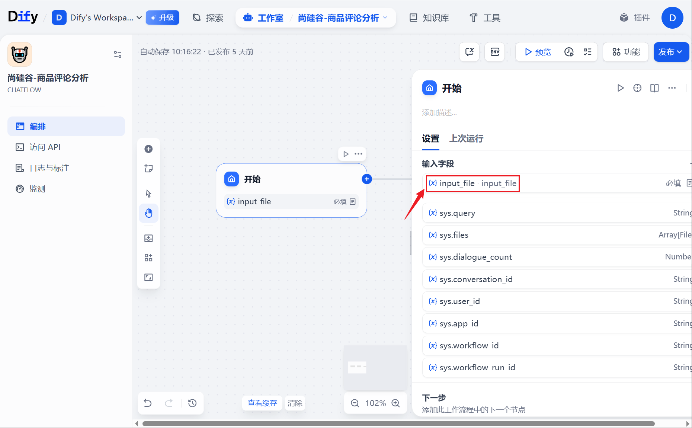

#### 2.测试


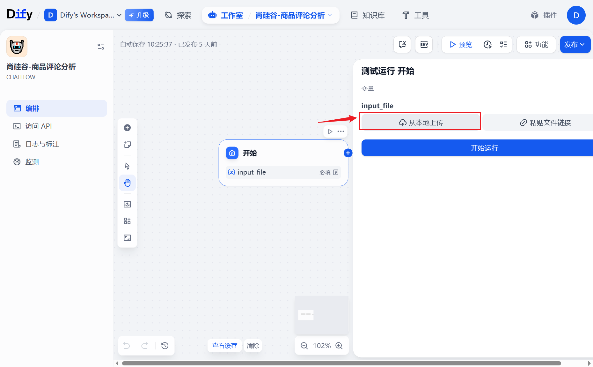

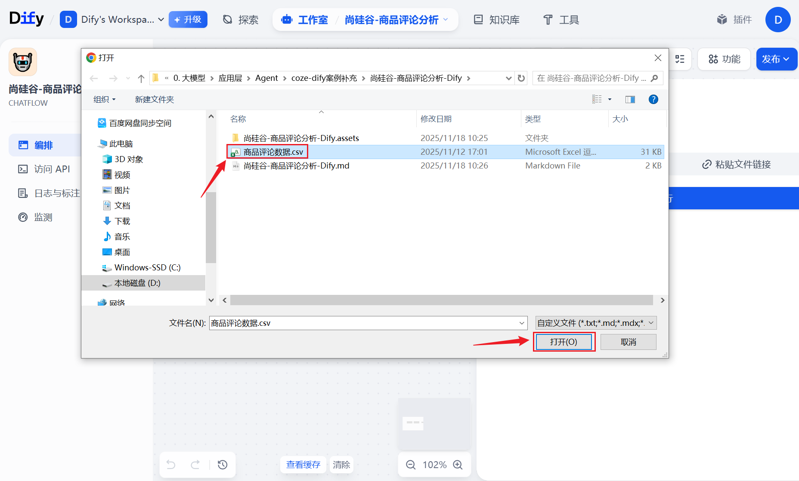

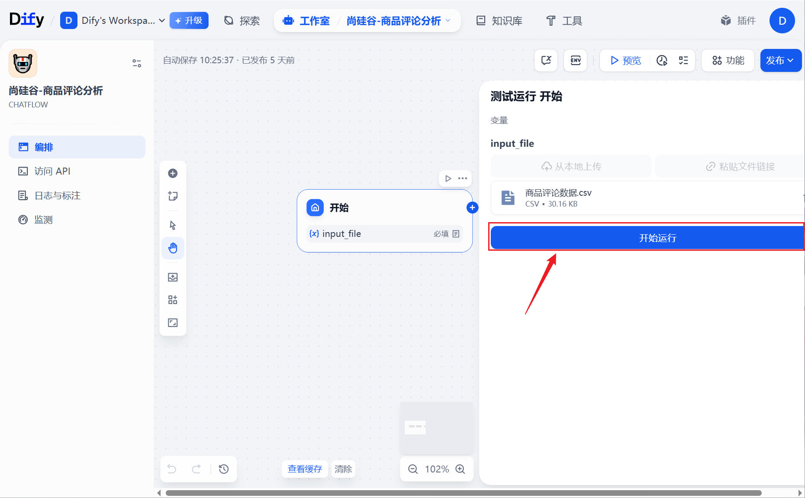


##### 1.输入

```json
{
  "input_file": {
    "dify_model_identity": "__dify__file__",
    "extension": ".csv",
    "filename": "商品评论数据.csv",
    "id": null,
    "mime_type": "text/csv",
    "related_id": "d3b34615-7415-4729-9eeb-eaa6f2c9080b",
    "remote_url": "https://upload.dify.ai/files/d3b34615-7415-4729-9eeb-eaa6f2c9080b/file-preview?timestamp=1763432793&nonce=36c102687f05da6426ae23390cc8ab68&sign=GIAZi-4ALWbg1brpjM_vD5X3v_9LFgyzk8VRcyNtOfU%3D",
    "size": 30881,
    "tenant_id": "37b50949-93f9-41aa-8b8e-0f6791bc6deb",
    "transfer_method": "local_file",
    "type": "document",
    "url": "https://upload.dify.ai/files/d3b34615-7415-4729-9eeb-eaa6f2c9080b/file-preview?timestamp=1763432811&nonce=c38f4b7d9b51e0b1a7cf032be3afc1af&sign=UeGwc2sRny-kluJEQv0SGVdy-YwI3-JD9IKGDKe41pU%3D"
  },
  "sys.app_id": "fd329a83-eefc-4ced-859b-f7206f0172c7",
  "sys.conversation_id": "428b834d-d6dc-4532-9ebb-36732952f503",
  "sys.dialogue_count": 1,
  "sys.files": [],
  "sys.query": "",
  "sys.user_id": "51b0ee4a-06cc-478d-a205-5e61fe58aee7",
  "sys.workflow_id": "6fce1902-0e70-4bcf-bfb4-7726e5785c09",
  "sys.workflow_run_id": "6f0af811-e463-42b7-a328-0e0820e95687"
}
```

##### 2.输出

```json
{
  "input_file": {
    "dify_model_identity": "__dify__file__",
    "extension": ".csv",
    "filename": "商品评论数据.csv",
    "id": null,
    "mime_type": "text/csv",
    "related_id": "d3b34615-7415-4729-9eeb-eaa6f2c9080b",
    "remote_url": "https://upload.dify.ai/files/d3b34615-7415-4729-9eeb-eaa6f2c9080b/file-preview?timestamp=1763432793&nonce=36c102687f05da6426ae23390cc8ab68&sign=GIAZi-4ALWbg1brpjM_vD5X3v_9LFgyzk8VRcyNtOfU%3D",
    "size": 30881,
    "tenant_id": "37b50949-93f9-41aa-8b8e-0f6791bc6deb",
    "transfer_method": "local_file",
    "type": "document",
    "url": "https://upload.dify.ai/files/d3b34615-7415-4729-9eeb-eaa6f2c9080b/file-preview?timestamp=1763432811&nonce=0e620a839a092e0085e23a982041f7be&sign=7uAkQkL6uF5kT3aUfSi5UtM0dDXXM99DY5ny5hEcNIA%3D"
  },
  "sys.app_id": "fd329a83-eefc-4ced-859b-f7206f0172c7",
  "sys.conversation_id": "428b834d-d6dc-4532-9ebb-36732952f503",
  "sys.dialogue_count": 1,
  "sys.files": [],
  "sys.query": "",
  "sys.user_id": "51b0ee4a-06cc-478d-a205-5e61fe58aee7",
  "sys.workflow_id": "6fce1902-0e70-4bcf-bfb4-7726e5785c09",
  "sys.workflow_run_id": "6f0af811-e463-42b7-a328-0e0820e95687"
}
```

### 3.文档提取器

#### 1.配置

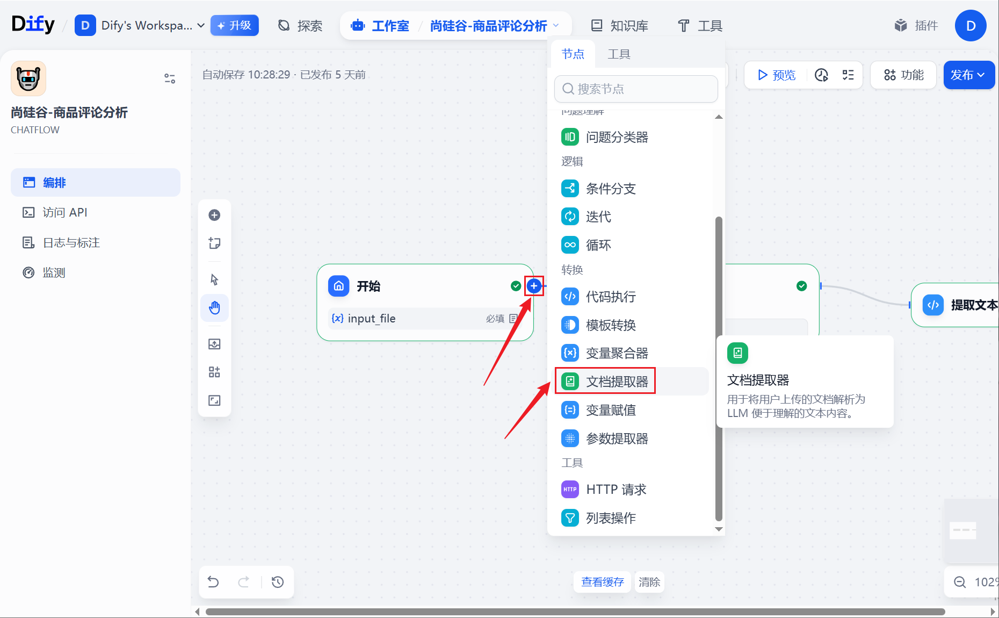

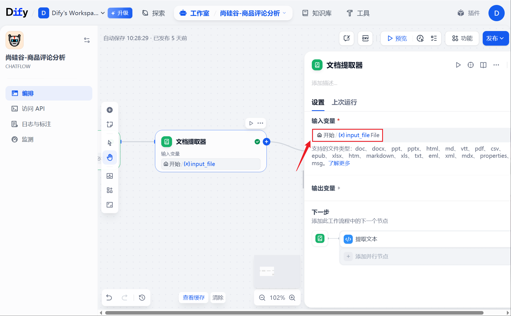

#### 2.测试

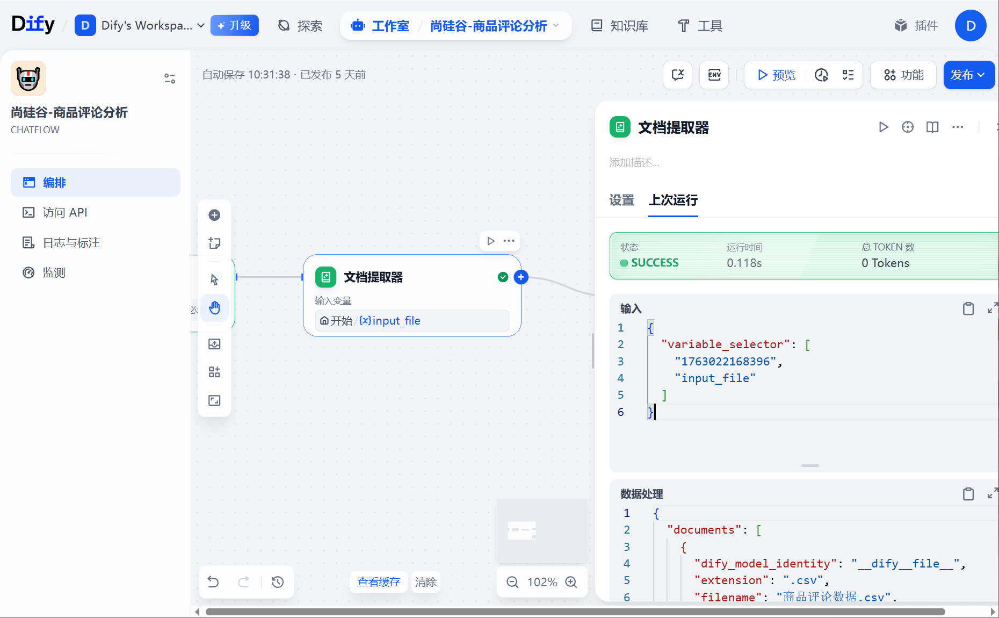


##### 1.数据处理

当前节点的输入没有关键信息，文档信息在数据处理下

```json
{
  "documents": [
    {
      "dify_model_identity": "__dify__file__",
      "extension": ".csv",
      "filename": "商品评论数据.csv",
      "id": null,
      "mime_type": "text/csv",
      "related_id": "d3b34615-7415-4729-9eeb-eaa6f2c9080b",
      "remote_url": "https://upload.dify.ai/files/d3b34615-7415-4729-9eeb-eaa6f2c9080b/file-preview?timestamp=1763432793&nonce=36c102687f05da6426ae23390cc8ab68&sign=GIAZi-4ALWbg1brpjM_vD5X3v_9LFgyzk8VRcyNtOfU%3D",
      "size": 30881,
      "tenant_id": "37b50949-93f9-41aa-8b8e-0f6791bc6deb",
      "transfer_method": "local_file",
      "type": "document",
      "url": "https://upload.dify.ai/files/d3b34615-7415-4729-9eeb-eaa6f2c9080b/file-preview?timestamp=1763433098&nonce=198a0f14c0192f3cfa7a7abbf8934c52&sign=R7TlW5NMkWCE03VrdSuw9mkoBwPwIzrVd7yS1uV8ES4%3D"
    }
  ]
}
```

##### 2.输出

```json
{
  "text": "| product_title：VIZIO 32 inch D-Series HD 720p Smart TV with Apple AirPlay and Chromecast Built-in, Alexa Compatibility, D32h-J, 2022 Model |\n| ----------------------------------------------------------------------------------------------------------------------------------------- |\n| asin：B094RKDNMZ |\n| product_link：https://www.amazon.com/-/zh/dp/B094RKDNMZ/ref=sims_dp_d_dex_popular_subs_t1_v6_d_sccl_2_6/145-6930307-1678620?pd_rd_w=xQWmL&content-id=amzn1.sym.7e9f1c55-8db7-45c5-bfbf-adf1bc16de34&pf_rd_p=7e9f1c55-8db7-45c5-bfbf-adf1bc16de34&pf_rd_r=3NVT4J6HG1720G4Z1QMH&pd_rd_wg=Rgbjt&pd_rd_r=ada5fa29-2a7d-44db-99fc-642b1a6d2041&pd_rd_i=B094RKDNMZ&th=1 |\n| image_url：https://m.media-amazon.com/images/I/81qFhtzh5KL._AC_SX679_.jpg |\n| crawling_time：2024-11-22 15:43:57 |\n| 评论星级统计： |\n| 1星评论数量：58 |\n| 2星评论数量：19 |\n| 3星评论数量：23 |\n| 总评论数量：100 |\n| rating | title | content | date | verified |\n| 1.0 |  | I will never purchase a TV again from Amazon or Vizio. The customer service is horrible when the TV stops working. I tried to get it returned to Amazon. They said their days had passed for me to get it returned to them. I purchased it on October 25 And it stopped working on December 22. I was then redirected to Vizio. She had me do the check on the TV. We spent about 30 to 45 minutes doing this. Unplugging it plugging it back using the remote we did all those things she had me go find the manual turn off and turn on. It’s so far in the back I couldn’t reach it because I can’t hardly walk , I told her I had to use a wheelchair or walker to get to the TV because I’m non-amatory. You would think she would have some understanding about that. Oh no. She said in order for me to return the phone I’ll get some service I had to go through the walk-through and try to see if I can get the TV to work. I called the bureau of business and I registered a complaint about Vizio and their poor service. I told her I still had the box to the TV that I would return it and its original box. If she would either send me a new I called the bureau of business and I registered a complaint about Vizio and their poor service. I told her I still had the box to the TV that I would return it and it’s original box. If she would either send me a new TV or send me my money back . Oh no, she couldn’t do that. They are the worst company in the world and Amazon service has gone down the toilet. I’m thinking about not doing any more purchasing with Amazon either. | Reviewed in the United States on December 22, 2023 | True |\n| 3.0 |  | I needed an inexpensive small TV for the garage and chose the Vizio 32\", So far, two issues: (1) image brightness is uneven across the screen. There are three bright spots in the upper middle part of the screen and my eyes seem to focus on them. No playing with the controls changes this problem. (2) the TV was assembled with a defect; the plastic border surrounding the image area was glued on at the op (slightly curved framework) without being fully pressed down. So the bright backup light shines through a narrow gap, maybe 1/16 inch wide in the top middle of the TV. I covered it with black electrical tape to hide the defect and stop the light from showing. Not very impressive, even for the modest cost. But it does work, so it is not a total loss. | Reviewed in the United States on November 11, 2023 | True |\n| 3.0 |  | This is the 1st time I've purchased a Vizio television. The screws don't fit--have to get smaller diameter screws. Never had that problem before. 😕 | Reviewed in the United States on November 4, 2024 | True |\n| 3.0 |  | Great color but terrible to try to set up Need a PHD in tv technology My son-inlaw is an Engineer and he had a hard time with it Every time you turned it on ,you had to start all over setting it up. Just not user friendly for older people it is probably a very good Tv just not for older people to try and set up. | Reviewed in the United States on August 26, 2024 | True |\n| 3.0 |  | I like it but too big for me! Not sage for my animals or me! | Reviewed in the United States on September 9, 2024 | True |\n| 3.0 |  | I bought this TV for my cats so they can watch cat TV on youtube while I'm at work. Unfortunately this TV has a super annoying \"are you still watching\" feature that I can't for the life of me figure out how to turn off. I can't find it in the manual and I can't find it flipping through menus. Every time I come home the video is paused and when you hit \"yes\" sometimes it plays fine, sometimes you get the loading circle that never ends. I'm 95% positive this is a TV feature and not a youtube feature because my bedroom TV doesn't pause on the cat videos and my boyfriend falls asleep to youtube videos all the time and they also don't pause. | Reviewed in the United States on April 23, 2024 | True |\n| 2.0 |  | It’s a decent tv when it works. I don’t use it often but when I do 50% of the time it’s not working or having trouble connecting to the Wi-Fi. I have other devices that are connected to my Wi-Fi and even when those aren’t it’s not working. The phone app also does not work, I have had to reset the app 3 times in the few times I’ve had it for 2 months. If I used it more often I would have realized the problem earlier and returned it. I bought an insignia TV about the same price and size a couple years ago and I haven’t had any issues. | Reviewed in the United States on October 1, 2024 | True |\n| 2.0 |  | I bought this particular TV because it was advertised as being able to be operated without internet. Nowhere in the product description is the requirement that the operation of the TV requires linking the TV with a VISO account which must be done with a router connected to the internet. Additionally, there was no access to the operating manual prior to purchase and I never received an actual manual. Possibly one is available on line, but I have not been able to find one. While I can access the internet via hot spot, all internet access must go through the VISO app. The picture is adequate and I can use an antenna to access programming. So I have rated this product a 2. I would never have purchased this item had its specs been honestly and accurately presented. I am only keeping it because its far too much trouble to return and repurchase a more suitable devise. | Reviewed in the United States on August 5, 2024 | True |\n| 3.0 |  | This tv is great! However we purchased it specifically for its Bluetooth & wireless capabilities, for our rv. The Bluetooth enabled in this divice CAN NOT pair headphones, or external wireless speakers. It can ONLY read wifi connection needed for the pre-installed apps to work. It only comes with the TV, remote with batteries and stand, no cables are provided to connect to external audio. I gave 3 stars for false advertising of its Bluetooth when \"wifi connective\" would have been spot on and accurate. I'm old, so I did have the cables I needed.. .at home, miles and miles away. | Reviewed in the United States on March 14, 2024 | True |\n| 3.0 |  | Bought this for a game room, but it was not setup for Bluetooth capable for wireless headphones for gaming system or gaming chair. | Reviewed in the United States on June 24, 2024 | True |\n| 3.0 |  | Sound isn't the greatest, you'll probably need a sound bar depending on what you use the tv for. I'm using it for my toddlers play area so not too concerned about the sound. Color/ screen options aren't the greatest either. Would prefer to have a voice to search button on the remote, and maybe even a Disney plus or YouTube button but all it has is Netflix, Sling, prime video, Redbox, iHeart radio and Crackle buttons at the top. I probably would NOT repurchase this tv if i had to, I would try another brand. | Reviewed in the United States on January 4, 2024 | True |\n| 3.0 |  | Brought this because my last tv went out and this is the worst tv ever it always freezes and it has less apps available than what the Roku brand offers don’t buy | Reviewed in the United States on May 28, 2024 | True |\n| 3.0 |  | Can't complain too much for what I payed. Not the best picture. No matter how much I adjusted the settings, could'nt get good picture. All that shadowing and spotty pixels. It's a bedroom TV so I'll leave it at that. | Reviewed in the United States on April 18, 2024 | True |\n| 3.0 |  | Not bad for the money. Only issue I have is sometimes when it is trying to find channels it will just lock up. You then have to turn on/off to get it to work again. Also, it does not find channels well for use. | Reviewed in the United States on March 5, 2024 | True |\n| 3.0 |  | Good Lil tv but always losses wifi connection in between uses nice picture tho | Reviewed in the United States on May 16, 2024 | True |\n| 1.0 |  | I need to connect the TV to the stand, but it didn’t come with any screws. I’ve searched the bags and box multiple times. I tried to guess the size and purchased the wrong ones. Becoming a bit of a headache.  Update: the TV also doesn’t work. It’s extremely slow and doesn’t really load anything, even being connected to the internet. I’m concerned I may have gotten a unit that was previously returned because it didn’t work. There was no plastic on the screen like new TVs normally have. And as mentioned, the screws were missing.  I’m in the process of returning the TV. Meanwhile, we have purchased a LG from Walmart instead and it’s up and running smoothly. | Reviewed in the United States on October 19, 2024 | True |\n| 3.0 |  |  | Reviewed in the United States on April 4, 2024 | True |\n| 3.0 |  | For some reason this doesn't seem like its 32\". Idk why but it looks smaller than the 32\" roku I had. But either way still does the job. Just wish it wasn't so expensive. | Reviewed in the United States on February 13, 2024 | True |\n| 2.0 |  | Menu screens takes days to display. Awful experience will return for tcl roku tv. | Reviewed in the United States on September 30, 2024 | True |\n| 3.0 |  | Tv works fine. But we received one without any screen protection and it was scratched straight out of the box. Also the power cord is shorter than expected and we had to use an extension cord. | Reviewed in the United States on January 5, 2024 | True |\n| 3.0 |  | HAS ALL THE BELLS AND WHISTLES,,APPLE ALEXA,MOVIES,LIVE,,EVERYTHING; IT ALSO HAS A FRONT FACING CAMERA THAT SCANS THE ROOM IT IS LOCATED IN... | Reviewed in the United States on February 13, 2024 | True |\n| 2.0 |  | Perhaps we simply got a 'lemon,' but we experienced the same WiFi issues other reviewers have noted.  This T.V. takes forever to connect, and routinely loses signal/requires a new login.  Oh, and the Vizio menu is a bloated mess that creates massive lag.  Obviously, none of the above matters if you are simply using this as a monitor or pairing it with something like an Apple TV, but if the goal is to have a functioning television right out of the box, I'd look elsewhere. | Reviewed in the United States on March 31, 2024 | True |\n| 3.0 |  | My mistake was to send this to another country and this tv only functions in USA or Canada | Reviewed in the United States on March 12, 2024 | True |\n| 2.0 |  | I NEVER TOLD ANYONE TO PUT REFUND ON MY ACCOUNT.I AWAYS WANT IT GOING BACK TO MY CARD.. THANKS | Reviewed in the United States on August 18, 2024 | True |\n| 1.0 |  | Poor quality. Picture often froze one day before TV shut down and would not turn back on until the next day. INPUT &APPS function not stable. Worked when I first got it, then I had to do a factory reset to get it working again, but that only lasted a short time. Price was right but performance is poor. | Reviewed in the United States on October 21, 2024 | True |\n| 3.0 |  | Screen is washed out somewhat when viewed from the side. its good when viewed straight forward. | Reviewed in the United States on November 29, 2023 | True |\n| 3.0 |  | Did not like the picture quality | Reviewed in the United States on December 28, 2023 | True |\n| 1.0 |  | This TV is junk. It worked for a couple of months and then just quit working. It won’t pick up the wifi at all anymore. This is the second Vizio TV I’ve bought in the last two years that doesn’t work properly. I’m not sure what happened, but clearly Vizio quality control has gone way downhill. I won’t ever buy this brand again. | Reviewed in the United States on October 7, 2024 | True |\n| 1.0 |  | Went to mount this TV and the screws that came with it broke in half. Couldn't even get the broken pieces out of the screw holes. Luckily this happened early enough in the process that we had 2 out of the 4 screw holes without broken screws and mounted it with only 2 screws that came with the mount instead of the TV supplied screws. Very disappointed! | Reviewed in the United States on October 6, 2024 | True |\n| 3.0 |  | Great Price if you only watch Apps! Unable to navigate antennae channels | Reviewed in the United States on November 11, 2023 | True |\n| 2.0 |  | The remote doesn't work. Tried new batteries but it won't allow me to set up the TV. So now I have a television that can't be programmed and a remote that doesn't work on my TV. I ordered a universal remote. But without the remote I can't set it up or get rid of the annoying vizio label on the corner of the screen that pops up every thirty seconds. I normally have good things to say about vizio but you guys dropped the ball. What happened to quality checks? | Reviewed in the United States on January 9, 2024 | True |\n| 2.0 |  | i cannot get the vizio to recognize my wifi for the \"smart tv. probably my stupidity? naw. i'm pretty tech savvy. i've been too down to keep trying. maybe tomorrow will be a better day. :) i cannot therefore recommend. this tv. | Reviewed in the United States on April 28, 2024 | True |\n| 1.0 |  | I could never get my disney plus app to work nor my peacock app. Will likely now need to buy something to cast my apps. | Reviewed in the United States on November 8, 2024 | True |\n| 1.0 |  | The volume is absolutely horrible on this TV. It doesn't match the level. I have to turn it up to 100 to get Mediocre sound. It's like it's still at 20. Why is it so low. This product should have been tested by people that know better. I'm not sure what ppl here are reviewing for them to give this product a four or five star. It's worth a one star from me. | Reviewed in the United States on September 2, 2024 | True |\n| 2.0 |  | When I purchased this it said it was compatible with Alexa. I have a similar model in a smaller size and it’s great to hook up other speakers. This model has no Bluetooth so I cannot hook up external speakers. I will be returning. Very disappointing. | Reviewed in the United States on March 6, 2024 | True |\n| 2.0 |  | Every other television in the he house as well as Alexa is connected to the Internet and this TV refuses to connect even when connected directly. Vizio used to be better than this. | Reviewed in the United States on April 25, 2024 | True |\n| 1.0 |  | Vizio TVs do NOT work natively with Apps like Fox Nation, Curiosity Stream, Brilliant, and many more streaming services. Internet speeds are over 300mbs, and the TV is 14\" above the router. The streaming services buffer terribly constantly, often times stopping completely. Contacted support, for both VIZIO and the Streaming Services, and no one is able to provide a fix. We had to purchase and connect a Chromecast and Firestick to the HDMI inputs in order to stream our favorite services. | Reviewed in the United States on August 4, 2024 | True |\n| 1.0 |  | The operating system is slow and glitchy and the range for WiFi is terrible. This tv replaced a cheaper Hisense model and I'm terribly disappointed.. I wish I had tried it before the return window closed as this TV is terrible to the point I'll toss it in the garage or give it away... Just terrible! | Reviewed in the United States on August 31, 2024 | True |\n| 1.0 |  | Tried several different ways to set up this tv including the mobile. After two days of trying to set it up, I threw the remote control through at the TV and it smashed the screen. Oh by the way, I took great joy in this but now I cannot return the unit. | Reviewed in the United States on August 29, 2024 | True |\n| 2.0 |  | Easy set up but tv pops on, on its on, even when turned off with remote, have to unplug to keep off | Reviewed in the United States on May 16, 2024 | True |\n| 2.0 |  | Tv are really small. I bought a total of 3 and 2 of them went out just blank screen but the volume was still working. I wouldn't recommend | Reviewed in the United States on April 17, 2024 | True |\n| 1.0 |  | This TV is one of the worst I've owned. Freezes all the time and has to go back to home to reset then have to redo everything to get back to the show I was watching because none of the buttons on the remote are for the popular streaming networks except for Netflix. I have had more than 10 moments where I've wanted to hurl the remote into it. | Reviewed in the United States on July 17, 2024 | True |\n| 1.0 |  | I had one tv and it stopped working after about a week. It loses connection to WiFi and then when you power up it just spins and never relaunches. So you have to reset the tv and go through setup al over again. I was then sent a replacement tv, same exact problem, except it happened in about two days. | Reviewed in the United States on August 5, 2024 | True |\n| 2.0 |  | Vizio is selling a product that only works on a 3G network, well Spectrum is a 5G network and it doesn’t work. Buyer beware in future. No wonder they are on sale | Reviewed in the United States on March 17, 2024 | True |\n| 2.0 |  | Was misled by info that said steaming. Could have bought a Roku for my older unit. | Reviewed in the United States on April 6, 2024 | True |\n| 1.0 |  | I bought this TV for my son go use with Xbox. It was on sale during the prime day deals. And the hdmi port didn't work. | Reviewed in the United States on August 23, 2024 | True |\n| 2.0 |  | Corner of the TV is cracked. Remote smells like it was stored in an ash tray with a hundred old cigarette butts. | Reviewed in the United States on March 7, 2024 | True |\n| 1.0 |  | Will not stay connected despite excellent signal. Biggest piece of junk ever owned in 54 years. | Reviewed in the United States on October 8, 2024 | True |\n| 1.0 |  | Purchase this TV from Amazon and it died after 11 months. Tried to get help from the manufacturer and they told me that Amazon sold me a TV from an unauthorized dealer. Neither Vizio or Amazon would do anything about it. | Reviewed in the United States on July 21, 2024 | True |\n| 1.0 |  | This television only works in the United States. Not supported in any other region. Do not buy if you are in another country. Horrible. | Reviewed in the United States on August 28, 2024 | True |\n| 1.0 |  | It’s too confusing for her. So I’m returning the product. | Reviewed in the United States on September 26, 2024 | True |\n| 2.0 |  | This tv has many issues. It is very slow and loses internet connection for no reason. It also makes it difficult to just use an antenna | Reviewed in the United States on February 15, 2024 | True |\n| 1.0 |  | This TV is an excuse to make you sign up for apps and accounts that you dont want. I dont want a relationship with Visio and its advertisers, I just want to watch TV. They REQUIRED making a Visio account and putting apps on my phone and outright lied about the ability to web browse. No more visio for me | Reviewed in the United States on June 29, 2024 | True |\n| 1.0 |  | Could not get it to connect to the WiFi. Returned | Reviewed in the United States on October 16, 2024 | True |\n| 1.0 |  | I’ve had this tv for two months for use in my upstairs bedroom. At least half the time it continually freezes and has long gaps before restarting. I’ve never had issues with other tvs in my bedroom. It’s incredibly frustrating as we stream everything and can’t watch this tv often. | Reviewed in the United States on June 3, 2024 | True |\n| 1.0 |  | Shipping was so fast, but when i open the item, it glass was broken. So sad and disappointed. | Reviewed in the United States on September 11, 2024 | True |\n| 1.0 |  | This TV will not stay on the input that is selected and defaults back to their own channel ever time it’s powered off and back on…VERY annoying | Reviewed in the United States on August 21, 2024 | True |\n| 2.0 |  | Worked great for the first two months I had it. Was simple to use and set up but has some major bugs. After two months it is constantly turning itself on and off and restarting itself over and over. I searched the web saw this was a common issue and tried all the tricks to fix this but nothing has helped. Its such a waste to just get rid of a new tv but I don't even know what to do anymore. Such a major inconvenience. I got to enjoy it for such a short period of time | Reviewed in the United States on September 7, 2022 | True |\n| 1.0 |  | This tv is not ALEXA compatible WE tried and tried and tried Also when you turn it in you have to go into the side bar and put in Live tv it if you want it to come on Also that remote is weird If you want to change a channel on the remote a little thing comes up and you have to put the numbers in then press down for OK I dont like it There is no V on the remote I tried both apps for ALexa and they dont work | Reviewed in the United States on February 20, 2024 | True |\n| 1.0 |  | Received this TV today and tried to connect to WiFi for about 2 hours and it kept saying “no network detected”. All other devices in my home are connected and I rebooted both TV and router several times so I had to return this. | Reviewed in the United States on July 10, 2024 | True |\n| 2.0 |  | Tv started out good. Just needed something for a spare room . Now I constantly have to unplug and re plug to get it to work and even then it’s a gamble. Occasionally it won’t stay internet connected (even though everything else does) and it’s constantly resetting itself and I have ti log back in to every app again. Last 4 days I’ve had to log back into Hulu everyday for what? It also constantly freezes up. It’s a cheap price but I’m not even sure it’s worth the trouble really. | Reviewed in the United States on October 9, 2022 | True |\n| 2.0 |  | Received tv box was destroyed terribly, looked as though that has kicked it all over the truck. We did pull the the TV out and check it. No damage seen hope it works since it a Christmas present. | Reviewed in the United States on November 16, 2023 | True |\n| 1.0 |  | Unfortunately we had to restart the tv several times because it kept getting stuck in the loading updates phase. After that finally worked the apps kept closing once we opened them. So we had to turn off the tv and again unplug it for 5-10 seconds. It’s a hassle to return so I will simply warn others not to buy. | Reviewed in the United States on May 26, 2024 | True |\n| 1.0 |  | Stopped recognizing WiFi network after two months - tried every option on Vizios website to troubleshoot the issue and it was never able to find our WiFi. I’m not really a tech savvy person but I don’t think anyone should have this much trouble trying to connect their tv to WiFi. Seems like a common problem with their tvs that doesn’t seem like it’ll be fixed. Maybe just try a different brand | Reviewed in the United States on April 5, 2024 | True |\n| 1.0 |  | TV connected to Wifi once, attempted to update software and stopped dead in its tracks. Never could connect to WiFi after that.  Product support was clueless. He told me crazy stuff like we don't support your 5G router and or its WPA 3 security. That's nonsense. The router down grades protocols to support 2G and WPA 2. If it didn't none of the older devices in my house would work.  I guess I got what I paid for. It was cheap. And now its on the trash heap. | Reviewed in the United States on January 29, 2024 | True |\n| 2.0 |  | The remote control is designed badly. Channels are way at the bottom and not easily entered with one hand. The button for returning to the previous channel is under the button that takes you out of the mode you're in so constantly having to change the mode back to TV. Every once in awhile the whole think just goes blank. No sound no picture and the only way to fix it is to unplug it. | Reviewed in the United States on July 1, 2022 | True |\n| 1.0 |  | This is the worst TV I have ever owned. It takes forever when you try to search for anything. It sometimes cuts off for no reason. I've had days where it won't even start an app. It just goes black and after about a minute it goes back to the home screen, never even opening the app. Please do not waste your money on this TV | Reviewed in the United States on March 10, 2024 | True |\n| 1.0 |  | Purchase tv to my surprise the tv is region locked . The Home Screen keep saying Vizio Home not available in your region. Save your money buy another brand. | Reviewed in the United States on June 2, 2024 | True |\n| 1.0 |  | El producto no esta programado para funcinar fuera de estados unidos. esto no se encuentra en la descripcion | Reviewed in the United States on July 1, 2024 | True |\n| 3.0 |  | This TV has NO ethernet port but in the description it claims to have ethernet connetivity 32 inch, 720p model | Reviewed in the United States on April 17, 2022 | True |\n| 1.0 |  | La pantalla llegó rota un | Reviewed in the United States on August 7, 2024 | True |\n| 1.0 |  | I purchased this television less than two months ago and it’s already broke | Reviewed in the United States on July 13, 2024 | True |\n| 3.0 |  | No ESPN plus app market isn’t very good | Reviewed in the United States on July 18, 2022 | True |\n| 1.0 |  | Was impossible to set up, and they charge for customer service! | Reviewed in the United States on June 26, 2024 | True |\n| 1.0 |  | I did not receive a remote for this tv | Reviewed in the United States on June 26, 2024 | True |\n| 3.0 |  | I bought this tv as a gift but the recipient informed me that it arrived without a remote. I’m so disappointed. | Reviewed in the United States on December 18, 2021 | True |\n| 1.0 |  | Less than one week after installing a brand new \"VIZIO 32 inch D-Series HD 720p Smart TV\", the picture began to deteriorate so much that it appeared as if I was watching a very faint picture through a snowstorm! A TV repairman tried adjusting the picture controls, etc. but then said the problem was probably a defective picture tube. Aren't TVs bench tested before leaving the factory anymore? | Reviewed in the United States on November 17, 2023 | True |\n| 1.0 |  | I had to try three different 32 inch Vizio tv's and none of them worked. Instead of the company sending me a box to return the latest one, I have to give them proof that this tv is crap. I had great success before with other Vizio's but now I will NEVER buy from them again. I am out $158.00 and that is a lot of money. I am on a fixed income and still cannot believe this company pulls this on their customers. | Reviewed in the United States on April 24, 2023 | True |\n| 1.0 |  | Having MAJOR issues syncing this tv's WiFi with Cox Communication: not quite sure why! I've been trying for over a week! If I hadn't thrown the box away, this tv would have already been returned.... | Reviewed in the United States on February 23, 2024 | True |\n| 1.0 |  | no direction included. did not send remote xrt140 | Reviewed in the United States on July 20, 2024 | True |\n| 1.0 |  | El televisor que compré no es de 32 pulgadas es muy pequeño siento que están engañando las personas | Reviewed in the United States on May 12, 2024 | True |\n| 1.0 |  | This is a the first Vizio tv I HATED!!! It freezes constantly, internet doesn’t stay connected to the tv, very slow when turning on. This is the worst tv ever!!! | Reviewed in the United States on February 18, 2024 | True |\n| 1.0 |  | You can’t use this TV with a standard coaxial analog setup, as Vizio forces you to utilize WatchFree TV and it’s a terrible UI. We purchased this for our elderly Mom in a nursing home and had to return it. | Reviewed in the United States on January 2, 2024 | True |\n| 1.0 |  | Omg this tv is so bad the sound is terrible!! Is soooo small I don’t think so that is 32in no way!! Don’t wasted your money ! | Reviewed in the United States on February 20, 2024 | True |\n| 1.0 |  | Garbage. Don’t buy. | Reviewed in the United States on July 16, 2024 | True |\n| 1.0 |  | No speaker | Reviewed in the United States on July 12, 2024 | True |\n| 1.0 |  | shop best buy and get a real deal and on time shipping ... unlike this purchase .. late and more expensive than the toshiba tv I bought from best buy .... amazon is getting sloppy and not caring for their customers .... | Reviewed in the United States on December 14, 2023 | True |\n| 1.0 |  | Le salen rallas en la pantalla color verde | Reviewed in the United States on June 16, 2024 | True |\n| 1.0 |  | TV’s aren’t worth it. Can’t stay connected to wifi, slow AF, and quality is only good if I’m on the input with my Xbox! | Reviewed in the United States on March 12, 2024 | True |\n| 1.0 |  | No-good | Reviewed in the United States on June 14, 2024 | True |\n| 1.0 |  | Product description says Ethernet connectivity. There is no Ethernet. | Reviewed in the United States on March 19, 2024 | True |\n| 1.0 |  | I didn't like it I sent it back So where is my refund from tv  Thank u | Reviewed in the United States on March 9, 2024 | True |\n| 1.0 |  | We are having issues with this tv freezing mid show. Please advise | Reviewed in the United States on March 3, 2024 | True |\n| 1.0 |  | Not compatible with gaming nor quality picture creminded me of watching tv over ten years ago also super small for 60 buck more got 50” | Reviewed in the United States on January 17, 2024 | True |\n| 1.0 |  | It continues to just restart and so I went to do an exchange and stopped at the reviews. OMG....the first 10 were all a completely useless item ...how can this have such high ratings?? There should be compensation for all the wasted time of setup, making sure I was home for the delivery and now taking it somewhere to return it | Reviewed in the United States on May 24, 2022 | True |\n| 1.0 |  | Won't connect. Won't update. Can't use any of the smart TV features. Save your money. | Reviewed in the United States on January 31, 2024 | True |\n| 1.0 |  | One of the worst TV’s. Randomly shuts off. Won’t let me change inputs sometimes. Stuck on random screens. Tried to get a refund a little after a month of ordering and was told I couldn’t. DO NOT BUY. | Reviewed in the United States on January 26, 2023 | True |\n| 1.0 |  | We bought this TV November 2021 and it has now decided to stop connecting to the internet and keeps signing out of streaming services and freezing while playing. I may be in the minority, but I expect electronics to last over a year at least, not 9 months... | Reviewed in the United States on September 3, 2022 | True |\n| 1.0 |  | First the driver left this clear electronic device on my porch in the rain when I wasn't home. The setup was ok but after a few days the screen went green and had to reset the set and then a week later the screen went gray and went through another annoying process trying to fix that. Never again | Reviewed in the United States on June 5, 2022 | True |\n| 1.0 |  | We just bought a house and got this tv so I would fall asleep in the bedroom. I used it two times and now it’s got a blank screen. Powers on and screen stays blank. Just the tv nothing hooked up to it. I know electronics can fail but this is a hassle. Lemon Alert. | Reviewed in the United States on December 18, 2021 | True |\n"
}
```

##### 3.缓存管理

###### 1.查看缓存


变量缓存是以所属节点为单位组织的。

###### 2.删除缓存


点击任意变量，右侧会展示其缓存值，点击缓存右侧的图标即可删除。

### 4.提取文本

#### 1.配置

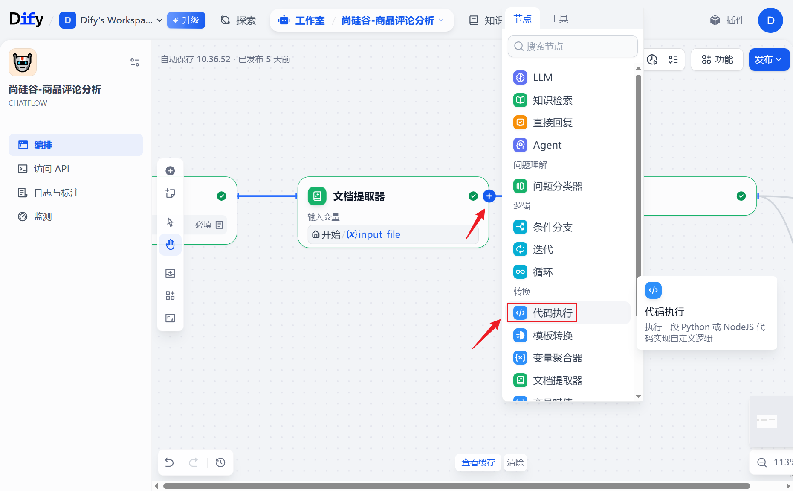


代码如下

```python
def main(text_arr: list):
    text = ''
    if isinstance(text_arr, list):
        text = text_arr[0]
    else:
        text = text_arr
    return {
        "text": text
    }
```

文档提取器的输出有时是`字符串`，有时是只有一个元素的`字符串数组`，当前节点的作用是在前者输出字符数组时将其处理为字符串。

#### 2.测试


##### 1.输入

```json
{
  "text_arr": "| product_title：VIZIO 32 inch D-Series HD 720p Smart TV with Apple AirPlay and Chromecast Built-in, Alexa Compatibility, D32h-J, 2022 Model |\n| ----------------------------------------------------------------------------------------------------------------------------------------- |\n| asin：B094RKDNMZ |\n| product_link：https://www.amazon.com/-/zh/dp/B094RKDNMZ/ref=sims_dp_d_dex_popular_subs_t1_v6_d_sccl_2_6/145-6930307-1678620?pd_rd_w=xQWmL&content-id=amzn1.sym.7e9f1c55-8db7-45c5-bfbf-adf1bc16de34&pf_rd_p=7e9f1c55-8db7-45c5-bfbf-adf1bc16de34&pf_rd_r=3NVT4J6HG1720G4Z1QMH&pd_rd_wg=Rgbjt&pd_rd_r=ada5fa29-2a7d-44db-99fc-642b1a6d2041&pd_rd_i=B094RKDNMZ&th=1 |\n| image_url：https://m.media-amazon.com/images/I/81qFhtzh5KL._AC_SX679_.jpg |\n| crawling_time：2024-11-22 15:43:57 |\n| 评论星级统计： |\n| 1星评论数量：58 |\n| 2星评论数量：19 |\n| 3星评论数量：23 |\n| 总评论数量：100 |\n| rating | title | content | date | verified |\n| 1.0 |  | I will never purchase a TV again from Amazon or Vizio. The customer service is horrible when the TV stops working. I tried to get it returned to Amazon. They said their days had passed for me to get it returned to them. I purchased it on October 25 And it stopped working on December 22. I was then redirected to Vizio. She had me do the check on the TV. We spent about 30 to 45 minutes doing this. Unplugging it plugging it back using the remote we did all those things she had me go find the manual turn off and turn on. It’s so far in the back I couldn’t reach it because I can’t hardly walk , I told her I had to use a wheelchair or walker to get to the TV because I’m non-amatory. You would think she would have some understanding about that. Oh no. She said in order for me to return the phone I’ll get some service I had to go through the walk-through and try to see if I can get the TV to work. I called the bureau of business and I registered a complaint about Vizio and their poor service. I told her I still had the box to the TV that I would return it and its original box. If she would either send me a new I called the bureau of business and I registered a complaint about Vizio and their poor service. I told her I still had the box to the TV that I would return it and it’s original box. If she would either send me a new TV or send me my money back . Oh no, she couldn’t do that. They are the worst company in the world and Amazon service has gone down the toilet. I’m thinking about not doing any more purchasing with Amazon either. | Reviewed in the United States on December 22, 2023 | True |\n| 3.0 |  | I needed an inexpensive small TV for the garage and chose the Vizio 32\", So far, two issues: (1) image brightness is uneven across the screen. There are three bright spots in the upper middle part of the screen and my eyes seem to focus on them. No playing with the controls changes this problem. (2) the TV was assembled with a defect; the plastic border surrounding the image area was glued on at the op (slightly curved framework) without being fully pressed down. So the bright backup light shines through a narrow gap, maybe 1/16 inch wide in the top middle of the TV. I covered it with black electrical tape to hide the defect and stop the light from showing. Not very impressive, even for the modest cost. But it does work, so it is not a total loss. | Reviewed in the United States on November 11, 2023 | True |\n| 3.0 |  | This is the 1st time I've purchased a Vizio television. The screws don't fit--have to get smaller diameter screws. Never had that problem before. 😕 | Reviewed in the United States on November 4, 2024 | True |\n| 3.0 |  | Great color but terrible to try to set up Need a PHD in tv technology My son-inlaw is an Engineer and he had a hard time with it Every time you turned it on ,you had to start all over setting it up. Just not user friendly for older people it is probably a very good Tv just not for older people to try and set up. | Reviewed in the United States on August 26, 2024 | True |\n| 3.0 |  | I like it but too big for me! Not sage for my animals or me! | Reviewed in the United States on September 9, 2024 | True |\n| 3.0 |  | I bought this TV for my cats so they can watch cat TV on youtube while I'm at work. Unfortunately this TV has a super annoying \"are you still watching\" feature that I can't for the life of me figure out how to turn off. I can't find it in the manual and I can't find it flipping through menus. Every time I come home the video is paused and when you hit \"yes\" sometimes it plays fine, sometimes you get the loading circle that never ends. I'm 95% positive this is a TV feature and not a youtube feature because my bedroom TV doesn't pause on the cat videos and my boyfriend falls asleep to youtube videos all the time and they also don't pause. | Reviewed in the United States on April 23, 2024 | True |\n| 2.0 |  | It’s a decent tv when it works. I don’t use it often but when I do 50% of the time it’s not working or having trouble connecting to the Wi-Fi. I have other devices that are connected to my Wi-Fi and even when those aren’t it’s not working. The phone app also does not work, I have had to reset the app 3 times in the few times I’ve had it for 2 months. If I used it more often I would have realized the problem earlier and returned it. I bought an insignia TV about the same price and size a couple years ago and I haven’t had any issues. | Reviewed in the United States on October 1, 2024 | True |\n| 2.0 |  | I bought this particular TV because it was advertised as being able to be operated without internet. Nowhere in the product description is the requirement that the operation of the TV requires linking the TV with a VISO account which must be done with a router connected to the internet. Additionally, there was no access to the operating manual prior to purchase and I never received an actual manual. Possibly one is available on line, but I have not been able to find one. While I can access the internet via hot spot, all internet access must go through the VISO app. The picture is adequate and I can use an antenna to access programming. So I have rated this product a 2. I would never have purchased this item had its specs been honestly and accurately presented. I am only keeping it because its far too much trouble to return and repurchase a more suitable devise. | Reviewed in the United States on August 5, 2024 | True |\n| 3.0 |  | This tv is great! However we purchased it specifically for its Bluetooth & wireless capabilities, for our rv. The Bluetooth enabled in this divice CAN NOT pair headphones, or external wireless speakers. It can ONLY read wifi connection needed for the pre-installed apps to work. It only comes with the TV, remote with batteries and stand, no cables are provided to connect to external audio. I gave 3 stars for false advertising of its Bluetooth when \"wifi connective\" would have been spot on and accurate. I'm old, so I did have the cables I needed.. .at home, miles and miles away. | Reviewed in the United States on March 14, 2024 | True |\n| 3.0 |  | Bought this for a game room, but it was not setup for Bluetooth capable for wireless headphones for gaming system or gaming chair. | Reviewed in the United States on June 24, 2024 | True |\n| 3.0 |  | Sound isn't the greatest, you'll probably need a sound bar depending on what you use the tv for. I'm using it for my toddlers play area so not too concerned about the sound. Color/ screen options aren't the greatest either. Would prefer to have a voice to search button on the remote, and maybe even a Disney plus or YouTube button but all it has is Netflix, Sling, prime video, Redbox, iHeart radio and Crackle buttons at the top. I probably would NOT repurchase this tv if i had to, I would try another brand. | Reviewed in the United States on January 4, 2024 | True |\n| 3.0 |  | Brought this because my last tv went out and this is the worst tv ever it always freezes and it has less apps available than what the Roku brand offers don’t buy | Reviewed in the United States on May 28, 2024 | True |\n| 3.0 |  | Can't complain too much for what I payed. Not the best picture. No matter how much I adjusted the settings, could'nt get good picture. All that shadowing and spotty pixels. It's a bedroom TV so I'll leave it at that. | Reviewed in the United States on April 18, 2024 | True |\n| 3.0 |  | Not bad for the money. Only issue I have is sometimes when it is trying to find channels it will just lock up. You then have to turn on/off to get it to work again. Also, it does not find channels well for use. | Reviewed in the United States on March 5, 2024 | True |\n| 3.0 |  | Good Lil tv but always losses wifi connection in between uses nice picture tho | Reviewed in the United States on May 16, 2024 | True |\n| 1.0 |  | I need to connect the TV to the stand, but it didn’t come with any screws. I’ve searched the bags and box multiple times. I tried to guess the size and purchased the wrong ones. Becoming a bit of a headache.  Update: the TV also doesn’t work. It’s extremely slow and doesn’t really load anything, even being connected to the internet. I’m concerned I may have gotten a unit that was previously returned because it didn’t work. There was no plastic on the screen like new TVs normally have. And as mentioned, the screws were missing.  I’m in the process of returning the TV. Meanwhile, we have purchased a LG from Walmart instead and it’s up and running smoothly. | Reviewed in the United States on October 19, 2024 | True |\n| 3.0 |  |  | Reviewed in the United States on April 4, 2024 | True |\n| 3.0 |  | For some reason this doesn't seem like its 32\". Idk why but it looks smaller than the 32\" roku I had. But either way still does the job. Just wish it wasn't so expensive. | Reviewed in the United States on February 13, 2024 | True |\n| 2.0 |  | Menu screens takes days to display. Awful experience will return for tcl roku tv. | Reviewed in the United States on September 30, 2024 | True |\n| 3.0 |  | Tv works fine. But we received one without any screen protection and it was scratched straight out of the box. Also the power cord is shorter than expected and we had to use an extension cord. | Reviewed in the United States on January 5, 2024 | True |\n| 3.0 |  | HAS ALL THE BELLS AND WHISTLES,,APPLE ALEXA,MOVIES,LIVE,,EVERYTHING; IT ALSO HAS A FRONT FACING CAMERA THAT SCANS THE ROOM IT IS LOCATED IN... | Reviewed in the United States on February 13, 2024 | True |\n| 2.0 |  | Perhaps we simply got a 'lemon,' but we experienced the same WiFi issues other reviewers have noted.  This T.V. takes forever to connect, and routinely loses signal/requires a new login.  Oh, and the Vizio menu is a bloated mess that creates massive lag.  Obviously, none of the above matters if you are simply using this as a monitor or pairing it with something like an Apple TV, but if the goal is to have a functioning television right out of the box, I'd look elsewhere. | Reviewed in the United States on March 31, 2024 | True |\n| 3.0 |  | My mistake was to send this to another country and this tv only functions in USA or Canada | Reviewed in the United States on March 12, 2024 | True |\n| 2.0 |  | I NEVER TOLD ANYONE TO PUT REFUND ON MY ACCOUNT.I AWAYS WANT IT GOING BACK TO MY CARD.. THANKS | Reviewed in the United States on August 18, 2024 | True |\n| 1.0 |  | Poor quality. Picture often froze one day before TV shut down and would not turn back on until the next day. INPUT &APPS function not stable. Worked when I first got it, then I had to do a factory reset to get it working again, but that only lasted a short time. Price was right but performance is poor. | Reviewed in the United States on October 21, 2024 | True |\n| 3.0 |  | Screen is washed out somewhat when viewed from the side. its good when viewed straight forward. | Reviewed in the United States on November 29, 2023 | True |\n| 3.0 |  | Did not like the picture quality | Reviewed in the United States on December 28, 2023 | True |\n| 1.0 |  | This TV is junk. It worked for a couple of months and then just quit working. It won’t pick up the wifi at all anymore. This is the second Vizio TV I’ve bought in the last two years that doesn’t work properly. I’m not sure what happened, but clearly Vizio quality control has gone way downhill. I won’t ever buy this brand again. | Reviewed in the United States on October 7, 2024 | True |\n| 1.0 |  | Went to mount this TV and the screws that came with it broke in half. Couldn't even get the broken pieces out of the screw holes. Luckily this happened early enough in the process that we had 2 out of the 4 screw holes without broken screws and mounted it with only 2 screws that came with the mount instead of the TV supplied screws. Very disappointed! | Reviewed in the United States on October 6, 2024 | True |\n| 3.0 |  | Great Price if you only watch Apps! Unable to navigate antennae channels | Reviewed in the United States on November 11, 2023 | True |\n| 2.0 |  | The remote doesn't work. Tried new batteries but it won't allow me to set up the TV. So now I have a television that can't be programmed and a remote that doesn't work on my TV. I ordered a universal remote. But without the remote I can't set it up or get rid of the annoying vizio label on the corner of the screen that pops up every thirty seconds. I normally have good things to say about vizio but you guys dropped the ball. What happened to quality checks? | Reviewed in the United States on January 9, 2024 | True |\n| 2.0 |  | i cannot get the vizio to recognize my wifi for the \"smart tv. probably my stupidity? naw. i'm pretty tech savvy. i've been too down to keep trying. maybe tomorrow will be a better day. :) i cannot therefore recommend. this tv. | Reviewed in the United States on April 28, 2024 | True |\n| 1.0 |  | I could never get my disney plus app to work nor my peacock app. Will likely now need to buy something to cast my apps. | Reviewed in the United States on November 8, 2024 | True |\n| 1.0 |  | The volume is absolutely horrible on this TV. It doesn't match the level. I have to turn it up to 100 to get Mediocre sound. It's like it's still at 20. Why is it so low. This product should have been tested by people that know better. I'm not sure what ppl here are reviewing for them to give this product a four or five star. It's worth a one star from me. | Reviewed in the United States on September 2, 2024 | True |\n| 2.0 |  | When I purchased this it said it was compatible with Alexa. I have a similar model in a smaller size and it’s great to hook up other speakers. This model has no Bluetooth so I cannot hook up external speakers. I will be returning. Very disappointing. | Reviewed in the United States on March 6, 2024 | True |\n| 2.0 |  | Every other television in the he house as well as Alexa is connected to the Internet and this TV refuses to connect even when connected directly. Vizio used to be better than this. | Reviewed in the United States on April 25, 2024 | True |\n| 1.0 |  | Vizio TVs do NOT work natively with Apps like Fox Nation, Curiosity Stream, Brilliant, and many more streaming services. Internet speeds are over 300mbs, and the TV is 14\" above the router. The streaming services buffer terribly constantly, often times stopping completely. Contacted support, for both VIZIO and the Streaming Services, and no one is able to provide a fix. We had to purchase and connect a Chromecast and Firestick to the HDMI inputs in order to stream our favorite services. | Reviewed in the United States on August 4, 2024 | True |\n| 1.0 |  | The operating system is slow and glitchy and the range for WiFi is terrible. This tv replaced a cheaper Hisense model and I'm terribly disappointed.. I wish I had tried it before the return window closed as this TV is terrible to the point I'll toss it in the garage or give it away... Just terrible! | Reviewed in the United States on August 31, 2024 | True |\n| 1.0 |  | Tried several different ways to set up this tv including the mobile. After two days of trying to set it up, I threw the remote control through at the TV and it smashed the screen. Oh by the way, I took great joy in this but now I cannot return the unit. | Reviewed in the United States on August 29, 2024 | True |\n| 2.0 |  | Easy set up but tv pops on, on its on, even when turned off with remote, have to unplug to keep off | Reviewed in the United States on May 16, 2024 | True |\n| 2.0 |  | Tv are really small. I bought a total of 3 and 2 of them went out just blank screen but the volume was still working. I wouldn't recommend | Reviewed in the United States on April 17, 2024 | True |\n| 1.0 |  | This TV is one of the worst I've owned. Freezes all the time and has to go back to home to reset then have to redo everything to get back to the show I was watching because none of the buttons on the remote are for the popular streaming networks except for Netflix. I have had more than 10 moments where I've wanted to hurl the remote into it. | Reviewed in the United States on July 17, 2024 | True |\n| 1.0 |  | I had one tv and it stopped working after about a week. It loses connection to WiFi and then when you power up it just spins and never relaunches. So you have to reset the tv and go through setup al over again. I was then sent a replacement tv, same exact problem, except it happened in about two days. | Reviewed in the United States on August 5, 2024 | True |\n| 2.0 |  | Vizio is selling a product that only works on a 3G network, well Spectrum is a 5G network and it doesn’t work. Buyer beware in future. No wonder they are on sale | Reviewed in the United States on March 17, 2024 | True |\n| 2.0 |  | Was misled by info that said steaming. Could have bought a Roku for my older unit. | Reviewed in the United States on April 6, 2024 | True |\n| 1.0 |  | I bought this TV for my son go use with Xbox. It was on sale during the prime day deals. And the hdmi port didn't work. | Reviewed in the United States on August 23, 2024 | True |\n| 2.0 |  | Corner of the TV is cracked. Remote smells like it was stored in an ash tray with a hundred old cigarette butts. | Reviewed in the United States on March 7, 2024 | True |\n| 1.0 |  | Will not stay connected despite excellent signal. Biggest piece of junk ever owned in 54 years. | Reviewed in the United States on October 8, 2024 | True |\n| 1.0 |  | Purchase this TV from Amazon and it died after 11 months. Tried to get help from the manufacturer and they told me that Amazon sold me a TV from an unauthorized dealer. Neither Vizio or Amazon would do anything about it. | Reviewed in the United States on July 21, 2024 | True |\n| 1.0 |  | This television only works in the United States. Not supported in any other region. Do not buy if you are in another country. Horrible. | Reviewed in the United States on August 28, 2024 | True |\n| 1.0 |  | It’s too confusing for her. So I’m returning the product. | Reviewed in the United States on September 26, 2024 | True |\n| 2.0 |  | This tv has many issues. It is very slow and loses internet connection for no reason. It also makes it difficult to just use an antenna | Reviewed in the United States on February 15, 2024 | True |\n| 1.0 |  | This TV is an excuse to make you sign up for apps and accounts that you dont want. I dont want a relationship with Visio and its advertisers, I just want to watch TV. They REQUIRED making a Visio account and putting apps on my phone and outright lied about the ability to web browse. No more visio for me | Reviewed in the United States on June 29, 2024 | True |\n| 1.0 |  | Could not get it to connect to the WiFi. Returned | Reviewed in the United States on October 16, 2024 | True |\n| 1.0 |  | I’ve had this tv for two months for use in my upstairs bedroom. At least half the time it continually freezes and has long gaps before restarting. I’ve never had issues with other tvs in my bedroom. It’s incredibly frustrating as we stream everything and can’t watch this tv often. | Reviewed in the United States on June 3, 2024 | True |\n| 1.0 |  | Shipping was so fast, but when i open the item, it glass was broken. So sad and disappointed. | Reviewed in the United States on September 11, 2024 | True |\n| 1.0 |  | This TV will not stay on the input that is selected and defaults back to their own channel ever time it’s powered off and back on…VERY annoying | Reviewed in the United States on August 21, 2024 | True |\n| 2.0 |  | Worked great for the first two months I had it. Was simple to use and set up but has some major bugs. After two months it is constantly turning itself on and off and restarting itself over and over. I searched the web saw this was a common issue and tried all the tricks to fix this but nothing has helped. Its such a waste to just get rid of a new tv but I don't even know what to do anymore. Such a major inconvenience. I got to enjoy it for such a short period of time | Reviewed in the United States on September 7, 2022 | True |\n| 1.0 |  | This tv is not ALEXA compatible WE tried and tried and tried Also when you turn it in you have to go into the side bar and put in Live tv it if you want it to come on Also that remote is weird If you want to change a channel on the remote a little thing comes up and you have to put the numbers in then press down for OK I dont like it There is no V on the remote I tried both apps for ALexa and they dont work | Reviewed in the United States on February 20, 2024 | True |\n| 1.0 |  | Received this TV today and tried to connect to WiFi for about 2 hours and it kept saying “no network detected”. All other devices in my home are connected and I rebooted both TV and router several times so I had to return this. | Reviewed in the United States on July 10, 2024 | True |\n| 2.0 |  | Tv started out good. Just needed something for a spare room . Now I constantly have to unplug and re plug to get it to work and even then it’s a gamble. Occasionally it won’t stay internet connected (even though everything else does) and it’s constantly resetting itself and I have ti log back in to every app again. Last 4 days I’ve had to log back into Hulu everyday for what? It also constantly freezes up. It’s a cheap price but I’m not even sure it’s worth the trouble really. | Reviewed in the United States on October 9, 2022 | True |\n| 2.0 |  | Received tv box was destroyed terribly, looked as though that has kicked it all over the truck. We did pull the the TV out and check it. No damage seen hope it works since it a Christmas present. | Reviewed in the United States on November 16, 2023 | True |\n| 1.0 |  | Unfortunately we had to restart the tv several times because it kept getting stuck in the loading updates phase. After that finally worked the apps kept closing once we opened them. So we had to turn off the tv and again unplug it for 5-10 seconds. It’s a hassle to return so I will simply warn others not to buy. | Reviewed in the United States on May 26, 2024 | True |\n| 1.0 |  | Stopped recognizing WiFi network after two months - tried every option on Vizios website to troubleshoot the issue and it was never able to find our WiFi. I’m not really a tech savvy person but I don’t think anyone should have this much trouble trying to connect their tv to WiFi. Seems like a common problem with their tvs that doesn’t seem like it’ll be fixed. Maybe just try a different brand | Reviewed in the United States on April 5, 2024 | True |\n| 1.0 |  | TV connected to Wifi once, attempted to update software and stopped dead in its tracks. Never could connect to WiFi after that.  Product support was clueless. He told me crazy stuff like we don't support your 5G router and or its WPA 3 security. That's nonsense. The router down grades protocols to support 2G and WPA 2. If it didn't none of the older devices in my house would work.  I guess I got what I paid for. It was cheap. And now its on the trash heap. | Reviewed in the United States on January 29, 2024 | True |\n| 2.0 |  | The remote control is designed badly. Channels are way at the bottom and not easily entered with one hand. The button for returning to the previous channel is under the button that takes you out of the mode you're in so constantly having to change the mode back to TV. Every once in awhile the whole think just goes blank. No sound no picture and the only way to fix it is to unplug it. | Reviewed in the United States on July 1, 2022 | True |\n| 1.0 |  | This is the worst TV I have ever owned. It takes forever when you try to search for anything. It sometimes cuts off for no reason. I've had days where it won't even start an app. It just goes black and after about a minute it goes back to the home screen, never even opening the app. Please do not waste your money on this TV | Reviewed in the United States on March 10, 2024 | True |\n| 1.0 |  | Purchase tv to my surprise the tv is region locked . The Home Screen keep saying Vizio Home not available in your region. Save your money buy another brand. | Reviewed in the United States on June 2, 2024 | True |\n| 1.0 |  | El producto no esta programado para funcinar fuera de estados unidos. esto no se encuentra en la descripcion | Reviewed in the United States on July 1, 2024 | True |\n| 3.0 |  | This TV has NO ethernet port but in the description it claims to have ethernet connetivity 32 inch, 720p model | Reviewed in the United States on April 17, 2022 | True |\n| 1.0 |  | La pantalla llegó rota un | Reviewed in the United States on August 7, 2024 | True |\n| 1.0 |  | I purchased this television less than two months ago and it’s already broke | Reviewed in the United States on July 13, 2024 | True |\n| 3.0 |  | No ESPN plus app market isn’t very good | Reviewed in the United States on July 18, 2022 | True |\n| 1.0 |  | Was impossible to set up, and they charge for customer service! | Reviewed in the United States on June 26, 2024 | True |\n| 1.0 |  | I did not receive a remote for this tv | Reviewed in the United States on June 26, 2024 | True |\n| 3.0 |  | I bought this tv as a gift but the recipient informed me that it arrived without a remote. I’m so disappointed. | Reviewed in the United States on December 18, 2021 | True |\n| 1.0 |  | Less than one week after installing a brand new \"VIZIO 32 inch D-Series HD 720p Smart TV\", the picture began to deteriorate so much that it appeared as if I was watching a very faint picture through a snowstorm! A TV repairman tried adjusting the picture controls, etc. but then said the problem was probably a defective picture tube. Aren't TVs bench tested before leaving the factory anymore? | Reviewed in the United States on November 17, 2023 | True |\n| 1.0 |  | I had to try three different 32 inch Vizio tv's and none of them worked. Instead of the company sending me a box to return the latest one, I have to give them proof that this tv is crap. I had great success before with other Vizio's but now I will NEVER buy from them again. I am out $158.00 and that is a lot of money. I am on a fixed income and still cannot believe this company pulls this on their customers. | Reviewed in the United States on April 24, 2023 | True |\n| 1.0 |  | Having MAJOR issues syncing this tv's WiFi with Cox Communication: not quite sure why! I've been trying for over a week! If I hadn't thrown the box away, this tv would have already been returned.... | Reviewed in the United States on February 23, 2024 | True |\n| 1.0 |  | no direction included. did not send remote xrt140 | Reviewed in the United States on July 20, 2024 | True |\n| 1.0 |  | El televisor que compré no es de 32 pulgadas es muy pequeño siento que están engañando las personas | Reviewed in the United States on May 12, 2024 | True |\n| 1.0 |  | This is a the first Vizio tv I HATED!!! It freezes constantly, internet doesn’t stay connected to the tv, very slow when turning on. This is the worst tv ever!!! | Reviewed in the United States on February 18, 2024 | True |\n| 1.0 |  | You can’t use this TV with a standard coaxial analog setup, as Vizio forces you to utilize WatchFree TV and it’s a terrible UI. We purchased this for our elderly Mom in a nursing home and had to return it. | Reviewed in the United States on January 2, 2024 | True |\n| 1.0 |  | Omg this tv is so bad the sound is terrible!! Is soooo small I don’t think so that is 32in no way!! Don’t wasted your money ! | Reviewed in the United States on February 20, 2024 | True |\n| 1.0 |  | Garbage. Don’t buy. | Reviewed in the United States on July 16, 2024 | True |\n| 1.0 |  | No speaker | Reviewed in the United States on July 12, 2024 | True |\n| 1.0 |  | shop best buy and get a real deal and on time shipping ... unlike this purchase .. late and more expensive than the toshiba tv I bought from best buy .... amazon is getting sloppy and not caring for their customers .... | Reviewed in the United States on December 14, 2023 | True |\n| 1.0 |  | Le salen rallas en la pantalla color verde | Reviewed in the United States on June 16, 2024 | True |\n| 1.0 |  | TV’s aren’t worth it. Can’t stay connected to wifi, slow AF, and quality is only good if I’m on the input with my Xbox! | Reviewed in the United States on March 12, 2024 | True |\n| 1.0 |  | No-good | Reviewed in the United States on June 14, 2024 | True |\n| 1.0 |  | Product description says Ethernet connectivity. There is no Ethernet. | Reviewed in the United States on March 19, 2024 | True |\n| 1.0 |  | I didn't like it I sent it back So where is my refund from tv  Thank u | Reviewed in the United States on March 9, 2024 | True |\n| 1.0 |  | We are having issues with this tv freezing mid show. Please advise | Reviewed in the United States on March 3, 2024 | True |\n| 1.0 |  | Not compatible with gaming nor quality picture creminded me of watching tv over ten years ago also super small for 60 buck more got 50” | Reviewed in the United States on January 17, 2024 | True |\n| 1.0 |  | It continues to just restart and so I went to do an exchange and stopped at the reviews. OMG....the first 10 were all a completely useless item ...how can this have such high ratings?? There should be compensation for all the wasted time of setup, making sure I was home for the delivery and now taking it somewhere to return it | Reviewed in the United States on May 24, 2022 | True |\n| 1.0 |  | Won't connect. Won't update. Can't use any of the smart TV features. Save your money. | Reviewed in the United States on January 31, 2024 | True |\n| 1.0 |  | One of the worst TV’s. Randomly shuts off. Won’t let me change inputs sometimes. Stuck on random screens. Tried to get a refund a little after a month of ordering and was told I couldn’t. DO NOT BUY. | Reviewed in the United States on January 26, 2023 | True |\n| 1.0 |  | We bought this TV November 2021 and it has now decided to stop connecting to the internet and keeps signing out of streaming services and freezing while playing. I may be in the minority, but I expect electronics to last over a year at least, not 9 months... | Reviewed in the United States on September 3, 2022 | True |\n| 1.0 |  | First the driver left this clear electronic device on my porch in the rain when I wasn't home. The setup was ok but after a few days the screen went green and had to reset the set and then a week later the screen went gray and went through another annoying process trying to fix that. Never again | Reviewed in the United States on June 5, 2022 | True |\n| 1.0 |  | We just bought a house and got this tv so I would fall asleep in the bedroom. I used it two times and now it’s got a blank screen. Powers on and screen stays blank. Just the tv nothing hooked up to it. I know electronics can fail but this is a hassle. Lemon Alert. | Reviewed in the United States on December 18, 2021 | True |\n"
}
```

##### 2.输出

```json
{
  "text": "| product_title：VIZIO 32 inch D-Series HD 720p Smart TV with Apple AirPlay and Chromecast Built-in, Alexa Compatibility, D32h-J, 2022 Model |\n| ----------------------------------------------------------------------------------------------------------------------------------------- |\n| asin：B094RKDNMZ |\n| product_link：https://www.amazon.com/-/zh/dp/B094RKDNMZ/ref=sims_dp_d_dex_popular_subs_t1_v6_d_sccl_2_6/145-6930307-1678620?pd_rd_w=xQWmL&content-id=amzn1.sym.7e9f1c55-8db7-45c5-bfbf-adf1bc16de34&pf_rd_p=7e9f1c55-8db7-45c5-bfbf-adf1bc16de34&pf_rd_r=3NVT4J6HG1720G4Z1QMH&pd_rd_wg=Rgbjt&pd_rd_r=ada5fa29-2a7d-44db-99fc-642b1a6d2041&pd_rd_i=B094RKDNMZ&th=1 |\n| image_url：https://m.media-amazon.com/images/I/81qFhtzh5KL._AC_SX679_.jpg |\n| crawling_time：2024-11-22 15:43:57 |\n| 评论星级统计： |\n| 1星评论数量：58 |\n| 2星评论数量：19 |\n| 3星评论数量：23 |\n| 总评论数量：100 |\n| rating | title | content | date | verified |\n| 1.0 |  | I will never purchase a TV again from Amazon or Vizio. The customer service is horrible when the TV stops working. I tried to get it returned to Amazon. They said their days had passed for me to get it returned to them. I purchased it on October 25 And it stopped working on December 22. I was then redirected to Vizio. She had me do the check on the TV. We spent about 30 to 45 minutes doing this. Unplugging it plugging it back using the remote we did all those things she had me go find the manual turn off and turn on. It’s so far in the back I couldn’t reach it because I can’t hardly walk , I told her I had to use a wheelchair or walker to get to the TV because I’m non-amatory. You would think she would have some understanding about that. Oh no. She said in order for me to return the phone I’ll get some service I had to go through the walk-through and try to see if I can get the TV to work. I called the bureau of business and I registered a complaint about Vizio and their poor service. I told her I still had the box to the TV that I would return it and its original box. If she would either send me a new I called the bureau of business and I registered a complaint about Vizio and their poor service. I told her I still had the box to the TV that I would return it and it’s original box. If she would either send me a new TV or send me my money back . Oh no, she couldn’t do that. They are the worst company in the world and Amazon service has gone down the toilet. I’m thinking about not doing any more purchasing with Amazon either. | Reviewed in the United States on December 22, 2023 | True |\n| 3.0 |  | I needed an inexpensive small TV for the garage and chose the Vizio 32\", So far, two issues: (1) image brightness is uneven across the screen. There are three bright spots in the upper middle part of the screen and my eyes seem to focus on them. No playing with the controls changes this problem. (2) the TV was assembled with a defect; the plastic border surrounding the image area was glued on at the op (slightly curved framework) without being fully pressed down. So the bright backup light shines through a narrow gap, maybe 1/16 inch wide in the top middle of the TV. I covered it with black electrical tape to hide the defect and stop the light from showing. Not very impressive, even for the modest cost. But it does work, so it is not a total loss. | Reviewed in the United States on November 11, 2023 | True |\n| 3.0 |  | This is the 1st time I've purchased a Vizio television. The screws don't fit--have to get smaller diameter screws. Never had that problem before. 😕 | Reviewed in the United States on November 4, 2024 | True |\n| 3.0 |  | Great color but terrible to try to set up Need a PHD in tv technology My son-inlaw is an Engineer and he had a hard time with it Every time you turned it on ,you had to start all over setting it up. Just not user friendly for older people it is probably a very good Tv just not for older people to try and set up. | Reviewed in the United States on August 26, 2024 | True |\n| 3.0 |  | I like it but too big for me! Not sage for my animals or me! | Reviewed in the United States on September 9, 2024 | True |\n| 3.0 |  | I bought this TV for my cats so they can watch cat TV on youtube while I'm at work. Unfortunately this TV has a super annoying \"are you still watching\" feature that I can't for the life of me figure out how to turn off. I can't find it in the manual and I can't find it flipping through menus. Every time I come home the video is paused and when you hit \"yes\" sometimes it plays fine, sometimes you get the loading circle that never ends. I'm 95% positive this is a TV feature and not a youtube feature because my bedroom TV doesn't pause on the cat videos and my boyfriend falls asleep to youtube videos all the time and they also don't pause. | Reviewed in the United States on April 23, 2024 | True |\n| 2.0 |  | It’s a decent tv when it works. I don’t use it often but when I do 50% of the time it’s not working or having trouble connecting to the Wi-Fi. I have other devices that are connected to my Wi-Fi and even when those aren’t it’s not working. The phone app also does not work, I have had to reset the app 3 times in the few times I’ve had it for 2 months. If I used it more often I would have realized the problem earlier and returned it. I bought an insignia TV about the same price and size a couple years ago and I haven’t had any issues. | Reviewed in the United States on October 1, 2024 | True |\n| 2.0 |  | I bought this particular TV because it was advertised as being able to be operated without internet. Nowhere in the product description is the requirement that the operation of the TV requires linking the TV with a VISO account which must be done with a router connected to the internet. Additionally, there was no access to the operating manual prior to purchase and I never received an actual manual. Possibly one is available on line, but I have not been able to find one. While I can access the internet via hot spot, all internet access must go through the VISO app. The picture is adequate and I can use an antenna to access programming. So I have rated this product a 2. I would never have purchased this item had its specs been honestly and accurately presented. I am only keeping it because its far too much trouble to return and repurchase a more suitable devise. | Reviewed in the United States on August 5, 2024 | True |\n| 3.0 |  | This tv is great! However we purchased it specifically for its Bluetooth & wireless capabilities, for our rv. The Bluetooth enabled in this divice CAN NOT pair headphones, or external wireless speakers. It can ONLY read wifi connection needed for the pre-installed apps to work. It only comes with the TV, remote with batteries and stand, no cables are provided to connect to external audio. I gave 3 stars for false advertising of its Bluetooth when \"wifi connective\" would have been spot on and accurate. I'm old, so I did have the cables I needed.. .at home, miles and miles away. | Reviewed in the United States on March 14, 2024 | True |\n| 3.0 |  | Bought this for a game room, but it was not setup for Bluetooth capable for wireless headphones for gaming system or gaming chair. | Reviewed in the United States on June 24, 2024 | True |\n| 3.0 |  | Sound isn't the greatest, you'll probably need a sound bar depending on what you use the tv for. I'm using it for my toddlers play area so not too concerned about the sound. Color/ screen options aren't the greatest either. Would prefer to have a voice to search button on the remote, and maybe even a Disney plus or YouTube button but all it has is Netflix, Sling, prime video, Redbox, iHeart radio and Crackle buttons at the top. I probably would NOT repurchase this tv if i had to, I would try another brand. | Reviewed in the United States on January 4, 2024 | True |\n| 3.0 |  | Brought this because my last tv went out and this is the worst tv ever it always freezes and it has less apps available than what the Roku brand offers don’t buy | Reviewed in the United States on May 28, 2024 | True |\n| 3.0 |  | Can't complain too much for what I payed. Not the best picture. No matter how much I adjusted the settings, could'nt get good picture. All that shadowing and spotty pixels. It's a bedroom TV so I'll leave it at that. | Reviewed in the United States on April 18, 2024 | True |\n| 3.0 |  | Not bad for the money. Only issue I have is sometimes when it is trying to find channels it will just lock up. You then have to turn on/off to get it to work again. Also, it does not find channels well for use. | Reviewed in the United States on March 5, 2024 | True |\n| 3.0 |  | Good Lil tv but always losses wifi connection in between uses nice picture tho | Reviewed in the United States on May 16, 2024 | True |\n| 1.0 |  | I need to connect the TV to the stand, but it didn’t come with any screws. I’ve searched the bags and box multiple times. I tried to guess the size and purchased the wrong ones. Becoming a bit of a headache.  Update: the TV also doesn’t work. It’s extremely slow and doesn’t really load anything, even being connected to the internet. I’m concerned I may have gotten a unit that was previously returned because it didn’t work. There was no plastic on the screen like new TVs normally have. And as mentioned, the screws were missing.  I’m in the process of returning the TV. Meanwhile, we have purchased a LG from Walmart instead and it’s up and running smoothly. | Reviewed in the United States on October 19, 2024 | True |\n| 3.0 |  |  | Reviewed in the United States on April 4, 2024 | True |\n| 3.0 |  | For some reason this doesn't seem like its 32\". Idk why but it looks smaller than the 32\" roku I had. But either way still does the job. Just wish it wasn't so expensive. | Reviewed in the United States on February 13, 2024 | True |\n| 2.0 |  | Menu screens takes days to display. Awful experience will return for tcl roku tv. | Reviewed in the United States on September 30, 2024 | True |\n| 3.0 |  | Tv works fine. But we received one without any screen protection and it was scratched straight out of the box. Also the power cord is shorter than expected and we had to use an extension cord. | Reviewed in the United States on January 5, 2024 | True |\n| 3.0 |  | HAS ALL THE BELLS AND WHISTLES,,APPLE ALEXA,MOVIES,LIVE,,EVERYTHING; IT ALSO HAS A FRONT FACING CAMERA THAT SCANS THE ROOM IT IS LOCATED IN... | Reviewed in the United States on February 13, 2024 | True |\n| 2.0 |  | Perhaps we simply got a 'lemon,' but we experienced the same WiFi issues other reviewers have noted.  This T.V. takes forever to connect, and routinely loses signal/requires a new login.  Oh, and the Vizio menu is a bloated mess that creates massive lag.  Obviously, none of the above matters if you are simply using this as a monitor or pairing it with something like an Apple TV, but if the goal is to have a functioning television right out of the box, I'd look elsewhere. | Reviewed in the United States on March 31, 2024 | True |\n| 3.0 |  | My mistake was to send this to another country and this tv only functions in USA or Canada | Reviewed in the United States on March 12, 2024 | True |\n| 2.0 |  | I NEVER TOLD ANYONE TO PUT REFUND ON MY ACCOUNT.I AWAYS WANT IT GOING BACK TO MY CARD.. THANKS | Reviewed in the United States on August 18, 2024 | True |\n| 1.0 |  | Poor quality. Picture often froze one day before TV shut down and would not turn back on until the next day. INPUT &APPS function not stable. Worked when I first got it, then I had to do a factory reset to get it working again, but that only lasted a short time. Price was right but performance is poor. | Reviewed in the United States on October 21, 2024 | True |\n| 3.0 |  | Screen is washed out somewhat when viewed from the side. its good when viewed straight forward. | Reviewed in the United States on November 29, 2023 | True |\n| 3.0 |  | Did not like the picture quality | Reviewed in the United States on December 28, 2023 | True |\n| 1.0 |  | This TV is junk. It worked for a couple of months and then just quit working. It won’t pick up the wifi at all anymore. This is the second Vizio TV I’ve bought in the last two years that doesn’t work properly. I’m not sure what happened, but clearly Vizio quality control has gone way downhill. I won’t ever buy this brand again. | Reviewed in the United States on October 7, 2024 | True |\n| 1.0 |  | Went to mount this TV and the screws that came with it broke in half. Couldn't even get the broken pieces out of the screw holes. Luckily this happened early enough in the process that we had 2 out of the 4 screw holes without broken screws and mounted it with only 2 screws that came with the mount instead of the TV supplied screws. Very disappointed! | Reviewed in the United States on October 6, 2024 | True |\n| 3.0 |  | Great Price if you only watch Apps! Unable to navigate antennae channels | Reviewed in the United States on November 11, 2023 | True |\n| 2.0 |  | The remote doesn't work. Tried new batteries but it won't allow me to set up the TV. So now I have a television that can't be programmed and a remote that doesn't work on my TV. I ordered a universal remote. But without the remote I can't set it up or get rid of the annoying vizio label on the corner of the screen that pops up every thirty seconds. I normally have good things to say about vizio but you guys dropped the ball. What happened to quality checks? | Reviewed in the United States on January 9, 2024 | True |\n| 2.0 |  | i cannot get the vizio to recognize my wifi for the \"smart tv. probably my stupidity? naw. i'm pretty tech savvy. i've been too down to keep trying. maybe tomorrow will be a better day. :) i cannot therefore recommend. this tv. | Reviewed in the United States on April 28, 2024 | True |\n| 1.0 |  | I could never get my disney plus app to work nor my peacock app. Will likely now need to buy something to cast my apps. | Reviewed in the United States on November 8, 2024 | True |\n| 1.0 |  | The volume is absolutely horrible on this TV. It doesn't match the level. I have to turn it up to 100 to get Mediocre sound. It's like it's still at 20. Why is it so low. This product should have been tested by people that know better. I'm not sure what ppl here are reviewing for them to give this product a four or five star. It's worth a one star from me. | Reviewed in the United States on September 2, 2024 | True |\n| 2.0 |  | When I purchased this it said it was compatible with Alexa. I have a similar model in a smaller size and it’s great to hook up other speakers. This model has no Bluetooth so I cannot hook up external speakers. I will be returning. Very disappointing. | Reviewed in the United States on March 6, 2024 | True |\n| 2.0 |  | Every other television in the he house as well as Alexa is connected to the Internet and this TV refuses to connect even when connected directly. Vizio used to be better than this. | Reviewed in the United States on April 25, 2024 | True |\n| 1.0 |  | Vizio TVs do NOT work natively with Apps like Fox Nation, Curiosity Stream, Brilliant, and many more streaming services. Internet speeds are over 300mbs, and the TV is 14\" above the router. The streaming services buffer terribly constantly, often times stopping completely. Contacted support, for both VIZIO and the Streaming Services, and no one is able to provide a fix. We had to purchase and connect a Chromecast and Firestick to the HDMI inputs in order to stream our favorite services. | Reviewed in the United States on August 4, 2024 | True |\n| 1.0 |  | The operating system is slow and glitchy and the range for WiFi is terrible. This tv replaced a cheaper Hisense model and I'm terribly disappointed.. I wish I had tried it before the return window closed as this TV is terrible to the point I'll toss it in the garage or give it away... Just terrible! | Reviewed in the United States on August 31, 2024 | True |\n| 1.0 |  | Tried several different ways to set up this tv including the mobile. After two days of trying to set it up, I threw the remote control through at the TV and it smashed the screen. Oh by the way, I took great joy in this but now I cannot return the unit. | Reviewed in the United States on August 29, 2024 | True |\n| 2.0 |  | Easy set up but tv pops on, on its on, even when turned off with remote, have to unplug to keep off | Reviewed in the United States on May 16, 2024 | True |\n| 2.0 |  | Tv are really small. I bought a total of 3 and 2 of them went out just blank screen but the volume was still working. I wouldn't recommend | Reviewed in the United States on April 17, 2024 | True |\n| 1.0 |  | This TV is one of the worst I've owned. Freezes all the time and has to go back to home to reset then have to redo everything to get back to the show I was watching because none of the buttons on the remote are for the popular streaming networks except for Netflix. I have had more than 10 moments where I've wanted to hurl the remote into it. | Reviewed in the United States on July 17, 2024 | True |\n| 1.0 |  | I had one tv and it stopped working after about a week. It loses connection to WiFi and then when you power up it just spins and never relaunches. So you have to reset the tv and go through setup al over again. I was then sent a replacement tv, same exact problem, except it happened in about two days. | Reviewed in the United States on August 5, 2024 | True |\n| 2.0 |  | Vizio is selling a product that only works on a 3G network, well Spectrum is a 5G network and it doesn’t work. Buyer beware in future. No wonder they are on sale | Reviewed in the United States on March 17, 2024 | True |\n| 2.0 |  | Was misled by info that said steaming. Could have bought a Roku for my older unit. | Reviewed in the United States on April 6, 2024 | True |\n| 1.0 |  | I bought this TV for my son go use with Xbox. It was on sale during the prime day deals. And the hdmi port didn't work. | Reviewed in the United States on August 23, 2024 | True |\n| 2.0 |  | Corner of the TV is cracked. Remote smells like it was stored in an ash tray with a hundred old cigarette butts. | Reviewed in the United States on March 7, 2024 | True |\n| 1.0 |  | Will not stay connected despite excellent signal. Biggest piece of junk ever owned in 54 years. | Reviewed in the United States on October 8, 2024 | True |\n| 1.0 |  | Purchase this TV from Amazon and it died after 11 months. Tried to get help from the manufacturer and they told me that Amazon sold me a TV from an unauthorized dealer. Neither Vizio or Amazon would do anything about it. | Reviewed in the United States on July 21, 2024 | True |\n| 1.0 |  | This television only works in the United States. Not supported in any other region. Do not buy if you are in another country. Horrible. | Reviewed in the United States on August 28, 2024 | True |\n| 1.0 |  | It’s too confusing for her. So I’m returning the product. | Reviewed in the United States on September 26, 2024 | True |\n| 2.0 |  | This tv has many issues. It is very slow and loses internet connection for no reason. It also makes it difficult to just use an antenna | Reviewed in the United States on February 15, 2024 | True |\n| 1.0 |  | This TV is an excuse to make you sign up for apps and accounts that you dont want. I dont want a relationship with Visio and its advertisers, I just want to watch TV. They REQUIRED making a Visio account and putting apps on my phone and outright lied about the ability to web browse. No more visio for me | Reviewed in the United States on June 29, 2024 | True |\n| 1.0 |  | Could not get it to connect to the WiFi. Returned | Reviewed in the United States on October 16, 2024 | True |\n| 1.0 |  | I’ve had this tv for two months for use in my upstairs bedroom. At least half the time it continually freezes and has long gaps before restarting. I’ve never had issues with other tvs in my bedroom. It’s incredibly frustrating as we stream everything and can’t watch this tv often. | Reviewed in the United States on June 3, 2024 | True |\n| 1.0 |  | Shipping was so fast, but when i open the item, it glass was broken. So sad and disappointed. | Reviewed in the United States on September 11, 2024 | True |\n| 1.0 |  | This TV will not stay on the input that is selected and defaults back to their own channel ever time it’s powered off and back on…VERY annoying | Reviewed in the United States on August 21, 2024 | True |\n| 2.0 |  | Worked great for the first two months I had it. Was simple to use and set up but has some major bugs. After two months it is constantly turning itself on and off and restarting itself over and over. I searched the web saw this was a common issue and tried all the tricks to fix this but nothing has helped. Its such a waste to just get rid of a new tv but I don't even know what to do anymore. Such a major inconvenience. I got to enjoy it for such a short period of time | Reviewed in the United States on September 7, 2022 | True |\n| 1.0 |  | This tv is not ALEXA compatible WE tried and tried and tried Also when you turn it in you have to go into the side bar and put in Live tv it if you want it to come on Also that remote is weird If you want to change a channel on the remote a little thing comes up and you have to put the numbers in then press down for OK I dont like it There is no V on the remote I tried both apps for ALexa and they dont work | Reviewed in the United States on February 20, 2024 | True |\n| 1.0 |  | Received this TV today and tried to connect to WiFi for about 2 hours and it kept saying “no network detected”. All other devices in my home are connected and I rebooted both TV and router several times so I had to return this. | Reviewed in the United States on July 10, 2024 | True |\n| 2.0 |  | Tv started out good. Just needed something for a spare room . Now I constantly have to unplug and re plug to get it to work and even then it’s a gamble. Occasionally it won’t stay internet connected (even though everything else does) and it’s constantly resetting itself and I have ti log back in to every app again. Last 4 days I’ve had to log back into Hulu everyday for what? It also constantly freezes up. It’s a cheap price but I’m not even sure it’s worth the trouble really. | Reviewed in the United States on October 9, 2022 | True |\n| 2.0 |  | Received tv box was destroyed terribly, looked as though that has kicked it all over the truck. We did pull the the TV out and check it. No damage seen hope it works since it a Christmas present. | Reviewed in the United States on November 16, 2023 | True |\n| 1.0 |  | Unfortunately we had to restart the tv several times because it kept getting stuck in the loading updates phase. After that finally worked the apps kept closing once we opened them. So we had to turn off the tv and again unplug it for 5-10 seconds. It’s a hassle to return so I will simply warn others not to buy. | Reviewed in the United States on May 26, 2024 | True |\n| 1.0 |  | Stopped recognizing WiFi network after two months - tried every option on Vizios website to troubleshoot the issue and it was never able to find our WiFi. I’m not really a tech savvy person but I don’t think anyone should have this much trouble trying to connect their tv to WiFi. Seems like a common problem with their tvs that doesn’t seem like it’ll be fixed. Maybe just try a different brand | Reviewed in the United States on April 5, 2024 | True |\n| 1.0 |  | TV connected to Wifi once, attempted to update software and stopped dead in its tracks. Never could connect to WiFi after that.  Product support was clueless. He told me crazy stuff like we don't support your 5G router and or its WPA 3 security. That's nonsense. The router down grades protocols to support 2G and WPA 2. If it didn't none of the older devices in my house would work.  I guess I got what I paid for. It was cheap. And now its on the trash heap. | Reviewed in the United States on January 29, 2024 | True |\n| 2.0 |  | The remote control is designed badly. Channels are way at the bottom and not easily entered with one hand. The button for returning to the previous channel is under the button that takes you out of the mode you're in so constantly having to change the mode back to TV. Every once in awhile the whole think just goes blank. No sound no picture and the only way to fix it is to unplug it. | Reviewed in the United States on July 1, 2022 | True |\n| 1.0 |  | This is the worst TV I have ever owned. It takes forever when you try to search for anything. It sometimes cuts off for no reason. I've had days where it won't even start an app. It just goes black and after about a minute it goes back to the home screen, never even opening the app. Please do not waste your money on this TV | Reviewed in the United States on March 10, 2024 | True |\n| 1.0 |  | Purchase tv to my surprise the tv is region locked . The Home Screen keep saying Vizio Home not available in your region. Save your money buy another brand. | Reviewed in the United States on June 2, 2024 | True |\n| 1.0 |  | El producto no esta programado para funcinar fuera de estados unidos. esto no se encuentra en la descripcion | Reviewed in the United States on July 1, 2024 | True |\n| 3.0 |  | This TV has NO ethernet port but in the description it claims to have ethernet connetivity 32 inch, 720p model | Reviewed in the United States on April 17, 2022 | True |\n| 1.0 |  | La pantalla llegó rota un | Reviewed in the United States on August 7, 2024 | True |\n| 1.0 |  | I purchased this television less than two months ago and it’s already broke | Reviewed in the United States on July 13, 2024 | True |\n| 3.0 |  | No ESPN plus app market isn’t very good | Reviewed in the United States on July 18, 2022 | True |\n| 1.0 |  | Was impossible to set up, and they charge for customer service! | Reviewed in the United States on June 26, 2024 | True |\n| 1.0 |  | I did not receive a remote for this tv | Reviewed in the United States on June 26, 2024 | True |\n| 3.0 |  | I bought this tv as a gift but the recipient informed me that it arrived without a remote. I’m so disappointed. | Reviewed in the United States on December 18, 2021 | True |\n| 1.0 |  | Less than one week after installing a brand new \"VIZIO 32 inch D-Series HD 720p Smart TV\", the picture began to deteriorate so much that it appeared as if I was watching a very faint picture through a snowstorm! A TV repairman tried adjusting the picture controls, etc. but then said the problem was probably a defective picture tube. Aren't TVs bench tested before leaving the factory anymore? | Reviewed in the United States on November 17, 2023 | True |\n| 1.0 |  | I had to try three different 32 inch Vizio tv's and none of them worked. Instead of the company sending me a box to return the latest one, I have to give them proof that this tv is crap. I had great success before with other Vizio's but now I will NEVER buy from them again. I am out $158.00 and that is a lot of money. I am on a fixed income and still cannot believe this company pulls this on their customers. | Reviewed in the United States on April 24, 2023 | True |\n| 1.0 |  | Having MAJOR issues syncing this tv's WiFi with Cox Communication: not quite sure why! I've been trying for over a week! If I hadn't thrown the box away, this tv would have already been returned.... | Reviewed in the United States on February 23, 2024 | True |\n| 1.0 |  | no direction included. did not send remote xrt140 | Reviewed in the United States on July 20, 2024 | True |\n| 1.0 |  | El televisor que compré no es de 32 pulgadas es muy pequeño siento que están engañando las personas | Reviewed in the United States on May 12, 2024 | True |\n| 1.0 |  | This is a the first Vizio tv I HATED!!! It freezes constantly, internet doesn’t stay connected to the tv, very slow when turning on. This is the worst tv ever!!! | Reviewed in the United States on February 18, 2024 | True |\n| 1.0 |  | You can’t use this TV with a standard coaxial analog setup, as Vizio forces you to utilize WatchFree TV and it’s a terrible UI. We purchased this for our elderly Mom in a nursing home and had to return it. | Reviewed in the United States on January 2, 2024 | True |\n| 1.0 |  | Omg this tv is so bad the sound is terrible!! Is soooo small I don’t think so that is 32in no way!! Don’t wasted your money ! | Reviewed in the United States on February 20, 2024 | True |\n| 1.0 |  | Garbage. Don’t buy. | Reviewed in the United States on July 16, 2024 | True |\n| 1.0 |  | No speaker | Reviewed in the United States on July 12, 2024 | True |\n| 1.0 |  | shop best buy and get a real deal and on time shipping ... unlike this purchase .. late and more expensive than the toshiba tv I bought from best buy .... amazon is getting sloppy and not caring for their customers .... | Reviewed in the United States on December 14, 2023 | True |\n| 1.0 |  | Le salen rallas en la pantalla color verde | Reviewed in the United States on June 16, 2024 | True |\n| 1.0 |  | TV’s aren’t worth it. Can’t stay connected to wifi, slow AF, and quality is only good if I’m on the input with my Xbox! | Reviewed in the United States on March 12, 2024 | True |\n| 1.0 |  | No-good | Reviewed in the United States on June 14, 2024 | True |\n| 1.0 |  | Product description says Ethernet connectivity. There is no Ethernet. | Reviewed in the United States on March 19, 2024 | True |\n| 1.0 |  | I didn't like it I sent it back So where is my refund from tv  Thank u | Reviewed in the United States on March 9, 2024 | True |\n| 1.0 |  | We are having issues with this tv freezing mid show. Please advise | Reviewed in the United States on March 3, 2024 | True |\n| 1.0 |  | Not compatible with gaming nor quality picture creminded me of watching tv over ten years ago also super small for 60 buck more got 50” | Reviewed in the United States on January 17, 2024 | True |\n| 1.0 |  | It continues to just restart and so I went to do an exchange and stopped at the reviews. OMG....the first 10 were all a completely useless item ...how can this have such high ratings?? There should be compensation for all the wasted time of setup, making sure I was home for the delivery and now taking it somewhere to return it | Reviewed in the United States on May 24, 2022 | True |\n| 1.0 |  | Won't connect. Won't update. Can't use any of the smart TV features. Save your money. | Reviewed in the United States on January 31, 2024 | True |\n| 1.0 |  | One of the worst TV’s. Randomly shuts off. Won’t let me change inputs sometimes. Stuck on random screens. Tried to get a refund a little after a month of ordering and was told I couldn’t. DO NOT BUY. | Reviewed in the United States on January 26, 2023 | True |\n| 1.0 |  | We bought this TV November 2021 and it has now decided to stop connecting to the internet and keeps signing out of streaming services and freezing while playing. I may be in the minority, but I expect electronics to last over a year at least, not 9 months... | Reviewed in the United States on September 3, 2022 | True |\n| 1.0 |  | First the driver left this clear electronic device on my porch in the rain when I wasn't home. The setup was ok but after a few days the screen went green and had to reset the set and then a week later the screen went gray and went through another annoying process trying to fix that. Never again | Reviewed in the United States on June 5, 2022 | True |\n| 1.0 |  | We just bought a house and got this tv so I would fall asleep in the bedroom. I used it two times and now it’s got a blank screen. Powers on and screen stays blank. Just the tv nothing hooked up to it. I know electronics can fail but this is a hassle. Lemon Alert. | Reviewed in the United States on December 18, 2021 | True |\n"
}
```

### 5.1-1 切分元数据

#### 1.配置

这是个代码节点。


代码如下

```python
def main(text: str):
    text_arr = text.split(r"| rating |")
    return {
        "meta_str": text_arr[0],
    }
```

#### 2.测试


##### 1.输入

```json
{
  "text": "| product_title：VIZIO 32 inch D-Series HD 720p Smart TV with Apple AirPlay and Chromecast Built-in, Alexa Compatibility, D32h-J, 2022 Model |\n| ----------------------------------------------------------------------------------------------------------------------------------------- |\n| asin：B094RKDNMZ |\n| product_link：https://www.amazon.com/-/zh/dp/B094RKDNMZ/ref=sims_dp_d_dex_popular_subs_t1_v6_d_sccl_2_6/145-6930307-1678620?pd_rd_w=xQWmL&content-id=amzn1.sym.7e9f1c55-8db7-45c5-bfbf-adf1bc16de34&pf_rd_p=7e9f1c55-8db7-45c5-bfbf-adf1bc16de34&pf_rd_r=3NVT4J6HG1720G4Z1QMH&pd_rd_wg=Rgbjt&pd_rd_r=ada5fa29-2a7d-44db-99fc-642b1a6d2041&pd_rd_i=B094RKDNMZ&th=1 |\n| image_url：https://m.media-amazon.com/images/I/81qFhtzh5KL._AC_SX679_.jpg |\n| crawling_time：2024-11-22 15:43:57 |\n| 评论星级统计： |\n| 1星评论数量：58 |\n| 2星评论数量：19 |\n| 3星评论数量：23 |\n| 总评论数量：100 |\n| rating | title | content | date | verified |\n| 1.0 |  | I will never purchase a TV again from Amazon or Vizio. The customer service is horrible when the TV stops working. I tried to get it returned to Amazon. They said their days had passed for me to get it returned to them. I purchased it on October 25 And it stopped working on December 22. I was then redirected to Vizio. She had me do the check on the TV. We spent about 30 to 45 minutes doing this. Unplugging it plugging it back using the remote we did all those things she had me go find the manual turn off and turn on. It’s so far in the back I couldn’t reach it because I can’t hardly walk , I told her I had to use a wheelchair or walker to get to the TV because I’m non-amatory. You would think she would have some understanding about that. Oh no. She said in order for me to return the phone I’ll get some service I had to go through the walk-through and try to see if I can get the TV to work. I called the bureau of business and I registered a complaint about Vizio and their poor service. I told her I still had the box to the TV that I would return it and its original box. If she would either send me a new I called the bureau of business and I registered a complaint about Vizio and their poor service. I told her I still had the box to the TV that I would return it and it’s original box. If she would either send me a new TV or send me my money back . Oh no, she couldn’t do that. They are the worst company in the world and Amazon service has gone down the toilet. I’m thinking about not doing any more purchasing with Amazon either. | Reviewed in the United States on December 22, 2023 | True |\n| 3.0 |  | I needed an inexpensive small TV for the garage and chose the Vizio 32\", So far, two issues: (1) image brightness is uneven across the screen. There are three bright spots in the upper middle part of the screen and my eyes seem to focus on them. No playing with the controls changes this problem. (2) the TV was assembled with a defect; the plastic border surrounding the image area was glued on at the op (slightly curved framework) without being fully pressed down. So the bright backup light shines through a narrow gap, maybe 1/16 inch wide in the top middle of the TV. I covered it with black electrical tape to hide the defect and stop the light from showing. Not very impressive, even for the modest cost. But it does work, so it is not a total loss. | Reviewed in the United States on November 11, 2023 | True |\n| 3.0 |  | This is the 1st time I've purchased a Vizio television. The screws don't fit--have to get smaller diameter screws. Never had that problem before. 😕 | Reviewed in the United States on November 4, 2024 | True |\n| 3.0 |  | Great color but terrible to try to set up Need a PHD in tv technology My son-inlaw is an Engineer and he had a hard time with it Every time you turned it on ,you had to start all over setting it up. Just not user friendly for older people it is probably a very good Tv just not for older people to try and set up. | Reviewed in the United States on August 26, 2024 | True |\n| 3.0 |  | I like it but too big for me! Not sage for my animals or me! | Reviewed in the United States on September 9, 2024 | True |\n| 3.0 |  | I bought this TV for my cats so they can watch cat TV on youtube while I'm at work. Unfortunately this TV has a super annoying \"are you still watching\" feature that I can't for the life of me figure out how to turn off. I can't find it in the manual and I can't find it flipping through menus. Every time I come home the video is paused and when you hit \"yes\" sometimes it plays fine, sometimes you get the loading circle that never ends. I'm 95% positive this is a TV feature and not a youtube feature because my bedroom TV doesn't pause on the cat videos and my boyfriend falls asleep to youtube videos all the time and they also don't pause. | Reviewed in the United States on April 23, 2024 | True |\n| 2.0 |  | It’s a decent tv when it works. I don’t use it often but when I do 50% of the time it’s not working or having trouble connecting to the Wi-Fi. I have other devices that are connected to my Wi-Fi and even when those aren’t it’s not working. The phone app also does not work, I have had to reset the app 3 times in the few times I’ve had it for 2 months. If I used it more often I would have realized the problem earlier and returned it. I bought an insignia TV about the same price and size a couple years ago and I haven’t had any issues. | Reviewed in the United States on October 1, 2024 | True |\n| 2.0 |  | I bought this particular TV because it was advertised as being able to be operated without internet. Nowhere in the product description is the requirement that the operation of the TV requires linking the TV with a VISO account which must be done with a router connected to the internet. Additionally, there was no access to the operating manual prior to purchase and I never received an actual manual. Possibly one is available on line, but I have not been able to find one. While I can access the internet via hot spot, all internet access must go through the VISO app. The picture is adequate and I can use an antenna to access programming. So I have rated this product a 2. I would never have purchased this item had its specs been honestly and accurately presented. I am only keeping it because its far too much trouble to return and repurchase a more suitable devise. | Reviewed in the United States on August 5, 2024 | True |\n| 3.0 |  | This tv is great! However we purchased it specifically for its Bluetooth & wireless capabilities, for our rv. The Bluetooth enabled in this divice CAN NOT pair headphones, or external wireless speakers. It can ONLY read wifi connection needed for the pre-installed apps to work. It only comes with the TV, remote with batteries and stand, no cables are provided to connect to external audio. I gave 3 stars for false advertising of its Bluetooth when \"wifi connective\" would have been spot on and accurate. I'm old, so I did have the cables I needed.. .at home, miles and miles away. | Reviewed in the United States on March 14, 2024 | True |\n| 3.0 |  | Bought this for a game room, but it was not setup for Bluetooth capable for wireless headphones for gaming system or gaming chair. | Reviewed in the United States on June 24, 2024 | True |\n| 3.0 |  | Sound isn't the greatest, you'll probably need a sound bar depending on what you use the tv for. I'm using it for my toddlers play area so not too concerned about the sound. Color/ screen options aren't the greatest either. Would prefer to have a voice to search button on the remote, and maybe even a Disney plus or YouTube button but all it has is Netflix, Sling, prime video, Redbox, iHeart radio and Crackle buttons at the top. I probably would NOT repurchase this tv if i had to, I would try another brand. | Reviewed in the United States on January 4, 2024 | True |\n| 3.0 |  | Brought this because my last tv went out and this is the worst tv ever it always freezes and it has less apps available than what the Roku brand offers don’t buy | Reviewed in the United States on May 28, 2024 | True |\n| 3.0 |  | Can't complain too much for what I payed. Not the best picture. No matter how much I adjusted the settings, could'nt get good picture. All that shadowing and spotty pixels. It's a bedroom TV so I'll leave it at that. | Reviewed in the United States on April 18, 2024 | True |\n| 3.0 |  | Not bad for the money. Only issue I have is sometimes when it is trying to find channels it will just lock up. You then have to turn on/off to get it to work again. Also, it does not find channels well for use. | Reviewed in the United States on March 5, 2024 | True |\n| 3.0 |  | Good Lil tv but always losses wifi connection in between uses nice picture tho | Reviewed in the United States on May 16, 2024 | True |\n| 1.0 |  | I need to connect the TV to the stand, but it didn’t come with any screws. I’ve searched the bags and box multiple times. I tried to guess the size and purchased the wrong ones. Becoming a bit of a headache.  Update: the TV also doesn’t work. It’s extremely slow and doesn’t really load anything, even being connected to the internet. I’m concerned I may have gotten a unit that was previously returned because it didn’t work. There was no plastic on the screen like new TVs normally have. And as mentioned, the screws were missing.  I’m in the process of returning the TV. Meanwhile, we have purchased a LG from Walmart instead and it’s up and running smoothly. | Reviewed in the United States on October 19, 2024 | True |\n| 3.0 |  |  | Reviewed in the United States on April 4, 2024 | True |\n| 3.0 |  | For some reason this doesn't seem like its 32\". Idk why but it looks smaller than the 32\" roku I had. But either way still does the job. Just wish it wasn't so expensive. | Reviewed in the United States on February 13, 2024 | True |\n| 2.0 |  | Menu screens takes days to display. Awful experience will return for tcl roku tv. | Reviewed in the United States on September 30, 2024 | True |\n| 3.0 |  | Tv works fine. But we received one without any screen protection and it was scratched straight out of the box. Also the power cord is shorter than expected and we had to use an extension cord. | Reviewed in the United States on January 5, 2024 | True |\n| 3.0 |  | HAS ALL THE BELLS AND WHISTLES,,APPLE ALEXA,MOVIES,LIVE,,EVERYTHING; IT ALSO HAS A FRONT FACING CAMERA THAT SCANS THE ROOM IT IS LOCATED IN... | Reviewed in the United States on February 13, 2024 | True |\n| 2.0 |  | Perhaps we simply got a 'lemon,' but we experienced the same WiFi issues other reviewers have noted.  This T.V. takes forever to connect, and routinely loses signal/requires a new login.  Oh, and the Vizio menu is a bloated mess that creates massive lag.  Obviously, none of the above matters if you are simply using this as a monitor or pairing it with something like an Apple TV, but if the goal is to have a functioning television right out of the box, I'd look elsewhere. | Reviewed in the United States on March 31, 2024 | True |\n| 3.0 |  | My mistake was to send this to another country and this tv only functions in USA or Canada | Reviewed in the United States on March 12, 2024 | True |\n| 2.0 |  | I NEVER TOLD ANYONE TO PUT REFUND ON MY ACCOUNT.I AWAYS WANT IT GOING BACK TO MY CARD.. THANKS | Reviewed in the United States on August 18, 2024 | True |\n| 1.0 |  | Poor quality. Picture often froze one day before TV shut down and would not turn back on until the next day. INPUT &APPS function not stable. Worked when I first got it, then I had to do a factory reset to get it working again, but that only lasted a short time. Price was right but performance is poor. | Reviewed in the United States on October 21, 2024 | True |\n| 3.0 |  | Screen is washed out somewhat when viewed from the side. its good when viewed straight forward. | Reviewed in the United States on November 29, 2023 | True |\n| 3.0 |  | Did not like the picture quality | Reviewed in the United States on December 28, 2023 | True |\n| 1.0 |  | This TV is junk. It worked for a couple of months and then just quit working. It won’t pick up the wifi at all anymore. This is the second Vizio TV I’ve bought in the last two years that doesn’t work properly. I’m not sure what happened, but clearly Vizio quality control has gone way downhill. I won’t ever buy this brand again. | Reviewed in the United States on October 7, 2024 | True |\n| 1.0 |  | Went to mount this TV and the screws that came with it broke in half. Couldn't even get the broken pieces out of the screw holes. Luckily this happened early enough in the process that we had 2 out of the 4 screw holes without broken screws and mounted it with only 2 screws that came with the mount instead of the TV supplied screws. Very disappointed! | Reviewed in the United States on October 6, 2024 | True |\n| 3.0 |  | Great Price if you only watch Apps! Unable to navigate antennae channels | Reviewed in the United States on November 11, 2023 | True |\n| 2.0 |  | The remote doesn't work. Tried new batteries but it won't allow me to set up the TV. So now I have a television that can't be programmed and a remote that doesn't work on my TV. I ordered a universal remote. But without the remote I can't set it up or get rid of the annoying vizio label on the corner of the screen that pops up every thirty seconds. I normally have good things to say about vizio but you guys dropped the ball. What happened to quality checks? | Reviewed in the United States on January 9, 2024 | True |\n| 2.0 |  | i cannot get the vizio to recognize my wifi for the \"smart tv. probably my stupidity? naw. i'm pretty tech savvy. i've been too down to keep trying. maybe tomorrow will be a better day. :) i cannot therefore recommend. this tv. | Reviewed in the United States on April 28, 2024 | True |\n| 1.0 |  | I could never get my disney plus app to work nor my peacock app. Will likely now need to buy something to cast my apps. | Reviewed in the United States on November 8, 2024 | True |\n| 1.0 |  | The volume is absolutely horrible on this TV. It doesn't match the level. I have to turn it up to 100 to get Mediocre sound. It's like it's still at 20. Why is it so low. This product should have been tested by people that know better. I'm not sure what ppl here are reviewing for them to give this product a four or five star. It's worth a one star from me. | Reviewed in the United States on September 2, 2024 | True |\n| 2.0 |  | When I purchased this it said it was compatible with Alexa. I have a similar model in a smaller size and it’s great to hook up other speakers. This model has no Bluetooth so I cannot hook up external speakers. I will be returning. Very disappointing. | Reviewed in the United States on March 6, 2024 | True |\n| 2.0 |  | Every other television in the he house as well as Alexa is connected to the Internet and this TV refuses to connect even when connected directly. Vizio used to be better than this. | Reviewed in the United States on April 25, 2024 | True |\n| 1.0 |  | Vizio TVs do NOT work natively with Apps like Fox Nation, Curiosity Stream, Brilliant, and many more streaming services. Internet speeds are over 300mbs, and the TV is 14\" above the router. The streaming services buffer terribly constantly, often times stopping completely. Contacted support, for both VIZIO and the Streaming Services, and no one is able to provide a fix. We had to purchase and connect a Chromecast and Firestick to the HDMI inputs in order to stream our favorite services. | Reviewed in the United States on August 4, 2024 | True |\n| 1.0 |  | The operating system is slow and glitchy and the range for WiFi is terrible. This tv replaced a cheaper Hisense model and I'm terribly disappointed.. I wish I had tried it before the return window closed as this TV is terrible to the point I'll toss it in the garage or give it away... Just terrible! | Reviewed in the United States on August 31, 2024 | True |\n| 1.0 |  | Tried several different ways to set up this tv including the mobile. After two days of trying to set it up, I threw the remote control through at the TV and it smashed the screen. Oh by the way, I took great joy in this but now I cannot return the unit. | Reviewed in the United States on August 29, 2024 | True |\n| 2.0 |  | Easy set up but tv pops on, on its on, even when turned off with remote, have to unplug to keep off | Reviewed in the United States on May 16, 2024 | True |\n| 2.0 |  | Tv are really small. I bought a total of 3 and 2 of them went out just blank screen but the volume was still working. I wouldn't recommend | Reviewed in the United States on April 17, 2024 | True |\n| 1.0 |  | This TV is one of the worst I've owned. Freezes all the time and has to go back to home to reset then have to redo everything to get back to the show I was watching because none of the buttons on the remote are for the popular streaming networks except for Netflix. I have had more than 10 moments where I've wanted to hurl the remote into it. | Reviewed in the United States on July 17, 2024 | True |\n| 1.0 |  | I had one tv and it stopped working after about a week. It loses connection to WiFi and then when you power up it just spins and never relaunches. So you have to reset the tv and go through setup al over again. I was then sent a replacement tv, same exact problem, except it happened in about two days. | Reviewed in the United States on August 5, 2024 | True |\n| 2.0 |  | Vizio is selling a product that only works on a 3G network, well Spectrum is a 5G network and it doesn’t work. Buyer beware in future. No wonder they are on sale | Reviewed in the United States on March 17, 2024 | True |\n| 2.0 |  | Was misled by info that said steaming. Could have bought a Roku for my older unit. | Reviewed in the United States on April 6, 2024 | True |\n| 1.0 |  | I bought this TV for my son go use with Xbox. It was on sale during the prime day deals. And the hdmi port didn't work. | Reviewed in the United States on August 23, 2024 | True |\n| 2.0 |  | Corner of the TV is cracked. Remote smells like it was stored in an ash tray with a hundred old cigarette butts. | Reviewed in the United States on March 7, 2024 | True |\n| 1.0 |  | Will not stay connected despite excellent signal. Biggest piece of junk ever owned in 54 years. | Reviewed in the United States on October 8, 2024 | True |\n| 1.0 |  | Purchase this TV from Amazon and it died after 11 months. Tried to get help from the manufacturer and they told me that Amazon sold me a TV from an unauthorized dealer. Neither Vizio or Amazon would do anything about it. | Reviewed in the United States on July 21, 2024 | True |\n| 1.0 |  | This television only works in the United States. Not supported in any other region. Do not buy if you are in another country. Horrible. | Reviewed in the United States on August 28, 2024 | True |\n| 1.0 |  | It’s too confusing for her. So I’m returning the product. | Reviewed in the United States on September 26, 2024 | True |\n| 2.0 |  | This tv has many issues. It is very slow and loses internet connection for no reason. It also makes it difficult to just use an antenna | Reviewed in the United States on February 15, 2024 | True |\n| 1.0 |  | This TV is an excuse to make you sign up for apps and accounts that you dont want. I dont want a relationship with Visio and its advertisers, I just want to watch TV. They REQUIRED making a Visio account and putting apps on my phone and outright lied about the ability to web browse. No more visio for me | Reviewed in the United States on June 29, 2024 | True |\n| 1.0 |  | Could not get it to connect to the WiFi. Returned | Reviewed in the United States on October 16, 2024 | True |\n| 1.0 |  | I’ve had this tv for two months for use in my upstairs bedroom. At least half the time it continually freezes and has long gaps before restarting. I’ve never had issues with other tvs in my bedroom. It’s incredibly frustrating as we stream everything and can’t watch this tv often. | Reviewed in the United States on June 3, 2024 | True |\n| 1.0 |  | Shipping was so fast, but when i open the item, it glass was broken. So sad and disappointed. | Reviewed in the United States on September 11, 2024 | True |\n| 1.0 |  | This TV will not stay on the input that is selected and defaults back to their own channel ever time it’s powered off and back on…VERY annoying | Reviewed in the United States on August 21, 2024 | True |\n| 2.0 |  | Worked great for the first two months I had it. Was simple to use and set up but has some major bugs. After two months it is constantly turning itself on and off and restarting itself over and over. I searched the web saw this was a common issue and tried all the tricks to fix this but nothing has helped. Its such a waste to just get rid of a new tv but I don't even know what to do anymore. Such a major inconvenience. I got to enjoy it for such a short period of time | Reviewed in the United States on September 7, 2022 | True |\n| 1.0 |  | This tv is not ALEXA compatible WE tried and tried and tried Also when you turn it in you have to go into the side bar and put in Live tv it if you want it to come on Also that remote is weird If you want to change a channel on the remote a little thing comes up and you have to put the numbers in then press down for OK I dont like it There is no V on the remote I tried both apps for ALexa and they dont work | Reviewed in the United States on February 20, 2024 | True |\n| 1.0 |  | Received this TV today and tried to connect to WiFi for about 2 hours and it kept saying “no network detected”. All other devices in my home are connected and I rebooted both TV and router several times so I had to return this. | Reviewed in the United States on July 10, 2024 | True |\n| 2.0 |  | Tv started out good. Just needed something for a spare room . Now I constantly have to unplug and re plug to get it to work and even then it’s a gamble. Occasionally it won’t stay internet connected (even though everything else does) and it’s constantly resetting itself and I have ti log back in to every app again. Last 4 days I’ve had to log back into Hulu everyday for what? It also constantly freezes up. It’s a cheap price but I’m not even sure it’s worth the trouble really. | Reviewed in the United States on October 9, 2022 | True |\n| 2.0 |  | Received tv box was destroyed terribly, looked as though that has kicked it all over the truck. We did pull the the TV out and check it. No damage seen hope it works since it a Christmas present. | Reviewed in the United States on November 16, 2023 | True |\n| 1.0 |  | Unfortunately we had to restart the tv several times because it kept getting stuck in the loading updates phase. After that finally worked the apps kept closing once we opened them. So we had to turn off the tv and again unplug it for 5-10 seconds. It’s a hassle to return so I will simply warn others not to buy. | Reviewed in the United States on May 26, 2024 | True |\n| 1.0 |  | Stopped recognizing WiFi network after two months - tried every option on Vizios website to troubleshoot the issue and it was never able to find our WiFi. I’m not really a tech savvy person but I don’t think anyone should have this much trouble trying to connect their tv to WiFi. Seems like a common problem with their tvs that doesn’t seem like it’ll be fixed. Maybe just try a different brand | Reviewed in the United States on April 5, 2024 | True |\n| 1.0 |  | TV connected to Wifi once, attempted to update software and stopped dead in its tracks. Never could connect to WiFi after that.  Product support was clueless. He told me crazy stuff like we don't support your 5G router and or its WPA 3 security. That's nonsense. The router down grades protocols to support 2G and WPA 2. If it didn't none of the older devices in my house would work.  I guess I got what I paid for. It was cheap. And now its on the trash heap. | Reviewed in the United States on January 29, 2024 | True |\n| 2.0 |  | The remote control is designed badly. Channels are way at the bottom and not easily entered with one hand. The button for returning to the previous channel is under the button that takes you out of the mode you're in so constantly having to change the mode back to TV. Every once in awhile the whole think just goes blank. No sound no picture and the only way to fix it is to unplug it. | Reviewed in the United States on July 1, 2022 | True |\n| 1.0 |  | This is the worst TV I have ever owned. It takes forever when you try to search for anything. It sometimes cuts off for no reason. I've had days where it won't even start an app. It just goes black and after about a minute it goes back to the home screen, never even opening the app. Please do not waste your money on this TV | Reviewed in the United States on March 10, 2024 | True |\n| 1.0 |  | Purchase tv to my surprise the tv is region locked . The Home Screen keep saying Vizio Home not available in your region. Save your money buy another brand. | Reviewed in the United States on June 2, 2024 | True |\n| 1.0 |  | El producto no esta programado para funcinar fuera de estados unidos. esto no se encuentra en la descripcion | Reviewed in the United States on July 1, 2024 | True |\n| 3.0 |  | This TV has NO ethernet port but in the description it claims to have ethernet connetivity 32 inch, 720p model | Reviewed in the United States on April 17, 2022 | True |\n| 1.0 |  | La pantalla llegó rota un | Reviewed in the United States on August 7, 2024 | True |\n| 1.0 |  | I purchased this television less than two months ago and it’s already broke | Reviewed in the United States on July 13, 2024 | True |\n| 3.0 |  | No ESPN plus app market isn’t very good | Reviewed in the United States on July 18, 2022 | True |\n| 1.0 |  | Was impossible to set up, and they charge for customer service! | Reviewed in the United States on June 26, 2024 | True |\n| 1.0 |  | I did not receive a remote for this tv | Reviewed in the United States on June 26, 2024 | True |\n| 3.0 |  | I bought this tv as a gift but the recipient informed me that it arrived without a remote. I’m so disappointed. | Reviewed in the United States on December 18, 2021 | True |\n| 1.0 |  | Less than one week after installing a brand new \"VIZIO 32 inch D-Series HD 720p Smart TV\", the picture began to deteriorate so much that it appeared as if I was watching a very faint picture through a snowstorm! A TV repairman tried adjusting the picture controls, etc. but then said the problem was probably a defective picture tube. Aren't TVs bench tested before leaving the factory anymore? | Reviewed in the United States on November 17, 2023 | True |\n| 1.0 |  | I had to try three different 32 inch Vizio tv's and none of them worked. Instead of the company sending me a box to return the latest one, I have to give them proof that this tv is crap. I had great success before with other Vizio's but now I will NEVER buy from them again. I am out $158.00 and that is a lot of money. I am on a fixed income and still cannot believe this company pulls this on their customers. | Reviewed in the United States on April 24, 2023 | True |\n| 1.0 |  | Having MAJOR issues syncing this tv's WiFi with Cox Communication: not quite sure why! I've been trying for over a week! If I hadn't thrown the box away, this tv would have already been returned.... | Reviewed in the United States on February 23, 2024 | True |\n| 1.0 |  | no direction included. did not send remote xrt140 | Reviewed in the United States on July 20, 2024 | True |\n| 1.0 |  | El televisor que compré no es de 32 pulgadas es muy pequeño siento que están engañando las personas | Reviewed in the United States on May 12, 2024 | True |\n| 1.0 |  | This is a the first Vizio tv I HATED!!! It freezes constantly, internet doesn’t stay connected to the tv, very slow when turning on. This is the worst tv ever!!! | Reviewed in the United States on February 18, 2024 | True |\n| 1.0 |  | You can’t use this TV with a standard coaxial analog setup, as Vizio forces you to utilize WatchFree TV and it’s a terrible UI. We purchased this for our elderly Mom in a nursing home and had to return it. | Reviewed in the United States on January 2, 2024 | True |\n| 1.0 |  | Omg this tv is so bad the sound is terrible!! Is soooo small I don’t think so that is 32in no way!! Don’t wasted your money ! | Reviewed in the United States on February 20, 2024 | True |\n| 1.0 |  | Garbage. Don’t buy. | Reviewed in the United States on July 16, 2024 | True |\n| 1.0 |  | No speaker | Reviewed in the United States on July 12, 2024 | True |\n| 1.0 |  | shop best buy and get a real deal and on time shipping ... unlike this purchase .. late and more expensive than the toshiba tv I bought from best buy .... amazon is getting sloppy and not caring for their customers .... | Reviewed in the United States on December 14, 2023 | True |\n| 1.0 |  | Le salen rallas en la pantalla color verde | Reviewed in the United States on June 16, 2024 | True |\n| 1.0 |  | TV’s aren’t worth it. Can’t stay connected to wifi, slow AF, and quality is only good if I’m on the input with my Xbox! | Reviewed in the United States on March 12, 2024 | True |\n| 1.0 |  | No-good | Reviewed in the United States on June 14, 2024 | True |\n| 1.0 |  | Product description says Ethernet connectivity. There is no Ethernet. | Reviewed in the United States on March 19, 2024 | True |\n| 1.0 |  | I didn't like it I sent it back So where is my refund from tv  Thank u | Reviewed in the United States on March 9, 2024 | True |\n| 1.0 |  | We are having issues with this tv freezing mid show. Please advise | Reviewed in the United States on March 3, 2024 | True |\n| 1.0 |  | Not compatible with gaming nor quality picture creminded me of watching tv over ten years ago also super small for 60 buck more got 50” | Reviewed in the United States on January 17, 2024 | True |\n| 1.0 |  | It continues to just restart and so I went to do an exchange and stopped at the reviews. OMG....the first 10 were all a completely useless item ...how can this have such high ratings?? There should be compensation for all the wasted time of setup, making sure I was home for the delivery and now taking it somewhere to return it | Reviewed in the United States on May 24, 2022 | True |\n| 1.0 |  | Won't connect. Won't update. Can't use any of the smart TV features. Save your money. | Reviewed in the United States on January 31, 2024 | True |\n| 1.0 |  | One of the worst TV’s. Randomly shuts off. Won’t let me change inputs sometimes. Stuck on random screens. Tried to get a refund a little after a month of ordering and was told I couldn’t. DO NOT BUY. | Reviewed in the United States on January 26, 2023 | True |\n| 1.0 |  | We bought this TV November 2021 and it has now decided to stop connecting to the internet and keeps signing out of streaming services and freezing while playing. I may be in the minority, but I expect electronics to last over a year at least, not 9 months... | Reviewed in the United States on September 3, 2022 | True |\n| 1.0 |  | First the driver left this clear electronic device on my porch in the rain when I wasn't home. The setup was ok but after a few days the screen went green and had to reset the set and then a week later the screen went gray and went through another annoying process trying to fix that. Never again | Reviewed in the United States on June 5, 2022 | True |\n| 1.0 |  | We just bought a house and got this tv so I would fall asleep in the bedroom. I used it two times and now it’s got a blank screen. Powers on and screen stays blank. Just the tv nothing hooked up to it. I know electronics can fail but this is a hassle. Lemon Alert. | Reviewed in the United States on December 18, 2021 | True |\n"
}
```

##### 2.输出

```json
{
  "meta_str": "| product_title：VIZIO 32 inch D-Series HD 720p Smart TV with Apple AirPlay and Chromecast Built-in, Alexa Compatibility, D32h-J, 2022 Model |\n| ----------------------------------------------------------------------------------------------------------------------------------------- |\n| asin：B094RKDNMZ |\n| product_link：https://www.amazon.com/-/zh/dp/B094RKDNMZ/ref=sims_dp_d_dex_popular_subs_t1_v6_d_sccl_2_6/145-6930307-1678620?pd_rd_w=xQWmL&content-id=amzn1.sym.7e9f1c55-8db7-45c5-bfbf-adf1bc16de34&pf_rd_p=7e9f1c55-8db7-45c5-bfbf-adf1bc16de34&pf_rd_r=3NVT4J6HG1720G4Z1QMH&pd_rd_wg=Rgbjt&pd_rd_r=ada5fa29-2a7d-44db-99fc-642b1a6d2041&pd_rd_i=B094RKDNMZ&th=1 |\n| image_url：https://m.media-amazon.com/images/I/81qFhtzh5KL._AC_SX679_.jpg |\n| crawling_time：2024-11-22 15:43:57 |\n| 评论星级统计： |\n| 1星评论数量：58 |\n| 2星评论数量：19 |\n| 3星评论数量：23 |\n| 总评论数量：100 |\n"
}
```

### 5.1-2 提取元数据

#### 1.配置

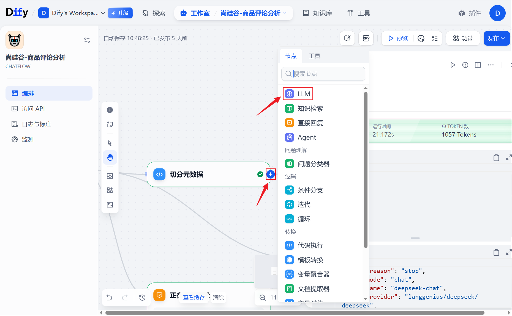


系统提示词如下

```
- 上下文{{#1763022388431.meta_str#}}
- 把上下文处理成Python字典类型
```

配置结构化输出

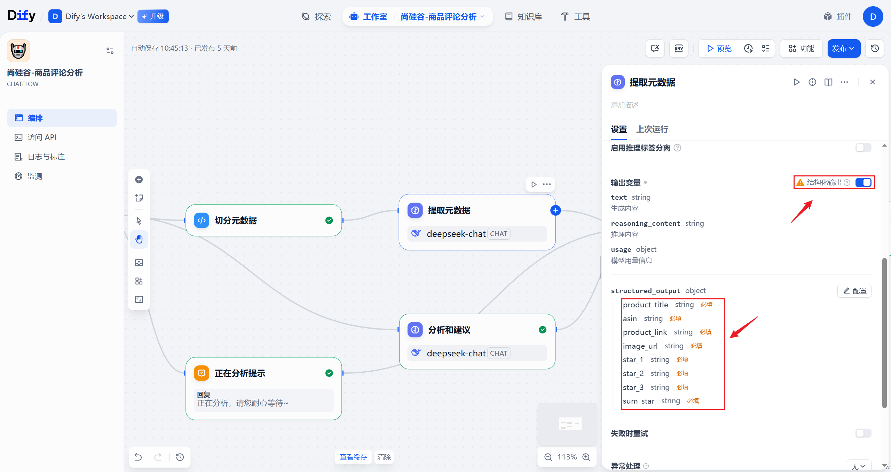

结构化输出的配置和`尚硅谷-客服对话记录分析-Dify`相同，不再赘述。

#### 2.测试


##### 1.数据处理

数据输入为空，输入信息在`数据处理`部分

```python
{
  "finish_reason": "stop",
  "model_mode": "chat",
  "model_name": "deepseek-chat",
  "model_provider": "langgenius/deepseek/deepseek",
  "prompts": [
    {
      "files": [],
      "role": "system",
      "text": "- 上下文| product_title：VIZIO 32 inch D-Series HD 720p Smart TV with Apple AirPlay and Chromecast Built-in, Alexa Compatibility, D32h-J, 2022 Model |\n| ----------------------------------------------------------------------------------------------------------------------------------------- |\n| asin：B094RKDNMZ |\n| product_link：https://www.amazon.com/-/zh/dp/B094RKDNMZ/ref=sims_dp_d_dex_popular_subs_t1_v6_d_sccl_2_6/145-6930307-1678620?pd_rd_w=xQWmL&content-id=amzn1.sym.7e9f1c55-8db7-45c5-bfbf-adf1bc16de34&pf_rd_p=7e9f1c55-8db7-45c5-bfbf-adf1bc16de34&pf_rd_r=3NVT4J6HG1720G4Z1QMH&pd_rd_wg=Rgbjt&pd_rd_r=ada5fa29-2a7d-44db-99fc-642b1a6d2041&pd_rd_i=B094RKDNMZ&th=1 |\n| image_url：https://m.media-amazon.com/images/I/81qFhtzh5KL._AC_SX679_.jpg |\n| crawling_time：2024-11-22 15:43:57 |\n| 评论星级统计： |\n| 1星评论数量：58 |\n| 2星评论数量：19 |\n| 3星评论数量：23 |\n| 总评论数量：100 |\n\n- 把上下文处理成Python字典类型"
    }
  ],
  "usage": {
    "completion_price": "0.002672",
    "completion_price_unit": "0.000001",
    "completion_tokens": 334,
    "completion_unit_price": "8",
    "currency": "RMB",
    "latency": 20.83256543194875,
    "prompt_price": "0.001446",
    "prompt_price_unit": "0.000001",
    "prompt_tokens": 723,
    "prompt_unit_price": "2",
    "total_price": "0.004118",
    "total_tokens": 1057
  }
}
```

##### 2.输出

```json
{
  "finish_reason": "stop",
  "reasoning_content": "",
  "structured_output": {
    "asin": "B094RKDNMZ",
    "image_url": "https://m.media-amazon.com/images/I/81qFhtzh5KL._AC_SX679_.jpg",
    "product_link": "https://www.amazon.com/-/zh/dp/B094RKDNMZ/ref=sims_dp_d_dex_popular_subs_t1_v6_d_sccl_2_6/145-6930307-1678620?pd_rd_w=xQWmL&content-id=amzn1.sym.7e9f1c55-8db7-45c5-bfbf-adf1bc16de34&pf_rd_p=7e9f1c55-8db7-45c5-bfbf-adf1bc16de34&pf_rd_r=3NVT4J6HG1720G4Z1QMH&pd_rd_wg=Rgbjt&pd_rd_r=ada5fa29-2a7d-44db-99fc-642b1a6d2041&pd_rd_i=B094RKDNMZ&th=1",
    "product_title": "VIZIO 32 inch D-Series HD 720p Smart TV with Apple AirPlay and Chromecast Built-in, Alexa Compatibility, D32h-J, 2022 Model",
    "star_1": "58",
    "star_2": "19",
    "star_3": "23",
    "sum_star": "100"
  },
  "text": "{\n  \"product_title\": \"VIZIO 32 inch D-Series HD 720p Smart TV with Apple AirPlay and Chromecast Built-in, Alexa Compatibility, D32h-J, 2022 Model\",\n  \"asin\": \"B094RKDNMZ\",\n  \"product_link\": \"https://www.amazon.com/-/zh/dp/B094RKDNMZ/ref=sims_dp_d_dex_popular_subs_t1_v6_d_sccl_2_6/145-6930307-1678620?pd_rd_w=xQWmL&content-id=amzn1.sym.7e9f1c55-8db7-45c5-bfbf-adf1bc16de34&pf_rd_p=7e9f1c55-8db7-45c5-bfbf-adf1bc16de34&pf_rd_r=3NVT4J6HG1720G4Z1QMH&pd_rd_wg=Rgbjt&pd_rd_r=ada5fa29-2a7d-44db-99fc-642b1a6d2041&pd_rd_i=B094RKDNMZ&th=1\",\n  \"image_url\": \"https://m.media-amazon.com/images/I/81qFhtzh5KL._AC_SX679_.jpg\",\n  \"star_1\": \"58\",\n  \"star_2\": \"19\",\n  \"star_3\": \"23\",\n  \"sum_star\": \"100\"\n}",
  "usage": {
    "completion_price": "0.002672",
    "completion_price_unit": "0.000001",
    "completion_tokens": 334,
    "completion_unit_price": "8",
    "currency": "RMB",
    "latency": 20.83256543194875,
    "prompt_price": "0.001446",
    "prompt_price_unit": "0.000001",
    "prompt_tokens": 723,
    "prompt_unit_price": "2",
    "total_price": "0.004118",
    "total_tokens": 1057
  }
}
```

### 5.2 分析和建议

#### 1.配置


系统提示词

````
# 角色
你是一位专业的淘宝产品分析师，需要：
1. 准确识别差评中的核心问题
2. 分析问题的根本原因
3. 提供可行的解决方案

## 分析原则
1. 客观分析
- 基于事实数据
- 避免主观臆测
- 保持中立立场

2. 系统分析
- 多维度分析
- 找出问题关联
- 追溯根本原因

3. 解决导向
- 提供具体建议
- 给出可行方案
- 制定改进计划

### 分析维度
1. 产品问题
   - 质量问题
   - 功能问题
   - 使用体验
   - 包装问题

2. 服务问题
   - 物流配送
   - 客服响应
   - 退换货处理
   - 售后服务

3. 价格问题
   - 性价比
   - 价格波动
   - 促销问题
   - 退款问题

4. 描述问题
   - 产品描述
   - 图片展示
   - 规格说明
   - 使用说明


## 技能
1. 分析上下文中的负面评论，从产品本身的角度、店铺服务角度、物流角度、价格角度进行分点分析
​```
示例：
一、产品问题
1.{具体的产品缺点1}
2.{具体的产品缺点2}
....
二、服务问题
1.{具体的店铺服务缺点1}
2.{具体的店铺服务缺点2}
....
三、物流服务
1.{具体的物流服务缺点1}
2.{具体的物流服务缺点2}
....
四、价格问题
1.{具体的价格缺点1}
2.{具体的价格缺点2}
....
​```
2. 针对每一个节点都需要分点详细分析，let is step by step。
3. 针对产品缺点的分析，总结相应的建议，let is step by step。
4. 把分析结果翻译成中文。

## 输出格式参考
产品分析（analysis）
一、产品本身
1.{具体的产品缺点1}
2.{具体的产品缺点2}
....
二、店铺服务
1.{具体的店铺服务缺点1}
2.{具体的店铺服务缺点2}
....
三、物流服务
1.{具体的物流服务缺点1}
2.{具体的物流服务缺点2}
....
四、价格
1.{具体的价格缺点1}
2.{具体的价格缺点2}

选品改进建议（suggestion）
1. 短期改进措施
2. 中期优化方案
3. 长期发展建议

## 限制
1. 以中文输出结果
2. let is think step by step
````


#### 2.测试


##### 1.数据处理

````json
{
  "finish_reason": "stop",
  "model_mode": "chat",
  "model_name": "deepseek-chat",
  "model_provider": "langgenius/deepseek/deepseek",
  "prompts": [
    {
      "role": "system",
      "text": "# 角色\n你是一位专业的淘宝产品分析师，需要：\n1. 准确识别差评中的核心问题\n2. 分析问题的根本原因\n3. 提供可行的解决方案\n\n## 分析原则\n1. 客观分析\n- 基于事实数据\n- 避免主观臆测\n- 保持中立立场\n\n2. 系统分析\n- 多维度分析\n- 找出问题关联\n- 追溯根本原因\n\n3. 解决导向\n- 提供具体建议\n- 给出可行方案\n- 制定改进计划\n\n### 分析维度\n1. 产品问题\n   - 质量问题\n   - 功能问题\n   - 使用体验\n   - 包装问题\n\n2. 服务问题\n   - 物流配送\n   - 客服响应\n   - 退换货处理\n   - 售后服务\n\n3. 价格问题\n   - 性价比\n   - 价格波动\n   - 促销问题\n   - 退款问题\n\n4. 描述问题\n   - 产品描述\n   - 图片展示\n   - 规格说明\n   - 使用说明\n\n\n## 技能\n1. 分析上下文中的负面评论，从产品本身的角度、店铺服务角度、物流角度、价格角度进行分点分析\n```\n示例：\n一、产品问题\n1.{具体的产品缺点1}\n2.{具体的产品缺点2}\n....\n二、服务问题\n1.{具体的店铺服务缺点1}\n2.{具体的店铺服务缺点2}\n....\n三、物流服务\n1.{具体的物流服务缺点1}\n2.{具体的物流服务缺点2}\n....\n四、价格问题\n1.{具体的价格缺点1}\n2.{具体的价格缺点2}\n....\n```\n2. 针对每一个节点都需要分点详细分析，let is step by step。\n3. 针对产品缺点的分析，总结相应的建议，let is step by step。\n4. 把分析结果翻译成中文。\n\n## 输出格式参考\n产品分析（analysis）\n一、产品本身\n1.{具体的产品缺点1}\n2.{具体的产品缺点2}\n....\n二、店铺服务\n1.{具体的店铺服务缺点1}\n2.{具体的店铺服务缺点2}\n....\n三、物流服务\n1.{具体的物流服务缺点1}\n2.{具体的物流服务缺点2}\n....\n四、价格\n1.{具体的价格缺点1}\n2.{具体的价格缺点2}\n\n选品改进建议（suggestion）\n1. 短期改进措施\n2. 中期优化方案\n3. 长期发展建议\n\n## 限制\n1. 以中文输出结果\n2. let is think step by step\n",
      "files": []
    },
    {
      "role": "user",
      "text": "| product_title：VIZIO 32 inch D-Series HD 720p Smart TV with Apple AirPlay and Chromecast Built-in, Alexa Compatibility, D32h-J, 2022 Model |\n| ----------------------------------------------------------------------------------------------------------------------------------------- |\n| asin：B094RKDNMZ |\n| product_link：https://www.amazon.com/-/zh/dp/B094RKDNMZ/ref=sims_dp_d_dex_popular_subs_t1_v6_d_sccl_2_6/145-6930307-1678620?pd_rd_w=xQWmL&content-id=amzn1.sym.7e9f1c55-8db7-45c5-bfbf-adf1bc16de34&pf_rd_p=7e9f1c55-8db7-45c5-bfbf-adf1bc16de34&pf_rd_r=3NVT4J6HG1720G4Z1QMH&pd_rd_wg=Rgbjt&pd_rd_r=ada5fa29-2a7d-44db-99fc-642b1a6d2041&pd_rd_i=B094RKDNMZ&th=1 |\n| image_url：https://m.media-amazon.com/images/I/81qFhtzh5KL._AC_SX679_.jpg |\n| crawling_time：2024-11-22 15:43:57 |\n| 评论星级统计： |\n| 1星评论数量：58 |\n| 2星评论数量：19 |\n| 3星评论数量：23 |\n| 总评论数量：100 |\n| rating | title | content | date | verified |\n| 1.0 |  | I will never purchase a TV again from Amazon or Vizio. The customer service is horrible when the TV stops working. I tried to get it returned to Amazon. They said their days had passed for me to get it returned to them. I purchased it on October 25 And it stopped working on December 22. I was then redirected to Vizio. She had me do the check on the TV. We spent about 30 to 45 minutes doing this. Unplugging it plugging it back using the remote we did all those things she had me go find the manual turn off and turn on. It’s so far in the back I couldn’t reach it because I can’t hardly walk , I told her I had to use a wheelchair or walker to get to the TV because I’m non-amatory. You would think she would have some understanding about that. Oh no. She said in order for me to return the phone I’ll get some service I had to go through the walk-through and try to see if I can get the TV to work. I called the bureau of business and I registered a complaint about Vizio and their poor service. I told her I still had the box to the TV that I would return it and its original box. If she would either send me a new I called the bureau of business and I registered a complaint about Vizio and their poor service. I told her I still had the box to the TV that I would return it and it’s original box. If she would either send me a new TV or send me my money back . Oh no, she couldn’t do that. They are the worst company in the world and Amazon service has gone down the toilet. I’m thinking about not doing any more purchasing with Amazon either. | Reviewed in the United States on December 22, 2023 | True |\n| 3.0 |  | I needed an inexpensive small TV for the garage and chose the Vizio 32\", So far, two issues: (1) image brightness is uneven across the screen. There are three bright spots in the upper middle part of the screen and my eyes seem to focus on them. No playing with the controls changes this problem. (2) the TV was assembled with a defect; the plastic border surrounding the image area was glued on at the op (slightly curved framework) without being fully pressed down. So the bright backup light shines through a narrow gap, maybe 1/16 inch wide in the top middle of the TV. I covered it with black electrical tape to hide the defect and stop the light from showing. Not very impressive, even for the modest cost. But it does work, so it is not a total loss. | Reviewed in the United States on November 11, 2023 | True |\n| 3.0 |  | This is the 1st time I've purchased a Vizio television. The screws don't fit--have to get smaller diameter screws. Never had that problem before. 😕 | Reviewed in the United States on November 4, 2024 | True |\n| 3.0 |  | Great color but terrible to try to set up Need a PHD in tv technology My son-inlaw is an Engineer and he had a hard time with it Every time you turned it on ,you had to start all over setting it up. Just not user friendly for older people it is probably a very good Tv just not for older people to try and set up. | Reviewed in the United States on August 26, 2024 | True |\n| 3.0 |  | I like it but too big for me! Not sage for my animals or me! | Reviewed in the United States on September 9, 2024 | True |\n| 3.0 |  | I bought this TV for my cats so they can watch cat TV on youtube while I'm at work. Unfortunately this TV has a super annoying \"are you still watching\" feature that I can't for the life of me figure out how to turn off. I can't find it in the manual and I can't find it flipping through menus. Every time I come home the video is paused and when you hit \"yes\" sometimes it plays fine, sometimes you get the loading circle that never ends. I'm 95% positive this is a TV feature and not a youtube feature because my bedroom TV doesn't pause on the cat videos and my boyfriend falls asleep to youtube videos all the time and they also don't pause. | Reviewed in the United States on April 23, 2024 | True |\n| 2.0 |  | It’s a decent tv when it works. I don’t use it often but when I do 50% of the time it’s not working or having trouble connecting to the Wi-Fi. I have other devices that are connected to my Wi-Fi and even when those aren’t it’s not working. The phone app also does not work, I have had to reset the app 3 times in the few times I’ve had it for 2 months. If I used it more often I would have realized the problem earlier and returned it. I bought an insignia TV about the same price and size a couple years ago and I haven’t had any issues. | Reviewed in the United States on October 1, 2024 | True |\n| 2.0 |  | I bought this particular TV because it was advertised as being able to be operated without internet. Nowhere in the product description is the requirement that the operation of the TV requires linking the TV with a VISO account which must be done with a router connected to the internet. Additionally, there was no access to the operating manual prior to purchase and I never received an actual manual. Possibly one is available on line, but I have not been able to find one. While I can access the internet via hot spot, all internet access must go through the VISO app. The picture is adequate and I can use an antenna to access programming. So I have rated this product a 2. I would never have purchased this item had its specs been honestly and accurately presented. I am only keeping it because its far too much trouble to return and repurchase a more suitable devise. | Reviewed in the United States on August 5, 2024 | True |\n| 3.0 |  | This tv is great! However we purchased it specifically for its Bluetooth & wireless capabilities, for our rv. The Bluetooth enabled in this divice CAN NOT pair headphones, or external wireless speakers. It can ONLY read wifi connection needed for the pre-installed apps to work. It only comes with the TV, remote with batteries and stand, no cables are provided to connect to external audio. I gave 3 stars for false advertising of its Bluetooth when \"wifi connective\" would have been spot on and accurate. I'm old, so I did have the cables I needed.. .at home, miles and miles away. | Reviewed in the United States on March 14, 2024 | True |\n| 3.0 |  | Bought this for a game room, but it was not setup for Bluetooth capable for wireless headphones for gaming system or gaming chair. | Reviewed in the United States on June 24, 2024 | True |\n| 3.0 |  | Sound isn't the greatest, you'll probably need a sound bar depending on what you use the tv for. I'm using it for my toddlers play area so not too concerned about the sound. Color/ screen options aren't the greatest either. Would prefer to have a voice to search button on the remote, and maybe even a Disney plus or YouTube button but all it has is Netflix, Sling, prime video, Redbox, iHeart radio and Crackle buttons at the top. I probably would NOT repurchase this tv if i had to, I would try another brand. | Reviewed in the United States on January 4, 2024 | True |\n| 3.0 |  | Brought this because my last tv went out and this is the worst tv ever it always freezes and it has less apps available than what the Roku brand offers don’t buy | Reviewed in the United States on May 28, 2024 | True |\n| 3.0 |  | Can't complain too much for what I payed. Not the best picture. No matter how much I adjusted the settings, could'nt get good picture. All that shadowing and spotty pixels. It's a bedroom TV so I'll leave it at that. | Reviewed in the United States on April 18, 2024 | True |\n| 3.0 |  | Not bad for the money. Only issue I have is sometimes when it is trying to find channels it will just lock up. You then have to turn on/off to get it to work again. Also, it does not find channels well for use. | Reviewed in the United States on March 5, 2024 | True |\n| 3.0 |  | Good Lil tv but always losses wifi connection in between uses nice picture tho | Reviewed in the United States on May 16, 2024 | True |\n| 1.0 |  | I need to connect the TV to the stand, but it didn’t come with any screws. I’ve searched the bags and box multiple times. I tried to guess the size and purchased the wrong ones. Becoming a bit of a headache.  Update: the TV also doesn’t work. It’s extremely slow and doesn’t really load anything, even being connected to the internet. I’m concerned I may have gotten a unit that was previously returned because it didn’t work. There was no plastic on the screen like new TVs normally have. And as mentioned, the screws were missing.  I’m in the process of returning the TV. Meanwhile, we have purchased a LG from Walmart instead and it’s up and running smoothly. | Reviewed in the United States on October 19, 2024 | True |\n| 3.0 |  |  | Reviewed in the United States on April 4, 2024 | True |\n| 3.0 |  | For some reason this doesn't seem like its 32\". Idk why but it looks smaller than the 32\" roku I had. But either way still does the job. Just wish it wasn't so expensive. | Reviewed in the United States on February 13, 2024 | True |\n| 2.0 |  | Menu screens takes days to display. Awful experience will return for tcl roku tv. | Reviewed in the United States on September 30, 2024 | True |\n| 3.0 |  | Tv works fine. But we received one without any screen protection and it was scratched straight out of the box. Also the power cord is shorter than expected and we had to use an extension cord. | Reviewed in the United States on January 5, 2024 | True |\n| 3.0 |  | HAS ALL THE BELLS AND WHISTLES,,APPLE ALEXA,MOVIES,LIVE,,EVERYTHING; IT ALSO HAS A FRONT FACING CAMERA THAT SCANS THE ROOM IT IS LOCATED IN... | Reviewed in the United States on February 13, 2024 | True |\n| 2.0 |  | Perhaps we simply got a 'lemon,' but we experienced the same WiFi issues other reviewers have noted.  This T.V. takes forever to connect, and routinely loses signal/requires a new login.  Oh, and the Vizio menu is a bloated mess that creates massive lag.  Obviously, none of the above matters if you are simply using this as a monitor or pairing it with something like an Apple TV, but if the goal is to have a functioning television right out of the box, I'd look elsewhere. | Reviewed in the United States on March 31, 2024 | True |\n| 3.0 |  | My mistake was to send this to another country and this tv only functions in USA or Canada | Reviewed in the United States on March 12, 2024 | True |\n| 2.0 |  | I NEVER TOLD ANYONE TO PUT REFUND ON MY ACCOUNT.I AWAYS WANT IT GOING BACK TO MY CARD.. THANKS | Reviewed in the United States on August 18, 2024 | True |\n| 1.0 |  | Poor quality. Picture often froze one day before TV shut down and would not turn back on until the next day. INPUT &APPS function not stable. Worked when I first got it, then I had to do a factory reset to get it working again, but that only lasted a short time. Price was right but performance is poor. | Reviewed in the United States on October 21, 2024 | True |\n| 3.0 |  | Screen is washed out somewhat when viewed from the side. its good when viewed straight forward. | Reviewed in the United States on November 29, 2023 | True |\n| 3.0 |  | Did not like the picture quality | Reviewed in the United States on December 28, 2023 | True |\n| 1.0 |  | This TV is junk. It worked for a couple of months and then just quit working. It won’t pick up the wifi at all anymore. This is the second Vizio TV I’ve bought in the last two years that doesn’t work properly. I’m not sure what happened, but clearly Vizio quality control has gone way downhill. I won’t ever buy this brand again. | Reviewed in the United States on October 7, 2024 | True |\n| 1.0 |  | Went to mount this TV and the screws that came with it broke in half. Couldn't even get the broken pieces out of the screw holes. Luckily this happened early enough in the process that we had 2 out of the 4 screw holes without broken screws and mounted it with only 2 screws that came with the mount instead of the TV supplied screws. Very disappointed! | Reviewed in the United States on October 6, 2024 | True |\n| 3.0 |  | Great Price if you only watch Apps! Unable to navigate antennae channels | Reviewed in the United States on November 11, 2023 | True |\n| 2.0 |  | The remote doesn't work. Tried new batteries but it won't allow me to set up the TV. So now I have a television that can't be programmed and a remote that doesn't work on my TV. I ordered a universal remote. But without the remote I can't set it up or get rid of the annoying vizio label on the corner of the screen that pops up every thirty seconds. I normally have good things to say about vizio but you guys dropped the ball. What happened to quality checks? | Reviewed in the United States on January 9, 2024 | True |\n| 2.0 |  | i cannot get the vizio to recognize my wifi for the \"smart tv. probably my stupidity? naw. i'm pretty tech savvy. i've been too down to keep trying. maybe tomorrow will be a better day. :) i cannot therefore recommend. this tv. | Reviewed in the United States on April 28, 2024 | True |\n| 1.0 |  | I could never get my disney plus app to work nor my peacock app. Will likely now need to buy something to cast my apps. | Reviewed in the United States on November 8, 2024 | True |\n| 1.0 |  | The volume is absolutely horrible on this TV. It doesn't match the level. I have to turn it up to 100 to get Mediocre sound. It's like it's still at 20. Why is it so low. This product should have been tested by people that know better. I'm not sure what ppl here are reviewing for them to give this product a four or five star. It's worth a one star from me. | Reviewed in the United States on September 2, 2024 | True |\n| 2.0 |  | When I purchased this it said it was compatible with Alexa. I have a similar model in a smaller size and it’s great to hook up other speakers. This model has no Bluetooth so I cannot hook up external speakers. I will be returning. Very disappointing. | Reviewed in the United States on March 6, 2024 | True |\n| 2.0 |  | Every other television in the he house as well as Alexa is connected to the Internet and this TV refuses to connect even when connected directly. Vizio used to be better than this. | Reviewed in the United States on April 25, 2024 | True |\n| 1.0 |  | Vizio TVs do NOT work natively with Apps like Fox Nation, Curiosity Stream, Brilliant, and many more streaming services. Internet speeds are over 300mbs, and the TV is 14\" above the router. The streaming services buffer terribly constantly, often times stopping completely. Contacted support, for both VIZIO and the Streaming Services, and no one is able to provide a fix. We had to purchase and connect a Chromecast and Firestick to the HDMI inputs in order to stream our favorite services. | Reviewed in the United States on August 4, 2024 | True |\n| 1.0 |  | The operating system is slow and glitchy and the range for WiFi is terrible. This tv replaced a cheaper Hisense model and I'm terribly disappointed.. I wish I had tried it before the return window closed as this TV is terrible to the point I'll toss it in the garage or give it away... Just terrible! | Reviewed in the United States on August 31, 2024 | True |\n| 1.0 |  | Tried several different ways to set up this tv including the mobile. After two days of trying to set it up, I threw the remote control through at the TV and it smashed the screen. Oh by the way, I took great joy in this but now I cannot return the unit. | Reviewed in the United States on August 29, 2024 | True |\n| 2.0 |  | Easy set up but tv pops on, on its on, even when turned off with remote, have to unplug to keep off | Reviewed in the United States on May 16, 2024 | True |\n| 2.0 |  | Tv are really small. I bought a total of 3 and 2 of them went out just blank screen but the volume was still working. I wouldn't recommend | Reviewed in the United States on April 17, 2024 | True |\n| 1.0 |  | This TV is one of the worst I've owned. Freezes all the time and has to go back to home to reset then have to redo everything to get back to the show I was watching because none of the buttons on the remote are for the popular streaming networks except for Netflix. I have had more than 10 moments where I've wanted to hurl the remote into it. | Reviewed in the United States on July 17, 2024 | True |\n| 1.0 |  | I had one tv and it stopped working after about a week. It loses connection to WiFi and then when you power up it just spins and never relaunches. So you have to reset the tv and go through setup al over again. I was then sent a replacement tv, same exact problem, except it happened in about two days. | Reviewed in the United States on August 5, 2024 | True |\n| 2.0 |  | Vizio is selling a product that only works on a 3G network, well Spectrum is a 5G network and it doesn’t work. Buyer beware in future. No wonder they are on sale | Reviewed in the United States on March 17, 2024 | True |\n| 2.0 |  | Was misled by info that said steaming. Could have bought a Roku for my older unit. | Reviewed in the United States on April 6, 2024 | True |\n| 1.0 |  | I bought this TV for my son go use with Xbox. It was on sale during the prime day deals. And the hdmi port didn't work. | Reviewed in the United States on August 23, 2024 | True |\n| 2.0 |  | Corner of the TV is cracked. Remote smells like it was stored in an ash tray with a hundred old cigarette butts. | Reviewed in the United States on March 7, 2024 | True |\n| 1.0 |  | Will not stay connected despite excellent signal. Biggest piece of junk ever owned in 54 years. | Reviewed in the United States on October 8, 2024 | True |\n| 1.0 |  | Purchase this TV from Amazon and it died after 11 months. Tried to get help from the manufacturer and they told me that Amazon sold me a TV from an unauthorized dealer. Neither Vizio or Amazon would do anything about it. | Reviewed in the United States on July 21, 2024 | True |\n| 1.0 |  | This television only works in the United States. Not supported in any other region. Do not buy if you are in another country. Horrible. | Reviewed in the United States on August 28, 2024 | True |\n| 1.0 |  | It’s too confusing for her. So I’m returning the product. | Reviewed in the United States on September 26, 2024 | True |\n| 2.0 |  | This tv has many issues. It is very slow and loses internet connection for no reason. It also makes it difficult to just use an antenna | Reviewed in the United States on February 15, 2024 | True |\n| 1.0 |  | This TV is an excuse to make you sign up for apps and accounts that you dont want. I dont want a relationship with Visio and its advertisers, I just want to watch TV. They REQUIRED making a Visio account and putting apps on my phone and outright lied about the ability to web browse. No more visio for me | Reviewed in the United States on June 29, 2024 | True |\n| 1.0 |  | Could not get it to connect to the WiFi. Returned | Reviewed in the United States on October 16, 2024 | True |\n| 1.0 |  | I’ve had this tv for two months for use in my upstairs bedroom. At least half the time it continually freezes and has long gaps before restarting. I’ve never had issues with other tvs in my bedroom. It’s incredibly frustrating as we stream everything and can’t watch this tv often. | Reviewed in the United States on June 3, 2024 | True |\n| 1.0 |  | Shipping was so fast, but when i open the item, it glass was broken. So sad and disappointed. | Reviewed in the United States on September 11, 2024 | True |\n| 1.0 |  | This TV will not stay on the input that is selected and defaults back to their own channel ever time it’s powered off and back on…VERY annoying | Reviewed in the United States on August 21, 2024 | True |\n| 2.0 |  | Worked great for the first two months I had it. Was simple to use and set up but has some major bugs. After two months it is constantly turning itself on and off and restarting itself over and over. I searched the web saw this was a common issue and tried all the tricks to fix this but nothing has helped. Its such a waste to just get rid of a new tv but I don't even know what to do anymore. Such a major inconvenience. I got to enjoy it for such a short period of time | Reviewed in the United States on September 7, 2022 | True |\n| 1.0 |  | This tv is not ALEXA compatible WE tried and tried and tried Also when you turn it in you have to go into the side bar and put in Live tv it if you want it to come on Also that remote is weird If you want to change a channel on the remote a little thing comes up and you have to put the numbers in then press down for OK I dont like it There is no V on the remote I tried both apps for ALexa and they dont work | Reviewed in the United States on February 20, 2024 | True |\n| 1.0 |  | Received this TV today and tried to connect to WiFi for about 2 hours and it kept saying “no network detected”. All other devices in my home are connected and I rebooted both TV and router several times so I had to return this. | Reviewed in the United States on July 10, 2024 | True |\n| 2.0 |  | Tv started out good. Just needed something for a spare room . Now I constantly have to unplug and re plug to get it to work and even then it’s a gamble. Occasionally it won’t stay internet connected (even though everything else does) and it’s constantly resetting itself and I have ti log back in to every app again. Last 4 days I’ve had to log back into Hulu everyday for what? It also constantly freezes up. It’s a cheap price but I’m not even sure it’s worth the trouble really. | Reviewed in the United States on October 9, 2022 | True |\n| 2.0 |  | Received tv box was destroyed terribly, looked as though that has kicked it all over the truck. We did pull the the TV out and check it. No damage seen hope it works since it a Christmas present. | Reviewed in the United States on November 16, 2023 | True |\n| 1.0 |  | Unfortunately we had to restart the tv several times because it kept getting stuck in the loading updates phase. After that finally worked the apps kept closing once we opened them. So we had to turn off the tv and again unplug it for 5-10 seconds. It’s a hassle to return so I will simply warn others not to buy. | Reviewed in the United States on May 26, 2024 | True |\n| 1.0 |  | Stopped recognizing WiFi network after two months - tried every option on Vizios website to troubleshoot the issue and it was never able to find our WiFi. I’m not really a tech savvy person but I don’t think anyone should have this much trouble trying to connect their tv to WiFi. Seems like a common problem with their tvs that doesn’t seem like it’ll be fixed. Maybe just try a different brand | Reviewed in the United States on April 5, 2024 | True |\n| 1.0 |  | TV connected to Wifi once, attempted to update software and stopped dead in its tracks. Never could connect to WiFi after that.  Product support was clueless. He told me crazy stuff like we don't support your 5G router and or its WPA 3 security. That's nonsense. The router down grades protocols to support 2G and WPA 2. If it didn't none of the older devices in my house would work.  I guess I got what I paid for. It was cheap. And now its on the trash heap. | Reviewed in the United States on January 29, 2024 | True |\n| 2.0 |  | The remote control is designed badly. Channels are way at the bottom and not easily entered with one hand. The button for returning to the previous channel is under the button that takes you out of the mode you're in so constantly having to change the mode back to TV. Every once in awhile the whole think just goes blank. No sound no picture and the only way to fix it is to unplug it. | Reviewed in the United States on July 1, 2022 | True |\n| 1.0 |  | This is the worst TV I have ever owned. It takes forever when you try to search for anything. It sometimes cuts off for no reason. I've had days where it won't even start an app. It just goes black and after about a minute it goes back to the home screen, never even opening the app. Please do not waste your money on this TV | Reviewed in the United States on March 10, 2024 | True |\n| 1.0 |  | Purchase tv to my surprise the tv is region locked . The Home Screen keep saying Vizio Home not available in your region. Save your money buy another brand. | Reviewed in the United States on June 2, 2024 | True |\n| 1.0 |  | El producto no esta programado para funcinar fuera de estados unidos. esto no se encuentra en la descripcion | Reviewed in the United States on July 1, 2024 | True |\n| 3.0 |  | This TV has NO ethernet port but in the description it claims to have ethernet connetivity 32 inch, 720p model | Reviewed in the United States on April 17, 2022 | True |\n| 1.0 |  | La pantalla llegó rota un | Reviewed in the United States on August 7, 2024 | True |\n| 1.0 |  | I purchased this television less than two months ago and it’s already broke | Reviewed in the United States on July 13, 2024 | True |\n| 3.0 |  | No ESPN plus app market isn’t very good | Reviewed in the United States on July 18, 2022 | True |\n| 1.0 |  | Was impossible to set up, and they charge for customer service! | Reviewed in the United States on June 26, 2024 | True |\n| 1.0 |  | I did not receive a remote for this tv | Reviewed in the United States on June 26, 2024 | True |\n| 3.0 |  | I bought this tv as a gift but the recipient informed me that it arrived without a remote. I’m so disappointed. | Reviewed in the United States on December 18, 2021 | True |\n| 1.0 |  | Less than one week after installing a brand new \"VIZIO 32 inch D-Series HD 720p Smart TV\", the picture began to deteriorate so much that it appeared as if I was watching a very faint picture through a snowstorm! A TV repairman tried adjusting the picture controls, etc. but then said the problem was probably a defective picture tube. Aren't TVs bench tested before leaving the factory anymore? | Reviewed in the United States on November 17, 2023 | True |\n| 1.0 |  | I had to try three different 32 inch Vizio tv's and none of them worked. Instead of the company sending me a box to return the latest one, I have to give them proof that this tv is crap. I had great success before with other Vizio's but now I will NEVER buy from them again. I am out $158.00 and that is a lot of money. I am on a fixed income and still cannot believe this company pulls this on their customers. | Reviewed in the United States on April 24, 2023 | True |\n| 1.0 |  | Having MAJOR issues syncing this tv's WiFi with Cox Communication: not quite sure why! I've been trying for over a week! If I hadn't thrown the box away, this tv would have already been returned.... | Reviewed in the United States on February 23, 2024 | True |\n| 1.0 |  | no direction included. did not send remote xrt140 | Reviewed in the United States on July 20, 2024 | True |\n| 1.0 |  | El televisor que compré no es de 32 pulgadas es muy pequeño siento que están engañando las personas | Reviewed in the United States on May 12, 2024 | True |\n| 1.0 |  | This is a the first Vizio tv I HATED!!! It freezes constantly, internet doesn’t stay connected to the tv, very slow when turning on. This is the worst tv ever!!! | Reviewed in the United States on February 18, 2024 | True |\n| 1.0 |  | You can’t use this TV with a standard coaxial analog setup, as Vizio forces you to utilize WatchFree TV and it’s a terrible UI. We purchased this for our elderly Mom in a nursing home and had to return it. | Reviewed in the United States on January 2, 2024 | True |\n| 1.0 |  | Omg this tv is so bad the sound is terrible!! Is soooo small I don’t think so that is 32in no way!! Don’t wasted your money ! | Reviewed in the United States on February 20, 2024 | True |\n| 1.0 |  | Garbage. Don’t buy. | Reviewed in the United States on July 16, 2024 | True |\n| 1.0 |  | No speaker | Reviewed in the United States on July 12, 2024 | True |\n| 1.0 |  | shop best buy and get a real deal and on time shipping ... unlike this purchase .. late and more expensive than the toshiba tv I bought from best buy .... amazon is getting sloppy and not caring for their customers .... | Reviewed in the United States on December 14, 2023 | True |\n| 1.0 |  | Le salen rallas en la pantalla color verde | Reviewed in the United States on June 16, 2024 | True |\n| 1.0 |  | TV’s aren’t worth it. Can’t stay connected to wifi, slow AF, and quality is only good if I’m on the input with my Xbox! | Reviewed in the United States on March 12, 2024 | True |\n| 1.0 |  | No-good | Reviewed in the United States on June 14, 2024 | True |\n| 1.0 |  | Product description says Ethernet connectivity. There is no Ethernet. | Reviewed in the United States on March 19, 2024 | True |\n| 1.0 |  | I didn't like it I sent it back So where is my refund from tv  Thank u | Reviewed in the United States on March 9, 2024 | True |\n| 1.0 |  | We are having issues with this tv freezing mid show. Please advise | Reviewed in the United States on March 3, 2024 | True |\n| 1.0 |  | Not compatible with gaming nor quality picture creminded me of watching tv over ten years ago also super small for 60 buck more got 50” | Reviewed in the United States on January 17, 2024 | True |\n| 1.0 |  | It continues to just restart and so I went to do an exchange and stopped at the reviews. OMG....the first 10 were all a completely useless item ...how can this have such high ratings?? There should be compensation for all the wasted time of setup, making sure I was home for the delivery and now taking it somewhere to return it | Reviewed in the United States on May 24, 2022 | True |\n| 1.0 |  | Won't connect. Won't update. Can't use any of the smart TV features. Save your money. | Reviewed in the United States on January 31, 2024 | True |\n| 1.0 |  | One of the worst TV’s. Randomly shuts off. Won’t let me change inputs sometimes. Stuck on random screens. Tried to get a refund a little after a month of ordering and was told I couldn’t. DO NOT BUY. | Reviewed in the United States on January 26, 2023 | True |\n| 1.0 |  | We bought this TV November 2021 and it has now decided to stop connecting to the internet and keeps signing out of streaming services and freezing while playing. I may be in the minority, but I expect electronics to last over a year at least, not 9 months... | Reviewed in the United States on September 3, 2022 | True |\n| 1.0 |  | First the driver left this clear electronic device on my porch in the rain when I wasn't home. The setup was ok but after a few days the screen went green and had to reset the set and then a week later the screen went gray and went through another annoying process trying to fix that. Never again | Reviewed in the United States on June 5, 2022 | True |\n| 1.0 |  | We just bought a house and got this tv so I would fall asleep in the bedroom. I used it two times and now it’s got a blank screen. Powers on and screen stays blank. Just the tv nothing hooked up to it. I know electronics can fail but this is a hassle. Lemon Alert. | Reviewed in the United States on December 18, 2021 | True |\n",
      "files": []
    }
  ],
  "usage": {
    "completion_price": "0.005464",
    "completion_price_unit": "0.000001",
    "completion_tokens": 683,
    "completion_unit_price": "8",
    "currency": "RMB",
    "latency": 30.12138410191983,
    "prompt_price": "0.0177",
    "prompt_price_unit": "0.000001",
    "prompt_tokens": 8850,
    "prompt_unit_price": "2",
    "total_price": "0.023164",
    "total_tokens": 9533
  }
}
````

##### 2.输出

```json
{
  "finish_reason": "stop",
  "reasoning_content": "",
  "text": "产品分析（analysis）\n\n一、产品本身\n1. 硬件质量问题突出\n- 屏幕显示问题：多个用户报告屏幕亮度不均、出现亮点、绿色条纹、雪花状画面\n- 结构缺陷：塑料边框粘合不牢导致漏光，螺丝孔位不匹配或螺丝断裂\n- 端口故障：HDMI端口失效，电源线过短\n- 快速损坏：部分电视使用数周或数月后完全失效\n\n2. 软件系统问题严重\n- 操作系统卡顿：菜单响应缓慢，频繁死机重启\n- 网络连接不稳定：WiFi频繁断连，无法识别5G网络\n- 应用兼容性差：无法运行Disney+、Peacock等主流流媒体应用\n- 系统bug：电视自动开关机，输入源无法保存\n\n3. 功能设计缺陷\n- 蓝牙功能误导：宣传支持蓝牙但实际无法连接耳机或外接音箱\n- 区域限制：仅限美加地区使用，未在描述中明确说明\n- 遥控器设计不合理：按键布局混乱，缺少常用流媒体快捷键\n\n二、店铺服务\n1. 售后服务响应差\n- 退换货政策严格：超出退货期限后拒绝处理\n- 客服支持不足：技术问题无法有效解决\n- 跨品牌推诿：亚马逊和VIZIO互相推卸责任\n\n2. 产品信息不准确\n- 功能描述误导：声称支持以太网端口但实际没有\n- 规格说明不清：未明确区域限制和账户绑定要求\n\n三、物流服务\n1. 包装保护不足\n- 外箱破损严重：多用户报告包装被踢损\n- 屏幕防护缺失：部分产品无屏幕保护膜\n- 运输损坏：屏幕破裂、角落开裂\n\n2. 配件缺失\n- 遥控器遗漏：多个用户未收到遥控器\n- 螺丝缺失：无法安装底座\n- 说明书缺失：无操作指南\n\n四、价格\n1. 性价比低\n- 性能与价格不匹配：相比同价位其他品牌产品性能明显落后\n- 质量不稳定：故障率高导致实际使用成本增加\n2. 促销误导\n-  Prime Day等促销期间质量问题频发\n- 功能缩水但价格未相应调整\n\n选品改进建议（suggestion）\n\n1. 短期改进措施\n- 立即修订产品描述，明确标注区域限制、实际网络要求和功能限制\n- 加强出厂质量检测，特别是屏幕显示、网络模块和硬件连接\n- 改善包装方案，增加缓冲材料和屏幕保护\n- 建立快速退换货通道，对质量问题零容忍\n\n2. 中期优化方案\n- 升级固件系统，解决卡顿、死机和网络连接问题\n- 重新设计遥控器，优化按键布局和功能设置\n- 扩展应用商店，增加主流流媒体应用支持\n- 建立更完善的售后技术支持体系\n\n3. 长期发展建议\n- 重新评估产品定位，在保证基本功能稳定性的前提下增加实用功能\n- 加强供应链质量管理，建立更严格的质量控制标准\n- 开发更适合国际市场的版本，解除区域限制\n- 提升产品透明度，如实宣传产品功能和限制",
  "usage": {
    "completion_price": "0.005464",
    "completion_price_unit": "0.000001",
    "completion_tokens": 683,
    "completion_unit_price": "8",
    "currency": "RMB",
    "latency": 30.12138410191983,
    "prompt_price": "0.0177",
    "prompt_price_unit": "0.000001",
    "prompt_tokens": 8850,
    "prompt_unit_price": "2",
    "total_price": "0.023164",
    "total_tokens": 9533
  }
}
```

### 5.3 正在分析提示

#### 1.配置

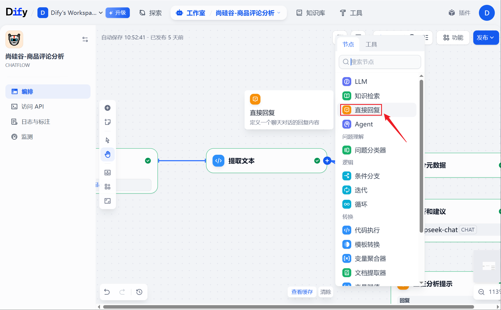

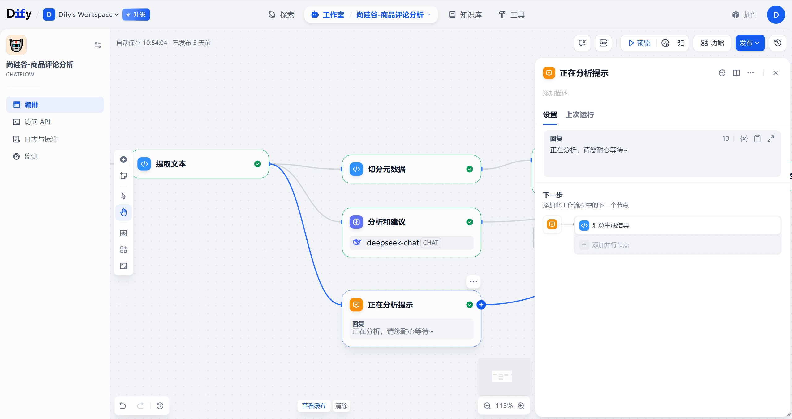

#### 2.测试

输出节点无法测试。

### 6.汇总生成结果

#### 1.配置

这是个代码节点


##### 输入变量

meta_data

analysis_and_suggestion

##### 代码内容

```python

def main(meta_data: dict, analysis_and_suggestion: str):
    return {
        "final_result": {
            "product_title": meta_data['product_title'],
            "asin": meta_data['asin'],
            "product_link": meta_data['product_link'],
            "image_url": meta_data['image_url'],
            "star_1": meta_data['star_1'],
            "star_2": meta_data['star_2'],
            "star_3": meta_data['star_3'],
            "sum_star": meta_data['sum_star'],
            "analysis_and_suggestion": analysis_and_suggestion
        }
    }
```

#### 2.测试


##### 1.输入

```json
{
  "analysis_and_suggestion": "产品分析（analysis）\n\n一、产品本身\n1. 硬件质量问题突出\n- 屏幕显示问题：多个用户报告屏幕亮度不均、出现亮点、绿色条纹、雪花状画面\n- 结构缺陷：塑料边框粘合不牢导致漏光，螺丝孔位不匹配或螺丝断裂\n- 端口故障：HDMI端口失效，电源线过短\n- 快速损坏：部分电视使用数周或数月后完全失效\n\n2. 软件系统问题严重\n- 操作系统卡顿：菜单响应缓慢，频繁死机重启\n- 网络连接不稳定：WiFi频繁断连，无法识别5G网络\n- 应用兼容性差：无法运行Disney+、Peacock等主流流媒体应用\n- 系统bug：电视自动开关机，输入源无法保存\n\n3. 功能设计缺陷\n- 蓝牙功能误导：宣传支持蓝牙但实际无法连接耳机或外接音箱\n- 区域限制：仅限美加地区使用，未在描述中明确说明\n- 遥控器设计不合理：按键布局混乱，缺少常用流媒体快捷键\n\n二、店铺服务\n1. 售后服务响应差\n- 退换货政策严格：超出退货期限后拒绝处理\n- 客服支持不足：技术问题无法有效解决\n- 跨品牌推诿：亚马逊和VIZIO互相推卸责任\n\n2. 产品信息不准确\n- 功能描述误导：声称支持以太网端口但实际没有\n- 规格说明不清：未明确区域限制和账户绑定要求\n\n三、物流服务\n1. 包装保护不足\n- 外箱破损严重：多用户报告包装被踢损\n- 屏幕防护缺失：部分产品无屏幕保护膜\n- 运输损坏：屏幕破裂、角落开裂\n\n2. 配件缺失\n- 遥控器遗漏：多个用户未收到遥控器\n- 螺丝缺失：无法安装底座\n- 说明书缺失：无操作指南\n\n四、价格\n1. 性价比低\n- 性能与价格不匹配：相比同价位其他品牌产品性能明显落后\n- 质量不稳定：故障率高导致实际使用成本增加\n2. 促销误导\n-  Prime Day等促销期间质量问题频发\n- 功能缩水但价格未相应调整\n\n选品改进建议（suggestion）\n\n1. 短期改进措施\n- 立即修订产品描述，明确标注区域限制、实际网络要求和功能限制\n- 加强出厂质量检测，特别是屏幕显示、网络模块和硬件连接\n- 改善包装方案，增加缓冲材料和屏幕保护\n- 建立快速退换货通道，对质量问题零容忍\n\n2. 中期优化方案\n- 升级固件系统，解决卡顿、死机和网络连接问题\n- 重新设计遥控器，优化按键布局和功能设置\n- 扩展应用商店，增加主流流媒体应用支持\n- 建立更完善的售后技术支持体系\n\n3. 长期发展建议\n- 重新评估产品定位，在保证基本功能稳定性的前提下增加实用功能\n- 加强供应链质量管理，建立更严格的质量控制标准\n- 开发更适合国际市场的版本，解除区域限制\n- 提升产品透明度，如实宣传产品功能和限制",
  "meta_data": {
    "asin": "B094RKDNMZ",
    "image_url": "https://m.media-amazon.com/images/I/81qFhtzh5KL._AC_SX679_.jpg",
    "product_link": "https://www.amazon.com/-/zh/dp/B094RKDNMZ/ref=sims_dp_d_dex_popular_subs_t1_v6_d_sccl_2_6/145-6930307-1678620?pd_rd_w=xQWmL&content-id=amzn1.sym.7e9f1c55-8db7-45c5-bfbf-adf1bc16de34&pf_rd_p=7e9f1c55-8db7-45c5-bfbf-adf1bc16de34&pf_rd_r=3NVT4J6HG1720G4Z1QMH&pd_rd_wg=Rgbjt&pd_rd_r=ada5fa29-2a7d-44db-99fc-642b1a6d2041&pd_rd_i=B094RKDNMZ&th=1",
    "product_title": "VIZIO 32 inch D-Series HD 720p Smart TV with Apple AirPlay and Chromecast Built-in, Alexa Compatibility, D32h-J, 2022 Model",
    "star_1": "58",
    "star_2": "19",
    "star_3": "23",
    "sum_star": "100"
  }
}
```

##### 2.输出

```json
{
  "final_result": {
    "analysis_and_suggestion": "产品分析（analysis）\n\n一、产品本身\n1. 硬件质量问题突出\n- 屏幕显示问题：多个用户报告屏幕亮度不均、出现亮点、绿色条纹、雪花状画面\n- 结构缺陷：塑料边框粘合不牢导致漏光，螺丝孔位不匹配或螺丝断裂\n- 端口故障：HDMI端口失效，电源线过短\n- 快速损坏：部分电视使用数周或数月后完全失效\n\n2. 软件系统问题严重\n- 操作系统卡顿：菜单响应缓慢，频繁死机重启\n- 网络连接不稳定：WiFi频繁断连，无法识别5G网络\n- 应用兼容性差：无法运行Disney+、Peacock等主流流媒体应用\n- 系统bug：电视自动开关机，输入源无法保存\n\n3. 功能设计缺陷\n- 蓝牙功能误导：宣传支持蓝牙但实际无法连接耳机或外接音箱\n- 区域限制：仅限美加地区使用，未在描述中明确说明\n- 遥控器设计不合理：按键布局混乱，缺少常用流媒体快捷键\n\n二、店铺服务\n1. 售后服务响应差\n- 退换货政策严格：超出退货期限后拒绝处理\n- 客服支持不足：技术问题无法有效解决\n- 跨品牌推诿：亚马逊和VIZIO互相推卸责任\n\n2. 产品信息不准确\n- 功能描述误导：声称支持以太网端口但实际没有\n- 规格说明不清：未明确区域限制和账户绑定要求\n\n三、物流服务\n1. 包装保护不足\n- 外箱破损严重：多用户报告包装被踢损\n- 屏幕防护缺失：部分产品无屏幕保护膜\n- 运输损坏：屏幕破裂、角落开裂\n\n2. 配件缺失\n- 遥控器遗漏：多个用户未收到遥控器\n- 螺丝缺失：无法安装底座\n- 说明书缺失：无操作指南\n\n四、价格\n1. 性价比低\n- 性能与价格不匹配：相比同价位其他品牌产品性能明显落后\n- 质量不稳定：故障率高导致实际使用成本增加\n2. 促销误导\n-  Prime Day等促销期间质量问题频发\n- 功能缩水但价格未相应调整\n\n选品改进建议（suggestion）\n\n1. 短期改进措施\n- 立即修订产品描述，明确标注区域限制、实际网络要求和功能限制\n- 加强出厂质量检测，特别是屏幕显示、网络模块和硬件连接\n- 改善包装方案，增加缓冲材料和屏幕保护\n- 建立快速退换货通道，对质量问题零容忍\n\n2. 中期优化方案\n- 升级固件系统，解决卡顿、死机和网络连接问题\n- 重新设计遥控器，优化按键布局和功能设置\n- 扩展应用商店，增加主流流媒体应用支持\n- 建立更完善的售后技术支持体系\n\n3. 长期发展建议\n- 重新评估产品定位，在保证基本功能稳定性的前提下增加实用功能\n- 加强供应链质量管理，建立更严格的质量控制标准\n- 开发更适合国际市场的版本，解除区域限制\n- 提升产品透明度，如实宣传产品功能和限制",
    "asin": "B094RKDNMZ",
    "image_url": "https://m.media-amazon.com/images/I/81qFhtzh5KL._AC_SX679_.jpg",
    "product_link": "https://www.amazon.com/-/zh/dp/B094RKDNMZ/ref=sims_dp_d_dex_popular_subs_t1_v6_d_sccl_2_6/145-6930307-1678620?pd_rd_w=xQWmL&content-id=amzn1.sym.7e9f1c55-8db7-45c5-bfbf-adf1bc16de34&pf_rd_p=7e9f1c55-8db7-45c5-bfbf-adf1bc16de34&pf_rd_r=3NVT4J6HG1720G4Z1QMH&pd_rd_wg=Rgbjt&pd_rd_r=ada5fa29-2a7d-44db-99fc-642b1a6d2041&pd_rd_i=B094RKDNMZ&th=1",
    "product_title": "VIZIO 32 inch D-Series HD 720p Smart TV with Apple AirPlay and Chromecast Built-in, Alexa Compatibility, D32h-J, 2022 Model",
    "star_1": "58",
    "star_2": "19",
    "star_3": "23",
    "sum_star": "100"
  }
}
```

### 7.整理输出

#### 1.配置


系统提示词

```
# 将用户给出的数据根据下面给出的提示词模板整理为目标格式输出
# 输出格式
以markdown格式输出
<参考格式>
# 一、 图片
# 二、 商品跳转链接
# 三、 负面评论总数量
- 3星评论数量
- 2星评论数量
- 1星评论数量
# 四、产品分析（analysis）
## 4.1 产品本身
1. {具体的产品缺点1}
2. {具体的产品缺点2}
....
## 4.2 店铺服务
1.{具体的店铺服务缺点1}
2.{具体的店铺服务缺点2}
....
## 4.3 物流服务
1.{具体的物流服务缺点1}
2.{具体的物流服务缺点2}
....
## 4.4 价格
1.{具体的价格缺点1}
2.{具体的价格缺点2}

# 五、选品改进建议（suggestion）
1. 短期改进措施
2. 中期优化方案
3. 长期发展建议
</参考格式>
```


#### 2.测试


##### 1.数据处理

```json
{
  "finish_reason": "stop",
  "model_mode": "chat",
  "model_name": "deepseek-chat",
  "model_provider": "langgenius/deepseek/deepseek",
  "prompts": [
    {
      "files": [],
      "role": "system",
      "text": "# 将用户给出的数据根据下面给出的提示词模板整理为目标格式输出\n# 输出格式\n以markdown格式输出\n<参考格式>\n# 一、 图片\n# 二、 商品跳转链接\n# 三、 负面评论总数量\n- 3星评论数量\n- 2星评论数量\n- 1星评论数量\n# 四、产品分析（analysis）\n## 4.1 产品本身\n1. {具体的产品缺点1}\n2. {具体的产品缺点2}\n....\n## 4.2 店铺服务\n1.{具体的店铺服务缺点1}\n2.{具体的店铺服务缺点2}\n....\n## 4.3 物流服务\n1.{具体的物流服务缺点1}\n2.{具体的物流服务缺点2}\n....\n## 4.4 价格\n1.{具体的价格缺点1}\n2.{具体的价格缺点2}\n\n# 五、选品改进建议（suggestion）\n1. 短期改进措施\n2. 中期优化方案\n3. 长期发展建议\n</参考格式>"
    },
    {
      "files": [],
      "role": "user",
      "text": "{\"analysis_and_suggestion\": \"产品分析（analysis）\\n\\n一、产品本身\\n1. 硬件质量问题突出\\n- 屏幕显示问题：多个用户报告屏幕亮度不均、出现亮点、绿色条纹、雪花状画面\\n- 结构缺陷：塑料边框粘合不牢导致漏光，螺丝孔位不匹配或螺丝断裂\\n- 端口故障：HDMI端口失效，电源线过短\\n- 快速损坏：部分电视使用数周或数月后完全失效\\n\\n2. 软件系统问题严重\\n- 操作系统卡顿：菜单响应缓慢，频繁死机重启\\n- 网络连接不稳定：WiFi频繁断连，无法识别5G网络\\n- 应用兼容性差：无法运行Disney+、Peacock等主流流媒体应用\\n- 系统bug：电视自动开关机，输入源无法保存\\n\\n3. 功能设计缺陷\\n- 蓝牙功能误导：宣传支持蓝牙但实际无法连接耳机或外接音箱\\n- 区域限制：仅限美加地区使用，未在描述中明确说明\\n- 遥控器设计不合理：按键布局混乱，缺少常用流媒体快捷键\\n\\n二、店铺服务\\n1. 售后服务响应差\\n- 退换货政策严格：超出退货期限后拒绝处理\\n- 客服支持不足：技术问题无法有效解决\\n- 跨品牌推诿：亚马逊和VIZIO互相推卸责任\\n\\n2. 产品信息不准确\\n- 功能描述误导：声称支持以太网端口但实际没有\\n- 规格说明不清：未明确区域限制和账户绑定要求\\n\\n三、物流服务\\n1. 包装保护不足\\n- 外箱破损严重：多用户报告包装被踢损\\n- 屏幕防护缺失：部分产品无屏幕保护膜\\n- 运输损坏：屏幕破裂、角落开裂\\n\\n2. 配件缺失\\n- 遥控器遗漏：多个用户未收到遥控器\\n- 螺丝缺失：无法安装底座\\n- 说明书缺失：无操作指南\\n\\n四、价格\\n1. 性价比低\\n- 性能与价格不匹配：相比同价位其他品牌产品性能明显落后\\n- 质量不稳定：故障率高导致实际使用成本增加\\n2. 促销误导\\n-  Prime Day等促销期间质量问题频发\\n- 功能缩水但价格未相应调整\\n\\n选品改进建议（suggestion）\\n\\n1. 短期改进措施\\n- 立即修订产品描述，明确标注区域限制、实际网络要求和功能限制\\n- 加强出厂质量检测，特别是屏幕显示、网络模块和硬件连接\\n- 改善包装方案，增加缓冲材料和屏幕保护\\n- 建立快速退换货通道，对质量问题零容忍\\n\\n2. 中期优化方案\\n- 升级固件系统，解决卡顿、死机和网络连接问题\\n- 重新设计遥控器，优化按键布局和功能设置\\n- 扩展应用商店，增加主流流媒体应用支持\\n- 建立更完善的售后技术支持体系\\n\\n3. 长期发展建议\\n- 重新评估产品定位，在保证基本功能稳定性的前提下增加实用功能\\n- 加强供应链质量管理，建立更严格的质量控制标准\\n- 开发更适合国际市场的版本，解除区域限制\\n- 提升产品透明度，如实宣传产品功能和限制\", \"asin\": \"B094RKDNMZ\", \"image_url\": \"https://m.media-amazon.com/images/I/81qFhtzh5KL._AC_SX679_.jpg\", \"product_link\": \"https://www.amazon.com/-/zh/dp/B094RKDNMZ/ref=sims_dp_d_dex_popular_subs_t1_v6_d_sccl_2_6/145-6930307-1678620?pd_rd_w=xQWmL&content-id=amzn1.sym.7e9f1c55-8db7-45c5-bfbf-adf1bc16de34&pf_rd_p=7e9f1c55-8db7-45c5-bfbf-adf1bc16de34&pf_rd_r=3NVT4J6HG1720G4Z1QMH&pd_rd_wg=Rgbjt&pd_rd_r=ada5fa29-2a7d-44db-99fc-642b1a6d2041&pd_rd_i=B094RKDNMZ&th=1\", \"product_title\": \"VIZIO 32 inch D-Series HD 720p Smart TV with Apple AirPlay and Chromecast Built-in, Alexa Compatibility, D32h-J, 2022 Model\", \"star_1\": \"58\", \"star_2\": \"19\", \"star_3\": \"23\", \"sum_star\": \"100\"}/"
    }
  ],
  "usage": {
    "completion_price": "0.007576",
    "completion_price_unit": "0.000001",
    "completion_tokens": 947,
    "completion_unit_price": "8",
    "currency": "RMB",
    "latency": 33.2530182171613,
    "prompt_price": "0.002524",
    "prompt_price_unit": "0.000001",
    "prompt_tokens": 1262,
    "prompt_unit_price": "2",
    "total_price": "0.0101",
    "total_tokens": 2209
  }
}
```

##### 2.输出

```json
{
  "finish_reason": "stop",
  "reasoning_content": "",
  "text": "# 一、 图片\n\n\n# 二、 商品跳转链接\nhttps://www.amazon.com/-/zh/dp/B094RKDNMZ/ref=sims_dp_d_dex_popular_subs_t1_v6_d_sccl_2_6/145-6930307-1678620?pd_rd_w=xQWmL&content-id=amzn1.sym.7e9f1c55-8db7-45c5-bfbf-adf1bc16de34&pf_rd_p=7e9f1c55-8db7-45c5-bfbf-adf1bc16de34&pf_rd_r=3NVT4J6HG1720G4Z1QMH&pd_rd_wg=Rgbjt&pd_rd_r=ada5fa29-2a7d-44db-99fc-642b1a6d2041&pd_rd_i=B094RKDNMZ&th=1\n\n# 三、 负面评论总数量\n- 3星评论数量：23\n- 2星评论数量：19\n- 1星评论数量：58\n\n# 四、产品分析（analysis）\n\n## 4.1 产品本身\n1. 硬件质量问题突出：屏幕显示问题（亮度不均、亮点、绿色条纹、雪花状画面），结构缺陷（塑料边框粘合不牢导致漏光，螺丝孔位不匹配或螺丝断裂），端口故障（HDMI端口失效，电源线过短），快速损坏（部分电视使用数周或数月后完全失效）\n2. 软件系统问题严重：操作系统卡顿（菜单响应缓慢，频繁死机重启），网络连接不稳定（WiFi频繁断连，无法识别5G网络），应用兼容性差（无法运行Disney+、Peacock等主流流媒体应用），系统bug（电视自动开关机，输入源无法保存）\n3. 功能设计缺陷：蓝牙功能误导（宣传支持蓝牙但实际无法连接耳机或外接音箱），区域限制（仅限美加地区使用，未在描述中明确说明），遥控器设计不合理（按键布局混乱，缺少常用流媒体快捷键）\n\n## 4.2 店铺服务\n1. 售后服务响应差：退换货政策严格（超出退货期限后拒绝处理），客服支持不足（技术问题无法有效解决），跨品牌推诿（亚马逊和VIZIO互相推卸责任）\n2. 产品信息不准确：功能描述误导（声称支持以太网端口但实际没有），规格说明不清（未明确区域限制和账户绑定要求）\n\n## 4.3 物流服务\n1. 包装保护不足：外箱破损严重（多用户报告包装被踢损），屏幕防护缺失（部分产品无屏幕保护膜），运输损坏（屏幕破裂、角落开裂）\n2. 配件缺失：遥控器遗漏（多个用户未收到遥控器），螺丝缺失（无法安装底座），说明书缺失（无操作指南）\n\n## 4.4 价格\n1. 性价比低：性能与价格不匹配（相比同价位其他品牌产品性能明显落后），质量不稳定（故障率高导致实际使用成本增加）\n2. 促销误导：Prime Day等促销期间质量问题频发，功能缩水但价格未相应调整\n\n# 五、选品改进建议（suggestion）\n1. 短期改进措施\n   - 立即修订产品描述，明确标注区域限制、实际网络要求和功能限制\n   - 加强出厂质量检测，特别是屏幕显示、网络模块和硬件连接\n   - 改善包装方案，增加缓冲材料和屏幕保护\n   - 建立快速退换货通道，对质量问题零容忍\n\n2. 中期优化方案\n   - 升级固件系统，解决卡顿、死机和网络连接问题\n   - 重新设计遥控器，优化按键布局和功能设置\n   - 扩展应用商店，增加主流流媒体应用支持\n   - 建立更完善的售后技术支持体系\n\n3. 长期发展建议\n   - 重新评估产品定位，在保证基本功能稳定性的前提下增加实用功能\n   - 加强供应链质量管理，建立更严格的质量控制标准\n   - 开发更适合国际市场的版本，解除区域限制\n   - 提升产品透明度，如实宣传产品功能和限制",
  "usage": {
    "completion_price": "0.007576",
    "completion_price_unit": "0.000001",
    "completion_tokens": 947,
    "completion_unit_price": "8",
    "currency": "RMB",
    "latency": 33.2530182171613,
    "prompt_price": "0.002524",
    "prompt_price_unit": "0.000001",
    "prompt_tokens": 1262,
    "prompt_unit_price": "2",
    "total_price": "0.0101",
    "total_tokens": 2209
  }
}
```

### 8.输出最终结果

#### 1.配置

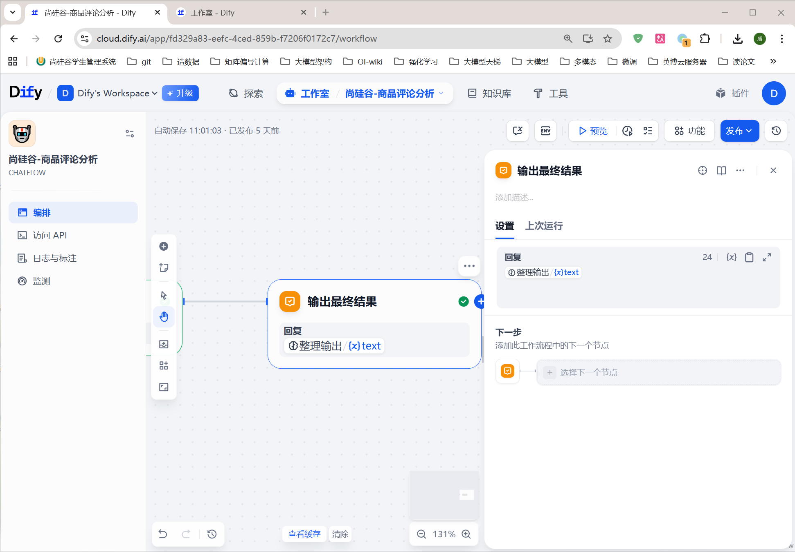

输出节点无法测试。

## 2.全流程测试

### 1.配置输入


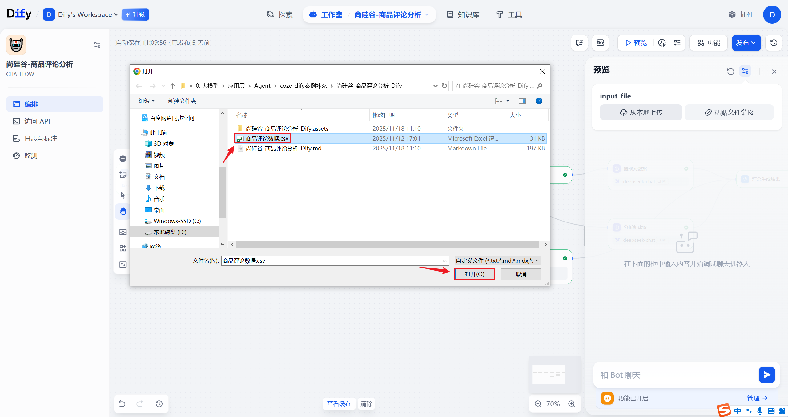


对话流不能单独发送文件，必须搭配文字。

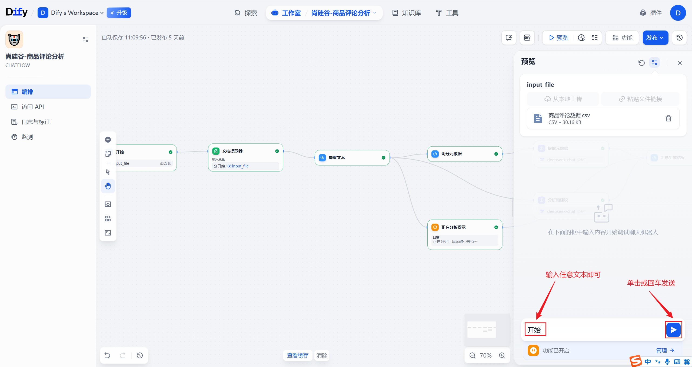


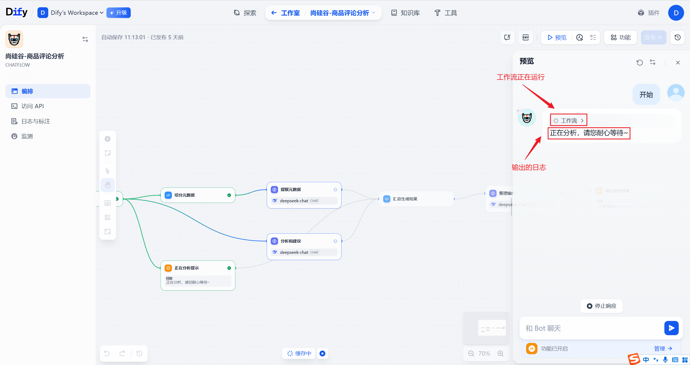

### 2.查看工作流详情及调试


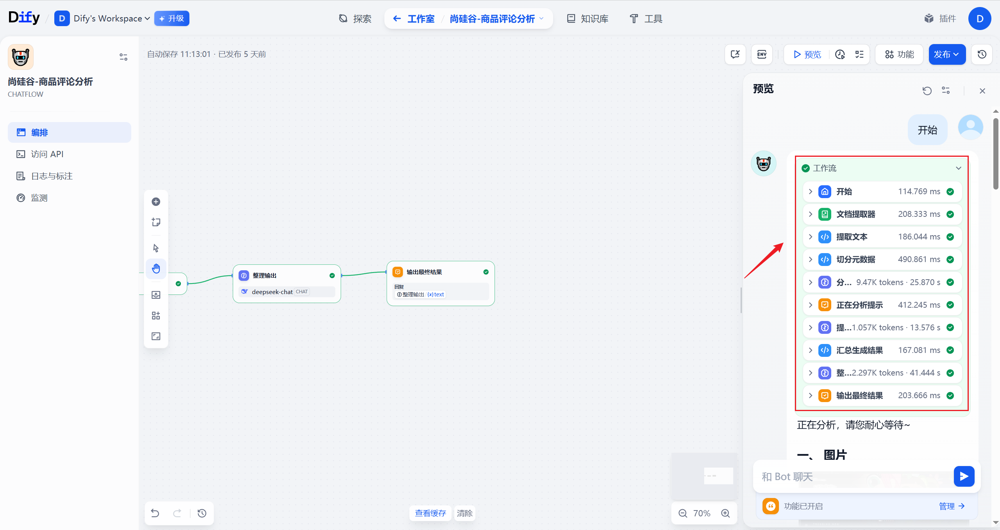


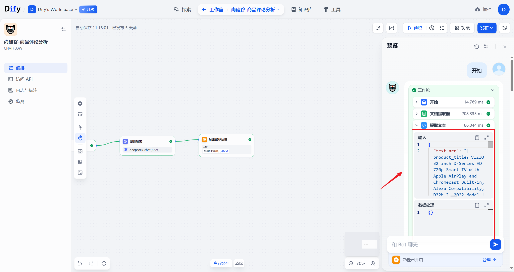

### 3.最终输出


输出如下

```
正在分析，请您耐心等待~
# 一、 图片


# 二、 商品跳转链接
[https://www.amazon.com/-/zh/dp/B094RKDNMZ/ref=sims_dp_d_dex_popular_subs_t1_v6_d_sccl_2_6/145-6930307-1678620?pd_rd_w=xQWmL&content-id=amzn1.sym.7e9f1c55-8db7-45c5-bfbf-adf1bc16de34&pf_rd_p=7e9f1c55-8db7-45c5-bfbf-adf1bc16de34&pf_rd_r=3NVT4J6HG1720G4Z1QMH&pd_rd_wg=Rgbjt&pd_rd_r=ada5fa29-2a7d-44db-99fc-642b1a6d2041&pd_rd_i=B094RKDNMZ&th=1](https://www.amazon.com/-/zh/dp/B094RKDNMZ/ref=sims_dp_d_dex_popular_subs_t1_v6_d_sccl_2_6/145-6930307-1678620?pd_rd_w=xQWmL&content-id=amzn1.sym.7e9f1c55-8db7-45c5-bfbf-adf1bc16de34&pf_rd_p=7e9f1c55-8db7-45c5-bfbf-adf1bc16de34&pf_rd_r=3NVT4J6HG1720G4Z1QMH&pd_rd_wg=Rgbjt&pd_rd_r=ada5fa29-2a7d-44db-99fc-642b1a6d2041&pd_rd_i=B094RKDNMZ&th=1)

# 三、 负面评论总数量
- 3星评论数量：23
- 2星评论数量：19
- 1星评论数量：58

# 四、产品分析（analysis）

## 4.1 产品本身
1. 硬件质量问题严重：屏幕显示问题包括亮度不均匀、出现亮点、绿色条纹、雪花状画面
2. 组装缺陷：塑料边框未完全贴合导致漏光
3. 接口故障：HDMI端口不工作、缺少以太网端口
4. 螺丝质量问题：螺丝断裂、尺寸不匹配、缺少螺丝
5. 软件系统问题突出：系统运行缓慢，菜单加载时间长，操作响应延迟
6. 频繁死机重启：观看过程中突然冻结，需要反复重启
7. 自动重启问题：无故自动开关机，需要拔插电源
8. 功能设计缺陷：蓝牙功能限制无法连接耳机或外部音响
9. 应用兼容性差：缺少主流应用，无法安装Disney+等
10. 区域限制：仅限美国和加拿大使用
11. 声音质量差：音量小，音质不佳

## 4.2 店铺服务
1. 售后服务不到位：超出退货期限后无法退货
2. 技术支持不足：客服无法解决实际问题
3. 维修服务缺失：产品出现问题后缺乏有效解决方案
4. 产品信息不准确：宣传有蓝牙功能但实际无法使用
5. 规格说明不清：缺少以太网端口但描述中声称有
6. 使用说明缺失：未提供详细操作手册

## 4.3 物流服务
1. 配送质量问题：包装破损，外箱严重损坏
2. 产品损坏：屏幕破裂、划痕
3. 配件缺失：缺少遥控器、螺丝等必要配件
4. 配送服务问题：产品放置不当，雨天放置在室外
5. 配送延迟：未按时送达

## 4.4 价格
1. 性价比低：产品质量与价格不匹配
2. 同价位其他品牌产品表现更好
3. 使用寿命短，价值损耗快

# 五、选品改进建议（suggestion）

1. 短期改进措施
   - 立即检查产品描述准确性，修正错误的功能说明
   - 加强产品质量检测，确保出厂产品无硬件缺陷
   - 改进包装设计，增加防护措施减少运输损坏
   - 提供详细的使用说明和故障排除指南

2. 中期优化方案
   - 升级软件系统，解决死机、重启等稳定性问题
   - 优化网络连接性能，改善WiFi连接稳定性
   - 增加应用商店内容，提供更多主流应用
   - 改进遥控器设计，提升用户体验

3. 长期发展建议
   - 建立更完善的售后服务体系
   - 加强产品质量控制流程
   - 开发更稳定的操作系统
   - 考虑取消区域限制，扩大产品适用范围
   - 建立用户反馈机制，持续改进产品设计
```
