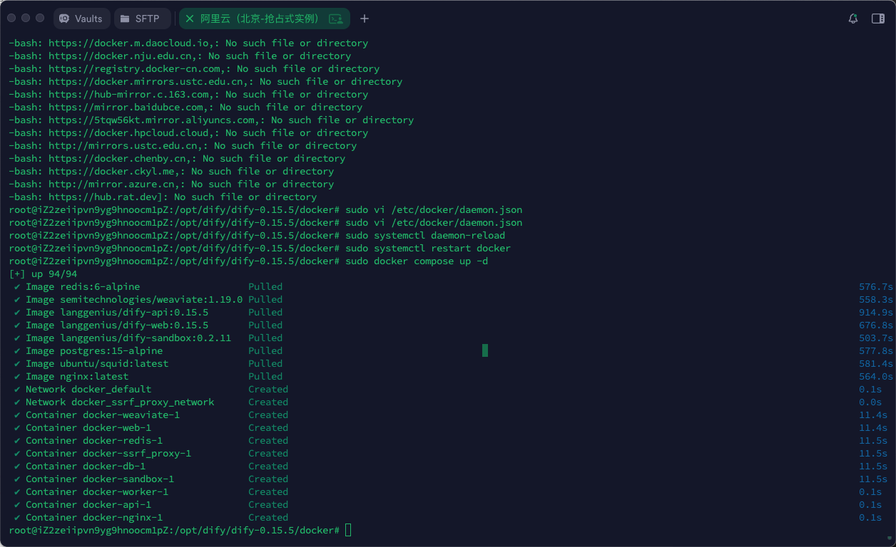
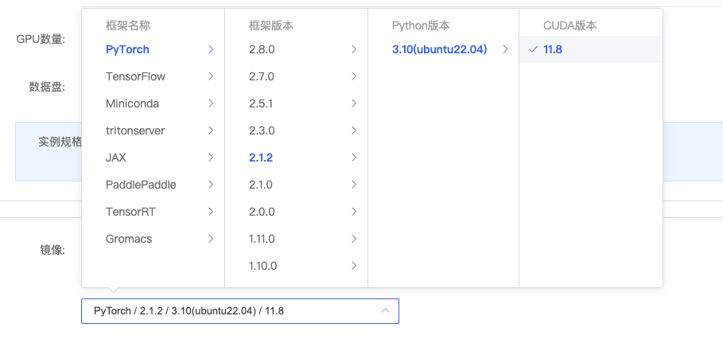

# 8 - 企业级大模型部署

本章面向**企业级私有化部署**：在自有机房或云服务器上部署 **Dify**（应用层）和 **Xinference**（模型托管与推理层），实现数据不出域、成本可控、模型版本可管的完整链路。内容偏实战，涉及租云服务器、装 Docker、部署 Dify、租 GPU 服务器、部署 LLM/Embedding/Rerank 及 Dify 对接自建模型。

**本章课程目标：**

- 理解**为什么要企业级部署**（数据安全、成本可控、能力可控、可观测运维），以及**技术架构**：应用层（Dify）→ 推理层（推理引擎/托管平台）→ 通过 OpenAI 兼容 API 连接。
- 理解**推理引擎**（vLLM、SGLang、Ollama、TEI 等）与**模型托管平台**（Xinference）的区别：引擎负责“跑模型”，托管平台负责“管模型、对外统一 API”；本章选型为 **Xinference** 统一托管 LLM、Embedding、Rerank。
- 完成 **Dify 私有化部署**：在腾讯云等租一台 CPU 服务器 → 安装 Docker → 下载 Dify（推荐 0.15.5）→ 配置 .env 并 `docker compose up` → 能通过浏览器访问并配置在线大模型（或后续对接自建 Xinference）。
- 完成 **Xinference 部署**：在 AutoDL 等租 GPU 服务器 → 准备 conda 环境 → 安装并启动 Xinference → 部署 LLM（云端模型或本地文件）、Embedding、Rerank 并会用 WebUI/curl 测试。
- 掌握 **Dify 对接 Xinference**：在 Dify 中安装 Xinference 插件，添加 LLM、Embedding、Rerank 模型，使 Dify 应用使用自建私有模型。

**前置知识建议：** 建议先掌握 [第 3 章](3-基于Coze&Dify平台的智能体开发.md) 中 Dify 的基本使用，以及 [第 7 章](7-Dify的Windows平台部署.md) 的 Docker + Dify 本地部署思路；具备基本 Linux 命令行（cd、cp、权限、systemctl）和远程连接工具（XShell/Finalshell 等）更佳。若未接触过 GPU 服务器，按文档「租机 → 连接 → 学术加速」顺序操作即可。

**入门阅读提示：** 第 1 节先建立「应用层 + 推理层 + 选型」的全局图景，重点看懂 1.3 中**推理引擎 vs 托管平台**的辨析和**最终选型（Xinference）**；第 2 节按「租服务器 → Docker → Dify」顺序做，第 3 节按「租 GPU → Xinference → 部署三类模型 → Dify 插件对接」顺序做。遇到镜像/网络问题可多试几次或参考 [8.1 - Docker 入门与 Dify 部署常见问题](8.1-Docker入门与Dify部署常见问题.md)。

---

## 1、企业级大模型部署概述

### 1.1 为什么要部署？

企业部署大模型，不是为了解决“能不能用”，而是必须把敏感数据和服务的控制权牢牢掌握在自己手里。要想数据安全，就需要实现`私有化的部署`。这里包括大语言模型、嵌入模型、重排序模型以及多模态模型等。

|              | 第三方 API                     | 企业级部署                                  |
| ------------ | ------------------------------ | ------------------------------------------- |
| **安全合规** | 敏感数据泄漏                   | 数据掌握在企业手中                          |
| **成本预算** | 高频调用成本不可控             | 成本可预测（服务器购买/租赁和运维<br>成本） |
| **能力可控** | 黑箱与版本漂移                 | 推理性能、模型版本可定制                    |
| **可靠性**   | 延迟、吞吐不可控               | 内网低延迟、弹性扩缩容自由调整<br>吞吐量    |
| **运维治理** | 模型服务不透明，不利于定位故障 | 模型服务可观测，支持故障定位和治理          |

> 注：版本漂移是指第三方更改版本，系统行为发生不可控变化

### 1.2 技术架构

- `应用层`：
  - 使用 Dify 构建大模型应用
  - 提供统一的 Web UI 和 API 接口
- `模型推理层`：
  - 使用独立的推理框架托管大模型：vLLM / SGLang / Ollama / HuggingFace TEI
    - 相应的大模型：Qwen / LLaMA / Baichuan
  - 运行在云 GPU 服务器，提供高性能推理服务
- `连接方式`：
  - 通过标准 OpenAI-compatible API 进行调用

调用路径（从上到下）：


**这种架构的优势在于**：

- `技术解耦`

  - 模型可独立升级、替换
  - 应用开发不依赖具体模型实现

- `有利于运维治理`
  - 统一入口（标准 OpenAI-compatible API 调用）可以做统一鉴权、限流、审计等
  - 推理层可以被独立运维，单独监测 QPS（Queries Per Second）、TTFT（Time To First Token）、TPS（Tokens Per Second）、GPU 利用率等指标

### 1.3 框架选型

#### 1.3.1 推理引擎

**① 本地开发 / 个人使用（最快跑起来、最少运维）**

核心目标是：上手简单、快速验证，但通常**不擅长多租户/高并发/多卡集群部署**。

- **Ollama**：由 Ollama Inc.公司开发，是部署大模型`最简单`的方式，但`推理效率低`，`不适合高并发场景`。
- **llama.cpp**：由 Georgi Gerganov 个人开发的开源项目，纯 C/C++实现的 LLaMA 模型推理库。尤其适合 CPU/边缘设备/低成本部署。

> 结论：企业级部署不考虑 Ollama 和 llama.cpp。

**② 高并发推理引擎**

这类引擎使用门槛稍高，但可以**充分发挥 GPU 性能**，适合企业**高并发**场景。

- **vLLM**：来自加州大学伯克利分校的 Sky Computing 实验室，采用了 PagedAttention、Prefill 与 Decode 分离等多种优化策略，`追求极致推理性能`，支持英伟达 GPU、AMD GPU 和华为昇腾等`多种硬件平台`，支持`多卡并行`推理。主要`支持LLM部署`。
- **SGLang**：也是在 Sky Computing 实验室诞生，同样采用了类似的优化策略，不同的是，SGLang 面向`应用编排/结构化生成`，对同一个应用多次调用请求的场景做了优化，底层通过合并、复用、调度优化等策略`减少模型实际进行的推理次数`，进一步提升推理性能。

- **HuggingFace TEI（Text Embedding Inference）**：Huggingface 官方推出的工具包，专为高效`部署嵌入模型`设计。

> 结论：通常 vLLM 的性能就足够支撑企业高并发场景调用了。

#### 1.3.2 模型托管平台

这类平台**把模型当成服务管理起来**，底层可以配置不同的推理引擎。

- **Xinference（Xorbits Inference）**：杭州未来速度科技有限公司的大模型管理和推理服务平台，致力于打造一体化解决方案。支持`LLM`、`Embedding`、`Rerank`等多种模型托管。

> **辨析：Xinference 是推理引擎吗？**  
> **不是**。Xinference 与 Ollama、vLLM、SGLang 不属于同一层级：
>
> - **推理引擎**（vLLM、SGLang、Ollama、llama.cpp、TEI 等）：直接负责在 GPU/CPU 上执行模型计算，是“真正跑模型”的底层软件。
> - **模型托管平台**（Xinference）：负责模型的下载、管理、生命周期和对外 API，**底层可选用**某一种或多种推理引擎。例如部署 LLM 时，Xinference 通常选用 **vLLM** 作为引擎；部署 Embedding 时则使用自带的嵌入推理实现。  
>   可以理解为：推理引擎 = 干活的“发动机”，模型托管平台 = 管多台发动机、统一对外提供服务的“调度中心”。

> **推理引擎和 LLM、嵌入模型、重排序模型是什么关系？**
>
> - **模型**（LLM、Embedding、Reranker 等）是“权重 + 网络结构”，本身不能自己跑，必须被某个程序加载并在 GPU/CPU 上执行，这个程序就是**推理引擎**。
> - **推理引擎**负责：加载模型文件 → 在硬件上做前向计算 → 把结果返回。不同引擎针对不同模型类型做了优化（例如 LLM 要逐 token 生成、需要 KV 缓存，嵌入/重排序通常只需一次前向）。
> - **对应关系**：同一类模型可以由不同引擎来跑（如 LLM 可用 vLLM 或 SGLang）；一个引擎往往只擅长某一类模型（vLLM 主打 LLM，TEI 主打 Embedding）。因此部署时既要选“用什么模型”，也要选“用哪个引擎来跑这个模型”。

#### 1.3.3 选型

**大语言模型（Large Language Model, LLM）：**可以用 vLLM、SGLang、或者 Xinference+vLLM 引擎部署。

**嵌入模型（Embedding Model）：**可以用 Huggingface TEI 和 Xinference 部署。

**重排序模型（Reranker / Re-ranking Model）：**目前调研的产品，除了 Ollama 和 llama.cpp，只有 Xinference 支持这类模型的部署。

**最终选型：**

选定 Xinference 平台作为模型托管与推理服务框架，部署大语言模型、嵌入模型和重排序模型。原因如下：

① 接口统一：可以向外提供统一的 API 接口，像大模型厂商那样一个链接管理多个模型。

② 针对 LLM：结合 vLLM 引擎部署 LLM，可以获得`极高的推理性能`。

③ 针对嵌入模型和重排序模型：嵌入模型和重排序模型只需要一次前向，和逐 token 生成的大语言模型相比，`资源开销要小得多`，因此对性能要求不高。Xinference 也支持这两种模型部署，这样我们可以用一个平台管理所有模型，`运维成本低`。

#### 1.3.4 整体调用关系

整体图示如下：


**问题：这个项目中只把 Dify 安装在了 Docker 中。Xinference 直接部署在 GPU 服务器，没有在 Docker 中。为什么？**

首先说，Xinference 是可以部署到 Docker 中的。但是 Xinference 中模型推理需要消耗大量 GPU，而 Docker 容器默认无法直接使用宿主机 GPU，需额外配置（如 NVIDIA Container Toolkit）才能使用 GPU。所以：

方案 1：Xinference 不安装在 Docker 中

方案 2：Xinference 安装在 Docker 中，但是需要额外安装其他的软件，支持 GPU 的调用。

这里使用方案 1，只将 Dify 安装到 Docker 中，Xinference 不安装到 Docker 中。

> **可这样记：** 整条链路可以记成「**Dify（应用）→ OpenAI 兼容 API → Xinference（托管）→ vLLM/TEI 等（引擎）→ 模型**」。Dify 只负责编排应用，不负责算模型；算模型在 GPU 服务器上由 Xinference + 推理引擎完成。这样应用和模型可以分开扩容、各自运维。

## 2、Dify 平台私有化部署

### 2.1 Dify 平台的介绍（复习）

Dify 作为一个综合性的 LLM 应用开发平台，内置了构建现代生成式 AI 应用所需的几乎所有关键技术栈。

它的具体功能如下：

- 基于 Agent 架构构建智能体应用
- 基于 RAG 构建私有知识库应用
- 基于 Workflow 构建智能工作流应用

Dify 是当今最优雅、门槛最低、最受欢迎、效果最好的大模型开发平台之一。

> 无论是经验丰富的程序员还是初涉 AI 领域的团队（如产品经理、运营人员），都能够快速、高效地搭建并运营生产级别的生成式 AI 应用。

官网：https://dify.ai/zh

文档说明：https://github.com/langgenius/dify/blob/main/README_CN.md

> 说明：访问 Dify 官网需要魔法（或梯子、科学上网）

### 2.2 租赁 Dify 服务器：腾讯云

企业用户可以选择租用云服务器，或者在本地的服务器中部署 Dify。因为 Dify 所需的资源很小，一个轻量级的服务器足以支持运行。

我们需要租赁一个云服务器去运行 Dify 服务：腾讯云。

官网：https://cloud.tencent.com/

#### 2.2.1 基础配置

https://buy.cloud.tencent.com/cvm

如果是企业中使用或者个人资金充裕且业务稳定的话，可以选择长租使用。期望优惠的话，可以选择竞价实例。竞价实例，在性能和稳定性上，与按量计费模式没有差别。

> 竞价实例，只要有人租长期的服务器就有可能把你的服务器踢掉，实例被竞价释放也是有解决办法的，后续会去讲。


地域选择：没有要求，自己根据需要选即可。

实例配置：根据自己需求选择，无具体要求。这里我选择 4 核 8GB。


镜像：选择 CentOS、Ubuntu 都可以，这里使用了 Ubuntu。选择后点击下一步。


#### 2.2.2 设置网络和主机

拉满带宽上限，新建安全组，把常用的端口都开启：


命名实例，设置密码，进行下一步：


开通：


#### 2.2.3 登录(使用 Xshell 或 finalshell 或 windTerm)


创建好了，通过这个公网 IP，端口使用 22，账号 ubuntu，密码使用你设置的密码。使用你的远程连接工具 XShell 或 FinalShell 连接即可。

XShell 界面如下：


### 2.3 部署 Docker

部署 Dify 平台，需要基于 Docker 环境，而腾讯云新购的云服务器默认未预装 Docker。接着，需要在腾讯云租用的服务器中部署 Docker。

**什么是 Docker？**


Docker 是一种容器化技术，相较于传统的通过虚拟机技术实现的虚拟化方案来说，Docker 是⼀种更加轻量级的虚拟化解决方案。

**它可以将应用程序及其依赖项打包成一个独立的容器，并在不同的环境中运行。**通过 Docker 容器， 开发者可以轻松地构建、部署和运行应用程序，而无需担心环境配置和依赖问题。


**使用 Docker 的好处：**

- `一次构建，到处运行`：你在自己电脑上开发测试好的程序，打成 Docker 镜像后，可以保证在生产服务器上跑起来的效果一模一样。再也不会出现“在我电脑上是好的啊！”这种问题。
- `环境隔离`：你可以同时运行一个项目的 Python 2 版本和 Python 3 版本，它们互不影响。
- `快速部署与扩展`：因为容器非常轻量，你可以瞬间启动成百上千个一样的容器来应对高流量（比如双十一抢购）。
- `简化配置`：环境配置都写在了“材料包”（镜像）里，新人接手项目时，不需要花几天时间配环境，直接一条命令就能让程序跑起来。

**场景：**

假设你开发了一个网站。

- **传统方式：** 你需要给运维人员一份长长的《环境配置手册》：“请先安装 CentOS 7，然后安装 Python 3.8.2，再安装 Nginx 1.18.0，配置如下……”。步骤繁琐，极易出错。
- **Docker 方式：** 你直接把整个网站和环境打包成一个 Docker 镜像。运维人员只需要执行一句简单的命令：`docker run [你的镜像名]`，一个完整、可运行的网站环境就在一秒内启动了。

按照下面的指令一步一步进行操作

```bash
#更新软件包
sudo apt update

sudo apt upgrade

#安装docker依赖
sudo apt install software-properties-common

sudo apt-get install ca-certificates curl gnupg lsb-release

#添加Docker官方GPG密钥
curl -fsSL http://mirrors.aliyun.com/docker-ce/linux/ubuntu/gpg | sudo apt-key add -

#添加Docker软件源（输入后根据提示按Enter）
sudo add-apt-repository "deb [arch=amd64] http://mirrors.aliyun.com/docker-ce/linux/ubuntu $(lsb_release -cs) stable"

#安装docker（输入后根据提示输入 y ）
sudo apt-get install docker-ce docker-ce-cli containerd.io --fix-missing
```

执行`sudo apt upgrade`的时候会出现这个界面，按回车即可


之后如果在这个界面卡住，按几下回车即可。

安装完毕，启动 docker，并查看状态

```bash
sudo systemctl start docker

sudo systemctl status docker
```

如图所示即为启动成功


> 看到 running 状态说明 docker 已经正常启动

**注意：安装过程中如果报错如下：**


可以按如下操作步骤执行：

| 步骤                           | 关键检查点/操作                                                                                                           | 预期结果/说明                                                                  |
| :----------------------------- | :------------------------------------------------------------------------------------------------------------------------ | :----------------------------------------------------------------------------- |
| 1. 验证 Docker 安装状态        | 运行 sudo systemctl status docker                                                                                         | 确认 Docker 服务当前的状态和错误日志。                                         |
| 2. 检查并取消服务屏蔽          | 执行 sudo systemctl unmask docker.service                                                                                 | 解决服务被意外“屏蔽”导致无法启动的问题。                                       |
| 3. 检查依赖服务状态            | 运行 systemctl list-dependencies docker.service.<br>如果 containerd 服务异常，尝试启动它：sudo systemctl start containerd | 查看 Docker 依赖的服务（如 containerd）是否正常。<br>如果启动失败，进入第 4 步 |
| 4. 修复 containerd（关键步骤） | 执行：① sudo apt-get update<br>② sudo apt-get install --reinstall containerd.io                                           | 重新安装 Docker 的核心运行时依赖。                                             |

如果以上步骤均无效，可以考虑彻底清理 Docker 及其相关组件后重新安装。这是解决文件损坏或版本冲突的可靠方法。

彻底卸载 Docker：

```bash
sudo apt-get purge docker-ce docker-ce-cli containerd.io
sudo rm -rf /var/lib/docker
sudo rm -rf /var/lib/containerd
```

### 2.4 部署 Dify

官网：https://github.com/langgenius/dify

文档：https://docs.dify.ai/zh-hans/getting-started/install-self-hosted/docker-compose

安装 Dify 之前, 请确保你的机器已满足最低安装要求：

- CPU >= 2 Core
- RAM >= 4 GiB

#### 2.4.1 下载

> 注意：新版本 Dify 本地部署可能会出现各种兼容问题，强烈推荐**0.15.5**版本，稳定，功能效果一致！

在`/opt`下创建一个 dify 目录，用于存储 dify 源码：

```cmd
cd /opt
sudo mkdir dify #用于存储dify源码包
```

##### 方式 1：离线下载包(推荐)

**离线下载源码包**（科学上网）

下载地址：https://github.com/langgenius/dify/releases/tag/0.15.5


> 注意：网络不好的同学，可在网盘资料中查看使用。

利用远程连接工具（比如：XFTP）将 dify 源码包传递到服务器 /opt/dify 文件夹中，并解压即可：


上传可能失败（因为默认 ubuntu 用户权限不足），解决办法如下

```bash
# 方式1：赋予指定用户指定目录的完全权限（使用777）
# 在Ubuntu终端xshell执行：sudo chmod -R 777 /目标目录的完整路径
sudo chmod -R 777 /opt/dify

# 方式2：先将文件上传到您的用户主目录（如 /home/ubuntu），这个目录通常有写入权限
# 然后使用XShell或终端，通过命令移动文件：sudo mv /home/ubuntu/文件名 /目标/path/
```

进行解压：

```cmd
#进入dify目录,在opt目录下执行：
cd ./dify
#解压
sudo tar -zxvf dify-0.15.5.tar.gz

cd /opt/dify/dify-0.15.5

pwd # 输出 /opt/dify/dify-0.15.5
```


##### 方式 2：Gitee 下载

如果使用 GitHub 下载过慢，还可以使用码云（Gitee）或镜像网站替代 GitHub 直接下载，利用国内服务器加速。

操作步骤：

1）注册码云账号（[https://gitee.com ](https://gitee.com/)）。

2）在码云新建仓库，选择「导入 GitHub 仓库」，粘贴 `https://github.com/langgenius/dify.git ` 的链接 。

3）导入完成后，使用码云生成的仓库地址克隆：

```bash
sudo git clone https://gitee.com/你的用户名/dify.git
```

这里大家也可以直接使用我的链接：

```bash
sudo git clone https://gitee.com/shkstart/dify.git
```


#### 2.4.2 使用 docker 启动 Dify

1. 进入 Dify 源代码的 Docker 目录：

   ```cmd
   cd /opt/dify/dify-0.15.5/docker
   ```

2. 复制环境配置文件

   ```bash
   sudo cp .env.example .env
   ```

3. 启动 Docker 容器

   根据你系统上的 Docker Compose 版本，选择合适的命令来启动容器。你可以通过 ` docker compose version` 命令检查版本，详细说明请参考 [Docker 官方文档](https://docs.docker.com/compose/#compose-v2-and-the-new-docker-compose-command)：

   - 如果版本是 Docker Compose V2，使用以下命令（课程对应版本）：

     ```bash
     sudo docker compose up -d
     ```

   - 如果版本是 Docker Compose V1，使用以下命令：

     ```bash
     sudo docker-compose up -d
     ```

   说明：Docker 会自动帮你：拉取需要的镜像 → 创建容器 → 按顺序启动所有服务 → 后台运行。

4. 运行命令后，你应该会看到类似以下的输出，显示所有容器的状态和端口映射：

   注意：第一次拉取镜像，时间可能会很长，实测约将近十分钟。

   

```cmd
[+] Running 11/11
 ✔ Network docker_ssrf_proxy_network  Created
 ✔ Network docker_default             Created
 ✔ Container docker-redis-1           Started
 ✔ Container docker-ssrf_proxy-1      Started
 ✔ Container docker-sandbox-1         Started
 ✔ Container docker-web-1             Started
 ✔ Container docker-weaviate-1        Started
 ✔ Container docker-db-1              Started
 ✔ Container docker-api-1             Started
 ✔ Container docker-worker-1          Started
 ✔ Container docker-nginx-1           Started
```

5. 最后检查是否所有容器都正常运行：

   ```cmd
   sudo docker compose ps
   ```

   在这个输出中，你应该可以看到包括 3 个业务服务 `api / worker / web`，以及 6 个基础组件 `weaviate / db / redis / nginx / ssrf_proxy / sandbox` 。


6. 停止 Dify 运行

```cmd
#一键关停所有相关容器，干净不残留
docker compose down
```

7. 同步环境变量配置（重要！）

- 如果 `.env.example` 文件有更新，请务必同步修改你本地的 `.env` 文件。

- 检查 `.env` 文件中的所有配置项，确保它们与你的实际运行环境相匹配。你可能需要将 `.env.example` 中的新变量添加到 `.env` 文件中，并更新已更改的任何值。

#### 2.4.3 常见问题解决

**问题 1：安装 Dify 常见问题和解决方案**

```cmd
sudo docker compose up -d
```

执行失败，大概率会由于网络问题或镜像缺失问题发生报错。


进行镜像源的配置

```bash
sudo vi /etc/docker/daemon.json
```

添加下面的配置

```bash
{
    "registry-mirrors": [
    "https://docker.unsee.tech",
    "https://dockerpull.org",
    "https://docker.1panel.live",
    "https://dockerhub.icu",
    "https://docker.m.daocloud.io",
    "https://docker.nju.edu.cn",
    "https://registry.docker-cn.com",
    "https://docker.mirrors.ustc.edu.cn",
    "https://hub-mirror.c.163.com",
    "https://mirror.baidubce.com",
    "https://5tqw56kt.mirror.aliyuncs.com",
    "https://docker.hpcloud.cloud",
    "http://mirrors.ustc.edu.cn",
    "https://docker.chenby.cn",
    "https://docker.ckyl.me",
    "http://mirror.azure.cn",
    "https://hub.rat.dev"]
}
```

**在 vi 中保存并退出**：按 `Esc` 确保进入命令模式，输入 `:wq` 回车（保存并退出）；若放弃修改则输入 `:q!` 回车。

保存后，在终端重新启动 Docker：

```bash
# 重新加载配置并重启 Docker（修改了 /etc 下配置，通常需要 sudo）
sudo systemctl daemon-reload
sudo systemctl restart docker
```

重新执行：

```bash
sudo docker compose up -d
```

开始正常下载了：


**问题 2：可能出现报错，报错如下**


于是根据报错信息检查

```bash
sudo vi /etc/apparmor.d/tunables/home.d/ubuntu
```

删除掉报错信息中第七行的多余字符即可


重新运行，成功


#### 2.4.4 访问

你可以先前往管理员初始化页面设置管理员账户：

```bash
# 服务器环境
http://your_server_ip/install   #your_server_ip即为配置的腾讯云服务器地址
```


如图所示为成功访问，进行注册登录即可


**注意：如果一直无法加载进去，则需要重启 Docker 再次尝试**

#### 2.4.5 设置快照

为避免案例中的竞价实例被释放，可以在控制台中的快照中设置快照策略，即使被释放了也能保存快照，从而快速恢复


再次进入定期快照策略，可发现已设置成功。

### 2.5 配置在线大模型

如果想调用线上的 LLM，则可以用 Dify 选择线上的模型运营商。比如说可以在模型运营商中选择 DeepSeek。


DeepSeek 官网地址：https://www.deepseek.com/ ，在官网获取自己的 API Key 即可配置后使用


在这里可以使用平台提供的在线大模型服务（运营商），但是考虑到可能存在的数据安全问题，所以我们自己部署 Xinference，进而部署私有的大模型。


## 3、模型部署

### 3.1 租赁 GPU 服务器：AutoDL

**AutoDL 介绍**

这里我们选用 AutoDL 平台租赁服务器。这是一款面向开发者和企业的云计算平台，主要提供高性价比的`GPU算力资源`，支持 AIGC、深度学习、云游戏、渲染测绘、元宇宙、HPC 等应用。

**平台地址：**https://www.autodl.com/

> AutoDL 服务器的资源比较紧俏，且比较贵
>
> - 一台机器开机一个小时平均花费 2 元
> - `建议`：一般早上开始工作的时候开机，在结束一天工作的时候关机。

#### 3.1.1 配置服务器+镜像

选择服务器：

这里可以选择西北 B 区的单卡 4090 作为我们的服务器，我们需要租赁一台服务器部署 Xinference。

注意：在 AutoDL 平台上，仅开放 6006 端口。


> 注意：
>
> 1、这里推荐“西北地区”，因为会提供公网 IP，其他地区不确定。
>
> 2、GPU 推荐 RTX4090，3090，3080 等，其他显卡可能会出现后续不兼容情况。

选择镜像版本：



界面中的「框架」是 AutoDL 预装好的基础环境，不同框架用途不同，可做大致区分：

| 框架             | 简要说明                                                                                                          |
| ---------------- | ----------------------------------------------------------------------------------------------------------------- |
| **PyTorch**      | 主流深度学习框架，用于训练和推理。vLLM、Xinference 等推理栈多基于 PyTorch，**本教程部署 Xinference 建议选此项**。 |
| **TensorFlow**   | 另一大深度学习框架，生态多用于训练与部署，与 PyTorch 二选一即可。                                                 |
| **Miniconda**    | 轻量版 conda，只提供 Python 与包管理，无预装深度学习框架，适合自己从零配环境。                                    |
| **tritonserver** | NVIDIA Triton 推理服务，用于高性能模型部署，多与 TensorRT 等配合使用。                                            |
| **JAX**          | 面向数值计算与研究的框架，强调高性能与函数式写法，偏研究/实验场景。                                               |
| **PaddlePaddle** | 百度开源深度学习平台，国内生态常用。                                                                              |
| **TensorRT**     | NVIDIA 的推理优化库，侧重在 NVIDIA GPU 上加速推理，常与推理服务一起用。                                           |
| **Gromacs**      | 分子动力学模拟软件，与深度学习无直接关系，属科学计算/生物物理方向。                                               |

**本教程建议**：选择 **PyTorch** 对应镜像，Python 选 **3.10**，CUDA 选 **11.8**（或与当前显卡驱动兼容的版本）。这样便于在实例中直接使用 conda 安装并运行 Xinference。


#### 3.1.2 XShell 连接登录

复制该服务器的登录指令，通过远程连接工具进行登录


测试连接：

> 默认的用户名：root


连接成功

#### 3.1.3 开启学术资源加速

为下载一些外网的资源（比如 GitHub、HuggingFace 等），需要在**当前终端中**开启`学术资源加速`

> 免不了我们要在这个系统上安装一些软件。这些软件可能来自于如下的红框的位置。默认是下载不了的。那么就需要魔法或科学上网。这里我们称为：学术加速。

https://www.autodl.com/docs/network_turbo/


将图中框选的一行复制到终端输入即可

```bash
source /etc/network_turbo
```


### 3.2 部署 XInference

#### 3.2.1 准备 conda 环境

##### ① 创建 conda 环境

AutoDL 的系统盘大小为 30GB，数据盘大小为 50GB，conda 的默认工作路径在系统盘下，Xinference 全家桶需要的空间比较大，可能导致系统盘被占满，因此将 conda 环境创建在数据盘下。

```shell
conda create -p /root/autodl-tmp/conda_envs/xinfer_env python=3.10
```

##### ② 初始化 conda 环境

```shell
conda init bash

source ~/.bashrc
```

##### ③ 激活 conda 环境

```shell
conda deactivate

conda activate /root/autodl-tmp/conda_envs/xinfer_env
```

##### ④ 验证 conda 是否创建成功

若 `python` 和 `pip` 的路径均指向该 conda 环境目录，则创建成功。

```shell
which python

which pip
```


#### 3.2.2 部署 XInference

AutoDL 学术加速默认使用阿里云作为 PyPI 源，该镜像环境中可能缺少 XInference 所需的 num2words 等依赖而导致报错，因此将清华源作为备用源。

```shell
pip install "xinference[vllm,embedding,rerank,transformers]==1.16.0" \
--extra-index-url https://pypi.tuna.tsinghua.edu.cn/simple
```

可以把安装服务放在后台

```shell
nohup pip install "xinference[vllm,embedding,rerank,transformers]==1.16.0" --extra-index-url https://pypi.tuna.tsinghua.edu.cn/simple >xinfer_install.log 2>&1 &
```

日志记录在 xinfer_install.log，执行以下命令可以监听日志

```shell
tail -F xinfer_install.log
```

#### 3.2.3 启动 XInference 服务端

```shell
XINFERENCE_MODEL_SRC=modelscope xinference-local --host 0.0.0.0 --port 6006
```

XINFERENCE_MODEL_SRC=modelscope 的作用是将默认的模型仓库从**Huggingface**更换为**魔搭**。

--host：指定监听网卡，0.0.0.0 表示监听所有网卡的请求

--port：指定服务端口，默认 9997

#### 3.2.4 访问 XInference WebUI

##### ① 查看 AutoDL 自定义服务地址


AutoDL 的云 GPU 服务器默认会将 6006 和 6008 映射为服务，Xinference 服务端监听了 6006 端口，访问对应链接即可访问 Xinference 的 WebUI。

##### ② 访问 Xinference 的 WebUI


### 3.3 部署 LLM（大语言模型）

#### 3.3.1 部署

##### ① 云端模型

我们可以让 Xinference 平台帮我们从模型仓库下载并启动模型，前提是该模型被官方收录并支持。

以 Qwen3-0.6B 为例，参考官方文档

> https://inference.readthedocs.io/zh-cn/latest/models/builtin/llm/qwen3.html


Xinference 把模型分成了很多模型族，每个模型族都包含一系列不同规模的模型，通过不同的属性配置区分。Qwen3-0.6B 的模型族为 qwen3，配置如上图所示。

新起一个连接窗口：激活 conda 环境

```
conda activate /root/autodl-tmp/conda_envs/xinfer_env
```

开启学术加速：

```
source /etc/network_turbo
```

启动命令如下：

```shell
xinference launch \
  --model-engine vllm \
  --model-name qwen3 \
  --size-in-billions 0_6 \
  --model-format pytorch \
  --quantization none \
  --model-uid Qwen3-0.6B \
  --gpu_memory_utilization 0.6 \
  --max_model_len 1024 \
  --endpoint http://localhost:6006
```

`--model-engine vllm`：底层推理引擎

`--model-name qwen3`：模型族

`--size-in-billions 0_6`：模型规模，以 10 亿为单位

`--model-format pytorch`：权重文件格式

`--quantization none`：是否量化

`--model-uid Qwen3-0.6B`：模型 uid，用于在 Xinference 中唯一区分模型，可以省略，由系统生成

`--gpu_memory_utilization 0.6`：vLLM 参数，模型占用 GPU 显存的百分比（示例中为 0.6，可按需调整）

`--max_model_len 1024`：vLLM 参数，模型支持的上下文长度

`--endpoint`：Xinference 服务端入口

此时服务端可以看到模型正在下载。


模型部署完成


##### ② 本地模型文件

如果模型权重已被预下载到本地，可以执行以下命令。

```shell
xinference launch \
  --model-engine vllm \
  --model-name qwen3 \
  --size-in-billions 0_6 \
  --model-format pytorch \
  --quantization none \
  --model-path "${your_model_path}" \
  --model-uid Qwen3-0.6B \
  --gpu_memory_utilization 0.6 \
  --max_model_len 1024 \
  --endpoint http://localhost:6006
```

`--model-path`：模型权重本地存储路径。

#### 3.3.2 测试

##### ① 查看模型部署情况

```shell
xinference list \
  --endpoint http://localhost:6006
```


##### ② WebUI


##### ③ 发送请求

```shell
curl http://localhost:6006/v1/chat/completions -H "Content-Type: application/json" -d '{
        "model": "Qwen3-0.6B",
        "messages": [
                {"role": "system", "content": "你是个乐于助人的助理。"},
                {"role": "user", "content": "你好啊"}
        ]
}'
```

响应如下：


### 3.4 部署 Embedding 模型（嵌入模型）

#### 3.4.1 部署

##### ① 云端模型

```shell
xinference launch \
  --model-name bge-small-zh-v1.5 \
  --model-type embedding \
  --endpoint http://localhost:6006
```

`--model-name`：模型名称

`--model-type`：模型类型

正在下载


部署完成


##### ② 本地文件

```shell
xinference launch \
  --model-name bge-small-zh-v1.5 \
  --model-type embedding \
  --model-path "${your_model_path}" \
  --endpoint http://localhost:6006
```

`--model-path`：本地模型路径（模型权重所在目录）

#### 3.4.2 测试

##### ① 查看模型部署情况

```shell
xinference list \
  --endpoint http://localhost:6006
```


##### ② WebUI


##### ③ 发送请求

```shell
curl http://localhost:6006/v1/embeddings \
  -H "Content-Type: application/json" \
  -d '{
    "model": "bge-small-zh-v1.5",
    "input": "这是一个用于测试的中文句子"
  }'
```

响应如下：


### 3.5 部署 Rerank 模型（重排序模型）

#### 3.5.1 部署

```shell
xinference launch \
  --model-name bge-reranker-base \
  --model-type rerank \
  --endpoint http://localhost:6006
```

正在下载


部署完成


#### 3.5.2 测试

##### ① 查看模型部署情况

```shell
xinference list \
  --endpoint http://localhost:6006
```


##### ② WebUI


##### ③ 发送请求

```shell
curl http://localhost:6006/v1/rerank \
  -H 'Content-Type: application/json' \
  -d '
{
  "model": "bge-reranker-base",
  "query": "Apple",
  "documents": [
    "鸡蛋",
    "苹果",
    "good",
    "香蕉"
  ],
  "instruction": "基于查询结果重排序",
  "top_n": 4
}
'
```

响应如下：


### 3.6 Dify 对接 Xinference

#### 3.6.1 安装 Xinference 插件


搜索 Xinference


安装插件


安装完成后即可看到 Xinference


#### 3.6.2 添加 LLM


在 Xinference 插件下可以看到模型，则配置成功


#### 3.6.3 添加 Embedding 模型


#### 3.6.4 添加 Rerank 模型


---

**本章小结（便于复习）**

- **企业级部署** 解决的是数据安全、成本可控、能力与版本可控、可观测运维；架构为**应用层（Dify）+ 推理层（模型托管与推理引擎）+ OpenAI 兼容 API**。推理引擎（vLLM、SGLang、Ollama、TEI 等）负责在硬件上跑模型，**模型托管平台**（如 Xinference）负责管理多类模型、统一对外 API；本章选型为 **Xinference** 统一托管 LLM、Embedding、Rerank。
- **Dify 私有化**：在腾讯云等租 CPU 服务器（如 4 核 8GB、Ubuntu）→ 安装 Docker（遇问题可查 2.3 常见问题或 8.1）→ 下载 Dify（推荐 0.15.5，离线包或 Gitee）→ 进入 docker 目录复制 .env 并 `docker compose up -d` → 浏览器访问并完成初始化；可先配置平台提供的在线大模型，后续再改为自建 Xinference。
- **Xinference 部署**：在 AutoDL 等租 GPU 服务器（推荐 PyTorch + Python 3.10 + CUDA 11.8）→ 创建并激活 conda 环境 → 安装并启动 Xinference（注意端口如 6006、学术加速）→ 在 WebUI 或命令行部署 **LLM**（云端模型或本地文件）、**Embedding**、**Rerank**，并用 curl/WebUI 验证。
- **Dify 对接 Xinference**：在 Dify 中安装「Xinference」插件，填写 Xinference 服务地址（如 `http://AutoDL 实例:6006`），在插件下添加 LLM、Embedding、Rerank 模型；添加成功后，在创建应用时即可选择自建模型，实现全链路私有化。
- **排错提示**：Docker 启动失败可查 2.3 与 8.1；Dify 上传/解压权限不足用 chmod 或 mv 到有权限目录；Xinference 仅开放 6006 端口时需在 Dify 中填对地址与端口；模型拉取或下载失败可开学术加速或换源。

**建议下一步：** 先按第 2 节在腾讯云上把 Dify 跑通并能在浏览器使用；再按第 3 节在 AutoDL 上把 Xinference 及 LLM/Embedding/Rerank 部署并测试通过；最后在 Dify 中安装 Xinference 插件并添加自建模型，用一个小型 RAG 或 Agent 应用验证端到端调用。遇到具体报错可查阅 [8.1 - Docker 入门与 Dify 部署常见问题](8.1-Docker入门与Dify部署常见问题.md)。
