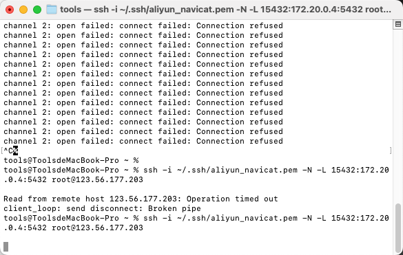
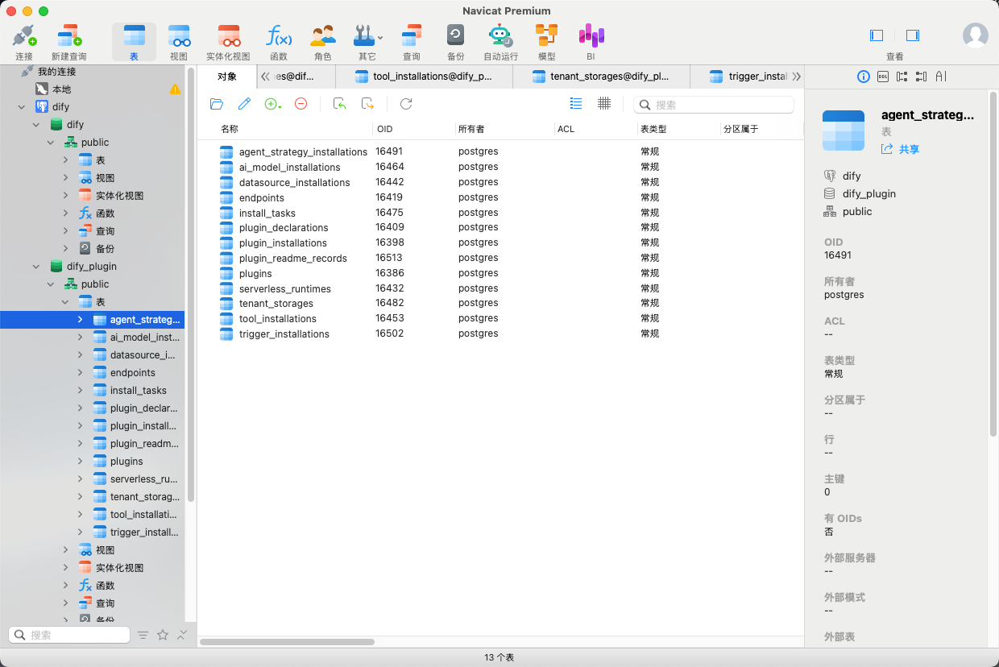

# 8.1 - Docker 入门与 Dify 部署常见问题

本文档配合 **[8 - 企业级大模型部署](8-企业级大模型部署.md)** 中 Dify 的部署与运维使用，汇总了在实操 Docker 与 Dify 时常见的问题和对应的 Docker 知识点。内容基于真实操作整理，**面向 Docker 零基础或入门读者**，便于系统学习与按问题查阅排错。

---

## 阅读前先搞清楚三件事（避免看懵）

| 问题                               | 说明                                                                                                                                                                                                                                   |
| ---------------------------------- | -------------------------------------------------------------------------------------------------------------------------------------------------------------------------------------------------------------------------------------- |
| **命令在哪里执行？**               | 文档里的命令，多数是在**已经部署了 Dify 的那台服务器**上执行的（不是在你自己的笔记本电脑上）。并且很多命令需要先**进入 Dify 的 docker 目录**再执行（例如 `cd /opt/dify/dify-1.11.4/docker`），否则会报错“找不到 docker-compose.yaml”。 |
| **需要先安装 Docker 吗？**         | 需要。本文档不教安装 Docker，只教“有了 Docker 和 Dify 之后怎么理解和操作”。若尚未安装，请先按 [8 - 企业级大模型部署](8-企业级大模型部署.md) 或 [Dify 官方文档](https://docs.dify.ai/) 完成安装。                                       |
| **文档里的路径、容器名要照抄吗？** | 不用。文中的 `/opt/dify/dify-1.11.4/docker`、`docker-db-1`、`docker-db_postgres-1` 等是**示例**，你的环境可能是别的路径或名字。遇到命令时，把**路径、容器名**换成你自己机器上实际的即可（容器名用 `docker ps` 可以看到）。             |

**几个词先混个脸熟（后面会细讲）：**

- **镜像（Image）**：像“安装包”，不运行，用来创建容器。
- **容器（Container）**：镜像跑起来之后的“进程”，可以启停、删掉。
- **数据卷 / volume**：存数据的地方，和容器分开，删容器一般不删它。
- **Compose**：用一份配置文件（如 `docker-compose.yaml`）一次性启动很多个容器的方式。

---

## 适用场景与受众

**适合谁读：**

- 刚接触 Docker，想先建立「镜像 / 容器 / 数据卷」等基本概念
- 部署或升级 Dify 时需要使用 Docker / Docker Compose，希望少踩坑
- 需要备份/恢复数据库、理解数据存在哪里、为什么删容器不一定丢数据
- 使用 Navicat 等工具连接 Dify 数据库，或阅读/修改 `docker-compose.yaml`

**文档结构：**

| 章节 | 主题                                      | 类型      | 说明                                            |
| ---- | ----------------------------------------- | --------- | ----------------------------------------------- |
| 1    | 容器、镜像与 Compose 的关系               | 概念      | 最基础：区分镜像/容器/Compose，看懂 `docker ps` |
| 2    | 宿主机目录与容器内目录（数据存在哪）      | 概念      | 理解「数据在宿主机还是容器里」、挂载是什么      |
| 3    | 删除容器会丢数据吗？                      | 概念/误解 | 结论：有 volume 时删容器不丢数据                |
| 4    | docker 目录里是什么（源码？数据？配置？） | 概念      | 分清 Docker 平台、Compose 配置、项目数据        |
| 5    | 用 Navicat 连接 Dify 数据库               | 实操      | 暴露端口或 SSH 隧道，安全连接                   |
| 6    | docker-compose.yaml 服务与架构说明        | 参考      | 各服务作用、端口、数据位置速查                  |
| 7    | Dify 版本升级完整流程                     | 实操      | 备份 →down→ 新版本 → 同步 .env→ 导入与排错      |
| 8    | 修改 Dify 前端源码并让改动生效            | 进阶      | 自建镜像与 docker-compose.override.yaml         |

---

## 1、概念：容器、镜像与 Compose 的关系

**常见疑问：**  
执行 `docker ps` 查看容器状态时，列表里出现的既有像 `docker-db_postgres-1` 这样的名字，也有像 `postgres:15-alpine` 这样的名称——它们到底是不同的镜像，还是不同的容器？


### 1.1 如何区分镜像和容器？

看 `docker ps` 输出中的格式即可判断：

- `docker-db_postgres-1`、`docker-api-1` 这种带 **-1、-2** 的名字 → **容器名**（NAMES 列）
- `postgres:15-alpine`、`redis:6-alpine`、`langgenius/dify-api:1.11.4` 这种带 **:tag** 的 → **镜像名**（IMAGE 列）

因此，每一行表示：**一个容器**是由**一个镜像**启动出来的实例。

例如某一行：

- **容器：** `docker-db_postgres-1`
- **镜像：** `postgres:15-alpine`

### 1.2 容器和镜像是什么关系？

> **✅ 镜像（Image）= “安装包 / 模板 / 只读文件系统”**

**类比：**

- 镜像像 Windows 安装 ISO
- 或像 Node 的 npm 包
- 或像 手机 App 安装包 APK

**特点：**

- 不运行
- 只负责提供“运行所需的文件、依赖、默认启动命令”

> **✅ 容器（Container）= “运行起来的实例 / 进程”**

**类比：**

- 你安装了微信（镜像）
- 你打开微信在运行（容器）

**特点：**

- 会运行
- 有进程、有日志、有端口、有内存占用
- 可以启动/停止/重启/删除

**核心关系一句话：**  
镜像是模板，容器是从模板创建并运行的实例。  
**一个镜像可以启动多个容器。**

### 1.3 Dify 的 docker 目录是“一套 Compose 应用”

**dify/docker**（例如 `/opt/dify/dify-1.11.4/docker`）既不是镜像，也不是容器，而是一套 **Docker Compose 部署配置**（由 YAML、.env 和 volumes 目录等组成）。

**它的作用是：**

- 用 `docker-compose.yaml` 描述要启动哪些服务（容器）
- 每个服务用哪个镜像
- 这些容器怎么连网络
- 端口怎么映射
- 数据挂载到哪里（volumes）

所以它更像：  
**“启动清单 + 配置文件集合”**（类似 `package.json` + `docker-compose.yml` 这种角色）

### 1.4 Dify 各容器与镜像对应关系（以 Dif 1.11.4 版本为例）

典型 Dify 部署中，运行中的容器与镜像对应关系如下：

**A. 基础组件（第三方镜像）**

- Postgres 容器 `docker-db_postgres-1` ← 镜像 `postgres:15-alpine` 用来存 Dify 的业务数据（账号、应用、工作流…）
- Redis 容器 `docker-redis-1` ← 镜像 `redis:6-alpine` 用来做缓存、队列、任务中间状态
- Weaviate 容器 `docker-weaviate-1` ← 镜像 `semitechnologies/weaviate:1.27.0` 向量数据库（知识库向量检索）
- Nginx 容器 `docker-nginx-1` ← 镜像 `nginx:latest` 对外入口（80/443），把请求转发给 web/api

**B. Dify 自己的服务（langgenius 的镜像）**

- API 容器 `docker-api-1` ← 镜像 `langgenius/dify-api:1.11.4` 后端接口（你看到 gunicorn 的就是它）
- Worker 容器 `docker-worker-1` ← 同镜像 `langgenius/dify-api:1.11.4` 后台任务执行（异步任务、索引、工作流等）
- Worker Beat 容器 `docker-worker_beat-1` ← 同镜像 `langgenius/dify-api:1.11.4` 定时任务调度（类似 cron）
- Web 容器 `docker-web-1` ← 镜像 `langgenius/dify-web:1.11.4` 前端页面
- Sandbox 容器 `docker-sandbox-1` ← 镜像 `langgenius/dify-sandbox:0.2.12` 用于安全执行代码（代码节点等）
- Plugin Daemon 容器 `docker-plugin_daemon-1` ← 镜像 `langgenius/dify-plugin-daemon:0.5.2-local1.x` 新增插件系统支撑服务
- SSRF Proxy 容器 `docker-ssrf_proxy-1` ← 镜像 `ubuntu/squid:latest` 访问外网时做安全代理/防 SSRF

上面列出的这些名字都是**容器**；每个容器都对应一个**镜像**。

### 1.5 为什么一个镜像能对应多个容器？

例如：

- `docker-api-1`
- `docker-worker-1`
- `docker-worker_beat-1`

它们的镜像都是：`langgenius/dify-api:1.11.4`

**原因是：** 同一套代码可以用不同启动命令扮演不同角色：

- **API：** 启动 web server（gunicorn）
- **Worker：** 启动 celery worker / 队列消费
- **Beat：** 启动定时任务调度器

**同一个镜像 = 多种运行方式 = 多个容器实例**

### 1.6 小结：镜像、容器、Compose 三者关系

- `langgenius/dify-api:1.11.4` → **镜像**
- `docker-api-1` → **容器**
- `/opt/dify/dify-1.11.4/docker/docker-compose.yaml` → **部署配置（Compose 项目）**

**常用命令速记：**

| 目的                        | 命令                                                  |
| --------------------------- | ----------------------------------------------------- |
| 查看正在运行的容器          | `docker ps`                                           |
| 查看本机已有镜像            | `docker images`                                       |
| 查看 compose 定义了哪些服务 | `cat docker-compose.yaml \| head`（或直接打开该文件） |

**本节记住一句话：** 镜像是“安装包”，容器是“正在运行的程序”，一个镜像可以起多个容器；Compose 是“一整套服务的启动配置”。

---

## 2、概念：宿主机目录与容器内目录（数据存在哪）

**问：**  
宿主机目录和容器内目录有什么区别？我该如何理解？容器内目录（Postgres 默认数据目录）是 `/var/lib/postgresql/data`，我刚找了一下这个路径，好像不存在。

---

### 2.1 宿主机目录 vs 容器内目录

**1️⃣ 宿主机目录（Host）**  
指的是**你运行 Dify 的那台电脑/服务器**上真实存在的文件夹。比如：`/opt/dify/dify-1.11.4/docker/volumes/db/data`。你在终端里可以 `ls`、`cd`、`rm`，能直接摸到的就是宿主机目录。

**2️⃣ 容器内目录（Container）**  
容器像一个“独立的小房间”，里面有一套自己的文件系统。Postgres 容器**内部**有一个目录：`/var/lib/postgresql/data`，是 Postgres 默认放数据的地方。

重要一点：这个路径**只在“小房间”里存在**，在你那台机器的“外面”是另一套文件系统，所以你在宿主机上找不到 `/var/lib/postgresql/data`。

### 2.2 为什么在宿主机上找不到 `/var/lib/postgresql/data`？

因为该路径**只存在于容器内部**的文件系统中，宿主机上是另一套文件系统。在宿主机执行 `ls /var/lib/postgresql/data` 会找不到或不是同一份数据。

### 2.3 那数据到底在哪里？

关键来了。你 compose 里有一行类似：

```text
./volumes/db/data:/var/lib/postgresql/data
```

意思是：**宿主机上的一个文件夹** 和 **容器里的一个路径** 对应起来，两边读写的是**同一份数据**。这种对应关系叫做**目录映射**（英文叫 **bind mount**）。  
所以：`./volumes/db/data`（你机器上的真实文件夹）→ `/var/lib/postgresql/data`（容器里的路径）。

### 2.4 图解：宿主机与容器目录映射

```
宿主机（你机器上的真实文件夹）
└── /opt/dify/dify-1.11.4/docker/volumes/db/data
        ↑
        │ 映射（两边是同一份数据）
        ↓
容器内部（容器“眼里”的路径）
└── /var/lib/postgresql/data
```

**一句话：** 左边是你电脑/服务器上真实存在的目录，右边是容器内部的路径；通过映射，程序写在“右边”的数据，实际落在“左边”，所以删掉容器也不会丢数据。

### 2.5 如果不做映射会怎样？

如果 compose 里没有这行映射，那么：数据库文件会存在**容器内部的临时文件系统**里，**容器一删除，数据全没**。

### 2.6 为什么 Docker 要这样设计？

因为容器是**可随时销毁的**，所以：**数据必须和容器分开存**。把数据放在“宿主机目录”或 Docker 管理的“数据卷（volume）”里，就是为了**持久化**——即使容器删了，数据还在。

### 2.7 小结：数据真实位置

在典型 Dify 部署中，Postgres 数据在宿主机上的**真实路径**类似：`/opt/dify/dify-1.11.4/docker/volumes/db/data`（或 compose 中配置的 bind mount 路径）。容器内的 `/var/lib/postgresql/data` 只是对该路径的“挂载视图”，容器只是读写它。

### 2.8 如何进入容器内部验证？

```bash
docker exec -it docker-db_postgres-1 sh
ls /var/lib/postgresql/data
```

**注意：** 把 `docker-db_postgres-1` 换成你 `docker ps` 里看到的数据库容器名（可能是 `docker-db-1` 等）。输入 `exit` 可退出容器。

在容器内能看到数据库文件。退出容器后，在宿主机执行 `ls /opt/dify/dify-1.11.4/docker/volumes/db/data`（路径按你实际部署为准），会看到**同一批文件**，因为两边是同一挂载点。

---

### 2.9 容器内部目录是什么本质？

容器的文件系统是：**镜像层 + 可写层**。但 volume 会**覆盖**容器内部那个目录。所以：当 Postgres 写入 `/var/lib/postgresql/data`，**实际上写入的是宿主机目录**。

---

### 2.10 删容器会丢数据吗？

结论：**只要数据通过 volume 或 bind mount 挂在宿主机上，删除容器不会丢数据**。详细拆解（镜像 / 容器 / Volume 三者的关系）见 **第 3 节**。

**本节记住一句话：** 数据在“宿主机上的文件夹”或“数据卷”里，不在容器肚子里；删容器不删这些，数据就还在。

---

## 3、常见误解：删除容器会丢数据吗？

**问：**  
如果我现在执行：`docker rm -f docker-db_postgres-1`，数据库数据会丢吗？

**答：拆成三件事**

**① 镜像（Image）**

`postgres:15-alpine` 只是一个程序包，里面包含：PostgreSQL 程序、默认配置、默认数据目录结构。

**镜像本身不保存你的数据。**

**② 容器（Container）**

`docker-db_postgres-1` 是镜像的一个运行实例。容器有：可写层（临时）、挂载的 volume（持久）。

如果没有 volume：**容器删掉 = 数据消失**。

**③ Volume（数据真正存放的地方）**

你 compose 里有类似：`./volumes/db/data:/var/lib/postgresql/data`，这意味着：**宿主机目录 ← 真正存数据库文件**。

**结论：**

**删除容器不会丢数据**——只要数据目录是通过 volume 或 bind mount 挂在宿主机上，数据就仍在宿主机对应路径中。只有删除该 volume（如 `docker compose down -v` 或 `docker volume rm`）或误删宿主机上的挂载目录，才会丢数据。

**本节记住一句话：** 数据在“数据卷/宿主机目录”里，不在容器里；所以删容器不丢数据，只有删 volume 或删宿主机上那个文件夹才会丢。

---

## 4、概念：docker 目录里是什么（源码？数据？配置？）

**常见疑问：**  
“docker 目录是不是只包含运行环境、不包含网页源码，类似前端的 package.json？”同时又会看到 docker 目录下有数据库相关文件，容易产生混淆：docker 到底是“启动说明书 + 运行环境配置”，还是也包含数据库和源码？

下面把**三样东西**分开说明，便于理解。

### 4.1 先把三样东西分清

容易混在一起的三层概念是：

1. **① Docker 平台**
2. **② docker-compose 项目**
3. **③ 项目数据（数据库文件）**

> **它们不是同一个东西。**

### 4.2 Docker 是什么？

Docker 本身只是：**一个运行容器的引擎（container runtime）**。  
它类似于：Node.js 运行 JS、JVM 运行 Java、Python 解释器运行 .py。

**Docker 只是负责：**

- 启动容器
- 分配网络
- 分配文件系统
- 管理镜像

**它本身不包含：** 你的网页源码、你的数据库结构、你的项目逻辑。

### 4.3 docker-compose 是什么？

以 Dify 为例，`/opt/dify/dify-1.11.4/docker/` 下的 `docker-compose.yaml`、`.env`、`nginx/`、`volumes/` 等——**不是“项目业务源码”**，而是**一套启动与运行配置**：定义用哪些镜像、怎么挂载、怎么连网等，可类比为前端的 `package.json`、`vite.config.ts`、`.env`。

### 4.4 数据库文件为什么会在 docker 文件夹里？

**关键点：** 数据库文件**不属于** docker-compose 或“Docker 本身”，而是 **PostgreSQL（或 Redis/Weaviate）的数据**。只是通过 **挂载** 把容器内的数据目录映射到了当前项目下的某个路径（例如 `./volumes/db/data`）。

例如 compose 中：`./volumes/db/data` → `/var/lib/postgresql/data`，表示“容器内 Postgres 的数据目录”映射到“宿主机上的 `docker/volumes/db/data`”。

因此：**数据实际在宿主机该目录**，只是恰好放在 docker 目录下；完全可以改成 `/data/dify-db` 或 `/mnt/disk2/postgres`，数据就不在 docker 目录了。

### 4.5 源码到底在哪里？

**（1）运行时实际用的“源码”（在镜像内）**

Dify 实际运行的是镜像里的代码：`langgenius/dify-api:1.11.4`、`langgenius/dify-web:1.11.4` 等。镜像内已包含 Python 代码、前端构建产物、依赖和运行环境。若通过 `image:` 直接使用官方镜像，**并没有用到本机 clone 下来的源码**。

**（2）GitHub 仓库里的源码（可开发用）**

Clone 下来的目录（如 `/opt/dify/dify-1.11.4/`）包含 `api/`、`web/`、`docker/` 等，其中 `docker/` 是**部署配置**。当前用 `docker compose up` 拉取并运行的是**官方已构建好的镜像**，不是用本地 `api/`、`web/` 现场构建的。

### 4.6 小结：Docker Compose ≠ 项目源码

**Docker Compose ≠ 项目源码**  
它只是：**用现成镜像拼装出一个运行环境**。

---

### 4.7 类比：mysql-data 与运行时数据

假设你用 `docker run mysql`，数据库文件在 `/var/lib/mysql`，你把它挂载到 `./mysql-data`，那 `mysql-data/` 会出现在你的项目目录里。但你不会说“mysql-data 是 mysql 源码的一部分”，对吧？它只是**运行时数据**。

### 4.8 类比：docker 目录像 dist / node_modules

你现在这个 docker 目录就像：`dist/`、`node_modules/`、`.env`——它是**运行结果 + 运行配置**，不是源码。

---

### 4.9 小结：三个核心问题答案

- **Q1：docker 只是启动说明书吗？** 是的。
- **Q2：数据库文件在 docker 目录里怎么办？** 那只是你把数据映射到了这里，它不属于 docker。
- **Q3：源码在 docker 文件夹里吗？** 不是。真正源码在 `dify-1.11.4/api/`、`dify-1.11.4/web/`，而你现在运行的其实是**镜像里打包好的源码**。

**本节记住一句话：** Docker 是“运行引擎”，docker 目录是“启动配置+数据挂载”，不是业务源码；真正跑的是镜像里的代码，数据在 volumes 里。

### 4.10 结构图：宿主机与 Docker 引擎

```
宿主机
│
├── dify-1.11.4/
│   ├── api/     ← 源码
│   ├── web/     ← 源码
│   └── docker/  ← 部署配置
│
└── docker engine
    ├── nginx 容器
    ├── api 容器
    ├── db 容器
    └── ...

数据库文件只是：宿主机目录 ← 被挂载进容器
```

---

### 4.11 git 仓库中其他文件夹的作用

**问：**  
比如说 `langgenius/dify-web:1.11.4`，这是这个仓库中 docker 其中一个镜像，对应的是前端界面的源码，那实际的前端文件代码不是在 docker 文件夹里面，而是在 dify 文件夹的上一级目录的其他文件夹，只不过告诉 docker 实际的文件夹在哪里，挂载进来。可以这么理解吗？

**答：**  
`langgenius/dify-web:1.11.4` 这个镜像里面**已经包含了**：前端源码、npm 依赖、构建后的 dist 文件、node 运行环境。它是一个**已经打包好的完整运行产物**。**Docker 并没有去读取你服务器上的 dify/web 目录。**

**关键区别：**

你现在运行的方式是 `docker compose up`，它做的是：**拉取官方构建好的镜像 → 直接运行**。不是：读取你本地源码目录、编译运行。

**镜像内部到底是什么？**

你可以理解为：`langgenius/dify-web:1.11.4` 就像一个已经执行过 `npm install`、`npm build` 的完整产物。镜像内部可能长这样：

```
/app
├── package.json
├── node_modules
├── build/
├── server.js
```

但这些都在**镜像内部**。

**那 docker-compose 做了什么？**

docker-compose 只是说：运行这个镜像、给它传环境变量、给它挂载数据目录、给它配置网络。**它没有读取你仓库里的 web 源码。**

**什么时候才会读取本地源码？**  
只有在这种情况下才会：

```yaml
services:
  web:
    build:
      context: ../web
```

也就是说：使用 **build**，而不是 **image**。但你现在的 compose 用的是 `image: langgenius/dify-web:1.11.4`，所以**它根本不会用你的本地源码**。

所以你现在的情况是：

- GitHub 仓库里的 web 目录 ❌ 没参与运行
- Docker 镜像里的 web 代码 ✅ 真正在运行

**那 docker 文件夹里的 volumes 是什么？**  
那些是：数据库数据、上传文件、nginx 配置、sandbox 配置。它们属于**运行时数据**，不属于源码。

**结构图：**

```
宿主机
│
├── dify-1.11.4/  ← GitHub 源码仓库（目前没被使用）
│   ├── api/
│   ├── web/
│   └── docker/
│
└── Docker Engine
    ├── 镜像: dify-web:1.11.4  ← 内部包含完整前端代码
    ├── 镜像: dify-api:1.11.4  ← 内部包含完整后端代码
    ├── 镜像: postgres
    └── ...
```

---

## 5、实操：用 Navicat 连接 Dify 数据库

**问：**  
数据库文件是在哪里？是在 docker 文件夹里面吗？我该如何管理、本地连接？可以用 Navicat 吗？

**答：**

在通过 bind mount 挂载的 Dify 部署中，数据库文件在宿主机上的 **docker/volumes** 目录下（例如 `docker/volumes/db/data`），而不是“存在容器内部”。可用 `docker inspect <容器名>` 查看该容器的 `Mounts` 确认实际路径。

- **宿主机目录（数据库文件真实位置）：** `/opt/dify/dify-1.11.4/docker/volumes/db/data`
- **容器内目录（Postgres 默认数据目录）：** `/var/lib/postgresql/data`

结论：✅ **数据库文件在宿主机上的 docker/volumes/db/data**（具体以 compose 和 inspect 为准）。  
**不要直接编辑或复制该目录下的文件**，应通过 SQL 或数据库客户端管理，避免损坏库。

### 5.1 如何正确管理数据库？（勿直接改文件夹）

**正确管理方式（建议）：**

- 用 SQL 工具（psql / Navicat / DBeaver）
- 或 `docker exec` 进容器跑 SQL
- 需要备份/恢复用 `pg_dump` / `psql`

**不建议：** 直接 rm/复制 `volumes/db/data` 里的文件（容易损坏）。

### 5.2 能用 Navicat 连接吗？如何暴露端口？

可以，用 Navicat 连接 Postgres。  
前提是：**Postgres 的 5432 端口已映射到宿主机**。默认 Dify compose 中 Postgres 不对外暴露端口，`docker ps` 中只会看到 `5432/tcp`（仅容器内可访问），没有 `0.0.0.0:5432->5432/tcp`，因此无法从本机直连。

**若要从本机用 Navicat 连接，需要先在 compose 中为 Postgres 服务增加端口映射。**

**步骤：在 compose 中定位 postgres 服务并添加端口**

先确认服务名和位置（在 **docker 目录**下执行）：

```bash
grep -n "db_postgres" docker-compose.yaml | head
```

根据输出，打开 `docker-compose.yaml`，找到 **db_postgres**（或 **postgres**）对应的那个服务块，在该服务下增加一行：`ports: - "5432:5432"`（表示把宿主机的 5432 端口映射给容器的 5432）。不同版本 YAML 缩进可能略不同，保持和同服务里其他配置对齐即可。改完后需执行 `docker compose up -d` 重新创建该容器后才会生效。

### 5.3 端口映射后 Navicat 连接参数

连接参数示例（“服务器”指运行 Dify 的那台机器，替换为实际 IP 或域名）：

- **Host：** 服务器公网 IP 或域名
- **Port：** 5432
- **User：** postgres（或 .env 中配置的数据库用户）
- **Password：** .env 中的 `POSTGRES_PASSWORD` 或 `DB_PASSWORD`
- **Database：** dify

⚠️ **安全提醒：** 将 5432 暴露到公网有风险，建议仅在内网使用，或通过防火墙限制 IP，或使用下面的 SSH 隧道方式。

---

### 5.4 更安全的方式：SSH 隧道（不暴露 5432 公网）

Navicat 支持 **SSH Tunnel**：

- **SSH Host：** 服务器 IP
- **SSH User：** root（或普通用户）
- **SSH Port：** 22
- **数据库 Host：** 127.0.0.1
- **数据库 Port：** 5432（在服务器本地）
- **数据库 User/Password：** 与 5.3 中一致。

这种方式不需要把 5432 暴露到公网，更安全。  
**若连接失败，可检查：** 防火墙是否放行 5432、compose 中是否已添加 `ports: - "5432:5432"`、容器是否正常运行（`docker ps`）、用户名密码是否与 .env 一致。

---

### 5.5 实操：Mac + SSH 隧道连接服务器上的 Postgres 容器

下面是一次完整实操：在 **Mac 本地**用 Navicat 连接**服务器上 Docker 容器内的 PostgreSQL**，且**不把 5432 暴露到公网**，全程通过 SSH 隧道实现安全访问。

**重要：命令在哪执行？**

- **第一步**在**已部署 Dify 的服务器**上执行（用于查容器 IP）。
- **第二步～第七步**在 **Mac 本机**执行（创建私钥、建隧道、配 Navicat）。
- 文档中的 `docker-db_postgres-1`、`172.20.0.4`、`123.56.177.203` 等为**示例**，请按你实际环境替换（容器名以 `docker ps` 为准，IP 以 `docker inspect` 输出为准）。

#### 5.5.1 目标与约束

| 项目     | 说明                                                                 |
| -------- | -------------------------------------------------------------------- |
| **目标** | 在 Mac 本地用 Navicat 连接服务器上 Docker 容器里的 PostgreSQL 数据库 |
| **约束** | ❌ 不暴露公网 5432；✅ 使用 SSH 隧道；✅ 安全连接                    |

#### 5.5.2 核心原理（先理解再看步骤）

PostgreSQL 实际运行在 **Docker 容器内部**，监听的是**容器 IP:5432**（例如 `172.20.0.4:5432`）。  
服务器本机的 `127.0.0.1:5432` 上并没有 Postgres 进程（默认 compose 未把 5432 映射到宿主机），因此**不能直接连服务器的 5432**。  
正确做法：在 Mac 上建立 **SSH 隧道**，把本机某个端口（如 15432）转发到**服务器上的容器 IP:5432**，Navicat 连本机 15432，即等价于连到容器内的 Postgres。

#### 5.5.3 操作步骤

**第一步：在服务器上确认 Postgres 容器 IP**

在**已部署 Dify 的服务器**上执行（容器名以你 `docker ps` 为准，可能是 `docker-db_postgres-1` 或 `docker-db-1`）：

```bash
docker inspect -f '{{range .NetworkSettings.Networks}}{{.IPAddress}}{{end}}' docker-db_postgres-1
```

示例输出：`172.20.0.4`。记下这个 IP，即** Docker 内部数据库地址**，后面建立隧道时要用。

---

**第二步：在 Mac 上创建 SSH 私钥文件**


将你在 Termius 等工具中使用的私钥内容，在 Mac 上保存为文件，例如：

```bash
nano ~/.ssh/aliyun_navicat.pem
```

粘贴私钥内容后保存退出。

---

**第三步：修正私钥权限（必做）**

```bash
chmod 600 ~/.ssh/aliyun_navicat.pem
```

权限过宽会触发 SSH 报错：`WARNING: UNPROTECTED PRIVATE KEY FILE!`，导致无法用该密钥登录。

---

**第四步：测试 SSH 私钥是否可用**

在 Mac 上执行（将 `123.56.177.203` 换成你的服务器 IP，`root` 换成你的 SSH 用户名）：

```bash
ssh -i ~/.ssh/aliyun_navicat.pem \
  -o PreferredAuthentications=publickey \
  -o IdentitiesOnly=yes \
  root@123.56.177.203 "echo OK"
```

若输出 `OK`，说明私钥和服务器配置正确。

---

**第五步：建立 SSH 隧道（关键）**

在 Mac 上执行（`172.20.0.4` 换成第一步得到的容器 IP，`123.56.177.203`、`root` 同上）：

```bash
ssh -i ~/.ssh/aliyun_navicat.pem \
  -N \
  -L 15432:172.20.0.4:5432 \
  root@123.56.177.203
```

含义：**本机 15432** → 经 SSH 隧道 → **服务器上 172.20.0.4:5432**（即 Postgres 容器）。  
**此终端窗口需保持打开**，关闭则隧道断开。



---

**第六步：验证隧道是否建立**

新开一个终端，在 Mac 上执行：

```bash
nc -vz 127.0.0.1 15432
```

若显示 `succeeded!`，说明本机 15432 已通过隧道连到容器内 5432。

---

**第七步：Navicat 配置**

- ⚠️ **不要勾选 Navicat 的 SSH 选项**（隧道已在本机用命令行建好，Navicat 只连“本机数据库”即可）。


按**常规**连接方式填写，例如：

| 参数     | 值                                        |
| -------- | ----------------------------------------- |
| Host     | 127.0.0.1                                 |
| Port     | 15432                                     |
| Database | dify                                      |
| Username | postgres                                  |
| Password | .env 中的数据库密码（示例：difyai123456） |

点击「测试连接」，成功即可使用。



#### 5.5.4 整体架构图

```
Navicat (Mac)
    ↓
127.0.0.1:15432（本机）
    ↓
SSH 隧道（Mac → 服务器）
    ↓
服务器
    ↓
Docker 网络
    ↓
172.20.0.4:5432（容器内）
    ↓
PostgreSQL 容器
```

#### 5.5.5 为什么这样更安全？

- ❌ 无需在 `docker-compose` 里暴露 `5432:5432`
- ❌ 无需在云安全组/防火墙开放 5432  
  数据库仅存在于 **Docker 内部网络**，外网无法直连；访问必须通过 SSH 登录服务器，再经隧道访问容器，符合最小暴露原则。

#### 5.5.6 小结：本节可记住的三点

1. **Docker 容器端口 ≠ 宿主机端口**  
   `docker ps` 里只看到 `5432/tcp` 表示容器内监听，宿主机并未映射，外网无法直连。

2. **容器 IP ≠ 服务器 IP**  
   Docker 有独立虚拟网络，需用 `docker inspect` 查到的容器 IP 做隧道目标。

3. **SSH 隧道可安全访问容器内服务**  
   不暴露数据库端口即可在本地用 Navicat 等工具连接，是常用运维方式。

**本节记住一句话：** 用 SSH 隧道把本机端口转发到**容器 IP:5432**，Navicat 连本机端口即可安全访问 Docker 内的 Postgres，且无需把 5432 暴露到公网。

## 6、参考：docker-compose.yaml 服务与架构说明

以下以 Dify 1.11.4 的 compose 为例；**不同版本服务名、镜像 tag 可能略有差异**，请以实际仓库中的 `docker-compose.yaml` 为准。

### 6.1 这份 YAML 的本质：一个 Compose 项目 = 多个 Service 的集合

在 Compose 里：

- 一个 **service**（例如 web / db_postgres / nginx）≈ “一类容器的运行说明书”
- `docker compose up -d` 会按 service 创建并启动多个容器
- 每个 service 里用 `image:` 指定镜像（例如 `postgres:15-alpine`、`langgenius/dify-web:1.11.4`）

典型配置中：web 使用 `langgenius/dify-web:1.11.4`，db_postgres 使用 `postgres:15-alpine`，nginx 使用 `nginx:latest`，weaviate 使用 `semitechnologies/weaviate:1.27.0`，sandbox 使用 `langgenius/dify-sandbox:0.2.12`，ssrf_proxy 使用 `ubuntu/squid:latest`，plugin_daemon 使用 `langgenius/dify-plugin-daemon:0.5.2-local`（具体以实际 YAML 为准）。

### 6.2 核心服务清单：Dify 跑起来“必需”的那一组

**A. Dify 本体（应用层）**

- **API/Worker 系列**（同一镜像，不同 MODE）：api（gunicorn/迁移）、worker（后台任务/队列消费）、worker_beat（定时任务，MODE=beat）。特点：共用 `langgenius/dify-api:*`，以不同 MODE 启动不同角色。
- **Web 前端**：`langgenius/dify-web:1.11.4`，环境变量有 CONSOLE_API_URL、APP_API_URL 等。
- **Nginx 反向代理**（对外 80/443）：`nginx:latest`，depends_on: api, web，映射 80/443；配置用模板挂载：`./nginx/*.template` → `/etc/nginx/...`。

**B. Dify 依赖（数据层/基础设施）**

- **PostgreSQL**：db_postgres: `postgres:15-alpine`，设置 POSTGRES_USER/POSTGRES_PASSWORD/POSTGRES_DB、PGDATA 等。
- **Redis**：redis service，worker_beat 依赖 redis（service_started）。
- **Weaviate**：`semitechnologies/weaviate:1.27.0`，数据挂载 `./volumes/weaviate:/var/lib/weaviate`，配置 API Key、匿名访问、向量化模块等。

**C. 安全相关：Sandbox + SSRF Proxy 网络隔离**

- **ssrf_proxy（Squid）**：加入 ssrf_proxy_network + default 两个网络。
- **sandbox**：HTTP_PROXY/HTTPS_PROXY 指向 `http://ssrf_proxy:3128`，只接入 ssrf_proxy_network（隔离网）。
- **网络**：ssrf_proxy_network 为 `internal: true`（容器能互通，不能随便出网）。  
  一句话：Dify 把“可执行代码/抓取/解析”等高风险能力放进 sandbox，强制走 ssrf_proxy + internal network 降低 SSRF 风险。

### 6.3 插件体系：plugin_daemon

`docker-plugin_daemon-1` 来自 plugin_daemon service：`langgenius/dify-plugin-daemon:0.5.2-local`，有 `DIFY_INNER_API_URL=http://api:5001`，存储挂载 `./volumes/plugin_daemon:/app/storage`。日志里 plugin_daemon:5002 的请求即插件/模型管理相关的“守护进程”。

### 6.4 Profiles：可选组件

YAML 里通过 profiles 准备了：certbot、elasticsearch/kibana、unstructured、milvus（含 minio/milvus-standalone）、opensearch、oceanbase 等。`.env` 里 `COMPOSE_PROFILES=...` 决定启用哪种数据库/向量库/检索组件。

### 6.5 数据在哪里：volumes 目录 + 少量 named volume

主要用 **bind mount**，例如：weaviate `./volumes/weaviate` → `/var/lib/weaviate`，sandbox `./volumes/sandbox/...`，nginx `./nginx/*.template` → `/etc/nginx/...`。也有 named volumes（如 ES 的 dify_es01_data）。当前这套（postgresql + weaviate）核心数据在：`./volumes/db/data`、`./volumes/weaviate`、`./volumes/app/storage`（用户文件/上传）。

### 6.6 读 YAML 时重点看什么？

每个 service 重点看：**image**（镜像与版本）、**ports**（是否对外暴露）、**volumes**（数据/配置落在哪）、**environment**（从 .env 注入）、**depends_on**（启动顺序/依赖）、**networks**（是否在隔离网）。

**Dify 1.11.4 运行架构 1:1 对照表**

| 容器名 (docker ps)     | Service 名 (compose) | 镜像:tag                                  | 数据存储位置              | 对外端口  | 作用说明                     |
| ---------------------- | -------------------- | ----------------------------------------- | ------------------------- | --------- | ---------------------------- |
| docker-nginx-1         | nginx                | nginx:latest                              | ./nginx + ./volumes/nginx | ✅ 80/443 | 对外入口，反向代理到 web/api |
| docker-web-1           | web                  | langgenius/dify-web:1.11.4                | 无重要数据                | ❌        | 前端界面 (React)             |
| docker-api-1           | api                  | langgenius/dify-api:1.11.4                | ./volumes/app/storage     | ❌        | 后端 API 服务                |
| docker-worker-1        | worker               | langgenius/dify-api:1.11.4                | 同上                      | ❌        | 后台任务队列                 |
| docker-worker_beat-1   | worker_beat          | langgenius/dify-api:1.11.4                | 同上                      | ❌        | 定时任务调度                 |
| docker-db_postgres-1   | db_postgres          | postgres:15-alpine                        | ./volumes/db/data         | ❌        | 主数据库                     |
| docker-redis-1         | redis                | redis:6-alpine                            | ./volumes/redis/data      | ❌        | 缓存 / Celery broker         |
| docker-weaviate-1      | weaviate             | semitechnologies/weaviate:1.27.0          | ./volumes/weaviate        | ❌        | 向量数据库                   |
| docker-sandbox-1       | sandbox              | langgenius/dify-sandbox:0.2.12            | ./volumes/sandbox         | ❌        | 安全执行环境                 |
| docker-plugin_daemon-1 | plugin_daemon        | langgenius/dify-plugin-daemon:0.5.2-local | ./volumes/plugin_daemon   | ❌        | 插件系统守护进程             |
| docker-ssrf_proxy-1    | ssrf_proxy           | ubuntu/squid:latest                       | ./volumes/ssrf_proxy      | ❌        | SSRF 代理隔离                |

**关键关系小结**

1. **镜像 vs 容器**

   - 镜像 (Image) = 安装包 / 程序光盘
   - 容器 (Container) = 正在运行的程序进程
   - 例：`langgenius/dify-api:1.11.4` 是镜像；`docker-api-1`、`docker-worker-1`、`docker-worker_beat-1` 是三个容器，同一镜像、不同运行模式。

2. **数据真正存在哪里？**

   数据不在容器里，在宿主机：`/opt/dify/dify-1.11.4/docker/volumes/`，例如：`db/data`（PostgreSQL）、`weaviate`、`app/storage`（用户上传）、`redis/data`、`sandbox`、`plugin_daemon`。容器只“运行程序”，数据通过 volume 挂载进去。

**谁对外暴露端口？**

只有 `docker-nginx-1`，映射 80→80、443→443。访问链：浏览器 → nginx → web/api → db/redis/weaviate。

**整体结构图**

```
浏览器
  ↓
nginx (80/443)
  ↓
web (前端)
  ↓
api (后端)
  ↓
├── postgres
├── redis
├── weaviate
├── sandbox
└── plugin_daemon
```

---

## 7、实操：Dify 版本升级完整流程

**场景说明：**

旧版 Dify（如 0.15.5）过老，导入 DSL 等可能有问题，需要升级到较新版本（如 1.11.4），并在此过程中理清 Docker 与数据卷的关系。以下为一次完整升级流程的整理，**升级前请务必先备份数据库**。

**重要：命令在哪执行？**  
下面除“拉取新版本代码”（7.5）等少数步骤外，其余命令都在**已经跑了旧版 Dify 的那台服务器**上执行，并且要先 **cd 到该机器上 Dify 的 docker 目录**（例如 `cd /opt/dify/dify-0.15.5/docker`）再执行。容器名（如 `docker-db-1`、`docker-db_postgres-1`）以你执行 `docker ps` 看到的为准，不一致时把命令里的容器名换成你的。

**流程概览：**

| 步骤 | 内容                   | 说明                                                             |
| ---- | ---------------------- | ---------------------------------------------------------------- |
| 7.1  | 查看当前容器状态       | 确认旧版各服务正常                                               |
| 7.2  | 确认数据库名           | 列出库名，确认要备份的库（一般为 `dify`）                        |
| 7.3  | 备份数据库             | 使用 `pg_dump` 导出 SQL，**升级前必做**                          |
| 7.4  | 停掉旧版本（不删数据） | `docker compose down`，理解容器与 volume 的关系                  |
| 7.5  | 拉取新版本代码         | `git clone` 到新目录                                             |
| 7.6  | 复制并同步 .env        | 旧 .env 复制到新目录，执行 `dify-env-sync.sh`，按需改 DB_HOST 等 |
| 7.7  | 下载新镜像             | `docker compose pull`                                            |
| 7.8  | 启动新版本             | `docker compose up -d`                                           |
| 7.9  | 若进 /install 或无数据 | 查 volume 是否复用、是否需导入旧备份                             |
| 7.10 | 导入旧备份并重启服务   | 清空新库后导入 `dify_backup.sql`，必要时重启 api/worker 等       |

### 7.1 查看容器（container）运行状态

```bash
docker ps
```

确认当前 Dify 已正常运行，且关键组件都在（以 0.15.5 为例，新版本服务名可能为 `docker-db_postgres-1` 等）：

- `docker-db-1`：`postgres:15-alpine` ✅ healthy
- `docker-redis-1`：redis ✅ healthy
- `docker-weaviate-1`：weaviate ✅
- `docker-api-1` / `docker-worker-1` / `docker-web-1`：Dify 服务 ✅
- `docker-sandbox-1`：sandbox ✅ healthy
- `docker-nginx-1`：nginx ✅（对外 80/443）

### 7.2 确认数据库名

```bash
docker exec -it docker-db-1 psql -U postgres -c "\l"
```

**注意：** 若你的数据库容器不叫 `docker-db-1` 而叫 `docker-db_postgres-1`（新版本常见），把上面命令里的 `docker-db-1` 换成你 `docker ps` 里看到的那个名字即可。

**命令拆解：**

- **docker exec**：在**正在运行的容器内**执行一条命令，可类比为“进入该容器执行操作”（类似 SSH 进服务器，但对象是容器）。
- **-it**：`-i` 表示交互（interactive），`-t` 表示分配终端；合在一起便于在容器内像在本地终端一样操作。若省略，可能看不到完整交互输出。
- **docker-db-1**：容器名（以当前环境为例；新版本可能为 `docker-db_postgres-1`，以 `docker ps` 为准）。该容器对应镜像 `postgres:15-alpine`，即 **Postgres 数据库容器**。
- **psql**：PostgreSQL 自带的命令行客户端（类比 MySQL 的 `mysql` 命令），用于操作数据库。
- **-U postgres**：指定数据库用户为 `postgres`（默认超级用户）。
- **-c "\l"**：执行一条命令；`\l` 为 PostgreSQL 内部命令，表示 **列出所有数据库**。  
  典型输出中会看到 `dify`、`postgres`、`template0`、`template1`，其中 **dify** 为 Dify 业务库。

### 7.3 备份数据库

```bash
docker exec -t docker-db-1 pg_dump -U postgres dify > dify_backup.sql
```

**注意：** 同样，容器名以你 `docker ps` 为准（可能是 `docker-db_postgres-1`）；数据库名若 7.2 里不是 `dify`，把 `dify` 换成你的库名。备份文件会生成在**当前终端所在目录**，建议放到安全位置。

**命令说明：**

- **docker exec -t docker-db-1**：在数据库容器内执行命令（容器名以实际 `docker ps` 为准，新版本可能是 `docker-db_postgres-1`）。
- **pg_dump**：PostgreSQL 官方备份工具（类比 MySQL 的 `mysqldump`），将数据库导出为 SQL 文件。
- **-U postgres**：使用用户 `postgres`。
- **dify**：要备份的数据库名（与 7.2 中 `\l` 列出的库名一致，通常只备份 **dify** 库）。
- **> dify_backup.sql**：将标准输出重定向到文件，得到备份文件 **dify_backup.sql**（建议放在安全目录并保留到升级完成后再考虑清理）。

### 7.4 停掉旧版本（但不删除数据）

```bash
docker compose down
```

**先放心一点：** 这条命令**不会删你的业务数据**。你的数据在“数据卷/宿主机目录”里（见第 2、3 节），`down` 只删容器和网络，不删这些；所以可以放心执行。

**docker compose down 的作用：**

停止并删除当前 compose 项目创建的所有**容器**和**网络**，使环境回到“未运行”状态。

与 `docker compose stop` 的区别：

- **stop**：仅停止容器，不删除；之后可用 `docker compose start` 原样启动。
- **down**：停止并**删除**容器和网络，但**默认不删除数据卷（volume）**。

执行 `docker compose down` 后会发生：

- 容器被删除（终端会看到 Removed 等提示）
- 网络被删除
- ❌ **volume 不会被删除**（除非使用 `docker compose down -v`）

因此：**容器消失后，数据仍保留在 volume 中。**

**常见误解澄清：**

“数据是不是存在容器里？”——不是。**数据卷（volume）是独立于容器的存储**，容器只是挂载并读写它。关系为：**容器 ← 挂载 → 数据卷**，数据卷是独立存在的“外部存储”。

**脑图（非常重要）：**

```
Docker 引擎
│
├── 镜像 (image)
│
├── 容器 (container)
│   ├── 程序运行
│   └── 挂载 volume
│
└── 数据卷 (volume)
    └── 真正保存数据
```

**通俗类比：**

**容器**像一台临时电脑，**数据卷**像外接移动硬盘。数据写在“移动硬盘”上；即使把“临时电脑”（容器）删掉，**移动硬盘（volume）上的数据仍在**。

**在 Dify 的 compose 中：**  
Postgres 服务通常会挂载一个 volume，例如：

```yaml
volumes:
  - postgres_data:/var/lib/postgresql/data
```

表示：容器内的 `/var/lib/postgresql/data` 映射到 Docker 管理的 volume（宿主机上一般在 `/var/lib/docker/volumes/<卷名>/_data`）。因此：**数据库真实数据在 volume 中**，而不是“在容器自己的文件系统里”。

**执行 down 之后的状态：**

- 容器：❌
- 数据：✅

等你启动新版本 `docker compose up -d`，新容器会**自动挂载原来的 volume**，数据库数据会“自动恢复”。

**延伸：Docker 的三种数据持久化方式**

1. **容器内部文件系统**（删容器就没了）
2. **bind mount**（映射到宿主机目录）
3. **volume**（Docker 管理的持久存储）

Dify 默认部署通常使用 **named volume 或 bind mount**（上述第 2 或第 3 种）。

**常见疑问：** Volume 里存的是不是就是数据库数据？既然 down 不会删 volume，为什么还要单独做备份？

> 理解“Volume 不删 ≠ 不需要备份”，是生产环境运维的重要一点。下面分两点说明。

---

**（1）Volume 里是什么？**

**答：✅ 就是数据库的真实数据文件。**

Volume 中存放的正是 Postgres / Redis / Weaviate 等的数据目录内容。

以典型 Dify 环境为例，各服务的数据目录与存储位置关系如下：

| 服务     | 容器内路径               | 实际存储位置  |
| -------- | ------------------------ | ------------- |
| Postgres | /var/lib/postgresql/data | Docker volume |
| Redis    | /data                    | Docker volume |
| Weaviate | /var/lib/weaviate        | Docker volume |

---

**（2）既然 Volume 不会被 down 删掉，为什么还要备份？**

Volume 是“原始数据文件”，备份（如 `pg_dump`）是“逻辑级备份”，二者用途不同：

---

**情况 1：容器删除**

`docker compose down` → Volume 不会删，所以数据还在。✔️ 这里不用担心。

---

**情况 2：升级数据库结构**

升级 Dify（例如 0.15.5 → 1.11.4）时，会执行 migration：改表结构、增删字段、甚至升级 Weaviate 等。  
若升级中途失败（migration 只执行一半、新版本 bug、表结构不兼容等），**volume 里的数据文件可能已部分被修改**，处于“半升级状态”。此时即使 volume 还在，回滚到旧版本也可能无法正常启动。**因此升级前必须做逻辑备份（pg_dump），以便失败时用 SQL 恢复。**

---

**情况 3：误操作**

例如执行了 `docker compose down -v`（带 `-v` 会删 volume）、`docker volume prune` 或 `docker system prune -a`，可能误删 volume。

---

**情况 4：数据库损坏**

比如：服务器断电、磁盘故障、内存错误、weaviate 升级失败，volume 里的数据可能损坏。

---

**关键理解：**

- **Volume** = 原始数据库文件
- **Backup（pg_dump）** = 逻辑层备份
- 它们不是同一个概念。

**类比一下：**  
Volume 就像你电脑上的 MySQL 数据目录；Backup 就像你导出的 SQL 文件。  
如果 MySQL 数据目录损坏或版本升级失败，你可以：删除数据库 → 重建数据库 → 执行 SQL 恢复。

**再举一个更真实的生产案例：**  
很多线上事故都是这样发生的：1. 升级数据库 → 2. migration 报错 → 3. 表结构部分修改 → 4. 服务启动失败 → 5. 想回滚旧版本 → 6. 发现旧版本因为表结构已变更无法启动 → 7. 数据无法恢复。  
**这就是为什么：备份永远是第一步。**

### 7.5 拉取项目新版本

```bash
git clone https://github.com/langgenius/dify.git dify-1.11.4
```

若出现 clone 失败，多为**服务器到 GitHub 的 HTTPS 连接不稳定或被中断**（如 TLS 错误）。可多试几次，或配置代理后再执行。Clone 成功后进入新版本目录下的 **docker** 目录进行后续操作。

### 7.6 旧版本的 .env 复制到新版本 docker 目录

把旧版本的 `.env` 复制到新版本 docker 目录（作为基础配置），然后运行同步脚本补齐新版本新增的变量。

```bash
cp /opt/dify/dify-0.15.5/docker/.env /opt/dify/dify-1.11.4/docker/.env
bash dify-env-sync.sh
```

**dify-env-sync.sh 做了这些事：**

1. 备份你原来的 `.env` 到 `env-backup/`（防止改坏可回滚）
2. 用新版本的 `.env.example` 作为“标准模板”
3. 把你旧 `.env` 中已有且重要的值（13 项）保留下来
4. 把新版本新增的 600+ 个配置项补齐到 `.env`
5. 输出“哪些变量和推荐值不同”（让你决定要不要改成推荐）

一句话：**把 0.15.5 的配置升级成 1.11.4 需要的完整配置。**

**建议修改的 3 个变量（以同步脚本输出中的推荐值为准）：**

1. **DB_HOST** 必须改（否则新 compose 里数据库服务名对不上）  
   当前值：`db`，推荐值：`db_postgres`
2. **COMPOSE_PROFILES** 强烈建议改（新版本会用它控制 profile）  
   当前：`${VECTOR_STORE:-weaviate}`，推荐：`${VECTOR_STORE:-weaviate},${DB_TYPE:-postgresql}`
3. **NGINX_SSL_PROTOCOLS** 建议改（安全/兼容）  
   当前包含 TLSv1.1（已不推荐），推荐：`TLSv1.2 TLSv1.3`

在**新版本 docker 目录**（如 `/opt/dify/dify-1.11.4/docker`）下执行以下命令完成替换（路径请按实际修改）：

```bash
sed -i 's/^DB_HOST=.*/DB_HOST=db_postgres/' .env
sed -i 's/^COMPOSE_PROFILES=.*/COMPOSE_PROFILES=${VECTOR_STORE:-weaviate},${DB_TYPE:-postgresql}/' .env
sed -i 's/^NGINX_SSL_PROTOCOLS=.*/NGINX_SSL_PROTOCOLS=TLSv1.2 TLSv1.3/' .env
```

执行完后用下面命令确认已改对：

```bash
grep -E '^(DB_HOST|COMPOSE_PROFILES|NGINX_SSL_PROTOCOLS)=' .env
```

确认无误后，下一步：启动 1.11.4（`docker compose up -d`）。

### 7.7 下载镜像

```bash
docker compose pull
```

它只是**把镜像下载到本地**，不会：创建容器、启动服务、运行程序。

### 7.8 启动镜像

```bash
docker compose up -d
```

**作用：** 创建并启动容器。流程是：1. 如果本地没有镜像 → 先自动 pull；2. 创建容器；3. 启动容器；4. 挂载 volume；5. 创建网络。`-d` 表示：**后台运行（detached mode）**。

若升级后打开页面仍是“管理员设置”或进入 `/install`，说明新环境未复用旧数据（见 7.9、7.10）。

### 7.9 在数据库里查“用户表”是否有数据

```bash
docker exec -it docker-db_postgres-1 psql -U postgres -d dify -c "select count(*) as users_count from account;"
```

说明当前 `docker-db_postgres-1` 里的 **dify** 库是**新初始化的空库**（可能连 `account` 等核心表都没有），因此会进入 `/install`。  
**原因往往是：** 新 compose 使用了新的 volume 名或新创建的 volume，没有复用旧版本的 volume。旧数据仍在旧 volume 或备份文件 `dify_backup.sql` 中。

**排查时可先对比 volume：**

```bash
docker volume ls
```

对比 `docker volume ls` 在 down 前、up 后的输出，可看出哪些是旧 volume、哪些是新创建的。再用 `docker inspect docker-db_postgres-1` 查看当前 Postgres 容器挂载的 volume 名。  
若确认新版本用的是**新 volume**（未复用旧库），则需将旧备份导入新库（见 7.10），或修改 compose 显式使用旧 volume（需谨慎，建议在测试环境先验证）。

**确认新 Postgres 容器实际挂载的是哪个 volume：**

```bash
docker inspect docker-db_postgres-1 --format '{{json .Mounts}}'
```

### 7.10 把旧备份导入新数据库

```bash
cat /opt/dify/dify-0.15.5/docker/dify_backup.sql | docker exec -i docker-db_postgres-1 psql -U postgres -d dify
```

这类报错通常表示：**新库已经跑过新版本的 migration/初始化**（已有索引、约束等），再全量导入旧版 `dify_backup.sql` 会触发重复创建或版本不兼容（如 sequence_number 等）。  
**推荐做法：** 将当前 dify 库**重建为干净空库**，再一次性导入旧备份，然后让新版本服务启动时自动执行 migration。

**重建 dify 数据库（清空后再导入）**  
⚠️ 会清空当前 dify 库内所有数据。因当前已是 /install 状态、无可用业务数据，且已有 `dify_backup.sql`，按下面操作是安全的。

请执行下面三条（直接复制粘贴）：

```bash
docker exec -it docker-db_postgres-1 psql -U postgres -c "SELECT pg_terminate_backend(pid) FROM pg_stat_activity WHERE datname='dify' AND pid <> pg_backend_pid();"
docker exec -it docker-db_postgres-1 psql -U postgres -c "DROP DATABASE IF EXISTS dify;"
docker exec -it docker-db_postgres-1 psql -U postgres -c "CREATE DATABASE dify OWNER postgres;"
```

**重新导入旧备份：**

```bash
cat /opt/dify/dify-0.15.5/docker/dify_backup.sql | docker exec -i docker-db_postgres-1 psql -U postgres -d dify
```

导入完成并能登录后，若页面仍有报错，可**重启 Dify 相关服务**使配置与数据生效：

```bash
docker restart docker-api-1 docker-worker-1 docker-worker_beat-1 docker-web-1
```

---

## 8、如何修改 Dify 前端源码并让改动生效？—— 自建镜像与 override

**常见疑问：**  
要改 Dify 前端源码（例如加交互、弹窗），是不是就不能用 `docker compose pull` 和 `docker compose up -d` 了？因为那样会拉官方镜像，本地改的源码不会生效。那应该怎么操作？

**答：**

是的。只用 `docker compose pull` + `docker compose up -d` 等于始终用**官方镜像**运行，你改的源码不会生效。要让修改生效，需要**用源码构建自己的镜像**，再让 compose 使用你的镜像。下面按「已 clone 仓库」的情况，给一条通用流程。

### 8.1 总体思路

```
改 web/ 源码 → 用 build 构建出自定义 dify-web 镜像 → compose 指向你的镜像 → 只重启 web 容器
```

### 8.2 第 1 步：确认 compose 里 web 用的是 image 还是 build

在 **docker 目录**（如 `/opt/dify/dify-1.11.4/docker`）执行：

```bash
grep -nE "^\s*web:|^\s*image:|^\s*build:" docker-compose.yaml | sed -n '1,120p'
```

若看到 **web** 下是 `image: langgenius/dify-web:1.11.4`，说明当前是**拉官方镜像**模式，需要改为从源码 build。

### 8.3 第 2 步：让 web 走 build（从源码构建）

**建议：** 不要直接改官方 `docker-compose.yaml`，在 docker 目录下新建 **docker-compose.override.yaml**（便于维护和升级）。

内容示例：

```yaml
services:
  web:
    build:
      context: ..
      dockerfile: web/Dockerfile
    image: my-dify-web:1.11.4
```

- **context: ..** 表示构建上下文为仓库根目录（包含 `web/`）。
- **dockerfile** 路径以你仓库为准，常见为 `web/Dockerfile`；若不同，改为实际路径即可。

### 8.4 第 3 步：修改前端源码

前端源码在仓库根目录下的 **web/**（一般为 React/Next 等），例如：

```bash
cd /opt/dify/dify-1.11.4/web
```

在此目录内修改你需要的组件、弹窗、交互逻辑等。

### 8.5 第 4 步：构建自己的 web 镜像

回到 **docker 目录**执行：

```bash
cd /opt/dify/dify-1.11.4/docker
docker compose build web
```

会使用当前 `web/` 源码构建出镜像（如上例中的 `my-dify-web:1.11.4`）。

### 8.6 第 5 步：只重启 web 容器

```bash
docker compose up -d web
```

只重建并启动 web 容器，不动数据库、API 等。刷新页面即可看到前端改动。

### 8.7 小结：pull 还要用吗？

- **改前端时：** web 不用 `pull`，因为用的是你本地 **build** 的镜像。
- **其他服务（api / postgres / redis / weaviate 等）：** 仍可用 `docker compose pull` 拉官方镜像做升级，再按需 `up -d`。

---

## 附录：常用 Docker 命令速查

**执行命令的前提（初学者必看）：**

1. **在哪执行？** 多数命令要在**已经部署了 Dify 的那台机器**上、打开终端执行；并且要先 `cd` 到该机器上的 **Dify 的 docker 目录**（例如 `cd /opt/dify/dify-1.11.4/docker`），再执行 `docker compose ...`，否则会报找不到 `docker-compose.yaml`。
2. **怎么确认 Docker 已安装？** 在终端执行 `docker --version` 和 `docker compose version`，能正常输出版本号即表示已安装。
3. **容器名从哪看？** 执行 `docker ps`，看输出里的 **NAMES** 那一列，就是容器名；命令里写的 `<容器名>` 或示例名要换成你这里看到的。

下面表格中的命令，若无特别说明，均在项目 **docker 目录**下执行（或通过 `-f` 指定 compose 文件路径）。

| 用途                                | 命令                                                                        |
| ----------------------------------- | --------------------------------------------------------------------------- |
| 查看运行中的容器                    | `docker ps`                                                                 |
| 查看本机镜像                        | `docker images`                                                             |
| 查看 compose 定义的服务             | `cat docker-compose.yaml` 或 `docker compose config --services`             |
| 启动所有服务（后台）                | `docker compose up -d`                                                      |
| 停止所有服务                        | `docker compose stop`                                                       |
| 停止并删除容器、网络（不删 volume） | `docker compose down`                                                       |
| 停止并删除容器、网络和 volume       | `docker compose down -v`（⚠️ 会删数据）                                     |
| 拉取最新镜像                        | `docker compose pull`                                                       |
| 查看某容器日志                      | `docker compose logs -f <服务名>`，如 `docker compose logs -f api`          |
| 进入某容器 shell                    | `docker exec -it <容器名> sh` 或 `bash`（容器名见 `docker ps` 的 NAMES 列） |
| 重启某容器                          | `docker restart <容器名>`                                                   |
| 查看 volume 列表                    | `docker volume ls`                                                          |
| 查看某容器的挂载信息                | `docker inspect <容器名> --format '{{json .Mounts}}'`                       |

更多命令与选项可参考 [Docker 官方文档](https://docs.docker.com/) 和 [Dify 部署文档](https://docs.dify.ai/)。

**按问题快速查：** 备份/升级 → 第 7 节；Navicat 连接 → 第 5 节；删容器是否丢数据 → 第 3 节；数据在哪儿 → 第 2、4 节；改前端生效 → 第 8 节。

---
