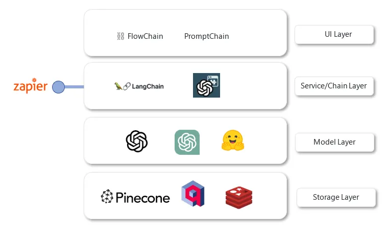
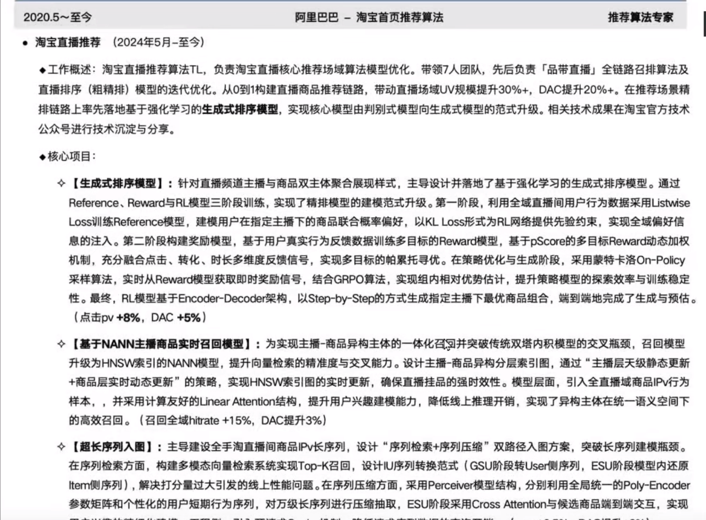

# 9 - LangChain 概述与架构

---

**本章课程目标：**

- 理解 LangChain 的定位、能做什么，以及和 Coze/Dify 等平台的区别。
- 掌握 LangChain 的六大核心模块与版本架构（含 1.0 轻核心与模块化）。
- 了解官方文档与资源、常见问题与使用注意，以及 LangChain 1.0 与未来展望。

**前置知识建议：** 具备 Python 基础（环境、包管理、基本语法）；对大模型与 API 调用有初步认识（可参考 [第 1 章](1-1-大模型认知与工程概览.md) 大模型与智能体概述）。若已用过 [Coze/Dify](3-基于Coze&Dify平台的智能体开发.md) 做应用，可对比理解「平台拖拽」与「代码框架」的差异。

**学习建议：** 本章为纯理论概述，不涉及代码实操。先建立「LangChain 是什么、能做什么、六大模块长什么样」的整体印象，不必死记 API；动手实践请学习第 10 章「LangChain 快速上手与 HelloWorld」。

---

## 1、理论概述

### 1.1 什么是 LangChain

#### 1.1.1 LangChain 简介

LangChain 是 2022 年 10 月底由哈佛大学的 Harrison Chase（哈里森·蔡斯）发起的、基于开源大语言模型的 **AI 工程开发框架**。

顾名思义，LangChain 中的 **「Lang」** 指大语言模型，**「Chain」** 即「链」——将**大模型与数据源、工具、记忆等组件连接成链**，借此构建完整的 AI 应用。

LangChain 的发布比 ChatGPT 问世还要早约一个月，凭借先发优势迅速获得广泛关注与社区支持。

#### 1.1.2 LangChain4J 简介

目前市场上多数 AI 框架（如 LangChain、PyTorch）以 Python 为主，Java 开发者在选型时常面临生态不足的问题。LangChain4J 即 **LangChain for Java**，面向 Spring/Java 生态，便于在现有 Java 项目中集成大模型与 RAG、Agent 等能力。

- **等价于**：LangChain for Java
- **视频教程**：https://www.bilibili.com/video/BV1mX3NzrEu6/（尚硅谷-周阳）

#### 1.1.3 开发方式对比（Before / After）

理解 LangChain 前后开发方式的差异，有助于建立「为什么要用框架」的直觉。

**Before（未使用 LangChain）**：

**After（使用 LangChain）**：

LangChain 是连接**你的应用/业务代码**与**大模型（以及知识库、工具等）**的**中间层**。通过 Chain、Agent、Memory 等抽象，用声明式方式组链、接入工具与记忆，你不用手写「先调谁、再调谁、怎么拼 prompt」。

**类比 Java**：  
Java 代码要操作数据库 MySQL，中间需要**JDBC** 这个标准接口——你的业务只面向 JDBC 写，换数据库（如改成 Oracle）时换驱动/配置即可，业务代码不用大改。  
同理：你的代码要调用大模型、知识库、工具，中间用 **LangChain**——业务只面向 LangChain 写，换模型（GPT 换通义）、加 RAG、加工具时改 LangChain 的配置与链即可，不用重写一堆调 API、拼 prompt 的逻辑。

#### 1.1.4 一句话总结

**LangChain 是一套把大模型和外部世界（数据、工具、记忆等）连接起来的工具与代码框架。**

也就是说：LangChain 不是大模型，而是一套胶水框架。

> **可以这么理解（含两处易混点）**
>
> - **类比**：LangChain 是 Python 里做「大模型应用」的**框架**，类似前端用 Vue 做页面——都是帮你把零散能力（组件/模型/知识库）按一定方式组织、串联起来。
> - **谁先调谁**：不是「先调 LangChain，再调 GPT」。而是：**你的代码调 LangChain**，LangChain 在需要时**替你去调 GPT、查知识库、调工具**。也就是说，LangChain 是**编排层**，决定什么时候调模型、什么时候查 RAG、怎么把结果拼起来。
> - **知识库在哪**：RAG 的**知识库（向量库）一般不在 LangChain 里**，而是在**单独的存储**（如 Pinecone、Chroma、Redis）。LangChain 提供「检索」等组件，去**连接、查询**这些外部知识库，把查到的内容塞进提示里再交给大模型。所以：**LangChain 连接知识库，并不「装着」知识库。**
> - **和「直接调 GPT」的区别**：
>   - **直接调大模型**：你的代码用 OpenAI SDK 或 HTTP 直接请求 GPT 等接口，自己拼提示词、自己解析返回、要做 RAG 就自己先查向量库再拼进 prompt。
>   - **改用 LangChain**：你的代码改为调 **LangChain 的接口**（例如 `chain.invoke(...)`、`init_chat_model` 得到的 model），由 LangChain 在内部去调 GPT、查知识库、拼提示、解析结果。所以可以理解为：**从「直接调大模型接口」变成「调 LangChain 的接口，由 LangChain 再去调大模型（以及知识库、工具等）」**。注意：GPT 仍然会被调用，只是改成**由 LangChain 去调**，而不是你手写每次请求；换模型、加 RAG、加工具时，你主要改 LangChain 的配置与链，而不是重写一堆拼 prompt、调 API 的代码。

#### 1.1.5 和 Coze 等平台的区别

课程里既讲 **Coze、Dify**，又讲 **LangChain**，容易产生疑问：**有了 Coze/Dify，为什么还要学 LangChain？** 简单说：**它们不是二选一，而是两种不同形态**——一个是**低代码/无代码平台**，一个是**代码级框架**。

| 维度                 | Coze / Dify 等平台                                                                                                         | LangChain                                                                                                                                      |
| -------------------- | -------------------------------------------------------------------------------------------------------------------------- | ---------------------------------------------------------------------------------------------------------------------------------------------- |
| **是什么**           | **产品/平台**：通过网页可视化界面（拖拽工作流、配置提示词、连接知识库）搭建 AI 应用，多数操作不用写代码或只写少量配置/脚本 | **代码框架/库**：在 Python（或 JS）里写代码，用 Chain、Agent、RAG 等 API 自己编排「何时调模型、何时查库、怎么拼 prompt」                       |
| **使用方式**         | 在浏览器里打开平台，拖拽节点、填表单、选模型和知识库，发布成应用或 API                                                     | 在本地或服务器上写代码，`pip install langchain`，在业务系统里直接调用 LangChain 的接口                                                         |
| **适合谁**           | 产品、运营、低代码开发者；快速验证想法、上线对话/智能体，对代码控制要求不高                                                | 开发者、算法/后端；需要把 AI 能力**嵌进现有系统**、深度定制流程、或做平台不支持的高级逻辑（复杂 Agent、自定义 RAG、和自有后端/数据库深度集成） |
| **灵活性**           | 受平台提供的节点、插件、权限限制；复杂逻辑或私有化部署有时会碰到天花板                                                     | 完全由代码控制，可任意对接自建向量库、内部 API、私有模型，适合企业内网或强定制场景                                                             |
| **在本课程中的位置** | Coze、Dify 在第 3 章等学习，用于**快速搭建可用的智能体/工作流**，面向「做出能跑的应用」                                    | LangChain 用于**理解底层编排逻辑**，并在需要时**用代码实现**平台难以实现的能力，面向「可控、可集成、可二次开发」                               |

**为什么要一起学？**

- **Coze / Dify**：适合**快速做出应用**、给业务用、或对外发布，降低「从想法到上线」的门槛。
- **LangChain**：适合**理解「链、Agent、RAG」是怎么被组装出来的**，以及在需要**深度集成到自家系统、做复杂逻辑、或平台做不到的事**时，用代码实现。

很多团队会**两者都用**：用 Coze/Dify 做原型或对外的标准化应用，用 LangChain（或类似框架）做内部工具、数据管线、或与现有 Java/Python 系统的深度集成。

#### 1.1.6 为什么现在是最佳的学习时机

- **事实标准（De FactoStandard）**：已成为构建大语言模型应用的首选框架。
- **革命性升级（Revolutionary Upgrade）**：1.0 版本是对框架的彻底重新设计，而非简单迭代。
- **面向未来（Future-Proof）**：掌握新 API 和以图(Graph)为核心的思维，为构建复杂 Agent 应用莫定基础。
- **生态成熟**：常用工具（如 Google Search、Wikipedia、Notion、Gmail 等）和常用技术（RAG、ReAct、MapReduce 等）在 LangChain 中都有现成集成或模板。
- **定位清晰**：可类比为 AI 应用开发界的 **Spring** 或 **React**——体量大、有历史包袱，但上手快、资料多，是当前最实用的选择之一。

---

### 1.2 LangChain 能做什么

#### 1.2.1 大模型应用开发分类

下图把大模型相关方向按「从底到顶」分成了三层：

- **基础通用大模型**：如 GPT、通义、文心、DeepSeek 等，偏模型研发与预训练。只有 2%的精英高级人才，才会做基座开发，涉及到大量的微积分公式，一般都要求清北硕博。
- **行业垂直大模型**：在「基础通用大模型」的基础上做领域微调或专用优化（金融、医疗、法律等），偏模型训练/微调与行业落地。
- **超级个体 + 智能体**：基于上述模型，用 RAG、Agent、工作流等做成每个人、每个场景可用的应用，偏 **应用开发**。

和常见的分工方式对应起来就是：做「基础通用大模型/行业垂直大模型」更多涉及 **模型训练与微调**；  
做「超级个体 + 智能体」对应 **应用开发（RAG、Agent、工作流等）**；  
再往外还有 **平台与运维**（云、算力、监控等）。  
**LangChain 主要服务于最上面这一层——在「超级个体 + 智能体」里做应用开发与集成**，调用下层的基础或行业模型，而不是去做模型训练本身。

> **说明**：上图自上而下为 **超级个体 + 智能体**、**行业垂直大模型**、**基础通用大模型** 三层。LangChain 的定位在「超级个体 + 智能体」这一层：用链、智能体、检索等组件把下层模型接起来，做成可用的应用。

#### 1.2.2 应用技术架构

| 层级          | 这层干什么                                                                                                                                                                                    | 常见的英文/产品               | LangChain 在哪                                       |
| ------------- | --------------------------------------------------------------------------------------------------------------------------------------------------------------------------------------------- | ----------------------------- | ---------------------------------------------------- |
| **UI 交互层** | 用户通过 UI 与 LLM 应用交互，如 LangFlow 是 LangChain 的 GUl，通过拖放组件和聊天框架提供一种轻松的实验和原型流程方式                                                                          | FlowChain、PromptChain 等     | 不在这层，在下一层                                   |
| **服务层**    | 将各种语言模型或外部资源整合，构建实用的 LLM 模型。代表性框架：Langchain 是一个开源 LLM 应用框架，将 LLM 模型、向量数据库、交互层 Prompt、外部知识、外部工具整合到一起，可自由构建 LLM 应用。 | **LangChain**、OpenAI API     | **主要在这一层**：用 LangChain 做链、Agent、RAG 编排 |
| **模型层**    | 用户选择需要调用的大语言模型，可以是 OpenAl 的 GPT 系列模型，Hugging Face 中的开源 LLM 系列等。模型层提供最核心支撑，包括聊天接口、上下文 QA 问答接口、文本总结接口、文本翻译接口等           | OpenAI GPT、DALL·E、通用 LLM  | 通过这一层**调用**模型，不「包含」模型本身           |
| **存储层**    | 主要为向量数据库，用于存储文本、图像等编码后的特征向量，支持向量相似度查询与分析。在做文本语义检索时，通过比较输入文本的特征向量与底库文本特征向量的相似性，从而检索目标文本。                | Pinecone、Vector Store、Redis | 需要时**访问**这层（如 RAG 查向量库）                |

**数据流**：请求 **自上而下**（用户 → 服务/链 → 模型 → 存储），结果 **自下而上**（存储 → 模型 → 服务/链 → 用户）。  
**记住一点**：**LangChain 主要在「服务/链层」**，负责把上面的界面、下面的模型和存储串起来。

> **为什么说 LangChain 相当于 Java 里的 Spring Boot？**  
> 因为**干的事很像**：都是「**把多种异构组件整合到一个应用里，用统一抽象让你写业务逻辑，框架管连接和编排**」。
>
> - **Spring Boot**：在 Java 里整合数据库（MySQL）、缓存（Redis）、消息队列（Kafka）、HTTP 接口等——你写业务代码，Spring 管配置、依赖注入、生命周期；换数据源或加中间件时改配置即可，不必手写一堆连接代码。
> - **LangChain**：在大模型应用里整合各种模型（GPT、通义）、向量库（Pinecone）、工具、记忆等——你写「链怎么串、Agent 用什么工具」，LangChain 管何时调模型、何时查库、怎么拼 prompt；换模型或加 RAG 时改配置与链即可，不必手写每次请求和拼装。  
>   所以常说：**LangChain 是 AI 应用开发里的「Spring」**——站在「服务/链层」，把下层模型和存储、上层交互串起来，你专注业务编排，框架负责对接各组件。

---

#### 1.2.3 岗位与招聘对标

在 Boss 直聘等招聘平台上，许多「大模型应用开发」「LLM 应用工程师」「RAG/Agent 开发」等岗位会要求熟悉 LangChain 或类似框架，可作为学习方向与简历关键词的参考。

> 附：从事「基础通用大模型」开发者简历

---

### 1.3 总体架构与六大核心模块

建立「是什么、能做什么」的印象后，下面说明 LangChain **长什么样**（版本与六大模块）。入门阶段重点看 **1.3.2 六大核心模块**，其余了解即可。

#### 1.3.1 版本演进与总体架构

以下版本演进**了解即可**，当前以 **1.0** 为主，不必死记。

**V0.1 版本**：早期以「链」为主的设计，强调顺序调用与组合。仅作为了解即可。

**V0.2 / V0.3 版本**：引入更清晰的层次——架构层、组件层、部署层。

> **说明**：上图将 LangChain 生态分为三层——**架构（Architecture）**、**组件（Components）**、**部署（Deployment）**。
>
> - **最底层（架构）**：LangChain + LangGraph，均开源。LangChain 负责链式编排与基础抽象，LangGraph 提供图结构、循环与多步推理。
> - **中间层（组件）**：Integrations 等与外部 API、数据库、第三方模型的集成。
> - **最顶层（部署）**：LangGraph Cloud（云部署）、LangSmith（调试、测试、监控、提示管理等商业化能力）。

**LangChain 1.0：轻核心 + 模块化**

| 模块                    | 作用                                                                               |
| ----------------------- | ---------------------------------------------------------------------------------- |
| **langchain-core**      | 基础抽象与 LCEL（LangChain 表达式语言），以及 Chains、Agents、Retrieval 等核心概念 |
| **langchain-community** | 社区与第三方集成，如 langchain-openai、langchain-anthropic 等                      |
| **LangGraph**           | 在 LangChain 之上提供「图」编排，可协调多 Chain、Agent、Tools，支持循环与复杂流程  |

#### 1.3.3 六大核心模块（重点）

> **说明**：上图对应 LangChain 的六大核心模块——**Models、Memory、Retrieval、Chains、Agents、Callback**。各模块之间 **耦合松散**，无固定调用顺序，开发者可按业务自由组合。

- **Models（模型）**：对接各类 LLM、Chat、Embedding 等。
- **Memory（记忆）**：对话历史、会话状态、长期记忆等。
- **Retrieval（检索）**：与向量库、知识库集成，支撑 RAG。
- **Chains（链）**：将多步逻辑串成链，实现固定流程。
- **Agents（智能体）**：根据任务选择工具、规划步骤、执行动作。
- **Callback（回调）**：日志、监控、调试等可观测性。

**本节小结**：先建立「六大模块 + 分层架构」的整体图景，具体 API 在后续章节按需查阅即可。

> **可这样记：** 六大模块可记为「**模型、记忆、检索、链、智能体、回调**」——**Models** 接大模型，**Memory** 管对话/状态，**Retrieval** 连向量库做 RAG，**Chains** 把多步串成固定流程，**Agents** 自己选工具和规划步骤，**Callback** 做日志与监控。它们之间**无固定顺序**，按业务自由组合；入门时知道「调模型用 Models、做 RAG 用 Retrieval+Models、复杂决策用 Agents」即可。

**下图「六大模块小结」在讲什么（建议对照图看）：**

这张图把 LangChain 的**六大模块能力**和它们之间的**关系**画在一起，可以当作「一张图看懂 LangChain 能拼出什么」的总览。

| 图中区域（大致位置） | 对应能力                     | 图中在说什么                                                                                                                                                                                                                                                                                                                                                                                 |
| -------------------- | ---------------------------- | -------------------------------------------------------------------------------------------------------------------------------------------------------------------------------------------------------------------------------------------------------------------------------------------------------------------------------------------------------------------------------------------- |
| **最上方（紫色）**   | **Agents 智能体**            | 最上层是「做决策、选动作」的智能体。下面挂了两类东西：**Executors（执行器/链）**——如 ReAct（先推理再行动）、Plan-Execute（先规划再执行）、OpenAI 等；**Tools（工具）**——Standalone 单工具、Collection 工具集。箭头 in/out 表示工具可以接收输入、返回输出。                                                                                                                                   |
| **中间偏上（粉色）** | **Chains 链**                | 链是把「调模型、查文档、多步流程」串起来的编排。图中包括：Foundational LLM（直接调基座模型）、Conversational QA（带对话记忆的问答）、Retrieval QA（先检索再回答，即 RAG）、Document（文档处理）、Sequential（按顺序执行的多步链）。虚线连到右侧 LangSmith，表示链的执行可被监控、追踪。                                                                                                      |
| **左侧（绿色）**     | **Memory 记忆**              | 存「对话历史、会话状态」等。图中列了：Buffer（简单缓冲）、Vector DB（用向量存对话/上下文，可语义检索）、KV DB、SQL DB。链和智能体在需要时会从这些记忆里读、写。                                                                                                                                                                                                                              |
| **中间（橙色）**     | **Data Connection 数据连接** | 负责「数据从哪来、怎么加工、存到哪」。包含：**Vector Stores**（Embedding 把文本变向量 → 存进 Vector DB / Memory / Self-Hosted / BaaS）；**Document Retrievers**（用 Vector DB、Web API、BaaS 按查询取文档）；**Document Loaders**（从 Folder、File、Web 加载原始数据）；**Document Transformers/Splitters**（对文档做切分、转换，如按 Text/Code/Token 切块）。RAG 的「建库、检索」都在这块。 |
| **右侧偏下（蓝色）** | **Model I/O 模型输入输出**   | 和「怎么调大模型」有关：**Prompts**（Template 模板、Selector 动态选提示）；**Language Models**（Chat 对话模型、LLM 通用模型）；**Output Parsers**（把模型输出变成结构化，如 Structured、JSON）。链和智能体通过这里把「提示 → 模型 → 解析结果」串起来。                                                                                                                                       |
| **最右侧（灰色）**   | **Callbacks 回调**           | 在链/智能体执行过程中「插一脚」做日志、监控、调试。图中：LangSmith（官方调试与监控平台）、Console（控制台输出）、Custom（自定义回调）。虚线表示这些回调可以挂到链、模型等环节。                                                                                                                                                                                                              |

**虚线表示什么**：图中虚线表示**数据流或依赖关系**——例如链会用到 Memory 和 Data Connection，会通过 Model I/O 调模型；Document Loaders 产出给 Transformers/Splitters，再进 Vector Stores；Document Retrievers 从 Vector Stores 里查。看虚线就能看出「谁用谁、数据怎么流」。

**为什么说这张图关键**：它把「Agent、Chain、Memory、Data Connection、Model I/O、Callback」六块**放在一张图里**，既能看到每块里有哪些子组件（如 ReAct、Retrieval QA、Vector DB），又能通过连线和位置理解**它们如何一起组成一个完整应用**。入门时多看几眼，后面学具体 API 时就能对号入座。

更多 API 与模块可参考：https://reference.langchain.com/python/langchain/langchain/

---

### 1.4 官方文档与资源

需要查 **API、最新文档或版本说明** 时，可参考下表。初次阅读可先跳过，动手写代码时再回看。

| 类型             | 地址                                                        |
| ---------------- | ----------------------------------------------------------- |
| **官网（中文）** | https://docs.langchain.org.cn/oss/python/langchain/overview |
| **官网（英文）** | https://docs.langchain.com/oss/python/langchain/overview    |
| **GitHub**       | https://github.com/langchain-ai                             |
| **API 文档**     | https://reference.langchain.com/python/langchain/           |

---

### 1.5 常见问题与使用注意

LangChain 虽是当前主流框架，但也有一些公认的槽点，学习时需有心理预期：

1. **文档与版本不同步**：项目迭代快，文档中的示例在最新版本中可能已更名或删除，对新手不友好。
2. **抽象层次多**：为兼容多种模型与数据源，封装较深，简单需求有时要钻好几层调用，容易产生「LangChain 很慢」的错觉——往往是 **理解与调试成本高**，而非运行时性能差。
3. **版本兼容性**：升级后旧代码可能跑不通，建议锁定版本或跟随课程/项目所用版本学习。

下面两图分别展示了 **ChatModel** 与 **Agent** 在文档/实现上的复杂度，读文档时注意对应你当前使用的版本。

类似地，其他模块（Chains、Retrieval、Memory 等）也常有 API 或命名调整，**以官方文档与当前版本为准**。

---

### 1.6 延伸：LangChain 1.0 与未来展望

LangChain 正在从「代码库」走向「AI 开发操作系统」：不单是库，还包含 LangSmith、LangGraph Cloud 等开发与部署能力。

- 随着大模型上下文能力增强（如超长上下文），简单 RAG 的切片与检索策略可能简化，但 **Agent（规划、工具调用、多步任务）** 会越来越重要。
- 未来的 AI 应用更偏向 **「一句话完成复杂任务」**（例如：「帮我写个小游戏并发布到 App Store」），涉及代码、测试、上传等多步。LangChain 正是在为这类 **多步、可编排、可观测** 的应用打地基。

---

**本章小结：**

- **LangChain** 是一套把大模型与数据源、工具、记忆等**连接起来的胶水框架**（不是大模型本身）；你的代码调 LangChain，LangChain 再在内部调模型、查知识库、拼 prompt。与 **Coze/Dify** 的区别：前者是**代码框架**、适合深度集成与定制，后者是**低代码平台**、适合快速搭应用；两者可并存使用。
- **定位**：主要服务于「超级个体 + 智能体」应用开发层，处在**服务/链层**，通过 OpenAI 兼容 API 调用下层模型、访问存储层向量库；常被类比为 AI 应用开发里的 **Spring**。
- **六大核心模块**：Models（对接 LLM/Chat/Embedding）、Memory（对话与状态）、Retrieval（向量库与 RAG）、Chains（多步链式编排）、Agents（选工具与规划）、Callback（日志与监控）；模块间耦合松散，按需组合。当前以 **LangChain 1.0** 为主，轻核心 + 模块化（langchain-core、langchain-community、LangGraph）。
- **文档与注意**：官网、GitHub、API 文档见 1.4 节；文档与版本迭代快，以官方和当前版本为准，遇 API 更名可查文档或锁定课程所用版本。

**建议下一步：** 学习 [第 10 章 - LangChain 快速上手与 HelloWorld](10-LangChain快速上手与HelloWorld.md)，完成环境安装、百炼三件套与 HelloWorld、多模型共存与企业级封装与流式输出。
