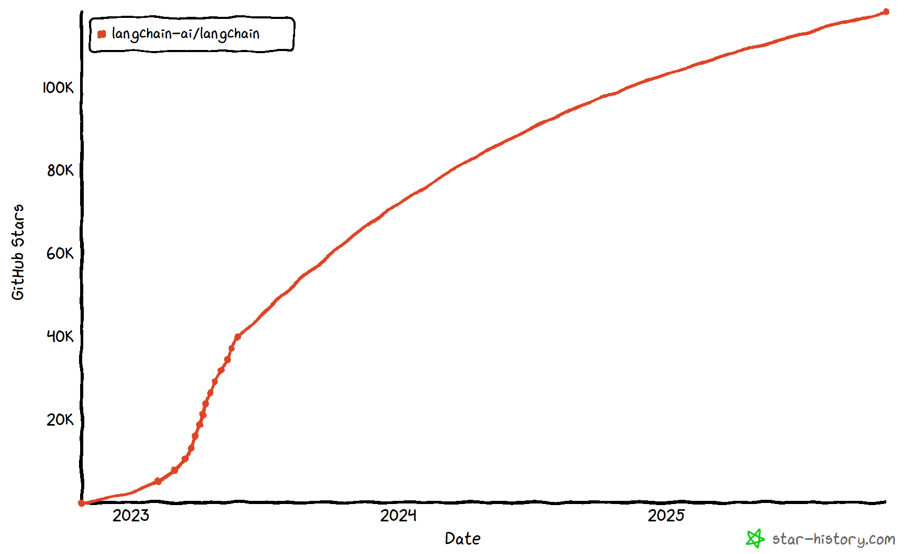
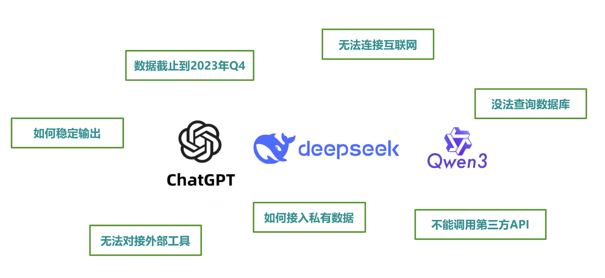
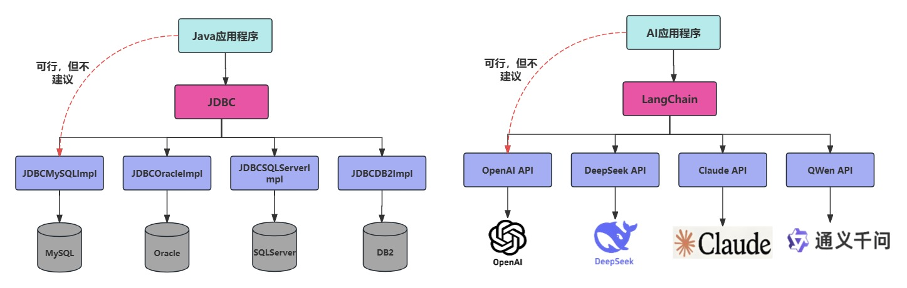
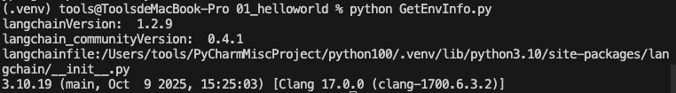
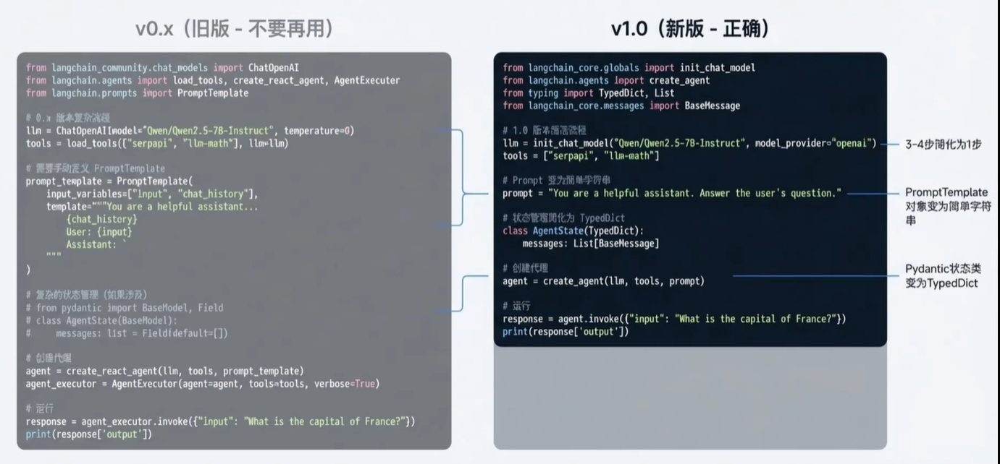
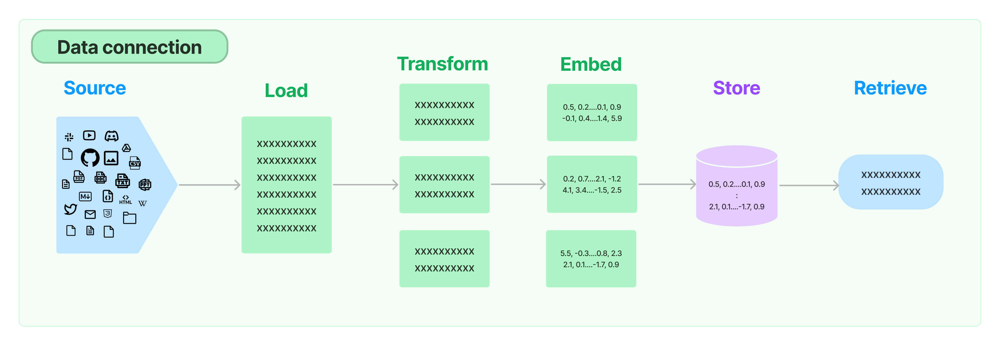
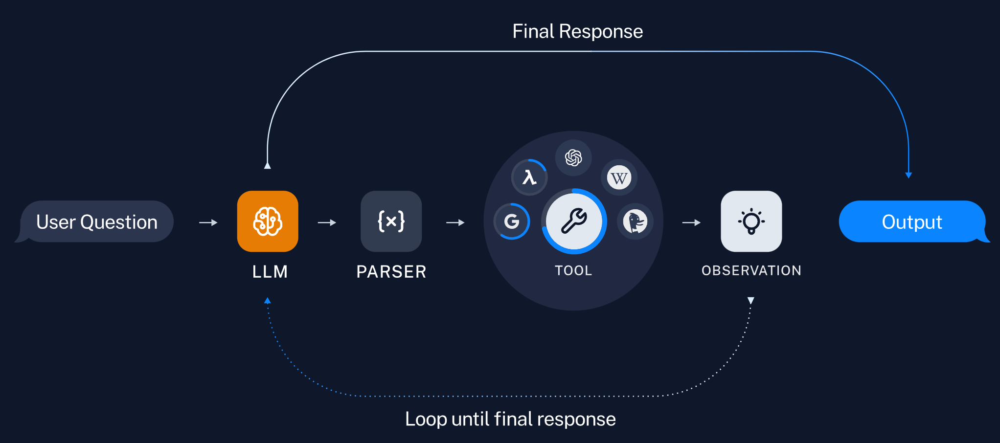
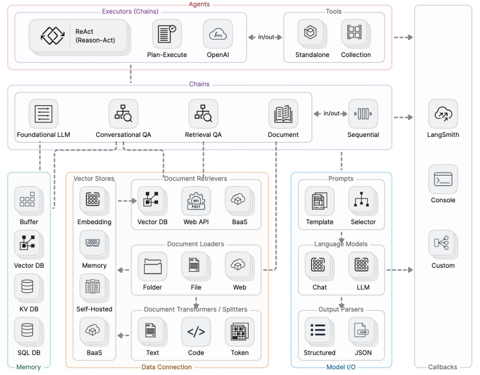

# 9 - LangChain 概述与架构

---

**本章课程目标：**

- 理解 LangChain 的定位、能做什么，以及和 Coze/Dify 等平台的区别。
- 掌握 LangChain 的**六大核心模块**、版本与包结构（含 1.0 轻核心与模块化），以及常用 PyPI 包角色。

**前置知识建议：** 具备 Python 基础（环境、包管理、基本语法）；对大模型与 API 调用有初步认识（可参考 [第 1-1 章 大模型认知与工程概览](1-1-大模型认知与工程概览.md)）。若已用过 [Coze/Dify 平台](3-基于Coze&Dify平台的智能体开发.md) 做应用，可对比理解「平台拖拽」与「代码框架」的差异。

**学习建议：** 本章为纯理论概述，不涉及代码实操。先建立「LangChain 是什么、能做什么、六大模块长什么样」的整体印象，不必死记 API；**下一章 [第 10 章](10-LangChain快速上手与HelloWorld.md) 是动手第一课**，完成环境与 HelloWorld 后即可层层递进到 Model I/O、链、记忆与 Agent。

---

## 1、LangChain 简介

### 1.1 定义

**定义**：LangChain 是哈佛大学 Harrison Chase（哈里森·蔡斯）等人于 **2022 年 10 月底**发起的**开源工程框架**，面向**由大语言模型（LLM）驱动**的应用开发。它是一套**库与工具**，用来把大模型和外部世界（数据、工具、记忆等）**接起来**——**不是**大模型本身，在系统里常被视为**编排层**或「胶水框架」。

**命名**：**Lang** 指语言模型，**Chain** 指「链」——把模型与数据源、工具、记忆等**串成可复用流程**，从而搭出完整的 AI 应用。

**背景**：项目公开时间比 ChatGPT 亮相还早约一个月，早期即获得较高关注度与社区支持。

**典型应用场景**：Agent、问答（QA）、文档检索与知识型助手等。

下面四点有助于快速建立「它在栈里干什么」的直觉：

1. **类比**：在 Python 侧，它更像**应用框架**（类似前端用 Vue 组织页面与组件）——帮你把模型、检索、工具等能力**按业务组织、串联**，而不是替代其中某一种具体技术。

2. **调用关系**：常见路径是 **你的业务代码 → 调用 LangChain → LangChain 再调用** 大模型 API、向量库、外部工具等。框架承担**编排**：何时问模型、何时做 RAG、多步结果如何合并，由链、Agent 等抽象表达；并不是「先单独调 LangChain、再单独调 GPT」两套并列流程。

3. **知识库在哪**：RAG 用的**向量库 / 文档库**一般在**独立存储**（如 Pinecone、Chroma、Redis 等）。LangChain 通过检索、文档加载等组件**连接并查询**这些系统，把检索结果写入提示再交给模型——即 **LangChain 连接知识库，并不托管你的业务数据**。

LangChain在Github上的热度变化：



**官方文档与资源：**

- **产品官网**：https://www.langchain.com/langchain
- **官网（中文）**：https://docs.langchain.org.cn/oss/python/langchain/overview
- **官网（英文）**：https://docs.langchain.com/oss/python/langchain/overview
- **GitHub 组织**：https://github.com/langchain-ai
- **GitHub 主仓库**：https://github.com/langchain-ai/langchain
- **API 文档**：https://reference.langchain.com/python/langchain/

### 1.2 常见疑问

#### 1.2.1 已经很好用，为什么还需要 LangChain？

在大语言模型（LLM）如 ChatGPT、Claude、DeepSeek 等快速发展的今天，开发者不仅希望能「使用」这些模型，还希望能将它们灵活集成到自己的应用中，实现更强大的对话能力、检索增强生成（RAG）、工具调用（Tool Calling）、多轮推理等功能。仅调用模型 API 时，你很快会碰到**知识截止、无法直连企业数据、输出格式不稳、难以系统化接工具**等问题——这正是框架要帮你补上的「工程化一层」。



#### 1.2.2 只用 GPT、GLM4 等模型的 API 开发，不行吗？

**行。** 完全可以只用各厂商 API；**框架不是必选项**。若选择 LangChain，常见的好处包括：

- **降低开发与维护成本**：用链、检索、Agent 等高层组件组织流程，少写重复的拼 prompt、解析、错误处理与胶水代码。
- **更聚焦业务**：开发人员可以更专注于业务逻辑，而无须花费大量时间和精力处理底层技术细节。
- **统一调用面、便于换模型**：不同模型的API不同，调用方式也有区别，切换模型时学习成本高。使用LangChain，可以以统一、规范的方式进行调用，有更好的移植性。
- **现成的 Agent 与集成模式**：LangChain提供了现成的构建Agent的方式。让复杂的逻辑变得结构化、易组合、易扩展。

**类比 Java**：  
Java 代码要操作数据库 MySQL，中间需要**JDBC** 这个标准接口——你的业务只面向 JDBC 写，换数据库（如改成 Oracle）时换驱动/配置即可，业务代码不用大改。  
同理：你的代码要调用大模型、知识库、工具，中间用 **LangChain**——业务只面向 LangChain 写，换模型（GPT 换通义）、加 RAG、加工具时改 LangChain 的配置与链即可，不用重写一堆调 API、拼 prompt 的逻辑。



#### 1.2.3 LangChain 与 Dify 等使用场景分别是什么？

| 维度         | Coze / Dify 等平台                                                                                                         | LangChain                                                                                                                                      |
| ------------ | -------------------------------------------------------------------------------------------------------------------------- | ---------------------------------------------------------------------------------------------------------------------------------------------- |
| **是什么**   | **产品/平台**：通过网页可视化界面（拖拽工作流、配置提示词、连接知识库）搭建 AI 应用，多数操作不用写代码或只写少量配置/脚本 | **代码框架/库**：在 Python（或 JS）里写代码，用 Chain、Agent、RAG 等 API 自己编排「何时调模型、何时查库、怎么拼 prompt」                       |
| **使用方式** | 在浏览器里打开平台，拖拽节点、填表单、选模型和知识库，发布成应用或 API                                                     | 在本地或服务器上写代码，`pip install langchain`，在业务系统里直接调用 LangChain 的接口                                                         |
| **适合谁**   | 产品、运营、低代码开发者；快速验证想法、上线对话/智能体，对代码控制要求不高                                                | 开发者、算法/后端；需要把 AI 能力**嵌进现有系统**、深度定制流程、或做平台不支持的高级逻辑（复杂 Agent、自定义 RAG、和自有后端/数据库深度集成） |
| **灵活性**   | 受平台提供的节点、插件、权限限制；复杂逻辑或私有化部署有时会碰到天花板                                                     | 完全由代码控制，可任意对接自建向量库、内部 API、私有模型，适合企业内网或强定制场景                                                             |

- **Coze / Dify**：适合**尽快做出可用应用**、给业务或对外发布，降低「从想法到上线」的门槛。
- **LangChain**：适合搞懂**底层编排长什么样**，以及在**深度集成、复杂逻辑、平台做不到**时，用代码兜底。

### 1.3 为什么现在是最佳的学习时机

- **事实标准（De Facto Standard）**：已成为构建大语言模型应用的首选框架。
- **革命性升级（Revolutionary Upgrade）**：1.0 版本是对框架的彻底重新设计，而非简单迭代。
- **面向未来（Future-Proof）**：掌握新 API 和以图（Graph）为核心的思维，为构建复杂 [Agent](21-Agent智能体.md) 应用奠定基础。
- **生态成熟**：常用工具（如 Google Search、Wikipedia、Notion、Gmail 等）和常用技术（RAG、ReAct、MapReduce 等）在 LangChain 中都有现成集成或模板。
- **定位清晰**：可类比为 AI 应用开发界的 **Spring** 或 **React**——体量大、有历史包袱，但上手快、资料多，是当前最实用的选择之一。

### 1.4 LangChain 存在缺陷

LangChain 虽是当前主流框架，但也有一些公认的槽点，学习时需有心理预期：

1. **文档与版本不同步**：项目迭代快，文档中的示例在最新版本中可能已更名或删除，对新手不友好。
2. **抽象层次多**：为兼容多种模型与数据源，封装较深，简单需求有时要钻好几层调用，容易产生「LangChain 很慢」的错觉——往往是 **理解与调试成本高**，而非运行时性能差。
3. **版本兼容性**：升级后旧代码可能跑不通，建议**锁定版本**或跟随课程/项目所用版本学习；遇到报错先对 [官方文档](https://docs.langchain.com/oss/python/langchain/overview) 与 [API 参考](https://reference.langchain.com/python/langchain/) 的版本说明。

### 1.5 LangChain 未来展望

LangChain 正在从「代码库」走向「AI 开发操作系统」：不单是库，还包含 LangSmith、LangGraph Cloud 等开发与部署能力。

- 随着大模型上下文能力增强（如超长上下文），简单 RAG 的切片与检索策略可能简化，但 **Agent（规划、工具调用、多步任务）** 会越来越重要。
- 未来的 AI 应用更偏向 **「一句话完成复杂任务」**（例如：「帮我写个小游戏并发布到 App Store」），涉及代码、测试、上传等多步。LangChain 正是在为这类 **多步、可编排、可观测** 的应用打地基。

### 1.6 扩展：LangChain4J 简介

目前市场上多数 AI 框架（如 LangChain、PyTorch）以 Python 为主，Java 开发者在选型时常面临生态不足的问题。LangChain4J 即 **LangChain for Java**，面向 Spring/Java 生态，便于在现有 Java 项目中集成大模型与 RAG、Agent 等能力。

- **等价于**：LangChain for Java
- **视频教程**：https://www.bilibili.com/video/BV1mX3NzrEu6/ （尚硅谷-周阳）

---

## 2、LangChain 定位

### 2.1 大模型应用开发分类

大模型相关方向按「从底到顶」分成了三层：

- **基础通用大模型**：如 GPT、通义、文心、DeepSeek 等，偏模型研发与预训练，门槛高、投入大，通常由具备深度学习与大规模工程能力的团队承担。涉及到大量的微积分公式，一般都要求清北硕博，对学历要求极高。
- **行业垂直大模型**：在「基础通用大模型」的基础上做领域微调或专用优化（金融、医疗、法律等），偏模型训练/微调与行业落地。
- **超级个体 + 智能体**：基于上述模型，用 RAG、Agent、工作流等做成每个人、每个场景可用的应用，偏 **应用开发**。

**LangChain 主要服务于「超级个体 + 智能体」这一层做应用开发与集成**，调用下层的基础或行业模型，而不是去做模型训练本身。

### 2.2 应用技术架构


| 层级          | 这层干什么                                                                                                                                                                                    | 常见的英文/产品               | LangChain 在哪                                       |
| ------------- | --------------------------------------------------------------------------------------------------------------------------------------------------------------------------------------------- | ----------------------------- | ---------------------------------------------------- |
| **UI 交互层** | 用户通过 UI 与 LLM 应用交互，如 LangFlow 是 LangChain 的 GUI，通过拖放组件和聊天框架提供一种轻松的实验和原型流程方式                                                                          | FlowChain、PromptChain 等     | 不在这层，在下一层                                   |
| **服务层**    | 将各种语言模型或外部资源整合，构建实用的 LLM 应用。代表性框架：**LangChain** 是开源 LLM 应用框架，将 LLM 模型、向量数据库、交互层 Prompt、外部知识、外部工具整合到一起，可自由构建 LLM 应用。 | **LangChain**、OpenAI API     | **主要在这一层**：用 LangChain 做链、Agent、RAG 编排 |
| **模型层**    | 用户选择需要调用的大语言模型，可以是 OpenAI 的 GPT 系列模型，Hugging Face 中的开源 LLM 系列等。模型层提供最核心支撑，包括聊天接口、上下文 QA 问答接口、文本总结接口、文本翻译接口等           | OpenAI GPT、DALL·E、通用 LLM  | 通过这一层**调用**模型，不「包含」模型本身           |
| **存储层**    | 主要为向量数据库，用于存储文本、图像等编码后的特征向量，支持向量相似度查询与分析。在做文本语义检索时，通过比较输入文本的特征向量与底库文本特征向量的相似性，从而检索目标文本。                | Pinecone、Vector Store、Redis | 需要时**访问**这层（如 RAG 查向量库）                |

**数据流**：请求 **自上而下**（用户 → 服务/链 → 模型 → 存储），结果 **自下而上**（存储 → 模型 → 服务/链 → 用户）。  
**记住一点**：**LangChain 主要在「服务/链层」**，负责把上面的界面、下面的模型和存储串起来。

> **为什么说 LangChain 相当于 Java 里的 Spring Boot？**  
> 因为**干的事很像**：都是「**把多种异构组件整合到一个应用里，用统一抽象让你写业务逻辑，框架管连接和编排**」。
>
> - **Spring Boot**：在 Java 里整合数据库（MySQL）、缓存（Redis）、消息队列（Kafka）、HTTP 接口等——你写业务代码，Spring 管配置、依赖注入、生命周期；换数据源或加中间件时改配置即可，不必手写一堆连接代码。
> - **LangChain**：在大模型应用里整合各种模型（GPT、通义）、向量库（Pinecone）、工具、记忆等——你写「链怎么串、Agent 用什么工具」，LangChain 管何时调模型、何时查库、怎么拼 prompt；换模型或加 RAG 时改配置与链即可，不必手写每次请求和拼装。  
>   所以常说：**LangChain 是 AI 应用开发里的「Spring」**——站在「服务/链层」，把下层模型和存储、上层交互串起来，你专注业务编排，框架负责对接各组件。

### 2.3 岗位与招聘对标

在 Boss 直聘等招聘平台上，许多「大模型应用开发」「LLM 应用工程师」「RAG/Agent 开发」等岗位会要求熟悉 LangChain 或类似框架，可作为学习方向与简历关键词的参考。

> 附：从事「基础通用大模型」开发者简历（示意）



---

## 3、LangChain 包与版本对比

### 3.1 版本演进与对比

以下版本演进**了解即可**，当前以 **1.0** 为主线，不必死记。

**V0.1 版本**：早期以「链」为主的设计，强调顺序调用与组合。仅作为了解即可。


**V0.2 / V0.3 版本**：引入更清晰的层次——架构层、组件层、部署层。


> **说明**：上图将 LangChain 生态分为三层——**架构（Architecture）**、**组件（Components）**、**部署（Deployment）**。
>
> - **最底层（架构）**：LangChain + LangGraph，均开源。LangChain 负责链式编排与基础抽象，LangGraph 提供图结构、循环与多步推理。
> - **中间层（组件）**：Integrations 等与外部 API、数据库、第三方模型的集成。
> - **最顶层（部署）**：LangGraph Cloud（云部署）、LangSmith（调试、测试、监控、提示管理等商业化能力）。

**LangChain 1.0：轻核心 + 模块化**


### 3.2 0.x 与 1.0 版本对比



**Agent：从「多步接线」到 `create_agent`（0.x → 1.0 示意）**

1.0 里创建 Agent 的方式比老版本**更省事**：以前要像搭积木一样自己把模型、工具、提示、执行器一层层接好；现在往往**一次函数调用**就能得到一个可 `invoke` 的 Agent，背后由 **LangGraph** 的图状态机负责多步状态与流转（你仍可在图里扩展复杂逻辑）。

用「流水线」打个比方（帮助记忆，不代表唯一 API 名称）：

```text
# 约 0.x：常见要串 3～4 步
[Model] → [Tools] → [Prompt] → [Agent] → [Executor]

# 约 1.0：常见收敛为一步入口（示意）
create_agent(模型、工具、提示等) → [Agent]   # 底层多由 LangGraph 驱动
```

| 对比项       | 约 0.x（旧）                     | 约 1.0（新）                         |
| ------------ | -------------------------------- | ------------------------------------ |
| **创建步骤** | 多步手动组装（常见 3～4 步）     | 往往 **1 步**（一次高层函数调用）    |
| **提示词**   | 常要构造 `PromptTemplate` 等对象 | 可直接用**普通字符串**（视具体 API） |
| **调用方式** | 常见 `executor.invoke(...)`      | 常见 `agent.invoke(...)`             |

**一句话**：从「繁琐接线」到「一步到位」；复杂编排交给 LangGraph，日常入门更友好。

### 3.3 LangChain 包划分

**LangChain 1.0 相关包 / 组件（PyPI）一览**：

| 包 / 模块                     | 作用                                                                                                                                              |
| ----------------------------- | ------------------------------------------------------------------------------------------------------------------------------------------------- |
| **langchain**                 | 构建基于 LLM 的应用时常用的**主入口包**，聚合常用能力与高层实现（与 `langchain-core`、各集成包配合使用）。                                        |
| **langchain-core**            | 生态中的核心接口与抽象（消息、Runnable、部分链与 Agent 基础等）；含 **LCEL**（LangChain 表达式语言），以及 Chains、Agents、Retrieval 等核心概念。 |
| **langchain-community**       | 社区与第三方集成，如 `langchain-openai`、`langchain-anthropic` 等。                                                                               |
| **langchain-openai** 等集成包 | 与 OpenAI、Anthropic、**DeepSeek** 等具体厂商或协议的集成；此外还有大量面向向量库、文档加载、工具的独立集成包。                                   |
| **LangGraph**                 | 在 LangChain 之上提供「图」编排，可协调多 Chain、Agent、Tools，支持循环与复杂流程。                                                               |
| **langchain-mcp-adapters**    | 在 LangChain / LangGraph 应用中接入 **MCP（Model Context Protocol）** 工具。                                                                      |
| **langchain-text-splitters**  | 文档切分与文本块处理，常用于 RAG 流水线。                                                                                                         |
| **langchain-tests**           | 供集成包作者使用的标准化测试套件（一般应用开发较少直接依赖）。                                                                                    |
| **langchain-classic**         | 1.0 之前的遗留实现与组件，主要为 1.0.0 以前的相关能力；仅在维护旧代码或迁移时需要了解。                                                           |

除上表所列外，生态中还有**大量独立集成包**，覆盖文本生成模型、**工具**、**文档加载**、**向量存储**、中间件等，共同构成 LangChain 的集成层（具体包名以官方文档与 PyPI 为准）。

---

## 4、LangChain 核心模块

**LangChain** 的核心能力为**四大块**：**Model I/O**、**Chains**、**Retrieval（RAG）**、**Agents**。再对照官方总图中的 **六大模块**（补上 **Memory**、**Callback** 等），二者是同一套能力的两种「视图」。

### 4.1 Model I/O（模型输入输出）

**Model I/O** 负责把大模型的**输入、调用、输出**标准化：通常对应**提示模板**、**模型调用**与**输出解析/格式化**。


1. **Format（格式化）**：通过模板管理大模型的输入，把业务数据填入模板再送给模型。
2. **Predict（预测）**：调用 LLM / Chat 模型完成生成或推理。
3. **Parse（解析）**：把自然语言输出规范成结构化结果（如 JSON），便于下游程序使用。

### 4.2 Chains（链）

**链（Chain）** 把多个组件**组合成一条固定流程**，便于链式调用与复用（例如「检索 → 拼 prompt → 调模型」）。

### 4.3 Retrieval（检索）

对应 [RAG](19-RAG检索增强生成.md)：从**外部数据源**（向量库、文档库等）检索与问题相关的片段，作为**参考信息**写入上下文，再交给 LLM 生成答案。



### 4.4 Agents（智能体）

**Agent** 由模型在运行中**自主规划**执行步骤，并**选择、调用工具**（如搜索、计算、调用 API）以完成任务，适合目标不固定、需要多步尝试的场景。



### 4.5 六大模块总览与示意图解读

四大块侧重「模型 I/O—链—检索—智能体」的主线；**六大模块**在总图中还单独强调 **Memory（记忆）**、**Callback（回调）** 等，与四大块**互补**而非矛盾。


> **说明**：上图对应 LangChain 的六大核心模块——**Models、Memory、Retrieval、Chains、Agents、Callback**。各模块之间 **耦合松散**，无固定调用顺序，开发者可按业务自由组合。

- **Models（模型）**：对接各类 LLM、Chat、Embedding 等 → [第 11 章 Model I/O](11-Model-I-O与模型接入.md)、[第 12 章 Ollama 本地部署](12-Ollama本地部署与调用.md)。
- **Memory（记忆）**：对话历史、会话状态、长期记忆等 → [第 16 章 记忆与对话历史](16-记忆与对话历史（含Redis基础）.md)。
- **Retrieval（检索）**：向量库、知识库与 RAG → [第 18 章](18-向量数据库与Embedding实战.md)、[第 19 章](19-RAG检索增强生成.md)。
- **Chains（链）**：固定流程编排 → [第 15 章](15-LCEL与链式调用.md)。
- **Agents（智能体）**：工具与自主规划 → [第 17 章](17-Tools工具调用.md)、[第 21 章](21-Agent智能体.md)。
- **Callback（回调）**：日志、监控、调试等可观测性；常与 **LangSmith** 等工具配合。

**入门记忆口诀**：**调模型**看 Model I/O / Models，**固定流程**用 Chains，**外挂知识**走 Retrieval（RAG），**要工具与自主规划**用 Agents。



| 图中区域             | 对应能力                     | 图中在说什么                                                                                                                                                                                                                                                                                                                                                                                 |
| -------------------- | ---------------------------- | -------------------------------------------------------------------------------------------------------------------------------------------------------------------------------------------------------------------------------------------------------------------------------------------------------------------------------------------------------------------------------------------- |
| **最上方（紫色）**   | **Agents 智能体**            | 最上层是「做决策、选动作」的智能体。下面挂了两类东西：**Executors（执行器/链）**——如 ReAct（先推理再行动）、Plan-Execute（先规划再执行）、OpenAI 等；**Tools（工具）**——Standalone 单工具、Collection 工具集。箭头 in/out 表示工具可以接收输入、返回输出。                                                                                                                                   |
| **中间偏上（粉色）** | **Chains 链**                | 链是把「调模型、查文档、多步流程」串起来的编排。图中包括：Foundational LLM（直接调基座模型）、Conversational QA（带对话记忆的问答）、Retrieval QA（先检索再回答，即 RAG）、Document（文档处理）、Sequential（按顺序执行的多步链）。虚线连到右侧 LangSmith，表示链的执行可被监控、追踪。                                                                                                      |
| **左侧（绿色）**     | **Memory 记忆**              | 存「对话历史、会话状态」等。图中列了：Buffer（简单缓冲）、Vector DB（用向量存对话/上下文，可语义检索）、KV DB、SQL DB。链和智能体在需要时会从这些记忆里读、写。                                                                                                                                                                                                                              |
| **中间（橙色）**     | **Data Connection 数据连接** | 负责「数据从哪来、怎么加工、存到哪」。包含：**Vector Stores**（Embedding 把文本变向量 → 存进 Vector DB / Memory / Self-Hosted / BaaS）；**Document Retrievers**（用 Vector DB、Web API、BaaS 按查询取文档）；**Document Loaders**（从 Folder、File、Web 加载原始数据）；**Document Transformers/Splitters**（对文档做切分、转换，如按 Text/Code/Token 切块）。RAG 的「建库、检索」都在这块。 |
| **右侧偏下（蓝色）** | **Model I/O 模型输入输出**   | 和「怎么调大模型」有关：**Prompts**（Template 模板、Selector 动态选提示）；**Language Models**（Chat 对话模型、LLM 通用模型）；**Output Parsers**（把模型输出变成结构化，如 Structured、JSON）。链和智能体通过这里把「提示 → 模型 → 解析结果」串起来。                                                                                                                                       |
| **最右侧（灰色）**   | **Callbacks 回调**           | 在链/智能体执行过程中「插一脚」做日志、监控、调试。图中：LangSmith（官方调试与监控平台）、Console（控制台输出）、Custom（自定义回调）。虚线表示这些回调可以挂到链、模型等环节。                                                                                                                                                                                                              |

**虚线表示什么**：图中虚线表示**数据流或依赖关系**——例如链会用到 Memory 和 Data Connection，会通过 Model I/O 调模型；Document Loaders 产出给 Transformers/Splitters，再进 Vector Stores；Document Retrievers 从 Vector Stores 里查。看虚线就能看出「谁用谁、数据怎么流」。

---

**本章小结：**

- **LangChain** 是一套把大模型与数据源、工具、记忆等**连接起来的胶水框架**（不是大模型本身）；你的代码调 LangChain，LangChain 再在内部调模型、查知识库、拼 prompt。与 **Coze/Dify** 的区别：前者是**代码框架**、适合深度集成与定制，后者是**低代码平台**、适合快速搭应用；两者可并存使用。
- **定位**：主要服务于「超级个体 + 智能体」**应用开发层**，处在**服务/链层**，通过各厂商 API 调用下层模型、访问存储层向量库；常被类比为 AI 应用开发里的 **Spring**。
- **模块划分**：先记 **四大块**——Model I/O、Chains、Retrieval（RAG）、Agents；再对照 **六大模块**——Models、Memory、Retrieval、Chains、Agents、Callback。**包与版本**见 §3，**核心模块展开**见 §4；常用 PyPI 包见 **§3.3**。

**建议下一步：** 学习 [第 10 章 LangChain 快速上手与 HelloWorld](10-LangChain快速上手与HelloWorld.md)，完成环境安装、百炼三件套与 HelloWorld、多模型共存与企业级封装与流式输出；再按 **Model I/O 闭环** 学习 [第 11 章](11-Model-I-O与模型接入.md)、[第 13 章](13-提示词与消息模板.md)、[第 14 章](14-输出解析器.md)，并串起 [第 15 章 LCEL](15-LCEL与链式调用.md)、[第 18–19 章 RAG](18-向量数据库与Embedding实战.md)、[第 21–22 章 Agent 与 LangGraph](21-Agent智能体.md)，形成与本书后续章节一致的**学习路径图**。
