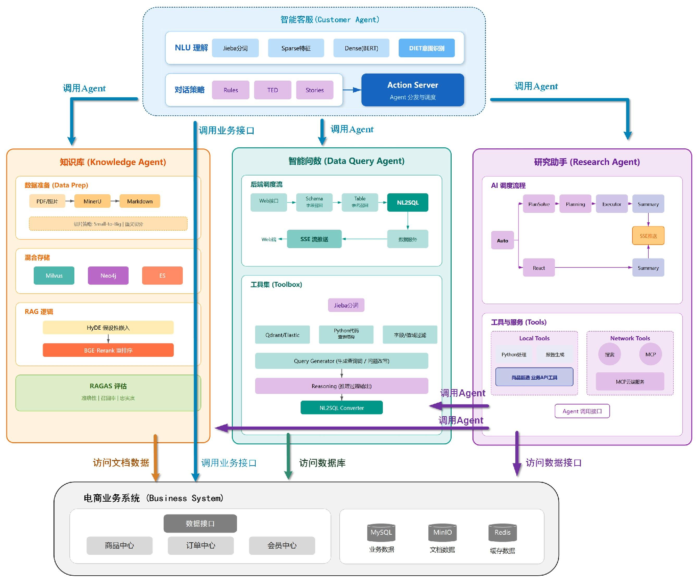

  
  <h1 style="margin-top: 15px;">AI 智能体实战速成指南：从零到企业级落地</h1>
  <h4><b>ai-agents-from-zero</b></h4>
  
<em>零基础掌握 Coze/Dify/LangGraph，搞定企业级 RAG/Agent 部署</em>

> **少讲原理，专注实战**：无需算法/深度学习基础，一份**技术栈全、易上手、能落地**的 AI 智能体教程。  
> **不只是入门，更是系统性学习**：按「大模型基础 → 低代码平台（Coze/Dify）→ LangChain/LangGraph → RAG/Agent 企业级实战 → 微调与规范」的完整知识链路编排，帮你**建立体系、做出来、跑起来、用得上**，含**提示词工程等模板**与**可部署企业级源码**。  
> **从零到能独立做项目**：适合既想**快速上手**、又希望**系统掌握** AI 智能体开发的开发者。

[仓库说明](README.md#📖-关于本仓库) • [教程大纲](教程目录大纲.md) • [案例汇总](教程案例链接汇总.md#教程案例链接汇总源码与在线演示) • [更新日志](教程更新日志.md) • [技术栈概览](README.md#🛠-技术栈概览)

  

    <a href="https://didilili.github.io/ai-agents-from-zero/#/">📚 在线阅读</a>
  

**📢 说明**：本仓库正在持续更新完善中，为 **2026 年最新版 AI 智能体** 笔记与教程，预计 5 月第一版更新完毕，你可以点击[更新日志](教程更新日志.md)，了解最新仓库动态。若对你有帮助，欢迎 **Star** ⭐~

---

## ✨ 教程亮点（你将收获什么？）

- **最大亮点：可落地**，内含**大量提示词工程等模板**，以及**企业级源码**，可直接部署为智能体，拿来即用、不做「纸上谈兵」。
- **系统性学习路径**：从大模型认识、提示词工程到低代码平台（Coze/Dify）与代码框架（LangChain/LangGraph），再到企业级 RAG/Agent 项目与微调、规范，按知识体系编排的**完整链路**，适合系统掌握而非浅尝辄止。
- **企业级实战**：覆盖商户运营管家、掌柜智库、电商小二、掌柜问数、市场罗盘等多类实战项目，含意图解析、多源知识库、转人工、复盘与监控等真实场景。
- **多平台对比与打通**：Coze 与 Dify 的对比与实操，Python 调用工作流，容器化（Docker）与企业级部署（云服务器、AutoDL、Ollama、Xinference、Coze 本地化）。
- **RAG/Agent 全链路**：检索增强（向量+稀疏+Neo4j）、HyDE/BGE-Rerank、RAGAS 评估；Agent 与 MCP、A2A 协议；流式输出、记忆与多轮对话。
- **微调与落地**：LoRA/QLoRA、DeepSpeed、Llama-Factory、vLLM 部署；企业级微调数据构建与调优案例。
- **规范与热点**：企业大模型研发流程、技术调研、RAG/Agent 主流技术与前沿热点跟踪。

## 🛠 技术栈概览

| 类别             | 技术/平台                                     | 说明                                                              |
| ---------------- | --------------------------------------------- | ----------------------------------------------------------------- |
| **大模型与基础** | LLM、Transformer、MoE、自注意力               | LLaMA/Qwen/GPT、多模态、预训练/微调/推理                          |
| **提示与编排**   | 提示词工程、Chain of Thought、Few-shot        | 多轮对话、记忆管理、Agent 与工具调用                              |
| **低代码平台**   | Coze（扣子）、Dify                            | 工作流、Agent、知识库、插件、Python 调用                          |
| **开发框架**     | LangChain、LangGraph                          | Model I/O、Chains、Memory、Agents（ReAct）、Retrieval、图状工作流 |
| **协议与通信**   | MCP（Model Context Protocol）、A2A            | Function Calling、服务解耦、跨 Agent 通信                         |
| **RAG 与检索**   | 向量数据库、稀疏检索、Neo4j、HyDE、BGE-Rerank | 多路召回、知识图谱、RAGAS 评估                                    |
| **文档与多模态** | MinerU、OCR                                   | 图文混排 PDF 解析、设备手册与售后指南                             |
| **部署与运维**   | Docker、Ollama、Xinference、vLLM              | 腾讯云/阿里云、AutoDL、Coze 本地部署                              |
| **微调与训练**   | PEFT、LoRA、QLoRA、DeepSpeed、Llama-Factory   | Alpaca/ShareGPT 数据格式、Safetensors/ONNX                        |
| **编程与工具**   | Python、Trae AI、Qoder                        | 多模型 API、MCP 接入、调试与项目开发                              |

---

## 📚 教程大纲

### 01 大模型基础能力构建

| 章节编号 | 章节名称                    | 内容概要                                                                         |
| -------- | --------------------------- | -------------------------------------------------------------------------------- |
| 01-1     | 大模型（LLM）认识与环境准备 | 起源与发展、AGI 关系、主流模型特点与适用场景、预训练/微调/推理                   |
| 01-2     | 大模型架构原理              | Transformer、MoE、自注意力、LLaMA/Qwen/GPT、多模态                               |
| 01-3     | 大模型调度平台              | Ollama、私有大模型调用、云端/本地部署（AWS、阿里云等）                           |
| 01-4     | 提示词工程                  | 核心原则与结构、链式思维与 Few-shot、多轮对话与记忆、在 Agent 与工具调用中的应用 |

### 02 企业低代码平台开发与项目实战

| 章节编号 | 章节名称                  | 内容概要                                                                           |
| -------- | ------------------------- | ---------------------------------------------------------------------------------- |
| 02-1     | Coze（扣子）平台          | 界面与功能、插件/知识库/工作流/智能体、Python 调用工作流                           |
| 02-2     | 项目 1：商户运营管家      | 行业调研 PPT、爆款视频复刻、营销海报、卖点提炼、评论分析                           |
| 02-3     | Dify AI 平台              | 工作流/Agent/知识库、多案例（投诉分类、调研报告、客服分析、评论分析）、Python 调用 |
| 02-4     | 容器化技术                | Docker 核心概念、安装与常用命令                                                    |
| 02-5     | 企业级大模型部署          | 腾讯云/阿里云、Docker、Dify、AutoDL、Ollama、Xinference、Coze 本地部署             |
| 02-6     | AI 代码编程工具 - Trae AI | 安装使用、多模型 API、MCP 接入                                                     |
| 02-7     | AI 代码编程工具 - Qoder   | 使用与调试、项目开发                                                               |

### 03 大模型核心开发框架

| 章节编号 | 章节名称                 | 内容概要                                                                    |
| -------- | ------------------------ | --------------------------------------------------------------------------- |
| 03-1     | LangChain 框架原理与应用 | Model I/O、Chains、Memory、Agents（ReAct）、Retrieval、电商商家对话助手案例 |
| 03-2     | LangGraph 框架原理与应用 | 图状思维、State/Node/Edge、持久化记忆、流式输出                             |
| 03-3     | MCP 从原理到实战         | 与 Function Calling 对比、通信机制、工作流程、Server 部署与自定义开发       |
| 03-4     | 跨 Agent 通信：A2A 协议  | 与 MCP 关系、消息与认证、典型场景                                           |

### 04 企业级 RAG / Agent 项目实战

| 章节编号 | 章节名称         | 内容概要                                                                                |
| -------- | ---------------- | --------------------------------------------------------------------------------------- |
| 04-1     | 项目 2：掌柜智库 | LangGraph RAG 工作流、MinerU/OCR、向量+稀疏+Neo4j 多路召回、HyDE/BGE-Rerank、RAGAS 评估 |
| 04-2     | 项目 3：电商小二 | 意图解析、多源知识库、流式回复、转人工机制、对话复盘、多渠道与监控                      |
| 04-3     | 项目 4：掌柜问数 | 自然语言转数据查询、多轮问数、权限适配、可视化输出                                      |
| 04-4     | 项目 5：市场罗盘 | 场景化任务拆解、从 0 到 1 设计与开发、阶段目标与进度管控、代码评审与成果展示            |

### 05 大模型微调实践

| 章节编号 | 章节名称                      | 内容概要                                                                                 |
| -------- | ----------------------------- | ---------------------------------------------------------------------------------------- |
| 05-1     | 大模型微调核心                | 数据与格式（Alpaca、ShareGPT）、PEFT/LoRA/QLoRA、全参数微调与 DeepSpeed、vLLM 部署、评估 |
| 05-2     | 企业级微调数据集构建          | 公开/私有数据、标注与质量、数据增强                                                      |
| 05-3     | 基于 Llama-Factory 的高效微调 | 环境与参数、单卡/多卡、Safetensors/ONNX                                                  |
| 05-4     | 调优案例                      | 多个完整案例                                                                             |

### 06 大厂开发规范

| 章节编号 | 章节名称           | 内容概要                                                              |
| -------- | ------------------ | --------------------------------------------------------------------- |
| 06-1     | 企业大模型研发流程 | 技术调研、方案与框架设计、RAG 与 pipeline、评估与角色、立项与需求文档 |
| 06-2     | 大模型当下热点     | Agent/RAG 主流技术、前沿与热点跟踪                                    |

---

## 🏗️ Agent 项目架构与技术架构

---

## 📖 关于本仓库

- **教程来源**：尚硅谷《大模型智能体线上速成班》
- **内容构成**：课程课件同步 + 内容补充完善 + 个人学习笔记
- **目标**：**系统性掌握**大模型与智能体原理与实践（不只入门），从零到能独立开发 RAG / Agent 项目

---

## 📁 仓库结构说明

- 教程目录与章节对应关系见 **`0-课程目录大纲.md`**
- 各章详细笔记按章节编号组织（如 `1-大模型智能体概述.md`、`2-RAG-搭建企业私有&个人知识库.md`、`3-基于Coze&Dify平台的智能体开发.md` 等）

---

## ⚠️ 说明

- 本仓库以**学习与笔记**为主，课件版权归属尚硅谷，请勿用于商业用途。
- 笔记为个人整理，若有疏漏或更新，欢迎提 Issue 或 PR 交流。

---

**仓库英文名**：`ai-agents-from-zero` · **仓库中文名**：《AI 智能体实战速成指南：从零到企业级落地》
