# 3.6 - Coze 案例：客服对话记录分析

---

## 本案例概要

### 使用的插件

| 类型     | 名称 / 能力        | 作用                                                                                                    |
| -------- | ------------------ | ------------------------------------------------------------------------------------------------------- |
| **插件** | 读 Excel(ReadFile) | 根据 Excel 在线文件 url（及可选 sheetName）读取表格，输出为 JSON 数组（如含 msg_id、history_message）。 |

```
【插件说明】
ReadFile - 插件 - 扣子
https://www.coze.cn/store/plugin/7379907202049572903
```

### 技术要点

- **双工作流**：**excel_preprocess** 负责把 Excel 转为消息列表；**message_process** 先调用 excel_preprocess 取得 `msg_list`，再对每条消息做分析并输出报告数组。界面通过 Coze 用户界面组件上传文件并调用 message_process。
- **Excel 预处理**：开始节点接收的 Excel 会转为在线文件 url，readExcel 读成 JSON；代码节点对 `output` 做转义（如 `\"` → `"`）后解析，按 `msg_column_name`、`msg_id_name` 提取列并输出 `msg_list`（每项含 id、msg）。
- **批处理链路**：对每条 `{id, msg}` 依次执行——代码解析当前条 → 大模型「问题分类」（product/content/experience 等标签）→ 大模型「内容总结」（30 字内）→ 大模型「情感分析」（rank + reason）→ 代码\_1 封装为统一 output 结构；批处理输出即分析结果数组。
- **输出与界面**：message_process 最终输出为每条对话的 summary、product、content、experience、rank、reason、msg_id、msg 等，供前端展示；界面由 Coze 用户界面绘制，通过 FileUpload、Textarea 等传入参数并触发工作流。

- **`msg_column_name` 与 `msg_id_name`**：二者为「开始」节点及代码节点的输入参数，用于适配不同格式的 Excel。readExcel 读出的表格是「行 → 对象」的 JSON 数组，每行对象有多个列（键名即表头）。**`msg_column_name`** 指定哪一列的列名对应「客服对话内容」（如本案例中 Excel 表头为 `history_message`，则填 `history_message`）；**`msg_id_name`** 指定哪一列的列名对应「每条对话的编号/ID」（如本案例中表头为 `msg_id`，则填 `msg_id`）。代码节点根据这两个参数从每行中取出对应列，组装成 `msg_list` 中的 `msg` 与 `id`，这样换用不同表头的 Excel 时只需改这两个参数即可复用工作流。

### 工作流程概览

**excel_preprocess：**

```
开始(excel, msg_column_name, msg_id_name)
    ↓
readExcel(url) → output（JSON 字符串）
    ↓
代码：转义 + 提取列 → msg_list[{ id, msg }, …]
    ↓
结束：输出 msg_list
```

**message_process：**

```
开始(excel, msg_column_name, msg_id_name)
    ↓
调用工作流 excel_preprocess → msg_list
    ↓
批处理：对 msg_list 中每条
    ├─ 代码：解析当前条 id、msg
    ├─ 大模型：问题分类 → product、content、experience
    ├─ 大模型：内容总结 → summary（30 字内）
    ├─ 大模型：情感分析 → rank、reason
    └─ 代码_1：封装为单条 output
    ↓
结束：输出分析结果数组（报告列表）
```

---

## 1.整体架构

本项目的业务逻辑由两个工作流实现：excel_preprocess 和 message_process

我们提供的客服对话记录文件格式为 Excel，首先经由 excel_preprocess 处理为消息列表（list），然后 message_process 从消息列表中提取信息，生成分析报告。

本项目运用 Coze 平台-**用户界面**提供的组件绘制应用的 UI 界面。

## 2.excel_preprocess

整体流程如下所示（找 images 目录下的文件：excel_preprocess.svg）


### 2.1.配置及单点测试

#### 1.开始

##### 1.配置


开始节点无法单独测试，整个工作流搭建完成后才可以配置输入，其中，excel 变量接收输入的 Excel 文件，将其转换为 excel 在线文件的 http 链接

#### 2.readExcel

##### 1.配置


url 为 Excel 在线文件的 http 链接，此处设置为开始节点的 excel 变量

sheetName 是 Excel 文件 sheet 页的名称，不填默认读取第一个 sheet 页，我们的文件只有一个页面，该项不必填。

输出 output 是 excel 中数据构成的 JSON 数据。

##### 2.测试

###### 输入

> https://p9-bot-workflow-sign.byteimg.com/tos-cn-i-mdko3gqilj/2ce6e82b4e184b088a01a7711f94afed.xlsx~tplv-mdko3gqilj-image.image?rk3s=81d4c505&x-expires=1794450789&x-signature=Tv8mNaiBKAeogdkGVbTweoKz0Q4%3D&x-wf-file_name=%E5%AE%A2%E6%9C%8D%E5%AF%B9%E8%AF%9D%E8%AE%B0%E5%BD%95.xlsx


###### 输出

```json
"[{\"msg_id\":1,\"history_message\":\"买 二份 有没有 少点 呀\\t亲亲 真的 不好意思 我们 已经 是 优惠价 了 呢 小本生意 请亲 谅解，之前也有客人说收到的包装有点松散，后面我们有提醒工厂\"},{\"msg_id\":2,\"history_message\":\"买 二份 有没有 少点 呀\\t恩恩 客官 现在 有个 活动 参加 就 有 礼 哦，就是要先报名再下单，有点麻烦不过礼品还不错\"},{\"msg_id\":3,\"history_message\":\"我 一不小心 就 拍 了 一组 我 在 拍 一组 可以 嘛\\t要 不亲 退 了 一起 拍 吧\\t那 就 等 你们 处理 喽\\t好 的 亲退 了，不过退款那边可能要排队处理一下\"},{\"msg_id\":4,\"history_message\":\"我 一不小心 就 拍 了 一组 我 在 拍 一组 可以 嘛\\t要 不亲 退 了 一起 拍 吧\\t那 就 等 你们 处理 喽\\t亲亲 您 的 订单 今天 五箱 都 会 发货 的，但仓库说系统有点卡，可能会稍微慢点 您 看 今天 一起 给 您 发出 可以 吗\"},{\"msg_id\":5,\"history_message\":\"那好 的 就 拍 这款\\t好 的 哦 亲爱 的\\t颜色 有 这种\\t二合一 的 颜色 有 2 个 哦 亲\\t这个 不是 叫 红色 吗\\t黑 的\\t这个 不要\\t第二个 红 的 好 的 哦 亲亲 您 拍 的 宝贝 可以 使用 优惠券 哦 达到 可用 金额 就 可以 使用 了 哦 记得 领取 哦\\t俩 和 一 是 一体 的\\t对 的 不过 我们 家 的 二合一 性价比 比较 不高 哦\\t那 我 不 喜欢\\t颜色 的话 一般 茶刀 茶针 和 二合一 的话 都 是 红木 檀 和 黑木 檀 哦，之前有人说手柄握着有点滑\"},{\"msg_id\":6,\"history_message\":\"那好 的 就 拍 这款\\t好 的 哦 亲爱 的\\t颜色 有 这种\\t二合一 的 颜色 有 2 个 哦 亲\\t这个 不是 叫 红色 吗\\t黑 的\\t这个 不要\\t第二个 红 的 好 的 哦 亲亲 您 拍 的 宝贝 可以 使用 优惠券 哦 达到 可用 金额 就 可以 使用 了 哦 记得 领取 哦\\t俩 和 一 是 一体 的\\t对 的 不过 我们 家 的 二合一 性价比 比较 不高 哦\\t那 我 不 喜欢\\t好 的 呢 帮 您 备注 了 哦，备注系统有点不好用可能会漏，不过我帮您再记录一下\"},{\"msg_id\":7,\"history_message\":\"不是 免 运费\\t本店 茶具 订单 满 99 包邮除 宁夏 青海 内蒙古 海南 新疆 西藏 满 39 包邮，页面写得比较靠后不太好找\"},{\"msg_id\":8,\"history_message\":\"不是 免 运费\\t查 清楚 看 是 什么 原因 给 亲 补发 过去 吧，仓库处理比较慢 请您稍等下\"},{\"msg_id\":9,\"history_message\":\"我 已经 买 了 吗 榴莲 干 55518525666好 的\\t买 了 吗\\t买 了\\t都 一个 星期 了\\t亲 实在 抱歉 之前 到 的 一批 货 因为 质量 问题 直接 退回 厂家 了 预计 明后天 会到 呢 到货 后 及时 给 您 发货 哦 您 这边 耐心 等 下\\t你 有 快递 员 的 电话 吗\\t没有\\t嗷嗷\\t恩，确实配送那边联系不太方便\"},{\"msg_id\":10,\"history_message\":\"我 去 不 早 说 发韵 达 能 到 我家 那儿 我 就 能 拿到\\t韵达 不发 的 哦\\t那要 怎样 这 也 不行 那 也 不行\\t发 邮政 的 哦，邮政有时候路由更新比较慢\"},{\"msg_id\":11,\"history_message\":\"我 去 不 早 说 发韵 达 能 到 我家 那儿 我 就 能 拿到\\t韵达 不发 的 哦\\t那要 怎样 这 也 不行 那 也 不行\\t那 不会 的 哦，之前也有发过去延误的情况\"},{\"msg_id\":12,\"history_message\":\"我 去 不 早 说 发韵 达 能 到 我家 那儿 我 就 能 拿到\\t韵达 不发 的 哦\\t那要 怎样 这 也 不行 那 也 不行\\t韵达 邮政 EMS 随机 飞 随机 发 不 指定 快递 哦，后台设置比较死\"},{\"msg_id\":13,\"history_message\":\"我 去 不 早 说 发韵 达 能 到 我家 那儿 我 就 能 拿到\\t韵达 不发 的 哦\\t那要 怎样 这 也 不行 那 也 不行\\t韵达 汇通 邮政 随机 发 哦，快递选择入口不好找\"},{\"msg_id\":14,\"history_message\":\"我 去 不 早 说 发韵 达 能 到 我家 那儿 我 就 能 拿到\\t韵达 不发 的 哦\\t那要 怎样 这 也 不行 那 也 不行\\t不好意思 只有 韵达 和 天天 呢，上次有人说送来外观有点压\"},{\"msg_id\":15,\"history_message\":\"我 去 不 早 说 发韵 达 能 到 我家 那儿 我 就 能 拿到\\t韵达 不发 的 哦\\t那要 怎样 这 也 不行 那 也 不行\\t不行 的 哦 已经 是 特价 了 呢，页面价格说明有点看不清\"},{\"msg_id\":16,\"history_message\":\"我 去 不 早 说 发韵 达 能 到 我家 那儿 我 就 能 拿到\\t韵达 不发 的 哦\\t那要 怎样 这 也 不行 那 也 不行\\t温水 就行，有客人说说明书太简陋\"},{\"msg_id\":17,\"history_message\":\"我 去 不 早 说 发韵 达 能 到 我家 那儿 我 就 能 拿到\\t韵达 不发 的 哦\\t那要 怎样 这 也 不行 那 也 不行\\t不 保证 呢 亲 那 这边 给 亲 备注 年 后 发货 呢，年前仓库回复比较慢\"},{\"msg_id\":18,\"history_message\":\"我 去 不 早 说 发韵 达 能 到 我家 那儿 我 就 能 拿到\\t韵达 不发 的 哦\\t那要 怎样 这 也 不行 那 也 不行\\t厂家 那边 供货 不足 哦，有的批次颜色偏差会大一点\"},{\"msg_id\":19,\"history_message\":\"我 去 不 早 说 发韵 达 能 到 我家 那儿 我 就 能 拿到\\t韵达 不发 的 哦\\t那要 怎样 这 也 不行 那 也 不行\\t您 是 要 发货 的 那 单改 地址 吗，地址修改流程可能要重新审核\"},{\"msg_id\":20,\"history_message\":\"可以 优惠价 么\\t我们 因为 200 把 起 给 优惠价格 您 可以 给 您 105 元 一把 哦\\t200 个 什么 价拿 200 也 可以\\t10 元 一把 哦，不过那批手柄有点粗，部分客人说握着不太顺手\"},{\"msg_id\":21,\"history_message\":\"可以 优惠价 么\\t我们 因为 200 把 起 给 优惠价格 您 可以 给 您 105 元 一把 哦\\t200 个 什么 价拿 200 也 可以\\t好评 小 二家 是 反 ，之前回访说客服回复比较慢我们也在改\"},{\"msg_id\":22,\"history_message\":\"要 买 一把 茶刀 看到 有 零食 就 拍 了 点\\t免邮 了 哦\\t好 的 谢谢 哦\\t不 客气 哦，茶刀外壳扣得有点紧 要注意\"},{\"msg_id\":23,\"history_message\":\"要 买 一把 茶刀 看到 有 零食 就 拍 了 点\\t免邮 了 哦\\t好 的 谢谢 哦\\t恩 呢，有人说零食包装不太好撕\"},{\"msg_id\":24,\"history_message\":\"我 是 说 下单 怎么 拍 几袋\\t236 是 三袋\\t哪 直接 拍 就 好 了\\t恩 数量 选择 3\\t哦 亲 : 我 买 那么 多 请 多 送 点试 吃零食 吧\\t您 拍 下 给 您 备注，仓库有时会漏送 我再帮您登记下\"},{\"msg_id\":25,\"history_message\":\"我 是 说 下单 怎么 拍 几袋\\t236 是 三袋\\t哪 直接 拍 就 好 了\\t恩 数量 选择 3\\t哦 亲 : 我 买 那么 多 请 多 送 点试 吃零食 吧\\t不好意思 哈，系统弹窗很慢可能没看到\"},{\"msg_id\":26,\"history_message\":\"什么 时候 发货 啊\\t在 的 客官，刚才后台卡了没立刻看到\"},{\"msg_id\":27,\"history_message\":\"什么 时候 发货 啊\\t带盖 的 亲 塑料盖，有人说盖子有点松 我这边帮您备注检\"},{\"msg_id\":28,\"history_message\":\"您好\\t亲 这个 湿巾 是 24912 包 我 没 看错 价格 吧\\t对 的 亲 25 片 一包\\t这个 质量 怎么样 这么 便宜\\t质量 不错 的 呢，撕口可能有点紧\"},{\"msg_id\":29,\"history_message\":\"您好\\t亲 这个 湿巾 是 24912 包 我 没 看错 价格 吧\\t对 的 亲 25 片 一包\\t这个 质量 怎么样 这么 便宜\\t不 客气 哦 说 是 可以 给 您 返现 哦 因为 上次 答应 您 了 不然 小店 一般 是 一个月 只返 一次 哦 每人 客官 有空 可以 多来 小店 逛逛 哦，返现到账时间可能稍慢\"},{\"msg_id\":30,\"history_message\":\"嗯 嗯\\t因为 买二送 一是 坚果 类产品 呢 不 太 清楚 不好意思 客官\\t没事\\t客官 帮 您 看 了 下 哦 牛肉干 属于 打 95 折 的 商品 哦 不 参与 买二送 一 活动 呢 实在 抱歉 呢 不过 小店 牛肉干 口味 很 不错 呢 客官 喜欢 的话 可以 拍下 哦，页面说明确实有点不清楚\"},{\"msg_id\":31,\"history_message\":\"嗯 嗯\\t因为 买二送 一是 坚果 类产品 呢 不 太 清楚 不好意思 客官\\t没事\\t放 尿布 里面 的 吗 没有 哦，分类页面找起来比较不方便\"},{\"msg_id\":32,\"history_message\":\"亲 在\\t您好\\t快递 发那家公\\t韵达 邮政 EMS 仓库 按 收件 地址 包裹 重量 选择 合适 的 快递 除 EMS 外 另外 2 家 快递 不 指定 哦\\t好\\t嗯 嗯 亲\\t收藏 有 送 防溢 乳垫 吗\\t亲 现在 只要 收藏 本店 100 片防溢 乳垫 截图 给 我 亲 购买 任意 产品 都 可 随单 送 一包 25 抽 湿巾 哦\\t好\\t嗯 嗯 亲\\t是 的 收藏 了\\t要 收藏 截图 哦，流程稍微有点多\"},{\"msg_id\":33,\"history_message\":\"亲 在\\t您好\\t快递 发那家公\\t韵达 邮，稍慢 请您耐心等下\"}]
```


#### 3.代码

##### 1.配置


###### 代码内容如下

```python
import json
def extract_column(data_str: str, column: str) -> list:
    """
    从 data["output"] 字段解析 JSON 列表，并提取指定列值列表
    :param data: 原始输入(dict)
    :param column: 要提取的列名(String)
    :return: 包含所有列值的 list
    """
    # 1) 去掉转义
    data_str = data_str.replace('\\\"', '"')

    rows = json.loads(data_str)

    # 提取列
    result = [row.get(column) for row in rows]
    return result

async def main(args: Args) -> Output:
    params = args.params
    input = params["input"]
    msg_column_name = params["msg_column_name"]
    msg_id_name = params["msg_id_name"]

    msg_list = extract_column(input, msg_column_name)
    msg_id_list = extract_column(input, msg_id_name)
    msg_list = [{"id": msg_id_list[i], "msg": msg} for i, msg in enumerate(msg_list)]

    # 构建输出对象
    ret: Output = {
        "msg_list": msg_list
    }
    return ret
```

##### 2.测试

###### 输入

① input

```json
[
  {
    "msg_id": 1,
    "history_message": "买 二份 有没有 少点 呀\t亲亲 真的 不好意思 我们 已经 是 优惠价 了 呢 小本生意 请亲 谅解，之前也有客人说收到的包装有点松散，后面我们有提醒工厂"
  },
  {
    "msg_id": 2,
    "history_message": "买 二份 有没有 少点 呀\t恩恩 客官 现在 有个 活动 参加 就 有 礼 哦，就是要先报名再下单，有点麻烦不过礼品还不错"
  },
  {
    "msg_id": 3,
    "history_message": "我 一不小心 就 拍 了 一组 我 在 拍 一组 可以 嘛\t要 不亲 退 了 一起 拍 吧\t那 就 等 你们 处理 喽\t好 的 亲退 了，不过退款那边可能要排队处理一下"
  },
  {
    "msg_id": 4,
    "history_message": "我 一不小心 就 拍 了 一组 我 在 拍 一组 可以 嘛\t要 不亲 退 了 一起 拍 吧\t那 就 等 你们 处理 喽\t亲亲 您 的 订单 今天 五箱 都 会 发货 的，但仓库说系统有点卡，可能会稍微慢点 您 看 今天 一起 给 您 发出 可以 吗"
  },
  {
    "msg_id": 5,
    "history_message": "那好 的 就 拍 这款\t好 的 哦 亲爱 的\t颜色 有 这种\t二合一 的 颜色 有 2 个 哦 亲\t这个 不是 叫 红色 吗\t黑 的\t这个 不要\t第二个 红 的 好 的 哦 亲亲 您 拍 的 宝贝 可以 使用 优惠券 哦 达到 可用 金额 就 可以 使用 了 哦 记得 领取 哦\t俩 和 一 是 一体 的\t对 的 不过 我们 家 的 二合一 性价比 比较 不高 哦\t那 我 不 喜欢\t颜色 的话 一般 茶刀 茶针 和 二合一 的话 都 是 红木 檀 和 黑木 檀 哦，之前有人说手柄握着有点滑"
  },
  {
    "msg_id": 6,
    "history_message": "那好 的 就 拍 这款\t好 的 哦 亲爱 的\t颜色 有 这种\t二合一 的 颜色 有 2 个 哦 亲\t这个 不是 叫 红色 吗\t黑 的\t这个 不要\t第二个 红 的 好 的 哦 亲亲 您 拍 的 宝贝 可以 使用 优惠券 哦 达到 可用 金额 就 可以 使用 了 哦 记得 领取 哦\t俩 和 一 是 一体 的\t对 的 不过 我们 家 的 二合一 性价比 比较 不高 哦\t那 我 不 喜欢\t好 的 呢 帮 您 备注 了 哦，备注系统有点不好用可能会漏，不过我帮您再记录一下"
  },
  {
    "msg_id": 7,
    "history_message": "不是 免 运费\t本店 茶具 订单 满 99 包邮除 宁夏 青海 内蒙古 海南 新疆 西藏 满 39 包邮，页面写得比较靠后不太好找"
  },
  {
    "msg_id": 8,
    "history_message": "不是 免 运费\t查 清楚 看 是 什么 原因 给 亲 补发 过去 吧，仓库处理比较慢 请您稍等下"
  },
  {
    "msg_id": 9,
    "history_message": "我 已经 买 了 吗 榴莲 干 55518525666好 的\t买 了 吗\t买 了\t都 一个 星期 了\t亲 实在 抱歉 之前 到 的 一批 货 因为 质量 问题 直接 退回 厂家 了 预计 明后天 会到 呢 到货 后 及时 给 您 发货 哦 您 这边 耐心 等 下\t你 有 快递 员 的 电话 吗\t没有\t嗷嗷\t恩，确实配送那边联系不太方便"
  },
  {
    "msg_id": 10,
    "history_message": "我 去 不 早 说 发韵 达 能 到 我家 那儿 我 就 能 拿到\t韵达 不发 的 哦\t那要 怎样 这 也 不行 那 也 不行\t发 邮政 的 哦，邮政有时候路由更新比较慢"
  },
  {
    "msg_id": 11,
    "history_message": "我 去 不 早 说 发韵 达 能 到 我家 那儿 我 就 能 拿到\t韵达 不发 的 哦\t那要 怎样 这 也 不行 那 也 不行\t那 不会 的 哦，之前也有发过去延误的情况"
  },
  {
    "msg_id": 12,
    "history_message": "我 去 不 早 说 发韵 达 能 到 我家 那儿 我 就 能 拿到\t韵达 不发 的 哦\t那要 怎样 这 也 不行 那 也 不行\t韵达 邮政 EMS 随机 飞 随机 发 不 指定 快递 哦，后台设置比较死"
  },
  {
    "msg_id": 13,
    "history_message": "我 去 不 早 说 发韵 达 能 到 我家 那儿 我 就 能 拿到\t韵达 不发 的 哦\t那要 怎样 这 也 不行 那 也 不行\t韵达 汇通 邮政 随机 发 哦，快递选择入口不好找"
  },
  {
    "msg_id": 14,
    "history_message": "我 去 不 早 说 发韵 达 能 到 我家 那儿 我 就 能 拿到\t韵达 不发 的 哦\t那要 怎样 这 也 不行 那 也 不行\t不好意思 只有 韵达 和 天天 呢，上次有人说送来外观有点压"
  },
  {
    "msg_id": 15,
    "history_message": "我 去 不 早 说 发韵 达 能 到 我家 那儿 我 就 能 拿到\t韵达 不发 的 哦\t那要 怎样 这 也 不行 那 也 不行\t不行 的 哦 已经 是 特价 了 呢，页面价格说明有点看不清"
  },
  {
    "msg_id": 16,
    "history_message": "我 去 不 早 说 发韵 达 能 到 我家 那儿 我 就 能 拿到\t韵达 不发 的 哦\t那要 怎样 这 也 不行 那 也 不行\t温水 就行，有客人说说明书太简陋"
  },
  {
    "msg_id": 17,
    "history_message": "我 去 不 早 说 发韵 达 能 到 我家 那儿 我 就 能 拿到\t韵达 不发 的 哦\t那要 怎样 这 也 不行 那 也 不行\t不 保证 呢 亲 那 这边 给 亲 备注 年 后 发货 呢，年前仓库回复比较慢"
  },
  {
    "msg_id": 18,
    "history_message": "我 去 不 早 说 发韵 达 能 到 我家 那儿 我 就 能 拿到\t韵达 不发 的 哦\t那要 怎样 这 也 不行 那 也 不行\t厂家 那边 供货 不足 哦，有的批次颜色偏差会大一点"
  },
  {
    "msg_id": 19,
    "history_message": "我 去 不 早 说 发韵 达 能 到 我家 那儿 我 就 能 拿到\t韵达 不发 的 哦\t那要 怎样 这 也 不行 那 也 不行\t您 是 要 发货 的 那 单改 地址 吗，地址修改流程可能要重新审核"
  },
  {
    "msg_id": 20,
    "history_message": "可以 优惠价 么\t我们 因为 200 把 起 给 优惠价格 您 可以 给 您 105 元 一把 哦\t200 个 什么 价拿 200 也 可以\t10 元 一把 哦，不过那批手柄有点粗，部分客人说握着不太顺手"
  },
  {
    "msg_id": 21,
    "history_message": "可以 优惠价 么\t我们 因为 200 把 起 给 优惠价格 您 可以 给 您 105 元 一把 哦\t200 个 什么 价拿 200 也 可以\t好评 小 二家 是 反 ，之前回访说客服回复比较慢我们也在改"
  },
  {
    "msg_id": 22,
    "history_message": "要 买 一把 茶刀 看到 有 零食 就 拍 了 点\t免邮 了 哦\t好 的 谢谢 哦\t不 客气 哦，茶刀外壳扣得有点紧 要注意"
  },
  {
    "msg_id": 23,
    "history_message": "要 买 一把 茶刀 看到 有 零食 就 拍 了 点\t免邮 了 哦\t好 的 谢谢 哦\t恩 呢，有人说零食包装不太好撕"
  },
  {
    "msg_id": 24,
    "history_message": "我 是 说 下单 怎么 拍 几袋\t236 是 三袋\t哪 直接 拍 就 好 了\t恩 数量 选择 3\t哦 亲 : 我 买 那么 多 请 多 送 点试 吃零食 吧\t您 拍 下 给 您 备注，仓库有时会漏送 我再帮您登记下"
  },
  {
    "msg_id": 25,
    "history_message": "我 是 说 下单 怎么 拍 几袋\t236 是 三袋\t哪 直接 拍 就 好 了\t恩 数量 选择 3\t哦 亲 : 我 买 那么 多 请 多 送 点试 吃零食 吧\t不好意思 哈，系统弹窗很慢可能没看到"
  },
  {
    "msg_id": 26,
    "history_message": "什么 时候 发货 啊\t在 的 客官，刚才后台卡了没立刻看到"
  },
  {
    "msg_id": 27,
    "history_message": "什么 时候 发货 啊\t带盖 的 亲 塑料盖，有人说盖子有点松 我这边帮您备注检"
  },
  {
    "msg_id": 28,
    "history_message": "您好\t亲 这个 湿巾 是 24912 包 我 没 看错 价格 吧\t对 的 亲 25 片 一包\t这个 质量 怎么样 这么 便宜\t质量 不错 的 呢，撕口可能有点紧"
  },
  {
    "msg_id": 29,
    "history_message": "您好\t亲 这个 湿巾 是 24912 包 我 没 看错 价格 吧\t对 的 亲 25 片 一包\t这个 质量 怎么样 这么 便宜\t不 客气 哦 说 是 可以 给 您 返现 哦 因为 上次 答应 您 了 不然 小店 一般 是 一个月 只返 一次 哦 每人 客官 有空 可以 多来 小店 逛逛 哦，返现到账时间可能稍慢"
  },
  {
    "msg_id": 30,
    "history_message": "嗯 嗯\t因为 买二送 一是 坚果 类产品 呢 不 太 清楚 不好意思 客官\t没事\t客官 帮 您 看 了 下 哦 牛肉干 属于 打 95 折 的 商品 哦 不 参与 买二送 一 活动 呢 实在 抱歉 呢 不过 小店 牛肉干 口味 很 不错 呢 客官 喜欢 的话 可以 拍下 哦，页面说明确实有点不清楚"
  },
  {
    "msg_id": 31,
    "history_message": "嗯 嗯\t因为 买二送 一是 坚果 类产品 呢 不 太 清楚 不好意思 客官\t没事\t放 尿布 里面 的 吗 没有 哦，分类页面找起来比较不方便"
  },
  {
    "msg_id": 32,
    "history_message": "亲 在\t您好\t快递 发那家公\t韵达 邮政 EMS 仓库 按 收件 地址 包裹 重量 选择 合适 的 快递 除 EMS 外 另外 2 家 快递 不 指定 哦\t好\t嗯 嗯 亲\t收藏 有 送 防溢 乳垫 吗\t亲 现在 只要 收藏 本店 100 片防溢 乳垫 截图 给 我 亲 购买 任意 产品 都 可 随单 送 一包 25 抽 湿巾 哦\t好\t嗯 嗯 亲\t是 的 收藏 了\t要 收藏 截图 哦，流程稍微有点多"
  },
  {
    "msg_id": 33,
    "history_message": "亲 在\t您好\t快递 发那家公\t韵达 邮，稍慢 请您耐心等下"
  }
]
```

② msg_column_name

填写 Excel 中「客服对话内容」那一列的表头名称。本案例表格该列名为 `history_message`，故填 `history_message`。代码会用该列的值作为 `msg_list` 里每条的 `msg`。

③ msg_id_name

填写 Excel 中「对话编号/ID」那一列的表头名称。本案例表格该列名为 `msg_id`，故填 `msg_id`。代码会用该列的值作为 `msg_list` 里每条的 `id`，便于与原文对应。

###### 输出

```python
{
  "msg_list": [
    {
      "msg": "买 二份 有没有 少点 呀\\t亲亲 真的 不好意思 我们 已经 是 优惠价 了 呢 小本生意 请亲 谅解，之前也有客人说收到的包装有点松散，后面我们有提醒工厂",
      "id": 1
    },
    {
      "msg": "买 二份 有没有 少点 呀\\t恩恩 客官 现在 有个 活动 参加 就 有 礼 哦，就是要先报名再下单，有点麻烦不过礼品还不错",
      "id": 2
    },
    {
      "msg": "我 一不小心 就 拍 了 一组 我 在 拍 一组 可以 嘛\\t要 不亲 退 了 一起 拍 吧\\t那 就 等 你们 处理 喽\\t好 的 亲退 了，不过退款那边可能要排队处理一下",
      "id": 3
    },
    {
      "msg": "我 一不小心 就 拍 了 一组 我 在 拍 一组 可以 嘛\\t要 不亲 退 了 一起 拍 吧\\t那 就 等 你们 处理 喽\\t亲亲 您 的 订单 今天 五箱 都 会 发货 的，但仓库说系统有点卡，可能会稍微慢点 您 看 今天 一起 给 您 发出 可以 吗",
      "id": 4
    },
    {
      "msg": "那好 的 就 拍 这款\\t好 的 哦 亲爱 的\\t颜色 有 这种\\t二合一 的 颜色 有 2 个 哦 亲\\t这个 不是 叫 红色 吗\\t黑 的\\t这个 不要\\t第二个 红 的 好 的 哦 亲亲 您 拍 的 宝贝 可以 使用 优惠券 哦 达到 可用 金额 就 可以 使用 了 哦 记得 领取 哦\\t俩 和 一 是 一体 的\\t对 的 不过 我们 家 的 二合一 性价比 比较 不高 哦\\t那 我 不 喜欢\\t颜色 的话 一般 茶刀 茶针 和 二合一 的话 都 是 红木 檀 和 黑木 檀 哦，之前有人说手柄握着有点滑",
      "id": 5
    },
    {
      "msg": "那好 的 就 拍 这款\\t好 的 哦 亲爱 的\\t颜色 有 这种\\t二合一 的 颜色 有 2 个 哦 亲\\t这个 不是 叫 红色 吗\\t黑 的\\t这个 不要\\t第二个 红 的 好 的 哦 亲亲 您 拍 的 宝贝 可以 使用 优惠券 哦 达到 可用 金额 就 可以 使用 了 哦 记得 领取 哦\\t俩 和 一 是 一体 的\\t对 的 不过 我们 家 的 二合一 性价比 比较 不高 哦\\t那 我 不 喜欢\\t好 的 呢 帮 您 备注 了 哦，备注系统有点不好用可能会漏，不过我帮您再记录一下",
      "id": 6
    },
    {
      "msg": "不是 免 运费\\t本店 茶具 订单 满 99 包邮除 宁夏 青海 内蒙古 海南 新疆 西藏 满 39 包邮，页面写得比较靠后不太好找",
      "id": 7
    },
    {
      "msg": "不是 免 运费\\t查 清楚 看 是 什么 原因 给 亲 补发 过去 吧，仓库处理比较慢 请您稍等下",
      "id": 8
    },
    {
      "msg": "我 已经 买 了 吗 榴莲 干 55518525666好 的\\t买 了 吗\\t买 了\\t都 一个 星期 了\\t亲 实在 抱歉 之前 到 的 一批 货 因为 质量 问题 直接 退回 厂家 了 预计 明后天 会到 呢 到货 后 及时 给 您 发货 哦 您 这边 耐心 等 下\\t你 有 快递 员 的 电话 吗\\t没有\\t嗷嗷\\t恩，确实配送那边联系不太方便",
      "id": 9
    },
    {
      "msg": "我 去 不 早 说 发韵 达 能 到 我家 那儿 我 就 能 拿到\\t韵达 不发 的 哦\\t那要 怎样 这 也 不行 那 也 不行\\t发 邮政 的 哦，邮政有时候路由更新比较慢",
      "id": 10
    },
    {
      "msg": "我 去 不 早 说 发韵 达 能 到 我家 那儿 我 就 能 拿到\\t韵达 不发 的 哦\\t那要 怎样 这 也 不行 那 也 不行\\t那 不会 的 哦，之前也有发过去延误的情况",
      "id": 11
    },
    {
      "msg": "我 去 不 早 说 发韵 达 能 到 我家 那儿 我 就 能 拿到\\t韵达 不发 的 哦\\t那要 怎样 这 也 不行 那 也 不行\\t韵达 邮政 EMS 随机 飞 随机 发 不 指定 快递 哦，后台设置比较死",
      "id": 12
    },
    {
      "msg": "我 去 不 早 说 发韵 达 能 到 我家 那儿 我 就 能 拿到\\t韵达 不发 的 哦\\t那要 怎样 这 也 不行 那 也 不行\\t韵达 汇通 邮政 随机 发 哦，快递选择入口不好找",
      "id": 13
    },
    {
      "msg": "我 去 不 早 说 发韵 达 能 到 我家 那儿 我 就 能 拿到\\t韵达 不发 的 哦\\t那要 怎样 这 也 不行 那 也 不行\\t不好意思 只有 韵达 和 天天 呢，上次有人说送来外观有点压",
      "id": 14
    },
    {
      "msg": "我 去 不 早 说 发韵 达 能 到 我家 那儿 我 就 能 拿到\\t韵达 不发 的 哦\\t那要 怎样 这 也 不行 那 也 不行\\t不行 的 哦 已经 是 特价 了 呢，页面价格说明有点看不清",
      "id": 15
    },
    {
      "msg": "我 去 不 早 说 发韵 达 能 到 我家 那儿 我 就 能 拿到\\t韵达 不发 的 哦\\t那要 怎样 这 也 不行 那 也 不行\\t温水 就行，有客人说说明书太简陋",
      "id": 16
    },
    {
      "msg": "我 去 不 早 说 发韵 达 能 到 我家 那儿 我 就 能 拿到\\t韵达 不发 的 哦\\t那要 怎样 这 也 不行 那 也 不行\\t不 保证 呢 亲 那 这边 给 亲 备注 年 后 发货 呢，年前仓库回复比较慢",
      "id": 17
    },
    {
      "msg": "我 去 不 早 说 发韵 达 能 到 我家 那儿 我 就 能 拿到\\t韵达 不发 的 哦\\t那要 怎样 这 也 不行 那 也 不行\\t厂家 那边 供货 不足 哦，有的批次颜色偏差会大一点",
      "id": 18
    },
    {
      "msg": "我 去 不 早 说 发韵 达 能 到 我家 那儿 我 就 能 拿到\\t韵达 不发 的 哦\\t那要 怎样 这 也 不行 那 也 不行\\t您 是 要 发货 的 那 单改 地址 吗，地址修改流程可能要重新审核",
      "id": 19
    },
    {
      "msg": "可以 优惠价 么\\t我们 因为 200 把 起 给 优惠价格 您 可以 给 您 105 元 一把 哦\\t200 个 什么 价拿 200 也 可以\\t10 元 一把 哦，不过那批手柄有点粗，部分客人说握着不太顺手",
      "id": 20
    },
    {
      "msg": "可以 优惠价 么\\t我们 因为 200 把 起 给 优惠价格 您 可以 给 您 105 元 一把 哦\\t200 个 什么 价拿 200 也 可以\\t好评 小 二家 是 反 ，之前回访说客服回复比较慢我们也在改",
      "id": 21
    },
    {
      "msg": "要 买 一把 茶刀 看到 有 零食 就 拍 了 点\\t免邮 了 哦\\t好 的 谢谢 哦\\t不 客气 哦，茶刀外壳扣得有点紧 要注意",
      "id": 22
    },
    {
      "msg": "要 买 一把 茶刀 看到 有 零食 就 拍 了 点\\t免邮 了 哦\\t好 的 谢谢 哦\\t恩 呢，有人说零食包装不太好撕",
      "id": 23
    },
    {
      "msg": "我 是 说 下单 怎么 拍 几袋\\t236 是 三袋\\t哪 直接 拍 就 好 了\\t恩 数量 选择 3\\t哦 亲 : 我 买 那么 多 请 多 送 点试 吃零食 吧\\t您 拍 下 给 您 备注，仓库有时会漏送 我再帮您登记下",
      "id": 24
    },
    {
      "msg": "我 是 说 下单 怎么 拍 几袋\\t236 是 三袋\\t哪 直接 拍 就 好 了\\t恩 数量 选择 3\\t哦 亲 : 我 买 那么 多 请 多 送 点试 吃零食 吧\\t不好意思 哈，系统弹窗很慢可能没看到",
      "id": 25
    },
    {
      "msg": "什么 时候 发货 啊\\t在 的 客官，刚才后台卡了没立刻看到",
      "id": 26
    },
    {
      "msg": "什么 时候 发货 啊\\t带盖 的 亲 塑料盖，有人说盖子有点松 我这边帮您备注检",
      "id": 27
    },
    {
      "msg": "您好\\t亲 这个 湿巾 是 24912 包 我 没 看错 价格 吧\\t对 的 亲 25 片 一包\\t这个 质量 怎么样 这么 便宜\\t质量 不错 的 呢，撕口可能有点紧",
      "id": 28
    },
    {
      "msg": "您好\\t亲 这个 湿巾 是 24912 包 我 没 看错 价格 吧\\t对 的 亲 25 片 一包\\t这个 质量 怎么样 这么 便宜\\t不 客气 哦 说 是 可以 给 您 返现 哦 因为 上次 答应 您 了 不然 小店 一般 是 一个月 只返 一次 哦 每人 客官 有空 可以 多来 小店 逛逛 哦，返现到账时间可能稍慢",
      "id": 29
    },
    {
      "msg": "嗯 嗯\\t因为 买二送 一是 坚果 类产品 呢 不 太 清楚 不好意思 客官\\t没事\\t客官 帮 您 看 了 下 哦 牛肉干 属于 打 95 折 的 商品 哦 不 参与 买二送 一 活动 呢 实在 抱歉 呢 不过 小店 牛肉干 口味 很 不错 呢 客官 喜欢 的话 可以 拍下 哦，页面说明确实有点不清楚",
      "id": 30
    },
    {
      "msg": "嗯 嗯\\t因为 买二送 一是 坚果 类产品 呢 不 太 清楚 不好意思 客官\\t没事\\t放 尿布 里面 的 吗 没有 哦，分类页面找起来比较不方便",
      "id": 31
    },
    {
      "msg": "亲 在\\t您好\\t快递 发那家公\\t韵达 邮政 EMS 仓库 按 收件 地址 包裹 重量 选择 合适 的 快递 除 EMS 外 另外 2 家 快递 不 指定 哦\\t好\\t嗯 嗯 亲\\t收藏 有 送 防溢 乳垫 吗\\t亲 现在 只要 收藏 本店 100 片防溢 乳垫 截图 给 我 亲 购买 任意 产品 都 可 随单 送 一包 25 抽 湿巾 哦\\t好\\t嗯 嗯 亲\\t是 的 收藏 了\\t要 收藏 截图 哦，流程稍微有点多",
      "id": 32
    },
    {
      "msg": "亲 在\\t您好\\t快递 发那家公\\t韵达 邮，稍慢 请您耐心等下",
      "id": 33
    }
  ]
}
```


#### 4.结束

##### 1.配置


### 2.2.整体运行测试

#### 1.数据

客服数据为资料目录下的**客服对话记录.xlsx**

#### 2.输入


#### 3.输出


## 3.message_process

整体流程如下所示（找 images 目录下的 svg 文件：message_process.svg）


### 3.1.配置及单点测试

#### 1.开始

##### 1.配置


#### 2.excel_preprocess

##### 1.配置


##### 2.测试

###### 输入


###### 输出

```json
{
  "output": [
    "{\"id\":1,\"msg\":\"买 二份 有没有 少点 呀\\t亲亲 真的 不好意思 我们 已经 是 优惠价 了 呢 小本生意 请亲 谅解，之前也有客人说收到的包装有点松散，后面我们有提醒工厂\"}",
    "{\"id\":2,\"msg\":\"买 二份 有没有 少点 呀\\t恩恩 客官 现在 有个 活动 参加 就 有 礼 哦，就是要先报名再下单，有点麻烦不过礼品还不错\"}",
    "{\"id\":3,\"msg\":\"我 一不小心 就 拍 了 一组 我 在 拍 一组 可以 嘛\\t要 不亲 退 了 一起 拍 吧\\t那 就 等 你们 处理 喽\\t好 的 亲退 了，不过退款那边可能要排队处理一下\"}",
    "{\"id\":4,\"msg\":\"我 一不小心 就 拍 了 一组 我 在 拍 一组 可以 嘛\\t要 不亲 退 了 一起 拍 吧\\t那 就 等 你们 处理 喽\\t亲亲 您 的 订单 今天 五箱 都 会 发货 的，但仓库说系统有点卡，可能会稍微慢点 您 看 今天 一起 给 您 发出 可以 吗\"}",
    "{\"id\":5,\"msg\":\"那好 的 就 拍 这款\\t好 的 哦 亲爱 的\\t颜色 有 这种\\t二合一 的 颜色 有 2 个 哦 亲\\t这个 不是 叫 红色 吗\\t黑 的\\t这个 不要\\t第二个 红 的 好 的 哦 亲亲 您 拍 的 宝贝 可以 使用 优惠券 哦 达到 可用 金额 就 可以 使用 了 哦 记得 领取 哦\\t俩 和 一 是 一体 的\\t对 的 不过 我们 家 的 二合一 性价比 比较 不高 哦\\t那 我 不 喜欢\\t颜色 的话 一般 茶刀 茶针 和 二合一 的话 都 是 红木 檀 和 黑木 檀 哦，之前有人说手柄握着有点滑\"}",
    "{\"id\":6,\"msg\":\"那好 的 就 拍 这款\\t好 的 哦 亲爱 的\\t颜色 有 这种\\t二合一 的 颜色 有 2 个 哦 亲\\t这个 不是 叫 红色 吗\\t黑 的\\t这个 不要\\t第二个 红 的 好 的 哦 亲亲 您 拍 的 宝贝 可以 使用 优惠券 哦 达到 可用 金额 就 可以 使用 了 哦 记得 领取 哦\\t俩 和 一 是 一体 的\\t对 的 不过 我们 家 的 二合一 性价比 比较 不高 哦\\t那 我 不 喜欢\\t好 的 呢 帮 您 备注 了 哦，备注系统有点不好用可能会漏，不过我帮您再记录一下\"}",
    "{\"id\":7,\"msg\":\"不是 免 运费\\t本店 茶具 订单 满 99 包邮除 宁夏 青海 内蒙古 海南 新疆 西藏 满 39 包邮，页面写得比较靠后不太好找\"}",
    "{\"id\":8,\"msg\":\"不是 免 运费\\t查 清楚 看 是 什么 原因 给 亲 补发 过去 吧，仓库处理比较慢 请您稍等下\"}",
    "{\"id\":9,\"msg\":\"我 已经 买 了 吗 榴莲 干 55518525666好 的\\t买 了 吗\\t买 了\\t都 一个 星期 了\\t亲 实在 抱歉 之前 到 的 一批 货 因为 质量 问题 直接 退回 厂家 了 预计 明后天 会到 呢 到货 后 及时 给 您 发货 哦 您 这边 耐心 等 下\\t你 有 快递 员 的 电话 吗\\t没有\\t嗷嗷\\t恩，确实配送那边联系不太方便\"}",
    "{\"id\":10,\"msg\":\"我 去 不 早 说 发韵 达 能 到 我家 那儿 我 就 能 拿到\\t韵达 不发 的 哦\\t那要 怎样 这 也 不行 那 也 不行\\t发 邮政 的 哦，邮政有时候路由更新比较慢\"}",
    "{\"id\":11,\"msg\":\"我 去 不 早 说 发韵 达 能 到 我家 那儿 我 就 能 拿到\\t韵达 不发 的 哦\\t那要 怎样 这 也 不行 那 也 不行\\t那 不会 的 哦，之前也有发过去延误的情况\"}",
    "{\"id\":12,\"msg\":\"我 去 不 早 说 发韵 达 能 到 我家 那儿 我 就 能 拿到\\t韵达 不发 的 哦\\t那要 怎样 这 也 不行 那 也 不行\\t韵达 邮政 EMS 随机 飞 随机 发 不 指定 快递 哦，后台设置比较死\"}",
    "{\"id\":13,\"msg\":\"我 去 不 早 说 发韵 达 能 到 我家 那儿 我 就 能 拿到\\t韵达 不发 的 哦\\t那要 怎样 这 也 不行 那 也 不行\\t韵达 汇通 邮政 随机 发 哦，快递选择入口不好找\"}",
    "{\"id\":14,\"msg\":\"我 去 不 早 说 发韵 达 能 到 我家 那儿 我 就 能 拿到\\t韵达 不发 的 哦\\t那要 怎样 这 也 不行 那 也 不行\\t不好意思 只有 韵达 和 天天 呢，上次有人说送来外观有点压\"}",
    "{\"id\":15,\"msg\":\"我 去 不 早 说 发韵 达 能 到 我家 那儿 我 就 能 拿到\\t韵达 不发 的 哦\\t那要 怎样 这 也 不行 那 也 不行\\t不行 的 哦 已经 是 特价 了 呢，页面价格说明有点看不清\"}",
    "{\"id\":16,\"msg\":\"我 去 不 早 说 发韵 达 能 到 我家 那儿 我 就 能 拿到\\t韵达 不发 的 哦\\t那要 怎样 这 也 不行 那 也 不行\\t温水 就行，有客人说说明书太简陋\"}",
    "{\"id\":17,\"msg\":\"我 去 不 早 说 发韵 达 能 到 我家 那儿 我 就 能 拿到\\t韵达 不发 的 哦\\t那要 怎样 这 也 不行 那 也 不行\\t不 保证 呢 亲 那 这边 给 亲 备注 年 后 发货 呢，年前仓库回复比较慢\"}",
    "{\"id\":18,\"msg\":\"我 去 不 早 说 发韵 达 能 到 我家 那儿 我 就 能 拿到\\t韵达 不发 的 哦\\t那要 怎样 这 也 不行 那 也 不行\\t厂家 那边 供货 不足 哦，有的批次颜色偏差会大一点\"}",
    "{\"id\":19,\"msg\":\"我 去 不 早 说 发韵 达 能 到 我家 那儿 我 就 能 拿到\\t韵达 不发 的 哦\\t那要 怎样 这 也 不行 那 也 不行\\t您 是 要 发货 的 那 单改 地址 吗，地址修改流程可能要重新审核\"}",
    "{\"id\":20,\"msg\":\"可以 优惠价 么\\t我们 因为 200 把 起 给 优惠价格 您 可以 给 您 105 元 一把 哦\\t200 个 什么 价拿 200 也 可以\\t10 元 一把 哦，不过那批手柄有点粗，部分客人说握着不太顺手\"}",
    "{\"id\":21,\"msg\":\"可以 优惠价 么\\t我们 因为 200 把 起 给 优惠价格 您 可以 给 您 105 元 一把 哦\\t200 个 什么 价拿 200 也 可以\\t好评 小 二家 是 反 ，之前回访说客服回复比较慢我们也在改\"}",
    "{\"id\":22,\"msg\":\"要 买 一把 茶刀 看到 有 零食 就 拍 了 点\\t免邮 了 哦\\t好 的 谢谢 哦\\t不 客气 哦，茶刀外壳扣得有点紧 要注意\"}",
    "{\"id\":23,\"msg\":\"要 买 一把 茶刀 看到 有 零食 就 拍 了 点\\t免邮 了 哦\\t好 的 谢谢 哦\\t恩 呢，有人说零食包装不太好撕\"}",
    "{\"id\":24,\"msg\":\"我 是 说 下单 怎么 拍 几袋\\t236 是 三袋\\t哪 直接 拍 就 好 了\\t恩 数量 选择 3\\t哦 亲 : 我 买 那么 多 请 多 送 点试 吃零食 吧\\t您 拍 下 给 您 备注，仓库有时会漏送 我再帮您登记下\"}",
    "{\"id\":25,\"msg\":\"我 是 说 下单 怎么 拍 几袋\\t236 是 三袋\\t哪 直接 拍 就 好 了\\t恩 数量 选择 3\\t哦 亲 : 我 买 那么 多 请 多 送 点试 吃零食 吧\\t不好意思 哈，系统弹窗很慢可能没看到\"}",
    "{\"id\":26,\"msg\":\"什么 时候 发货 啊\\t在 的 客官，刚才后台卡了没立刻看到\"}",
    "{\"id\":27,\"msg\":\"什么 时候 发货 啊\\t带盖 的 亲 塑料盖，有人说盖子有点松 我这边帮您备注检\"}",
    "{\"id\":28,\"msg\":\"您好\\t亲 这个 湿巾 是 24912 包 我 没 看错 价格 吧\\t对 的 亲 25 片 一包\\t这个 质量 怎么样 这么 便宜\\t质量 不错 的 呢，撕口可能有点紧\"}",
    "{\"id\":29,\"msg\":\"您好\\t亲 这个 湿巾 是 24912 包 我 没 看错 价格 吧\\t对 的 亲 25 片 一包\\t这个 质量 怎么样 这么 便宜\\t不 客气 哦 说 是 可以 给 您 返现 哦 因为 上次 答应 您 了 不然 小店 一般 是 一个月 只返 一次 哦 每人 客官 有空 可以 多来 小店 逛逛 哦，返现到账时间可能稍慢\"}",
    "{\"id\":30,\"msg\":\"嗯 嗯\\t因为 买二送 一是 坚果 类产品 呢 不 太 清楚 不好意思 客官\\t没事\\t客官 帮 您 看 了 下 哦 牛肉干 属于 打 95 折 的 商品 哦 不 参与 买二送 一 活动 呢 实在 抱歉 呢 不过 小店 牛肉干 口味 很 不错 呢 客官 喜欢 的话 可以 拍下 哦，页面说明确实有点不清楚\"}",
    "{\"id\":31,\"msg\":\"嗯 嗯\\t因为 买二送 一是 坚果 类产品 呢 不 太 清楚 不好意思 客官\\t没事\\t放 尿布 里面 的 吗 没有 哦，分类页面找起来比较不方便\"}",
    "{\"id\":32,\"msg\":\"亲 在\\t您好\\t快递 发那家公\\t韵达 邮政 EMS 仓库 按 收件 地址 包裹 重量 选择 合适 的 快递 除 EMS 外 另外 2 家 快递 不 指定 哦\\t好\\t嗯 嗯 亲\\t收藏 有 送 防溢 乳垫 吗\\t亲 现在 只要 收藏 本店 100 片防溢 乳垫 截图 给 我 亲 购买 任意 产品 都 可 随单 送 一包 25 抽 湿巾 哦\\t好\\t嗯 嗯 亲\\t是 的 收藏 了\\t要 收藏 截图 哦，流程稍微有点多\"}",
    "{\"id\":33,\"msg\":\"亲 在\\t您好\\t快递 发那家公\\t韵达 邮，稍慢 请您耐心等下\"}"
  ]
}
```


#### 3.批处理

##### 1.配置


**需要注意**：此处的输出内容需要在配置好批处理体内部节点后方可配置。

##### 2.内部节点配置

###### 1.代码

① 配置


代码内容如下：

```python
# 在这里，您可以通过 'args'  获取节点中的输入变量，并通过 'ret' 输出结果
# 'args' 已经被正确地注入到环境中
# 下面是一个示例，首先获取节点的全部输入参数params，其次获取其中参数名为'input'的值：
# params = args.params;
# input = params['input'];
# 下面是一个示例，输出一个包含多种数据类型的 'ret' 对象：
# ret: Output =  { "name": '小明', "hobbies": ["看书", "旅游"] };

import json

async def main(args: Args) -> Output:
    params = args.params
    input = params["id_and_msg"]
    input = input.replace('\\\"', '"')
    json_str = json.loads(input)

    # 构建输出对象
    ret: Output = {
        "id": json_str["id"], # 拼接两次入参 input 的值
        "msg": json_str["msg"]
    }
    return ret
```

② 测试

```json
{\"id\":27,\"msg\":\"什么 时候 发货 啊\\t带盖 的 亲 塑料盖，有人说盖子有点松 我这边帮您备注检\"}
```


```json
id : "27"
msg : "什么 时候 发货 啊\\t带盖 的 亲 塑料盖，有人说盖子有点松 我这边帮您备注检"
```


###### 2.问题分类

① 配置


系统提示词


```
# 角色：{#InputSlot placeholder="角色名称" mode="input"#}对话记录内容分析专家{#/InputSlot#}
{#InputSlot placeholder="角色概述和主要职责的一句话描述" mode="input"#}你是一名客服对话记录分析专家{#/InputSlot#}

## 目标：
{#InputSlot placeholder="角色的工作目标，如果有多目标可以分点列出，但建议更聚焦1-2个目标" mode="input"#}你可以获取对话记录，进行内容分类的打标分析，然后进行输出{#/InputSlot#}


## 工作流：
{#InputSlot placeholder="描述角色工作流程的第一步" mode="input"#}1.  {#InputSlot placeholder="为了实现目标，角色需要具备的技能1" mode="input"#} 你可以根据对话记录进行分问题的分类分析
- 产品问题：质量缺陷、功能投诉等
- 服务问题：响应慢投诉、解决效率差等
- 体验问题：流程复杂度投诉等{#/InputSlot#}{#/InputSlot#}
2. {#InputSlot placeholder="描述角色工作流程的第二步" mode="input"#}请根据第一步的判断的问题类型，进一步判断此分类下的具体标签，比如质量缺陷、产品投诉等；如果判断输出的内容标签没有相关，则不输出此分类{#/InputSlot#}

## 输出格式：
  {
    "product": ["质量缺陷", "功能投诉", "使用不便", "设计缺陷"]
  },
  {
    "content": ["响应慢投诉", "解决效率差", "客服态度差", "流程繁琐"]
  },
  {
    "experience ": ["流程复杂度投诉", "界面交互不友好", "等待时间长"]
  }

## 限制：
- {#InputSlot placeholder="描述角色在互动过程中需要遵循的限制条件1" mode="input"#}请严格按格式输出{#/InputSlot#}
```

用户提示词及输出


② 测试

输入

```
什么 时候 发货 啊\\t带盖 的 亲 塑料盖，有人说盖子有点松 我这边帮您备注检
```


输出


###### 3.内容总结

① 配置


系统提示词如下

```
你是一名对话总结助手，你可以根据对话信息总结关键信息，总结文案在30个字内
```


② 测试

输入

```
什么 时候 发货 啊\\t带盖 的 亲 塑料盖，有人说盖子有点松 我这边帮您备注检
```


输出


###### 4.情感分析

① 配置


系统提示词


```
# 角色
你是一名出色的用户情绪分析大师，擅长从对话历史中精准分析出用户的情绪状态。

## 技能
### 技能 1: 分析情绪等级
1. 仔细研读对话历史。
2. 将用户的情绪准确划分为5个等级。
-非常负向
-负向
-正常
-正向
-非常正向
3. 清晰阐述划分到此等级的依据。
===回复示例===
   - rank：[具体等级]
   - reason：[详细说明从对话历史中判断出该情绪等级的理由]
===示例结束===

## 限制:
- 只专注于分析用户在对话历史中的情绪状态，拒绝回答与情绪分析无关的话题。
- 所输出的内容必须按照给定的格式进行组织，不能偏离框架要求。
```


② 测试

输入

```
什么 时候 发货 啊\\t带盖 的 亲 塑料盖，有人说盖子有点松 我这边帮您备注检
```


输出


###### 5.代码\_1

① 配置

输入


代码内容如下：

```python
async def main(args: Args) -> Output:
    params = args.params
    # 构建输出对象
    ret: Output = {
       "output":{
            "summary": params['summary'],
            "product": params['product'],
            "content": params['content'],
            "experience": params['experience'],
            "rank": params['rank'],
            "reason": params["reason"],
            "msg_id": params['msg_id'],
            "msg": params['msg']
       }
    }
    return ret
```

输出


② 测试

输入

content

```
[]
```

experience

```
[]
```

msg

```
什么 时候 发货 啊\\t带盖 的 亲 塑料盖，有人说盖子有点松 我这边帮您备注检
```

msg_id

```
27
```

product

```
[\"质量缺陷\"]
```

rank

```
正常
```

reason

```
用户询问发货时间，并提到关于盖子的问题，语气平和，没有表现出明显的情绪波动。
```

summary

```
客服将备注检查塑料盖松紧问题，并尽快安排发货。
```


输出

```json
{
  "summary": "客服将备注检查塑料盖松紧问题，并尽快安排发货。",
  "product": "[\\\"质量缺陷\\\"]",
  "content": "[]",
  "experience": "[]",
  "rank": "正常",
  "reason": "用户询问发货时间，并提到关于盖子的问题，语气平和，没有表现出明显的情绪波动。",
  "msg_id": "27",
  "msg": "什么 时候 发货 啊\\\\t带盖 的 亲 塑料盖，有人说盖子有点松 我这边帮您备注检"
}
```


##### 3.测试

**同样注意**：测试必须在内部节点配置完成后方可进行。

###### 输入

```json
[
  "{\"id\":1,\"msg\":\"买 二份 有没有 少点 呀\\t亲亲 真的 不好意思 我们 已经 是 优惠价 了 呢 小本生意 请亲 谅解，之前也有客人说收到的包装有点松散，后面我们有提醒工厂\"}",
  "{\"id\":2,\"msg\":\"买 二份 有没有 少点 呀\\t恩恩 客官 现在 有个 活动 参加 就 有 礼 哦，就是要先报名再下单，有点麻烦不过礼品还不错\"}",
  "{\"id\":3,\"msg\":\"我 一不小心 就 拍 了 一组 我 在 拍 一组 可以 嘛\\t要 不亲 退 了 一起 拍 吧\\t那 就 等 你们 处理 喽\\t好 的 亲退 了，不过退款那边可能要排队处理一下\"}",
  "{\"id\":4,\"msg\":\"我 一不小心 就 拍 了 一组 我 在 拍 一组 可以 嘛\\t要 不亲 退 了 一起 拍 吧\\t那 就 等 你们 处理 喽\\t亲亲 您 的 订单 今天 五箱 都 会 发货 的，但仓库说系统有点卡，可能会稍微慢点 您 看 今天 一起 给 您 发出 可以 吗\"}",
  "{\"id\":5,\"msg\":\"那好 的 就 拍 这款\\t好 的 哦 亲爱 的\\t颜色 有 这种\\t二合一 的 颜色 有 2 个 哦 亲\\t这个 不是 叫 红色 吗\\t黑 的\\t这个 不要\\t第二个 红 的 好 的 哦 亲亲 您 拍 的 宝贝 可以 使用 优惠券 哦 达到 可用 金额 就 可以 使用 了 哦 记得 领取 哦\\t俩 和 一 是 一体 的\\t对 的 不过 我们 家 的 二合一 性价比 比较 不高 哦\\t那 我 不 喜欢\\t颜色 的话 一般 茶刀 茶针 和 二合一 的话 都 是 红木 檀 和 黑木 檀 哦，之前有人说手柄握着有点滑\"}",
  "{\"id\":6,\"msg\":\"那好 的 就 拍 这款\\t好 的 哦 亲爱 的\\t颜色 有 这种\\t二合一 的 颜色 有 2 个 哦 亲\\t这个 不是 叫 红色 吗\\t黑 的\\t这个 不要\\t第二个 红 的 好 的 哦 亲亲 您 拍 的 宝贝 可以 使用 优惠券 哦 达到 可用 金额 就 可以 使用 了 哦 记得 领取 哦\\t俩 和 一 是 一体 的\\t对 的 不过 我们 家 的 二合一 性价比 比较 不高 哦\\t那 我 不 喜欢\\t好 的 呢 帮 您 备注 了 哦，备注系统有点不好用可能会漏，不过我帮您再记录一下\"}",
  "{\"id\":7,\"msg\":\"不是 免 运费\\t本店 茶具 订单 满 99 包邮除 宁夏 青海 内蒙古 海南 新疆 西藏 满 39 包邮，页面写得比较靠后不太好找\"}",
  "{\"id\":8,\"msg\":\"不是 免 运费\\t查 清楚 看 是 什么 原因 给 亲 补发 过去 吧，仓库处理比较慢 请您稍等下\"}",
  "{\"id\":9,\"msg\":\"我 已经 买 了 吗 榴莲 干 55518525666好 的\\t买 了 吗\\t买 了\\t都 一个 星期 了\\t亲 实在 抱歉 之前 到 的 一批 货 因为 质量 问题 直接 退回 厂家 了 预计 明后天 会到 呢 到货 后 及时 给 您 发货 哦 您 这边 耐心 等 下\\t你 有 快递 员 的 电话 吗\\t没有\\t嗷嗷\\t恩，确实配送那边联系不太方便\"}",
  "{\"id\":10,\"msg\":\"我 去 不 早 说 发韵 达 能 到 我家 那儿 我 就 能 拿到\\t韵达 不发 的 哦\\t那要 怎样 这 也 不行 那 也 不行\\t发 邮政 的 哦，邮政有时候路由更新比较慢\"}",
  "{\"id\":11,\"msg\":\"我 去 不 早 说 发韵 达 能 到 我家 那儿 我 就 能 拿到\\t韵达 不发 的 哦\\t那要 怎样 这 也 不行 那 也 不行\\t那 不会 的 哦，之前也有发过去延误的情况\"}",
  "{\"id\":12,\"msg\":\"我 去 不 早 说 发韵 达 能 到 我家 那儿 我 就 能 拿到\\t韵达 不发 的 哦\\t那要 怎样 这 也 不行 那 也 不行\\t韵达 邮政 EMS 随机 飞 随机 发 不 指定 快递 哦，后台设置比较死\"}",
  "{\"id\":13,\"msg\":\"我 去 不 早 说 发韵 达 能 到 我家 那儿 我 就 能 拿到\\t韵达 不发 的 哦\\t那要 怎样 这 也 不行 那 也 不行\\t韵达 汇通 邮政 随机 发 哦，快递选择入口不好找\"}",
  "{\"id\":14,\"msg\":\"我 去 不 早 说 发韵 达 能 到 我家 那儿 我 就 能 拿到\\t韵达 不发 的 哦\\t那要 怎样 这 也 不行 那 也 不行\\t不好意思 只有 韵达 和 天天 呢，上次有人说送来外观有点压\"}",
  "{\"id\":15,\"msg\":\"我 去 不 早 说 发韵 达 能 到 我家 那儿 我 就 能 拿到\\t韵达 不发 的 哦\\t那要 怎样 这 也 不行 那 也 不行\\t不行 的 哦 已经 是 特价 了 呢，页面价格说明有点看不清\"}",
  "{\"id\":16,\"msg\":\"我 去 不 早 说 发韵 达 能 到 我家 那儿 我 就 能 拿到\\t韵达 不发 的 哦\\t那要 怎样 这 也 不行 那 也 不行\\t温水 就行，有客人说说明书太简陋\"}",
  "{\"id\":17,\"msg\":\"我 去 不 早 说 发韵 达 能 到 我家 那儿 我 就 能 拿到\\t韵达 不发 的 哦\\t那要 怎样 这 也 不行 那 也 不行\\t不 保证 呢 亲 那 这边 给 亲 备注 年 后 发货 呢，年前仓库回复比较慢\"}",
  "{\"id\":18,\"msg\":\"我 去 不 早 说 发韵 达 能 到 我家 那儿 我 就 能 拿到\\t韵达 不发 的 哦\\t那要 怎样 这 也 不行 那 也 不行\\t厂家 那边 供货 不足 哦，有的批次颜色偏差会大一点\"}",
  "{\"id\":19,\"msg\":\"我 去 不 早 说 发韵 达 能 到 我家 那儿 我 就 能 拿到\\t韵达 不发 的 哦\\t那要 怎样 这 也 不行 那 也 不行\\t您 是 要 发货 的 那 单改 地址 吗，地址修改流程可能要重新审核\"}",
  "{\"id\":20,\"msg\":\"可以 优惠价 么\\t我们 因为 200 把 起 给 优惠价格 您 可以 给 您 105 元 一把 哦\\t200 个 什么 价拿 200 也 可以\\t10 元 一把 哦，不过那批手柄有点粗，部分客人说握着不太顺手\"}",
  "{\"id\":21,\"msg\":\"可以 优惠价 么\\t我们 因为 200 把 起 给 优惠价格 您 可以 给 您 105 元 一把 哦\\t200 个 什么 价拿 200 也 可以\\t好评 小 二家 是 反 ，之前回访说客服回复比较慢我们也在改\"}",
  "{\"id\":22,\"msg\":\"要 买 一把 茶刀 看到 有 零食 就 拍 了 点\\t免邮 了 哦\\t好 的 谢谢 哦\\t不 客气 哦，茶刀外壳扣得有点紧 要注意\"}",
  "{\"id\":23,\"msg\":\"要 买 一把 茶刀 看到 有 零食 就 拍 了 点\\t免邮 了 哦\\t好 的 谢谢 哦\\t恩 呢，有人说零食包装不太好撕\"}",
  "{\"id\":24,\"msg\":\"我 是 说 下单 怎么 拍 几袋\\t236 是 三袋\\t哪 直接 拍 就 好 了\\t恩 数量 选择 3\\t哦 亲 : 我 买 那么 多 请 多 送 点试 吃零食 吧\\t您 拍 下 给 您 备注，仓库有时会漏送 我再帮您登记下\"}",
  "{\"id\":25,\"msg\":\"我 是 说 下单 怎么 拍 几袋\\t236 是 三袋\\t哪 直接 拍 就 好 了\\t恩 数量 选择 3\\t哦 亲 : 我 买 那么 多 请 多 送 点试 吃零食 吧\\t不好意思 哈，系统弹窗很慢可能没看到\"}",
  "{\"id\":26,\"msg\":\"什么 时候 发货 啊\\t在 的 客官，刚才后台卡了没立刻看到\"}",
  "{\"id\":27,\"msg\":\"什么 时候 发货 啊\\t带盖 的 亲 塑料盖，有人说盖子有点松 我这边帮您备注检\"}",
  "{\"id\":28,\"msg\":\"您好\\t亲 这个 湿巾 是 24912 包 我 没 看错 价格 吧\\t对 的 亲 25 片 一包\\t这个 质量 怎么样 这么 便宜\\t质量 不错 的 呢，撕口可能有点紧\"}",
  "{\"id\":29,\"msg\":\"您好\\t亲 这个 湿巾 是 24912 包 我 没 看错 价格 吧\\t对 的 亲 25 片 一包\\t这个 质量 怎么样 这么 便宜\\t不 客气 哦 说 是 可以 给 您 返现 哦 因为 上次 答应 您 了 不然 小店 一般 是 一个月 只返 一次 哦 每人 客官 有空 可以 多来 小店 逛逛 哦，返现到账时间可能稍慢\"}",
  "{\"id\":30,\"msg\":\"嗯 嗯\\t因为 买二送 一是 坚果 类产品 呢 不 太 清楚 不好意思 客官\\t没事\\t客官 帮 您 看 了 下 哦 牛肉干 属于 打 95 折 的 商品 哦 不 参与 买二送 一 活动 呢 实在 抱歉 呢 不过 小店 牛肉干 口味 很 不错 呢 客官 喜欢 的话 可以 拍下 哦，页面说明确实有点不清楚\"}",
  "{\"id\":31,\"msg\":\"嗯 嗯\\t因为 买二送 一是 坚果 类产品 呢 不 太 清楚 不好意思 客官\\t没事\\t放 尿布 里面 的 吗 没有 哦，分类页面找起来比较不方便\"}",
  "{\"id\":32,\"msg\":\"亲 在\\t您好\\t快递 发那家公\\t韵达 邮政 EMS 仓库 按 收件 地址 包裹 重量 选择 合适 的 快递 除 EMS 外 另外 2 家 快递 不 指定 哦\\t好\\t嗯 嗯 亲\\t收藏 有 送 防溢 乳垫 吗\\t亲 现在 只要 收藏 本店 100 片防溢 乳垫 截图 给 我 亲 购买 任意 产品 都 可 随单 送 一包 25 抽 湿巾 哦\\t好\\t嗯 嗯 亲\\t是 的 收藏 了\\t要 收藏 截图 哦，流程稍微有点多\"}",
  "{\"id\":33,\"msg\":\"亲 在\\t您好\\t快递 发那家公\\t韵达 邮，稍慢 请您耐心等下\"}"
]
```


###### 输出

```json
[
  {
    "summary": "买家询问买两份能否优惠，卖家表示已是优惠价，并提及改进包装问题。",
    "product": "[\"包装松散\"]",
    "content": "[]",
    "experience": "[]",
    "rank": "正常",
    "msg": "买 二份 有没有 少点 呀\t亲亲 真的 不好意思 我们 已经 是 优惠价 了 呢 小本生意 请亲 谅解，之前也有客人说收到的包装有点松散，后面我们有提醒工厂",
    "msg_id": "1"
  },
  {
    "summary": "参与活动可获礼品，需先报名再下单。",
    "product": "[]",
    "content": "[\"流程繁琐\"]",
    "experience": "[]",
    "rank": "正常",
    "msg": "买 二份 有没有 少点 呀\t恩恩 客官 现在 有个 活动 参加 就 有 礼 哦，就是要先报名再下单，有点麻烦不过礼品还不错",
    "msg_id": "2"
  },
  {
    "summary": "用户请求退款，需排队处理。",
    "product": "[]",
    "content": "[\"解决效率差\"]",
    "experience": "[]",
    "rank": "正常",
    "msg": "我 一不小心 就 拍 了 一组 我 在 拍 一组 可以 嘛\t要 不亲 退 了 一起 拍 吧\t那 就 等 你们 处理 喽\t好 的 亲退 了，不过退款那边可能要排队处理一下",
    "msg_id": "3"
  },
  {
    "summary": "订单五箱今天发货，系统卡顿可能延迟。",
    "product": "[]",
    "content": "[\"响应慢投诉\"]",
    "experience": "[]",
    "rank": "正常",
    "msg": "我 一不小心 就 拍 了 一组 我 在 拍 一组 可以 嘛\t要 不亲 退 了 一起 拍 吧\t那 就 等 你们 处理 喽\t亲亲 您 的 订单 今天 五箱 都 会 发货 的，但仓库说系统有点卡，可能会稍微慢点 您 看 今天 一起 给 您 发出 可以 吗",
    "msg_id": "4"
  },
  {
    "summary": "顾客选择红色二合一茶具，使用优惠券，关注颜色和手柄握感。",
    "product": "[\"设计缺陷\"]",
    "content": "[]",
    "experience": "[]",
    "rank": "正常",
    "msg": "那好 的 就 拍 这款\t好 的 哦 亲爱 的\t颜色 有 这种\t二合一 的 颜色 有 2 个 哦 亲\t这个 不是 叫 红色 吗\t黑 的\t这个 不要\t第二个 红 的 好 的 哦 亲亲 您 拍 的 宝贝 可以 使用 优惠券 哦 达到 可用 金额 就 可以 使用 了 哦 记得 领取 哦\t俩 和 一 是 一体 的\t对 的 不过 我们 家 的 二合一 性价比 比较 不高 哦\t那 我 不 喜欢\t颜色 的话 一般 茶刀 茶针 和 二合一 的话 都 是 红木 檀 和 黑木 檀 哦，之前有人说手柄握着有点滑",
    "msg_id": "5"
  },
  {
    "summary": "顾客选择红色二合一产品，并获提醒使用优惠券。",
    "product": "[]",
    "content": "[\"解决效率差\"]",
    "experience": "[\"流程复杂度投诉\"]",
    "rank": "正常",
    "msg": "那好 的 就 拍 这款\t好 的 哦 亲爱 的\t颜色 有 这种\t二合一 的 颜色 有 2 个 哦 亲\t这个 不是 叫 红色 吗\t黑 的\t这个 不要\t第二个 红 的 好 的 哦 亲亲 您 拍 的 宝贝 可以 使用 优惠券 哦 达到 可用 金额 就 可以 使用 了 哦 记得 领取 哦\t俩 和 一 是 一体 的\t对 的 不过 我们 家 的 二合一 性价比 比较 不高 哦\t那 我 不 喜欢\t好 的 呢 帮 您 备注 了 哦，备注系统有点不好用可能会漏，不过我帮您再记录一下",
    "msg_id": "6"
  },
  {
    "summary": "满99包邮，部分地区满39包邮，具体信息页面靠后。",
    "product": "[]",
    "content": "[]",
    "experience": "[\"流程复杂度投诉\"]",
    "rank": "负向",
    "msg": "不是 免 运费\t本店 茶具 订单 满 99 包邮除 宁夏 青海 内蒙古 海南 新疆 西藏 满 39 包邮，页面写得比较靠后不太好找",
    "msg_id": "7"
  },
  {
    "summary": "仓库处理慢，将补发并查运费原因。",
    "product": "[]",
    "content": "[\"响应慢投诉\"]",
    "experience": "[]",
    "rank": "正常",
    "msg": "不是 免 运费\t查 清楚 看 是 什么 原因 给 亲 补发 过去 吧，仓库处理比较慢 请您稍等下",
    "msg_id": "8"
  },
  {
    "summary": "榴莲干因质量问题退货，预计明后天到货后发货。",
    "product": "[\"质量缺陷\"]",
    "content": "[\"解决效率差\"]",
    "experience": "[]",
    "rank": "负向",
    "msg": "我 已经 买 了 吗 榴莲 干 55518525666好 的\t买 了 吗\t买 了\t都 一个 星期 了\t亲 实在 抱歉 之前 到 的 一批 货 因为 质量 问题 直接 退回 厂家 了 预计 明后天 会到 呢 到货 后 及时 给 您 发货 哦 您 这边 耐心 等 下\t你 有 快递 员 的 电话 吗\t没有\t嗷嗷\t恩，确实配送那边联系不太方便",
    "msg_id": "9"
  },
  {
    "summary": "韵达不到，建议发邮政，但邮政路由更新慢。",
    "product": "[]",
    "content": "[\"响应慢投诉\"]",
    "experience": "[]",
    "rank": "负向",
    "msg": "我 去 不 早 说 发韵 达 能 到 我家 那儿 我 就 能 拿到\t韵达 不发 的 哦\t那要 怎样 这 也 不行 那 也 不行\t发 邮政 的 哦，邮政有时候路由更新比较慢",
    "msg_id": "10"
  },
  {
    "summary": "韵达无法送达，之前有延误情况。",
    "product": "[]",
    "content": "[\"响应慢投诉\",\"解决效率差\"]",
    "experience": "[]",
    "rank": "负向",
    "msg": "我 去 不 早 说 发韵 达 能 到 我家 那儿 我 就 能 拿到\t韵达 不发 的 哦\t那要 怎样 这 也 不行 那 也 不行\t那 不会 的 哦，之前也有发过去延误的情况",
    "msg_id": "11"
  },
  {
    "summary": "韵达不指定发件，快递随机派送。",
    "product": "[]",
    "content": "[\"流程繁琐\"]",
    "experience": "[]",
    "rank": "负向",
    "msg": "我 去 不 早 说 发韵 达 能 到 我家 那儿 我 就 能 拿到\t韵达 不发 的 哦\t那要 怎样 这 也 不行 那 也 不行\t韵达 邮政 EMS 随机 飞 随机 发 不 指定 快递 哦，后台设置比较死",
    "msg_id": "12"
  },
  {
    "summary": "韵达不发货，快递选择入口难找，随机发韵达、汇通或邮政。",
    "product": "[]",
    "content": "[\"流程繁琐\"]",
    "experience": "[\"流程复杂度投诉\",\"界面交互不友好\"]",
    "rank": "负向",
    "msg": "我 去 不 早 说 发韵 达 能 到 我家 那儿 我 就 能 拿到\t韵达 不发 的 哦\t那要 怎样 这 也 不行 那 也 不行\t韵达 汇通 邮政 随机 发 哦，快递选择入口不好找",
    "msg_id": "13"
  },
  {
    "summary": "用户询问为何韵达无法送达，客服解释仅支持韵达和天天快递。",
    "product": "[]",
    "content": "[\"响应慢投诉\",\"解决效率差\"]",
    "experience": "[]",
    "rank": "负向",
    "msg": "我 去 不 早 说 发韵 达 能 到 我家 那儿 我 就 能 拿到\t韵达 不发 的 哦\t那要 怎样 这 也 不行 那 也 不行\t不好意思 只有 韵达 和 天天 呢，上次有人说送来外观有点压",
    "msg_id": "14"
  },
  {
    "summary": "韵达无法送达，特价商品不退换。",
    "product": "[]",
    "content": "[\"响应慢投诉\"]",
    "experience": "[]",
    "rank": "负向",
    "msg": "我 去 不 早 说 发韵 达 能 到 我家 那儿 我 就 能 拿到\t韵达 不发 的 哦\t那要 怎样 这 也 不行 那 也 不行\t不行 的 哦 已经 是 特价 了 呢，页面价格说明有点看不清",
    "msg_id": "15"
  },
  {
    "summary": "韵达不发货，需用温水替代说明书。",
    "product": "[\"使用不便\"]",
    "content": "[]",
    "experience": "[]",
    "rank": "负向",
    "msg": "我 去 不 早 说 发韵 达 能 到 我家 那儿 我 就 能 拿到\t韵达 不发 的 哦\t那要 怎样 这 也 不行 那 也 不行\t温水 就行，有客人说说明书太简陋",
    "msg_id": "16"
  },
  {
    "summary": "韵达不发货，备注年后发货，年前仓库响应慢。",
    "product": "[]",
    "content": "[\"响应慢投诉\"]",
    "experience": "[]",
    "rank": "负向",
    "msg": "我 去 不 早 说 发韵 达 能 到 我家 那儿 我 就 能 拿到\t韵达 不发 的 哦\t那要 怎样 这 也 不行 那 也 不行\t不 保证 呢 亲 那 这边 给 亲 备注 年 后 发货 呢，年前仓库回复比较慢",
    "msg_id": "17"
  },
  {
    "summary": "韵达不发货，厂家供货不足，颜色有偏差。",
    "product": "[]",
    "content": "[]",
    "experience": "[]",
    "rank": "负向",
    "msg": "我 去 不 早 说 发韵 达 能 到 我家 那儿 我 就 能 拿到\t韵达 不发 的 哦\t那要 怎样 这 也 不行 那 也 不行\t厂家 那边 供货 不足 哦，有的批次颜色偏差会大一点",
    "msg_id": "18"
  },
  {
    "summary": "用户询问韵达快递能否送到家，客服回应需修改地址并重新审核流程。",
    "product": "[]",
    "content": "[\"流程繁琐\"]",
    "experience": "[\"流程复杂度投诉\"]",
    "rank": "负向",
    "msg": "我 去 不 早 说 发韵 达 能 到 我家 那儿 我 就 能 拿到\t韵达 不发 的 哦\t那要 怎样 这 也 不行 那 也 不行\t您 是 要 发货 的 那 单改 地址 吗，地址修改流程可能要重新审核",
    "msg_id": "19"
  },
  {
    "summary": "200个起购，单价10元，但手柄较粗，可能不顺手。",
    "product": "[\"设计缺陷\"]",
    "content": "[]",
    "experience": "[]",
    "rank": "正常",
    "msg": "可以 优惠价 么\t我们 因为 200 把 起 给 优惠价格 您 可以 给 您 105 元 一把 哦\t200 个 什么 价拿 200 也 可以\t10 元 一把 哦，不过那批手柄有点粗，部分客人说握着不太顺手",
    "msg_id": "20"
  },
  {
    "summary": "200把起购，每把105元，可享受优惠价。",
    "product": "[]",
    "content": "[\"响应慢投诉\"]",
    "experience": "[]",
    "rank": "正常",
    "msg": "可以 优惠价 么\t我们 因为 200 把 起 给 优惠价格 您 可以 给 您 105 元 一把 哦\t200 个 什么 价拿 200 也 可以\t好评 小 二家 是 反 ，之前回访说客服回复比较慢我们也在改",
    "msg_id": "21"
  },
  {
    "summary": "购买茶刀，附带零食，免邮，注意茶刀外壳紧。",
    "product": "[\"质量缺陷\"]",
    "content": "[]",
    "experience": "[]",
    "rank": "正常",
    "msg": "要 买 一把 茶刀 看到 有 零食 就 拍 了 点\t免邮 了 哦\t好 的 谢谢 哦\t不 客气 哦，茶刀外壳扣得有点紧 要注意",
    "msg_id": "22"
  },
  {
    "summary": "顾客购买茶刀，顺便拍下零食，享受免邮，对包装提出意见。",
    "product": "[\"质量缺陷\"]",
    "content": "[]",
    "experience": "[]",
    "rank": "正向",
    "msg": "要 买 一把 茶刀 看到 有 零食 就 拍 了 点\t免邮 了 哦\t好 的 谢谢 哦\t恩 呢，有人说零食包装不太好撕",
    "msg_id": "23"
  },
  {
    "summary": "用户询问下单数量，确认拍三袋，请求多送试吃零食。",
    "product": "[]",
    "content": "[]",
    "experience": "[]",
    "rank": "正常",
    "msg": "我 是 说 下单 怎么 拍 几袋\t236 是 三袋\t哪 直接 拍 就 好 了\t恩 数量 选择 3\t哦 亲 : 我 买 那么 多 请 多 送 点试 吃零食 吧\t您 拍 下 给 您 备注，仓库有时会漏送 我再帮您登记下",
    "msg_id": "24"
  },
  {
    "summary": "顾客询问如何下单三袋，建议直接拍下并选择数量3，同时请求多送试吃零食。",
    "product": "[]",
    "content": "[\"响应慢投诉\"]",
    "experience": "[]",
    "rank": "正常",
    "msg": "我 是 说 下单 怎么 拍 几袋\t236 是 三袋\t哪 直接 拍 就 好 了\t恩 数量 选择 3\t哦 亲 : 我 买 那么 多 请 多 送 点试 吃零食 吧\t不好意思 哈，系统弹窗很慢可能没看到",
    "msg_id": "25"
  },
  {
    "summary": "客服因后台卡顿未能及时回复发货时间。",
    "product": "[]",
    "content": "[\"响应慢投诉\"]",
    "experience": "[]",
    "rank": "正常",
    "msg": "什么 时候 发货 啊\t在 的 客官，刚才后台卡了没立刻看到",
    "msg_id": "26"
  },
  {
    "summary": "客服将备注检查塑料盖松紧问题，尽快发货。",
    "product": "[\"质量缺陷\"]",
    "content": "[]",
    "experience": "[]",
    "rank": "正常",
    "msg": "什么 时候 发货 啊\t带盖 的 亲 塑料盖，有人说盖子有点松 我这边帮您备注检",
    "msg_id": "27"
  },
  {
    "summary": "湿巾25片一包，质量不错，撕口稍紧。",
    "product": "[\"质量缺陷\"]",
    "content": "[]",
    "experience": "[]",
    "rank": "正常",
    "msg": "您好\t亲 这个 湿巾 是 24912 包 我 没 看错 价格 吧\t对 的 亲 25 片 一包\t这个 质量 怎么样 这么 便宜\t质量 不错 的 呢，撕口可能有点紧",
    "msg_id": "28"
  },
  {
    "summary": "湿巾25片一包，质量好，价格低，提供返现。",
    "product": "[\"质量缺陷\"]",
    "content": "[\"响应慢投诉\"]",
    "experience": "[]",
    "rank": "正常",
    "msg": "您好\t亲 这个 湿巾 是 24912 包 我 没 看错 价格 吧\t对 的 亲 25 片 一包\t这个 质量 怎么样 这么 便宜\t不 客气 哦 说 是 可以 给 您 返现 哦 因为 上次 答应 您 了 不然 小店 一般 是 一个月 只返 一次 哦 每人 客官 有空 可以 多来 小店 逛逛 哦，返现到账时间可能稍慢",
    "msg_id": "29"
  },
  {
    "summary": "牛肉干不参与买二送一，可享95折优惠。",
    "product": "[]",
    "content": "[\"流程繁琐\"]",
    "experience": "[\"流程复杂度投诉\"]",
    "rank": "正常",
    "msg": "嗯 嗯\t因为 买二送 一是 坚果 类产品 呢 不 太 清楚 不好意思 客官\t没事\t客官 帮 您 看 了 下 哦 牛肉干 属于 打 95 折 的 商品 哦 不 参与 买二送 一 活动 呢 实在 抱歉 呢 不过 小店 牛肉干 口味 很 不错 呢 客官 喜欢 的话 可以 拍下 哦，页面说明确实有点不清楚",
    "msg_id": "30"
  },
  {
    "summary": "顾客对坚果类产品买二送一活动不清楚，分类页面不便。",
    "product": "[]",
    "content": "[]",
    "experience": "[\"流程复杂度投诉\"]",
    "rank": "正常",
    "msg": "嗯 嗯\t因为 买二送 一是 坚果 类产品 呢 不 太 清楚 不好意思 客官\t没事\t放 尿布 里面 的 吗 没有 哦，分类页面找起来比较不方便",
    "msg_id": "31"
  },
  {
    "summary": "快递可选韵达、邮政、EMS，收藏店铺送防溢乳垫和湿巾。",
    "product": "[]",
    "content": "[\"流程繁琐\"]",
    "experience": "[]",
    "rank": "正常",
    "msg": "亲 在\t您好\t快递 发那家公\t韵达 邮政 EMS 仓库 按 收件 地址 包裹 重量 选择 合适 的 快递 除 EMS 外 另外 2 家 快递 不 指定 哦\t好\t嗯 嗯 亲\t收藏 有 送 防溢 乳垫 吗\t亲 现在 只要 收藏 本店 100 片防溢 乳垫 截图 给 我 亲 购买 任意 产品 都 可 随单 送 一包 25 抽 湿巾 哦\t好\t嗯 嗯 亲\t是 的 收藏 了\t要 收藏 截图 哦，流程稍微有点多",
    "msg_id": "32"
  },
  {
    "summary": "客户询问快递公司，回复使用韵达，提醒耐心等待。",
    "product": "[]",
    "content": "[\"响应慢投诉\"]",
    "experience": "[]",
    "rank": "正常",
    "msg": "亲 在\t您好\t快递 发那家公\t韵达 邮，稍慢 请您耐心等下",
    "msg_id": "33"
  }
]
```


#### 4.输出

##### 1.配置


### 3.2.整体运行测试

#### 1.输入


#### 2.输出

```json
[
  {
    "content": "[]",
    "experience": "[]",
    "msg": "买 二份 有没有 少点 呀\t亲亲 真的 不好意思 我们 已经 是 优惠价 了 呢 小本生意 请亲 谅解，之前也有客人说收到的包装有点松散，后面我们有提醒工厂",
    "msg_id": "1",
    "product": "[\"质量缺陷\"]",
    "rank": "正常",
    "reason": "用户询问是否有折扣，语气中带有一定的期望，但并未表现出强烈的不满或负面情绪。客服的回复虽然表达了无法提供更多优惠的歉意，但语气仍然友好，整体对话氛围平和，没有明显的负面或正面情绪波动。",
    "summary": "商家表示已是最低优惠价，无法再降价，并改进了包装问题。"
  },
  {
    "content": "[\"流程繁琐\"]",
    "experience": "[]",
    "msg": "买 二份 有没有 少点 呀\t恩恩 客官 现在 有个 活动 参加 就 有 礼 哦，就是要先报名再下单，有点麻烦不过礼品还不错",
    "msg_id": "2",
    "product": "[]",
    "rank": "正常",
    "reason": "用户询问是否有折扣，表现出正常的购物兴趣，没有明显的情绪波动。",
    "summary": "参与活动可获礼品，需先报名再下单。"
  },
  {
    "content": "[\"解决效率差\"]",
    "experience": "[]",
    "msg": "我 一不小心 就 拍 了 一组 我 在 拍 一组 可以 嘛\t要 不亲 退 了 一起 拍 吧\t那 就 等 你们 处理 喽\t好 的 亲退 了，不过退款那边可能要排队处理一下",
    "msg_id": "3",
    "product": "[]",
    "rank": "正常",
    "reason": "用户在与他人沟通中表达了对退款流程的理解和接受，没有表现出明显的负面情绪或积极情绪，整体语气平和。",
    "summary": "用户申请退款，需排队处理。"
  },
  {
    "content": "[\"响应慢投诉\"]",
    "experience": "[]",
    "msg": "我 一不小心 就 拍 了 一组 我 在 拍 一组 可以 嘛\t要 不亲 退 了 一起 拍 吧\t那 就 等 你们 处理 喽\t亲亲 您 的 订单 今天 五箱 都 会 发货 的，但仓库说系统有点卡，可能会稍微慢点 您 看 今天 一起 给 您 发出 可以 吗",
    "msg_id": "4",
    "product": "[]",
    "rank": "正常",
    "reason": "用户在对话中表现出了一定的耐心和理解，虽然提到了系统卡顿可能导致发货延迟，但并没有表现出明显的负面情绪，整体语气较为平和。",
    "summary": "订单五箱今天发货，系统卡顿可能延迟。"
  },
  {
    "content": "[]",
    "experience": "[]",
    "msg": "那好 的 就 拍 这款\t好 的 哦 亲爱 的\t颜色 有 这种\t二合一 的 颜色 有 2 个 哦 亲\t这个 不是 叫 红色 吗\t黑 的\t这个 不要\t第二个 红 的 好 的 哦 亲亲 您 拍 的 宝贝 可以 使用 优惠券 哦 达到 可用 金额 就 可以 使用 了 哦 记得 领取 哦\t俩 和 一 是 一体 的\t对 的 不过 我们 家 的 二合一 性价比 比较 不高 哦\t那 我 不 喜欢\t颜色 的话 一般 茶刀 茶针 和 二合一 的话 都 是 红木 檀 和 黑木 檀 哦，之前有人说手柄握着有点滑",
    "msg_id": "5",
    "product": "[\"设计缺陷\"]",
    "rank": "正常",
    "reason": "用户在对话中表现出对产品颜色和款式的关注，并表达了对某些颜色的偏好（如红色），同时也明确表示不喜欢某些选项（如黑色和二合一产品）。整体对话中没有表现出强烈的情绪波动，情绪状态较为平稳，因此判断为正常。",
    "summary": "顾客选择红色二合一茶具，提醒使用优惠券，注意手柄防滑。"
  },
  {
    "content": "[]",
    "experience": "[\"流程复杂度投诉\"]",
    "msg": "那好 的 就 拍 这款\t好 的 哦 亲爱 的\t颜色 有 这种\t二合一 的 颜色 有 2 个 哦 亲\t这个 不是 叫 红色 吗\t黑 的\t这个 不要\t第二个 红 的 好 的 哦 亲亲 您 拍 的 宝贝 可以 使用 优惠券 哦 达到 可用 金额 就 可以 使用 了 哦 记得 领取 哦\t俩 和 一 是 一体 的\t对 的 不过 我们 家 的 二合一 性价比 比较 不高 哦\t那 我 不 喜欢\t好 的 呢 帮 您 备注 了 哦，备注系统有点不好用可能会漏，不过我帮您再记录一下",
    "msg_id": "6",
    "product": "[]",
    "rank": "正常",
    "reason": "用户在对话中表现出一定的选择和偏好，但没有明显的情绪波动，整体语气平和，符合正常情绪状态。",
    "summary": "客户选择红色二合一产品，使用优惠券，备注需求。"
  },
  {
    "content": "[\"流程繁琐\"]",
    "experience": "[\"流程复杂度投诉\"]",
    "msg": "不是 免 运费\t本店 茶具 订单 满 99 包邮除 宁夏 青海 内蒙古 海南 新疆 西藏 满 39 包邮，页面写得比较靠后不太好找",
    "msg_id": "7",
    "product": "[]",
    "rank": "正常",
    "reason": "用户似乎在表达对运费政策的不满，但语气较为平静，没有表现出强烈的负面情绪。",
    "summary": "满99包邮，部分地区满39包邮，页面信息靠后。"
  },
  {
    "content": "[\"响应慢投诉\"]",
    "experience": "[]",
    "msg": "不是 免 运费\t查 清楚 看 是 什么 原因 给 亲 补发 过去 吧，仓库处理比较慢 请您稍等下",
    "msg_id": "8",
    "product": "[]",
    "rank": "负向",
    "reason": "用户表达了不满和困惑，特别是关于运费的问题，并请求查明原因和补发，显示出一定的负面情绪。",
    "summary": "仓库处理慢，会查原因并补发。"
  },
  {
    "content": "[\"响应慢投诉\"]",
    "experience": "[]",
    "msg": "我 已经 买 了 吗 榴莲 干 55518525666好 的\t买 了 吗\t买 了\t都 一个 星期 了\t亲 实在 抱歉 之前 到 的 一批 货 因为 质量 问题 直接 退回 厂家 了 预计 明后天 会到 呢 到货 后 及时 给 您 发货 哦 您 这边 耐心 等 下\t你 有 快递 员 的 电话 吗\t没有\t嗷嗷\t恩，确实配送那边联系不太方便",
    "msg_id": "9",
    "product": "[\"质量缺陷\"]",
    "rank": "负向",
    "reason": "用户表达了对延迟收货的不满和焦急，使用了‘都一个星期了’和‘你 有 快递 员 的 电话 吗’等语句，显示出对情况的不满意和急切希望解决问题的情绪。",
    "summary": "榴莲干因质量问题退货，预计明后天到货后发货。"
  },
  {
    "content": "[\"响应慢投诉\"]",
    "experience": "[]",
    "msg": "我 去 不 早 说 发韵 达 能 到 我家 那儿 我 就 能 拿到\t韵达 不发 的 哦\t那要 怎样 这 也 不行 那 也 不行\t发 邮政 的 哦，邮政有时候路由更新比较慢",
    "msg_id": "10",
    "product": "[]",
    "rank": "负向",
    "reason": "用户表达了因快递服务限制而产生的困扰和不满，如'不早说'、'那要怎样 这 也 不行 那 也 不行'，显示出一定的负面情绪。",
    "summary": "建议改发邮政，韵达无法送达。"
  },
  {
    "content": "[\"解决效率差\"]",
    "experience": "[]",
    "msg": "我 去 不 早 说 发韵 达 能 到 我家 那儿 我 就 能 拿到\t韵达 不发 的 哦\t那要 怎样 这 也 不行 那 也 不行\t那 不会 的 哦，之前也有发过去延误的情况",
    "msg_id": "11",
    "product": "[]",
    "rank": "负向",
    "reason": "用户表达了不满和困惑，提到‘那要怎样这也不行那也不行’，显示出对当前情况的不满意和无奈。虽然对方试图安抚，但用户的情绪仍然偏向负面。",
    "summary": "韵达无法送达，需解决延误问题。"
  },
  {
    "content": "[\"流程繁琐\"]",
    "experience": "[\"流程复杂度投诉\"]",
    "msg": "我 去 不 早 说 发韵 达 能 到 我家 那儿 我 就 能 拿到\t韵达 不发 的 哦\t那要 怎样 这 也 不行 那 也 不行\t韵达 邮政 EMS 随机 飞 随机 发 不 指定 快递 哦，后台设置比较死",
    "msg_id": "12",
    "product": "[]",
    "rank": "负向",
    "reason": "用户表达了对快递服务的不满和无奈，使用了‘那要怎样这也不行那也不行’这样的语句，显示出明显的负面情绪。",
    "summary": "韵达、邮政、EMS随机发货，不指定快递。"
  },
  {
    "content": "[\"流程繁琐\"]",
    "experience": "[\"流程复杂度投诉\"]",
    "msg": "我 去 不 早 说 发韵 达 能 到 我家 那儿 我 就 能 拿到\t韵达 不发 的 哦\t那要 怎样 这 也 不行 那 也 不行\t韵达 汇通 邮政 随机 发 哦，快递选择入口不好找",
    "msg_id": "13",
    "product": "[]",
    "rank": "负向",
    "reason": "用户表达了对快递服务的不满和无奈，使用了‘不早说’、‘那要怎样’、‘这也不行那也不行’等词语，显示出用户对当前情况的不满和挫败感。",
    "summary": "韵达不送货到家，需自取，快递随机发。"
  },
  {
    "content": "[\"响应慢投诉\",\"解决效率差\"]",
    "experience": "[]",
    "msg": "我 去 不 早 说 发韵 达 能 到 我家 那儿 我 就 能 拿到\t韵达 不发 的 哦\t那要 怎样 这 也 不行 那 也 不行\t不好意思 只有 韵达 和 天天 呢，上次有人说送来外观有点压",
    "msg_id": "14",
    "product": "[]",
    "rank": "负向",
    "reason": "用户表达了不满和困惑，因为快递服务不符合他们的期望，并且没有其他可行的选项。这种情绪在对话中通过'那要 怎样 这 也 不行 那 也 不行'这样的语句表现出来，显示出用户的挫败感。",
    "summary": "用户询问快递到货情况，客服表示只有韵达和天天快递可用。"
  },
  {
    "content": "[\"响应慢投诉\",\"解决效率差\"]",
    "experience": "[\"流程复杂度投诉\"]",
    "msg": "我 去 不 早 说 发韵 达 能 到 我家 那儿 我 就 能 拿到\t韵达 不发 的 哦\t那要 怎样 这 也 不行 那 也 不行\t不行 的 哦 已经 是 特价 了 呢，页面价格说明有点看不清",
    "msg_id": "15",
    "product": "[]",
    "rank": "负向",
    "reason": "用户表达了不满和困惑，如‘那要怎样这也不行那也不行’，显示出对情况的不满意和无奈。此外，用户对‘页面价格说明有点看不清’也表现出一定程度的烦恼。",
    "summary": "韵达无法送达，特价商品不支持更改。"
  },
  {
    "content": "[]",
    "experience": "[]",
    "msg": "我 去 不 早 说 发韵 达 能 到 我家 那儿 我 就 能 拿到\t韵达 不发 的 哦\t那要 怎样 这 也 不行 那 也 不行\t温水 就行，有客人说说明书太简陋",
    "msg_id": "16",
    "product": "[\"设计缺陷\"]",
    "rank": "负向",
    "reason": "用户表达了对物流服务的不满和无奈，提到'韵达不发的哦'和'那要怎样这也不行那也不行'，显示出对当前情况的失望和困扰。",
    "summary": "韵达不发货，建议改用温水，说明书需改进。"
  },
  {
    "content": "[\"响应慢投诉\"]",
    "experience": "[]",
    "msg": "我 去 不 早 说 发韵 达 能 到 我家 那儿 我 就 能 拿到\t韵达 不发 的 哦\t那要 怎样 这 也 不行 那 也 不行\t不 保证 呢 亲 那 这边 给 亲 备注 年 后 发货 呢，年前仓库回复比较慢",
    "msg_id": "17",
    "product": "[]",
    "rank": "负向",
    "reason": "用户表达了失望和不满，因为快递服务无法满足其需求，且沟通中出现了多次否定和限制，如‘不发’、‘这也不行那也不行’、‘不保证’等，这些词汇和句子结构反映出用户的负面情绪。",
    "summary": "韵达不发货，建议年后发货。"
  },
  {
    "content": "[]",
    "experience": "[]",
    "msg": "我 去 不 早 说 发韵 达 能 到 我家 那儿 我 就 能 拿到\t韵达 不发 的 哦\t那要 怎样 这 也 不行 那 也 不行\t厂家 那边 供货 不足 哦，有的批次颜色偏差会大一点",
    "msg_id": "18",
    "product": "[\"质量缺陷\"]",
    "rank": "负向",
    "reason": "用户表达了对物流服务的不满（‘韵达不发’），以及对无法顺利解决问题的无奈（‘这也不行那也不行’），整体情绪偏向负向。",
    "summary": "韵达不发货，厂家供货不足，颜色有偏差。"
  },
  {
    "content": "[\"流程繁琐\"]",
    "experience": "[\"流程复杂度投诉\"]",
    "msg": "我 去 不 早 说 发韵 达 能 到 我家 那儿 我 就 能 拿到\t韵达 不发 的 哦\t那要 怎样 这 也 不行 那 也 不行\t您 是 要 发货 的 那 单改 地址 吗，地址修改流程可能要重新审核",
    "msg_id": "19",
    "product": "[]",
    "rank": "负向",
    "reason": "用户表达了对快递服务的不满和困惑，如‘那要怎样这也不行那也不行’，显示出一定的负面情绪。",
    "summary": "用户询问韵达快递是否发到其家，并讨论地址修改流程。"
  },
  {
    "content": "[]",
    "experience": "[]",
    "msg": "可以 优惠价 么\t我们 因为 200 把 起 给 优惠价格 您 可以 给 您 105 元 一把 哦\t200 个 什么 价拿 200 也 可以\t10 元 一把 哦，不过那批手柄有点粗，部分客人说握着不太顺手",
    "msg_id": "20",
    "product": "[\"设计缺陷\"]",
    "rank": "正常",
    "reason": "用户在进行价格和产品细节的询问，语气平和，没有表现出明显的正向或负向情绪。",
    "summary": "200个起购，每把105元；200个每把10元，但手柄较粗。"
  },
  {
    "content": "[\"响应慢投诉\"]",
    "experience": "[]",
    "msg": "可以 优惠价 么\t我们 因为 200 把 起 给 优惠价格 您 可以 给 您 105 元 一把 哦\t200 个 什么 价拿 200 也 可以\t好评 小 二家 是 反 ，之前回访说客服回复比较慢我们也在改",
    "msg_id": "21",
    "product": "[]",
    "rank": "正常",
    "reason": "用户在与客服的对话中表现出对价格的关注，但并未表现出明显的负面情绪或不满。用户询问了200个的价格，并提到了之前的回访，语气较为平和，属于正常的交易沟通。",
    "summary": "200把起售，优惠价105元/把，承诺改进客服回复速度。"
  },
  {
    "content": "[]",
    "experience": "[]",
    "msg": "要 买 一把 茶刀 看到 有 零食 就 拍 了 点\t免邮 了 哦\t好 的 谢谢 哦\t不 客气 哦，茶刀外壳扣得有点紧 要注意",
    "msg_id": "22",
    "product": "[\"设计缺陷\"]",
    "rank": "正常",
    "reason": "用户在对话中表现出的是日常购物的情绪，没有明显的负面或正面情绪波动，语气平和，属于正常交流状态。",
    "summary": "购买茶刀时顺便买了零食，免邮，提醒茶刀外壳紧需注意。"
  },
  {
    "content": "[]",
    "experience": "[]",
    "msg": "要 买 一把 茶刀 看到 有 零食 就 拍 了 点\t免邮 了 哦\t好 的 谢谢 哦\t恩 呢，有人说零食包装不太好撕",
    "msg_id": "23",
    "product": "[\"质量缺陷\"]",
    "rank": "正常",
    "reason": "用户表现出购买茶刀的意图，并提到顺便买了零食，对免邮表示感谢，整体情绪平和，没有明显的正向或负向情绪波动。",
    "summary": "顾客购买茶刀，顺便买零食，对包装提出意见。"
  },
  {
    "content": "[]",
    "experience": "[]",
    "msg": "我 是 说 下单 怎么 拍 几袋\t236 是 三袋\t哪 直接 拍 就 好 了\t恩 数量 选择 3\t哦 亲 : 我 买 那么 多 请 多 送 点试 吃零食 吧\t您 拍 下 给 您 备注，仓库有时会漏送 我再帮您登记下",
    "msg_id": "24",
    "product": "[]",
    "rank": "正常",
    "reason": "用户在进行购物操作时，语气平和，没有表现出明显的情绪波动。虽然提出了请求多送试吃零食，但整体表达方式礼貌且直接，没有过度的情绪化表现。",
    "summary": "拍三袋，备注送试吃零食，仓库可能漏送。"
  },
  {
    "content": "[\"响应慢投诉\"]",
    "experience": "[]",
    "msg": "我 是 说 下单 怎么 拍 几袋\t236 是 三袋\t哪 直接 拍 就 好 了\t恩 数量 选择 3\t哦 亲 : 我 买 那么 多 请 多 送 点试 吃零食 吧\t不好意思 哈，系统弹窗很慢可能没看到",
    "msg_id": "25",
    "product": "[]",
    "rank": "正常",
    "reason": "用户在对话中表现出的情绪较为平和，主要是在询问下单的具体操作和请求赠送试吃零食，没有明显的负面或正面情绪表达。",
    "summary": "用户询问下单方式，确认购买三袋，并请求额外赠送试吃零食。"
  },
  {
    "content": "[\"响应慢投诉\"]",
    "experience": "[]",
    "msg": "什么 时候 发货 啊\t在 的 客官，刚才后台卡了没立刻看到",
    "msg_id": "26",
    "product": "[]",
    "rank": "正常",
    "reason": "用户的询问语气平和，没有表现出明显的负面情绪，只是在询问发货时间，属于正常的交流状态。",
    "summary": "客服因后台卡顿未能及时回复发货时间。"
  },
  {
    "content": "[]",
    "experience": "[]",
    "msg": "什么 时候 发货 啊\t带盖 的 亲 塑料盖，有人说盖子有点松 我这边帮您备注检",
    "msg_id": "27",
    "product": "[\"质量缺陷\"]",
    "rank": "正常",
    "reason": "用户询问发货时间并提到对产品盖子的担忧，但语气平和，没有表现出明显的负面或正面情绪。",
    "summary": "已备注检查塑料盖，发货时间待定。"
  },
  {
    "content": "[]",
    "experience": "[]",
    "msg": "您好\t亲 这个 湿巾 是 24912 包 我 没 看错 价格 吧\t对 的 亲 25 片 一包\t这个 质量 怎么样 这么 便宜\t质量 不错 的 呢，撕口可能有点紧",
    "msg_id": "28",
    "product": "[\"质量缺陷\"]",
    "rank": "正常",
    "reason": "用户询问了产品的基本信息和质量，表现出对产品的关注和一定的兴趣，但没有表现出强烈的正面或负面情绪。对话内容主要集中在产品细节的确认上，情绪状态较为平和。",
    "summary": "湿巾25片一包，质量不错，撕口稍紧。"
  },
  {
    "content": "[\"响应慢投诉\"]",
    "experience": "[]",
    "msg": "您好\t亲 这个 湿巾 是 24912 包 我 没 看错 价格 吧\t对 的 亲 25 片 一包\t这个 质量 怎么样 这么 便宜\t不 客气 哦 说 是 可以 给 您 返现 哦 因为 上次 答应 您 了 不然 小店 一般 是 一个月 只返 一次 哦 每人 客官 有空 可以 多来 小店 逛逛 哦，返现到账时间可能稍慢",
    "msg_id": "29",
    "product": "[\"质量缺陷\"]",
    "rank": "正常",
    "reason": "用户在询问产品价格和质量时语气平和，没有表现出明显的情绪波动，属于正常的购物咨询状态。",
    "summary": "湿巾24912包，25片一包，质量好，返现稍慢。"
  },
  {
    "content": "[]",
    "experience": "[\"流程复杂度投诉\"]",
    "msg": "嗯 嗯\t因为 买二送 一是 坚果 类产品 呢 不 太 清楚 不好意思 客官\t没事\t客官 帮 您 看 了 下 哦 牛肉干 属于 打 95 折 的 商品 哦 不 参与 买二送 一 活动 呢 实在 抱歉 呢 不过 小店 牛肉干 口味 很 不错 呢 客官 喜欢 的话 可以 拍下 哦，页面说明确实有点不清楚",
    "msg_id": "30",
    "product": "[]",
    "rank": "正常",
    "reason": "用户在对话中表现出一定的困惑和歉意，但整体语气平和，没有明显的负面情绪，也没有特别的积极情绪，因此情绪等级为正常。",
    "summary": "牛肉干不参与买二送一，但可享受95折优惠。"
  },
  {
    "content": "[]",
    "experience": "[\"流程复杂度投诉\"]",
    "msg": "嗯 嗯\t因为 买二送 一是 坚果 类产品 呢 不 太 清楚 不好意思 客官\t没事\t放 尿布 里面 的 吗 没有 哦，分类页面找起来比较不方便",
    "msg_id": "31",
    "product": "[]",
    "rank": "正常",
    "reason": "用户在对话中表达了对产品分类的不清楚和寻找的不便，但没有表现出强烈的负面情绪或正面情绪，语气平和，属于正常的交流状态。",
    "summary": "客户对坚果类产品买二送一活动不清楚，分类页面不便。"
  },
  {
    "content": "[]",
    "experience": "[\"流程复杂度投诉\"]",
    "msg": "亲 在\t您好\t快递 发那家公\t韵达 邮政 EMS 仓库 按 收件 地址 包裹 重量 选择 合适 的 快递 除 EMS 外 另外 2 家 快递 不 指定 哦\t好\t嗯 嗯 亲\t收藏 有 送 防溢 乳垫 吗\t亲 现在 只要 收藏 本店 100 片防溢 乳垫 截图 给 我 亲 购买 任意 产品 都 可 随单 送 一包 25 抽 湿巾 哦\t好\t嗯 嗯 亲\t是 的 收藏 了\t要 收藏 截图 哦，流程稍微有点多",
    "msg_id": "32",
    "product": "[]",
    "rank": "正常",
    "reason": "用户在对话中表现出的是常规的询问和回应，没有明显的情绪波动。用户在询问快递选择和赠品信息时，语气平和，回应简洁，没有表现出特别的正向或负向情绪。",
    "summary": "快递可选韵达、邮政、EMS，收藏店铺送防溢乳垫和湿巾。"
  },
  {
    "content": "[\"响应慢投诉\"]",
    "experience": "[]",
    "msg": "亲 在\t您好\t快递 发那家公\t韵达 邮，稍慢 请您耐心等下",
    "msg_id": "33",
    "product": "[]",
    "rank": "正常",
    "reason": "用户询问快递公司并提到快递稍慢，但语气平和，没有表现出明显的负面情绪，因此情绪等级为正常。",
    "summary": "客户询问快递公司，回复使用韵达，提醒耐心等待。"
  }
]
```


#### 3.调试

运行完成后点击**运行完成**右侧的三角符号可以查看单节点运行的详细信息，批处理内部节点可以看到每次循环的具体信息，数字表示对应的循环轮次，点击数字可以查看对应轮次的详细信息。


调试


## 3.可视化功能介绍

### 1.打开用户界面

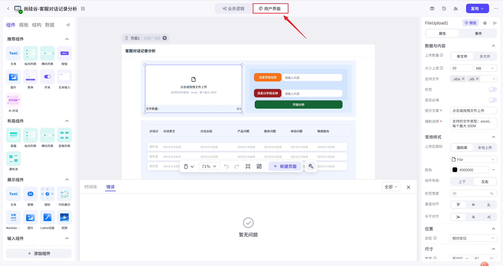

### 2.文件上传组件配置

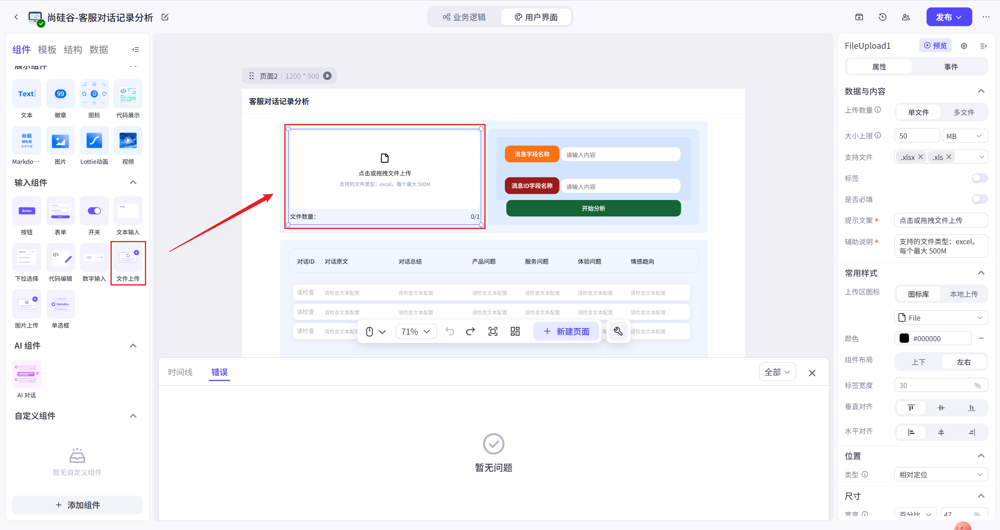

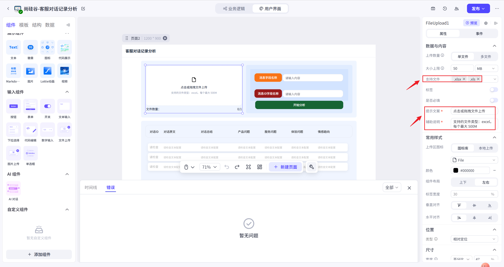

组件状态配置

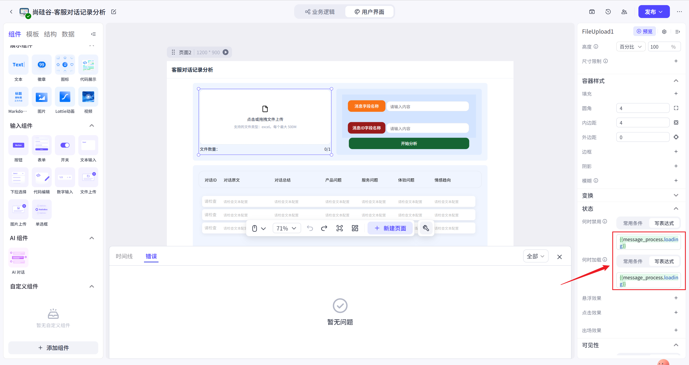

表达式为`{{message_process.loading}}`，表示工作流`message_process`正在运行，上图中的表示该工作流正在运行时当前组件展示位禁用并加载状态。

### 3.文本组件配置

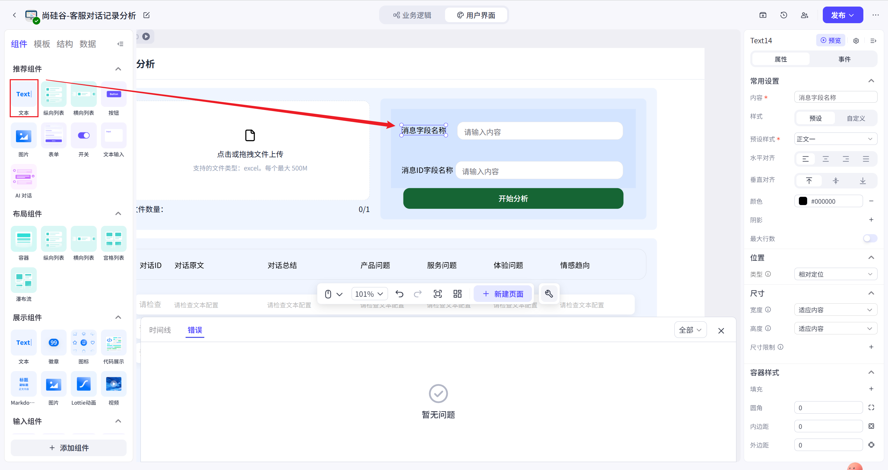

### 4.文本输入组件配置

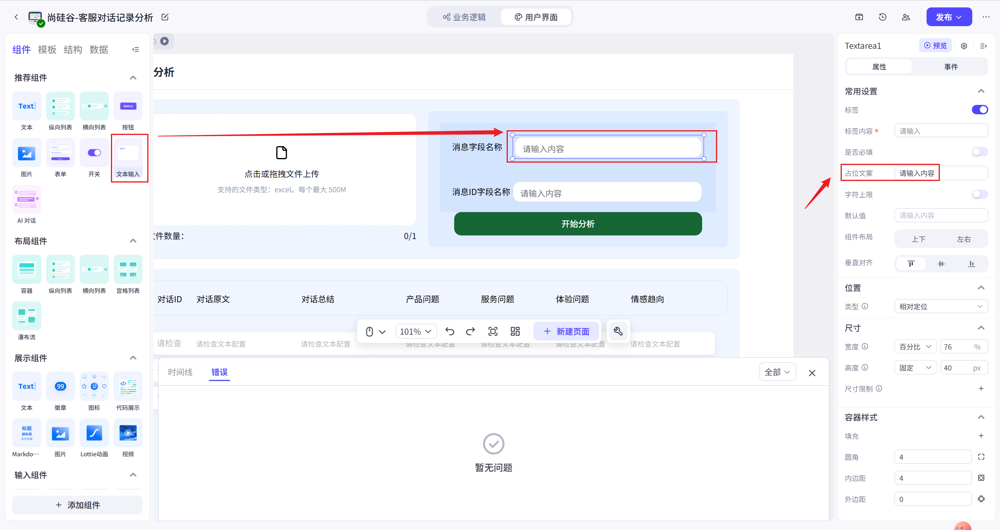

### 5.按钮组件配置

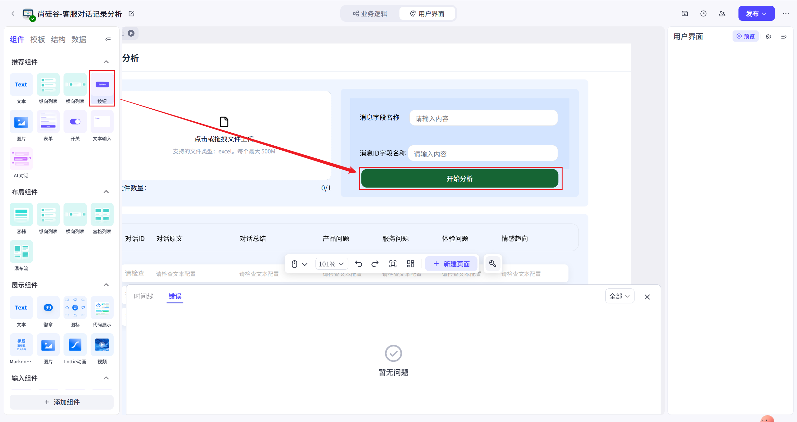

事件配置

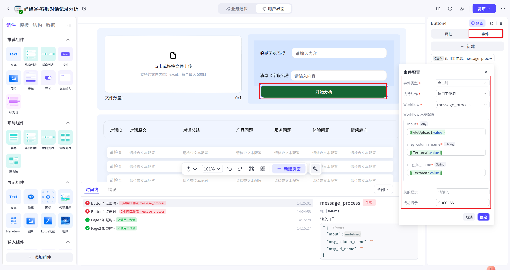

上述配置表示，单击当前按钮时，调用 message_process 工作流，工作流的 input 字段为 FileUpload1 组件的值，即用于上传的文件。msg_column_name 字段为 Textarea1 组件的值，msg_id_name 字段的值为 Textarea2 组件的值。

### 6.列表组件配置

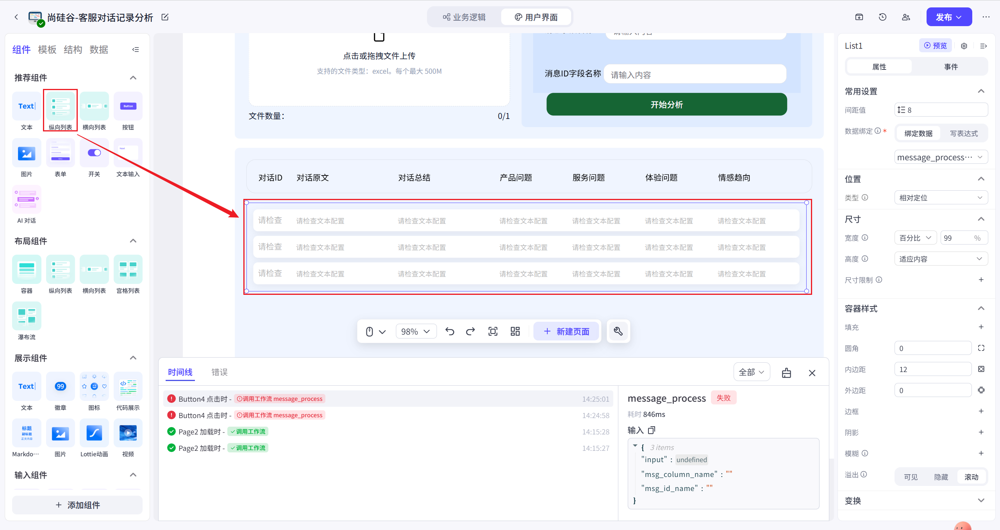

点击**结构**标签可以看到所有的组件结构，在 List1 标签下选中 Listitem1 标签，然后添加的组件都是归属于列表元素的子组件

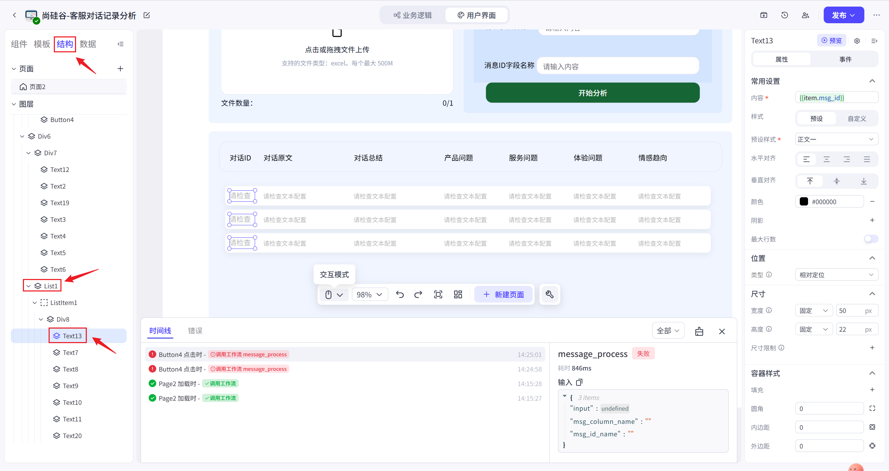

### 7.调试

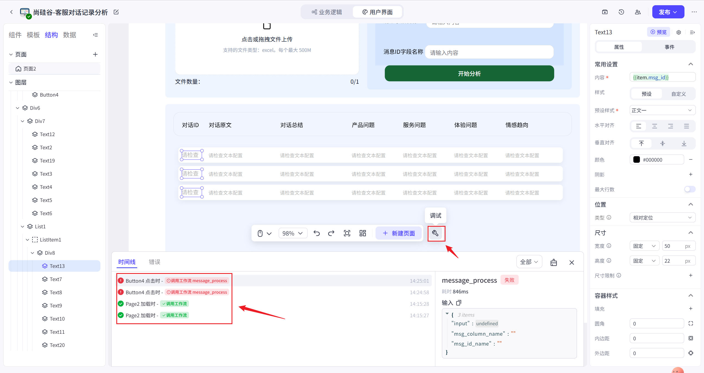

点击上图所示图标即可打开调试窗口。
