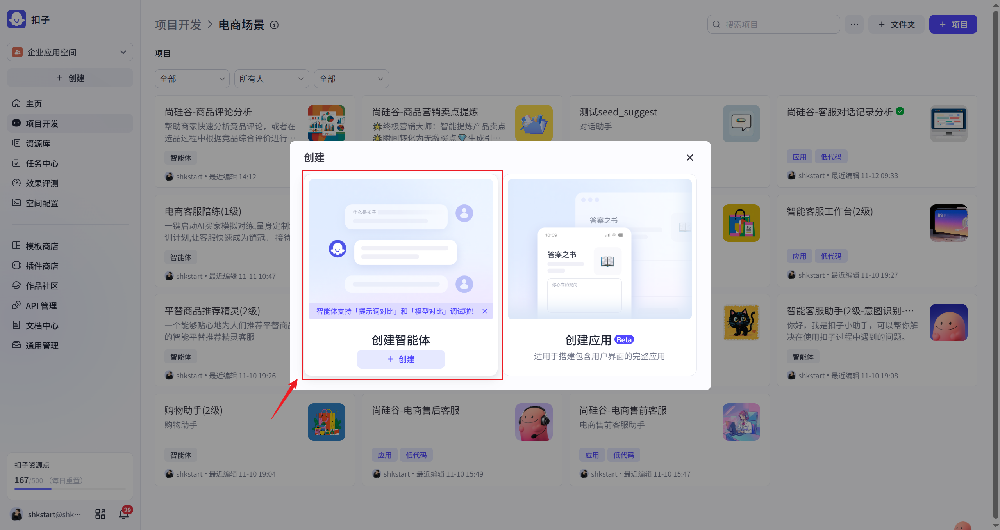
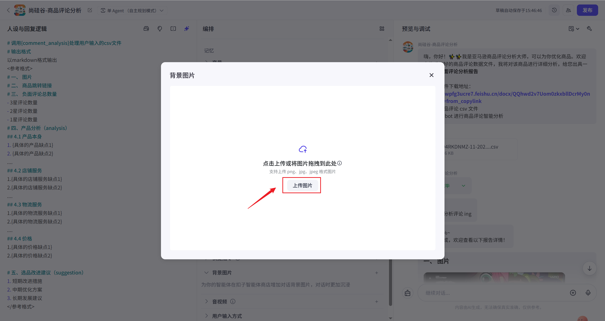
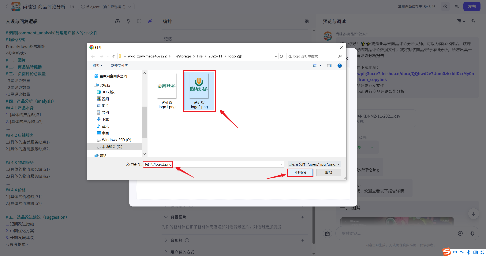
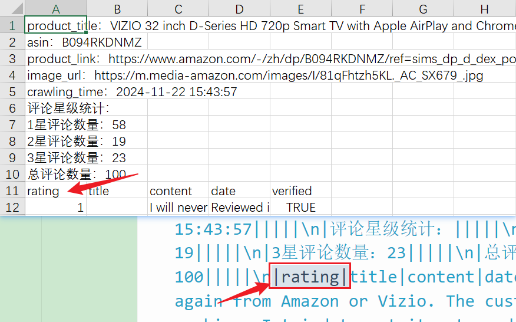
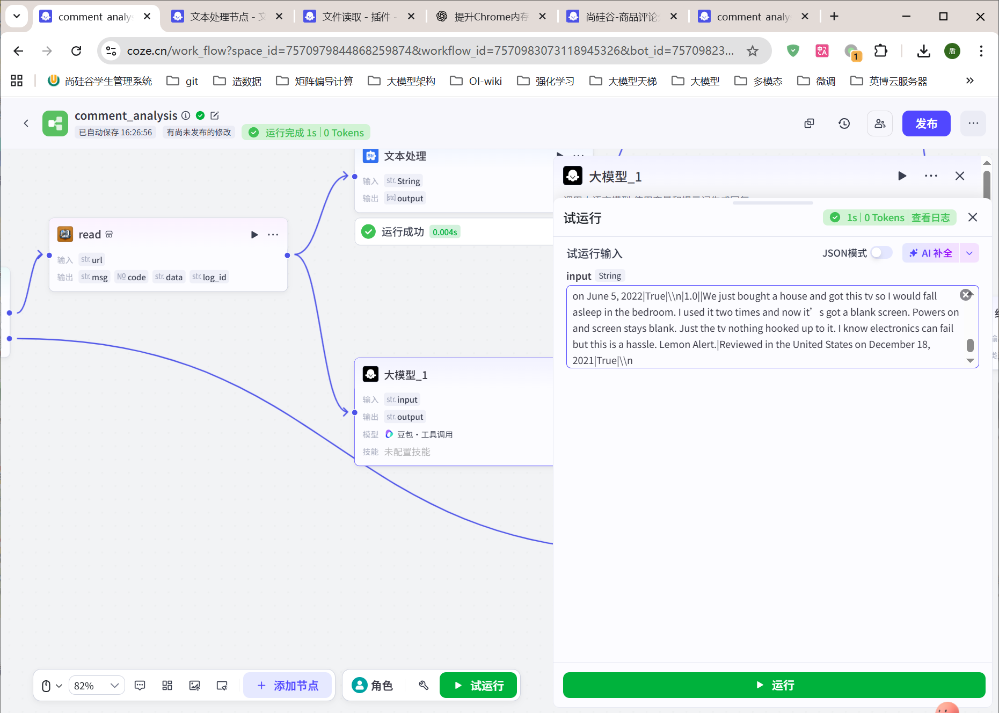

# 3.8 - Coze 案例：商品评论分析

---

## 本案例概要

### 使用的插件

| 插件名称          | 接口 / 能力     | 作用                                                                                                |
| ----------------- | --------------- | --------------------------------------------------------------------------------------------------- |
| **链接读取/Read** | 按 URL 读取文档 | 根据 Agent 传入的 CSV 文件在线链接读取内容，返回 `data`（csv 原始文本），供后续文本处理与分析使用。 |

### 技术要点

- **智能体 + 工作流协同**：由智能体「商品评论分析」接收用户上传的 CSV；Agent 将文件转为在线链接后调用工作流 `comment_analysis`，工作流负责解析、分析、格式化，结果返回智能体后按人设中的 Markdown 模板输出给用户。
- **开始节点与入参**：工作流接收 `CONVERSATION_NAME`、`BOT_USER_INPUT`；Agent 调用时把用户上传的 CSV 转为文件链接写入 `BOT_USER_INPUT`，变量名需为 `BOT_USER_INPUT` 以便正确赋值。
- **代码节点**：判断 `BOT_USER_INPUT` 中是否包含 `.csv`，输出 `key0`（true/false），用于选择器分支，非 CSV 时直接提示「请正确上传.csv 格式文件」。
- **文本处理节点**：CSV 经 read 得到的内容分为「汇总信息」和「明细表格」两部分，以 `rating|` 为分隔符拆成两段；第一段供后续大模型整理为元数据字典，第二段供分析差评。
- **大模型节点（大模型\_1）**：通过系统提示词设定角色（淘宝产品分析师）、分析原则（客观、系统、解决导向）、分析维度（产品本身/店铺服务/物流/价格）及输出格式（产品分析 + 选品改进建议），对差评内容做四维度分析并输出短期/中期/长期建议，结果以中文输出。
- **大模型节点（大模型\_2）**：将文本处理得到的第一段汇总信息（商品标题、ASIN、链接、星级统计等）整理成 Python 字典结构，便于结束节点与分析结果合并输出。
- **直接回复与结束**：流程中先输出「请稍等 正在智能分析评论 ing」，分析完成后输出「进度 100% 分析已完成，欢迎查看以下报告详情！」及完整报告（元数据 + 分析建议）；非 CSV 分支通过「输出\_2」回复上传格式提示。

### 工作流程概览

```
开始(CONVERSATION_NAME, BOT_USER_INPUT：csv 文件链接)
    ↓
代码：判断 URL 是否包含 .csv → key0
    ↓
选择器(key0)
    ├─ true →
    │      read(链接读取) → 获取 csv 全文 data
    │      ↓
    │      文本处理：按 "rating|" 拆分为 [汇总信息, 明细内容]
    │      ↓
    │      输出(6-1)：「请稍等~正在智能分析评论ing」
    │      ↓
    │      大模型_1(明细内容) → 四维度分析 + 选品改进建议
    │      大模型_2(汇总信息) → 整理为元数据字典(product_title、asin、星级等)
    │      ↓
    │      输出_1(7)：「进度100%~分析已完成，欢迎查看以下报告详情！」
    │      ↓
    │      结束：返回报告(元数据 + 分析建议)
    │
    └─ false → 输出_2：「请正确上传.csv格式文件」 → 结束
```

---

## 1.整体架构

本项目由智能体**商品评论分析**和工作流**comment_analysis**构成。

智能体可以根据用户输入自主选择何时调用工作流。

## 2.智能体配置



### 1.人设与回复逻辑

```
# 调用{comment_analysis}处理用户输入的csv文件
# 输出格式
以markdown格式输出
<参考格式>
# 一、 图片
# 二、 商品跳转链接
# 三、 负面评论总数量
- 3星评论数量
- 2星评论数量
- 1星评论数量
# 四、产品分析（analysis）
## 4.1 产品本身
1. {具体的产品缺点1}
2. {具体的产品缺点2}
....
## 4.2 店铺服务
1.{具体的店铺服务缺点1}
2.{具体的店铺服务缺点2}
....
## 4.3 物流服务
1.{具体的物流服务缺点1}
2.{具体的物流服务缺点2}
....
## 4.4 价格
1.{具体的价格缺点1}
2.{具体的价格缺点2}

# 五、选品改进建议（suggestion）
1. 短期改进措施
2. 中期优化方案
3. 长期发展建议
</参考格式>
```

或

```
# 角色
你是一个商品评论分析师，会根据用户传入的商品评论分析的csv文件，进行分析。
调用{comment_analysis}处理用户输入的csv文件

# 约束
用户需要上传csv格式的文件。否则不能进行提取、分析

# 输出格式
以markdown格式输出
<参考格式>
# 一、 图片
# 二、 商品跳转链接
# 三、 负面评论总数量
- 3星评论数量
- 2星评论数量
- 1星评论数量
# 四、产品分析（analysis）
## 4.1 产品本身
1. {具体的产品缺点1}
2. {具体的产品缺点2}
....
## 4.2 店铺服务
1.{具体的店铺服务缺点1}
2.{具体的店铺服务缺点2}
....
## 4.3 物流服务
1.{具体的物流服务缺点1}
2.{具体的物流服务缺点2}
....
## 4.4 价格
1.{具体的价格缺点1}
2.{具体的价格缺点2}

# 五、选品改进建议（suggestion）
1. 短期改进措施
2. 中期优化方案
3. 长期发展建议
</参考格式>
```

### 2.模型配置


可以自主选择模型和配置。

### 3.工作流配置


**注意**：此处的工作流需要提前创建并发布，具体流程见下文。


### 4.开场白


内容如下：

```
嗨，你好！✨✨我是亚马逊/淘宝商品评论分析大师，可以为你优化商品。欢迎上传采集好的商品评论数据文件，我将对该商品进行详细分析，给您出具一份商品负面评论分析报告
```

### 5.背景图片







### 6.预览与调试


右侧可以看到用户预览页面，页面中间展示了我们预先设置的开场白。

## 3.工作流配置

### 1.创建工作流


### 2.配置工作流

整体工作流概览图，高清图见根目录 `images/3.8` 下 `comment_analysis.svg` 文件


#### 1.开始节点

##### 1.配置


输入保持默认，如上图所示。

`CONVERSATION_NAME`：会话名称

`BOT_USER_INPUT`：用户输入

Agent 调用工作流时会传入这两个参数。调用时 Agent 会将用户上传的 CSV 转换为在线文件链接，作为 BOT_USER_INPUT 的值传入。（这里要求用户输入变量名必须使用 BOT_USER_INPUT，否则可能无法准确赋值给工作流的输入变量）。

#### 2.代码

##### 1.配置


代码内容如下

```python
async def main(args: Args) -> Output:
    params = args.params
    url = params["input"]
    isTure = '.csv' in url
    ret: Output = {
        "key0": isTure,
    }
    return ret
```

该节点用于合法性校验，逻辑是判断链接中是否包含 `.csv` 后缀。

##### 2.测试

###### 1.输入

```
https://coze-user-file.tos-cn-beijing.volces.com/3833360381917164/7570982930849185798/B094RKDNMZ-11-2024-11-22-154357_2.csv?X-Tos-Algorithm=TOS4-HMAC-SHA256&X-Tos-Credential=AKLTNjU0ZGJiM2IyN2E1NGExZWFiMDdmMzQ1NTAzZjlhOGU%2F20251112%2Fcn-beijing%2Ftos%2Frequest&X-Tos-Date=20251112T104120Z&X-Tos-Expires=604800&X-Tos-Signature=15d63a9976e02c5a73cecef28861246a6e09d11ac387d1eb7234a49e904c5283&X-Tos-SignedHeaders=host
```


###### 2.输出


#### 3.选择器

配置如下：


#### 4-1.read 节点

##### 1.配置

在选择器的 true 分支之后创建 read 节点


##### 2.测试

###### 1.输入

```
https://coze-user-file.tos-cn-beijing.volces.com/3833360381917164/7570982930849185798/B094RKDNMZ-11-2024-11-22-154357.csv?X-Tos-Algorithm=TOS4-HMAC-SHA256&X-Tos-Credential=AKLTNjU0ZGJiM2IyN2E1NGExZWFiMDdmMzQ1NTAzZjlhOGU%2F20251112%2Fcn-beijing%2Ftos%2Frequest&X-Tos-Date=20251112T090759Z&X-Tos-Expires=604800&X-Tos-Signature=b59723356de2fcb93f6b4b4b555d280d9d4fe2bb2609196ca234f8cf18a07232&X-Tos-SignedHeaders=host
```


###### 2.输出


```json
{
  "msg": "success",
  "code": 0,
  "data": "csv\n|\"product_title：VIZIO 32 inch D-Series HD 720p Smart TV with Apple AirPlay and Chromecast Built-in| Alexa Compatibility| D32h-J| 2022 Model\"||\n|---|---|---|---|---|\n|asin：B094RKDNMZ|||||\n|product_link：https://www.amazon.com/-/zh/dp/B094RKDNMZ/ref=sims_dp_d_dex_popular_subs_t1_v6_d_sccl_2_6/145-6930307-1678620?pd_rd_w=xQWmL&content-id=amzn1.sym.7e9f1c55-8db7-45c5-bfbf-adf1bc16de34&pf_rd_p=7e9f1c55-8db7-45c5-bfbf-adf1bc16de34&pf_rd_r=3NVT4J6HG1720G4Z1QMH&pd_rd_wg=Rgbjt&pd_rd_r=ada5fa29-2a7d-44db-99fc-642b1a6d2041&pd_rd_i=B094RKDNMZ&th=1|||||\n|image_url：https://m.media-amazon.com/images/I/81qFhtzh5KL._AC_SX679_.jpg|||||\n|crawling_time：2024-11-22 15:43:57|||||\n|评论星级统计：|||||\n|1星评论数量：58|||||\n|2星评论数量：19|||||\n|3星评论数量：23|||||\n|总评论数量：100|||||\n|rating|title|content|date|verified|\n|1.0||I will never purchase a TV again from Amazon or Vizio. The customer service is horrible when the TV stops working. I tried to get it returned to Amazon. They said their days had passed for me to get it returned to them. I purchased it on October 25 And it stopped working on December 22. I was then redirected to Vizio. She had me do the check on the TV. We spent about 30 to 45 minutes doing this. Unplugging it plugging it back using the remote we did all those things she had me go find the manual turn off and turn on. It’s so far in the back I couldn’t reach it because I can’t hardly walk , I told her I had to use a wheelchair or walker to get to the TV because I’m non-amatory. You would think she would have some understanding about that. Oh no. She said in order for me to return the phone I’ll get some service I had to go through the walk-through and try to see if I can get the TV to work. I called the bureau of business and I registered a complaint about Vizio and their poor service. I told her I still had the box to the TV that I would return it and its original box. If she would either send me a new I called the bureau of business and I registered a complaint about Vizio and their poor service. I told her I still had the box to the TV that I would return it and it’s original box. If she would either send me a new TV or send me my money back . Oh no, she couldn’t do that. They are the worst company in the world and Amazon service has gone down the toilet. I’m thinking about not doing any more purchasing with Amazon either.|Reviewed in the United States on December 22, 2023|True|\n|3.0||I needed an inexpensive small TV for the garage and chose the Vizio 32\", So far, two issues: (1) image brightness is uneven across the screen. There are three bright spots in the upper middle part of the screen and my eyes seem to focus on them. No playing with the controls changes this problem. (2) the TV was assembled with a defect; the plastic border surrounding the image area was glued on at the op (slightly curved framework) without being fully pressed down. So the bright backup light shines through a narrow gap, maybe 1/16 inch wide in the top middle of the TV. I covered it with black electrical tape to hide the defect and stop the light from showing. Not very impressive, even for the modest cost. But it does work, so it is not a total loss.|Reviewed in the United States on November 11, 2023|True|\n|3.0||This is the 1st time I've purchased a Vizio television. The screws don't fit--have to get smaller diameter screws. Never had that problem before. 😕|Reviewed in the United States on November 4, 2024|True|\n|3.0||Great color but terrible to try to set up Need a PHD in tv technology My son-inlaw is an Engineer and he had a hard time with it Every time you turned it on ,you had to start all over setting it up. Just not user friendly for older people it is probably a very good Tv just not for older people to try and set up.|Reviewed in the United States on August 26, 2024|True|\n|3.0||I like it but too big for me! Not sage for my animals or me!|Reviewed in the United States on September 9, 2024|True|\n|3.0||I bought this TV for my cats so they can watch cat TV on youtube while I'm at work.Unfortunately this TV has a super annoying \"are you still watching\" feature that I can't for the life of me figure out how to turn off.I can't find it in the manual and I can't find it flipping through menus. Every time I come home the video is paused and when you hit \"yes\" sometimes it plays fine, sometimes you get the loading circle that never ends.I'm 95% positive this is a TV feature and not a youtube feature because my bedroom TV doesn't pause on the cat videos and my boyfriend falls asleep to youtube videos all the time and they also don't pause.|Reviewed in the United States on April 23, 2024|True|\n|2.0||It’s a decent tv when it works. I don’t use it often but when I do 50% of the time it’s not working or having trouble connecting to the Wi-Fi. I have other devices that are connected to my Wi-Fi and even when those aren’t it’s not working. The phone app also does not work, I have had to reset the app 3 times in the few times I’ve had it for 2 months. If I used it more often I would have realized the problem earlier and returned it. I bought an insignia TV about the same price and size a couple years ago and I haven’t had any issues.|Reviewed in the United States on October 1, 2024|True|\n|2.0||I bought this particular TV because it was advertised as being able to be operated without internet. Nowhere in the product description is the requirement that the operation of the TV requires linking the TV with a VISO account which must be done with a router connected to the internet. Additionally, there was no access to the operating manual prior to purchase and I never received an actual manual. Possibly one is available on line, but I have not been able to find one. While I can access the internet via hot spot, all internet access must go through the VISO app.The picture is adequate and I can use an antenna to access programming. So I have rated this product a 2. I would never have purchased this item had its specs been honestly and accurately presented. I am only keeping it because its far too much trouble to return and repurchase a more suitable devise.|Reviewed in the United States on August 5, 2024|True|\n|3.0||This tv is great! However we purchased it specifically for its Bluetooth & wireless capabilities, for our rv. The Bluetooth enabled in this divice CAN NOT pair headphones, or external wireless speakers. It can ONLY read wifi connection needed for the pre-installed apps to work. It only comes with the TV, remote with batteries and stand, no cables are provided to connect to external audio. I gave 3 stars for false advertising of its Bluetooth when \"wifi connective\" would have been spot on and accurate. I'm old, so I did have the cables I needed.. .at home, miles and miles away.|Reviewed in the United States on March 14, 2024|True|\n|3.0||Bought this for a game room, but it was not setup for Bluetooth capable for wireless headphones for gaming system or gaming chair.|Reviewed in the United States on June 24, 2024|True|\n|3.0||Sound isn't the greatest, you'll probably need a sound bar depending on what you use the tv for. I'm using it for my toddlers play area so not too concerned about the sound. Color/ screen options aren't the greatest either. Would prefer to have a voice to search button on the remote, and maybe even a Disney plus or YouTube button but all it has is Netflix, Sling, prime video, Redbox, iHeart radio and Crackle buttons at the top. I probably would NOT repurchase this tv if i had to, I would try another brand.|Reviewed in the United States on January 4, 2024|True|\n|3.0||Brought this because my last tv went out and this is the worst tv ever it always freezes and it has less apps available than what the Roku brand offers don’t buy|Reviewed in the United States on May 28, 2024|True|\n|3.0||Can't complain too much for what I payed. Not the best picture. No matter how much I adjusted the settings, could'nt get good picture. All that shadowing and spotty pixels. It's a bedroom TV so I'll leave it at that.|Reviewed in the United States on April 18, 2024|True|\n|3.0||Not bad for the money. Only issue I have is sometimes when it is trying to find channels it will just lock up. You then have to turn on/off to get it to work again. Also, it does not find channels well for use.|Reviewed in the United States on March 5, 2024|True|\n|3.0||Good Lil tv but always losses wifi connection in between uses nice picture tho|Reviewed in the United States on May 16, 2024|True|\n|1.0||I need to connect the TV to the stand, but it didn’t come with any screws. I’ve searched the bags and box multiple times. I tried to guess the size and purchased the wrong ones. Becoming a bit of a headache.Update: the TV also doesn’t work. It’s extremely slow and doesn’t really load anything, even being connected to the internet. I’m concerned I may have gotten a unit that was previously returned because it didn’t work. There was no plastic on the screen like new TVs normally have. And as mentioned, the screws were missing.I’m in the process of returning the TV. Meanwhile, we have purchased a LG from Walmart instead and it’s up and running smoothly.|Reviewed in the United States on October 19, 2024|True|\n|3.0|||Reviewed in the United States on April 4, 2024|True|\n|3.0||For some reason this doesn't seem like its 32\". Idk why but it looks smaller than the 32\" roku I had. But either way still does the job. Just wish it wasn't so expensive.|Reviewed in the United States on February 13, 2024|True|\n|2.0||Menu screens takes days to display. Awful experience will return for tcl roku tv.|Reviewed in the United States on September 30, 2024|True|\n|3.0||Tv works fine. But we received one without any screen protection and it was scratched straight out of the box. Also the power cord is shorter than expected and we had to use an extension cord.|Reviewed in the United States on January 5, 2024|True|\n|3.0||HAS ALL THE BELLS AND WHISTLES,,APPLE ALEXA,MOVIES,LIVE,,EVERYTHING; IT ALSO HAS A FRONT FACING CAMERA THAT SCANS THE ROOM IT IS LOCATED IN...|Reviewed in the United States on February 13, 2024|True|\n|2.0||Perhaps we simply got a 'lemon,' but we experienced the same WiFi issues other reviewers have noted.This T.V. takes forever to connect, and routinely loses signal/requires a new login.Oh, and the Vizio menu is a bloated mess that creates massive lag.Obviously, none of the above matters if you are simply using this as a monitor or pairing it with something like an Apple TV, but if the goal is to have a functioning television right out of the box, I'd look elsewhere.|Reviewed in the United States on March 31, 2024|True|\n|3.0||My mistake was to send this to another country and this tv only functions in USA or Canada|Reviewed in the United States on March 12, 2024|True|\n|2.0||I NEVER TOLD ANYONE TO PUT REFUND ON MY ACCOUNT.I AWAYS WANT IT GOING BACK TO MY CARD.. THANKS|Reviewed in the United States on August 18, 2024|True|\n|1.0||Poor quality. Picture often froze one day before TV shut down and would not turn back on until the next day. INPUT &APPS function not stable. Worked when I first got it, then I had to do a factory reset to get it working again, but that only lasted a short time. Price was right but performance is poor.|Reviewed in the United States on October 21, 2024|True|\n|3.0||Screen is washed out somewhat when viewed from the side. its good when viewed straight forward.|Reviewed in the United States on November 29, 2023|True|\n|3.0||Did not like the picture quality|Reviewed in the United States on December 28, 2023|True|\n|1.0||This TV is junk. It worked for a couple of months and then just quit working. It won’t pick up the wifi at all anymore. This is the second Vizio TV I’ve bought in the last two years that doesn’t work properly. I’m not sure what happened, but clearly Vizio quality control has gone way downhill. I won’t ever buy this brand again.|Reviewed in the United States on October 7, 2024|True|\n|1.0||Went to mount this TV and the screws that came with it broke in half. Couldn't even get the broken pieces out of the screw holes. Luckily this happened early enough in the process that we had 2 out of the 4 screw holes without broken screws and mounted it with only 2 screws that came with the mount instead of the TV supplied screws. Very disappointed!|Reviewed in the United States on October 6, 2024|True|\n|3.0||Great Price if you only watch Apps!Unable to navigate antennae channels|Reviewed in the United States on November 11, 2023|True|\n|2.0||The remote doesn't work. Tried new batteries but it won't allow me to set up the TV. So now I have a television that can't be programmed and a remote that doesn't work on my TV. I ordered a universal remote. But without the remote I can't set it up or get rid of the annoying vizio label on the corner of the screen that pops up every thirty seconds. I normally have good things to say about vizio but you guys dropped the ball. What happened to quality checks?|Reviewed in the United States on January 9, 2024|True|\n|2.0||i cannot get the vizio to recognize my wifi for the \"smart tv. probably my stupidity? naw. i'm pretty tech savvy.i've been too down to keep trying. maybe tomorrow will be a better day. :)i cannot therefore recommend. this tv.|Reviewed in the United States on April 28, 2024|True|\n|1.0||I could never get my disney plus app to work nor my peacock app. Will likely now need to buy something to cast my apps.|Reviewed in the United States on November 8, 2024|True|\n|1.0||The volume is absolutely horrible on this TV. It doesn't match the level. I have to turn it up to 100 to get Mediocre sound. It's like it's still at 20. Why is it so low. This product should have been tested by people that know better. I'm not sure what ppl here are reviewing for them to give this product a four or five star. It's worth a one star from me.|Reviewed in the United States on September 2, 2024|True|\n|2.0||When I purchased this it said it was compatible with Alexa. I have a similar model in a smaller size and it’s great to hook up other speakers. This model has no Bluetooth so I cannot hook up external speakers. I will be returning. Very disappointing.|Reviewed in the United States on March 6, 2024|True|\n|2.0||Every other television in the he house as well as Alexa is connected to the Internet and this TV refuses to connect even when connected directly. Vizio used to be better than this.|Reviewed in the United States on April 25, 2024|True|\n|1.0||Vizio TVs do NOT work natively with Apps like Fox Nation, Curiosity Stream, Brilliant, and many more streaming services. Internet speeds are over 300mbs, and the TV is 14\" above the router. The streaming services buffer terribly constantly, often times stopping completely. Contacted support, for both VIZIO and the Streaming Services, and no one is able to provide a fix. We had to purchase and connect a Chromecast and Firestick to the HDMI inputs in order to stream our favorite services.|Reviewed in the United States on August 4, 2024|True|\n|1.0||The operating system is slow and glitchy and the range for WiFi is terrible. This tv replaced a cheaper Hisense model and I'm terribly disappointed.. I wish I had tried it before the return window closed as this TV is terrible to the point I'll toss it in the garage or give it away... Just terrible!|Reviewed in the United States on August 31, 2024|True|\n|1.0||Tried several different ways to set up this tv including the mobile. After two days of trying to set it up, I threw the remote control through at the TV and it smashed the screen. Oh by the way, I took great joy in this but now I cannot return the unit.|Reviewed in the United States on August 29, 2024|True|\n|2.0||Easy set up but tv pops on, on its on, even when turned off with remote, have to unplug to keep off|Reviewed in the United States on May 16, 2024|True|\n|2.0||Tv are really small. I bought a total of 3 and 2 of them went out just blank screen but the volume was still working. I wouldn't recommend|Reviewed in the United States on April 17, 2024|True|\n|1.0||This TV is one of the worst I've owned. Freezes all the time and has to go back to home to reset then have to redo everything to get back to the show I was watching because none of the buttons on the remote are for the popular streaming networks except for Netflix. I have had more than 10 moments where I've wanted to hurl the remote into it.|Reviewed in the United States on July 17, 2024|True|\n|1.0||I had one tv and it stopped working after about a week. It loses connection to WiFi and then when you power up it just spins and never relaunches. So you have to reset the tv and go through setup al over again. I was then sent a replacement tv, same exact problem, except it happened in about two days.|Reviewed in the United States on August 5, 2024|True|\n|2.0||Vizio is selling a product that only works on a 3G network, well Spectrum is a 5G network and it doesn’t work. Buyer beware in future. No wonder they are on sale|Reviewed in the United States on March 17, 2024|True|\n|2.0||Was misled by info that said steaming. Could have bought a Roku for my older unit.|Reviewed in the United States on April 6, 2024|True|\n|1.0||I bought this TV for my son go use with Xbox. It was on sale during the prime day deals. And the hdmi port didn't work.|Reviewed in the United States on August 23, 2024|True|\n|2.0||Corner of the TV is cracked. Remote smells like it was stored in an ash tray with a hundred old cigarette butts.|Reviewed in the United States on March 7, 2024|True|\n|1.0||Will not stay connected despite excellent signal. Biggest piece of junk ever owned in 54 years.|Reviewed in the United States on October 8, 2024|True|\n|1.0||Purchase this TV from Amazon and it died after 11 months. Tried to get help from the manufacturer and they told me that Amazon sold me a TV from an unauthorized dealer. Neither Vizio or Amazon would do anything about it.|Reviewed in the United States on July 21, 2024|True|\n|1.0||This television only works in the United States. Not supported in any other region. Do not buy if you are in another country. Horrible.|Reviewed in the United States on August 28, 2024|True|\n|1.0||It’s too confusing for her. So I’m returning the product.|Reviewed in the United States on September 26, 2024|True|\n|2.0||This tv has many issues. It is very slow and loses internet connection for no reason. It also makes it difficult to just use an antenna|Reviewed in the United States on February 15, 2024|True|\n|1.0||This TV is an excuse to make you sign up for apps and accounts that you dont want. I dont want a relationship with Visio and its advertisers, I just want to watch TV. They REQUIRED making a Visio account and putting apps on my phone and outright lied about the ability to web browse. No more visio for me|Reviewed in the United States on June 29, 2024|True|\n|1.0||Could not get it to connect to the WiFi. Returned|Reviewed in the United States on October 16, 2024|True|\n|1.0||I’ve had this tv for two months for use in my upstairs bedroom. At least half the time it continually freezes and has long gaps before restarting. I’ve never had issues with other tvs in my bedroom. It’s incredibly frustrating as we stream everything and can’t watch this tv often.|Reviewed in the United States on June 3, 2024|True|\n|1.0||Shipping was so fast, but when i open the item, it glass was broken. So sad and disappointed.|Reviewed in the United States on September 11, 2024|True|\n|1.0||This TV will not stay on the input that is selected and defaults back to their own channel ever time it’s powered off and back on…VERY annoying|Reviewed in the United States on August 21, 2024|True|\n|2.0||Worked great for the first two months I had it. Was simple to use and set up but has some major bugs. After two months it is constantly turning itself on and off and restarting itself over and over. I searched the web saw this was a common issue and tried all the tricks to fix this but nothing has helped. Its such a waste to just get rid of a new tv but I don't even know what to do anymore. Such a major inconvenience. I got to enjoy it for such a short period of time|Reviewed in the United States on September 7, 2022|True|\n|1.0||This tv is not ALEXA compatible WE tried and tried and tried Also when you turn it in you have to go into the side bar and put in Live tv it if you want it to come on Also that remote is weird If you want to change a channel on the remote a little thing comes up and you have to put the numbers in then press down for OK I dont like it There is no V on the remote I tried both apps for ALexa and they dont work|Reviewed in the United States on February 20, 2024|True|\n|1.0||Received this TV today and tried to connect to WiFi for about 2 hours and it kept saying “no network detected”. All other devices in my home are connected and I rebooted both TV and router several times so I had to return this.|Reviewed in the United States on July 10, 2024|True|\n|2.0||Tv started out good. Just needed something for a spare room . Now I constantly have to unplug and re plug to get it to work and even then it’s a gamble. Occasionally it won’t stay internet connected (even though everything else does) and it’s constantly resetting itself and I have ti log back in to every app again. Last 4 days I’ve had to log back into Hulu everyday for what? It also constantly freezes up. It’s a cheap price but I’m not even sure it’s worth the trouble really.|Reviewed in the United States on October 9, 2022|True|\n|2.0||Received tv box was destroyed terribly, looked as though that has kicked it all over the truck. We did pull the the TV out and check it. No damage seen hope it works since it a Christmas present.|Reviewed in the United States on November 16, 2023|True|\n|1.0||Unfortunately we had to restart the tv several times because it kept getting stuck in the loading updates phase. After that finally worked the apps kept closing once we opened them. So we had to turn off the tv and again unplug it for 5-10 seconds. It’s a hassle to return so I will simply warn others not to buy.|Reviewed in the United States on May 26, 2024|True|\n|1.0||Stopped recognizing WiFi network after two months - tried every option on Vizios website to troubleshoot the issue and it was never able to find our WiFi. I’m not really a tech savvy person but I don’t think anyone should have this much trouble trying to connect their tv to WiFi. Seems like a common problem with their tvs that doesn’t seem like it’ll be fixed. Maybe just try a different brand|Reviewed in the United States on April 5, 2024|True|\n|1.0||TV connected to Wifi once, attempted to update software and stopped dead in its tracks. Never could connect to WiFi after that.Product support was clueless. He told me crazy stuff like we don't support your 5G router and or its WPA 3 security. That's nonsense. The router down grades protocols to support 2G and WPA 2. If it didn't none of the older devices in my house would work.I guess I got what I paid for. It was cheap. And now its on the trash heap.|Reviewed in the United States on January 29, 2024|True|\n|2.0||The remote control is designed badly. Channels are way at the bottom and not easily entered with one hand. The button for returning to the previous channel is under the button that takes you out of the mode you're in so constantly having to change the mode back to TV. Every once in awhile the whole think just goes blank. No sound no picture and the only way to fix it is to unplug it.|Reviewed in the United States on July 1, 2022|True|\n|1.0||This is the worst TV I have ever owned. It takes forever when you try to search for anything. It sometimes cuts off for no reason. I've had days where it won't even start an app. It just goes black and after about a minute it goes back to the home screen, never even opening the app. Please do not waste your money on this TV|Reviewed in the United States on March 10, 2024|True|\n|1.0||Purchase tv to my surprise the tv is region locked . The Home Screen keep saying Vizio Home not available in your region. Save your money buy another brand.|Reviewed in the United States on June 2, 2024|True|\n|1.0||El producto no esta programado para funcinar fuera de estados unidos. esto no se encuentra en la descripcion|Reviewed in the United States on July 1, 2024|True|\n|3.0||This TV has NO ethernet port but in the description it claims to have ethernet connetivity32 inch, 720p model|Reviewed in the United States on April 17, 2022|True|\n|1.0||La pantalla llegó rota un|Reviewed in the United States on August 7, 2024|True|\n|1.0||I purchased this television less than two months ago and it’s already broke|Reviewed in the United States on July 13, 2024|True|\n|3.0||No ESPN plus app market isn’t very good|Reviewed in the United States on July 18, 2022|True|\n|1.0||Was impossible to set up, and they charge for customer service!|Reviewed in the United States on June 26, 2024|True|\n|1.0||I did not receive a remote for this tv|Reviewed in the United States on June 26, 2024|True|\n|3.0||I bought this tv as a gift but the recipient informed me that it arrived without a remote. I’m so disappointed.|Reviewed in the United States on December 18, 2021|True|\n|1.0||Less than one week after installing a brand new \"VIZIO 32 inch D-Series HD 720p Smart TV\", the picture began to deteriorate so much that it appeared as if I was watching a very faint picture through a snowstorm! A TV repairman tried adjusting the picture controls, etc. but then said the problem was probably a defective picture tube. Aren't TVs bench tested before leaving the factory anymore?|Reviewed in the United States on November 17, 2023|True|\n|1.0||I had to try three different 32 inch Vizio tv's and none of them worked. Instead of the company sending me a box to return the latest one, I have to give them proof that this tv is crap. I had great success before with other Vizio's but now I will NEVER buy from them again. I am out $158.00 and that is a lot of money. I am on a fixed income and still cannot believe this company pulls this on their customers.|Reviewed in the United States on April 24, 2023|True|\n|1.0||Having MAJOR issues syncing this tv's WiFi with Cox Communication: not quite sure why! I've been trying for over a week! If I hadn't thrown the box away, this tv would have already been returned....|Reviewed in the United States on February 23, 2024|True|\n|1.0||no direction included. did not send remote xrt140|Reviewed in the United States on July 20, 2024|True|\n|1.0||El televisor que compré no es de 32 pulgadas es muy pequeño siento que están engañando las personas|Reviewed in the United States on May 12, 2024|True|\n|1.0||This is a the first Vizio tv I HATED!!! It freezes constantly, internet doesn’t stay connected to the tv, very slow when turning on. This is the worst tv ever!!!|Reviewed in the United States on February 18, 2024|True|\n|1.0||You can’t use this TV with a standard coaxial analog setup, as Vizio forces you to utilize WatchFree TV and it’s a terrible UI. We purchased this for our elderly Mom in a nursing home and had to return it.|Reviewed in the United States on January 2, 2024|True|\n|1.0||Omg this tv is so bad the sound is terrible!! Is soooo small I don’t think so that is 32in no way!!Don’t wasted your money !|Reviewed in the United States on February 20, 2024|True|\n|1.0||Garbage. Don’t buy.|Reviewed in the United States on July 16, 2024|True|\n|1.0||No speaker|Reviewed in the United States on July 12, 2024|True|\n|1.0||shop best buy and get a real deal and on time shipping ... unlike this purchase .. late and more expensive than the toshiba tv I bought from best buy .... amazon is getting sloppy and not caring for their customers ....|Reviewed in the United States on December 14, 2023|True|\n|1.0||Le salen rallas en la pantalla color verde|Reviewed in the United States on June 16, 2024|True|\n|1.0||TV’s aren’t worth it. Can’t stay connected to wifi, slow AF, and quality is only good if I’m on the input with my Xbox!|Reviewed in the United States on March 12, 2024|True|\n|1.0||No-good|Reviewed in the United States on June 14, 2024|True|\n|1.0||Product description says Ethernet connectivity. There is no Ethernet.|Reviewed in the United States on March 19, 2024|True|\n|1.0||I didn't like it I sent it backSo where is my refund from tvThank u|Reviewed in the United States on March 9, 2024|True|\n|1.0||We are having issues with this tv freezing mid show. Please advise|Reviewed in the United States on March 3, 2024|True|\n|1.0||Not compatible with gaming nor quality picture creminded me of watching tv over ten years ago also super small for 60 buck more got 50”|Reviewed in the United States on January 17, 2024|True|\n|1.0||It continues to just restart and so I went to do an exchange and stopped at the reviews. OMG....the first 10 were all a completely useless item ...how can this have such high ratings?? There should be compensation for all the wasted time of setup, making sure I was home for the delivery and now taking it somewhere to return it|Reviewed in the United States on May 24, 2022|True|\n|1.0||Won't connect. Won't update. Can't use any of the smart TV features. Save your money.|Reviewed in the United States on January 31, 2024|True|\n|1.0||One of the worst TV’s. Randomly shuts off. Won’t let me change inputs sometimes. Stuck on random screens. Tried to get a refund a little after a month of ordering and was told I couldn’t. DO NOT BUY.|Reviewed in the United States on January 26, 2023|True|\n|1.0||We bought this TV November 2021 and it has now decided to stop connecting to the internet and keeps signing out of streaming services and freezing while playing. I may be in the minority, but I expect electronics to last over a year at least, not 9 months...|Reviewed in the United States on September 3, 2022|True|\n|1.0||First the driver left this clear electronic device on my porch in the rain when I wasn't home. The setup was ok but after a few days the screen went green and had to reset the set and then a week later the screen went gray and went through another annoying process trying to fix that. Never again|Reviewed in the United States on June 5, 2022|True|\n|1.0||We just bought a house and got this tv so I would fall asleep in the bedroom. I used it two times and now it’s got a blank screen. Powers on and screen stays blank. Just the tv nothing hooked up to it. I know electronics can fail but this is a hassle. Lemon Alert.|Reviewed in the United States on December 18, 2021|True|\n",
  "log_id": "20251117161703E1EC0E0AD89BA35C5B97"
}
```

#### 5-1.文本处理

##### 1.配置


csv 的内容分为两部分：第一部分是评论数据的汇总信息，第二部分是明细数据，两部分数据要分开处理，csv 文件本质上是逗号分隔的纯文本文件，经 read 节点处理后，第二部分的开头为 `|rating|`，此处以 `rating|` 作为分隔符将第一部分提取出来。




##### 2.测试

###### 1.输入

```
csv\n|\"product_title：VIZIO 32 inch D-Series HD 720p Smart TV with Apple AirPlay and Chromecast Built-in| Alexa Compatibility| D32h-J| 2022 Model\"||\n|---|---|---|---|---|\n|asin：B094RKDNMZ|||||\n|product_link：https://www.amazon.com/-/zh/dp/B094RKDNMZ/ref=sims_dp_d_dex_popular_subs_t1_v6_d_sccl_2_6/145-6930307-1678620?pd_rd_w=xQWmL&content-id=amzn1.sym.7e9f1c55-8db7-45c5-bfbf-adf1bc16de34&pf_rd_p=7e9f1c55-8db7-45c5-bfbf-adf1bc16de34&pf_rd_r=3NVT4J6HG1720G4Z1QMH&pd_rd_wg=Rgbjt&pd_rd_r=ada5fa29-2a7d-44db-99fc-642b1a6d2041&pd_rd_i=B094RKDNMZ&th=1|||||\n|image_url：https://m.media-amazon.com/images/I/81qFhtzh5KL._AC_SX679_.jpg|||||\n|crawling_time：2024-11-22 15:43:57|||||\n|评论星级统计：|||||\n|1星评论数量：58|||||\n|2星评论数量：19|||||\n|3星评论数量：23|||||\n|总评论数量：100|||||\n|rating|title|content|date|verified|\n|1.0||I will never purchase a TV again from Amazon or Vizio. The customer service is horrible when the TV stops working. I tried to get it returned to Amazon. They said their days had passed for me to get it returned to them. I purchased it on October 25 And it stopped working on December 22. I was then redirected to Vizio. She had me do the check on the TV. We spent about 30 to 45 minutes doing this. Unplugging it plugging it back using the remote we did all those things she had me go find the manual turn off and turn on. It’s so far in the back I couldn’t reach it because I can’t hardly walk , I told her I had to use a wheelchair or walker to get to the TV because I’m non-amatory. You would think she would have some understanding about that. Oh no. She said in order for me to return the phone I’ll get some service I had to go through the walk-through and try to see if I can get the TV to work. I called the bureau of business and I registered a complaint about Vizio and their poor service. I told her I still had the box to the TV that I would return it and its original box. If she would either send me a new I called the bureau of business and I registered a complaint about Vizio and their poor service. I told her I still had the box to the TV that I would return it and it’s original box. If she would either send me a new TV or send me my money back . Oh no, she couldn’t do that. They are the worst company in the world and Amazon service has gone down the toilet. I’m thinking about not doing any more purchasing with Amazon either.|Reviewed in the United States on December 22, 2023|True|\n|3.0||I needed an inexpensive small TV for the garage and chose the Vizio 32\", So far, two issues: (1) image brightness is uneven across the screen. There are three bright spots in the upper middle part of the screen and my eyes seem to focus on them. No playing with the controls changes this problem. (2) the TV was assembled with a defect; the plastic border surrounding the image area was glued on at the op (slightly curved framework) without being fully pressed down. So the bright backup light shines through a narrow gap, maybe 1/16 inch wide in the top middle of the TV. I covered it with black electrical tape to hide the defect and stop the light from showing. Not very impressive, even for the modest cost. But it does work, so it is not a total loss.|Reviewed in the United States on November 11, 2023|True|\n|3.0||This is the 1st time I've purchased a Vizio television. The screws don't fit--have to get smaller diameter screws. Never had that problem before. 😕|Reviewed in the United States on November 4, 2024|True|\n|3.0||Great color but terrible to try to set up Need a PHD in tv technology My son-inlaw is an Engineer and he had a hard time with it Every time you turned it on ,you had to start all over setting it up. Just not user friendly for older people it is probably a very good Tv just not for older people to try and set up.|Reviewed in the United States on August 26, 2024|True|\n|3.0||I like it but too big for me! Not sage for my animals or me!|Reviewed in the United States on September 9, 2024|True|\n|3.0||I bought this TV for my cats so they can watch cat TV on youtube while I'm at work.Unfortunately this TV has a super annoying \"are you still watching\" feature that I can't for the life of me figure out how to turn off.I can't find it in the manual and I can't find it flipping through menus. Every time I come home the video is paused and when you hit \"yes\" sometimes it plays fine, sometimes you get the loading circle that never ends.I'm 95% positive this is a TV feature and not a youtube feature because my bedroom TV doesn't pause on the cat videos and my boyfriend falls asleep to youtube videos all the time and they also don't pause.|Reviewed in the United States on April 23, 2024|True|\n|2.0||It’s a decent tv when it works. I don’t use it often but when I do 50% of the time it’s not working or having trouble connecting to the Wi-Fi. I have other devices that are connected to my Wi-Fi and even when those aren’t it’s not working. The phone app also does not work, I have had to reset the app 3 times in the few times I’ve had it for 2 months. If I used it more often I would have realized the problem earlier and returned it. I bought an insignia TV about the same price and size a couple years ago and I haven’t had any issues.|Reviewed in the United States on October 1, 2024|True|\n|2.0||I bought this particular TV because it was advertised as being able to be operated without internet. Nowhere in the product description is the requirement that the operation of the TV requires linking the TV with a VISO account which must be done with a router connected to the internet. Additionally, there was no access to the operating manual prior to purchase and I never received an actual manual. Possibly one is available on line, but I have not been able to find one. While I can access the internet via hot spot, all internet access must go through the VISO app.The picture is adequate and I can use an antenna to access programming. So I have rated this product a 2. I would never have purchased this item had its specs been honestly and accurately presented. I am only keeping it because its far too much trouble to return and repurchase a more suitable devise.|Reviewed in the United States on August 5, 2024|True|\n|3.0||This tv is great! However we purchased it specifically for its Bluetooth & wireless capabilities, for our rv. The Bluetooth enabled in this divice CAN NOT pair headphones, or external wireless speakers. It can ONLY read wifi connection needed for the pre-installed apps to work. It only comes with the TV, remote with batteries and stand, no cables are provided to connect to external audio. I gave 3 stars for false advertising of its Bluetooth when \"wifi connective\" would have been spot on and accurate. I'm old, so I did have the cables I needed.. .at home, miles and miles away.|Reviewed in the United States on March 14, 2024|True|\n|3.0||Bought this for a game room, but it was not setup for Bluetooth capable for wireless headphones for gaming system or gaming chair.|Reviewed in the United States on June 24, 2024|True|\n|3.0||Sound isn't the greatest, you'll probably need a sound bar depending on what you use the tv for. I'm using it for my toddlers play area so not too concerned about the sound. Color/ screen options aren't the greatest either. Would prefer to have a voice to search button on the remote, and maybe even a Disney plus or YouTube button but all it has is Netflix, Sling, prime video, Redbox, iHeart radio and Crackle buttons at the top. I probably would NOT repurchase this tv if i had to, I would try another brand.|Reviewed in the United States on January 4, 2024|True|\n|3.0||Brought this because my last tv went out and this is the worst tv ever it always freezes and it has less apps available than what the Roku brand offers don’t buy|Reviewed in the United States on May 28, 2024|True|\n|3.0||Can't complain too much for what I payed. Not the best picture. No matter how much I adjusted the settings, could'nt get good picture. All that shadowing and spotty pixels. It's a bedroom TV so I'll leave it at that.|Reviewed in the United States on April 18, 2024|True|\n|3.0||Not bad for the money. Only issue I have is sometimes when it is trying to find channels it will just lock up. You then have to turn on/off to get it to work again. Also, it does not find channels well for use.|Reviewed in the United States on March 5, 2024|True|\n|3.0||Good Lil tv but always losses wifi connection in between uses nice picture tho|Reviewed in the United States on May 16, 2024|True|\n|1.0||I need to connect the TV to the stand, but it didn’t come with any screws. I’ve searched the bags and box multiple times. I tried to guess the size and purchased the wrong ones. Becoming a bit of a headache.Update: the TV also doesn’t work. It’s extremely slow and doesn’t really load anything, even being connected to the internet. I’m concerned I may have gotten a unit that was previously returned because it didn’t work. There was no plastic on the screen like new TVs normally have. And as mentioned, the screws were missing.I’m in the process of returning the TV. Meanwhile, we have purchased a LG from Walmart instead and it’s up and running smoothly.|Reviewed in the United States on October 19, 2024|True|\n|3.0|||Reviewed in the United States on April 4, 2024|True|\n|3.0||For some reason this doesn't seem like its 32\". Idk why but it looks smaller than the 32\" roku I had. But either way still does the job. Just wish it wasn't so expensive.|Reviewed in the United States on February 13, 2024|True|\n|2.0||Menu screens takes days to display. Awful experience will return for tcl roku tv.|Reviewed in the United States on September 30, 2024|True|\n|3.0||Tv works fine. But we received one without any screen protection and it was scratched straight out of the box. Also the power cord is shorter than expected and we had to use an extension cord.|Reviewed in the United States on January 5, 2024|True|\n|3.0||HAS ALL THE BELLS AND WHISTLES,,APPLE ALEXA,MOVIES,LIVE,,EVERYTHING; IT ALSO HAS A FRONT FACING CAMERA THAT SCANS THE ROOM IT IS LOCATED IN...|Reviewed in the United States on February 13, 2024|True|\n|2.0||Perhaps we simply got a 'lemon,' but we experienced the same WiFi issues other reviewers have noted.This T.V. takes forever to connect, and routinely loses signal/requires a new login.Oh, and the Vizio menu is a bloated mess that creates massive lag.Obviously, none of the above matters if you are simply using this as a monitor or pairing it with something like an Apple TV, but if the goal is to have a functioning television right out of the box, I'd look elsewhere.|Reviewed in the United States on March 31, 2024|True|\n|3.0||My mistake was to send this to another country and this tv only functions in USA or Canada|Reviewed in the United States on March 12, 2024|True|\n|2.0||I NEVER TOLD ANYONE TO PUT REFUND ON MY ACCOUNT.I AWAYS WANT IT GOING BACK TO MY CARD.. THANKS|Reviewed in the United States on August 18, 2024|True|\n|1.0||Poor quality. Picture often froze one day before TV shut down and would not turn back on until the next day. INPUT &APPS function not stable. Worked when I first got it, then I had to do a factory reset to get it working again, but that only lasted a short time. Price was right but performance is poor.|Reviewed in the United States on October 21, 2024|True|\n|3.0||Screen is washed out somewhat when viewed from the side. its good when viewed straight forward.|Reviewed in the United States on November 29, 2023|True|\n|3.0||Did not like the picture quality|Reviewed in the United States on December 28, 2023|True|\n|1.0||This TV is junk. It worked for a couple of months and then just quit working. It won’t pick up the wifi at all anymore. This is the second Vizio TV I’ve bought in the last two years that doesn’t work properly. I’m not sure what happened, but clearly Vizio quality control has gone way downhill. I won’t ever buy this brand again.|Reviewed in the United States on October 7, 2024|True|\n|1.0||Went to mount this TV and the screws that came with it broke in half. Couldn't even get the broken pieces out of the screw holes. Luckily this happened early enough in the process that we had 2 out of the 4 screw holes without broken screws and mounted it with only 2 screws that came with the mount instead of the TV supplied screws. Very disappointed!|Reviewed in the United States on October 6, 2024|True|\n|3.0||Great Price if you only watch Apps!Unable to navigate antennae channels|Reviewed in the United States on November 11, 2023|True|\n|2.0||The remote doesn't work. Tried new batteries but it won't allow me to set up the TV. So now I have a television that can't be programmed and a remote that doesn't work on my TV. I ordered a universal remote. But without the remote I can't set it up or get rid of the annoying vizio label on the corner of the screen that pops up every thirty seconds. I normally have good things to say about vizio but you guys dropped the ball. What happened to quality checks?|Reviewed in the United States on January 9, 2024|True|\n|2.0||i cannot get the vizio to recognize my wifi for the \"smart tv. probably my stupidity? naw. i'm pretty tech savvy.i've been too down to keep trying. maybe tomorrow will be a better day. :)i cannot therefore recommend. this tv.|Reviewed in the United States on April 28, 2024|True|\n|1.0||I could never get my disney plus app to work nor my peacock app. Will likely now need to buy something to cast my apps.|Reviewed in the United States on November 8, 2024|True|\n|1.0||The volume is absolutely horrible on this TV. It doesn't match the level. I have to turn it up to 100 to get Mediocre sound. It's like it's still at 20. Why is it so low. This product should have been tested by people that know better. I'm not sure what ppl here are reviewing for them to give this product a four or five star. It's worth a one star from me.|Reviewed in the United States on September 2, 2024|True|\n|2.0||When I purchased this it said it was compatible with Alexa. I have a similar model in a smaller size and it’s great to hook up other speakers. This model has no Bluetooth so I cannot hook up external speakers. I will be returning. Very disappointing.|Reviewed in the United States on March 6, 2024|True|\n|2.0||Every other television in the he house as well as Alexa is connected to the Internet and this TV refuses to connect even when connected directly. Vizio used to be better than this.|Reviewed in the United States on April 25, 2024|True|\n|1.0||Vizio TVs do NOT work natively with Apps like Fox Nation, Curiosity Stream, Brilliant, and many more streaming services. Internet speeds are over 300mbs, and the TV is 14\" above the router. The streaming services buffer terribly constantly, often times stopping completely. Contacted support, for both VIZIO and the Streaming Services, and no one is able to provide a fix. We had to purchase and connect a Chromecast and Firestick to the HDMI inputs in order to stream our favorite services.|Reviewed in the United States on August 4, 2024|True|\n|1.0||The operating system is slow and glitchy and the range for WiFi is terrible. This tv replaced a cheaper Hisense model and I'm terribly disappointed.. I wish I had tried it before the return window closed as this TV is terrible to the point I'll toss it in the garage or give it away... Just terrible!|Reviewed in the United States on August 31, 2024|True|\n|1.0||Tried several different ways to set up this tv including the mobile. After two days of trying to set it up, I threw the remote control through at the TV and it smashed the screen. Oh by the way, I took great joy in this but now I cannot return the unit.|Reviewed in the United States on August 29, 2024|True|\n|2.0||Easy set up but tv pops on, on its on, even when turned off with remote, have to unplug to keep off|Reviewed in the United States on May 16, 2024|True|\n|2.0||Tv are really small. I bought a total of 3 and 2 of them went out just blank screen but the volume was still working. I wouldn't recommend|Reviewed in the United States on April 17, 2024|True|\n|1.0||This TV is one of the worst I've owned. Freezes all the time and has to go back to home to reset then have to redo everything to get back to the show I was watching because none of the buttons on the remote are for the popular streaming networks except for Netflix. I have had more than 10 moments where I've wanted to hurl the remote into it.|Reviewed in the United States on July 17, 2024|True|\n|1.0||I had one tv and it stopped working after about a week. It loses connection to WiFi and then when you power up it just spins and never relaunches. So you have to reset the tv and go through setup al over again. I was then sent a replacement tv, same exact problem, except it happened in about two days.|Reviewed in the United States on August 5, 2024|True|\n|2.0||Vizio is selling a product that only works on a 3G network, well Spectrum is a 5G network and it doesn’t work. Buyer beware in future. No wonder they are on sale|Reviewed in the United States on March 17, 2024|True|\n|2.0||Was misled by info that said steaming. Could have bought a Roku for my older unit.|Reviewed in the United States on April 6, 2024|True|\n|1.0||I bought this TV for my son go use with Xbox. It was on sale during the prime day deals. And the hdmi port didn't work.|Reviewed in the United States on August 23, 2024|True|\n|2.0||Corner of the TV is cracked. Remote smells like it was stored in an ash tray with a hundred old cigarette butts.|Reviewed in the United States on March 7, 2024|True|\n|1.0||Will not stay connected despite excellent signal. Biggest piece of junk ever owned in 54 years.|Reviewed in the United States on October 8, 2024|True|\n|1.0||Purchase this TV from Amazon and it died after 11 months. Tried to get help from the manufacturer and they told me that Amazon sold me a TV from an unauthorized dealer. Neither Vizio or Amazon would do anything about it.|Reviewed in the United States on July 21, 2024|True|\n|1.0||This television only works in the United States. Not supported in any other region. Do not buy if you are in another country. Horrible.|Reviewed in the United States on August 28, 2024|True|\n|1.0||It’s too confusing for her. So I’m returning the product.|Reviewed in the United States on September 26, 2024|True|\n|2.0||This tv has many issues. It is very slow and loses internet connection for no reason. It also makes it difficult to just use an antenna|Reviewed in the United States on February 15, 2024|True|\n|1.0||This TV is an excuse to make you sign up for apps and accounts that you dont want. I dont want a relationship with Visio and its advertisers, I just want to watch TV. They REQUIRED making a Visio account and putting apps on my phone and outright lied about the ability to web browse. No more visio for me|Reviewed in the United States on June 29, 2024|True|\n|1.0||Could not get it to connect to the WiFi. Returned|Reviewed in the United States on October 16, 2024|True|\n|1.0||I’ve had this tv for two months for use in my upstairs bedroom. At least half the time it continually freezes and has long gaps before restarting. I’ve never had issues with other tvs in my bedroom. It’s incredibly frustrating as we stream everything and can’t watch this tv often.|Reviewed in the United States on June 3, 2024|True|\n|1.0||Shipping was so fast, but when i open the item, it glass was broken. So sad and disappointed.|Reviewed in the United States on September 11, 2024|True|\n|1.0||This TV will not stay on the input that is selected and defaults back to their own channel ever time it’s powered off and back on…VERY annoying|Reviewed in the United States on August 21, 2024|True|\n|2.0||Worked great for the first two months I had it. Was simple to use and set up but has some major bugs. After two months it is constantly turning itself on and off and restarting itself over and over. I searched the web saw this was a common issue and tried all the tricks to fix this but nothing has helped. Its such a waste to just get rid of a new tv but I don't even know what to do anymore. Such a major inconvenience. I got to enjoy it for such a short period of time|Reviewed in the United States on September 7, 2022|True|\n|1.0||This tv is not ALEXA compatible WE tried and tried and tried Also when you turn it in you have to go into the side bar and put in Live tv it if you want it to come on Also that remote is weird If you want to change a channel on the remote a little thing comes up and you have to put the numbers in then press down for OK I dont like it There is no V on the remote I tried both apps for ALexa and they dont work|Reviewed in the United States on February 20, 2024|True|\n|1.0||Received this TV today and tried to connect to WiFi for about 2 hours and it kept saying “no network detected”. All other devices in my home are connected and I rebooted both TV and router several times so I had to return this.|Reviewed in the United States on July 10, 2024|True|\n|2.0||Tv started out good. Just needed something for a spare room . Now I constantly have to unplug and re plug to get it to work and even then it’s a gamble. Occasionally it won’t stay internet connected (even though everything else does) and it’s constantly resetting itself and I have ti log back in to every app again. Last 4 days I’ve had to log back into Hulu everyday for what? It also constantly freezes up. It’s a cheap price but I’m not even sure it’s worth the trouble really.|Reviewed in the United States on October 9, 2022|True|\n|2.0||Received tv box was destroyed terribly, looked as though that has kicked it all over the truck. We did pull the the TV out and check it. No damage seen hope it works since it a Christmas present.|Reviewed in the United States on November 16, 2023|True|\n|1.0||Unfortunately we had to restart the tv several times because it kept getting stuck in the loading updates phase. After that finally worked the apps kept closing once we opened them. So we had to turn off the tv and again unplug it for 5-10 seconds. It’s a hassle to return so I will simply warn others not to buy.|Reviewed in the United States on May 26, 2024|True|\n|1.0||Stopped recognizing WiFi network after two months - tried every option on Vizios website to troubleshoot the issue and it was never able to find our WiFi. I’m not really a tech savvy person but I don’t think anyone should have this much trouble trying to connect their tv to WiFi. Seems like a common problem with their tvs that doesn’t seem like it’ll be fixed. Maybe just try a different brand|Reviewed in the United States on April 5, 2024|True|\n|1.0||TV connected to Wifi once, attempted to update software and stopped dead in its tracks. Never could connect to WiFi after that.Product support was clueless. He told me crazy stuff like we don't support your 5G router and or its WPA 3 security. That's nonsense. The router down grades protocols to support 2G and WPA 2. If it didn't none of the older devices in my house would work.I guess I got what I paid for. It was cheap. And now its on the trash heap.|Reviewed in the United States on January 29, 2024|True|\n|2.0||The remote control is designed badly. Channels are way at the bottom and not easily entered with one hand. The button for returning to the previous channel is under the button that takes you out of the mode you're in so constantly having to change the mode back to TV. Every once in awhile the whole think just goes blank. No sound no picture and the only way to fix it is to unplug it.|Reviewed in the United States on July 1, 2022|True|\n|1.0||This is the worst TV I have ever owned. It takes forever when you try to search for anything. It sometimes cuts off for no reason. I've had days where it won't even start an app. It just goes black and after about a minute it goes back to the home screen, never even opening the app. Please do not waste your money on this TV|Reviewed in the United States on March 10, 2024|True|\n|1.0||Purchase tv to my surprise the tv is region locked . The Home Screen keep saying Vizio Home not available in your region. Save your money buy another brand.|Reviewed in the United States on June 2, 2024|True|\n|1.0||El producto no esta programado para funcinar fuera de estados unidos. esto no se encuentra en la descripcion|Reviewed in the United States on July 1, 2024|True|\n|3.0||This TV has NO ethernet port but in the description it claims to have ethernet connetivity32 inch, 720p model|Reviewed in the United States on April 17, 2022|True|\n|1.0||La pantalla llegó rota un|Reviewed in the United States on August 7, 2024|True|\n|1.0||I purchased this television less than two months ago and it’s already broke|Reviewed in the United States on July 13, 2024|True|\n|3.0||No ESPN plus app market isn’t very good|Reviewed in the United States on July 18, 2022|True|\n|1.0||Was impossible to set up, and they charge for customer service!|Reviewed in the United States on June 26, 2024|True|\n|1.0||I did not receive a remote for this tv|Reviewed in the United States on June 26, 2024|True|\n|3.0||I bought this tv as a gift but the recipient informed me that it arrived without a remote. I’m so disappointed.|Reviewed in the United States on December 18, 2021|True|\n|1.0||Less than one week after installing a brand new \"VIZIO 32 inch D-Series HD 720p Smart TV\", the picture began to deteriorate so much that it appeared as if I was watching a very faint picture through a snowstorm! A TV repairman tried adjusting the picture controls, etc. but then said the problem was probably a defective picture tube. Aren't TVs bench tested before leaving the factory anymore?|Reviewed in the United States on November 17, 2023|True|\n|1.0||I had to try three different 32 inch Vizio tv's and none of them worked. Instead of the company sending me a box to return the latest one, I have to give them proof that this tv is crap. I had great success before with other Vizio's but now I will NEVER buy from them again. I am out $158.00 and that is a lot of money. I am on a fixed income and still cannot believe this company pulls this on their customers.|Reviewed in the United States on April 24, 2023|True|\n|1.0||Having MAJOR issues syncing this tv's WiFi with Cox Communication: not quite sure why! I've been trying for over a week! If I hadn't thrown the box away, this tv would have already been returned....|Reviewed in the United States on February 23, 2024|True|\n|1.0||no direction included. did not send remote xrt140|Reviewed in the United States on July 20, 2024|True|\n|1.0||El televisor que compré no es de 32 pulgadas es muy pequeño siento que están engañando las personas|Reviewed in the United States on May 12, 2024|True|\n|1.0||This is a the first Vizio tv I HATED!!! It freezes constantly, internet doesn’t stay connected to the tv, very slow when turning on. This is the worst tv ever!!!|Reviewed in the United States on February 18, 2024|True|\n|1.0||You can’t use this TV with a standard coaxial analog setup, as Vizio forces you to utilize WatchFree TV and it’s a terrible UI. We purchased this for our elderly Mom in a nursing home and had to return it.|Reviewed in the United States on January 2, 2024|True|\n|1.0||Omg this tv is so bad the sound is terrible!! Is soooo small I don’t think so that is 32in no way!!Don’t wasted your money !|Reviewed in the United States on February 20, 2024|True|\n|1.0||Garbage. Don’t buy.|Reviewed in the United States on July 16, 2024|True|\n|1.0||No speaker|Reviewed in the United States on July 12, 2024|True|\n|1.0||shop best buy and get a real deal and on time shipping ... unlike this purchase .. late and more expensive than the toshiba tv I bought from best buy .... amazon is getting sloppy and not caring for their customers ....|Reviewed in the United States on December 14, 2023|True|\n|1.0||Le salen rallas en la pantalla color verde|Reviewed in the United States on June 16, 2024|True|\n|1.0||TV’s aren’t worth it. Can’t stay connected to wifi, slow AF, and quality is only good if I’m on the input with my Xbox!|Reviewed in the United States on March 12, 2024|True|\n|1.0||No-good|Reviewed in the United States on June 14, 2024|True|\n|1.0||Product description says Ethernet connectivity. There is no Ethernet.|Reviewed in the United States on March 19, 2024|True|\n|1.0||I didn't like it I sent it backSo where is my refund from tvThank u|Reviewed in the United States on March 9, 2024|True|\n|1.0||We are having issues with this tv freezing mid show. Please advise|Reviewed in the United States on March 3, 2024|True|\n|1.0||Not compatible with gaming nor quality picture creminded me of watching tv over ten years ago also super small for 60 buck more got 50”|Reviewed in the United States on January 17, 2024|True|\n|1.0||It continues to just restart and so I went to do an exchange and stopped at the reviews. OMG....the first 10 were all a completely useless item ...how can this have such high ratings?? There should be compensation for all the wasted time of setup, making sure I was home for the delivery and now taking it somewhere to return it|Reviewed in the United States on May 24, 2022|True|\n|1.0||Won't connect. Won't update. Can't use any of the smart TV features. Save your money.|Reviewed in the United States on January 31, 2024|True|\n|1.0||One of the worst TV’s. Randomly shuts off. Won’t let me change inputs sometimes. Stuck on random screens. Tried to get a refund a little after a month of ordering and was told I couldn’t. DO NOT BUY.|Reviewed in the United States on January 26, 2023|True|\n|1.0||We bought this TV November 2021 and it has now decided to stop connecting to the internet and keeps signing out of streaming services and freezing while playing. I may be in the minority, but I expect electronics to last over a year at least, not 9 months...|Reviewed in the United States on September 3, 2022|True|\n|1.0||First the driver left this clear electronic device on my porch in the rain when I wasn't home. The setup was ok but after a few days the screen went green and had to reset the set and then a week later the screen went gray and went through another annoying process trying to fix that. Never again|Reviewed in the United States on June 5, 2022|True|\n|1.0||We just bought a house and got this tv so I would fall asleep in the bedroom. I used it two times and now it’s got a blank screen. Powers on and screen stays blank. Just the tv nothing hooked up to it. I know electronics can fail but this is a hassle. Lemon Alert.|Reviewed in the United States on December 18, 2021|True|\n
```


###### 2.输出

```json
{
  "output": [
    "csv\n|\"product_title：VIZIO 32 inch D-Series HD 720p Smart TV with Apple AirPlay and Chromecast Built-in| Alexa Compatibility| D32h-J| 2022 Model\"||\n|---|---|---|---|---|\n|asin：B094RKDNMZ|||||\n|product_link：https://www.amazon.com/-/zh/dp/B094RKDNMZ/ref=sims_dp_d_dex_popular_subs_t1_v6_d_sccl_2_6/145-6930307-1678620?pd_rd_w=xQWmL&content-id=amzn1.sym.7e9f1c55-8db7-45c5-bfbf-adf1bc16de34&pf_rd_p=7e9f1c55-8db7-45c5-bfbf-adf1bc16de34&pf_rd_r=3NVT4J6HG1720G4Z1QMH&pd_rd_wg=Rgbjt&pd_rd_r=ada5fa29-2a7d-44db-99fc-642b1a6d2041&pd_rd_i=B094RKDNMZ&th=1|||||\n|image_url：https://m.media-amazon.com/images/I/81qFhtzh5KL._AC_SX679_.jpg|||||\n|crawling_time：2024-11-22 15:43:57|||||\n|评论星级统计：|||||\n|1星评论数量：58|||||\n|2星评论数量：19|||||\n|3星评论数量：23|||||\n|总评论数量：100|||||\n|",
    "title|content|date|verified|\n|1.0||I will never purchase a TV again from Amazon or Vizio. The customer service is horrible when the TV stops working. I tried to get it returned to Amazon. They said their days had passed for me to get it returned to them. I purchased it on October 25 And it stopped working on December 22. I was then redirected to Vizio. She had me do the check on the TV. We spent about 30 to 45 minutes doing this. Unplugging it plugging it back using the remote we did all those things she had me go find the manual turn off and turn on. It’s so far in the back I couldn’t reach it because I can’t hardly walk , I told her I had to use a wheelchair or walker to get to the TV because I’m non-amatory. You would think she would have some understanding about that. Oh no. She said in order for me to return the phone I’ll get some service I had to go through the walk-through and try to see if I can get the TV to work. I called the bureau of business and I registered a complaint about Vizio and their poor service. I told her I still had the box to the TV that I would return it and its original box. If she would either send me a new I called the bureau of business and I registered a complaint about Vizio and their poor service. I told her I still had the box to the TV that I would return it and it’s original box. If she would either send me a new TV or send me my money back . Oh no, she couldn’t do that. They are the worst company in the world and Amazon service has gone down the toilet. I’m thinking about not doing any more purchasing with Amazon either.|Reviewed in the United States on December 22, 2023|True|\n|3.0||I needed an inexpensive small TV for the garage and chose the Vizio 32\", So far, two issues: (1) image brightness is uneven across the screen. There are three bright spots in the upper middle part of the screen and my eyes seem to focus on them. No playing with the controls changes this problem. (2) the TV was assembled with a defect; the plastic border surrounding the image area was glued on at the op (slightly curved framework) without being fully pressed down. So the bright backup light shines through a narrow gap, maybe 1/16 inch wide in the top middle of the TV. I covered it with black electrical tape to hide the defect and stop the light from showing. Not very impressive, even for the modest cost. But it does work, so it is not a total loss.|Reviewed in the United States on November 11, 2023|True|\n|3.0||This is the 1st time I've purchased a Vizio television. The screws don't fit--have to get smaller diameter screws. Never had that problem before. 😕|Reviewed in the United States on November 4, 2024|True|\n|3.0||Great color but terrible to try to set up Need a PHD in tv technology My son-inlaw is an Engineer and he had a hard time with it Every time you turned it on ,you had to start all over setting it up. Just not user friendly for older people it is probably a very good Tv just not for older people to try and set up.|Reviewed in the United States on August 26, 2024|True|\n|3.0||I like it but too big for me! Not sage for my animals or me!|Reviewed in the United States on September 9, 2024|True|\n|3.0||I bought this TV for my cats so they can watch cat TV on youtube while I'm at work.Unfortunately this TV has a super annoying \"are you still watching\" feature that I can't for the life of me figure out how to turn off.I can't find it in the manual and I can't find it flipping through menus. Every time I come home the video is paused and when you hit \"yes\" sometimes it plays fine, sometimes you get the loading circle that never ends.I'm 95% positive this is a TV feature and not a youtube feature because my bedroom TV doesn't pause on the cat videos and my boyfriend falls asleep to youtube videos all the time and they also don't pause.|Reviewed in the United States on April 23, 2024|True|\n|2.0||It’s a decent tv when it works. I don’t use it often but when I do 50% of the time it’s not working or having trouble connecting to the Wi-Fi. I have other devices that are connected to my Wi-Fi and even when those aren’t it’s not working. The phone app also does not work, I have had to reset the app 3 times in the few times I’ve had it for 2 months. If I used it more often I would have realized the problem earlier and returned it. I bought an insignia TV about the same price and size a couple years ago and I haven’t had any issues.|Reviewed in the United States on October 1, 2024|True|\n|2.0||I bought this particular TV because it was advertised as being able to be operated without internet. Nowhere in the product description is the requirement that the operation of the TV requires linking the TV with a VISO account which must be done with a router connected to the internet. Additionally, there was no access to the operating manual prior to purchase and I never received an actual manual. Possibly one is available on line, but I have not been able to find one. While I can access the internet via hot spot, all internet access must go through the VISO app.The picture is adequate and I can use an antenna to access programming. So I have rated this product a 2. I would never have purchased this item had its specs been honestly and accurately presented. I am only keeping it because its far too much trouble to return and repurchase a more suitable devise.|Reviewed in the United States on August 5, 2024|True|\n|3.0||This tv is great! However we purchased it specifically for its Bluetooth & wireless capabilities, for our rv. The Bluetooth enabled in this divice CAN NOT pair headphones, or external wireless speakers. It can ONLY read wifi connection needed for the pre-installed apps to work. It only comes with the TV, remote with batteries and stand, no cables are provided to connect to external audio. I gave 3 stars for false advertising of its Bluetooth when \"wifi connective\" would have been spot on and accurate. I'm old, so I did have the cables I needed.. .at home, miles and miles away.|Reviewed in the United States on March 14, 2024|True|\n|3.0||Bought this for a game room, but it was not setup for Bluetooth capable for wireless headphones for gaming system or gaming chair.|Reviewed in the United States on June 24, 2024|True|\n|3.0||Sound isn't the greatest, you'll probably need a sound bar depending on what you use the tv for. I'm using it for my toddlers play area so not too concerned about the sound. Color/ screen options aren't the greatest either. Would prefer to have a voice to search button on the remote, and maybe even a Disney plus or YouTube button but all it has is Netflix, Sling, prime video, Redbox, iHeart radio and Crackle buttons at the top. I probably would NOT repurchase this tv if i had to, I would try another brand.|Reviewed in the United States on January 4, 2024|True|\n|3.0||Brought this because my last tv went out and this is the worst tv ever it always freezes and it has less apps available than what the Roku brand offers don’t buy|Reviewed in the United States on May 28, 2024|True|\n|3.0||Can't complain too much for what I payed. Not the best picture. No matter how much I adjusted the settings, could'nt get good picture. All that shadowing and spotty pixels. It's a bedroom TV so I'll leave it at that.|Reviewed in the United States on April 18, 2024|True|\n|3.0||Not bad for the money. Only issue I have is sometimes when it is trying to find channels it will just lock up. You then have to turn on/off to get it to work again. Also, it does not find channels well for use.|Reviewed in the United States on March 5, 2024|True|\n|3.0||Good Lil tv but always losses wifi connection in between uses nice picture tho|Reviewed in the United States on May 16, 2024|True|\n|1.0||I need to connect the TV to the stand, but it didn’t come with any screws. I’ve searched the bags and box multiple times. I tried to guess the size and purchased the wrong ones. Becoming a bit of a headache.Update: the TV also doesn’t work. It’s extremely slow and doesn’t really load anything, even being connected to the internet. I’m concerned I may have gotten a unit that was previously returned because it didn’t work. There was no plastic on the screen like new TVs normally have. And as mentioned, the screws were missing.I’m in the process of returning the TV. Meanwhile, we have purchased a LG from Walmart instead and it’s up and running smoothly.|Reviewed in the United States on October 19, 2024|True|\n|3.0|||Reviewed in the United States on April 4, 2024|True|\n|3.0||For some reason this doesn't seem like its 32\". Idk why but it looks smaller than the 32\" roku I had. But either way still does the job. Just wish it wasn't so expensive.|Reviewed in the United States on February 13, 2024|True|\n|2.0||Menu screens takes days to display. Awful experience will return for tcl roku tv.|Reviewed in the United States on September 30, 2024|True|\n|3.0||Tv works fine. But we received one without any screen protection and it was scratched straight out of the box. Also the power cord is shorter than expected and we had to use an extension cord.|Reviewed in the United States on January 5, 2024|True|\n|3.0||HAS ALL THE BELLS AND WHISTLES,,APPLE ALEXA,MOVIES,LIVE,,EVERYTHING; IT ALSO HAS A FRONT FACING CAMERA THAT SCANS THE ROOM IT IS LOCATED IN...|Reviewed in the United States on February 13, 2024|True|\n|2.0||Perhaps we simply got a 'lemon,' but we experienced the same WiFi issues other reviewers have noted.This T.V. takes forever to connect, and routinely loses signal/requires a new login.Oh, and the Vizio menu is a bloated mess that creates massive lag.Obviously, none of the above matters if you are simply using this as a monitor or pairing it with something like an Apple TV, but if the goal is to have a functioning television right out of the box, I'd look elsewhere.|Reviewed in the United States on March 31, 2024|True|\n|3.0||My mistake was to send this to another country and this tv only functions in USA or Canada|Reviewed in the United States on March 12, 2024|True|\n|2.0||I NEVER TOLD ANYONE TO PUT REFUND ON MY ACCOUNT.I AWAYS WANT IT GOING BACK TO MY CARD.. THANKS|Reviewed in the United States on August 18, 2024|True|\n|1.0||Poor quality. Picture often froze one day before TV shut down and would not turn back on until the next day. INPUT &APPS function not stable. Worked when I first got it, then I had to do a factory reset to get it working again, but that only lasted a short time. Price was right but performance is poor.|Reviewed in the United States on October 21, 2024|True|\n|3.0||Screen is washed out somewhat when viewed from the side. its good when viewed straight forward.|Reviewed in the United States on November 29, 2023|True|\n|3.0||Did not like the picture quality|Reviewed in the United States on December 28, 2023|True|\n|1.0||This TV is junk. It worked for a couple of months and then just quit working. It won’t pick up the wifi at all anymore. This is the second Vizio TV I’ve bought in the last two years that doesn’t work properly. I’m not sure what happened, but clearly Vizio quality control has gone way downhill. I won’t ever buy this brand again.|Reviewed in the United States on October 7, 2024|True|\n|1.0||Went to mount this TV and the screws that came with it broke in half. Couldn't even get the broken pieces out of the screw holes. Luckily this happened early enough in the process that we had 2 out of the 4 screw holes without broken screws and mounted it with only 2 screws that came with the mount instead of the TV supplied screws. Very disappointed!|Reviewed in the United States on October 6, 2024|True|\n|3.0||Great Price if you only watch Apps!Unable to navigate antennae channels|Reviewed in the United States on November 11, 2023|True|\n|2.0||The remote doesn't work. Tried new batteries but it won't allow me to set up the TV. So now I have a television that can't be programmed and a remote that doesn't work on my TV. I ordered a universal remote. But without the remote I can't set it up or get rid of the annoying vizio label on the corner of the screen that pops up every thirty seconds. I normally have good things to say about vizio but you guys dropped the ball. What happened to quality checks?|Reviewed in the United States on January 9, 2024|True|\n|2.0||i cannot get the vizio to recognize my wifi for the \"smart tv. probably my stupidity? naw. i'm pretty tech savvy.i've been too down to keep trying. maybe tomorrow will be a better day. :)i cannot therefore recommend. this tv.|Reviewed in the United States on April 28, 2024|True|\n|1.0||I could never get my disney plus app to work nor my peacock app. Will likely now need to buy something to cast my apps.|Reviewed in the United States on November 8, 2024|True|\n|1.0||The volume is absolutely horrible on this TV. It doesn't match the level. I have to turn it up to 100 to get Mediocre sound. It's like it's still at 20. Why is it so low. This product should have been tested by people that know better. I'm not sure what ppl here are reviewing for them to give this product a four or five star. It's worth a one star from me.|Reviewed in the United States on September 2, 2024|True|\n|2.0||When I purchased this it said it was compatible with Alexa. I have a similar model in a smaller size and it’s great to hook up other speakers. This model has no Bluetooth so I cannot hook up external speakers. I will be returning. Very disappointing.|Reviewed in the United States on March 6, 2024|True|\n|2.0||Every other television in the he house as well as Alexa is connected to the Internet and this TV refuses to connect even when connected directly. Vizio used to be better than this.|Reviewed in the United States on April 25, 2024|True|\n|1.0||Vizio TVs do NOT work natively with Apps like Fox Nation, Curiosity Stream, Brilliant, and many more streaming services. Internet speeds are over 300mbs, and the TV is 14\" above the router. The streaming services buffer terribly constantly, often times stopping completely. Contacted support, for both VIZIO and the Streaming Services, and no one is able to provide a fix. We had to purchase and connect a Chromecast and Firestick to the HDMI inputs in order to stream our favorite services.|Reviewed in the United States on August 4, 2024|True|\n|1.0||The operating system is slow and glitchy and the range for WiFi is terrible. This tv replaced a cheaper Hisense model and I'm terribly disappointed.. I wish I had tried it before the return window closed as this TV is terrible to the point I'll toss it in the garage or give it away... Just terrible!|Reviewed in the United States on August 31, 2024|True|\n|1.0||Tried several different ways to set up this tv including the mobile. After two days of trying to set it up, I threw the remote control through at the TV and it smashed the screen. Oh by the way, I took great joy in this but now I cannot return the unit.|Reviewed in the United States on August 29, 2024|True|\n|2.0||Easy set up but tv pops on, on its on, even when turned off with remote, have to unplug to keep off|Reviewed in the United States on May 16, 2024|True|\n|2.0||Tv are really small. I bought a total of 3 and 2 of them went out just blank screen but the volume was still working. I wouldn't recommend|Reviewed in the United States on April 17, 2024|True|\n|1.0||This TV is one of the worst I've owned. Freezes all the time and has to go back to home to reset then have to redo everything to get back to the show I was watching because none of the buttons on the remote are for the popular streaming networks except for Netflix. I have had more than 10 moments where I've wanted to hurl the remote into it.|Reviewed in the United States on July 17, 2024|True|\n|1.0||I had one tv and it stopped working after about a week. It loses connection to WiFi and then when you power up it just spins and never relaunches. So you have to reset the tv and go through setup al over again. I was then sent a replacement tv, same exact problem, except it happened in about two days.|Reviewed in the United States on August 5, 2024|True|\n|2.0||Vizio is selling a product that only works on a 3G network, well Spectrum is a 5G network and it doesn’t work. Buyer beware in future. No wonder they are on sale|Reviewed in the United States on March 17, 2024|True|\n|2.0||Was misled by info that said steaming. Could have bought a Roku for my older unit.|Reviewed in the United States on April 6, 2024|True|\n|1.0||I bought this TV for my son go use with Xbox. It was on sale during the prime day deals. And the hdmi port didn't work.|Reviewed in the United States on August 23, 2024|True|\n|2.0||Corner of the TV is cracked. Remote smells like it was stored in an ash tray with a hundred old cigarette butts.|Reviewed in the United States on March 7, 2024|True|\n|1.0||Will not stay connected despite excellent signal. Biggest piece of junk ever owned in 54 years.|Reviewed in the United States on October 8, 2024|True|\n|1.0||Purchase this TV from Amazon and it died after 11 months. Tried to get help from the manufacturer and they told me that Amazon sold me a TV from an unauthorized dealer. Neither Vizio or Amazon would do anything about it.|Reviewed in the United States on July 21, 2024|True|\n|1.0||This television only works in the United States. Not supported in any other region. Do not buy if you are in another country. Horrible.|Reviewed in the United States on August 28, 2024|True|\n|1.0||It’s too confusing for her. So I’m returning the product.|Reviewed in the United States on September 26, 2024|True|\n|2.0||This tv has many issues. It is very slow and loses internet connection for no reason. It also makes it difficult to just use an antenna|Reviewed in the United States on February 15, 2024|True|\n|1.0||This TV is an excuse to make you sign up for apps and accounts that you dont want. I dont want a relationship with Visio and its advertisers, I just want to watch TV. They REQUIRED making a Visio account and putting apps on my phone and outright lied about the ability to web browse. No more visio for me|Reviewed in the United States on June 29, 2024|True|\n|1.0||Could not get it to connect to the WiFi. Returned|Reviewed in the United States on October 16, 2024|True|\n|1.0||I’ve had this tv for two months for use in my upstairs bedroom. At least half the time it continually freezes and has long gaps before restarting. I’ve never had issues with other tvs in my bedroom. It’s incredibly frustrating as we stream everything and can’t watch this tv often.|Reviewed in the United States on June 3, 2024|True|\n|1.0||Shipping was so fast, but when i open the item, it glass was broken. So sad and disappointed.|Reviewed in the United States on September 11, 2024|True|\n|1.0||This TV will not stay on the input that is selected and defaults back to their own channel ever time it’s powered off and back on…VERY annoying|Reviewed in the United States on August 21, 2024|True|\n|2.0||Worked great for the first two months I had it. Was simple to use and set up but has some major bugs. After two months it is constantly turning itself on and off and restarting itself over and over. I searched the web saw this was a common issue and tried all the tricks to fix this but nothing has helped. Its such a waste to just get rid of a new tv but I don't even know what to do anymore. Such a major inconvenience. I got to enjoy it for such a short period of time|Reviewed in the United States on September 7, 2022|True|\n|1.0||This tv is not ALEXA compatible WE tried and tried and tried Also when you turn it in you have to go into the side bar and put in Live tv it if you want it to come on Also that remote is weird If you want to change a channel on the remote a little thing comes up and you have to put the numbers in then press down for OK I dont like it There is no V on the remote I tried both apps for ALexa and they dont work|Reviewed in the United States on February 20, 2024|True|\n|1.0||Received this TV today and tried to connect to WiFi for about 2 hours and it kept saying “no network detected”. All other devices in my home are connected and I rebooted both TV and router several times so I had to return this.|Reviewed in the United States on July 10, 2024|True|\n|2.0||Tv started out good. Just needed something for a spare room . Now I constantly have to unplug and re plug to get it to work and even then it’s a gamble. Occasionally it won’t stay internet connected (even though everything else does) and it’s constantly resetting itself and I have ti log back in to every app again. Last 4 days I’ve had to log back into Hulu everyday for what? It also constantly freezes up. It’s a cheap price but I’m not even sure it’s worth the trouble really.|Reviewed in the United States on October 9, 2022|True|\n|2.0||Received tv box was destroyed terribly, looked as though that has kicked it all over the truck. We did pull the the TV out and check it. No damage seen hope it works since it a Christmas present.|Reviewed in the United States on November 16, 2023|True|\n|1.0||Unfortunately we had to restart the tv several times because it kept getting stuck in the loading updates phase. After that finally worked the apps kept closing once we opened them. So we had to turn off the tv and again unplug it for 5-10 seconds. It’s a hassle to return so I will simply warn others not to buy.|Reviewed in the United States on May 26, 2024|True|\n|1.0||Stopped recognizing WiFi network after two months - tried every option on Vizios website to troubleshoot the issue and it was never able to find our WiFi. I’m not really a tech savvy person but I don’t think anyone should have this much trouble trying to connect their tv to WiFi. Seems like a common problem with their tvs that doesn’t seem like it’ll be fixed. Maybe just try a different brand|Reviewed in the United States on April 5, 2024|True|\n|1.0||TV connected to Wifi once, attempted to update software and stopped dead in its tracks. Never could connect to WiFi after that.Product support was clueless. He told me crazy stuff like we don't support your 5G router and or its WPA 3 security. That's nonsense. The router down grades protocols to support 2G and WPA 2. If it didn't none of the older devices in my house would work.I guess I got what I paid for. It was cheap. And now its on the trash heap.|Reviewed in the United States on January 29, 2024|True|\n|2.0||The remote control is designed badly. Channels are way at the bottom and not easily entered with one hand. The button for returning to the previous channel is under the button that takes you out of the mode you're in so constantly having to change the mode back to TV. Every once in awhile the whole think just goes blank. No sound no picture and the only way to fix it is to unplug it.|Reviewed in the United States on July 1, 2022|True|\n|1.0||This is the worst TV I have ever owned. It takes forever when you try to search for anything. It sometimes cuts off for no reason. I've had days where it won't even start an app. It just goes black and after about a minute it goes back to the home screen, never even opening the app. Please do not waste your money on this TV|Reviewed in the United States on March 10, 2024|True|\n|1.0||Purchase tv to my surprise the tv is region locked . The Home Screen keep saying Vizio Home not available in your region. Save your money buy another brand.|Reviewed in the United States on June 2, 2024|True|\n|1.0||El producto no esta programado para funcinar fuera de estados unidos. esto no se encuentra en la descripcion|Reviewed in the United States on July 1, 2024|True|\n|3.0||This TV has NO ethernet port but in the description it claims to have ethernet connetivity32 inch, 720p model|Reviewed in the United States on April 17, 2022|True|\n|1.0||La pantalla llegó rota un|Reviewed in the United States on August 7, 2024|True|\n|1.0||I purchased this television less than two months ago and it’s already broke|Reviewed in the United States on July 13, 2024|True|\n|3.0||No ESPN plus app market isn’t very good|Reviewed in the United States on July 18, 2022|True|\n|1.0||Was impossible to set up, and they charge for customer service!|Reviewed in the United States on June 26, 2024|True|\n|1.0||I did not receive a remote for this tv|Reviewed in the United States on June 26, 2024|True|\n|3.0||I bought this tv as a gift but the recipient informed me that it arrived without a remote. I’m so disappointed.|Reviewed in the United States on December 18, 2021|True|\n|1.0||Less than one week after installing a brand new \"VIZIO 32 inch D-Series HD 720p Smart TV\", the picture began to deteriorate so much that it appeared as if I was watching a very faint picture through a snowstorm! A TV repairman tried adjusting the picture controls, etc. but then said the problem was probably a defective picture tube. Aren't TVs bench tested before leaving the factory anymore?|Reviewed in the United States on November 17, 2023|True|\n|1.0||I had to try three different 32 inch Vizio tv's and none of them worked. Instead of the company sending me a box to return the latest one, I have to give them proof that this tv is crap. I had great success before with other Vizio's but now I will NEVER buy from them again. I am out $158.00 and that is a lot of money. I am on a fixed income and still cannot believe this company pulls this on their customers.|Reviewed in the United States on April 24, 2023|True|\n|1.0||Having MAJOR issues syncing this tv's WiFi with Cox Communication: not quite sure why! I've been trying for over a week! If I hadn't thrown the box away, this tv would have already been returned....|Reviewed in the United States on February 23, 2024|True|\n|1.0||no direction included. did not send remote xrt140|Reviewed in the United States on July 20, 2024|True|\n|1.0||El televisor que compré no es de 32 pulgadas es muy pequeño siento que están engañando las personas|Reviewed in the United States on May 12, 2024|True|\n|1.0||This is a the first Vizio tv I HATED!!! It freezes constantly, internet doesn’t stay connected to the tv, very slow when turning on. This is the worst tv ever!!!|Reviewed in the United States on February 18, 2024|True|\n|1.0||You can’t use this TV with a standard coaxial analog setup, as Vizio forces you to utilize WatchFree TV and it’s a terrible UI. We purchased this for our elderly Mom in a nursing home and had to return it.|Reviewed in the United States on January 2, 2024|True|\n|1.0||Omg this tv is so bad the sound is terrible!! Is soooo small I don’t think so that is 32in no way!!Don’t wasted your money !|Reviewed in the United States on February 20, 2024|True|\n|1.0||Garbage. Don’t buy.|Reviewed in the United States on July 16, 2024|True|\n|1.0||No speaker|Reviewed in the United States on July 12, 2024|True|\n|1.0||shop best buy and get a real deal and on time shipping ... unlike this purchase .. late and more expensive than the toshiba tv I bought from best buy .... amazon is getting sloppy and not caring for their customers ....|Reviewed in the United States on December 14, 2023|True|\n|1.0||Le salen rallas en la pantalla color verde|Reviewed in the United States on June 16, 2024|True|\n|1.0||TV’s aren’t worth it. Can’t stay connected to wifi, slow AF, and quality is only good if I’m on the input with my Xbox!|Reviewed in the United States on March 12, 2024|True|\n|1.0||No-good|Reviewed in the United States on June 14, 2024|True|\n|1.0||Product description says Ethernet connectivity. There is no Ethernet.|Reviewed in the United States on March 19, 2024|True|\n|1.0||I didn't like it I sent it backSo where is my refund from tvThank u|Reviewed in the United States on March 9, 2024|True|\n|1.0||We are having issues with this tv freezing mid show. Please advise|Reviewed in the United States on March 3, 2024|True|\n|1.0||Not compatible with gaming nor quality picture creminded me of watching tv over ten years ago also super small for 60 buck more got 50”|Reviewed in the United States on January 17, 2024|True|\n|1.0||It continues to just restart and so I went to do an exchange and stopped at the reviews. OMG....the first 10 were all a completely useless item ...how can this have such high ratings?? There should be compensation for all the wasted time of setup, making sure I was home for the delivery and now taking it somewhere to return it|Reviewed in the United States on May 24, 2022|True|\n|1.0||Won't connect. Won't update. Can't use any of the smart TV features. Save your money.|Reviewed in the United States on January 31, 2024|True|\n|1.0||One of the worst TV’s. Randomly shuts off. Won’t let me change inputs sometimes. Stuck on random screens. Tried to get a refund a little after a month of ordering and was told I couldn’t. DO NOT BUY.|Reviewed in the United States on January 26, 2023|True|\n|1.0||We bought this TV November 2021 and it has now decided to stop connecting to the internet and keeps signing out of streaming services and freezing while playing. I may be in the minority, but I expect electronics to last over a year at least, not 9 months...|Reviewed in the United States on September 3, 2022|True|\n|1.0||First the driver left this clear electronic device on my porch in the rain when I wasn't home. The setup was ok but after a few days the screen went green and had to reset the set and then a week later the screen went gray and went through another annoying process trying to fix that. Never again|Reviewed in the United States on June 5, 2022|True|\n|1.0||We just bought a house and got this tv so I would fall asleep in the bedroom. I used it two times and now it’s got a blank screen. Powers on and screen stays blank. Just the tv nothing hooked up to it. I know electronics can fail but this is a hassle. Lemon Alert.|Reviewed in the United States on December 18, 2021|True|\n"
  ]
}
```


#### 5-2.大模型\_1

##### 1.配置


系统提示词如下：

````
# 角色
你是一位专业的淘宝产品分析师，需要：
1. 准确识别差评中的核心问题
2. 分析问题的根本原因
3. 提供可行的解决方案

## 分析原则
1. 客观分析
- 基于事实数据
- 避免主观臆测
- 保持中立立场

2. 系统分析
- 多维度分析
- 找出问题关联
- 追溯根本原因

3. 解决导向
- 提供具体建议
- 给出可行方案
- 制定改进计划

### 分析维度
1. 产品问题
   - 质量问题
   - 功能问题
   - 使用体验
   - 包装问题

2. 服务问题
   - 物流配送
   - 客服响应
   - 退换货处理
   - 售后服务

3. 价格问题
   - 性价比
   - 价格波动
   - 促销问题
   - 退款问题

4. 描述问题
   - 产品描述
   - 图片展示
   - 规格说明
   - 使用说明


## 技能
1. 分析上下文中的负面评论，从产品本身的角度、店铺服务角度、物流角度、价格角度进行分点分析
​```
示例：
一、产品问题
1.{具体的产品缺点1}
2.{具体的产品缺点2}
....
二、服务问题
1.{具体的店铺服务缺点1}
2.{具体的店铺服务缺点2}
....
三、物流服务
1.{具体的物流服务缺点1}
2.{具体的物流服务缺点2}
....
四、价格问题
1.{具体的价格缺点1}
2.{具体的价格缺点2}
....
​```
2. 针对每一个节点都需要分点详细分析，请逐步（step by step）进行。
3. 针对产品缺点的分析，总结相应的建议，请逐步（step by step）进行。
4. 把分析结果翻译成中文。

## 输出格式参考
产品分析（analysis）
一、产品本身
1.{具体的产品缺点1}
2.{具体的产品缺点2}
....
二、店铺服务
1.{具体的店铺服务缺点1}
2.{具体的店铺服务缺点2}
....
三、物流服务
1.{具体的物流服务缺点1}
2.{具体的物流服务缺点2}
....
四、价格
1.{具体的价格缺点1}
2.{具体的价格缺点2}

选品改进建议（suggestion）
1. 短期改进措施
2. 中期优化方案
3. 长期发展建议

## 限制
1. 以中文输出结果
2. 请逐步思考（let's think step by step）

````


##### 2.测试

###### 1.输入

```
csv\\n|\\\"product_title：VIZIO 32 inch D-Series HD 720p Smart TV with Apple AirPlay and Chromecast Built-in| Alexa Compatibility| D32h-J| 2022 Model\\\"||\\n|---|---|---|---|---|\\n|asin：B094RKDNMZ|||||\\n|product_link：https://www.amazon.com/-/zh/dp/B094RKDNMZ/ref=sims_dp_d_dex_popular_subs_t1_v6_d_sccl_2_6/145-6930307-1678620?pd_rd_w=xQWmL&content-id=amzn1.sym.7e9f1c55-8db7-45c5-bfbf-adf1bc16de34&pf_rd_p=7e9f1c55-8db7-45c5-bfbf-adf1bc16de34&pf_rd_r=3NVT4J6HG1720G4Z1QMH&pd_rd_wg=Rgbjt&pd_rd_r=ada5fa29-2a7d-44db-99fc-642b1a6d2041&pd_rd_i=B094RKDNMZ&th=1|||||\\n|image_url：https://m.media-amazon.com/images/I/81qFhtzh5KL._AC_SX679_.jpg|||||\\n|crawling_time：2024-11-22 15:43:57|||||\\n|评论星级统计：|||||\\n|1星评论数量：58|||||\\n|2星评论数量：19|||||\\n|3星评论数量：23|||||\\n|总评论数量：100|||||\\n|rating|title|content|date|verified|\\n|1.0||I will never purchase a TV again from Amazon or Vizio. The customer service is horrible when the TV stops working. I tried to get it returned to Amazon. They said their days had passed for me to get it returned to them. I purchased it on October 25 And it stopped working on December 22. I was then redirected to Vizio. She had me do the check on the TV. We spent about 30 to 45 minutes doing this. Unplugging it plugging it back using the remote we did all those things she had me go find the manual turn off and turn on. It’s so far in the back I couldn’t reach it because I can’t hardly walk , I told her I had to use a wheelchair or walker to get to the TV because I’m non-amatory. You would think she would have some understanding about that. Oh no. She said in order for me to return the phone I’ll get some service I had to go through the walk-through and try to see if I can get the TV to work. I called the bureau of business and I registered a complaint about Vizio and their poor service. I told her I still had the box to the TV that I would return it and its original box. If she would either send me a new I called the bureau of business and I registered a complaint about Vizio and their poor service. I told her I still had the box to the TV that I would return it and it’s original box. If she would either send me a new TV or send me my money back . Oh no, she couldn’t do that. They are the worst company in the world and Amazon service has gone down the toilet. I’m thinking about not doing any more purchasing with Amazon either.|Reviewed in the United States on December 22, 2023|True|\\n|3.0||I needed an inexpensive small TV for the garage and chose the Vizio 32\\\", So far, two issues: (1) image brightness is uneven across the screen. There are three bright spots in the upper middle part of the screen and my eyes seem to focus on them. No playing with the controls changes this problem. (2) the TV was assembled with a defect; the plastic border surrounding the image area was glued on at the op (slightly curved framework) without being fully pressed down. So the bright backup light shines through a narrow gap, maybe 1/16 inch wide in the top middle of the TV. I covered it with black electrical tape to hide the defect and stop the light from showing. Not very impressive, even for the modest cost. But it does work, so it is not a total loss.|Reviewed in the United States on November 11, 2023|True|\\n|3.0||This is the 1st time I've purchased a Vizio television. The screws don't fit--have to get smaller diameter screws. Never had that problem before. 😕|Reviewed in the United States on November 4, 2024|True|\\n|3.0||Great color but terrible to try to set up Need a PHD in tv technology My son-inlaw is an Engineer and he had a hard time with it Every time you turned it on ,you had to start all over setting it up. Just not user friendly for older people it is probably a very good Tv just not for older people to try and set up.|Reviewed in the United States on August 26, 2024|True|\\n|3.0||I like it but too big for me! Not sage for my animals or me!|Reviewed in the United States on September 9, 2024|True|\\n|3.0||I bought this TV for my cats so they can watch cat TV on youtube while I'm at work.Unfortunately this TV has a super annoying \\\"are you still watching\\\" feature that I can't for the life of me figure out how to turn off.I can't find it in the manual and I can't find it flipping through menus. Every time I come home the video is paused and when you hit \\\"yes\\\" sometimes it plays fine, sometimes you get the loading circle that never ends.I'm 95% positive this is a TV feature and not a youtube feature because my bedroom TV doesn't pause on the cat videos and my boyfriend falls asleep to youtube videos all the time and they also don't pause.|Reviewed in the United States on April 23, 2024|True|\\n|2.0||It’s a decent tv when it works. I don’t use it often but when I do 50% of the time it’s not working or having trouble connecting to the Wi-Fi. I have other devices that are connected to my Wi-Fi and even when those aren’t it’s not working. The phone app also does not work, I have had to reset the app 3 times in the few times I’ve had it for 2 months. If I used it more often I would have realized the problem earlier and returned it. I bought an insignia TV about the same price and size a couple years ago and I haven’t had any issues.|Reviewed in the United States on October 1, 2024|True|\\n|2.0||I bought this particular TV because it was advertised as being able to be operated without internet. Nowhere in the product description is the requirement that the operation of the TV requires linking the TV with a VISO account which must be done with a router connected to the internet. Additionally, there was no access to the operating manual prior to purchase and I never received an actual manual. Possibly one is available on line, but I have not been able to find one. While I can access the internet via hot spot, all internet access must go through the VISO app.The picture is adequate and I can use an antenna to access programming. So I have rated this product a 2. I would never have purchased this item had its specs been honestly and accurately presented. I am only keeping it because its far too much trouble to return and repurchase a more suitable devise.|Reviewed in the United States on August 5, 2024|True|\\n|3.0||This tv is great! However we purchased it specifically for its Bluetooth & wireless capabilities, for our rv. The Bluetooth enabled in this divice CAN NOT pair headphones, or external wireless speakers. It can ONLY read wifi connection needed for the pre-installed apps to work. It only comes with the TV, remote with batteries and stand, no cables are provided to connect to external audio. I gave 3 stars for false advertising of its Bluetooth when \\\"wifi connective\\\" would have been spot on and accurate. I'm old, so I did have the cables I needed.. .at home, miles and miles away.|Reviewed in the United States on March 14, 2024|True|\\n|3.0||Bought this for a game room, but it was not setup for Bluetooth capable for wireless headphones for gaming system or gaming chair.|Reviewed in the United States on June 24, 2024|True|\\n|3.0||Sound isn't the greatest, you'll probably need a sound bar depending on what you use the tv for. I'm using it for my toddlers play area so not too concerned about the sound. Color/ screen options aren't the greatest either. Would prefer to have a voice to search button on the remote, and maybe even a Disney plus or YouTube button but all it has is Netflix, Sling, prime video, Redbox, iHeart radio and Crackle buttons at the top. I probably would NOT repurchase this tv if i had to, I would try another brand.|Reviewed in the United States on January 4, 2024|True|\\n|3.0||Brought this because my last tv went out and this is the worst tv ever it always freezes and it has less apps available than what the Roku brand offers don’t buy|Reviewed in the United States on May 28, 2024|True|\\n|3.0||Can't complain too much for what I payed. Not the best picture. No matter how much I adjusted the settings, could'nt get good picture. All that shadowing and spotty pixels. It's a bedroom TV so I'll leave it at that.|Reviewed in the United States on April 18, 2024|True|\\n|3.0||Not bad for the money. Only issue I have is sometimes when it is trying to find channels it will just lock up. You then have to turn on/off to get it to work again. Also, it does not find channels well for use.|Reviewed in the United States on March 5, 2024|True|\\n|3.0||Good Lil tv but always losses wifi connection in between uses nice picture tho|Reviewed in the United States on May 16, 2024|True|\\n|1.0||I need to connect the TV to the stand, but it didn’t come with any screws. I’ve searched the bags and box multiple times. I tried to guess the size and purchased the wrong ones. Becoming a bit of a headache.Update: the TV also doesn’t work. It’s extremely slow and doesn’t really load anything, even being connected to the internet. I’m concerned I may have gotten a unit that was previously returned because it didn’t work. There was no plastic on the screen like new TVs normally have. And as mentioned, the screws were missing.I’m in the process of returning the TV. Meanwhile, we have purchased a LG from Walmart instead and it’s up and running smoothly.|Reviewed in the United States on October 19, 2024|True|\\n|3.0|||Reviewed in the United States on April 4, 2024|True|\\n|3.0||For some reason this doesn't seem like its 32\\\". Idk why but it looks smaller than the 32\\\" roku I had. But either way still does the job. Just wish it wasn't so expensive.|Reviewed in the United States on February 13, 2024|True|\\n|2.0||Menu screens takes days to display. Awful experience will return for tcl roku tv.|Reviewed in the United States on September 30, 2024|True|\\n|3.0||Tv works fine. But we received one without any screen protection and it was scratched straight out of the box. Also the power cord is shorter than expected and we had to use an extension cord.|Reviewed in the United States on January 5, 2024|True|\\n|3.0||HAS ALL THE BELLS AND WHISTLES,,APPLE ALEXA,MOVIES,LIVE,,EVERYTHING; IT ALSO HAS A FRONT FACING CAMERA THAT SCANS THE ROOM IT IS LOCATED IN...|Reviewed in the United States on February 13, 2024|True|\\n|2.0||Perhaps we simply got a 'lemon,' but we experienced the same WiFi issues other reviewers have noted.This T.V. takes forever to connect, and routinely loses signal/requires a new login.Oh, and the Vizio menu is a bloated mess that creates massive lag.Obviously, none of the above matters if you are simply using this as a monitor or pairing it with something like an Apple TV, but if the goal is to have a functioning television right out of the box, I'd look elsewhere.|Reviewed in the United States on March 31, 2024|True|\\n|3.0||My mistake was to send this to another country and this tv only functions in USA or Canada|Reviewed in the United States on March 12, 2024|True|\\n|2.0||I NEVER TOLD ANYONE TO PUT REFUND ON MY ACCOUNT.I AWAYS WANT IT GOING BACK TO MY CARD.. THANKS|Reviewed in the United States on August 18, 2024|True|\\n|1.0||Poor quality. Picture often froze one day before TV shut down and would not turn back on until the next day. INPUT &APPS function not stable. Worked when I first got it, then I had to do a factory reset to get it working again, but that only lasted a short time. Price was right but performance is poor.|Reviewed in the United States on October 21, 2024|True|\\n|3.0||Screen is washed out somewhat when viewed from the side. its good when viewed straight forward.|Reviewed in the United States on November 29, 2023|True|\\n|3.0||Did not like the picture quality|Reviewed in the United States on December 28, 2023|True|\\n|1.0||This TV is junk. It worked for a couple of months and then just quit working. It won’t pick up the wifi at all anymore. This is the second Vizio TV I’ve bought in the last two years that doesn’t work properly. I’m not sure what happened, but clearly Vizio quality control has gone way downhill. I won’t ever buy this brand again.|Reviewed in the United States on October 7, 2024|True|\\n|1.0||Went to mount this TV and the screws that came with it broke in half. Couldn't even get the broken pieces out of the screw holes. Luckily this happened early enough in the process that we had 2 out of the 4 screw holes without broken screws and mounted it with only 2 screws that came with the mount instead of the TV supplied screws. Very disappointed!|Reviewed in the United States on October 6, 2024|True|\\n|3.0||Great Price if you only watch Apps!Unable to navigate antennae channels|Reviewed in the United States on November 11, 2023|True|\\n|2.0||The remote doesn't work. Tried new batteries but it won't allow me to set up the TV. So now I have a television that can't be programmed and a remote that doesn't work on my TV. I ordered a universal remote. But without the remote I can't set it up or get rid of the annoying vizio label on the corner of the screen that pops up every thirty seconds. I normally have good things to say about vizio but you guys dropped the ball. What happened to quality checks?|Reviewed in the United States on January 9, 2024|True|\\n|2.0||i cannot get the vizio to recognize my wifi for the \\\"smart tv. probably my stupidity? naw. i'm pretty tech savvy.i've been too down to keep trying. maybe tomorrow will be a better day. :)i cannot therefore recommend. this tv.|Reviewed in the United States on April 28, 2024|True|\\n|1.0||I could never get my disney plus app to work nor my peacock app. Will likely now need to buy something to cast my apps.|Reviewed in the United States on November 8, 2024|True|\\n|1.0||The volume is absolutely horrible on this TV. It doesn't match the level. I have to turn it up to 100 to get Mediocre sound. It's like it's still at 20. Why is it so low. This product should have been tested by people that know better. I'm not sure what ppl here are reviewing for them to give this product a four or five star. It's worth a one star from me.|Reviewed in the United States on September 2, 2024|True|\\n|2.0||When I purchased this it said it was compatible with Alexa. I have a similar model in a smaller size and it’s great to hook up other speakers. This model has no Bluetooth so I cannot hook up external speakers. I will be returning. Very disappointing.|Reviewed in the United States on March 6, 2024|True|\\n|2.0||Every other television in the he house as well as Alexa is connected to the Internet and this TV refuses to connect even when connected directly. Vizio used to be better than this.|Reviewed in the United States on April 25, 2024|True|\\n|1.0||Vizio TVs do NOT work natively with Apps like Fox Nation, Curiosity Stream, Brilliant, and many more streaming services. Internet speeds are over 300mbs, and the TV is 14\\\" above the router. The streaming services buffer terribly constantly, often times stopping completely. Contacted support, for both VIZIO and the Streaming Services, and no one is able to provide a fix. We had to purchase and connect a Chromecast and Firestick to the HDMI inputs in order to stream our favorite services.|Reviewed in the United States on August 4, 2024|True|\\n|1.0||The operating system is slow and glitchy and the range for WiFi is terrible. This tv replaced a cheaper Hisense model and I'm terribly disappointed.. I wish I had tried it before the return window closed as this TV is terrible to the point I'll toss it in the garage or give it away... Just terrible!|Reviewed in the United States on August 31, 2024|True|\\n|1.0||Tried several different ways to set up this tv including the mobile. After two days of trying to set it up, I threw the remote control through at the TV and it smashed the screen. Oh by the way, I took great joy in this but now I cannot return the unit.|Reviewed in the United States on August 29, 2024|True|\\n|2.0||Easy set up but tv pops on, on its on, even when turned off with remote, have to unplug to keep off|Reviewed in the United States on May 16, 2024|True|\\n|2.0||Tv are really small. I bought a total of 3 and 2 of them went out just blank screen but the volume was still working. I wouldn't recommend|Reviewed in the United States on April 17, 2024|True|\\n|1.0||This TV is one of the worst I've owned. Freezes all the time and has to go back to home to reset then have to redo everything to get back to the show I was watching because none of the buttons on the remote are for the popular streaming networks except for Netflix. I have had more than 10 moments where I've wanted to hurl the remote into it.|Reviewed in the United States on July 17, 2024|True|\\n|1.0||I had one tv and it stopped working after about a week. It loses connection to WiFi and then when you power up it just spins and never relaunches. So you have to reset the tv and go through setup al over again. I was then sent a replacement tv, same exact problem, except it happened in about two days.|Reviewed in the United States on August 5, 2024|True|\\n|2.0||Vizio is selling a product that only works on a 3G network, well Spectrum is a 5G network and it doesn’t work. Buyer beware in future. No wonder they are on sale|Reviewed in the United States on March 17, 2024|True|\\n|2.0||Was misled by info that said steaming. Could have bought a Roku for my older unit.|Reviewed in the United States on April 6, 2024|True|\\n|1.0||I bought this TV for my son go use with Xbox. It was on sale during the prime day deals. And the hdmi port didn't work.|Reviewed in the United States on August 23, 2024|True|\\n|2.0||Corner of the TV is cracked. Remote smells like it was stored in an ash tray with a hundred old cigarette butts.|Reviewed in the United States on March 7, 2024|True|\\n|1.0||Will not stay connected despite excellent signal. Biggest piece of junk ever owned in 54 years.|Reviewed in the United States on October 8, 2024|True|\\n|1.0||Purchase this TV from Amazon and it died after 11 months. Tried to get help from the manufacturer and they told me that Amazon sold me a TV from an unauthorized dealer. Neither Vizio or Amazon would do anything about it.|Reviewed in the United States on July 21, 2024|True|\\n|1.0||This television only works in the United States. Not supported in any other region. Do not buy if you are in another country. Horrible.|Reviewed in the United States on August 28, 2024|True|\\n|1.0||It’s too confusing for her. So I’m returning the product.|Reviewed in the United States on September 26, 2024|True|\\n|2.0||This tv has many issues. It is very slow and loses internet connection for no reason. It also makes it difficult to just use an antenna|Reviewed in the United States on February 15, 2024|True|\\n|1.0||This TV is an excuse to make you sign up for apps and accounts that you dont want. I dont want a relationship with Visio and its advertisers, I just want to watch TV. They REQUIRED making a Visio account and putting apps on my phone and outright lied about the ability to web browse. No more visio for me|Reviewed in the United States on June 29, 2024|True|\\n|1.0||Could not get it to connect to the WiFi. Returned|Reviewed in the United States on October 16, 2024|True|\\n|1.0||I’ve had this tv for two months for use in my upstairs bedroom. At least half the time it continually freezes and has long gaps before restarting. I’ve never had issues with other tvs in my bedroom. It’s incredibly frustrating as we stream everything and can’t watch this tv often.|Reviewed in the United States on June 3, 2024|True|\\n|1.0||Shipping was so fast, but when i open the item, it glass was broken. So sad and disappointed.|Reviewed in the United States on September 11, 2024|True|\\n|1.0||This TV will not stay on the input that is selected and defaults back to their own channel ever time it’s powered off and back on…VERY annoying|Reviewed in the United States on August 21, 2024|True|\\n|2.0||Worked great for the first two months I had it. Was simple to use and set up but has some major bugs. After two months it is constantly turning itself on and off and restarting itself over and over. I searched the web saw this was a common issue and tried all the tricks to fix this but nothing has helped. Its such a waste to just get rid of a new tv but I don't even know what to do anymore. Such a major inconvenience. I got to enjoy it for such a short period of time|Reviewed in the United States on September 7, 2022|True|\\n|1.0||This tv is not ALEXA compatible WE tried and tried and tried Also when you turn it in you have to go into the side bar and put in Live tv it if you want it to come on Also that remote is weird If you want to change a channel on the remote a little thing comes up and you have to put the numbers in then press down for OK I dont like it There is no V on the remote I tried both apps for ALexa and they dont work|Reviewed in the United States on February 20, 2024|True|\\n|1.0||Received this TV today and tried to connect to WiFi for about 2 hours and it kept saying “no network detected”. All other devices in my home are connected and I rebooted both TV and router several times so I had to return this.|Reviewed in the United States on July 10, 2024|True|\\n|2.0||Tv started out good. Just needed something for a spare room . Now I constantly have to unplug and re plug to get it to work and even then it’s a gamble. Occasionally it won’t stay internet connected (even though everything else does) and it’s constantly resetting itself and I have ti log back in to every app again. Last 4 days I’ve had to log back into Hulu everyday for what? It also constantly freezes up. It’s a cheap price but I’m not even sure it’s worth the trouble really.|Reviewed in the United States on October 9, 2022|True|\\n|2.0||Received tv box was destroyed terribly, looked as though that has kicked it all over the truck. We did pull the the TV out and check it. No damage seen hope it works since it a Christmas present.|Reviewed in the United States on November 16, 2023|True|\\n|1.0||Unfortunately we had to restart the tv several times because it kept getting stuck in the loading updates phase. After that finally worked the apps kept closing once we opened them. So we had to turn off the tv and again unplug it for 5-10 seconds. It’s a hassle to return so I will simply warn others not to buy.|Reviewed in the United States on May 26, 2024|True|\\n|1.0||Stopped recognizing WiFi network after two months - tried every option on Vizios website to troubleshoot the issue and it was never able to find our WiFi. I’m not really a tech savvy person but I don’t think anyone should have this much trouble trying to connect their tv to WiFi. Seems like a common problem with their tvs that doesn’t seem like it’ll be fixed. Maybe just try a different brand|Reviewed in the United States on April 5, 2024|True|\\n|1.0||TV connected to Wifi once, attempted to update software and stopped dead in its tracks. Never could connect to WiFi after that.Product support was clueless. He told me crazy stuff like we don't support your 5G router and or its WPA 3 security. That's nonsense. The router down grades protocols to support 2G and WPA 2. If it didn't none of the older devices in my house would work.I guess I got what I paid for. It was cheap. And now its on the trash heap.|Reviewed in the United States on January 29, 2024|True|\\n|2.0||The remote control is designed badly. Channels are way at the bottom and not easily entered with one hand. The button for returning to the previous channel is under the button that takes you out of the mode you're in so constantly having to change the mode back to TV. Every once in awhile the whole think just goes blank. No sound no picture and the only way to fix it is to unplug it.|Reviewed in the United States on July 1, 2022|True|\\n|1.0||This is the worst TV I have ever owned. It takes forever when you try to search for anything. It sometimes cuts off for no reason. I've had days where it won't even start an app. It just goes black and after about a minute it goes back to the home screen, never even opening the app. Please do not waste your money on this TV|Reviewed in the United States on March 10, 2024|True|\\n|1.0||Purchase tv to my surprise the tv is region locked . The Home Screen keep saying Vizio Home not available in your region. Save your money buy another brand.|Reviewed in the United States on June 2, 2024|True|\\n|1.0||El producto no esta programado para funcinar fuera de estados unidos. esto no se encuentra en la descripcion|Reviewed in the United States on July 1, 2024|True|\\n|3.0||This TV has NO ethernet port but in the description it claims to have ethernet connetivity32 inch, 720p model|Reviewed in the United States on April 17, 2022|True|\\n|1.0||La pantalla llegó rota un|Reviewed in the United States on August 7, 2024|True|\\n|1.0||I purchased this television less than two months ago and it’s already broke|Reviewed in the United States on July 13, 2024|True|\\n|3.0||No ESPN plus app market isn’t very good|Reviewed in the United States on July 18, 2022|True|\\n|1.0||Was impossible to set up, and they charge for customer service!|Reviewed in the United States on June 26, 2024|True|\\n|1.0||I did not receive a remote for this tv|Reviewed in the United States on June 26, 2024|True|\\n|3.0||I bought this tv as a gift but the recipient informed me that it arrived without a remote. I’m so disappointed.|Reviewed in the United States on December 18, 2021|True|\\n|1.0||Less than one week after installing a brand new \\\"VIZIO 32 inch D-Series HD 720p Smart TV\\\", the picture began to deteriorate so much that it appeared as if I was watching a very faint picture through a snowstorm! A TV repairman tried adjusting the picture controls, etc. but then said the problem was probably a defective picture tube. Aren't TVs bench tested before leaving the factory anymore?|Reviewed in the United States on November 17, 2023|True|\\n|1.0||I had to try three different 32 inch Vizio tv's and none of them worked. Instead of the company sending me a box to return the latest one, I have to give them proof that this tv is crap. I had great success before with other Vizio's but now I will NEVER buy from them again. I am out $158.00 and that is a lot of money. I am on a fixed income and still cannot believe this company pulls this on their customers.|Reviewed in the United States on April 24, 2023|True|\\n|1.0||Having MAJOR issues syncing this tv's WiFi with Cox Communication: not quite sure why! I've been trying for over a week! If I hadn't thrown the box away, this tv would have already been returned....|Reviewed in the United States on February 23, 2024|True|\\n|1.0||no direction included. did not send remote xrt140|Reviewed in the United States on July 20, 2024|True|\\n|1.0||El televisor que compré no es de 32 pulgadas es muy pequeño siento que están engañando las personas|Reviewed in the United States on May 12, 2024|True|\\n|1.0||This is a the first Vizio tv I HATED!!! It freezes constantly, internet doesn’t stay connected to the tv, very slow when turning on. This is the worst tv ever!!!|Reviewed in the United States on February 18, 2024|True|\\n|1.0||You can’t use this TV with a standard coaxial analog setup, as Vizio forces you to utilize WatchFree TV and it’s a terrible UI. We purchased this for our elderly Mom in a nursing home and had to return it.|Reviewed in the United States on January 2, 2024|True|\\n|1.0||Omg this tv is so bad the sound is terrible!! Is soooo small I don’t think so that is 32in no way!!Don’t wasted your money !|Reviewed in the United States on February 20, 2024|True|\\n|1.0||Garbage. Don’t buy.|Reviewed in the United States on July 16, 2024|True|\\n|1.0||No speaker|Reviewed in the United States on July 12, 2024|True|\\n|1.0||shop best buy and get a real deal and on time shipping ... unlike this purchase .. late and more expensive than the toshiba tv I bought from best buy .... amazon is getting sloppy and not caring for their customers ....|Reviewed in the United States on December 14, 2023|True|\\n|1.0||Le salen rallas en la pantalla color verde|Reviewed in the United States on June 16, 2024|True|\\n|1.0||TV’s aren’t worth it. Can’t stay connected to wifi, slow AF, and quality is only good if I’m on the input with my Xbox!|Reviewed in the United States on March 12, 2024|True|\\n|1.0||No-good|Reviewed in the United States on June 14, 2024|True|\\n|1.0||Product description says Ethernet connectivity. There is no Ethernet.|Reviewed in the United States on March 19, 2024|True|\\n|1.0||I didn't like it I sent it backSo where is my refund from tvThank u|Reviewed in the United States on March 9, 2024|True|\\n|1.0||We are having issues with this tv freezing mid show. Please advise|Reviewed in the United States on March 3, 2024|True|\\n|1.0||Not compatible with gaming nor quality picture creminded me of watching tv over ten years ago also super small for 60 buck more got 50”|Reviewed in the United States on January 17, 2024|True|\\n|1.0||It continues to just restart and so I went to do an exchange and stopped at the reviews. OMG....the first 10 were all a completely useless item ...how can this have such high ratings?? There should be compensation for all the wasted time of setup, making sure I was home for the delivery and now taking it somewhere to return it|Reviewed in the United States on May 24, 2022|True|\\n|1.0||Won't connect. Won't update. Can't use any of the smart TV features. Save your money.|Reviewed in the United States on January 31, 2024|True|\\n|1.0||One of the worst TV’s. Randomly shuts off. Won’t let me change inputs sometimes. Stuck on random screens. Tried to get a refund a little after a month of ordering and was told I couldn’t. DO NOT BUY.|Reviewed in the United States on January 26, 2023|True|\\n|1.0||We bought this TV November 2021 and it has now decided to stop connecting to the internet and keeps signing out of streaming services and freezing while playing. I may be in the minority, but I expect electronics to last over a year at least, not 9 months...|Reviewed in the United States on September 3, 2022|True|\\n|1.0||First the driver left this clear electronic device on my porch in the rain when I wasn't home. The setup was ok but after a few days the screen went green and had to reset the set and then a week later the screen went gray and went through another annoying process trying to fix that. Never again|Reviewed in the United States on June 5, 2022|True|\\n|1.0||We just bought a house and got this tv so I would fall asleep in the bedroom. I used it two times and now it’s got a blank screen. Powers on and screen stays blank. Just the tv nothing hooked up to it. I know electronics can fail but this is a hassle. Lemon Alert.|Reviewed in the United States on December 18, 2021|True|\\n
```



###### 2.输出

```json
{
  "output": "### 产品分析\n#### 一、产品本身\n1. **质量问题**：电视频繁出现故障，如画面冻结、自动关机重启、无法开机、屏幕出现色斑、横线、绿屏、灰屏、黑屏等；WiFi连接不稳定，经常掉线、无法连接；蓝牙功能无法正常使用，不能配对耳机或外部无线音箱；操作系统缓慢且不稳定，应用程序频繁崩溃或无法打开；遥控器存在问题，如按键不灵敏、无法正常操作、设计不合理等。\n2. **功能问题**：宣传的功能与实际不符，如声称支持Alexa但无法正常连接或使用；宣传有以太网接口但实际产品没有；应用程序市场内容有限，缺少一些常见的应用，如Disney Plus、ESPN Plus等；电视无法识别或播放某些格式的视频文件；无法进行分屏或画中画等多任务操作。\n3. **使用体验**：设置过程复杂，对老年人或技术不熟练的用户不友好；菜单界面设计混乱，操作不便；图像亮度不均匀，屏幕上出现亮点或暗点；视角较窄，从侧面观看时画面质量下降；声音效果差，音量低、音质模糊或有杂音；电视尺寸与宣传不符，实际看起来比宣传的小。\n4. **包装问题**：电视屏幕没有塑料保护膜，容易刮花；产品配件不齐全，如缺少螺丝、遥控器、说明书等；包装损坏，导致电视在运输过程中受到损坏。\n\n#### 二、店铺服务\n1. **客服响应**：客服服务态度差，对客户问题不理解、不重视，处理问题效率低；客户反馈问题后，客服未能提供有效的解决方案，或者需要客户多次联系才能解决问题；客服对产品知识了解不足，无法回答客户的技术问题。\n2. **退换货处理**：退换货政策复杂，客户难以理解和操作；退换货流程繁琐，需要客户提供过多的证明材料；退换货处理时间长，影响客户的购物体验。\n3. **售后服务**：产品出现问题后，售后服务不到位，如无法提供及时的维修服务、维修费用过高、维修时间过长等；客户对售后服务不满意，认为售后服务质量差，无法解决实际问题。\n\n#### 三、物流服务\n1. **物流配送**：物流速度慢，超过了预计的配送时间；电视在运输过程中受到损坏，如屏幕破裂、外壳变形等；配送人员服务态度差，如未按约定时间送货、送货时未与客户沟通等。\n\n#### 四、价格\n1. **性价比**：客户认为电视的价格与性能不匹配，性价比低；与其他品牌的同类型产品相比，价格偏高，但功能和质量却不如竞争对手。\n2. **价格波动**：客户反映购买后发现产品价格下降过快，感到不满。\n\n### 选品改进建议\n#### 一、短期改进措施\n1. 加强产品质量检测，确保出厂的电视产品质量合格，减少因质量问题导致的客户投诉。\n2. 优化客服培训，提高客服人员的服务态度和专业水平，确保能够及时、有效地解决客户问题。\n3. 简化退换货流程，减少客户的麻烦，提高客户的满意度。\n4. 关注物流配送过程，选择可靠的物流合作伙伴，确保电视在运输过程中不受损坏，同时提高配送效率和服务质量。\n\n#### 二、中期优化方案\n1. 对产品进行功能升级和优化，解决现有功能问题，如改善WiFi连接稳定性、优化操作系统性能、增加应用程序市场内容等。\n2. 重新设计遥控器和菜单界面，使其更加人性化和易于操作，提高用户体验。\n3. 加强与供应商的合作，确保产品配件的质量和供应稳定性，避免出现配件缺失的情况。\n4. 定期关注市场价格动态，合理调整产品价格，确保产品的性价比具有竞争力。\n\n#### 三、长期发展建议\n1. 投入更多资源进行产品研发，不断推出具有创新性和竞争力的功能，满足客户日益增长的需求。\n2. 建立完善的售后服务体系，加强售后服务团队建设，提高售后服务质量和效率，树立良好的品牌形象。\n3. 加强与客户的沟通和互动，收集客户反馈，了解客户需求和意见，以便及时改进产品和服务。\n4. 开展市场调研，了解竞争对手的产品和服务情况，借鉴优秀经验，不断提升自身的竞争力。"
}
```


#### 6-1.输出

##### 1.配置


输出内容如下：

```
请稍等~
正在智能分析评论ing
```

#### 6-2.大模型\_2

##### 1.配置


系统提示词如下：

```
- 上下文{{input[0]}}
- 把上下文处理成Python字典类型
```


##### 2.测试

###### 1.输入

```json
[
  "csv\n|\"product_title：VIZIO 32 inch D-Series HD 720p Smart TV with Apple AirPlay and Chromecast Built-in| Alexa Compatibility| D32h-J| 2022 Model\"||\n|---|---|---|---|---|\n|asin：B094RKDNMZ|||||\n|product_link：https://www.amazon.com/-/zh/dp/B094RKDNMZ/ref=sims_dp_d_dex_popular_subs_t1_v6_d_sccl_2_6/145-6930307-1678620?pd_rd_w=xQWmL&content-id=amzn1.sym.7e9f1c55-8db7-45c5-bfbf-adf1bc16de34&pf_rd_p=7e9f1c55-8db7-45c5-bfbf-adf1bc16de34&pf_rd_r=3NVT4J6HG1720G4Z1QMH&pd_rd_wg=Rgbjt&pd_rd_r=ada5fa29-2a7d-44db-99fc-642b1a6d2041&pd_rd_i=B094RKDNMZ&th=1|||||\n|image_url：https://m.media-amazon.com/images/I/81qFhtzh5KL._AC_SX679_.jpg|||||\n|crawling_time：2024-11-22 15:43:57|||||\n|评论星级统计：|||||\n|1星评论数量：58|||||\n|2星评论数量：19|||||\n|3星评论数量：23|||||\n|总评论数量：100|||||\n|rating|title|content|date|verified|\n|1.0||I will never purchase a TV again from Amazon or Vizio. The customer service is horrible when the TV stops working. I tried to get it returned to Amazon. They said their days had passed for me to get it returned to them. I purchased it on October 25 And it stopped working on December 22. I was then redirected to Vizio. She had me do the check on the TV. We spent about 30 to 45 minutes doing this. Unplugging it plugging it back using the remote we did all those things she had me go find the manual turn off and turn on. It’s so far in the back I couldn’t reach it because I can’t hardly walk , I told her I had to use a wheelchair or walker to get to the TV because I’m non-amatory. You would think she would have some understanding about that. Oh no. She said in order for me to return the phone I’ll get some service I had to go through the walk-through and try to see if I can get the TV to work. I called the bureau of business and I registered a complaint about Vizio and their poor service. I told her I still had the box to the TV that I would return it and its original box. If she would either send me a new I called the bureau of business and I registered a complaint about Vizio and their poor service. I told her I still had the box to the TV that I would return it and it’s original box. If she would either send me a new TV or send me my money back . Oh no, she couldn’t do that. They are the worst company in the world and Amazon service has gone down the toilet. I’m thinking about not doing any more purchasing with Amazon either.|Reviewed in the United States on December 22, 2023|True|\n|3.0||I needed an inexpensive small TV for the garage and chose the Vizio 32\", So far, two issues: (1) image brightness is uneven across the screen. There are three bright spots in the upper middle part of the screen and my eyes seem to focus on them. No playing with the controls changes this problem. (2) the TV was assembled with a defect; the plastic border surrounding the image area was glued on at the op (slightly curved framework) without being fully pressed down. So the bright backup light shines through a narrow gap, maybe 1/16 inch wide in the top middle of the TV. I covered it with black electrical tape to hide the defect and stop the light from showing. Not very impressive, even for the modest cost. But it does work, so it is not a total loss.|Reviewed in the United States on November 11, 2023|True|\n|3.0||This is the 1st time I've purchased a Vizio television. The screws don't fit--have to get smaller diameter screws. Never had that problem before. 😕|Reviewed in the United States on November 4, 2024|True|\n|3.0||Great color but terrible to try to set up Need a PHD in tv technology My son-inlaw is an Engineer and he had a hard time with it Every time you turned it on ,you had to start all over setting it up. Just not user friendly for older people it is probably a very good Tv just not for older people to try and set up.|Reviewed in the United States on August 26, 2024|True|\n|3.0||I like it but too big for me! Not sage for my animals or me!|Reviewed in the United States on September 9, 2024|True|\n|3.0||I bought this TV for my cats so they can watch cat TV on youtube while I'm at work.Unfortunately this TV has a super annoying \"are you still watching\" feature that I can't for the life of me figure out how to turn off.I can't find it in the manual and I can't find it flipping through menus. Every time I come home the video is paused and when you hit \"yes\" sometimes it plays fine, sometimes you get the loading circle that never ends.I'm 95% positive this is a TV feature and not a youtube feature because my bedroom TV doesn't pause on the cat videos and my boyfriend falls asleep to youtube videos all the time and they also don't pause.|Reviewed in the United States on April 23, 2024|True|\n|2.0||It’s a decent tv when it works. I don’t use it often but when I do 50% of the time it’s not working or having trouble connecting to the Wi-Fi. I have other devices that are connected to my Wi-Fi and even when those aren’t it’s not working. The phone app also does not work, I have had to reset the app 3 times in the few times I’ve had it for 2 months. If I used it more often I would have realized the problem earlier and returned it. I bought an insignia TV about the same price and size a couple years ago and I haven’t had any issues.|Reviewed in the United States on October 1, 2024|True|\n|2.0||I bought this particular TV because it was advertised as being able to be operated without internet. Nowhere in the product description is the requirement that the operation of the TV requires linking the TV with a VISO account which must be done with a router connected to the internet. Additionally, there was no access to the operating manual prior to purchase and I never received an actual manual. Possibly one is available on line, but I have not been able to find one. While I can access the internet via hot spot, all internet access must go through the VISO app.The picture is adequate and I can use an antenna to access programming. So I have rated this product a 2. I would never have purchased this item had its specs been honestly and accurately presented. I am only keeping it because its far too much trouble to return and repurchase a more suitable devise.|Reviewed in the United States on August 5, 2024|True|\n|3.0||This tv is great! However we purchased it specifically for its Bluetooth & wireless capabilities, for our rv. The Bluetooth enabled in this divice CAN NOT pair headphones, or external wireless speakers. It can ONLY read wifi connection needed for the pre-installed apps to work. It only comes with the TV, remote with batteries and stand, no cables are provided to connect to external audio. I gave 3 stars for false advertising of its Bluetooth when \"wifi connective\" would have been spot on and accurate. I'm old, so I did have the cables I needed.. .at home, miles and miles away.|Reviewed in the United States on March 14, 2024|True|\n|3.0||Bought this for a game room, but it was not setup for Bluetooth capable for wireless headphones for gaming system or gaming chair.|Reviewed in the United States on June 24, 2024|True|\n|3.0||Sound isn't the greatest, you'll probably need a sound bar depending on what you use the tv for. I'm using it for my toddlers play area so not too concerned about the sound. Color/ screen options aren't the greatest either. Would prefer to have a voice to search button on the remote, and maybe even a Disney plus or YouTube button but all it has is Netflix, Sling, prime video, Redbox, iHeart radio and Crackle buttons at the top. I probably would NOT repurchase this tv if i had to, I would try another brand.|Reviewed in the United States on January 4, 2024|True|\n|3.0||Brought this because my last tv went out and this is the worst tv ever it always freezes and it has less apps available than what the Roku brand offers don’t buy|Reviewed in the United States on May 28, 2024|True|\n|3.0||Can't complain too much for what I payed. Not the best picture. No matter how much I adjusted the settings, could'nt get good picture. All that shadowing and spotty pixels. It's a bedroom TV so I'll leave it at that.|Reviewed in the United States on April 18, 2024|True|\n|3.0||Not bad for the money. Only issue I have is sometimes when it is trying to find channels it will just lock up. You then have to turn on/off to get it to work again. Also, it does not find channels well for use.|Reviewed in the United States on March 5, 2024|True|\n|3.0||Good Lil tv but always losses wifi connection in between uses nice picture tho|Reviewed in the United States on May 16, 2024|True|\n|1.0||I need to connect the TV to the stand, but it didn’t come with any screws. I’ve searched the bags and box multiple times. I tried to guess the size and purchased the wrong ones. Becoming a bit of a headache.Update: the TV also doesn’t work. It’s extremely slow and doesn’t really load anything, even being connected to the internet. I’m concerned I may have gotten a unit that was previously returned because it didn’t work. There was no plastic on the screen like new TVs normally have. And as mentioned, the screws were missing.I’m in the process of returning the TV. Meanwhile, we have purchased a LG from Walmart instead and it’s up and running smoothly.|Reviewed in the United States on October 19, 2024|True|\n|3.0|||Reviewed in the United States on April 4, 2024|True|\n|3.0||For some reason this doesn't seem like its 32\". Idk why but it looks smaller than the 32\" roku I had. But either way still does the job. Just wish it wasn't so expensive.|Reviewed in the United States on February 13, 2024|True|\n|2.0||Menu screens takes days to display. Awful experience will return for tcl roku tv.|Reviewed in the United States on September 30, 2024|True|\n|3.0||Tv works fine. But we received one without any screen protection and it was scratched straight out of the box. Also the power cord is shorter than expected and we had to use an extension cord.|Reviewed in the United States on January 5, 2024|True|\n|3.0||HAS ALL THE BELLS AND WHISTLES,,APPLE ALEXA,MOVIES,LIVE,,EVERYTHING; IT ALSO HAS A FRONT FACING CAMERA THAT SCANS THE ROOM IT IS LOCATED IN...|Reviewed in the United States on February 13, 2024|True|\n|2.0||Perhaps we simply got a 'lemon,' but we experienced the same WiFi issues other reviewers have noted.This T.V. takes forever to connect, and routinely loses signal/requires a new login.Oh, and the Vizio menu is a bloated mess that creates massive lag.Obviously, none of the above matters if you are simply using this as a monitor or pairing it with something like an Apple TV, but if the goal is to have a functioning television right out of the box, I'd look elsewhere.|Reviewed in the United States on March 31, 2024|True|\n|3.0||My mistake was to send this to another country and this tv only functions in USA or Canada|Reviewed in the United States on March 12, 2024|True|\n|2.0||I NEVER TOLD ANYONE TO PUT REFUND ON MY ACCOUNT.I AWAYS WANT IT GOING BACK TO MY CARD.. THANKS|Reviewed in the United States on August 18, 2024|True|\n|1.0||Poor quality. Picture often froze one day before TV shut down and would not turn back on until the next day. INPUT &APPS function not stable. Worked when I first got it, then I had to do a factory reset to get it working again, but that only lasted a short time. Price was right but performance is poor.|Reviewed in the United States on October 21, 2024|True|\n|3.0||Screen is washed out somewhat when viewed from the side. its good when viewed straight forward.|Reviewed in the United States on November 29, 2023|True|\n|3.0||Did not like the picture quality|Reviewed in the United States on December 28, 2023|True|\n|1.0||This TV is junk. It worked for a couple of months and then just quit working. It won’t pick up the wifi at all anymore. This is the second Vizio TV I’ve bought in the last two years that doesn’t work properly. I’m not sure what happened, but clearly Vizio quality control has gone way downhill. I won’t ever buy this brand again.|Reviewed in the United States on October 7, 2024|True|\n|1.0||Went to mount this TV and the screws that came with it broke in half. Couldn't even get the broken pieces out of the screw holes. Luckily this happened early enough in the process that we had 2 out of the 4 screw holes without broken screws and mounted it with only 2 screws that came with the mount instead of the TV supplied screws. Very disappointed!|Reviewed in the United States on October 6, 2024|True|\n|3.0||Great Price if you only watch Apps!Unable to navigate antennae channels|Reviewed in the United States on November 11, 2023|True|\n|2.0||The remote doesn't work. Tried new batteries but it won't allow me to set up the TV. So now I have a television that can't be programmed and a remote that doesn't work on my TV. I ordered a universal remote. But without the remote I can't set it up or get rid of the annoying vizio label on the corner of the screen that pops up every thirty seconds. I normally have good things to say about vizio but you guys dropped the ball. What happened to quality checks?|Reviewed in the United States on January 9, 2024|True|\n|2.0||i cannot get the vizio to recognize my wifi for the \"smart tv. probably my stupidity? naw. i'm pretty tech savvy.i've been too down to keep trying. maybe tomorrow will be a better day. :)i cannot therefore recommend. this tv.|Reviewed in the United States on April 28, 2024|True|\n|1.0||I could never get my disney plus app to work nor my peacock app. Will likely now need to buy something to cast my apps.|Reviewed in the United States on November 8, 2024|True|\n|1.0||The volume is absolutely horrible on this TV. It doesn't match the level. I have to turn it up to 100 to get Mediocre sound. It's like it's still at 20. Why is it so low. This product should have been tested by people that know better. I'm not sure what ppl here are reviewing for them to give this product a four or five star. It's worth a one star from me.|Reviewed in the United States on September 2, 2024|True|\n|2.0||When I purchased this it said it was compatible with Alexa. I have a similar model in a smaller size and it’s great to hook up other speakers. This model has no Bluetooth so I cannot hook up external speakers. I will be returning. Very disappointing.|Reviewed in the United States on March 6, 2024|True|\n|2.0||Every other television in the he house as well as Alexa is connected to the Internet and this TV refuses to connect even when connected directly. Vizio used to be better than this.|Reviewed in the United States on April 25, 2024|True|\n|1.0||Vizio TVs do NOT work natively with Apps like Fox Nation, Curiosity Stream, Brilliant, and many more streaming services. Internet speeds are over 300mbs, and the TV is 14\" above the router. The streaming services buffer terribly constantly, often times stopping completely. Contacted support, for both VIZIO and the Streaming Services, and no one is able to provide a fix. We had to purchase and connect a Chromecast and Firestick to the HDMI inputs in order to stream our favorite services.|Reviewed in the United States on August 4, 2024|True|\n|1.0||The operating system is slow and glitchy and the range for WiFi is terrible. This tv replaced a cheaper Hisense model and I'm terribly disappointed.. I wish I had tried it before the return window closed as this TV is terrible to the point I'll toss it in the garage or give it away... Just terrible!|Reviewed in the United States on August 31, 2024|True|\n|1.0||Tried several different ways to set up this tv including the mobile. After two days of trying to set it up, I threw the remote control through at the TV and it smashed the screen. Oh by the way, I took great joy in this but now I cannot return the unit.|Reviewed in the United States on August 29, 2024|True|\n|2.0||Easy set up but tv pops on, on its on, even when turned off with remote, have to unplug to keep off|Reviewed in the United States on May 16, 2024|True|\n|2.0||Tv are really small. I bought a total of 3 and 2 of them went out just blank screen but the volume was still working. I wouldn't recommend|Reviewed in the United States on April 17, 2024|True|\n|1.0||This TV is one of the worst I've owned. Freezes all the time and has to go back to home to reset then have to redo everything to get back to the show I was watching because none of the buttons on the remote are for the popular streaming networks except for Netflix. I have had more than 10 moments where I've wanted to hurl the remote into it.|Reviewed in the United States on July 17, 2024|True|\n|1.0||I had one tv and it stopped working after about a week. It loses connection to WiFi and then when you power up it just spins and never relaunches. So you have to reset the tv and go through setup al over again. I was then sent a replacement tv, same exact problem, except it happened in about two days.|Reviewed in the United States on August 5, 2024|True|\n|2.0||Vizio is selling a product that only works on a 3G network, well Spectrum is a 5G network and it doesn’t work. Buyer beware in future. No wonder they are on sale|Reviewed in the United States on March 17, 2024|True|\n|2.0||Was misled by info that said steaming. Could have bought a Roku for my older unit.|Reviewed in the United States on April 6, 2024|True|\n|1.0||I bought this TV for my son go use with Xbox. It was on sale during the prime day deals. And the hdmi port didn't work.|Reviewed in the United States on August 23, 2024|True|\n|2.0||Corner of the TV is cracked. Remote smells like it was stored in an ash tray with a hundred old cigarette butts.|Reviewed in the United States on March 7, 2024|True|\n|1.0||Will not stay connected despite excellent signal. Biggest piece of junk ever owned in 54 years.|Reviewed in the United States on October 8, 2024|True|\n|1.0||Purchase this TV from Amazon and it died after 11 months. Tried to get help from the manufacturer and they told me that Amazon sold me a TV from an unauthorized dealer. Neither Vizio or Amazon would do anything about it.|Reviewed in the United States on July 21, 2024|True|\n|1.0||This television only works in the United States. Not supported in any other region. Do not buy if you are in another country. Horrible.|Reviewed in the United States on August 28, 2024|True|\n|1.0||It’s too confusing for her. So I’m returning the product.|Reviewed in the United States on September 26, 2024|True|\n|2.0||This tv has many issues. It is very slow and loses internet connection for no reason. It also makes it difficult to just use an antenna|Reviewed in the United States on February 15, 2024|True|\n|1.0||This TV is an excuse to make you sign up for apps and accounts that you dont want. I dont want a relationship with Visio and its advertisers, I just want to watch TV. They REQUIRED making a Visio account and putting apps on my phone and outright lied about the ability to web browse. No more visio for me|Reviewed in the United States on June 29, 2024|True|\n|1.0||Could not get it to connect to the WiFi. Returned|Reviewed in the United States on October 16, 2024|True|\n|1.0||I’ve had this tv for two months for use in my upstairs bedroom. At least half the time it continually freezes and has long gaps before restarting. I’ve never had issues with other tvs in my bedroom. It’s incredibly frustrating as we stream everything and can’t watch this tv often.|Reviewed in the United States on June 3, 2024|True|\n|1.0||Shipping was so fast, but when i open the item, it glass was broken. So sad and disappointed.|Reviewed in the United States on September 11, 2024|True|\n|1.0||This TV will not stay on the input that is selected and defaults back to their own channel ever time it’s powered off and back on…VERY annoying|Reviewed in the United States on August 21, 2024|True|\n|2.0||Worked great for the first two months I had it. Was simple to use and set up but has some major bugs. After two months it is constantly turning itself on and off and restarting itself over and over. I searched the web saw this was a common issue and tried all the tricks to fix this but nothing has helped. Its such a waste to just get rid of a new tv but I don't even know what to do anymore. Such a major inconvenience. I got to enjoy it for such a short period of time|Reviewed in the United States on September 7, 2022|True|\n|1.0||This tv is not ALEXA compatible WE tried and tried and tried Also when you turn it in you have to go into the side bar and put in Live tv it if you want it to come on Also that remote is weird If you want to change a channel on the remote a little thing comes up and you have to put the numbers in then press down for OK I dont like it There is no V on the remote I tried both apps for ALexa and they dont work|Reviewed in the United States on February 20, 2024|True|\n|1.0||Received this TV today and tried to connect to WiFi for about 2 hours and it kept saying “no network detected”. All other devices in my home are connected and I rebooted both TV and router several times so I had to return this.|Reviewed in the United States on July 10, 2024|True|\n|2.0||Tv started out good. Just needed something for a spare room . Now I constantly have to unplug and re plug to get it to work and even then it’s a gamble. Occasionally it won’t stay internet connected (even though everything else does) and it’s constantly resetting itself and I have ti log back in to every app again. Last 4 days I’ve had to log back into Hulu everyday for what? It also constantly freezes up. It’s a cheap price but I’m not even sure it’s worth the trouble really.|Reviewed in the United States on October 9, 2022|True|\n|2.0||Received tv box was destroyed terribly, looked as though that has kicked it all over the truck. We did pull the the TV out and check it. No damage seen hope it works since it a Christmas present.|Reviewed in the United States on November 16, 2023|True|\n|1.0||Unfortunately we had to restart the tv several times because it kept getting stuck in the loading updates phase. After that finally worked the apps kept closing once we opened them. So we had to turn off the tv and again unplug it for 5-10 seconds. It’s a hassle to return so I will simply warn others not to buy.|Reviewed in the United States on May 26, 2024|True|\n|1.0||Stopped recognizing WiFi network after two months - tried every option on Vizios website to troubleshoot the issue and it was never able to find our WiFi. I’m not really a tech savvy person but I don’t think anyone should have this much trouble trying to connect their tv to WiFi. Seems like a common problem with their tvs that doesn’t seem like it’ll be fixed. Maybe just try a different brand|Reviewed in the United States on April 5, 2024|True|\n|1.0||TV connected to Wifi once, attempted to update software and stopped dead in its tracks. Never could connect to WiFi after that.Product support was clueless. He told me crazy stuff like we don't support your 5G router and or its WPA 3 security. That's nonsense. The router down grades protocols to support 2G and WPA 2. If it didn't none of the older devices in my house would work.I guess I got what I paid for. It was cheap. And now its on the trash heap.|Reviewed in the United States on January 29, 2024|True|\n|2.0||The remote control is designed badly. Channels are way at the bottom and not easily entered with one hand. The button for returning to the previous channel is under the button that takes you out of the mode you're in so constantly having to change the mode back to TV. Every once in awhile the whole think just goes blank. No sound no picture and the only way to fix it is to unplug it.|Reviewed in the United States on July 1, 2022|True|\n|1.0||This is the worst TV I have ever owned. It takes forever when you try to search for anything. It sometimes cuts off for no reason. I've had days where it won't even start an app. It just goes black and after about a minute it goes back to the home screen, never even opening the app. Please do not waste your money on this TV|Reviewed in the United States on March 10, 2024|True|\n|1.0||Purchase tv to my surprise the tv is region locked . The Home Screen keep saying Vizio Home not available in your region. Save your money buy another brand.|Reviewed in the United States on June 2, 2024|True|\n|1.0||El producto no esta programado para funcinar fuera de estados unidos. esto no se encuentra en la descripcion|Reviewed in the United States on July 1, 2024|True|\n|3.0||This TV has NO ethernet port but in the description it claims to have ethernet connetivity32 inch, 720p model|Reviewed in the United States on April 17, 2022|True|\n|1.0||La pantalla llegó rota un|Reviewed in the United States on August 7, 2024|True|\n|1.0||I purchased this television less than two months ago and it’s already broke|Reviewed in the United States on July 13, 2024|True|\n|3.0||No ESPN plus app market isn’t very good|Reviewed in the United States on July 18, 2022|True|\n|1.0||Was impossible to set up, and they charge for customer service!|Reviewed in the United States on June 26, 2024|True|\n|1.0||I did not receive a remote for this tv|Reviewed in the United States on June 26, 2024|True|\n|3.0||I bought this tv as a gift but the recipient informed me that it arrived without a remote. I’m so disappointed.|Reviewed in the United States on December 18, 2021|True|\n|1.0||Less than one week after installing a brand new \"VIZIO 32 inch D-Series HD 720p Smart TV\", the picture began to deteriorate so much that it appeared as if I was watching a very faint picture through a snowstorm! A TV repairman tried adjusting the picture controls, etc. but then said the problem was probably a defective picture tube. Aren't TVs bench tested before leaving the factory anymore?|Reviewed in the United States on November 17, 2023|True|\n|1.0||I had to try three different 32 inch Vizio tv's and none of them worked. Instead of the company sending me a box to return the latest one, I have to give them proof that this tv is crap. I had great success before with other Vizio's but now I will NEVER buy from them again. I am out $158.00 and that is a lot of money. I am on a fixed income and still cannot believe this company pulls this on their customers.|Reviewed in the United States on April 24, 2023|True|\n|1.0||Having MAJOR issues syncing this tv's WiFi with Cox Communication: not quite sure why! I've been trying for over a week! If I hadn't thrown the box away, this tv would have already been returned....|Reviewed in the United States on February 23, 2024|True|\n|1.0||no direction included. did not send remote xrt140|Reviewed in the United States on July 20, 2024|True|\n|1.0||El televisor que compré no es de 32 pulgadas es muy pequeño siento que están engañando las personas|Reviewed in the United States on May 12, 2024|True|\n|1.0||This is a the first Vizio tv I HATED!!! It freezes constantly, internet doesn’t stay connected to the tv, very slow when turning on. This is the worst tv ever!!!|Reviewed in the United States on February 18, 2024|True|\n|1.0||You can’t use this TV with a standard coaxial analog setup, as Vizio forces you to utilize WatchFree TV and it’s a terrible UI. We purchased this for our elderly Mom in a nursing home and had to return it.|Reviewed in the United States on January 2, 2024|True|\n|1.0||Omg this tv is so bad the sound is terrible!! Is soooo small I don’t think so that is 32in no way!!Don’t wasted your money !|Reviewed in the United States on February 20, 2024|True|\n|1.0||Garbage. Don’t buy.|Reviewed in the United States on July 16, 2024|True|\n|1.0||No speaker|Reviewed in the United States on July 12, 2024|True|\n|1.0||shop best buy and get a real deal and on time shipping ... unlike this purchase .. late and more expensive than the toshiba tv I bought from best buy .... amazon is getting sloppy and not caring for their customers ....|Reviewed in the United States on December 14, 2023|True|\n|1.0||Le salen rallas en la pantalla color verde|Reviewed in the United States on June 16, 2024|True|\n|1.0||TV’s aren’t worth it. Can’t stay connected to wifi, slow AF, and quality is only good if I’m on the input with my Xbox!|Reviewed in the United States on March 12, 2024|True|\n|1.0||No-good|Reviewed in the United States on June 14, 2024|True|\n|1.0||Product description says Ethernet connectivity. There is no Ethernet.|Reviewed in the United States on March 19, 2024|True|\n|1.0||I didn't like it I sent it backSo where is my refund from tvThank u|Reviewed in the United States on March 9, 2024|True|\n|1.0||We are having issues with this tv freezing mid show. Please advise|Reviewed in the United States on March 3, 2024|True|\n|1.0||Not compatible with gaming nor quality picture creminded me of watching tv over ten years ago also super small for 60 buck more got 50”|Reviewed in the United States on January 17, 2024|True|\n|1.0||It continues to just restart and so I went to do an exchange and stopped at the reviews. OMG....the first 10 were all a completely useless item ...how can this have such high ratings?? There should be compensation for all the wasted time of setup, making sure I was home for the delivery and now taking it somewhere to return it|Reviewed in the United States on May 24, 2022|True|\n|1.0||Won't connect. Won't update. Can't use any of the smart TV features. Save your money.|Reviewed in the United States on January 31, 2024|True|\n|1.0||One of the worst TV’s. Randomly shuts off. Won’t let me change inputs sometimes. Stuck on random screens. Tried to get a refund a little after a month of ordering and was told I couldn’t. DO NOT BUY.|Reviewed in the United States on January 26, 2023|True|\n|1.0||We bought this TV November 2021 and it has now decided to stop connecting to the internet and keeps signing out of streaming services and freezing while playing. I may be in the minority, but I expect electronics to last over a year at least, not 9 months...|Reviewed in the United States on September 3, 2022|True|\n|1.0||First the driver left this clear electronic device on my porch in the rain when I wasn't home. The setup was ok but after a few days the screen went green and had to reset the set and then a week later the screen went gray and went through another annoying process trying to fix that. Never again|Reviewed in the United States on June 5, 2022|True|\n|1.0||We just bought a house and got this tv so I would fall asleep in the bedroom. I used it two times and now it’s got a blank screen. Powers on and screen stays blank. Just the tv nothing hooked up to it. I know electronics can fail but this is a hassle. Lemon Alert.|Reviewed in the United States on December 18, 2021|True|\n"
]
```


###### 2.输出

```json
{
  "product_title": "VIZIO 32 inch D-Series HD 720p Smart TV with Apple AirPlay and Chromecast Built-in| Alexa Compatibility| D32h-J| 2022 Model",
  "asin": "B094RKDNMZ",
  "product_link": "https://www.amazon.com/-/zh/dp/B094RKDNMZ/ref=sims_dp_d_dex_popular_subs_t1_v6_d_sccl_2_6/145-6930307-1678620?pd_rd_w=xQWmL&content-id=amzn1.sym.7e9f1c55-8db7-45c5-bfbf-adf1bc16de34&pf_rd_p=7e9f1c55-8db7-45c5-bfbf-adf1bc16de34&pf_rd_r=3NVT4J6HG1720G4Z1QMH&pd_rd_wg=Rgbjt&pd_rd_r=ada5fa29-2a7d-44db-99fc-642b1a6d2041&pd_rd_i=B094RKDNMZ&th=1",
  "image_url": "https://m.media-amazon.com/images/I/81qFhtzh5KL._AC_SX679_.jpg",
  "star_1": "58",
  "star_2": "19",
  "star_3": "23",
  "sum_star": "100"
}
```


#### 7.输出\_1


```
进度100%~
分析已完成，欢迎查看以下报告详情！
```

#### 4-2.输出\_2

当文件链接校验未通过时，执行此节点。


```
请正确上传.csv格式文件
```

#### 8.结束


### 4.全流程测试

#### 1.运行准备


#### 2.输入


回车发送。

#### 3.运行时

正在运行。


#### 4.输出

```json
请稍等~
正在智能分析评论ing
进度100%~
分析已完成，欢迎查看以下报告详情！
{"analysis_and_suggestion":"### 产品分析（analysis）\n#### 一、产品本身\n1. **画面显示问题**：画面亮度不均匀，屏幕上部中间有亮点；画面质量差，有阴影、像素点问题；从侧面观看时屏幕色彩暗淡。\n2. **组装缺陷**：电视图像区域周围的塑料边框粘贴未完全压实，有漏光现象。\n3. **连接问题**：频繁出现WiFi连接困难、易断连，蓝牙功能无法正常连接耳机或外部无线扬声器；HDMI端口不工作。\n4. **系统和应用问题**：操作系统缓慢且不稳定，应用程序经常崩溃或无法打开；“智能电视”功能无法识别WiFi；部分应用（如Disney Plus、Peacock等）无法正常工作。\n5. **声音问题**：音量小，音质差。\n6. **尺寸问题**：实际尺寸看起来比宣传的32英寸小。\n7. **硬件问题**：电视经常死机、自动重启；电视屏幕破裂、有划痕；电视无法开机或开机后黑屏；遥控器设计不合理，操作不方便，且经常出现故障。\n\n#### 二、店铺服务\n1. **客服响应问题**：客户服务差，电视出现问题时，客服未能提供有效的解决方案，对客户的特殊情况缺乏理解。\n2. **退换货处理问题**：退换货流程繁琐，部分客户反映无法顺利进行退换货。\n\n#### 三、物流服务\n1. **包装和运输问题**：电视包装损坏，电视屏幕在运输过程中破裂。\n2. **配送时间问题**：配送延迟。\n\n#### 四、价格\n1. **性价比问题**：部分客户认为价格与产品质量不匹配，性价比低。\n\n### 选品改进建议（suggestion）\n#### 1. 短期改进措施\n    - 加强产品质量检测，确保出厂的产品无明显组装缺陷和硬件问题。\n    - 优化客服培训，提高客服人员的服务意识和解决问题的能力，确保能够及时有效地响应客户需求。\n    - 简化退换货流程，提高退换货处理效率，为客户提供更好的购物体验。\n\n#### 2. 中期优化方案\n    - 对产品进行技术升级，优化WiFi和蓝牙连接稳定性，提高操作系统的流畅度，解决应用程序兼容性问题。\n    - 重新设计遥控器，使其操作更加方便、人性化。\n    - 与物流合作伙伴合作，加强包装保护措施，确保产品在运输过程中不受损坏，同时提高配送效率。\n\n#### 3. 长期发展建议\n    - 加大研发投入，提升产品的整体性能和质量，如提高画面显示效果、改善声音质量等。\n    - 建立完善的售后服务体系，定期回访客户，收集客户反馈，不断改进产品和服务。\n    - 加强产品宣传和推广的真实性，确保产品描述与实际产品相符，避免误导消费者。 ","asin":"B094RKDNMZ","csv_url":"https://lf6-bot-platform-tos-sign.coze.cn/bot-studio-bot-platform/bot_files/3833360381917164/text/csv;%20charset=utf-8/7573611225763332105/%E5%95%86%E5%93%81%E8%AF%84%E8%AE%BA%E6%95%B0%E6%8D%AE.csv?lk3s=50ccb0c5&x-expires=1763973685&x-signature=NZcu%2BiktjNo64B6RCEGp6wUJoyY%3D","image_url":"https://m.media-amazon.com/images/I/81qFhtzh5KL._AC_SX679_.jpg","product_link":"https://www.amazon.com/-/zh/dp/B094RKDNMZ/ref=sims_dp_d_dex_popular_subs_t1_v6_d_sccl_2_6/145-6930307-1678620?pd_rd_w=xQWmL&content-id=amzn1.sym.7e9f1c55-8db7-45c5-bfbf-adf1bc16de34&pf_rd_p=7e9f1c55-8db7-45c5-bfbf-adf1bc16de34&pf_rd_r=3NVT4J6HG1720G4Z1QMH&pd_rd_wg=Rgbjt&pd_rd_r=ada5fa29-2a7d-44db-99fc-642b1a6d2041&pd_rd_i=B094RKDNMZ&th=1","product_title":"VIZIO 32 inch D-Series HD 720p Smart TV with Apple AirPlay and Chromecast Built-in| Alexa Compatibility| D32h-J| 2022 Model","start_1":"58","start_2":"19","start_3":"23","sum_star":"100"}
```


#### 5.调试

节点下方会展示**运行成功**标签，点击标签右侧的小三角可查看详细信息。


点击扳手图标可打开调试窗口。


点击上图所示图标可直接在工作流中定位到对应节点。


### 5.发布工作流


发布后，即可在智能体页面添加工作流。

### 6.最终测试

#### 1.输入


回车发送。


#### 2.运行时

正在调用工作流。


#### 3.输出


#### 4.调试


点击下图所示图标即可跳转至工作流或其中的具体节点。


